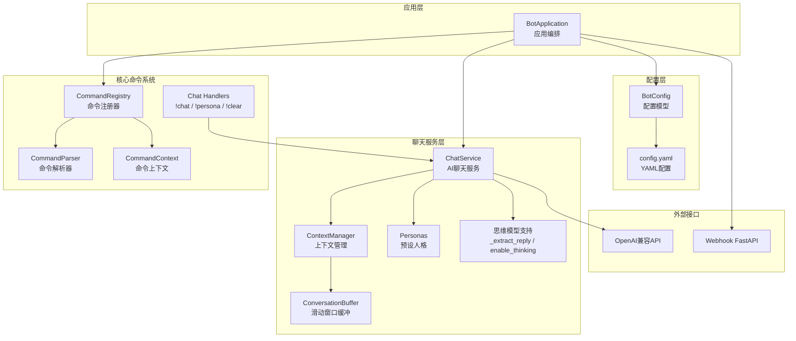
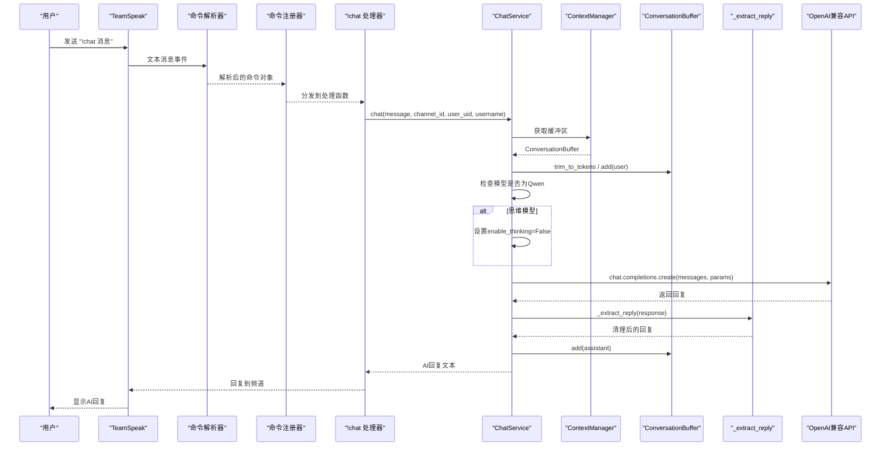
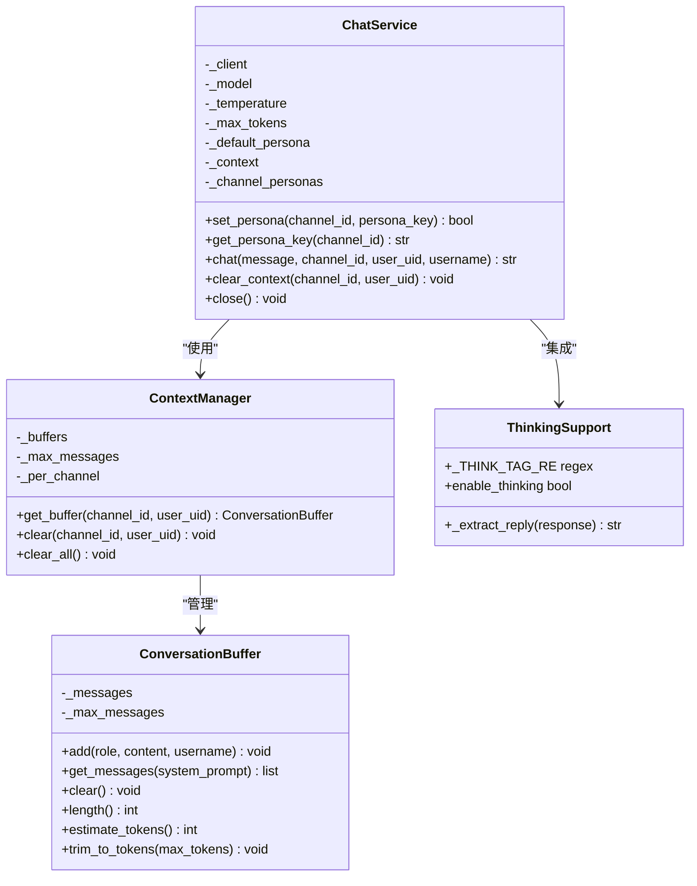
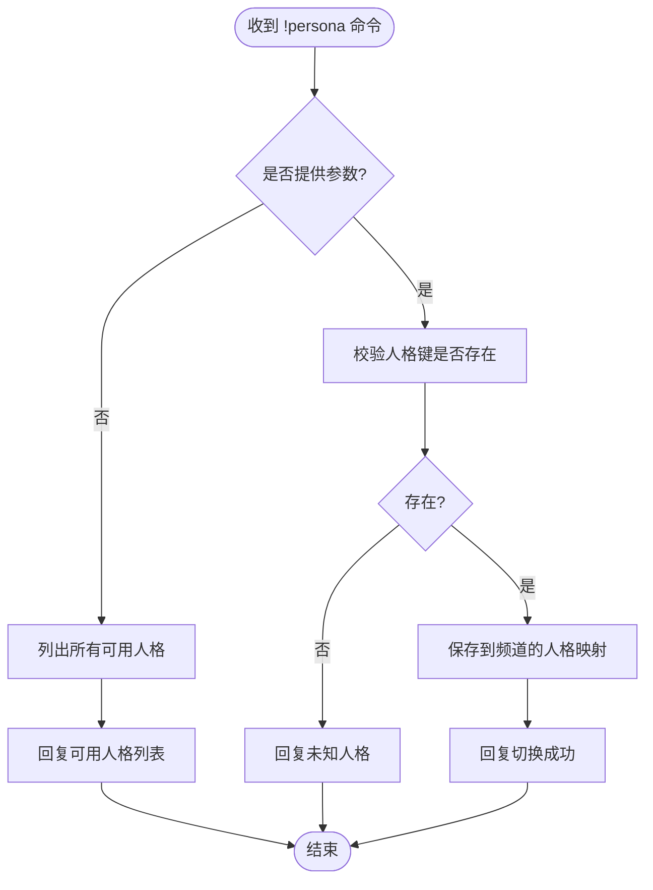
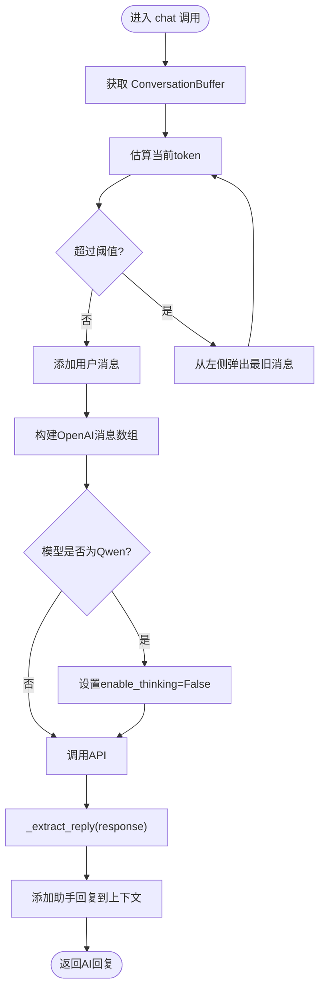
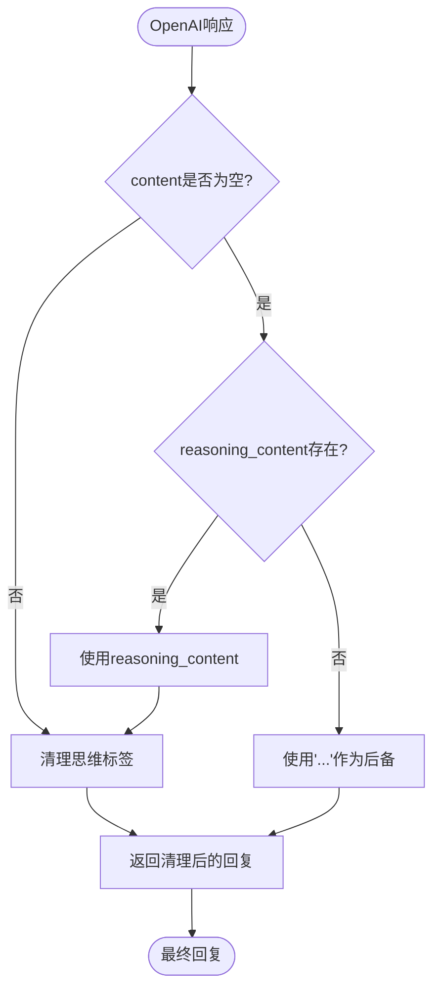
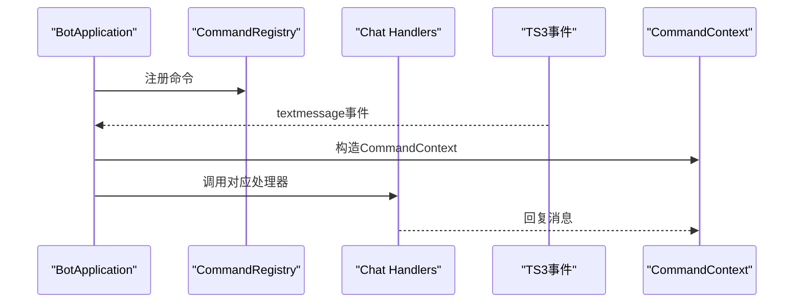
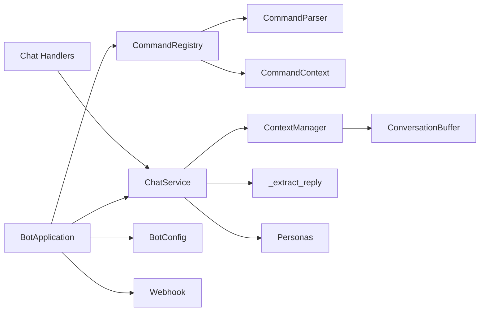

# AI聊天服务

<cite>
**本文引用的文件**
- [bot/app.py](file://bot/app.py)
- [bot/config.py](file://bot/config.py)
- [bot/services/chat/service.py](file://bot/services/chat/service.py)
- [bot/services/chat/context.py](file://bot/services/chat/context.py)
- [bot/services/chat/personas.py](file://bot/services/chat/personas.py)
- [bot/core/commands/handlers/chat.py](file://bot/core/commands/handlers/chat.py)
- [bot/core/commands/registry.py](file://bot/core/commands/registry.py)
- [bot/core/commands/parser.py](file://bot/core/commands/parser.py)
- [bot/core/commands/context.py](file://bot/core/commands/context.py)
- [config/config.yaml](file://config/config.yaml)
- [bot/web/webhook.py](file://bot/web/webhook.py)
- [tests/test_chat_context.py](file://tests/test_chat_context.py)
</cite>

## 目录
1. [简介](#简介)
2. [项目结构](#项目结构)
3. [核心组件](#核心组件)
4. [架构总览](#架构总览)
5. [详细组件分析](#详细组件分析)
6. [依赖分析](#依赖分析)
7. [性能考量](#性能考量)
8. [故障排查指南](#故障排查指南)
9. [结论](#结论)
10. [附录](#附录)

## 简介
本文件为AI聊天服务的技术文档，聚焦以下目标：
- 深入解释聊天服务的架构设计与实现原理，包括与OpenAI兼容API的集成方式
- 详细说明人格化系统的实现机制（预设角色配置与动态切换）
- 阐述上下文管理策略（对话历史维护、令牌控制与内存优化）
- **新增**：思维模型支持与回复提取机制（_extract_reply函数、enable_thinking参数、/no_think指令）
- 提供API集成的最佳实践与安全考虑
- 给出聊天机器人的配置选项与自定义指南

该服务以TeamSpeak机器人为核心入口，通过命令系统触发AI聊天能力，并基于OpenAI兼容接口进行推理调用。现已增强对思维模型（如Qwen3）的专门支持。

## 项目结构
整体采用分层+模块化的组织方式：
- 应用层：应用编排与生命周期管理
- 核心命令系统：命令注册、解析与上下文封装
- 聊天服务层：AI聊天、上下文管理、人格化、思维模型支持
- 配置层：类型安全的配置模型与YAML加载
- Webhook层：可选的外部通知接收端点

**图示来源**
- [bot/app.py:27-111](file://bot/app.py#L27-L111)
- [bot/core/commands/registry.py:28-94](file://bot/core/commands/registry.py#L28-L94)
- [bot/core/commands/parser.py:22-67](file://bot/core/commands/parser.py#L22-L67)
- [bot/core/commands/context.py:13-70](file://bot/core/commands/context.py#L13-L70)
- [bot/services/chat/service.py:15-155](file://bot/services/chat/service.py#L15-L155)
- [bot/services/chat/context.py:18-101](file://bot/services/chat/context.py#L18-L101)
- [bot/services/chat/personas.py:5-52](file://bot/services/chat/personas.py#L5-L52)
- [bot/config.py:125-160](file://bot/config.py#L125-L160)
- [config/config.yaml:27-37](file://config/config.yaml#L27-L37)
- [bot/web/webhook.py:32-76](file://bot/web/webhook.py#L32-L76)

**章节来源**
- [bot/app.py:27-111](file://bot/app.py#L27-L111)
- [bot/config.py:125-160](file://bot/config.py#L125-L160)
- [config/config.yaml:27-37](file://config/config.yaml#L27-L37)

## 核心组件
- BotApplication：负责装配所有子系统（命令注册、事件订阅、服务启动），并协调生命周期
- ChatService：封装OpenAI兼容API调用，负责人格化、上下文管理、回复生成与思维模型支持
- ContextManager/ConversationBuffer：实现按频道或用户维度的滑动窗口上下文，支持令牌级裁剪
- Personas：内置多个人格模板，支持动态切换，现包含思维模型禁用指令
- 命令系统：!chat、!persona、!clear等命令处理器，连接TS3消息事件与ChatService
- 配置系统：BotConfig与config.yaml，集中管理API密钥、模型参数、上下文窗口等
- **新增**：思维模型支持：_extract_reply函数处理思维模型回复提取，enable_thinking参数控制思维链

**章节来源**
- [bot/app.py:39-111](file://bot/app.py#L39-L111)
- [bot/services/chat/service.py:15-155](file://bot/services/chat/service.py#L15-L155)
- [bot/services/chat/context.py:18-101](file://bot/services/chat/context.py#L18-L101)
- [bot/services/chat/personas.py:5-52](file://bot/services/chat/personas.py#L5-L52)
- [bot/core/commands/handlers/chat.py:18-81](file://bot/core/commands/handlers/chat.py#L18-L81)
- [bot/config.py:63-72](file://bot/config.py#L63-L72)
- [config/config.yaml:27-37](file://config/config.yaml#L27-L37)

## 架构总览
AI聊天服务的运行流程如下：
- 用户在TS3中发送命令（如!chat），由命令解析器识别并构造CommandContext
- Chat命令处理器调用ChatService.chat，选择当前频道的人格模板
- ChatService根据上下文管理器获取或创建ConversationBuffer
- 上下文缓冲区在必要时进行令牌级裁剪，然后构建OpenAI兼容的消息数组
- **新增**：针对Qwen3等思维模型，自动设置enable_thinking=False参数
- 通过AsyncOpenAI客户端发起API请求，得到回复后调用_extract_reply函数提取可用回复
- 将助手消息加入上下文并返回

**图示来源**
- [bot/core/commands/parser.py:22-67](file://bot/core/commands/parser.py#L22-L67)
- [bot/core/commands/registry.py:68-82](file://bot/core/commands/registry.py#L68-L82)
- [bot/core/commands/handlers/chat.py:21-40](file://bot/core/commands/handlers/chat.py#L21-L40)
- [bot/services/chat/service.py:90-150](file://bot/services/chat/service.py#L90-L150)
- [bot/services/chat/context.py:62-66](file://bot/services/chat/context.py#L62-L66)

## 详细组件分析

### ChatService：OpenAI兼容API集成与上下文管理
- OpenAI兼容客户端：使用AsyncOpenAI，支持自定义base_url与api_key
- 参数化调用：模型、温度、最大输出tokens、上下文窗口大小
- 人格化：根据频道获取当前人格模板，注入system prompt
- **新增**：思维模型支持：自动检测Qwen模型并设置enable_thinking=False
- 上下文裁剪：在添加用户消息前，先按令牌阈值裁剪旧消息
- **新增**：回复提取：_extract_reply函数处理思维模型回复提取与标签清理
- 错误处理：捕获API异常并返回友好提示

**图示来源**
- [bot/services/chat/service.py:15-155](file://bot/services/chat/service.py#L15-L155)
- [bot/services/chat/context.py:68-101](file://bot/services/chat/context.py#L68-L101)

**章节来源**
- [bot/services/chat/service.py:24-48](file://bot/services/chat/service.py#L24-L48)
- [bot/services/chat/service.py:90-150](file://bot/services/chat/service.py#L90-L150)
- [bot/services/chat/context.py:18-66](file://bot/services/chat/context.py#L18-L66)

### 人格化系统：预设角色与动态切换
- 预设角色：内置多种人格模板，每项包含名称、描述与system prompt
- **新增**：思维模型禁用指令：/_no_think指令自动附加到所有system prompt
- 动态切换：按频道维度设置人格键，未设置则回退到默认人格
- 列表查询：!persona命令可列出可用人格并标注当前状态

**图示来源**
- [bot/core/commands/handlers/chat.py:42-70](file://bot/core/commands/handlers/chat.py#L42-L70)
- [bot/services/chat/personas.py:5-52](file://bot/services/chat/personas.py#L5-L52)

**章节来源**
- [bot/core/commands/handlers/chat.py:42-70](file://bot/core/commands/handlers/chat.py#L42-L70)
- [bot/services/chat/personas.py:5-52](file://bot/services/chat/personas.py#L5-L52)

### 上下文管理策略：历史维护、令牌控制与内存优化
- 缓冲区结构：基于双端队列的滑动窗口，限制最大消息数
- 令牌估算：按字符长度粗略估算token数量（中文更密集）
- 裁剪策略：超过阈值时从左侧弹出最旧消息，直到满足上限
- 隔离维度：支持按频道隔离或按用户隔离两种模式
- 用户名嵌入：在system prompt之外，将用户名嵌入用户消息内容，帮助区分说话者

**图示来源**
- [bot/services/chat/context.py:57-66](file://bot/services/chat/context.py#L57-L66)
- [bot/services/chat/context.py:32-47](file://bot/services/chat/context.py#L32-L47)
- [bot/services/chat/service.py:120-150](file://bot/services/chat/service.py#L120-L150)

**章节来源**
- [bot/services/chat/context.py:18-101](file://bot/services/chat/context.py#L18-L101)
- [bot/services/chat/service.py:90-150](file://bot/services/chat/service.py#L90-L150)
- [tests/test_chat_context.py:6-97](file://tests/test_chat_context.py#L6-L97)

### 思维模型支持：回复提取与标签清理
- **新增**：_extract_reply函数：专门处理思维模型（如Qwen3）的回复提取
- **新增**：思维标签清理：使用正则表达式清理"\u2055..."\u2055"格式的思维标签
- **新增**：enable_thinking参数：自动检测Qwen模型并设置enable_thinking=False
- **新增**：/no_think指令：在system prompt中自动附加"/no_think"指令
- **新增**：reasoning_content支持：当content为空时，尝试使用reasoning_content作为后备

**图示来源**
- [bot/services/chat/service.py:19-42](file://bot/services/chat/service.py#L19-L42)
- [bot/services/chat/personas.py:5-7](file://bot/services/chat/personas.py#L5-L7)

**章节来源**
- [bot/services/chat/service.py:19-42](file://bot/services/chat/service.py#L19-L42)
- [bot/services/chat/service.py:123-130](file://bot/services/chat/service.py#L123-L130)
- [bot/services/chat/personas.py:5-7](file://bot/services/chat/personas.py#L5-L7)

### 命令系统与应用编排
- 命令注册：装饰器式注册，支持别名与帮助信息
- 命令解析：基于shlex的安全分割，支持引号包裹参数
- 命令上下文：封装调用者信息与回复方法（私聊/频道）
- 应用启动：注册命令、订阅事件、连接TS3、启动调度与Webhook

**图示来源**
- [bot/app.py:140-198](file://bot/app.py#L140-L198)
- [bot/core/commands/registry.py:35-66](file://bot/core/commands/registry.py#L35-L66)
- [bot/core/commands/parser.py:22-67](file://bot/core/commands/parser.py#L22-L67)
- [bot/core/commands/context.py:52-70](file://bot/core/commands/context.py#L52-L70)
- [bot/core/commands/handlers/chat.py:21-81](file://bot/core/commands/handlers/chat.py#L21-L81)

**章节来源**
- [bot/core/commands/registry.py:28-94](file://bot/core/commands/registry.py#L28-L94)
- [bot/core/commands/parser.py:22-67](file://bot/core/commands/parser.py#L22-L67)
- [bot/core/commands/context.py:13-70](file://bot/core/commands/context.py#L13-L70)
- [bot/core/commands/handlers/chat.py:18-81](file://bot/core/commands/handlers/chat.py#L18-L81)
- [bot/app.py:140-198](file://bot/app.py#L140-L198)

### 配置系统与环境变量插值
- 类型安全：Pydantic模型定义各模块配置项
- 环境变量插值：支持${VAR}占位符替换
- 默认值：未提供配置文件时仍可运行（密钥通过环境变量注入）

**章节来源**
- [bot/config.py:125-160](file://bot/config.py#L125-L160)
- [config/config.yaml:27-37](file://config/config.yaml#L27-L37)

## 依赖分析
- 组件耦合
  - ChatService依赖ContextManager、Personas与_regex模块；ContextManager内部持有多个ConversationBuffer实例
  - 命令处理器依赖ChatService与CommandContext；BotApplication负责装配与事件绑定
  - **新增**：ChatService依赖_regex模块进行思维标签清理
- 外部依赖
  - OpenAI兼容API：AsyncOpenAI客户端
  - FastAPI/Webhook：可选的外部通知接收端点
- 可能的循环依赖
  - 当前模块间为单向依赖，未发现循环导入

**图示来源**
- [bot/app.py:39-111](file://bot/app.py#L39-L111)
- [bot/core/commands/registry.py:28-94](file://bot/core/commands/registry.py#L28-L94)
- [bot/services/chat/service.py:15-155](file://bot/services/chat/service.py#L15-L155)
- [bot/services/chat/context.py:68-101](file://bot/services/chat/context.py#L68-L101)
- [bot/services/chat/personas.py:5-52](file://bot/services/chat/personas.py#L5-L52)
- [bot/web/webhook.py:32-76](file://bot/web/webhook.py#L32-L76)

**章节来源**
- [bot/app.py:39-111](file://bot/app.py#L39-L111)
- [bot/services/chat/service.py:15-155](file://bot/services/chat/service.py#L15-L155)
- [bot/services/chat/context.py:68-101](file://bot/services/chat/context.py#L68-L101)
- [bot/services/chat/personas.py:5-52](file://bot/services/chat/personas.py#L5-L52)
- [bot/web/webhook.py:32-76](file://bot/web/webhook.py#L32-L76)

## 性能考量
- 令牌估算与裁剪
  - 使用字符长度估算token，中文密度更高，需结合实际模型调整阈值
  - 在添加新消息前裁剪，避免超出模型上下文上限
- 内存占用
  - 滑动窗口限制消息数量，deque的maxlen确保内存上限
  - 按频道或用户隔离可减少无关上下文，提高相关性
- 并发与稳定性
  - 异步OpenAI客户端支持并发请求
  - 命令处理与聊天调用解耦，避免阻塞TS3事件循环
- **新增**：思维模型优化
  - enable_thinking=False参数减少思维链开销
  - _extract_reply函数避免重复处理思维标签
- 日志与可观测性
  - 统一日志格式与级别，便于定位API错误与上下文异常

## 故障排查指南
- 常见问题
  - API调用失败：检查api_base_url、api_key与网络连通性
  - 令牌溢出：增大context_window或降低max_tokens，或缩短消息长度
  - 人格切换无效：确认人格键存在于预设集合中
  - 上下文未隔离：检查per_channel_context配置与调用时的channel_id
  - **新增**：思维模型回复异常：检查模型名称是否包含"qwen"，确认enable_thinking参数正确设置
  - **新增**：思维标签显示：确认/_no_think指令已正确附加到system prompt
- 定位手段
  - 查看日志中的异常堆栈
  - 使用!clearctx清理上下文后重试
  - 单元测试验证上下文裁剪与隔离行为
  - **新增**：检查_chat服务的日志输出，观察AI原始内容与清理后的回复

**章节来源**
- [bot/services/chat/service.py:140-145](file://bot/services/chat/service.py#L140-L145)
- [tests/test_chat_context.py:6-97](file://tests/test_chat_context.py#L6-L97)

## 结论
本AI聊天服务通过清晰的模块划分与强类型配置，实现了与OpenAI兼容API的稳定集成。其上下文管理与人格化机制既保证了对话连贯性，又兼顾了资源消耗与可扩展性。**新增的思维模型支持**进一步增强了对现代AI模型的兼容性，通过专门的回复提取与标签清理机制，确保了回复质量和用户体验。配合命令系统与可选Webhook，可在TeamSpeak环境中提供即开即用的智能聊天体验。

## 附录

### API集成最佳实践
- 安全
  - 将API密钥与Webhook密钥置于环境变量中，避免硬编码
  - Webhook启用鉴权头（Bearer secret），仅允许受信来源推送
- 稳定性
  - 为API调用设置合理的超时与重试策略
  - 对异常进行分类处理并记录上下文信息
- **新增**：思维模型最佳实践
  - 对于Qwen3等思维模型，确保enable_thinking=False参数正确设置
  - 验证/_no_think指令已正确附加到system prompt
  - 监控思维标签清理效果，确保回复质量
- 可观测性
  - 记录请求ID与上下文摘要，便于追踪
  - 监控API响应时间与错误率
  - **新增**：记录思维模型回复提取过程的日志

### 配置选项与自定义指南
- 关键配置项
  - chat.api_base_url：OpenAI兼容服务地址
  - chat.api_key：API密钥（SecretStr）
  - chat.model：模型名称
  - chat.temperature：采样温度
  - chat.max_tokens：最大输出token
  - chat.context_window：上下文消息窗口
  - chat.default_persona：默认人格键
  - chat.per_channel_context：是否按频道隔离上下文
- 自定义步骤
  - 新增人格：在预设字典中添加新的键值对，系统会自动附加/_no_think指令
  - 修改默认参数：在config.yaml中调整对应字段
  - 扩展命令：参考命令注册器装饰器模式新增处理器
  - **新增**：思维模型配置：确保模型名称包含"qwen"以启用思维模型支持

**章节来源**
- [bot/config.py:63-72](file://bot/config.py#L63-L72)
- [config/config.yaml:27-37](file://config/config.yaml#L27-L37)
- [bot/services/chat/personas.py:5-52](file://bot/services/chat/personas.py#L5-L52)
- [bot/core/commands/registry.py:35-66](file://bot/core/commands/registry.py#L35-L66)