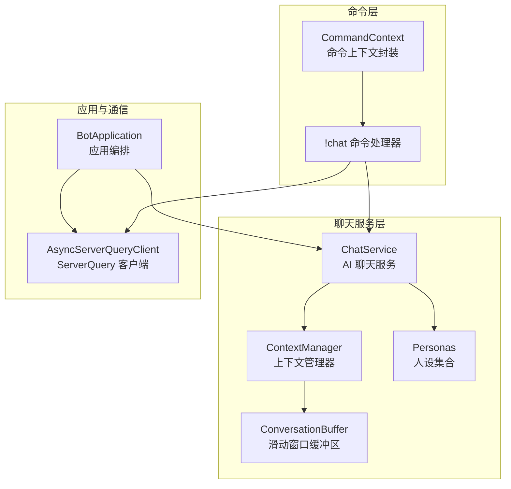
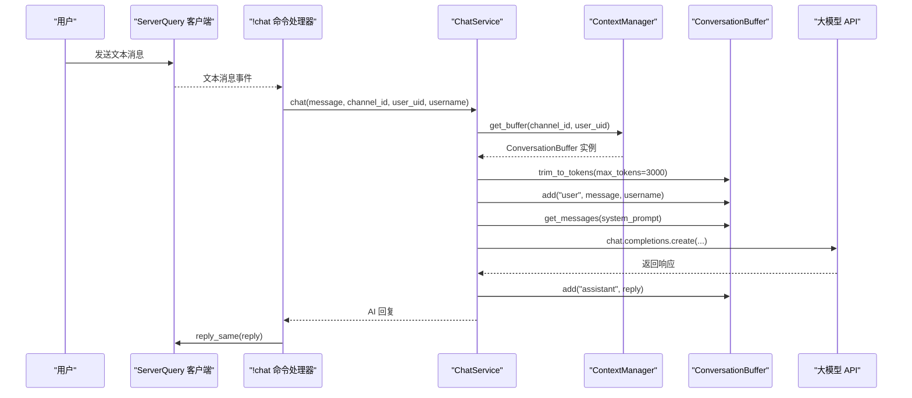
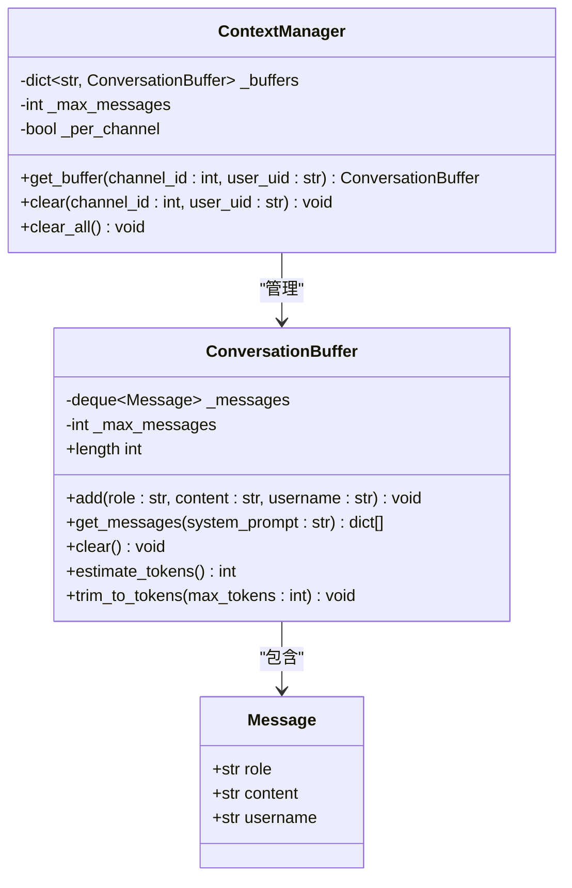
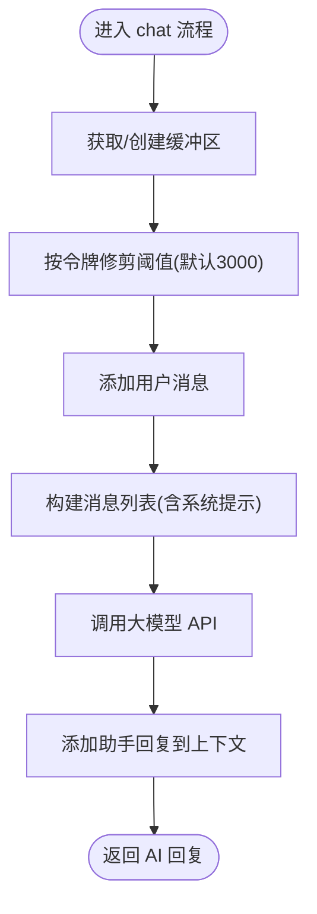
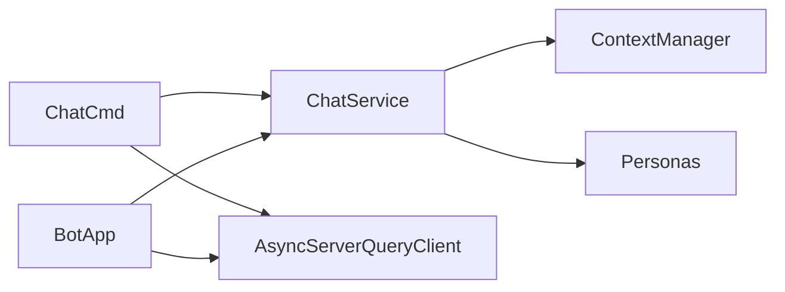

# 上下文管理

<cite>
**本文引用的文件**
- [bot/services/chat/context.py](file://bot/services/chat/context.py)
- [bot/services/chat/service.py](file://bot/services/chat/service.py)
- [bot/services/chat/personas.py](file://bot/services/chat/personas.py)
- [bot/core/commands/handlers/chat.py](file://bot/core/commands/handlers/chat.py)
- [bot/core/commands/context.py](file://bot/core/commands/context.py)
- [bot/app.py](file://bot/app.py)
- [bot/core/serverquery/client.py](file://bot/core/serverquery/client.py)
- [bot/config.py](file://bot/config.py)
- [config/config.yaml](file://config/config.yaml)
- [tests/test_chat_context.py](file://tests/test_chat_context.py)
</cite>

## 目录
1. [简介](#简介)
2. [项目结构](#项目结构)
3. [核心组件](#核心组件)
4. [架构总览](#架构总览)
5. [详细组件分析](#详细组件分析)
6. [依赖分析](#依赖分析)
7. [性能考量](#性能考量)
8. [故障排查指南](#故障排查指南)
9. [结论](#结论)
10. [附录](#附录)

## 简介
本技术文档围绕上下文管理系统展开，重点解释 ContextManager 类的设计与消息缓冲区实现机制，涵盖：
- 按频道与用户的上下文隔离策略
- 令牌感知的上下文修剪算法（token 计算、阈值与性能优化）
- 消息历史的存储结构与访问模式（消息格式、时间戳管理、内存控制）
- 上下文清理与重置操作指南
- 并发访问安全机制与线程同步策略

## 项目结构
上下文管理位于聊天服务子系统中，与命令处理、应用编排、ServerQuery 客户端协同工作。关键文件如下：
- bot/services/chat/context.py：定义消息模型、滑动窗口缓冲区与上下文管理器
- bot/services/chat/service.py：AI 聊天服务，集成上下文管理器与人设系统
- bot/services/chat/personas.py：预置的人设集合与查询接口
- bot/core/commands/handlers/chat.py：聊天命令处理器，调用聊天服务
- bot/core/commands/context.py：命令上下文封装，提供回复工具
- bot/app.py：应用编排，注入聊天服务与 ServerQuery 客户端
- bot/core/serverquery/client.py：异步 ServerQuery 客户端，负责消息发送与事件分发
- bot/config.py 与 config/config.yaml：配置模型与默认配置

图表来源
- [bot/core/commands/handlers/chat.py:18-81](file://bot/core/commands/handlers/chat.py#L18-L81)
- [bot/services/chat/service.py:15-115](file://bot/services/chat/service.py#L15-L115)
- [bot/services/chat/context.py:18-101](file://bot/services/chat/context.py#L18-L101)
- [bot/services/chat/personas.py:1-48](file://bot/services/chat/personas.py#L1-L48)
- [bot/app.py:27-348](file://bot/app.py#L27-L348)
- [bot/core/serverquery/client.py:27-406](file://bot/core/serverquery/client.py#L27-L406)

章节来源
- [bot/services/chat/context.py:1-101](file://bot/services/chat/context.py#L1-L101)
- [bot/services/chat/service.py:1-115](file://bot/services/chat/service.py#L1-L115)
- [bot/core/commands/handlers/chat.py:1-81](file://bot/core/commands/handlers/chat.py#L1-L81)
- [bot/app.py:1-348](file://bot/app.py#L1-L348)
- [bot/core/serverquery/client.py:1-406](file://bot/core/serverquery/client.py#L1-L406)

## 核心组件
- Message：单条消息的数据结构，包含角色、内容与用户名字段
- ConversationBuffer：滑动窗口缓冲区，维护最近 N 条消息，支持系统提示注入、令牌估算与按令牌修剪
- ContextManager：按频道或用户维度管理多个 ConversationBuffer，提供获取、清理与清空能力
- ChatService：AI 聊天服务，负责人设选择、上下文构建、调用大模型 API、添加助手回复到上下文
- CommandContext：命令上下文封装，提供私聊与频道回复等便捷方法
- AsyncServerQueryClient：异步 ServerQuery 客户端，负责文本消息发送与事件分发

章节来源
- [bot/services/chat/context.py:9-101](file://bot/services/chat/context.py#L9-L101)
- [bot/services/chat/service.py:15-115](file://bot/services/chat/service.py#L15-L115)
- [bot/core/commands/context.py:13-70](file://bot/core/commands/context.py#L13-L70)
- [bot/core/serverquery/client.py:27-406](file://bot/core/serverquery/client.py#L27-L406)

## 架构总览
上下文管理贯穿命令处理、聊天服务与 ServerQuery 客户端之间的交互链路。命令处理器从 ServerQuery 事件中解析出用户消息，调用聊天服务；聊天服务根据人设与上下文构建请求，调用外部大模型 API，并将返回结果写回上下文缓冲区。

图表来源
- [bot/core/commands/handlers/chat.py:21-40](file://bot/core/commands/handlers/chat.py#L21-L40)
- [bot/services/chat/service.py:61-110](file://bot/services/chat/service.py#L61-L110)
- [bot/services/chat/context.py:68-101](file://bot/services/chat/context.py#L68-L101)

## 详细组件分析

### ContextManager 设计与上下文隔离
- 隔离策略
  - 按频道隔离：键为 "channel:{channel_id}"，同一频道共享上下文
  - 按用户隔离：键为 "user:{user_uid}"，同一用户跨频道共享上下文
- 缓冲区映射
  - 使用字典保存每个键对应的 ConversationBuffer，未命中则创建新缓冲区
- 清理策略
  - clear：清理指定键的缓冲区
  - clear_all：清空所有缓冲区

图表来源
- [bot/services/chat/context.py:68-101](file://bot/services/chat/context.py#L68-L101)
- [bot/services/chat/context.py:18-67](file://bot/services/chat/context.py#L18-L67)
- [bot/services/chat/context.py:9-16](file://bot/services/chat/context.py#L9-L16)

章节来源
- [bot/services/chat/context.py:68-101](file://bot/services/chat/context.py#L68-L101)

### ConversationBuffer 存储结构与访问模式
- 存储结构
  - 使用双端队列（deque）作为滑动窗口，最大长度由构造参数决定
  - 每条消息以 Message 数据类形式存储，包含角色、内容与用户名
- 访问模式
  - add：追加消息至队尾
  - get_messages：按 OpenAI API 格式输出，可选注入系统提示；用户消息可附加用户名前缀
  - clear：清空队列
  - length：当前消息数量
- 时间戳管理
  - 当前实现未显式记录时间戳；若需时间戳，可在 Message 中扩展字段并在 add 时填充

章节来源
- [bot/services/chat/context.py:18-67](file://bot/services/chat/context.py#L18-L67)

### 令牌感知的上下文修剪算法
- 令牌估算
  - 估算公式：按字符数估算，中文文本约每 3 个字符对应 1 个 token（估算因子）
- 修剪阈值
  - 默认阈值：3000 token
  - 可在调用方显式传入自定义阈值
- 修剪流程
  - 在新增用户消息前进行修剪，确保上下文不超过阈值
  - 采用 popleft 逐条移除最旧消息，直到满足阈值条件
- 性能优化策略
  - 使用双端队列的 popleft 实现 O(1) 的删除头部元素
  - 估算函数仅遍历现有消息，复杂度 O(n)
  - 建议：在高频场景下，可考虑缓存字符总数增量更新，减少重复计算

图表来源
- [bot/services/chat/service.py:61-110](file://bot/services/chat/service.py#L61-L110)
- [bot/services/chat/context.py:57-66](file://bot/services/chat/context.py#L57-L66)

章节来源
- [bot/services/chat/context.py:57-66](file://bot/services/chat/context.py#L57-L66)
- [bot/services/chat/service.py:85-89](file://bot/services/chat/service.py#L85-L89)

### 消息历史的存储结构与访问模式
- 消息格式
  - 输出格式遵循 OpenAI API 的 role/content 结构
  - 用户消息可附加用户名前缀，便于区分不同说话者
- 时间戳管理
  - 当前未实现时间戳字段；如需按时间排序或超时控制，可在 Message 扩展字段并调整 get_messages 行为
- 内存控制
  - 通过 deque 的 maxlen 控制最大消息数
  - 通过令牌修剪进一步限制上下文大小，避免内存膨胀

章节来源
- [bot/services/chat/context.py:32-47](file://bot/services/chat/context.py#L32-L47)
- [bot/services/chat/context.py:24-26](file://bot/services/chat/context.py#L24-L26)

### 上下文清理与重置操作指南
- 单个上下文清理
  - 通过 ContextManager.clear(channel_id, user_uid) 清空指定键的缓冲区
- 全量清理
  - 通过 ContextManager.clear_all() 清空所有缓冲区
- 命令入口
  - 提供 !clearctx 命令，调用聊天服务的 clear_context，实现按频道/用户维度的清理

章节来源
- [bot/services/chat/context.py:88-101](file://bot/services/chat/context.py#L88-L101)
- [bot/services/chat/service.py:112-115](file://bot/services/chat/service.py#L112-L115)
- [bot/core/commands/handlers/chat.py:71-81](file://bot/core/commands/handlers/chat.py#L71-L81)

### 并发访问安全机制与线程同步策略
- 现状分析
  - ContextManager 与 ConversationBuffer 未使用锁或原子操作，内部状态为纯 Python 字典与 deque
  - 应用层通过 BotApplication 启动与命令注册，命令处理器在事件回调中被调用
- 风险与建议
  - 若多协程同时访问同一键的缓冲区，可能出现竞态条件（如同时修剪与添加）
  - 建议在 ContextManager 层引入线程安全机制（如使用 asyncio.Lock 或在应用层串行化关键路径）
  - 对于高并发场景，建议将 get_buffer、trim_to_tokens、add 等关键操作包装为原子操作

章节来源
- [bot/services/chat/context.py:68-101](file://bot/services/chat/context.py#L68-L101)
- [bot/app.py:140-198](file://bot/app.py#L140-L198)

## 依赖分析
- 组件耦合
  - ChatService 依赖 ContextManager 与 Personas
  - 命令处理器依赖 ChatService 与 ServerQuery 客户端
  - BotApplication 注入并协调各组件
- 外部依赖
  - OpenAI 兼容 API 客户端用于生成回复
  - ServerQuery 客户端用于消息收发与事件订阅

图表来源
- [bot/services/chat/service.py:9-43](file://bot/services/chat/service.py#L9-L43)
- [bot/core/commands/handlers/chat.py:18-40](file://bot/core/commands/handlers/chat.py#L18-L40)
- [bot/app.py:65-74](file://bot/app.py#L65-L74)

章节来源
- [bot/services/chat/service.py:15-46](file://bot/services/chat/service.py#L15-L46)
- [bot/core/commands/handlers/chat.py:18-40](file://bot/core/commands/handlers/chat.py#L18-L40)
- [bot/app.py:65-74](file://bot/app.py#L65-L74)

## 性能考量
- 令牌估算与修剪
  - 估算复杂度 O(n)，n 为当前消息数；可通过增量缓存字符总数降低重复计算
  - 修剪复杂度 O(k)，k 为被移除的消息数
- 存储与内存
  - deque 的 maxlen 限制消息数量；令牌修剪进一步控制内存占用
  - 建议结合 context_window 与 max_tokens 双重约束
- I/O 与 API 调用
  - 大模型 API 调用为外部阻塞点，应保持上下文最小化以减少延迟
- 并发与锁
  - 当前未使用锁，建议在高并发场景引入细粒度锁或在应用层串行化关键路径

## 故障排查指南
- 常见问题
  - 上下文过大导致 API 调用失败：检查 context_window 与 max_tokens 配置，确认 trim_to_tokens 是否生效
  - 用户名未显示在用户消息中：确认 get_messages 是否正确处理 username 字段
  - 清理无效：确认调用 clear 或 clear_all 的键是否匹配 per_channel 设置
- 日志与异常
  - ChatService 在 API 调用异常时记录日志并返回错误提示
  - ServerQuery 客户端在连接丢失时自动重连，注意事件处理中的异常捕获

章节来源
- [bot/services/chat/service.py:101-103](file://bot/services/chat/service.py#L101-L103)
- [bot/core/serverquery/client.py:247-254](file://bot/core/serverquery/client.py#L247-L254)

## 结论
上下文管理系统通过 ContextManager 与 ConversationBuffer 实现了按频道或用户的上下文隔离，并以令牌感知的修剪算法保障上下文大小可控。配合 ChatService 的人设系统与命令处理器，形成完整的聊天闭环。建议在高并发场景引入线程安全机制，以提升稳定性与一致性。

## 附录
- 配置项参考
  - chat.context_window：上下文窗口大小（消息数）
  - chat.per_channel_context：是否按频道隔离
  - chat.max_tokens：单次 API 调用的最大 token 数
  - chat.default_persona：默认人设键
  - chat.api_base_url、chat.api_key、chat.model：大模型接入配置

章节来源
- [bot/config.py:63-72](file://bot/config.py#L63-L72)
- [config/config.yaml:28-36](file://config/config.yaml#L28-L36)