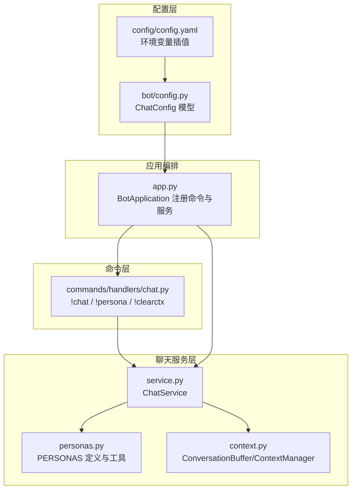
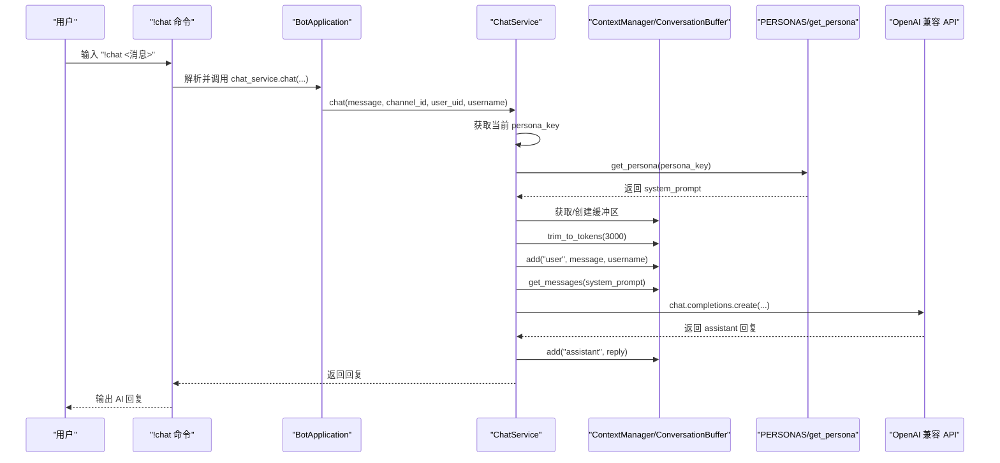
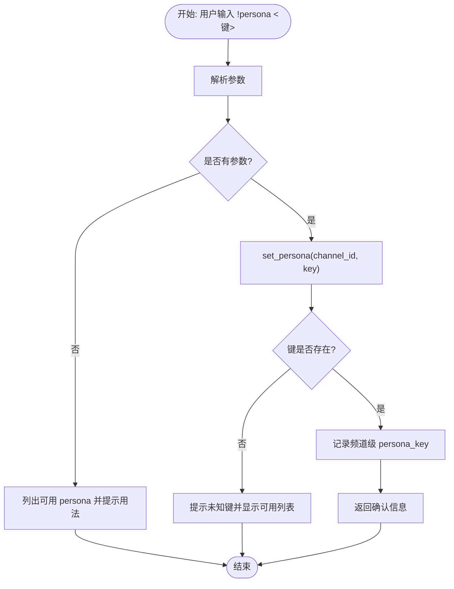
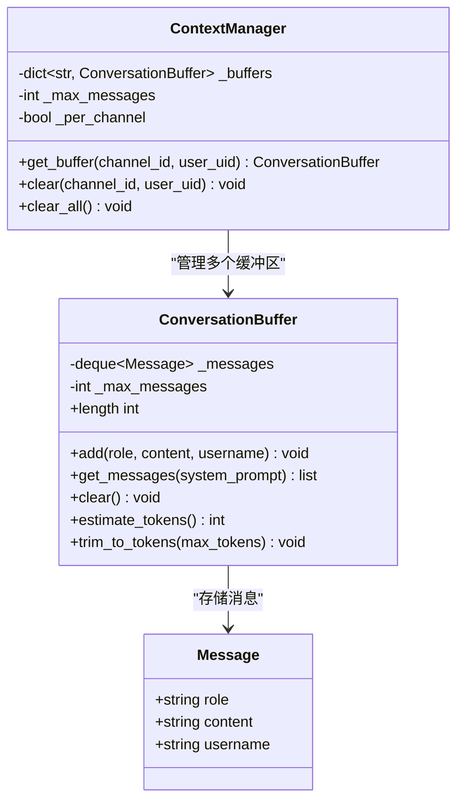
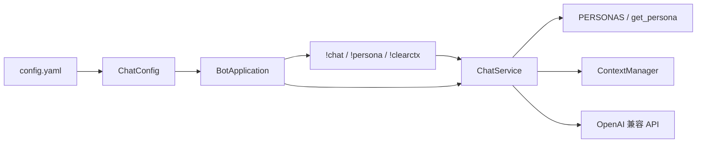

# 人格化系统

<cite>
**本文引用的文件**
- [bot/services/chat/personas.py](file://bot/services/chat/personas.py)
- [bot/services/chat/context.py](file://bot/services/chat/context.py)
- [bot/services/chat/service.py](file://bot/services/chat/service.py)
- [bot/services/chat/commands/handlers/chat.py](file://bot/services/chat/commands/handlers/chat.py)
- [bot/config.py](file://bot/config.py)
- [config/config.yaml](file://config/config.yaml)
- [bot/app.py](file://bot/app.py)
- [tests/test_chat_context.py](file://tests/test_chat_context.py)
</cite>

## 目录
1. [简介](#简介)
2. [项目结构](#项目结构)
3. [核心组件](#核心组件)
4. [架构总览](#架构总览)
5. [详细组件分析](#详细组件分析)
6. [依赖分析](#依赖分析)
7. [性能考量](#性能考量)
8. [故障排查指南](#故障排查指南)
9. [结论](#结论)
10. [附录：自定义人格开发指南](#附录自定义人格开发指南)

## 简介
本文件面向“人格化系统”的技术文档，聚焦于 PERSONAS 配置字典的结构与预设角色定义、系统提示词（system prompt）的编写规范与效果评估标准、get_persona 函数的工作原理与角色切换机制、不同人格的特点与适用场景（如 gamer_friend、helpful_assistant、creative_writer 等），以及自定义人格的开发指南、最佳实践与性能考虑。该系统通过命令驱动的人格切换与上下文管理，实现多通道隔离的对话体验，并与 Teamspeak3 服务查询模块集成，提供可扩展的 AI 对话能力。

## 项目结构
与人格化系统直接相关的模块分布如下：
- 人格定义与工具：bot/services/chat/personas.py
- 对话上下文与令牌修剪：bot/services/chat/context.py
- AI 聊天服务与角色切换：bot/services/chat/service.py
- 命令处理器（!chat、!persona、!clearctx）：bot/services/chat/commands/handlers/chat.py
- 配置模型与默认值：bot/config.py、config/config.yaml
- 应用编排与注册命令：bot/app.py
- 上下文行为测试：tests/test_chat_context.py

图表来源
- [bot/services/chat/personas.py:1-48](file://bot/services/chat/personas.py#L1-L48)
- [bot/services/chat/context.py:1-101](file://bot/services/chat/context.py#L1-L101)
- [bot/services/chat/service.py:1-115](file://bot/services/chat/service.py#L1-L115)
- [bot/services/chat/commands/handlers/chat.py:1-80](file://bot/services/chat/commands/handlers/chat.py#L1-L80)
- [bot/config.py:63-72](file://bot/config.py#L63-L72)
- [config/config.yaml:27-36](file://config/config.yaml#L27-L36)
- [bot/app.py:65-74](file://bot/app.py#L65-L74)

章节来源
- [bot/services/chat/personas.py:1-48](file://bot/services/chat/personas.py#L1-L48)
- [bot/services/chat/context.py:1-101](file://bot/services/chat/context.py#L1-L101)
- [bot/services/chat/service.py:1-115](file://bot/services/chat/service.py#L1-L115)
- [bot/services/chat/commands/handlers/chat.py:1-80](file://bot/services/chat/commands/handlers/chat.py#L1-L80)
- [bot/config.py:63-72](file://bot/config.py#L63-L72)
- [config/config.yaml:27-36](file://config/config.yaml#L27-L36)
- [bot/app.py:65-74](file://bot/app.py#L65-L74)

## 核心组件
- PERSONAS 字典：集中定义所有可用的人格键与元信息（名称、描述、系统提示词）。
- get_persona 函数：按键返回对应的人格配置；若不存在则返回空。
- list_personas 函数：输出（键、名称、描述）元组列表，用于命令展示。
- ChatService：封装 OpenAI 兼容 API 调用、上下文管理、角色切换与令牌修剪。
- ConversationBuffer/ContextManager：维护滑动窗口对话历史、用户名注入、令牌估算与修剪。
- 命令处理器：!chat 触发对话；!persona 切换角色；!clearctx 清除上下文。
- 配置模型：ChatConfig 提供默认角色、上下文窗口、温度、最大令牌数等参数。

章节来源
- [bot/services/chat/personas.py:5-47](file://bot/services/chat/personas.py#L5-L47)
- [bot/services/chat/service.py:15-115](file://bot/services/chat/service.py#L15-L115)
- [bot/services/chat/context.py:18-101](file://bot/services/chat/context.py#L18-L101)
- [bot/services/chat/commands/handlers/chat.py:21-80](file://bot/services/chat/commands/handlers/chat.py#L21-L80)
- [bot/config.py:63-72](file://bot/config.py#L63-L72)

## 架构总览
下图展示了从命令触发到 AI 返回响应的完整流程，以及角色切换与上下文管理的关键节点。

图表来源
- [bot/services/chat/commands/handlers/chat.py:21-41](file://bot/services/chat/commands/handlers/chat.py#L21-L41)
- [bot/services/chat/service.py:61-110](file://bot/services/chat/service.py#L61-L110)
- [bot/services/chat/context.py:32-66](file://bot/services/chat/context.py#L32-L66)
- [bot/services/chat/personas.py:40-42](file://bot/services/chat/personas.py#L40-L42)

## 详细组件分析

### PERSONAS 配置字典与系统提示词
- 结构要点
  - 键：字符串标识符（如 "gamer_friend"）
  - 值：包含 name、description、system_prompt 的字典
  - system_prompt 是 OpenAI API 的系统消息内容，决定模型的行为风格与回答格式
- 编写规范
  - 明确角色身份与语气（如“热情”“分析型”“懒散”）
  - 给出回复长度与风格约束（如“简短”“口语化”“专业但友好”）
  - 指定典型交互场景或任务（如“游戏攻略”“闲聊”“搞笑”）
- 效果评估标准
  - 一致性：同一角色在相同输入下的回复风格稳定
  - 可读性：中文表达自然、符合目标群体习惯
  - 控制性：通过长度与格式约束控制输出复杂度
  - 适配性：与上下文窗口和令牌限制相匹配

章节来源
- [bot/services/chat/personas.py:5-37](file://bot/services/chat/personas.py#L5-L37)

### get_persona 函数与角色切换机制
- 工作原理
  - get_persona(key)：从 PERSONAS 中按键取值，不存在则返回空
  - set_persona(channel_id, persona_key)：为指定频道设置 persona_key，若键不存在返回失败
  - get_persona_key(channel_id)：优先返回频道级覆盖，否则回退到默认 persona
- 切换流程
  - 命令处理：!persona 接收参数后调用 set_persona，成功则返回确认信息，失败则提示可用列表
  - 生效范围：按频道隔离，不同频道可拥有不同 persona
- 与上下文的关系
  - 切换后的新消息将携带新的 system_prompt，旧上下文仍保留，新旧风格可能交替出现

图表来源
- [bot/services/chat/commands/handlers/chat.py:42-69](file://bot/services/chat/commands/handlers/chat.py#L42-L69)
- [bot/services/chat/service.py:50-59](file://bot/services/chat/service.py#L50-L59)

章节来源
- [bot/services/chat/personas.py:40-47](file://bot/services/chat/personas.py#L40-L47)
- [bot/services/chat/service.py:50-59](file://bot/services/chat/service.py#L50-L59)
- [bot/services/chat/commands/handlers/chat.py:42-69](file://bot/services/chat/commands/handlers/chat.py#L42-L69)

### 不同人格的特点与适用场景
以下为现有预设人格的特性与适用场景说明（基于 PERSONAS 中的定义）：
- gamer_friend
  - 特点：热情、口语化、常用网络梗、回复简短
  - 适用场景：游戏频道闲聊、活跃气氛、快速互动
- game_researcher
  - 特点：专业、有条理、提供攻略与建议、适合长句说明
  - 适用场景：游戏问题咨询、策略讨论、知识分享
- lazy_member
  - 特点：懒散、简短、偶尔幽默或精辟
  - 适用场景：低参与度时段、轻松氛围、减少文字负担

章节来源
- [bot/services/chat/personas.py:5-37](file://bot/services/chat/personas.py#L5-L37)

### 自定义人格开发指南
- 系统提示词编写技巧
  - 明确角色定位与边界（如“只做游戏相关回答”）
  - 设定回复风格与长度约束（如“最多三句话”“避免正式用语”）
  - 给出典型对话示例与禁止事项（如“不要使用缩写”“不要输出代码块”）
  - 考虑文化与语言适配（中文语境、网络用语、表情符号使用）
- 角色行为模式设计
  - 一致性：同一角色在相似输入下保持一致语调与风格
  - 可控性：通过 system_prompt 限制输出复杂度与长度
  - 场景化：针对不同频道或用途设计专用 persona
- 测试方法
  - 单元测试：验证 PERSONAS 键存在、get_persona 返回正确结构
  - 集成测试：!persona 切换后，后续 !chat 的 system_prompt 生效
  - 行为测试：对比不同 persona 在相同输入下的回复差异
- 开发步骤
  - 在 PERSONAS 中新增键值对，包含 name、description、system_prompt
  - 在 ChatConfig 中设置 default_persona 或通过命令动态切换
  - 使用 !persona 列表查看与切换，结合 !chat 验证效果
  - 如需频道级覆盖，使用 set_persona(channel_id, key)

章节来源
- [bot/services/chat/personas.py:5-37](file://bot/services/chat/personas.py#L5-L37)
- [bot/config.py:63-72](file://bot/config.py#L63-L72)
- [config/config.yaml:35](file://config/config.yaml#L35)

### 上下文管理与令牌修剪
- ConversationBuffer
  - 滑动窗口：维护最近 N 条消息，超出容量自动丢弃最旧消息
  - 用户名注入：对 user 消息附加用户名，帮助区分说话者
  - 令牌估算：按字符数粗略估算令牌数（中文更密集）
  - 令牌修剪：超过阈值时从左侧弹出最旧消息，直到满足上限
- ContextManager
  - 按频道或按用户隔离上下文
  - 支持清理单个缓冲区与全部缓冲区

图表来源
- [bot/services/chat/context.py:9-101](file://bot/services/chat/context.py#L9-L101)

章节来源
- [bot/services/chat/context.py:18-101](file://bot/services/chat/context.py#L18-L101)
- [tests/test_chat_context.py:6-97](file://tests/test_chat_context.py#L6-L97)

### 命令与服务集成
- !chat：触发 ChatService.chat，携带当前 persona 的 system_prompt 与上下文
- !persona：列出可用 persona 或切换当前频道 persona
- !clearctx：清空当前上下文，便于重新开始

章节来源
- [bot/services/chat/commands/handlers/chat.py:21-80](file://bot/services/chat/commands/handlers/chat.py#L21-L80)
- [bot/services/chat/service.py:61-115](file://bot/services/chat/service.py#L61-L115)

## 依赖分析
- ChatService 依赖
  - PERSONAS 与 get_persona：获取 system_prompt
  - ContextManager：维护 per-channel 或 per-user 上下文
  - OpenAI 兼容客户端：发起 chat.completions 请求
- 命令层依赖
  - ChatService：执行聊天与上下文操作
  - list_personas：展示可用 persona
- 配置层依赖
  - ChatConfig：提供默认 persona、上下文窗口、温度、最大令牌数等
  - config.yaml：支持环境变量插值，注入 API 基地址、密钥、模型等

图表来源
- [bot/services/chat/service.py:9-12](file://bot/services/chat/service.py#L9-L12)
- [bot/services/chat/commands/handlers/chat.py:18-20](file://bot/services/chat/commands/handlers/chat.py#L18-L20)
- [bot/app.py:65-74](file://bot/app.py#L65-L74)
- [bot/config.py:63-72](file://bot/config.py#L63-L72)
- [config/config.yaml:27-36](file://config/config.yaml#L27-L36)

章节来源
- [bot/services/chat/service.py:9-12](file://bot/services/chat/service.py#L9-L12)
- [bot/services/chat/commands/handlers/chat.py:18-20](file://bot/services/chat/commands/handlers/chat.py#L18-L20)
- [bot/app.py:65-74](file://bot/app.py#L65-L74)
- [bot/config.py:63-72](file://bot/config.py#L63-L72)
- [config/config.yaml:27-36](file://config/config.yaml#L27-L36)

## 性能考量
- 令牌修剪
  - ChatService 在每次对话前对缓冲区进行令牌估算并修剪，防止超出模型上下文限制
  - 建议根据模型上下文长度与平均中文字符密度调整阈值
- 上下文窗口
  - ChatConfig.context_window 控制滑动窗口大小，影响记忆长度与内存占用
  - 较大的窗口可提升连贯性，但会增加令牌估算与修剪成本
- 默认 persona 与频道覆盖
  - 合理设置 default_persona，减少频繁切换带来的状态不一致
  - 频道级覆盖仅影响该频道，避免全局广播导致的上下文污染
- 日志与异常
  - API 调用异常会被记录并返回友好错误信息，避免中断对话流程

章节来源
- [bot/services/chat/service.py:85-86](file://bot/services/chat/service.py#L85-L86)
- [bot/services/chat/context.py:57-66](file://bot/services/chat/context.py#L57-L66)
- [bot/config.py:63-72](file://bot/config.py#L63-L72)

## 故障排查指南
- 无法切换 persona
  - 检查 persona_key 是否存在于 PERSONAS
  - 确认命令参数是否为空，必要时先列出可用 persona
- 回复异常或报错
  - 查看日志中 AI 聊天 API 错误信息
  - 确认 API 基地址、密钥与模型配置是否正确
- 上下文混乱
  - 使用 !clearctx 清空当前上下文
  - 检查 ContextManager 的 per_channel 设置是否符合预期
- 令牌超限
  - 适当缩短回复长度或减少上下文窗口
  - 确保 trim_to_tokens 逻辑正常工作

章节来源
- [bot/services/chat/commands/handlers/chat.py:42-69](file://bot/services/chat/commands/handlers/chat.py#L42-L69)
- [bot/services/chat/service.py:101-103](file://bot/services/chat/service.py#L101-L103)
- [bot/services/chat/context.py:57-66](file://bot/services/chat/context.py#L57-L66)

## 结论
人格化系统通过简洁的 PERSONAS 配置与命令驱动的角色切换，实现了灵活可控的对话风格。结合上下文管理与令牌修剪，系统在多频道场景下保持良好的稳定性与可扩展性。建议在实际部署中：
- 明确各频道的人格定位，避免风格冲突
- 优化 system_prompt 以平衡自然度与可控性
- 根据业务负载调整上下文窗口与令牌阈值
- 建立完善的测试与监控流程，确保角色切换与回复质量

## 附录：自定义人格开发指南
- 新增 PERSONAS 键值对，包含 name、description、system_prompt
- 在 ChatConfig 中设置 default_persona 或通过命令动态切换
- 使用 !persona 列表查看与切换，结合 !chat 验证效果
- 如需频道级覆盖，使用 set_persona(channel_id, key)
- 通过 tests/test_chat_context.py 中的断言思路，编写单元与集成测试

章节来源
- [bot/services/chat/personas.py:5-37](file://bot/services/chat/personas.py#L5-L37)
- [bot/config.py:63-72](file://bot/config.py#L63-L72)
- [config/config.yaml:35](file://config/config.yaml#L35)
- [tests/test_chat_context.py:6-97](file://tests/test_chat_context.py#L6-L97)