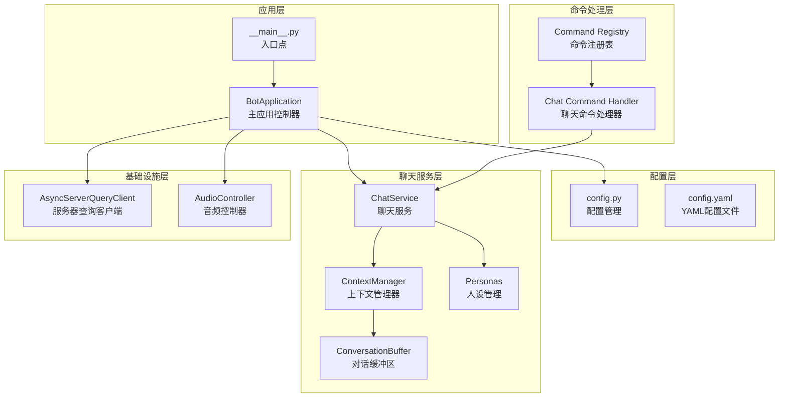
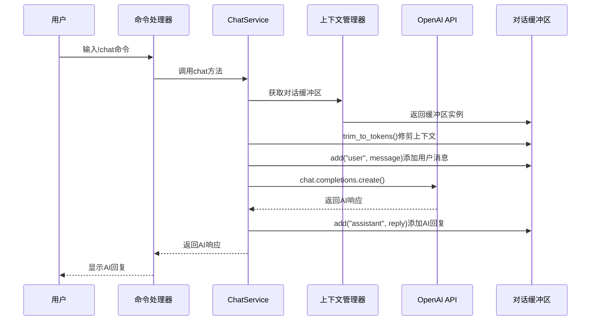
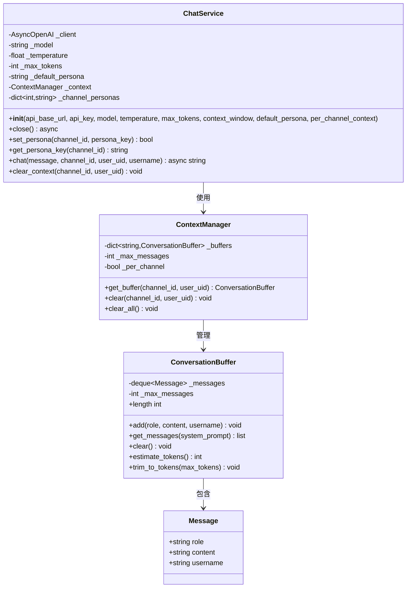
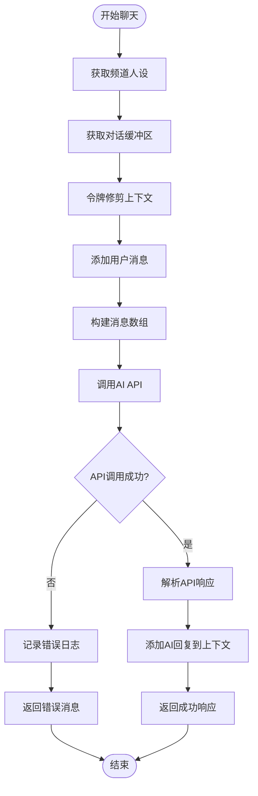
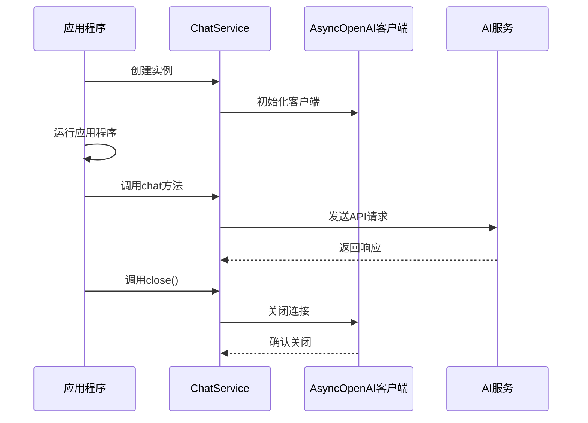
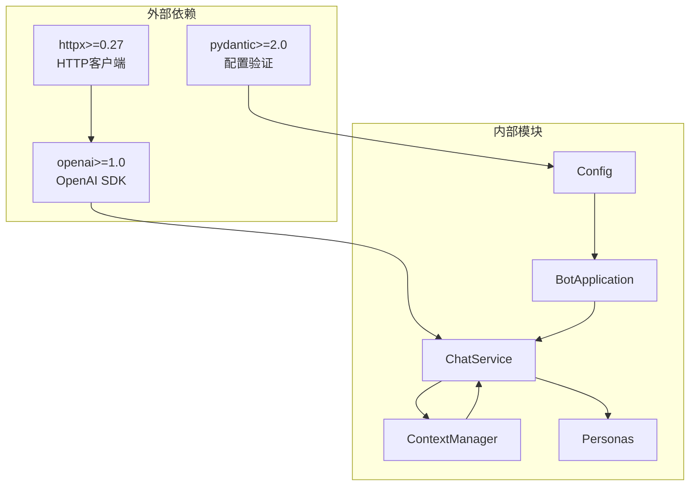

# 聊天服务架构

<cite>
**本文档引用的文件**
- [bot/services/chat/service.py](file://bot/services/chat/service.py)
- [bot/services/chat/context.py](file://bot/services/chat/context.py)
- [bot/services/chat/personas.py](file://bot/services/chat/personas.py)
- [bot/config.py](file://bot/config.py)
- [config/config.yaml](file://config/config.yaml)
- [bot/app.py](file://bot/app.py)
- [bot/__main__.py](file://bot/__main__.py)
- [bot/core/commands/handlers/chat.py](file://bot/core/commands/handlers/chat.py)
- [tests/test_chat_context.py](file://tests/test_chat_context.py)
</cite>

## 目录
1. [简介](#简介)
2. [项目结构](#项目结构)
3. [核心组件](#核心组件)
4. [架构概览](#架构概览)
5. [详细组件分析](#详细组件分析)
6. [依赖关系分析](#依赖关系分析)
7. [性能考虑](#性能考虑)
8. [故障排除指南](#故障排除指南)
9. [结论](#结论)

## 简介

本项目是一个集成了AI聊天功能的TeamSpeak3机器人系统。本文档深入分析了聊天服务架构，特别是ChatService类的设计原理和核心功能实现。该系统通过OpenAI兼容API提供智能对话能力，支持多个人设、上下文管理、令牌限制等功能，并提供了完整的错误处理和资源管理机制。

## 项目结构

该项目采用模块化的架构设计，主要分为以下几个核心模块：

**图表来源**
- [bot/app.py:27-111](file://bot/app.py#L27-L111)
- [bot/services/chat/service.py:15-46](file://bot/services/chat/service.py#L15-L46)
- [bot/services/chat/context.py:68-101](file://bot/services/chat/context.py#L68-L101)

**章节来源**
- [bot/app.py:1-348](file://bot/app.py#L1-L348)
- [bot/config.py:1-160](file://bot/config.py#L1-L160)

## 核心组件

### ChatService类

ChatService是聊天服务的核心类，负责与OpenAI兼容的API进行交互，并管理整个聊天流程。其主要特性包括：

- **OpenAI兼容API集成**：使用AsyncOpenAI客户端进行异步API调用
- **多个人设支持**：通过PERSONAS字典定义不同的AI角色
- **上下文管理**：维护每个频道和用户的独立对话历史
- **令牌感知的上下文修剪**：自动控制对话长度以适应API限制

### ContextManager和ConversationBuffer

这两个类共同实现了智能的对话上下文管理：

- **滑动窗口缓冲区**：限制对话历史的最大消息数量
- **令牌估算**：基于字符数估算令牌使用量（针对中文文本优化）
- **按频道或用户隔离**：支持独立的上下文管理策略

### Personas系统

预定义了三种不同的人格特征：
- **Gamer Friend**：热情的游戏伙伴，使用网络流行语
- **Game Researcher**：专业的游戏研究员，提供攻略建议
- **Lazy Member**：懒散的群友，回复简洁幽默

**章节来源**
- [bot/services/chat/service.py:15-115](file://bot/services/chat/service.py#L15-L115)
- [bot/services/chat/context.py:18-101](file://bot/services/chat/context.py#L18-L101)
- [bot/services/chat/personas.py:5-48](file://bot/services/chat/personas.py#L5-L48)

## 架构概览

系统采用分层架构设计，各层职责明确，耦合度低：

**图表来源**
- [bot/core/commands/handlers/chat.py:21-40](file://bot/core/commands/handlers/chat.py#L21-L40)
- [bot/services/chat/service.py:61-110](file://bot/services/chat/service.py#L61-L110)
- [bot/services/chat/context.py:62-66](file://bot/services/chat/context.py#L62-L66)

## 详细组件分析

### ChatService类设计

ChatService类采用了面向对象的设计模式，具有清晰的职责分离：

**图表来源**
- [bot/services/chat/service.py:15-46](file://bot/services/chat/service.py#L15-L46)
- [bot/services/chat/context.py:68-101](file://bot/services/chat/context.py#L68-L101)
- [bot/services/chat/context.py:9-16](file://bot/services/chat/context.py#L9-L16)

#### 异步客户端配置

ChatService使用AsyncOpenAI客户端进行异步API调用，配置参数包括：

- **api_base_url**：API基础URL，默认指向OpenAI兼容的服务端点
- **api_key**：API密钥，支持环境变量注入
- **model**：使用的AI模型，默认为"gpt-4o-mini"
- **temperature**：采样温度，控制响应的创造性，默认0.8
- **max_tokens**：最大生成令牌数，默认512

#### 错误处理机制

系统实现了多层次的错误处理策略：

1. **API调用异常捕获**：在chat方法中捕获所有API相关异常
2. **日志记录**：使用Python标准logging模块记录详细错误信息
3. **优雅降级**：返回用户友好的错误消息而非抛出异常
4. **资源清理**：提供close方法确保API连接正确关闭

**章节来源**
- [bot/services/chat/service.py:24-48](file://bot/services/chat/service.py#L24-L48)
- [bot/services/chat/service.py:94-103](file://bot/services/chat/service.py#L94-L103)

### 聊天处理流程

完整的聊天处理流程如下：

**图表来源**
- [bot/services/chat/service.py:61-110](file://bot/services/chat/service.py#L61-L110)

#### 消息接收和处理

1. **命令解析**：通过!chat命令触发聊天处理
2. **上下文隔离**：根据频道ID和用户UID获取独立的对话缓冲区
3. **令牌限制**：自动修剪超过限制的旧消息
4. **消息构建**：将用户消息和系统提示符组合成API格式

#### API调用和响应处理

1. **异步调用**：使用AsyncOpenAI进行非阻塞API调用
2. **参数传递**：将模型、温度、令牌限制等参数传递给API
3. **响应解析**：提取AI生成的回复内容
4. **上下文更新**：将AI回复添加到对话历史中

**章节来源**
- [bot/core/commands/handlers/chat.py:21-40](file://bot/core/commands/handlers/chat.py#L21-L40)
- [bot/services/chat/service.py:61-110](file://bot/services/chat/service.py#L61-L110)

### 配置参数详解

系统通过BotConfig类统一管理所有配置参数：

#### ChatConfig配置项

| 参数名 | 类型 | 默认值 | 作用描述 |
|--------|------|--------|----------|
| api_base_url | string | "https://api.openai.com/v1" | AI服务的基础URL |
| api_key | SecretStr | "" | API访问密钥 |
| model | string | "gpt-4o-mini" | 使用的AI模型名称 |
| temperature | float | 0.8 | 控制响应的随机性和创造性 |
| max_tokens | int | 512 | 单次调用的最大生成令牌数 |
| context_window | int | 20 | 上下文消息的最大数量 |
| default_persona | string | "gamer_friend" | 默认的人设标识 |
| per_channel_context | bool | True | 是否按频道隔离上下文 |

#### 最佳实践建议

1. **模型选择**：
   - 开发阶段：使用较小的模型如"gpt-4o-mini"
   - 生产环境：根据需求选择更强大的模型
   - 成本控制：平衡模型大小和成本

2. **温度设置**：
   - 0.3-0.5：回答更保守、准确
   - 0.7-0.9：更具创造性和多样性
   - 0.8：默认值，平衡创造性和准确性

3. **令牌限制**：
   - 根据模型的上下文长度限制调整
   - 考虑中文文本的令牌密度更高
   - 适当的令牌限制有助于控制成本

**章节来源**
- [bot/config.py:63-72](file://bot/config.py#L63-L72)
- [config/config.yaml:27-36](file://config/config.yaml#L27-L36)

### API连接管理和资源清理

系统实现了完善的资源管理机制：

**图表来源**
- [bot/app.py:303-329](file://bot/app.py#L303-L329)
- [bot/services/chat/service.py:47-48](file://bot/services/chat/service.py#L47-L48)

#### 生命周期管理

1. **初始化阶段**：在BotApplication.__init__中创建ChatService实例
2. **运行阶段**：通过命令处理器调用chat方法处理用户消息
3. **关闭阶段**：在BotApplication.stop中调用close方法清理资源

#### 连接池管理

- **异步客户端**：使用AsyncOpenAI的内置连接管理
- **自动重连**：客户端具备自动重连机制
- **超时处理**：合理的超时设置防止长时间阻塞

**章节来源**
- [bot/app.py:303-329](file://bot/app.py#L303-L329)
- [bot/services/chat/service.py:47-48](file://bot/services/chat/service.py#L47-L48)

## 依赖关系分析

系统采用松耦合的设计，主要依赖关系如下：

**图表来源**
- [requirements.txt:1-9](file://requirements.txt#L1-L9)
- [bot/app.py:9-22](file://bot/app.py#L9-L22)

### 外部依赖

1. **openai>=1.0**：提供AsyncOpenAI客户端用于异步API调用
2. **pydantic>=2.0**：用于配置文件的类型安全验证
3. **httpx>=0.27**：底层HTTP通信库

### 内部模块依赖

- **ChatService**依赖**ContextManager**和**Personas**
- **ContextManager**依赖**ConversationBuffer**
- **BotApplication**协调所有组件的生命周期

**章节来源**
- [requirements.txt:1-9](file://requirements.txt#L1-L9)
- [bot/app.py:9-22](file://bot/app.py#L9-L22)

## 性能考虑

### 上下文管理优化

1. **令牌感知修剪**：基于字符数估算令牌使用量，避免超出API限制
2. **滑动窗口缓冲区**：使用deque实现高效的队列操作
3. **内存优化**：通过maxlen参数限制内存使用

### 异步处理优势

1. **非阻塞I/O**：使用async/await避免主线程阻塞
2. **并发处理**：能够同时处理多个聊天请求
3. **资源利用率**：提高CPU和网络资源的利用效率

### 缓存策略

1. **人设缓存**：Personas字典提供快速的人设查找
2. **上下文缓存**：ContextManager缓存对话缓冲区实例
3. **配置缓存**：BotConfig实例在整个应用生命周期内复用

## 故障排除指南

### 常见问题和解决方案

#### API调用失败

**症状**：收到"AI回复出错了"的消息
**原因**：网络连接问题、API密钥无效、服务端错误
**解决方法**：
1. 检查API密钥配置
2. 验证网络连接
3. 查看日志文件获取详细错误信息

#### 上下文丢失

**症状**：聊天历史不连续
**原因**：进程重启导致内存中的上下文丢失
**解决方法**：
1. 实现持久化存储
2. 使用外部数据库保存对话历史
3. 考虑使用Redis等缓存系统

#### 令牌溢出

**症状**：API调用被拒绝
**原因**：上下文过长超出模型限制
**解决方法**：
1. 调整context_window参数
2. 优化消息格式减少令牌使用
3. 定期清理历史消息

**章节来源**
- [bot/services/chat/service.py:101-103](file://bot/services/chat/service.py#L101-L103)
- [bot/services/chat/context.py:62-65](file://bot/services/chat/context.py#L62-L65)

### 日志分析

系统使用Python标准logging模块，建议关注以下日志级别：

- **ERROR**：API调用错误、配置加载失败
- **WARNING**：网络连接警告、资源清理问题
- **INFO**：系统启动、停止、配置加载
- **DEBUG**：详细的调试信息

**章节来源**
- [bot/services/chat/service.py:101-103](file://bot/services/chat/service.py#L101-L103)

## 结论

本聊天服务架构展现了现代AI集成的最佳实践：

1. **模块化设计**：清晰的职责分离和接口定义
2. **异步处理**：充分利用异步编程的优势
3. **配置驱动**：灵活的配置管理和环境变量支持
4. **错误处理**：完善的异常处理和恢复机制
5. **性能优化**：令牌感知的上下文管理和资源优化

该架构为TeamSpeak3机器人系统提供了强大的AI聊天能力，支持多个人设、上下文管理、令牌限制等功能，为用户提供自然流畅的对话体验。通过合理的配置和资源管理，系统能够在保证性能的同时提供稳定可靠的服务。