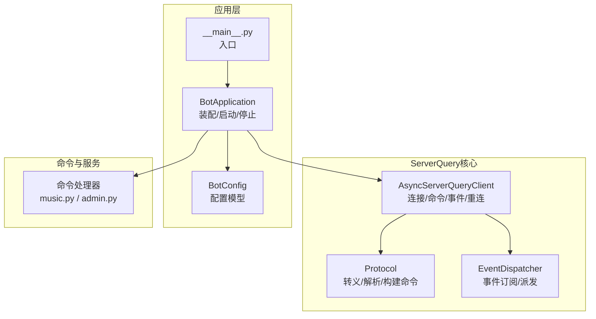
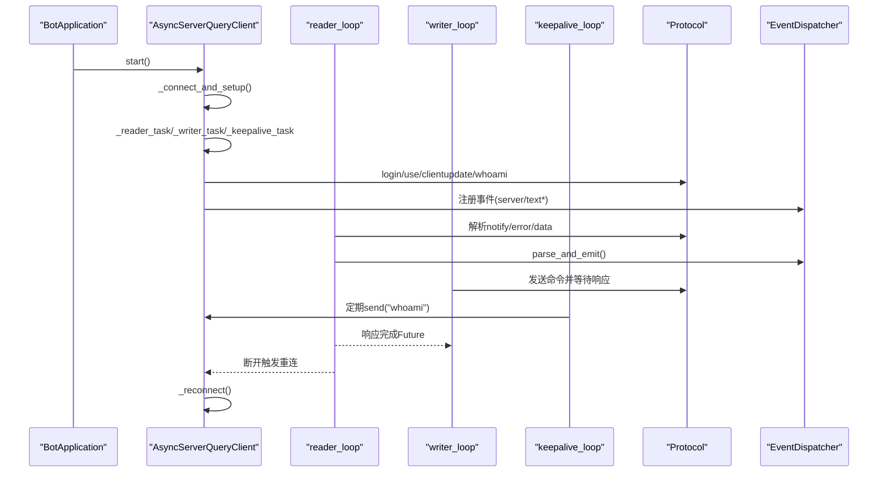
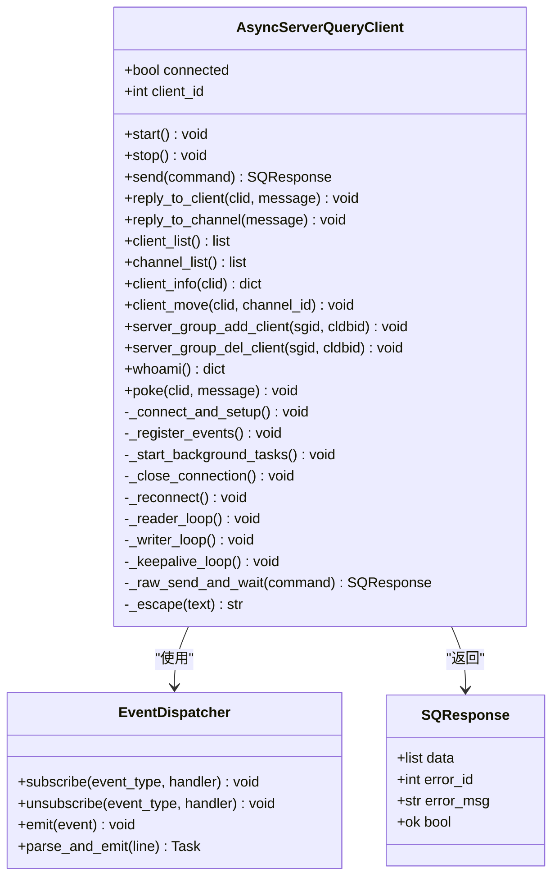
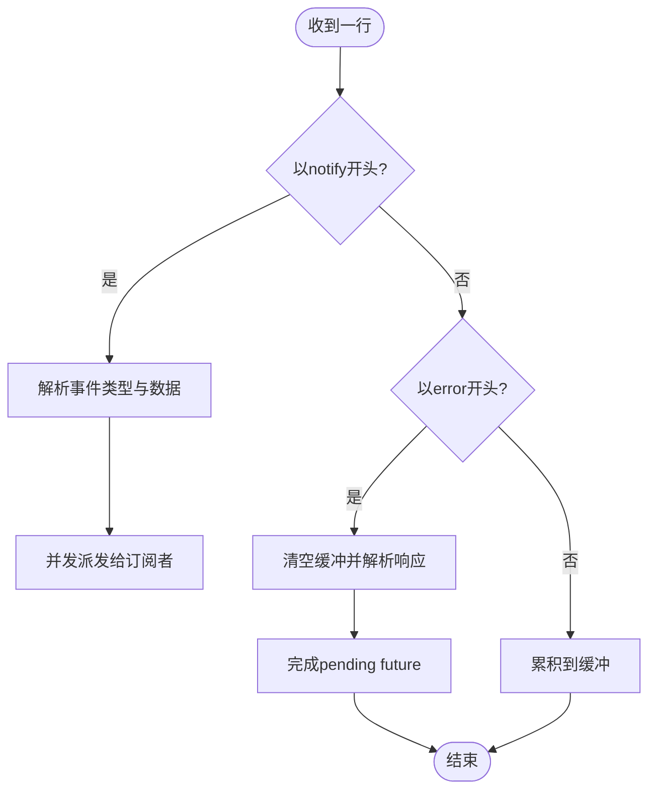
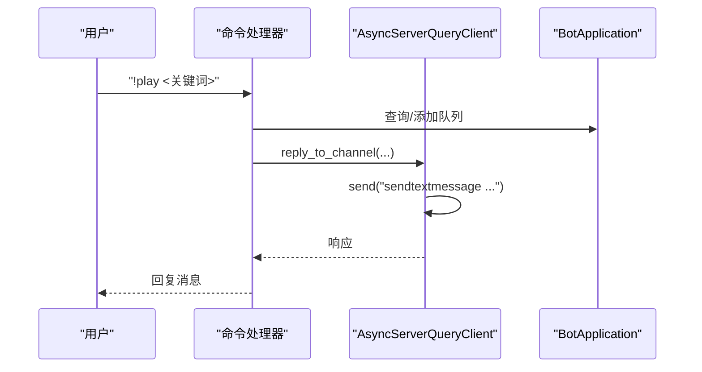
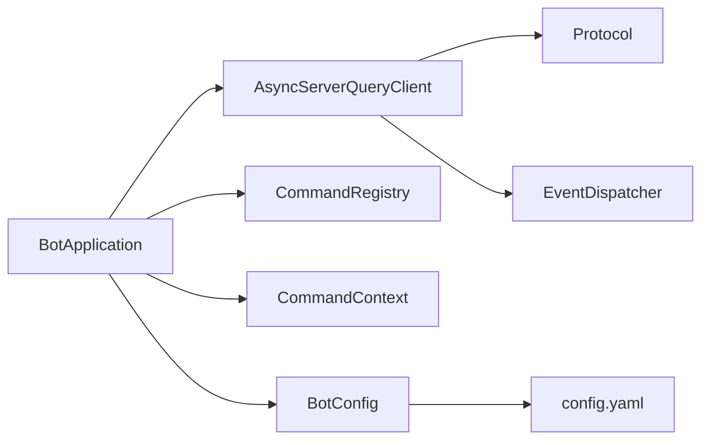

# ServerQuery客户端

<cite>
**本文引用的文件**
- [client.py](file://bot/core/serverquery/client.py)
- [protocol.py](file://bot/core/serverquery/protocol.py)
- [events.py](file://bot/core/serverquery/events.py)
- [app.py](file://bot/app.py)
- [config.py](file://bot/config.py)
- [__main__.py](file://bot/__main__.py)
- [music.py](file://bot/core/commands/handlers/music.py)
- [admin.py](file://bot/core/commands/handlers/admin.py)
- [test_protocol.py](file://tests/test_protocol.py)
- [config.yaml](file://config/config.yaml)
</cite>

## 目录
1. [简介](#简介)
2. [项目结构](#项目结构)
3. [核心组件](#核心组件)
4. [架构总览](#架构总览)
5. [详细组件分析](#详细组件分析)
6. [依赖关系分析](#依赖关系分析)
7. [性能考量](#性能考量)
8. [故障排查指南](#故障排查指南)
9. [结论](#结论)
10. [附录：API使用与最佳实践](#附录api使用与最佳实践)

## 简介
本技术文档围绕AsyncServerQueryClient展开，系统性阐述其异步连接管理、命令队列机制、后台任务处理、自动重连、连接生命周期、登录流程、虚拟服务器选择与昵称设置、命令发送与响应处理、错误处理策略、连接状态监控、超时处理与资源清理等实现细节，并提供客户端API使用示例与最佳实践。

## 项目结构
ServerQuery客户端位于bot/core/serverquery目录，配合事件分发器、协议编解码模块以及上层应用集成模块共同工作。配置由config模块加载，应用入口通过BotApplication进行组装与启动。

图表来源
- [client.py:1-406](file://bot/core/serverquery/client.py#L1-L406)
- [protocol.py:1-160](file://bot/core/serverquery/protocol.py#L1-L160)
- [events.py:1-156](file://bot/core/serverquery/events.py#L1-L156)
- [app.py:1-348](file://bot/app.py#L1-L348)
- [config.py:1-160](file://bot/config.py#L1-L160)
- [__main__.py:1-17](file://bot/__main__.py#L1-L17)
- [music.py:1-243](file://bot/core/commands/handlers/music.py#L1-L243)
- [admin.py:1-75](file://bot/core/commands/handlers/admin.py#L1-L75)

章节来源
- [client.py:1-406](file://bot/core/serverquery/client.py#L1-L406)
- [protocol.py:1-160](file://bot/core/serverquery/protocol.py#L1-L160)
- [events.py:1-156](file://bot/core/serverquery/events.py#L1-L156)
- [app.py:1-348](file://bot/app.py#L1-L348)
- [config.py:1-160](file://bot/config.py#L1-L160)
- [__main__.py:1-17](file://bot/__main__.py#L1-L17)

## 核心组件
- AsyncServerQueryClient：异步ServerQuery客户端，负责连接建立、登录、虚拟服务器选择、昵称设置、事件注册、命令队列、后台读写与保活、自动重连与资源清理。
- Protocol：协议编解码，包括转义/反转义、记录解析、响应解析、命令构建。
- EventDispatcher：事件分发器，订阅/取消订阅事件，安全调用回调，解析通知行并派发事件对象。
- BotApplication：应用入口，装配各子系统，连接ServerQuery，注册事件与命令，启动后台服务，优雅停机。
- 配置模块：BotConfig定义配置模型，支持环境变量插值；config.yaml提供默认配置样例。

章节来源
- [client.py:27-406](file://bot/core/serverquery/client.py#L27-L406)
- [protocol.py:38-160](file://bot/core/serverquery/protocol.py#L38-L160)
- [events.py:102-156](file://bot/core/serverquery/events.py#L102-L156)
- [app.py:27-348](file://bot/app.py#L27-L348)
- [config.py:36-160](file://bot/config.py#L36-L160)

## 架构总览
AsyncServerQueryClient采用“主循环+后台任务”的异步架构：
- 主循环负责连接建立与初始化（登录、use、clientupdate、whoami、事件注册）。
- 后台任务：
  - reader_loop：持续读取ServerQuery输出，区分notify事件与响应数据，解析并派发事件或完成等待中的Future。
  - writer_loop：从命令队列取出命令，串行发送并等待响应，完成后回传结果或异常。
  - keepalive_loop：周期性发送whoami维持连接活跃。
- 自动重连：reader_loop检测断开后触发指数退避重连，成功后重启后台任务。

图表来源
- [client.py:81-198](file://bot/core/serverquery/client.py#L81-L198)
- [client.py:201-290](file://bot/core/serverquery/client.py#L201-L290)
- [protocol.py:95-134](file://bot/core/serverquery/protocol.py#L95-L134)
- [events.py:139-156](file://bot/core/serverquery/events.py#L139-L156)

## 详细组件分析

### AsyncServerQueryClient 类
- 连接生命周期
  - start/stop：启动时执行连接与初始化，停止时取消后台任务、发送quit、关闭连接并清理状态。
  - _connect_and_setup：建立TCP连接，读取欢迎行，执行login、use、clientupdate、whoami，注册事件，标记连接就绪。
  - _close_connection：关闭writer、置空reader、清零client_id、置未连接。
  - _reconnect：指数退避重连，失败时逐步增大延迟，最大不超过阈值。
- 异步连接管理
  - 使用asyncio.open_connection建立连接，读取超时控制在合理范围。
  - 保持_connected标志与client_id，供上层判断与回复消息使用。
- 命令队列机制
  - _cmd_queue：队列中每个条目为(command, Future)，writer_loop按序出队发送，收到响应后set_result或set_exception。
  - send：入队后等待Future，超时30秒；若响应非ok则抛出ServerQueryError。
  - _raw_send_and_wait：连接初始化阶段使用的低级发送等待，绕过队列，避免后台任务尚未启动。
- 背景任务处理
  - reader_loop：读取行，遇到notify直接派发；遇到error行拼接完整响应并解析，完成pending_future；超时300秒视为心跳超时但不中断。
  - writer_loop：串行发送，连接断开或异常时设置future异常。
  - keepalive_loop：每240秒发送一次whoami维持连接。
- 自动重连
  - reader_loop断开或异常后置未连接并触发_reconnect；成功后重新启动reader/writer/keepalive任务。
- 登录流程、虚拟服务器选择与昵称设置
  - login(username, password)、use(virtual_server_id)、clientupdate(client_nickname=...)、whoami获取client_id。
- 命令发送机制与响应处理
  - send/build_command/ts3_escape：统一通过build_command构造命令字符串，参数值经ts3_escape转义。
  - parse_response：解析多行响应，识别banner行、数据行与error行，生成SQResponse对象。
- 错误处理策略
  - ServerQueryError：当响应error_id非0时抛出，携带错误码与消息。
  - reader_loop：断开时向等待future设置ConnectionError；writer_loop：连接断开时设置ConnectionError。
  - keepalive失败仅记录警告，不影响整体运行。
- 连接状态监控
  - connected属性暴露连接状态；client_id用于区分自消息与他人消息。
- 超时处理
  - reader.readline超时300秒，用于心跳；send等待Future超时30秒；_raw_send_and_wait读取响应超时30秒。
- 资源清理
  - stop中取消任务、drain退出命令、关闭writer、清空状态。

图表来源
- [client.py:27-406](file://bot/core/serverquery/client.py#L27-L406)
- [events.py:102-156](file://bot/core/serverquery/events.py#L102-L156)
- [protocol.py:63-74](file://bot/core/serverquery/protocol.py#L63-L74)

章节来源
- [client.py:27-406](file://bot/core/serverquery/client.py#L27-L406)
- [protocol.py:95-134](file://bot/core/serverquery/protocol.py#L95-L134)

### 协议与事件模块
- 协议模块
  - ts3_escape/ts3_unescape：对特殊字符进行ServerQuery协议转义/反转义。
  - parse_record/parse_record_list：解析键值对与管道分隔的记录列表。
  - parse_response：解析完整响应，忽略banner行，提取error与data。
  - build_command：拼接命令字符串，参数值转义，支持选项列表。
- 事件模块
  - SQEvent：事件载体，包含事件类型与数据字典。
  - 具体事件类：ClientJoinEvent、ClientLeaveEvent、TextMessageEvent、ClientMovedEvent。
  - EventDispatcher：订阅/取消订阅、并发安全派发、异常捕获与日志记录。
  - parse_and_emit：解析notify行并派发事件。

图表来源
- [client.py:201-254](file://bot/core/serverquery/client.py#L201-L254)
- [events.py:139-156](file://bot/core/serverquery/events.py#L139-L156)
- [protocol.py:95-134](file://bot/core/serverquery/protocol.py#L95-L134)

章节来源
- [protocol.py:38-160](file://bot/core/serverquery/protocol.py#L38-L160)
- [events.py:18-156](file://bot/core/serverquery/events.py#L18-L156)

### 应用集成与使用示例
- BotApplication装配
  - 从配置创建AsyncServerQueryClient实例，注册命令与事件监听，启动ServerQuery连接，启动调度器与Webhook。
  - stop时优雅关闭：停止Webhook、调度器、音频淡出、发送下线消息、关闭网络服务、断开ServerQuery。
- 命令上下文与回复
  - CommandContext封装调用元数据，提供reply方法通过AsyncServerQueryClient回复私信。
  - 命令处理器中可直接调用app.sq.xxx接口进行ServerQuery操作。
- 配置加载
  - 支持环境变量插值，config.yaml提供默认字段与示例。

图表来源
- [app.py:162-198](file://bot/app.py#L162-L198)
- [music.py:20-93](file://bot/core/commands/handlers/music.py#L20-L93)
- [client.py:342-364](file://bot/core/serverquery/client.py#L342-L364)

章节来源
- [app.py:27-348](file://bot/app.py#L27-L348)
- [music.py:1-243](file://bot/core/commands/handlers/music.py#L1-L243)
- [admin.py:1-75](file://bot/core/commands/handlers/admin.py#L1-L75)
- [config.py:136-160](file://bot/config.py#L136-L160)

## 依赖关系分析
- AsyncServerQueryClient依赖Protocol进行命令构建与响应解析，依赖EventDispatcher进行事件派发。
- BotApplication依赖AsyncServerQueryClient进行消息路由与命令执行，依赖CommandRegistry与CommandContext组织命令体系。
- 配置模块BotConfig与config.yaml为所有组件提供参数来源。

图表来源
- [client.py:8-13](file://bot/core/serverquery/client.py#L8-L13)
- [app.py:14-22](file://bot/app.py#L14-L22)
- [config.py:136-160](file://bot/config.py#L136-L160)
- [config.yaml:1-76](file://config/config.yaml#L1-76)

章节来源
- [client.py:1-406](file://bot/core/serverquery/client.py#L1-L406)
- [app.py:1-348](file://bot/app.py#L1-L348)
- [config.py:1-160](file://bot/config.py#L1-L160)
- [config.yaml:1-76](file://config/config.yaml#L1-L76)

## 性能考量
- 命令串行化：writer_loop按序发送，避免并发竞争，简化错误定位。
- 背压控制：命令队列作为背压点，防止过多并发请求导致ServerQuery压力过大。
- 保活策略：keepalive_loop每240秒一次，降低心跳频率，减少网络开销。
- 超时设置：读取超时300秒，发送等待30秒，兼顾稳定性与响应速度。
- 事件派发：并发安全地派发事件，避免阻塞reader_loop。
- 资源回收：stop中显式取消任务、drain退出命令、关闭连接，确保资源及时释放。

## 故障排查指南
- 连接失败
  - 检查主机/端口/凭据配置；确认ServerQuery服务可达且未被防火墙拦截。
  - 观察日志中“Reconnecting in …”提示，确认指数退避是否正常。
- 登录失败
  - 确认用户名与密码正确；检查ServerQuery权限是否允许登录。
- 命令超时
  - send等待30秒超时，检查网络延迟与ServerQuery负载；必要时增加超时或降级命令频率。
- 事件未到达
  - 确认事件注册是否成功；检查EventDispatcher订阅列表；验证notify行格式。
- 断线重连
  - reader_loop检测到断线会触发重连；观察日志中的“Reconnected successfully”或异常堆栈。
- 资源泄漏
  - 确保调用stop进行优雅停机；检查任务是否被取消、writer是否关闭。

章节来源
- [client.py:183-198](file://bot/core/serverquery/client.py#L183-L198)
- [client.py:201-254](file://bot/core/serverquery/client.py#L201-L254)
- [client.py:255-277](file://bot/core/serverquery/client.py#L255-L277)
- [client.py:278-289](file://bot/core/serverquery/client.py#L278-L289)

## 结论
AsyncServerQueryClient通过清晰的职责划分与稳健的异步架构，提供了可靠的ServerQuery通信能力。其命令队列、事件分发、保活与自动重连机制共同保障了在复杂场景下的稳定性与可维护性。结合BotApplication的装配与命令体系，可快速构建功能丰富的机器人应用。

## 附录：API使用与最佳实践

### 连接生命周期与登录流程
- 初始化：通过BotConfig注入主机、端口、用户名、密码、虚拟服务器ID与昵称。
- 启动：调用start()完成连接、登录、use、clientupdate、whoami与事件注册。
- 停止：调用stop()优雅关闭，取消后台任务、发送quit、关闭连接。

章节来源
- [client.py:81-149](file://bot/core/serverquery/client.py#L81-L149)
- [app.py:283-301](file://bot/app.py#L283-L301)
- [config.py:36-46](file://bot/config.py#L36-L46)

### 命令发送与响应处理
- send(command)：命令入队，等待Future，超时30秒；响应非ok时抛出ServerQueryError。
- build_command + ts3_escape：参数自动转义，避免协议错误。
- 响应解析：parse_response将多行响应转换为SQResponse对象，包含data与error信息。

章节来源
- [client.py:327-340](file://bot/core/serverquery/client.py#L327-L340)
- [protocol.py:137-160](file://bot/core/serverquery/protocol.py#L137-L160)
- [protocol.py:95-134](file://bot/core/serverquery/protocol.py#L95-L134)

### 事件订阅与处理
- 订阅：dispatcher.subscribe(event_type, handler)。
- 解析与派发：parse_and_emit(line)解析notify行并并发派发事件。
- 常见事件：textmessage、server、textserver、textchannel、textprivate。

章节来源
- [events.py:102-156](file://bot/core/serverquery/events.py#L102-L156)
- [client.py:151-164](file://bot/core/serverquery/client.py#L151-L164)

### 超时与重连策略
- 读取超时：300秒，用于心跳；发送等待：30秒；初始化读取：30秒。
- 重连：指数退避，最大延迟60秒；断线后自动触发。

章节来源
- [client.py:209-212](file://bot/core/serverquery/client.py#L209-L212)
- [client.py:282-287](file://bot/core/serverquery/client.py#L282-L287)
- [client.py:183-198](file://bot/core/serverquery/client.py#L183-L198)

### 资源清理与优雅停机
- stop中取消任务、drain退出命令、关闭writer、清空状态。
- 应用层stop中依次关闭Webhook、调度器、音频、网络服务与ServerQuery。

章节来源
- [client.py:87-109](file://bot/core/serverquery/client.py#L87-L109)
- [app.py:303-331](file://bot/app.py#L303-L331)

### 客户端API使用示例（路径）
- 私信回复：调用reply_to_client(clid, message)。
- 频道消息：调用reply_to_channel(message)。
- 列表查询：client_list()/channel_list()。
- 用户信息：client_info(clid)。
- 移动用户：client_move(clid, channel_id)。
- 组管理：server_group_add_client(sgid, cldbid)/server_group_del_client(sgid, cldbid)。
- 当前信息：whoami()。
- 戳一戳：poke(clid, message)。

章节来源
- [client.py:356-406](file://bot/core/serverquery/client.py#L356-L406)

### 最佳实践
- 命令发送：优先使用send(command)保证串行化与超时控制。
- 参数转义：使用build_command自动转义，避免手动拼接导致协议错误。
- 事件处理：在事件回调中避免长时间阻塞，必要时异步处理。
- 重连与超时：根据网络状况调整超时时间，合理利用keepalive。
- 资源管理：始终调用stop进行优雅停机，确保任务与连接被正确回收。
- 配置管理：通过config.yaml与环境变量统一管理敏感信息与运行参数。