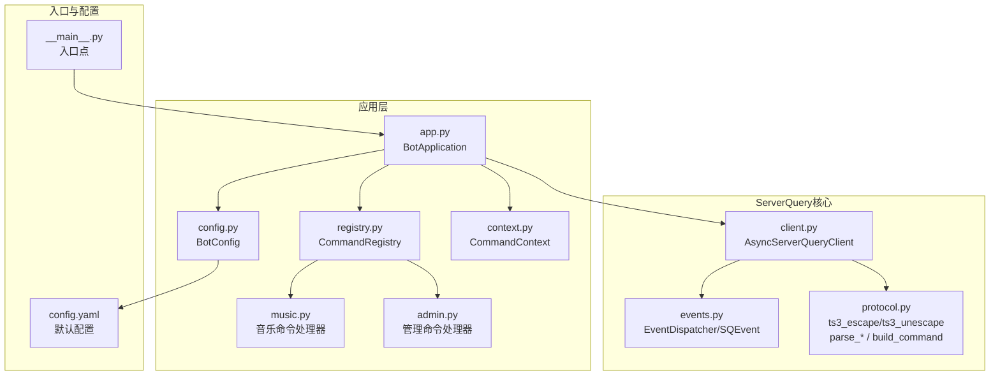
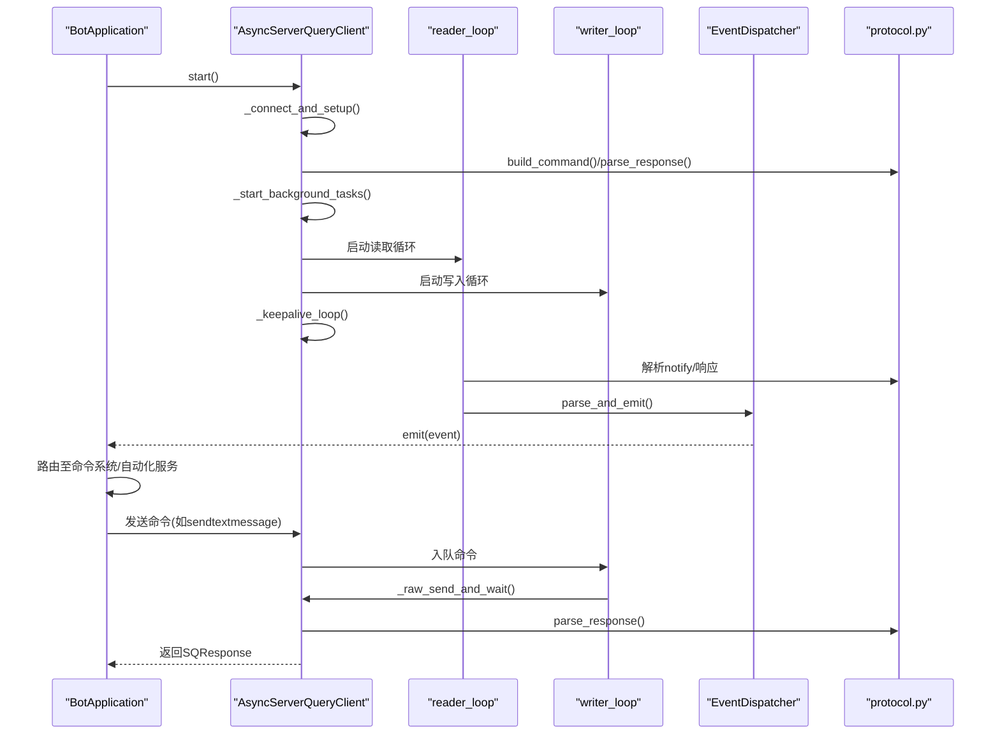
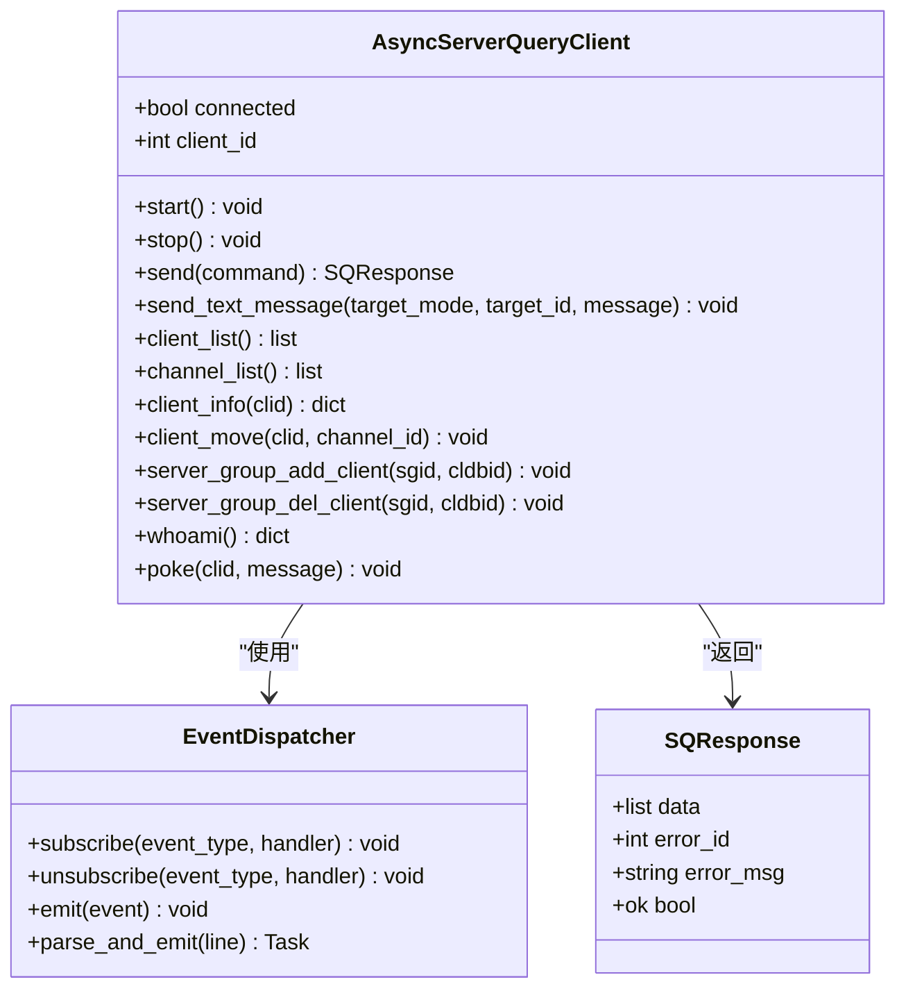
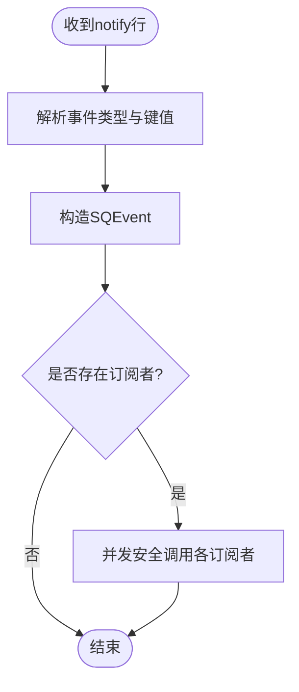
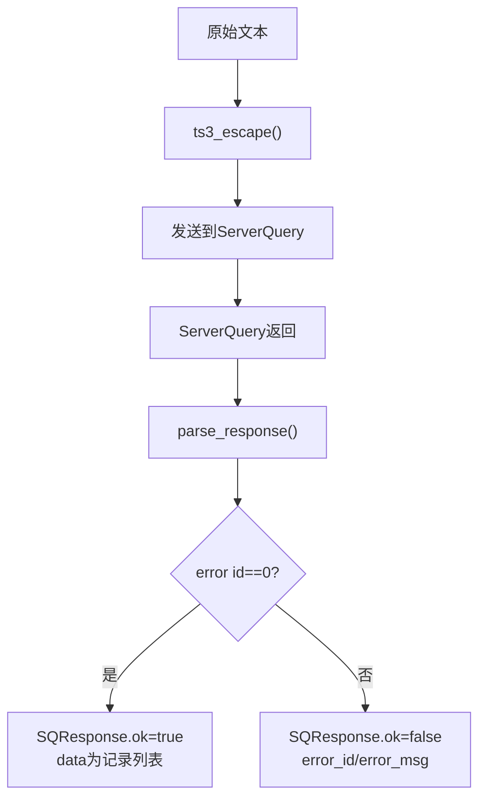
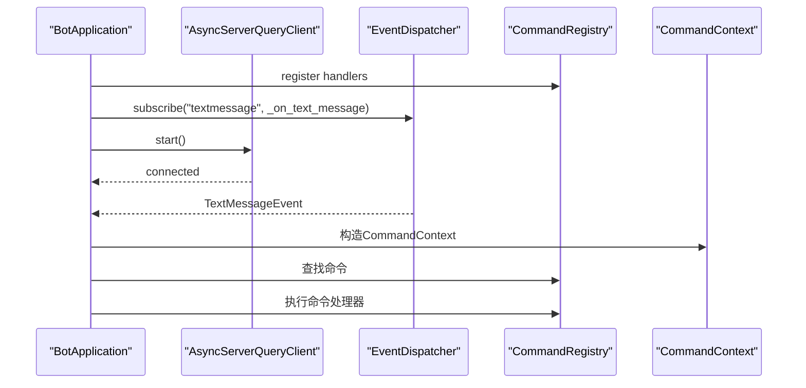
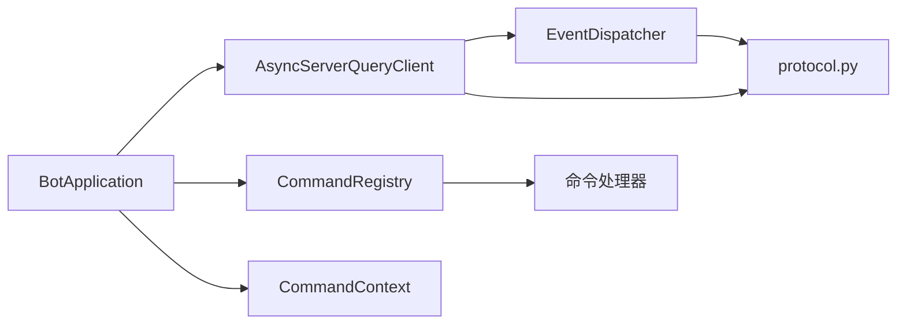
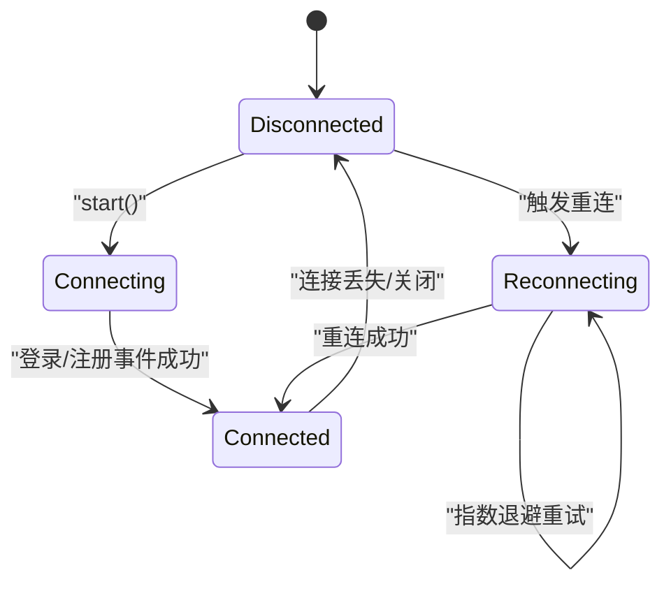

# ServerQuery集成

<cite>
**本文引用的文件**
- [client.py](file://bot/core/serverquery/client.py)
- [events.py](file://bot/core/serverquery/events.py)
- [protocol.py](file://bot/core/serverquery/protocol.py)
- [app.py](file://bot/app.py)
- [config.py](file://bot/config.py)
- [test_protocol.py](file://tests/test_protocol.py)
- [music.py](file://bot/core/commands/handlers/music.py)
- [admin.py](file://bot/core/commands/handlers/admin.py)
- [context.py](file://bot/core/commands/context.py)
- [registry.py](file://bot/core/commands/registry.py)
- [__main__.py](file://bot/__main__.py)
- [config.yaml](file://config/config.yaml)
</cite>

## 目录
1. [简介](#简介)
2. [项目结构](#项目结构)
3. [核心组件](#核心组件)
4. [架构总览](#架构总览)
5. [详细组件分析](#详细组件分析)
6. [依赖分析](#依赖分析)
7. [性能考量](#性能考量)
8. [故障排查指南](#故障排查指南)
9. [结论](#结论)
10. [附录](#附录)

## 简介
本技术文档围绕TeamSpeak 3 ServerQuery集成进行深入说明，重点覆盖以下方面：
- ServerQuery协议实现：转义/反转义、响应解析、命令构建与发送
- 客户端连接管理：连接建立、登录、虚拟服务器选择、昵称更新、事件注册
- 事件分发器：通知事件解析、订阅/取消订阅、异步事件派发
- 协议处理流程：读取循环、写入队列、心跳保活、错误处理与超时
- 连接状态管理、错误恢复与自动重连机制
- 事件监听与消息处理最佳实践
- 协议扩展与自定义事件开发指南

本项目采用异步编程模型，通过后台任务维持长连接，使用队列保证命令串行执行，并提供事件驱动的消息处理通道。

## 项目结构
ServerQuery相关代码集中在bot/core/serverquery目录，配合应用入口、配置加载与命令路由模块协同工作。

图表来源
- [client.py:1-406](file://bot/core/serverquery/client.py#L1-L406)
- [events.py:1-156](file://bot/core/serverquery/events.py#L1-L156)
- [protocol.py:1-160](file://bot/core/serverquery/protocol.py#L1-L160)
- [app.py:1-348](file://bot/app.py#L1-L348)
- [config.py:1-160](file://bot/config.py#L1-L160)
- [registry.py:1-94](file://bot/core/commands/registry.py#L1-L94)
- [context.py:1-70](file://bot/core/commands/context.py#L1-L70)
- [music.py:1-243](file://bot/core/commands/handlers/music.py#L1-L243)
- [admin.py:1-75](file://bot/core/commands/handlers/admin.py#L1-L75)
- [__main__.py:1-17](file://bot/__main__.py#L1-L17)
- [config.yaml:1-76](file://config/config.yaml#L1-L76)

章节来源
- [client.py:1-406](file://bot/core/serverquery/client.py#L1-L406)
- [events.py:1-156](file://bot/core/serverquery/events.py#L1-L156)
- [protocol.py:1-160](file://bot/core/serverquery/protocol.py#L1-L160)
- [app.py:1-348](file://bot/app.py#L1-L348)
- [config.py:1-160](file://bot/config.py#L1-L160)
- [registry.py:1-94](file://bot/core/commands/registry.py#L1-L94)
- [context.py:1-70](file://bot/core/commands/context.py#L1-L70)
- [music.py:1-243](file://bot/core/commands/handlers/music.py#L1-L243)
- [admin.py:1-75](file://bot/core/commands/handlers/admin.py#L1-L75)
- [__main__.py:1-17](file://bot/__main__.py#L1-L17)
- [config.yaml:1-76](file://config/config.yaml#L1-L76)

## 核心组件
- AsyncServerQueryClient：异步ServerQuery客户端，负责连接生命周期、命令队列、读写循环、心跳保活与自动重连
- EventDispatcher：轻量级发布/订阅事件分发器，解析notify事件并异步派发给订阅者
- SQEvent与具体事件类型：封装事件类型与数据，便于上层业务处理
- SQResponse与协议工具：封装响应结构、解析记录/列表、构建命令、转义/反转义
- BotApplication：应用编排器，连接ServerQuery、注册命令与事件、启动后台服务
- CommandRegistry/CommandContext：命令注册与上下文封装，提供回复辅助方法
- 配置系统：BotConfig与YAML配置文件，支持环境变量插值

章节来源
- [client.py:27-406](file://bot/core/serverquery/client.py#L27-L406)
- [events.py:18-156](file://bot/core/serverquery/events.py#L18-L156)
- [protocol.py:63-160](file://bot/core/serverquery/protocol.py#L63-L160)
- [app.py:27-348](file://bot/app.py#L27-L348)
- [registry.py:28-94](file://bot/core/commands/registry.py#L28-L94)
- [context.py:13-70](file://bot/core/commands/context.py#L13-L70)
- [config.py:125-160](file://bot/config.py#L125-L160)

## 架构总览
ServerQuery集成采用“客户端-事件分发器-协议解析”的分层设计，应用层通过BotApplication统一编排。

图表来源
- [client.py:81-149](file://bot/core/serverquery/client.py#L81-L149)
- [client.py:201-290](file://bot/core/serverquery/client.py#L201-L290)
- [events.py:102-156](file://bot/core/serverquery/events.py#L102-L156)
- [protocol.py:95-160](file://bot/core/serverquery/protocol.py#L95-L160)
- [app.py:283-301](file://bot/app.py#L283-L301)

## 详细组件分析

### AsyncServerQueryClient（连接与命令）
- 连接生命周期
  - start/stop：启动与优雅停止，取消后台任务、发送quit、关闭连接
  - _connect_and_setup：建立TCP连接、读取欢迎行、登录、use虚拟服务器、更新昵称、获取client_id、注册事件
  - _register_events：注册server/text*事件
- 命令队列与串行化
  - _cmd_queue：(命令字符串, Future)队列，确保命令顺序执行
  - send：入队后等待Future结果；若响应非ok则抛出ServerQueryError
  - _raw_send_and_wait：连接建立阶段使用的直通发送等待
- 读写循环与心跳
  - reader_loop：累积响应行，遇到error行时解析并resolve对应Future；notify行交由事件分发器
  - writer_loop：从队列取出命令，发送并resolve Future；异常时set_exception
  - _keepalive_loop：周期性发送whoami保持连接活跃
- 自动重连
  - _reconnect：指数退避重连，失败时扩大延迟，成功后重新启动后台任务
- 公共API
  - 文本消息发送、客户端/频道查询、移动、分组管理、自我信息查询、戳一戳等

图表来源
- [client.py:27-406](file://bot/core/serverquery/client.py#L27-L406)
- [events.py:102-156](file://bot/core/serverquery/events.py#L102-L156)
- [protocol.py:63-74](file://bot/core/serverquery/protocol.py#L63-L74)

章节来源
- [client.py:81-149](file://bot/core/serverquery/client.py#L81-L149)
- [client.py:165-198](file://bot/core/serverquery/client.py#L165-L198)
- [client.py:201-290](file://bot/core/serverquery/client.py#L201-L290)
- [client.py:293-406](file://bot/core/serverquery/client.py#L293-L406)

### EventDispatcher（事件分发器）
- 事件模型
  - SQEvent：事件类型与键值数据
  - 具体事件类：ClientJoinEvent、ClientLeaveEvent、TextMessageEvent、ClientMovedEvent
- 订阅/取消订阅
  - subscribe/unsubscribe：按事件类型维护回调列表
- 异步派发
  - emit：并发调用所有订阅者，内部安全调用捕获异常并记录日志
  - parse_and_emit：解析notify行，构造SQEvent并异步emit

图表来源
- [events.py:102-156](file://bot/core/serverquery/events.py#L102-L156)

章节来源
- [events.py:18-156](file://bot/core/serverquery/events.py#L18-L156)

### 协议与命令构建（protocol.py）
- 字符转义/反转义
  - ts3_escape/ts3_unescape：映射特殊字符与转义序列，避免重复转义
- 响应解析
  - parse_record/parse_record_list：解析键值对与管道分隔的多记录
  - parse_response：忽略欢迎行，提取error行与数据行，组装SQResponse
- 命令构建
  - build_command：拼接命令名、参数（自动转义）与选项

图表来源
- [protocol.py:38-160](file://bot/core/serverquery/protocol.py#L38-L160)

章节来源
- [protocol.py:38-160](file://bot/core/serverquery/protocol.py#L38-L160)
- [test_protocol.py:13-118](file://tests/test_protocol.py#L13-L118)

### 应用编排（BotApplication）
- 初始化与配置
  - 加载配置、创建音频、队列、聊天、自动化服务实例
- 事件与命令绑定
  - 订阅textmessage事件，路由到命令解析器
  - 注册各类命令处理器（音乐、管理、调试等）
- 生命周期
  - start：注册命令与事件、连接ServerQuery、启动调度器与Webhook
  - stop：优雅关闭，发送下线消息，断开ServerQuery

图表来源
- [app.py:140-198](file://bot/app.py#L140-L198)
- [app.py:283-301](file://bot/app.py#L283-L301)

章节来源
- [app.py:27-348](file://bot/app.py#L27-L348)
- [music.py:17-243](file://bot/core/commands/handlers/music.py#L17-L243)
- [admin.py:17-75](file://bot/core/commands/handlers/admin.py#L17-L75)
- [registry.py:28-94](file://bot/core/commands/registry.py#L28-L94)
- [context.py:13-70](file://bot/core/commands/context.py#L13-L70)

## 依赖分析
- 组件耦合
  - AsyncServerQueryClient依赖EventDispatcher与protocol工具
  - BotApplication依赖AsyncServerQueryClient、CommandRegistry、CommandContext以及各服务模块
  - 事件分发器仅依赖protocol的记录解析函数
- 外部依赖
  - asyncio用于异步I/O与任务管理
  - logging用于日志输出
  - pydantic用于配置模型与校验
- 潜在环路
  - 未发现直接循环导入；事件处理链路为单向（SQ->Dispatcher->App->Handlers）

图表来源
- [client.py:8-13](file://bot/core/serverquery/client.py#L8-L13)
- [events.py:10](file://bot/core/serverquery/events.py#L10](file://bot/core/serverquery/events.py#L10)
- [app.py:14-22](file://bot/app.py#L14-L22)

章节来源
- [client.py:8-13](file://bot/core/serverquery/client.py#L8-L13)
- [events.py:10](file://bot/core/serverquery/events.py#L10)
- [app.py:14-22](file://bot/app.py#L14-L22)

## 性能考量
- 命令串行化
  - 使用队列保证ServerQuery命令顺序执行，避免竞态与状态不一致
- 并发事件处理
  - 事件派发使用并发gather，提升吞吐但需注意订阅者内部同步
- 心跳保活
  - 定期发送whoami，降低长时间无活动导致的连接中断
- 超时与背压
  - 写入等待超时、读取超时、连接关闭均触发重连逻辑，避免阻塞
- 日志与可观测性
  - 关键路径均有日志输出，便于定位问题

[本节为通用指导，无需特定文件来源]

## 故障排查指南
- 连接失败
  - 检查主机、端口、用户名/密码、虚拟服务器ID与昵称配置
  - 观察重连日志，确认指数退避是否生效
- 登录/use失败
  - 确认权限与虚拟服务器ID有效
- 命令超时
  - 检查网络延迟与ServerQuery负载；适当调整超时时间
- 事件未到达
  - 确认已注册相应事件；检查订阅者内部异常被安全捕获
- 文本消息编码
  - 使用内置转义工具或封装方法，避免特殊字符导致解析错误

章节来源
- [client.py:111-149](file://bot/core/serverquery/client.py#L111-L149)
- [client.py:183-198](file://bot/core/serverquery/client.py#L183-L198)
- [client.py:201-254](file://bot/core/serverquery/client.py#L201-L254)
- [events.py:120-138](file://bot/core/serverquery/events.py#L120-L138)
- [protocol.py:38-61](file://bot/core/serverquery/protocol.py#L38-L61)

## 结论
本ServerQuery集成以清晰的分层设计实现了稳定的异步通信、可靠的事件驱动与可扩展的命令体系。通过命令队列、心跳保活与指数退避重连，系统在复杂网络环境下具备良好的鲁棒性。建议在生产环境中结合监控与告警，持续优化事件处理与命令执行的性能瓶颈。

[本节为总结，无需特定文件来源]

## 附录

### 连接状态管理与重连流程

图表来源
- [client.py:81-149](file://bot/core/serverquery/client.py#L81-L149)
- [client.py:183-198](file://bot/core/serverquery/client.py#L183-L198)
- [client.py:201-254](file://bot/core/serverquery/client.py#L201-L254)

### 事件监听与消息处理最佳实践
- 订阅粒度
  - 仅订阅需要的事件类型，减少不必要的事件处理
- 错误隔离
  - 订阅者内部异常被捕获并记录，不影响其他订阅者
- 上下文传递
  - 使用CommandContext传递调用者信息与回复渠道，保持一致性
- 命令路由
  - 将文本消息事件路由到命令解析器，避免在事件处理中直接执行复杂逻辑

章节来源
- [events.py:120-138](file://bot/core/serverquery/events.py#L120-L138)
- [app.py:162-198](file://bot/app.py#L162-L198)
- [context.py:52-70](file://bot/core/commands/context.py#L52-L70)

### 协议扩展与自定义事件开发指南
- 新增事件类型
  - 在events.py中新增事件数据类，提供from_event工厂方法
  - 在client.py的注册列表中添加servernotifyregister命令
  - 在应用层订阅新事件类型并实现处理逻辑
- 自定义命令
  - 使用build_command构建参数化命令，必要时手动转义
  - 使用parse_response解析响应，检查error_id与data
- 反转义与转义
  - 对用户输入与外部数据使用ts3_escape/ts3_unescape，避免解析错误
- 测试建议
  - 编写单元测试验证转义/反转义、记录解析与响应解析的正确性

章节来源
- [events.py:18-100](file://bot/core/serverquery/events.py#L18-L100)
- [client.py:151-158](file://bot/core/serverquery/client.py#L151-L158)
- [protocol.py:38-160](file://bot/core/serverquery/protocol.py#L38-L160)
- [test_protocol.py:13-118](file://tests/test_protocol.py#L13-L118)