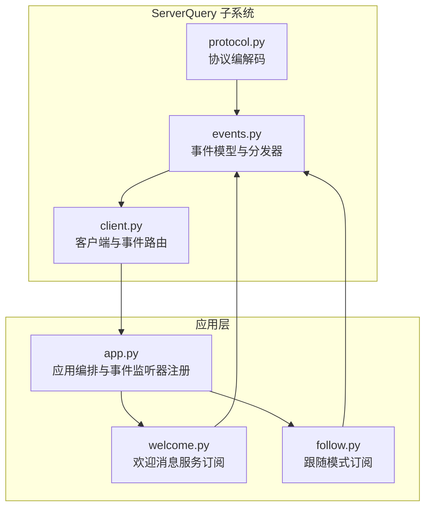
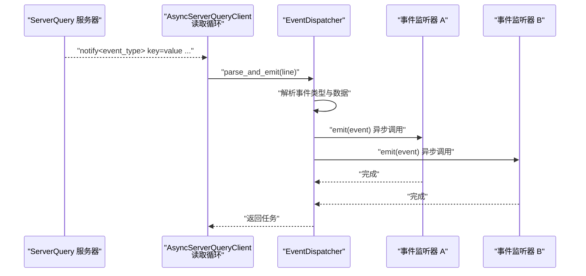
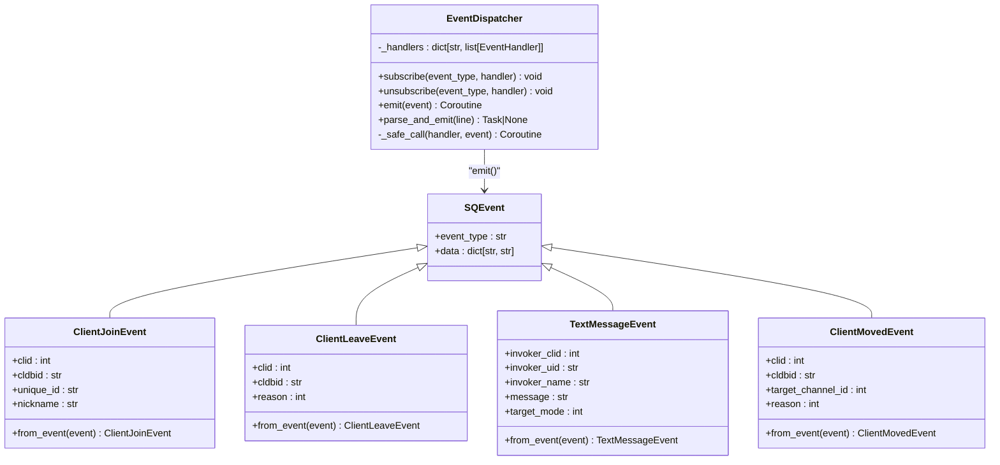
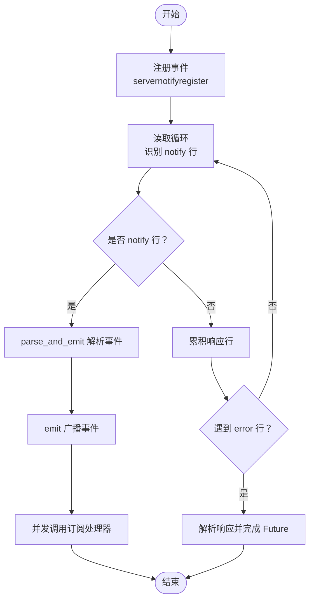
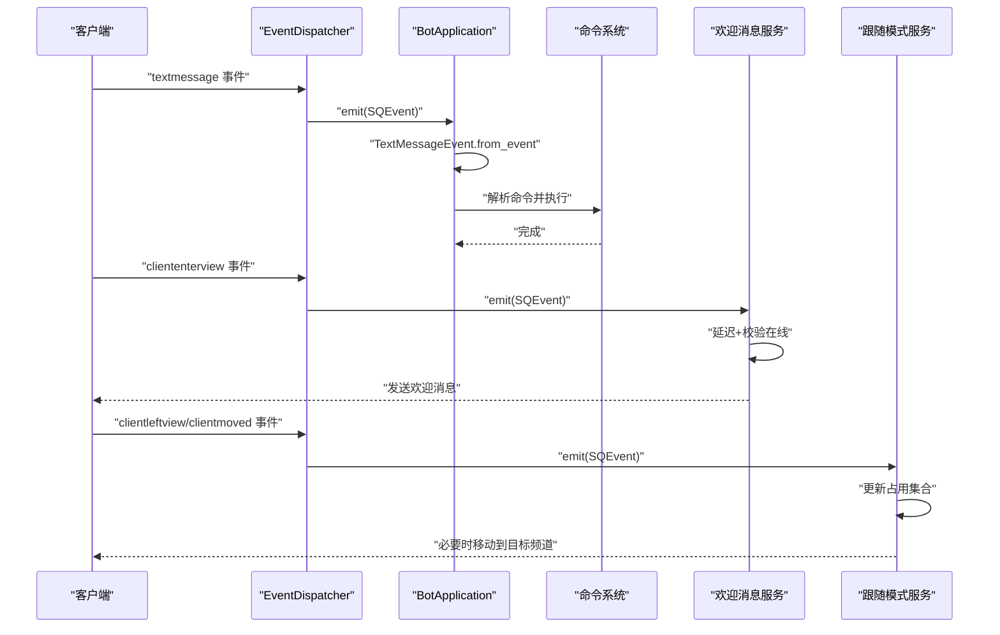
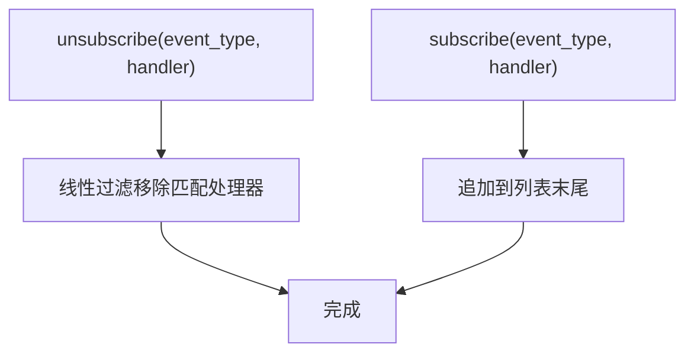
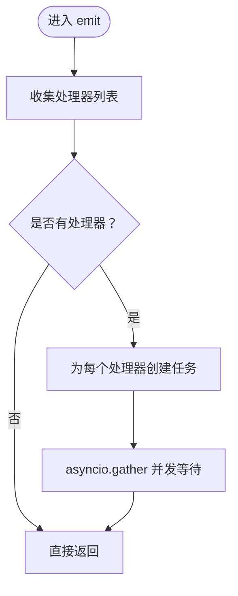
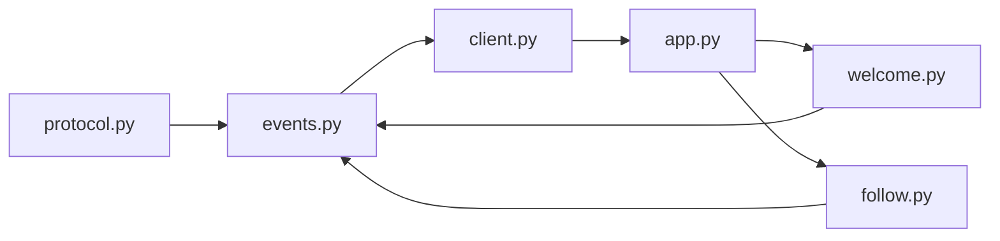

# 事件分发器

<cite>
**本文引用的文件**
- [events.py](file://bot/core/serverquery/events.py)
- [client.py](file://bot/core/serverquery/client.py)
- [protocol.py](file://bot/core/serverquery/protocol.py)
- [app.py](file://bot/app.py)
- [welcome.py](file://bot/services/automation/welcome.py)
- [follow.py](file://bot/services/automation/follow.py)
</cite>

## 目录
1. [简介](#简介)
2. [项目结构](#项目结构)
3. [核心组件](#核心组件)
4. [架构总览](#架构总览)
5. [详细组件分析](#详细组件分析)
6. [依赖分析](#依赖分析)
7. [性能考虑](#性能考虑)
8. [故障排查指南](#故障排查指南)
9. [结论](#结论)
10. [附录](#附录)

## 简介
本文件面向ServerQuery事件分发器，系统性阐述EventDispatcher类的设计与实现，覆盖事件注册、事件路由、事件回调机制、事件类型处理（服务器事件、频道事件、私聊事件）、监听器注册与注销、异步分发模式、最佳实践与性能优化、自定义事件类型扩展与事件过滤等主题。文档以代码为依据，结合可视化图示，帮助读者快速理解并正确使用事件分发器。

## 项目结构
本项目的事件分发器位于ServerQuery子系统中，围绕以下模块协同工作：
- 事件模型与分发器：events.py
- 协议编解码：protocol.py
- 客户端与事件路由：client.py
- 应用层集成与事件监听器注册：app.py
- 自动化服务订阅事件：welcome.py、follow.py

图表来源
- [events.py:102-156](file://bot/core/serverquery/events.py#L102-L156)
- [protocol.py:76-160](file://bot/core/serverquery/protocol.py#L76-L160)
- [client.py:201-254](file://bot/core/serverquery/client.py#L201-L254)
- [app.py:152-198](file://bot/app.py#L152-L198)
- [welcome.py:34-71](file://bot/services/automation/welcome.py#L34-L71)
- [follow.py:65-103](file://bot/services/automation/follow.py#L65-L103)

章节来源
- [events.py:1-156](file://bot/core/serverquery/events.py#L1-L156)
- [protocol.py:1-160](file://bot/core/serverquery/protocol.py#L1-L160)
- [client.py:1-406](file://bot/core/serverquery/client.py#L1-L406)
- [app.py:1-348](file://bot/app.py#L1-L348)
- [welcome.py:1-71](file://bot/services/automation/welcome.py#L1-L71)
- [follow.py:1-176](file://bot/services/automation/follow.py#L1-L176)

## 核心组件
- 事件模型
  - SQEvent：通用ServerQuery事件载体，包含事件类型与键值数据字典。
  - 具体事件类型：ClientJoinEvent、ClientLeaveEvent、TextMessageEvent、ClientMovedEvent，均提供from_event工厂方法从通用事件转换而来。
- 事件分发器
  - EventDispatcher：轻量级发布/订阅分发器，维护事件类型到处理器列表的映射，支持订阅、取消订阅与异步广播。
- 协议编解码
  - 提供记录解析、响应解析、命令构建与字符转义/反转义，确保事件数据的正确解析与构造。
- 客户端与路由
  - AsyncServerQueryClient：负责连接、登录、事件注册、后台读写循环与心跳；在读取到notify行时交由分发器解析并异步分发。
- 应用层集成
  - BotApplication：在启动阶段注册命令与事件监听器，并将文本消息事件路由到命令系统。

章节来源
- [events.py:18-100](file://bot/core/serverquery/events.py#L18-L100)
- [events.py:102-156](file://bot/core/serverquery/events.py#L102-L156)
- [protocol.py:38-160](file://bot/core/serverquery/protocol.py#L38-L160)
- [client.py:27-170](file://bot/core/serverquery/client.py#L27-L170)
- [app.py:152-198](file://bot/app.py#L152-L198)

## 架构总览
事件从ServerQuery服务器通过Telnet传输到达客户端，客户端在读取循环中识别notify行并调用分发器进行解析与异步广播。应用层或服务层根据需要订阅特定事件类型，事件到达后按订阅顺序并发执行回调。

图表来源
- [client.py:224-225](file://bot/core/serverquery/client.py#L224-L225)
- [events.py:139-156](file://bot/core/serverquery/events.py#L139-L156)
- [events.py:120-131](file://bot/core/serverquery/events.py#L120-L131)

## 详细组件分析

### EventDispatcher 类设计与实现
- 数据结构
  - 映射表：事件类型字符串到处理器列表（协程函数）。
- 关键方法
  - 订阅：subscribe(event_type, handler) 将处理器追加到对应事件类型的列表。
  - 取消订阅：unsubscribe(event_type, handler) 过滤掉指定处理器。
  - 广播：emit(event) 并发调用所有订阅处理器，使用gather聚合等待。
  - 安全调用：_safe_call(handler, event) 包裹异常，避免单个处理器错误影响其他处理器。
  - 解析与分发：parse_and_emit(line) 解析notify行，构造SQEvent并创建异步任务提交给emit。
- 复杂度
  - 订阅/取消订阅：O(1) 操作，但取消订阅会线性过滤列表，最坏O(n)。
  - 广播：对k个处理器，时间复杂度O(k)，空间复杂度O(k)用于任务列表。
- 错误处理
  - 回调异常被捕获并记录，不影响其他处理器执行。
- 性能特性
  - 使用asyncio.gather并发执行，提升吞吐；但过多处理器可能带来调度开销。

图表来源
- [events.py:102-156](file://bot/core/serverquery/events.py#L102-L156)
- [events.py:18-100](file://bot/core/serverquery/events.py#L18-L100)

章节来源
- [events.py:102-156](file://bot/core/serverquery/events.py#L102-L156)

### 事件注册与路由流程
- 客户端连接后注册事件
  - 在_connect_and_setup中调用_register_events，向服务器注册服务器事件与文本事件（服务器、频道、私聊）。
- 读取循环路由
  - 在_reader_loop中，遇到notify行则调用dispatcher.parse_and_emit，否则作为响应累积直到error行。
- 应用层订阅
  - BotApplication在_start阶段调用_setup_event_handlers，订阅textmessage事件并绑定到_on_text_message。
  - 自动化服务（欢迎消息、跟随模式）分别订阅cliententerview、clientleftview、clientmoved等事件。

图表来源
- [client.py:151-164](file://bot/core/serverquery/client.py#L151-L164)
- [client.py:201-254](file://bot/core/serverquery/client.py#L201-L254)
- [events.py:139-156](file://bot/core/serverquery/events.py#L139-L156)

章节来源
- [client.py:151-164](file://bot/core/serverquery/client.py#L151-L164)
- [client.py:201-254](file://bot/core/serverquery/client.py#L201-L254)
- [app.py:152-161](file://bot/app.py#L152-L161)

### 事件类型与处理流程
- 文本消息事件（textmessage）
  - 应用层将SQEvent转换为TextMessageEvent，忽略来自自身的消息，解析命令并执行对应命令处理器。
- 客户端加入事件（cliententerview）
  - 欢迎消息服务订阅此事件，在延迟后检查用户仍在线，然后发送欢迎消息（私聊或频道）。
- 客户端离开事件（clientleftview）
  - 跟随模式订阅此事件，清理占用集合并调度移动动作。
- 客户端移动事件（clientmoved）
  - 跟随模式订阅此事件，更新占用集合并调度移动动作。

图表来源
- [app.py:162-198](file://bot/app.py#L162-L198)
- [welcome.py:39-71](file://bot/services/automation/welcome.py#L39-L71)
- [follow.py:79-103](file://bot/services/automation/follow.py#L79-L103)

章节来源
- [app.py:162-198](file://bot/app.py#L162-L198)
- [welcome.py:39-71](file://bot/services/automation/welcome.py#L39-L71)
- [follow.py:79-103](file://bot/services/automation/follow.py#L79-L103)

### 监听器注册与注销机制
- 注册
  - 通过dispatcher.subscribe(event_type, handler)将处理器添加到事件类型列表末尾。
- 注销
  - 通过dispatcher.unsubscribe(event_type, handler)过滤掉指定处理器，保留其余处理器。
- 实际应用
  - BotApplication在_start阶段集中注册命令与自动化服务的事件监听器。
  - FollowMode在启用状态变化时动态订阅/取消订阅多个事件类型。

图表来源
- [events.py:108-119](file://bot/core/serverquery/events.py#L108-L119)
- [app.py:152-161](file://bot/app.py#L152-L161)
- [follow.py:65-70](file://bot/services/automation/follow.py#L65-L70)

章节来源
- [events.py:108-119](file://bot/core/serverquery/events.py#L108-L119)
- [app.py:152-161](file://bot/app.py#L152-L161)
- [follow.py:65-70](file://bot/services/automation/follow.py#L65-L70)

### 事件分发的异步处理模式
- 并发执行
  - emit对同一事件的所有处理器使用asyncio.gather并发调用，提升整体吞吐。
- 安全性
  - _safe_call捕获每个处理器的异常，避免单点异常导致整个事件分发失败。
- 任务管理
  - parse_and_emit返回创建的任务对象，便于上层跟踪或进一步控制（当前应用层未显式等待）。

图表来源
- [events.py:120-131](file://bot/core/serverquery/events.py#L120-L131)
- [events.py:132-138](file://bot/core/serverquery/events.py#L132-L138)

章节来源
- [events.py:120-138](file://bot/core/serverquery/events.py#L120-L138)

### 自定义事件类型的扩展方法
- 新增事件类型
  - 在events.py中新增数据类，提供from_event工厂方法从SQEvent转换。
  - 在客户端侧确保ServerQuery注册了对应的notify事件类型。
- 新增处理器
  - 在应用层或服务层调用dispatcher.subscribe注册处理器。
  - 处理器应为协程函数，接收SQEvent参数并异步处理。
- 事件过滤
  - 在处理器内部进行条件判断（如忽略自身消息），或在应用层统一预处理后再分发。

章节来源
- [events.py:18-100](file://bot/core/serverquery/events.py#L18-L100)
- [client.py:151-164](file://bot/core/serverquery/client.py#L151-L164)
- [app.py:162-168](file://bot/app.py#L162-L168)

## 依赖分析
- 组件耦合
  - EventDispatcher与具体事件类型解耦，仅依赖事件类型字符串与通用数据字典。
  - 客户端依赖分发器进行事件路由，读取循环与分发器松耦合。
  - 应用层通过dispatcher.subscribe接入事件系统，不直接依赖具体事件类型实现。
- 外部依赖
  - asyncio用于异步并发与任务管理。
  - logging用于错误日志与调试信息输出。
- 循环依赖
  - 未发现循环导入；事件模型与分发器相互独立，客户端与应用层通过接口交互。

图表来源
- [protocol.py:76-160](file://bot/core/serverquery/protocol.py#L76-L160)
- [events.py:102-156](file://bot/core/serverquery/events.py#L102-L156)
- [client.py:201-254](file://bot/core/serverquery/client.py#L201-L254)
- [app.py:152-198](file://bot/app.py#L152-L198)
- [welcome.py:34-71](file://bot/services/automation/welcome.py#L34-L71)
- [follow.py:65-103](file://bot/services/automation/follow.py#L65-L103)

章节来源
- [protocol.py:76-160](file://bot/core/serverquery/protocol.py#L76-L160)
- [events.py:102-156](file://bot/core/serverquery/events.py#L102-L156)
- [client.py:201-254](file://bot/core/serverquery/client.py#L201-L254)
- [app.py:152-198](file://bot/app.py#L152-L198)
- [welcome.py:34-71](file://bot/services/automation/welcome.py#L34-L71)
- [follow.py:65-103](file://bot/services/automation/follow.py#L65-L103)

## 性能考虑
- 并发策略
  - 使用asyncio.gather并发执行同一事件的所有处理器，适合处理器数量适中的场景。
  - 若处理器数量较多，建议拆分事件或引入限流/队列，避免过度并发导致CPU/IO争用。
- 取消订阅成本
  - unsubscribe采用线性过滤，处理器数量多时开销较大；可考虑使用弱引用或更高效的数据结构。
- 日志与异常
  - _safe_call捕获异常并记录，避免异常传播阻塞其他处理器；建议在处理器内部也做好异常隔离。
- 事件解析
  - parse_and_emit对每条notify行创建任务，注意高频事件下的任务创建开销；可评估批量处理或去抖策略。

章节来源
- [events.py:108-119](file://bot/core/serverquery/events.py#L108-L119)
- [events.py:120-131](file://bot/core/serverquery/events.py#L120-L131)
- [events.py:132-138](file://bot/core/serverquery/events.py#L132-L138)

## 故障排查指南
- 事件未触发
  - 检查客户端是否成功注册事件（_register_events）。
  - 确认读取循环是否正确识别notify行并调用parse_and_emit。
- 处理器未执行
  - 检查订阅是否成功（subscribe）与未被意外取消（unsubscribe）。
  - 确认事件类型字符串一致且大小写正确。
- 异常导致其他处理器失效
  - 确认EventDispatcher._safe_call是否正常捕获异常并记录。
- 高频事件导致性能问题
  - 评估处理器数量与并发策略，必要时增加限流或拆分事件。
- 自身消息干扰
  - 在应用层或服务层过滤掉来自自身client_id的消息。

章节来源
- [client.py:151-164](file://bot/core/serverquery/client.py#L151-L164)
- [client.py:224-225](file://bot/core/serverquery/client.py#L224-L225)
- [events.py:132-138](file://bot/core/serverquery/events.py#L132-L138)
- [app.py:162-168](file://bot/app.py#L162-L168)

## 结论
EventDispatcher提供了简洁高效的ServerQuery事件分发能力，配合AsyncServerQueryClient的读取循环与应用层的订阅机制，实现了从服务器通知到业务逻辑的顺畅流转。通过合理的并发策略、异常处理与订阅管理，可在保证可靠性的同时获得良好的性能表现。对于扩展新事件类型与优化高频事件处理，建议遵循本文的最佳实践与性能建议。

## 附录
- 事件类型参考
  - 服务器事件：server、textserver
  - 频道事件：textchannel
  - 私聊事件：textprivate
  - 客户端事件：cliententerview、clientleftview、clientmoved
- 建议的事件过滤实践
  - 在应用层统一预处理：忽略自身消息、过滤无效数据、去重与节流。
  - 在处理器内部进行细粒度过滤：基于消息内容、来源用户、目标模式等条件决定是否处理。

章节来源
- [client.py:151-158](file://bot/core/serverquery/client.py#L151-L158)
- [app.py:162-168](file://bot/app.py#L162-L168)