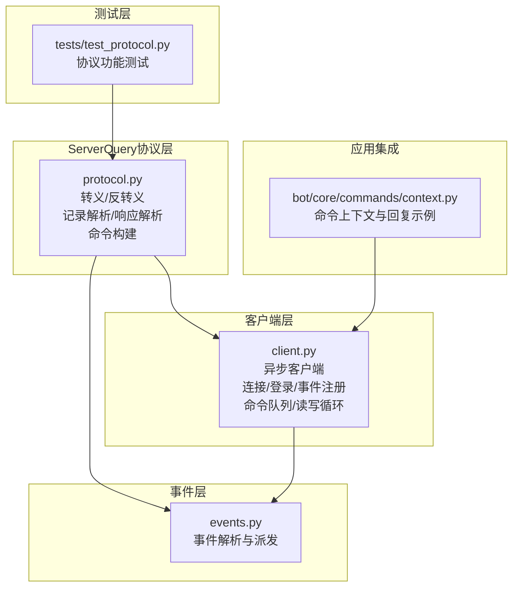
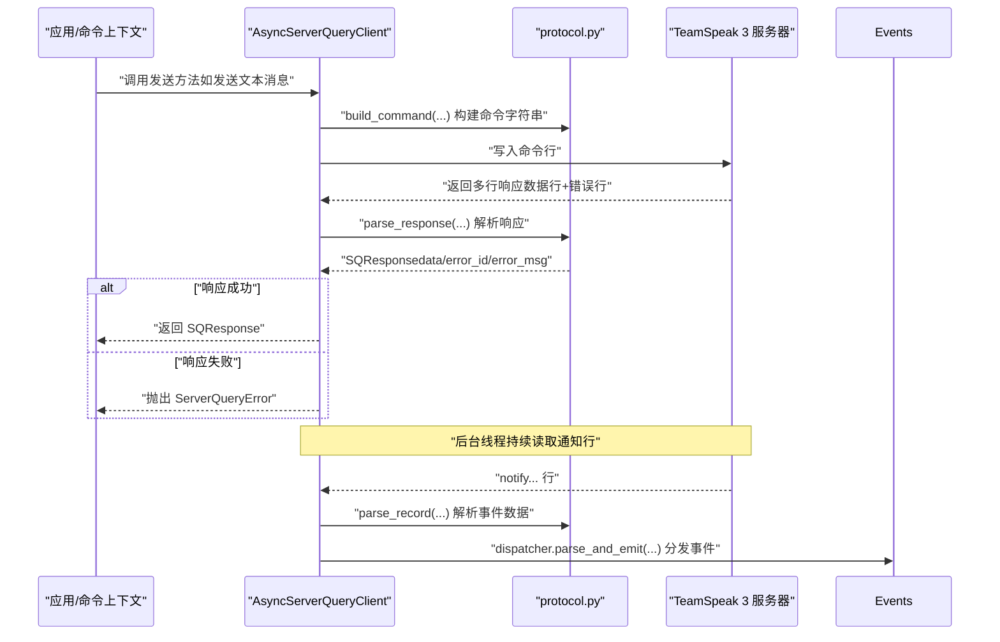
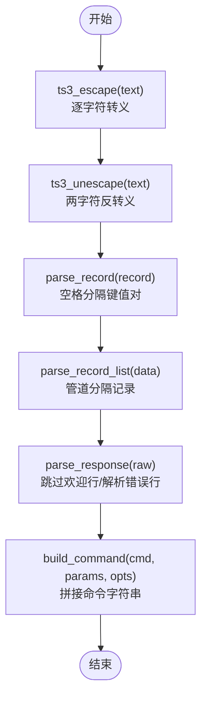
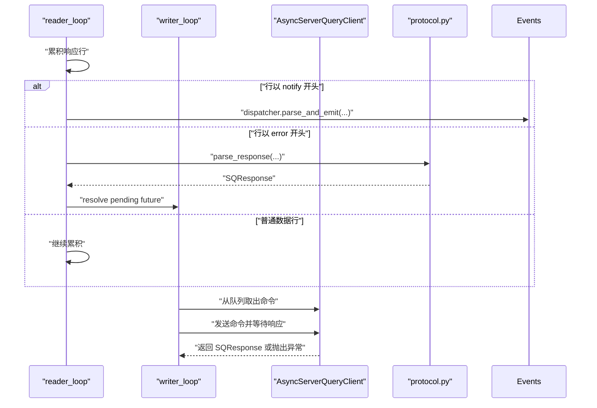
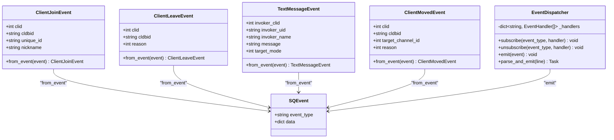
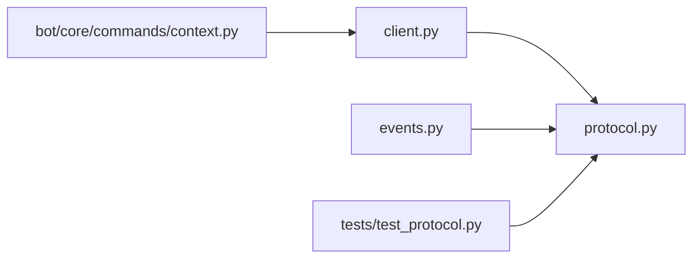

# 协议处理

<cite>
**本文引用的文件**
- [protocol.py](file://bot/core/serverquery/protocol.py)
- [client.py](file://bot/core/serverquery/client.py)
- [events.py](file://bot/core/serverquery/events.py)
- [test_protocol.py](file://tests/test_protocol.py)
- [context.py](file://bot/core/commands/context.py)
</cite>

## 目录
1. [简介](#简介)
2. [项目结构](#项目结构)
3. [核心组件](#核心组件)
4. [架构总览](#架构总览)
5. [详细组件分析](#详细组件分析)
6. [依赖分析](#依赖分析)
7. [性能考量](#性能考量)
8. [故障排查指南](#故障排查指南)
9. [结论](#结论)
10. [附录](#附录)

## 简介
本文件面向ServerQuery协议处理，系统性阐述TeamSpeak 3 ServerQuery协议在本项目中的实现与使用，重点覆盖：
- 命令构建器：如何将命令名、键值参数与选项组合为可发送的字符串，并进行必要的转义
- 响应解析器：如何解析服务端返回的多行响应，提取数据记录与错误信息
- 数据转义机制：ts3_escape/ts3_unescape的字符映射与解析流程
- 消息结构与编码规则：空格分隔键值、管道分隔记录、错误行格式等
- 错误处理与异常传播：ServerQueryError与SQResponse的ok属性
- 扩展与自定义：如何基于现有工具扩展命令与事件处理
- 安全注意事项：避免重复转义、未知转义序列的容错策略

## 项目结构
ServerQuery协议处理位于bot/core/serverquery目录，核心文件如下：
- protocol.py：协议转义、记录解析、响应解析与命令构建
- client.py：异步客户端，负责连接、登录、事件注册、命令队列、读写循环与错误抛出
- events.py：事件派发器，将notify行解析为结构化事件并分发给订阅者
- tests/test_protocol.py：协议单元测试，覆盖转义/反转义、记录解析、响应解析与命令构建
- bot/core/commands/context.py：命令上下文，演示如何通过客户端回复消息（间接验证协议层）

图表来源
- [protocol.py:1-160](file://bot/core/serverquery/protocol.py#L1-L160)
- [client.py:1-406](file://bot/core/serverquery/client.py#L1-L406)
- [events.py:1-156](file://bot/core/serverquery/events.py#L1-L156)
- [test_protocol.py:1-118](file://tests/test_protocol.py#L1-L118)
- [context.py:1-54](file://bot/core/commands/context.py#L1-L54)

章节来源
- [protocol.py:1-160](file://bot/core/serverquery/protocol.py#L1-L160)
- [client.py:1-406](file://bot/core/serverquery/client.py#L1-L406)
- [events.py:1-156](file://bot/core/serverquery/events.py#L1-L156)
- [test_protocol.py:1-118](file://tests/test_protocol.py#L1-L118)
- [context.py:1-54](file://bot/core/commands/context.py#L1-L54)

## 核心组件
- 转义/反转义工具
  - ts3_escape：将特殊字符按映射表转义，避免重复转义
  - ts3_unescape：按两字符转义序列进行反转义，未知序列原样保留
- 记录与响应解析
  - parse_record：解析“键=值”空格分隔的单条记录，键与值均需反转义
  - parse_record_list：以“|”分隔的多条记录解析为字典列表
  - parse_response：解析完整响应，跳过欢迎行，提取最后一条数据行与错误行
- 命令构建器
  - build_command：拼接命令名、参数（自动转义）与选项，生成最终命令字符串
- 异步客户端
  - AsyncServerQueryClient：管理持久连接、命令队列、后台读写与保活心跳；失败时抛出ServerQueryError
- 事件派发器
  - EventDispatcher：解析notify事件并分发给订阅者

章节来源
- [protocol.py:38-160](file://bot/core/serverquery/protocol.py#L38-L160)
- [client.py:27-340](file://bot/core/serverquery/client.py#L27-L340)
- [events.py:102-156](file://bot/core/serverquery/events.py#L102-L156)

## 架构总览
下图展示从应用到协议层的整体交互路径，以及命令构建、响应解析与事件派发的关键节点。

图表来源
- [client.py:327-340](file://bot/core/serverquery/client.py#L327-L340)
- [protocol.py:137-160](file://bot/core/serverquery/protocol.py#L137-L160)
- [protocol.py:95-134](file://bot/core/serverquery/protocol.py#L95-L134)
- [events.py:139-156](file://bot/core/serverquery/events.py#L139-L156)

## 详细组件分析

### 组件一：协议转义与解析（protocol.py）
- 转义映射
  - 反斜杠、斜杠、空格、竖线、控制字符等均被映射为两字符转义序列
  - ts3_escape逐字符扫描，避免重复转义
- 反转义映射
  - 遇到“\”且后跟有效转义序列则替换为原字符，否则原样保留
- 记录解析
  - parse_record：按空格拆分键值对，键与值均执行反转义
  - parse_record_list：按“|”拆分多条记录
- 响应解析
  - parse_response：跳过以“TS3”或“Welcome”开头的欢迎行，收集所有数据行，最后一条数据行作为最终数据，解析错误行中的id与msg
- 命令构建
  - build_command：命令名+参数（键=值，值经转义）+选项，空格分隔

图表来源
- [protocol.py:38-60](file://bot/core/serverquery/protocol.py#L38-L60)
- [protocol.py:76-92](file://bot/core/serverquery/protocol.py#L76-L92)
- [protocol.py:95-134](file://bot/core/serverquery/protocol.py#L95-L134)
- [protocol.py:137-160](file://bot/core/serverquery/protocol.py#L137-L160)

章节来源
- [protocol.py:7-60](file://bot/core/serverquery/protocol.py#L7-L60)
- [protocol.py:76-134](file://bot/core/serverquery/protocol.py#L76-L134)
- [protocol.py:137-160](file://bot/core/serverquery/protocol.py#L137-L160)

### 组件二：异步客户端（client.py）
- 连接与初始化
  - 建立TCP连接，读取欢迎行，执行login/use/更新昵称/whoami，注册事件
- 命令队列与串行执行
  - 使用asyncio.Queue维护命令队列，writer_loop按序发送，确保串行化
- 响应路由
  - reader_loop累积响应行，遇到“error ”行时解析为SQResponse并resolve等待的Future
  - 遇到“notify”行时交由事件派发器处理
- 错误处理
  - send方法在收到非ok响应时抛出ServerQueryError
- 保活与重连
  - keepalive_loop定期发送whoami维持连接
  - 断线后指数回退重连

图表来源
- [client.py:201-254](file://bot/core/serverquery/client.py#L201-L254)
- [client.py:255-290](file://bot/core/serverquery/client.py#L255-L290)
- [client.py:327-340](file://bot/core/serverquery/client.py#L327-L340)
- [protocol.py:95-134](file://bot/core/serverquery/protocol.py#L95-L134)

章节来源
- [client.py:27-170](file://bot/core/serverquery/client.py#L27-L170)
- [client.py:171-290](file://bot/core/serverquery/client.py#L171-L290)
- [client.py:293-340](file://bot/core/serverquery/client.py#L293-L340)

### 组件三：事件派发器（events.py）
- 事件类型
  - SQEvent：基础事件容器
  - ClientJoinEvent、ClientLeaveEvent、TextMessageEvent、ClientMovedEvent：具体事件模型
- 解析与分发
  - parse_and_emit：解析notify行，构造SQEvent并异步并发调用订阅处理器
- 订阅/取消订阅
  - subscribe/unsubscribe：按事件类型维护处理器列表

图表来源
- [events.py:18-100](file://bot/core/serverquery/events.py#L18-L100)
- [events.py:102-156](file://bot/core/serverquery/events.py#L102-L156)

章节来源
- [events.py:18-156](file://bot/core/serverquery/events.py#L18-L156)

### 组件四：命令构建与使用示例（context.py 与 client.py）
- 命令构建
  - send_text_message内部使用build_command拼接参数并发送
- 应用集成
  - CommandContext提供reply方法，内部调用客户端私信接口，间接验证协议层可用性

章节来源
- [client.py:342-364](file://bot/core/serverquery/client.py#L342-L364)
- [context.py:52-54](file://bot/core/commands/context.py#L52-L54)

## 依赖分析
- 模块耦合
  - client.py直接依赖protocol.py的SQResponse、build_command、parse_response
  - events.py依赖protocol.py的parse_record用于事件数据解析
- 外部依赖
  - asyncio用于异步I/O与任务调度
  - logging用于日志输出
- 循环依赖
  - 未发现循环导入

图表来源
- [client.py:9-13](file://bot/core/serverquery/client.py#L9-L13)
- [events.py:10](file://bot/core/serverquery/events.py#L10)
- [test_protocol.py:3-10](file://tests/test_protocol.py#L3-L10)
- [context.py:10](file://bot/core/commands/context.py#L10)

章节来源
- [client.py:9-13](file://bot/core/serverquery/client.py#L9-L13)
- [events.py:10](file://bot/core/serverquery/events.py#L10)
- [test_protocol.py:3-10](file://tests/test_protocol.py#L3-L10)
- [context.py:10](file://bot/core/commands/context.py#L10)

## 性能考量
- 字符串处理
  - ts3_escape采用逐字符扫描与列表拼接，避免重复转义，时间复杂度O(n)
  - ts3_unescape按两字符匹配，时间复杂度O(n)
- 解析效率
  - parse_record按空格拆分，parse_record_list按“|”拆分，均为线性扫描
  - parse_response先过滤欢迎行，再定位错误行，整体线性
- 并发与队列
  - 命令队列保证串行执行，避免竞态；事件派发使用并发gather，提升吞吐
- I/O与超时
  - 读写循环设置合理超时，reader_loop在超时情况下发送保活请求，避免阻塞

[本节为通用性能讨论，不直接分析特定文件]

## 故障排查指南
- 常见问题
  - 命令参数未正确转义导致解析错误：检查build_command是否传入params并确认值已转义
  - 响应非ok但未捕获异常：确保调用send后检查SQResponse.ok或捕获ServerQueryError
  - 事件未触发：确认已注册事件（servernotifyregister），并检查notify行格式
  - 连接断开：观察reader_loop日志，确认自动重连是否生效
- 关键定位点
  - 响应解析：parse_response对“TS3”“Welcome”行的跳过逻辑
  - 错误抛出：send方法在非ok时抛出ServerQueryError
  - 事件解析：events.py中parse_and_emit对notify行的处理

章节来源
- [protocol.py:95-134](file://bot/core/serverquery/protocol.py#L95-L134)
- [client.py:327-340](file://bot/core/serverquery/client.py#L327-L340)
- [events.py:139-156](file://bot/core/serverquery/events.py#L139-L156)

## 结论
本项目的ServerQuery协议处理以清晰的模块划分实现了：
- 明确的转义/反转义规则与解析流程
- 稳健的命令构建与响应解析
- 异步客户端的连接管理、命令队列与事件派发
- 全面的单元测试覆盖关键路径
建议在扩展新命令时遵循现有模式：使用build_command构建参数并自动转义，使用SQResponse.ok判断结果，必要时在events.py中新增事件类型并在client.py中注册相应notify。

[本节为总结性内容，不直接分析特定文件]

## 附录

### A. 数据格式与编码规则
- 命令行
  - 命令名 + 空格 + 参数键值对 + 空格 + 选项
  - 参数值需转义，键名无需转义
- 记录
  - “键=值”空格分隔，键与值均需反转义
- 记录列表
  - 以“|”分隔的多条记录
- 响应
  - 可选的欢迎行（以“TS3”或“Welcome”开头）
  - 零或多条数据行
  - 最后一行“error id=X msg=Y”

章节来源
- [protocol.py:76-134](file://bot/core/serverquery/protocol.py#L76-L134)

### B. 命令构建器使用指南
- 参数类型
  - params：字典，键为字符串，值为字符串或整数
  - opts：字符串列表，如["-uid","-away"]
- 转义策略
  - 值会自动转义，键不会转义
- 示例路径
  - [build_command:137-160](file://bot/core/serverquery/protocol.py#L137-L160)
  - [send_text_message:342-364](file://bot/core/serverquery/client.py#L342-L364)

章节来源
- [protocol.py:137-160](file://bot/core/serverquery/protocol.py#L137-L160)
- [client.py:342-364](file://bot/core/serverquery/client.py#L342-L364)

### C. 响应解析器使用指南
- 返回对象
  - SQResponse：包含data（记录列表）、error_id、error_msg与ok属性
- 错误处理
  - ok为False时，error_id与error_msg可用于诊断
- 示例路径
  - [SQResponse:63-74](file://bot/core/serverquery/protocol.py#L63-L74)
  - [parse_response:95-134](file://bot/core/serverquery/protocol.py#L95-L134)
  - [send:327-340](file://bot/core/serverquery/client.py#L327-L340)

章节来源
- [protocol.py:63-74](file://bot/core/serverquery/protocol.py#L63-L74)
- [protocol.py:95-134](file://bot/core/serverquery/protocol.py#L95-L134)
- [client.py:327-340](file://bot/core/serverquery/client.py#L327-L340)

### D. 数据转义函数 ts3_escape 使用说明与安全考虑
- 使用说明
  - 对命令参数值进行转义，避免空格、竖线、反斜杠等特殊字符破坏语法
  - 反转义仅在解析阶段进行，确保原始数据正确还原
- 安全考虑
  - 不会重复转义：ts3_escape逐字符扫描，避免二次转义
  - 未知转义序列容错：ts3_unescape遇到未知“\X”序列时原样保留，防止数据损坏
- 示例路径
  - [ts3_escape:38-44](file://bot/core/serverquery/protocol.py#L38-L44)
  - [ts3_unescape:47-60](file://bot/core/serverquery/protocol.py#L47-L60)
  - [测试用例:13-51](file://tests/test_protocol.py#L13-L51)

章节来源
- [protocol.py:38-60](file://bot/core/serverquery/protocol.py#L38-L60)
- [test_protocol.py:13-51](file://tests/test_protocol.py#L13-L51)

### E. 单元测试要点
- 转义/反转义
  - 覆盖空格、竖线、反斜杠、换行等字符
  - roundtrip一致性校验
- 记录解析
  - 简单键值对、带转义值、空记录
- 记录列表解析
  - 单条与多条记录、空输入
- 响应解析
  - 成功响应、错误响应、含欢迎行的响应
- 命令构建
  - 无参数、有参数、有选项

章节来源
- [test_protocol.py:13-118](file://tests/test_protocol.py#L13-L118)