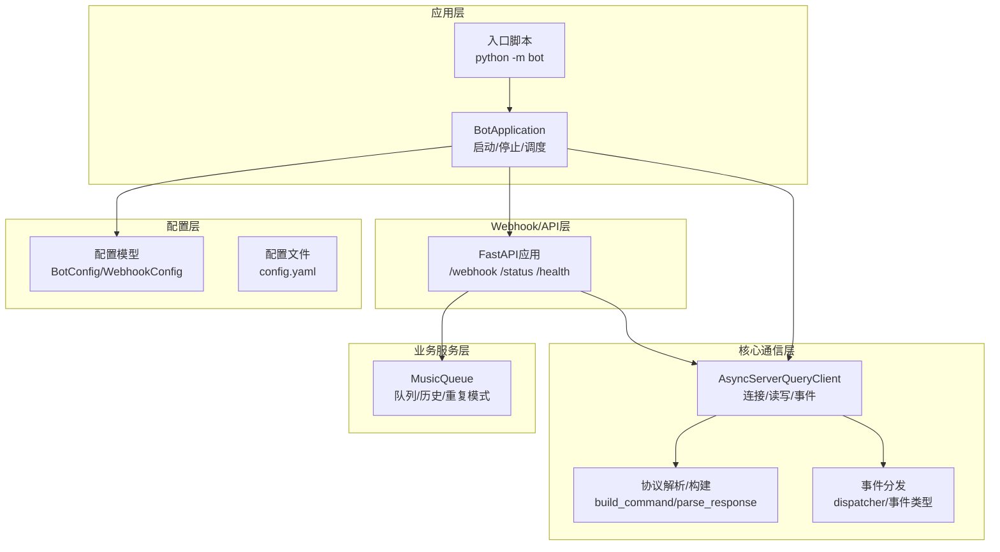
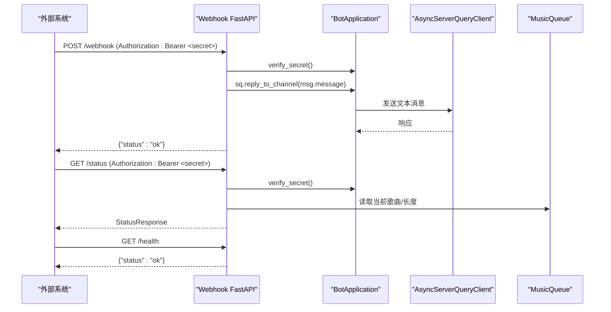
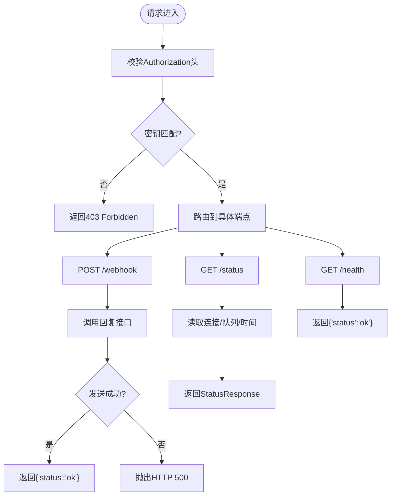
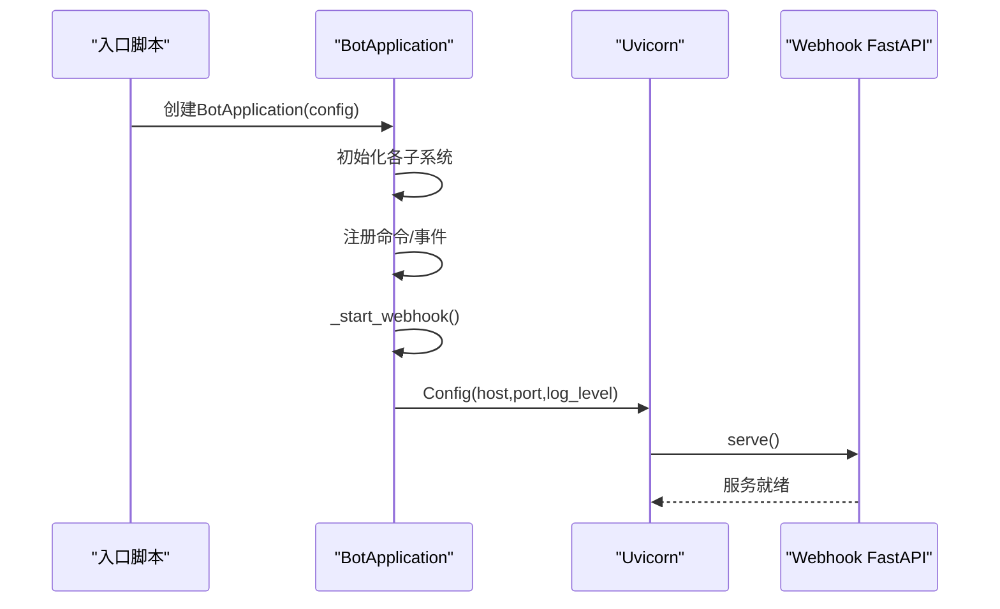
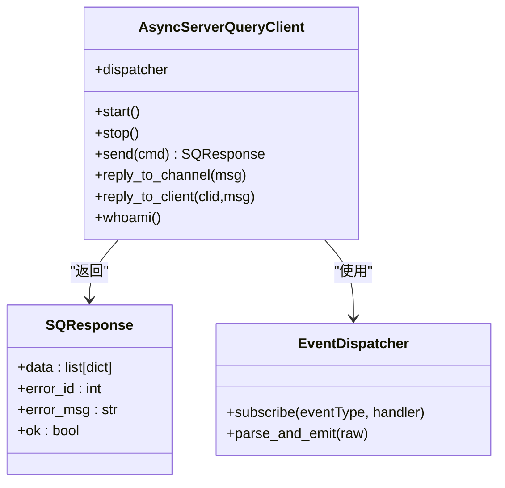
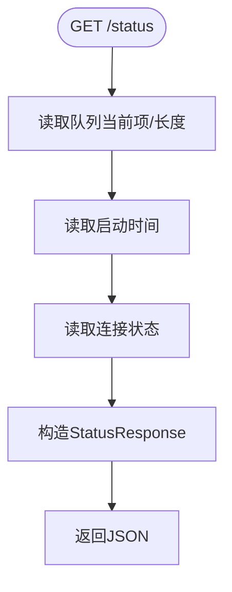
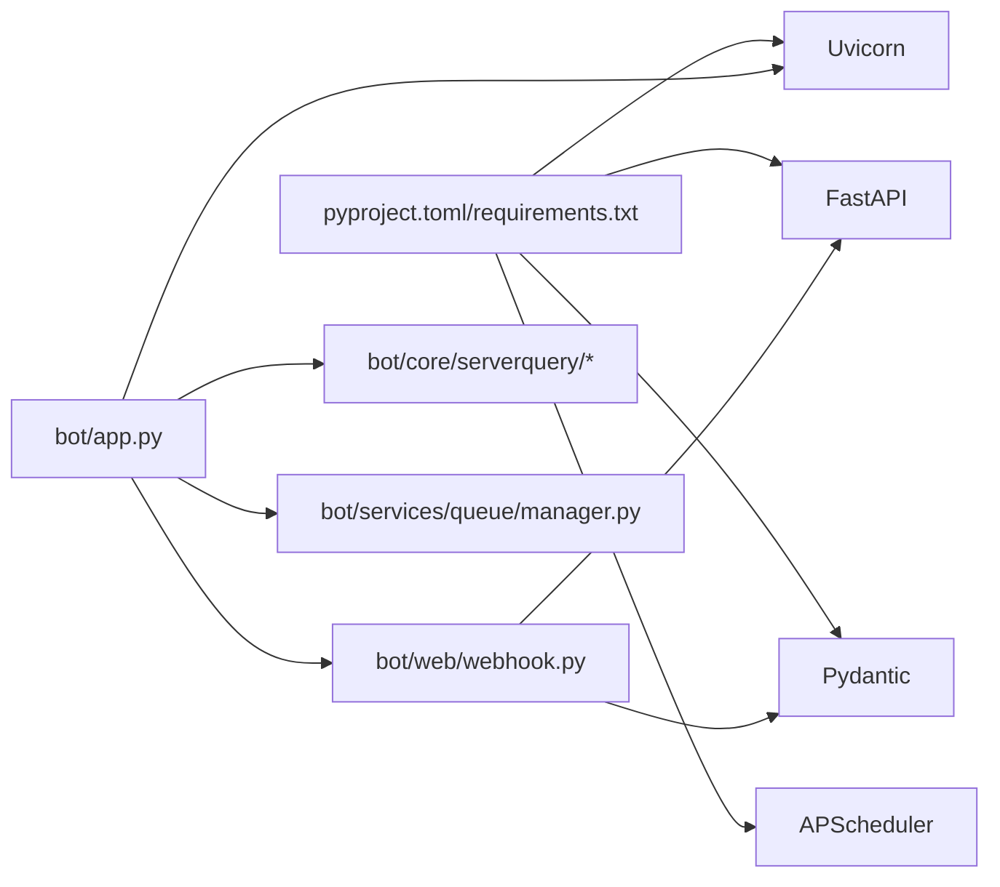

# Webhook和API

<cite>
**本文引用的文件**
- [bot/web/webhook.py](file://bot/web/webhook.py)
- [bot/app.py](file://bot/app.py)
- [bot/__main__.py](file://bot/__main__.py)
- [config/config.yaml](file://config/config.yaml)
- [bot/config.py](file://bot/config.py)
- [bot/core/commands/handlers/debug.py](file://bot/core/commands/handlers/debug.py)
- [bot/services/queue/manager.py](file://bot/services/queue/manager.py)
- [bot/core/serverquery/client.py](file://bot/core/serverquery/client.py)
- [bot/core/serverquery/protocol.py](file://bot/core/serverquery/protocol.py)
- [bot/core/serverquery/events.py](file://bot/core/serverquery/events.py)
- [pyproject.toml](file://pyproject.toml)
- [requirements.txt](file://requirements.txt)
</cite>

## 目录
1. [简介](#简介)
2. [项目结构](#项目结构)
3. [核心组件](#核心组件)
4. [架构总览](#架构总览)
5. [详细组件分析](#详细组件分析)
6. [依赖分析](#依赖分析)
7. [性能考量](#性能考量)
8. [故障排查指南](#故障排查指南)
9. [结论](#结论)
10. [附录](#附录)

## 简介
本技术文档聚焦于Webhook与API服务，系统性说明Webhook接收器的架构设计、HTTP API的实现原理，并深入分析状态查询接口、健康检查机制与监控API的设计思路。同时阐述API的安全认证、错误处理与响应格式规范，提供API使用示例与集成指南，并给出性能优化与扩展性建议。

## 项目结构
该项目采用模块化分层组织：
- 应用入口与生命周期管理：bot/app.py、bot/__main__.py
- 配置加载与模型：bot/config.py、config/config.yaml
- Webhook与API：bot/web/webhook.py
- 核心通信与事件：bot/core/serverquery/*（协议、客户端、事件）
- 业务服务：音乐队列、聊天、自动化等
- 依赖声明：pyproject.toml、requirements.txt

图表来源
- [bot/app.py:27-111](file://bot/app.py#L27-L111)
- [bot/web/webhook.py:16-75](file://bot/web/webhook.py#L16-L75)
- [bot/core/serverquery/client.py:27-170](file://bot/core/serverquery/client.py#L27-L170)
- [bot/core/serverquery/protocol.py:137-159](file://bot/core/serverquery/protocol.py#L137-L159)
- [bot/services/queue/manager.py:35-120](file://bot/services/queue/manager.py#L35-L120)

章节来源
- [bot/app.py:27-111](file://bot/app.py#L27-L111)
- [bot/web/webhook.py:16-75](file://bot/web/webhook.py#L16-L75)
- [bot/core/serverquery/client.py:27-170](file://bot/core/serverquery/client.py#L27-L170)
- [bot/core/serverquery/protocol.py:137-159](file://bot/core/serverquery/protocol.py#L137-L159)
- [bot/services/queue/manager.py:35-120](file://bot/services/queue/manager.py#L35-L120)

## 核心组件
- Webhook FastAPI应用：提供POST /webhook、GET /status、GET /health三个端点，具备可选的Bearer密钥认证。
- BotApplication：负责装配各子系统、启动Webhook服务器、管理生命周期。
- AsyncServerQueryClient：维护与TeamSpeak 3 ServerQuery的持久连接，处理事件与命令。
- MusicQueue：管理播放队列、历史记录与重复模式，供状态接口使用。
- 配置系统：BotConfig/WebhookConfig定义运行参数，支持环境变量插值。

章节来源
- [bot/web/webhook.py:32-75](file://bot/web/webhook.py#L32-L75)
- [bot/app.py:255-282](file://bot/app.py#L255-L282)
- [bot/core/serverquery/client.py:27-170](file://bot/core/serverquery/client.py#L27-L170)
- [bot/services/queue/manager.py:35-120](file://bot/services/queue/manager.py#L35-L120)
- [bot/config.py:110-134](file://bot/config.py#L110-L134)

## 架构总览
Webhook与API服务以独立的FastAPI应用形式运行，通过BotApplication在启动阶段按配置启用。Webhook应用依赖BotApplication持有的ServerQuery客户端与音乐队列，用于执行回复与状态查询。

图表来源
- [bot/web/webhook.py:32-75](file://bot/web/webhook.py#L32-L75)
- [bot/app.py:255-282](file://bot/app.py#L255-L282)
- [bot/core/serverquery/client.py:392-396](file://bot/core/serverquery/client.py#L392-L396)
- [bot/services/queue/manager.py:52-63](file://bot/services/queue/manager.py#L52-L63)

## 详细组件分析

### Webhook应用与安全认证
- 端点设计
  - POST /webhook：接收外部通知，转发至指定频道。
  - GET /status：返回运行状态、连接状态、当前歌曲、队列长度、运行时长。
  - GET /health：轻量健康检查。
- 认证机制
  - 可选Bearer密钥校验；若配置了密钥，则请求头需携带 Authorization: Bearer <secret>，否则返回403。
- 错误处理
  - 内部异常统一捕获并记录日志，返回500及错误详情。
- 数据模型
  - WebhookMessage：包含消息内容与目标频道ID。
  - StatusResponse：包含状态字符串、连接状态、当前歌曲名称、队列长度、运行时长。

图表来源
- [bot/web/webhook.py:32-75](file://bot/web/webhook.py#L32-L75)

章节来源
- [bot/web/webhook.py:32-75](file://bot/web/webhook.py#L32-L75)

### BotApplication与Webhook启动
- 启动流程
  - 加载配置，初始化各子系统（ServerQuery、音频、队列、聊天、自动化、调度）。
  - 注册命令与事件处理器。
  - 按配置决定是否启动Webhook服务器。
- Webhook服务器
  - 使用Uvicorn在指定主机与端口启动。
  - 将BotApplication实例注入Webhook应用，以便访问ServerQuery与队列。

图表来源
- [bot/__main__.py:9-12](file://bot/__main__.py#L9-L12)
- [bot/app.py:255-282](file://bot/app.py#L255-L282)

章节来源
- [bot/__main__.py:9-12](file://bot/__main__.py#L9-L12)
- [bot/app.py:255-282](file://bot/app.py#L255-L282)

### ServerQuery客户端与协议
- 客户端职责
  - 维护连接、登录、选择虚拟服务器、注册事件、心跳保活、自动重连。
  - 提供命令发送与事件分发能力。
- 协议工具
  - 命令构建：build_command，自动转义特殊字符。
  - 响应解析：parse_response，分离数据与错误。
- 事件系统
  - 事件分发器订阅多种通知类型，如文本消息、客户端加入/离开、移动等。

图表来源
- [bot/core/serverquery/client.py:27-170](file://bot/core/serverquery/client.py#L27-L170)
- [bot/core/serverquery/protocol.py:63-159](file://bot/core/serverquery/protocol.py#L63-L159)
- [bot/core/serverquery/events.py:102-106](file://bot/core/serverquery/events.py#L102-L106)

章节来源
- [bot/core/serverquery/client.py:27-170](file://bot/core/serverquery/client.py#L27-L170)
- [bot/core/serverquery/protocol.py:63-159](file://bot/core/serverquery/protocol.py#L63-L159)
- [bot/core/serverquery/events.py:102-106](file://bot/core/serverquery/events.py#L102-L106)

### 音乐队列与状态接口
- 队列特性
  - FIFO队列、重复模式（关闭/单曲/全部）、跳过投票阈值、历史记录。
- 状态接口数据来源
  - 当前歌曲名称来自队列当前项。
  - 队列长度来自队列属性。
  - 运行时长基于调试模块中的启动时间计算。
  - 连接状态来自ServerQuery客户端。

图表来源
- [bot/web/webhook.py:51-69](file://bot/web/webhook.py#L51-L69)
- [bot/core/commands/handlers/debug.py:10](file://bot/core/commands/handlers/debug.py#L10)
- [bot/services/queue/manager.py:52-63](file://bot/services/queue/manager.py#L52-L63)

章节来源
- [bot/web/webhook.py:51-69](file://bot/web/webhook.py#L51-L69)
- [bot/core/commands/handlers/debug.py:10](file://bot/core/commands/handlers/debug.py#L10)
- [bot/services/queue/manager.py:52-63](file://bot/services/queue/manager.py#L52-L63)

### 配置与环境变量插值
- 配置模型
  - BotConfig包含TS3、音频、网易云、聊天、自动化、调度、Webhook、日志等子配置。
  - WebhookConfig包含enabled/host/port/secret。
- 环境变量插值
  - 支持${ENV_VAR}语法，运行时替换为环境变量值。
- 默认行为
  - Webhook默认禁用，需显式开启并设置密钥。

章节来源
- [bot/config.py:110-134](file://bot/config.py#L110-L134)
- [config/config.yaml:62-68](file://config/config.yaml#L62-L68)

## 依赖分析
- 外部依赖
  - FastAPI/Uvicorn：Webhook API服务。
  - Pydantic：数据模型与验证。
  - APScheduler：调度服务（非Webhook直接依赖）。
- 内部依赖
  - Webhook应用依赖BotApplication提供的ServerQuery客户端与音乐队列。
  - BotApplication依赖配置系统、ServerQuery客户端、队列等。

图表来源
- [pyproject.toml:6-16](file://pyproject.toml#L6-L16)
- [requirements.txt:1-9](file://requirements.txt#L1-L9)
- [bot/web/webhook.py:8-9](file://bot/web/webhook.py#L8-L9)
- [bot/app.py:260-276](file://bot/app.py#L260-L276)

章节来源
- [pyproject.toml:6-16](file://pyproject.toml#L6-L16)
- [requirements.txt:1-9](file://requirements.txt#L1-L9)
- [bot/web/webhook.py:8-9](file://bot/web/webhook.py#L8-L9)
- [bot/app.py:260-276](file://bot/app.py#L260-L276)

## 性能考量
- 并发与异步
  - Webhook与ServerQuery均基于异步IO，适合高并发场景。
- 资源隔离
  - Webhook作为独立进程/容器运行，避免与主Bot逻辑争抢资源。
- 连接管理
  - ServerQuery客户端内置保活与指数退避重连，降低断线影响。
- 响应与序列化
  - 使用Pydantic模型进行请求/响应序列化，减少手动解析开销。
- 扩展性建议
  - 引入限流与熔断（如基于速率限制或队列长度），防止突发流量导致队列积压。
  - 对/status接口增加缓存层，降低频繁读取队列的开销。
  - 将Webhook与主Bot拆分为独立服务，便于水平扩展与独立部署。

[本节为通用性能建议，不直接分析特定文件]

## 故障排查指南
- Webhook 403
  - 检查Authorization头是否为Bearer <secret>，且与配置一致。
- Webhook 500
  - 查看日志中“Webhook send failed”异常堆栈，定位ServerQuery发送失败原因。
- /status字段缺失或为空
  - 确认Webhook已启用且密钥正确；检查队列是否为空、当前歌曲是否存在。
- /health不可达
  - 确认Webhook服务已启动，监听地址与端口正确。
- ServerQuery连接问题
  - 关注客户端日志中的重连与错误提示，检查网络连通性与凭据。

章节来源
- [bot/web/webhook.py:35-49](file://bot/web/webhook.py#L35-L49)
- [bot/app.py:255-282](file://bot/app.py#L255-L282)
- [bot/core/serverquery/client.py:183-198](file://bot/core/serverquery/client.py#L183-L198)

## 结论
Webhook与API服务以简洁的FastAPI应用实现，结合BotApplication的生命周期管理与ServerQuery客户端的稳定连接，提供了可靠的外部通知与状态查询能力。通过可选的Bearer密钥认证、清晰的错误处理与响应模型，系统在易用性与安全性之间取得平衡。未来可在限流、缓存与服务拆分方面进一步增强扩展性与稳定性。

[本节为总结性内容，不直接分析特定文件]

## 附录

### API参考与使用示例

- 端点概览
  - POST /webhook
    - 请求头：Authorization: Bearer <secret>
    - 请求体：WebhookMessage（message, channel_id）
    - 成功响应：{"status":"ok"}
    - 失败响应：HTTP 500（内部异常）
  - GET /status
    - 请求头：Authorization: Bearer <secret>
    - 成功响应：StatusResponse（status, connected, current_song, queue_length, uptime）
  - GET /health
    - 无需认证
    - 成功响应：{"status":"ok"}

- 集成步骤
  1. 在配置中启用Webhook并设置密钥。
  2. 启动应用后，Webhook服务会在指定主机与端口运行。
  3. 外部系统向 /webhook 发送带密钥的POST请求，即可触发Bot回复。
  4. 通过 /status 获取运行状态，/health进行健康检查。

- 示例请求（路径指引）
  - POST /webhook：[bot/web/webhook.py:39-49](file://bot/web/webhook.py#L39-L49)
  - GET /status：[bot/web/webhook.py:51-69](file://bot/web/webhook.py#L51-L69)
  - GET /health：[bot/web/webhook.py:71-73](file://bot/web/webhook.py#L71-L73)

章节来源
- [bot/web/webhook.py:39-73](file://bot/web/webhook.py#L39-L73)
- [config/config.yaml:62-68](file://config/config.yaml#L62-L68)