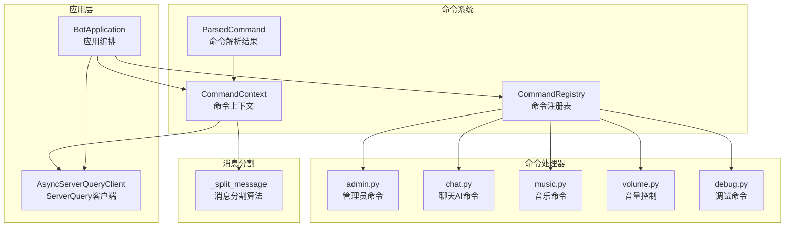
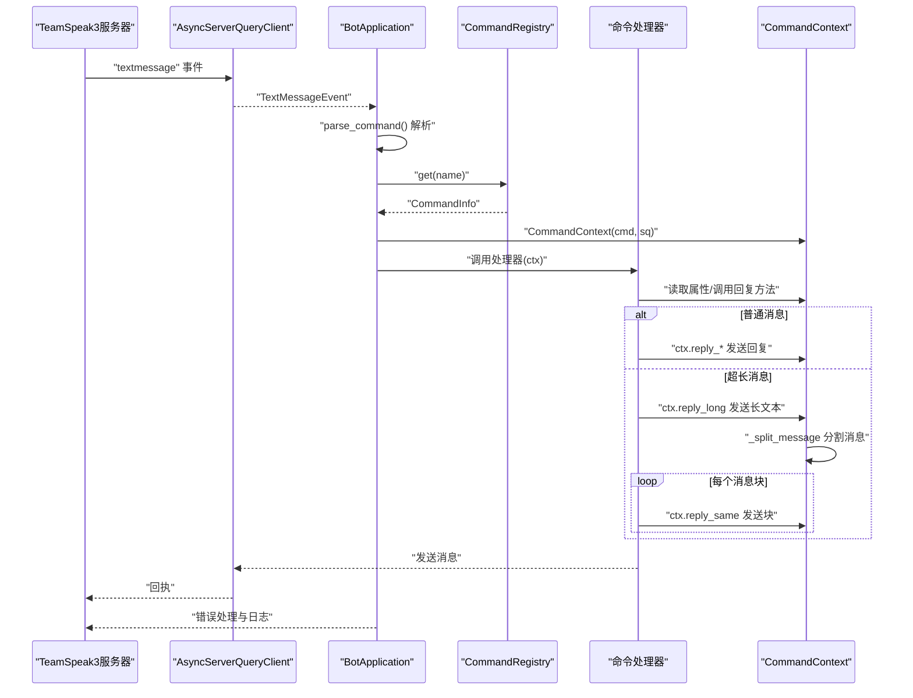
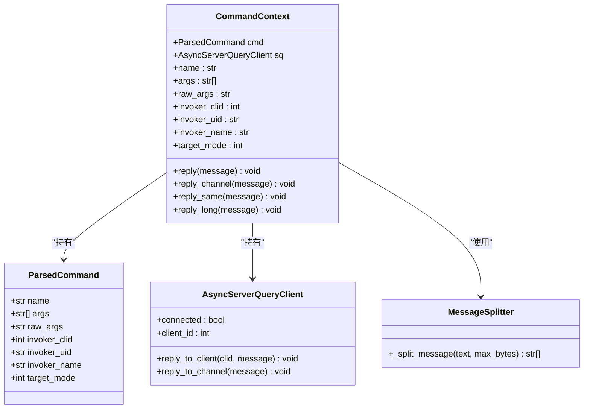
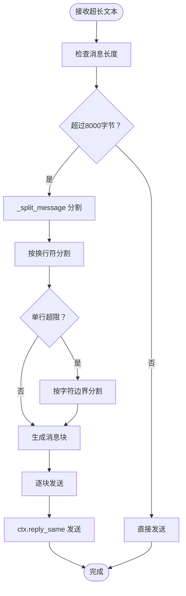
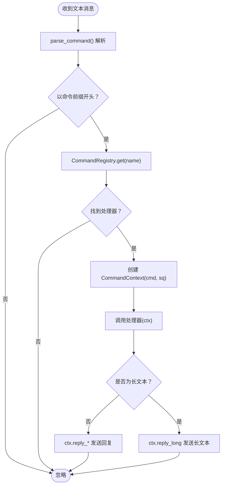
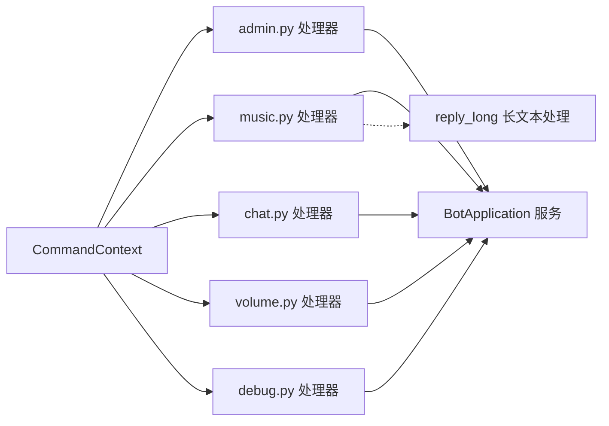
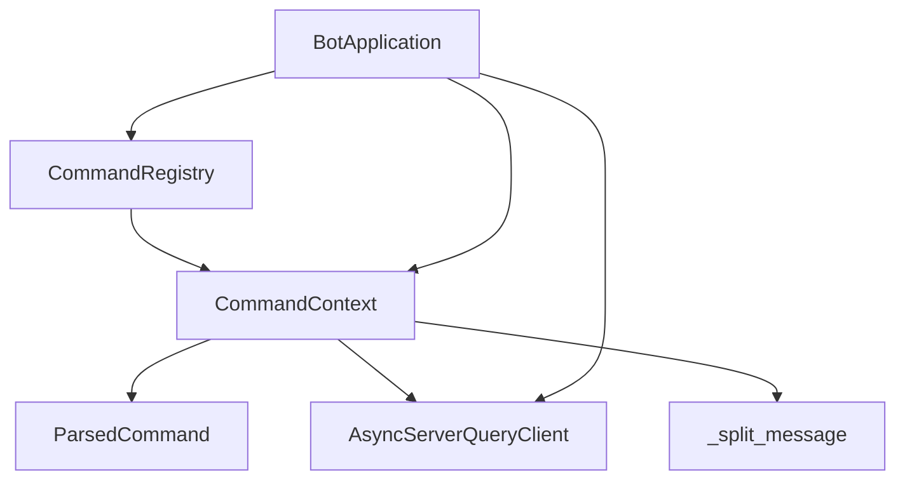

# 命令上下文管理

<cite>
**本文档引用的文件**
- [context.py](file://bot/core/commands/context.py)
- [parser.py](file://bot/core/commands/parser.py)
- [registry.py](file://bot/core/commands/registry.py)
- [app.py](file://bot/app.py)
- [client.py](file://bot/core/serverquery/client.py)
- [admin.py](file://bot/core/commands/handlers/admin.py)
- [chat.py](file://bot/core/commands/handlers/chat.py)
- [music.py](file://bot/core/commands/handlers/music.py)
- [volume.py](file://bot/core/commands/handlers/volume.py)
- [debug.py](file://bot/core/commands/handlers/debug.py)
- [context.py](file://bot/services/chat/context.py)
- [test_chat_context.py](file://tests/test_chat_context.py)
- [protocol.py](file://bot/core/serverquery/protocol.py)
</cite>

## 更新摘要
**变更内容**
- 新增长文本回复功能（reply_long方法）
- 添加消息分割算法实现
- 更新消息大小限制处理逻辑
- 增强超长文本消息的处理能力

## 目录
1. [简介](#简介)
2. [项目结构](#项目结构)
3. [核心组件](#核心组件)
4. [架构概览](#架构概览)
5. [详细组件分析](#详细组件分析)
6. [依赖关系分析](#依赖关系分析)
7. [性能考量](#性能考量)
8. [故障排除指南](#故障排除指南)
9. [结论](#结论)
10. [附录](#附录)

## 简介
本文件为命令上下文管理系统的技术文档，重点阐述 CommandContext 类的设计与实现，包括上下文对象的创建、属性管理与生命周期，以及在命令执行过程中如何在不同组件间传递和共享。文档还涵盖上下文在用户信息、频道信息和权限验证方面的数据流转机制，并提供最佳实践与安全考虑，以及扩展上下文对象的方法和自定义属性的添加示例。

**更新** 本版本新增了长文本回复功能，解决了 TeamSpeak3 ServerQuery 消息大小限制问题，能够自动分割超长文本消息，确保内容完整传输。

## 项目结构
命令上下文管理位于 bot/core/commands 子模块中，围绕 CommandContext、ParsedCommand、CommandRegistry 和 CommandContext 的使用场景展开。应用通过 BotApplication 统一编排，将命令解析、注册、执行与 ServerQuery 客户端交互整合在一起。

**图表来源**
- [context.py:13-136](file://bot/core/commands/context.py#L13-L136)
- [parser.py:9-67](file://bot/core/commands/parser.py#L9-L67)
- [registry.py:17-94](file://bot/core/commands/registry.py#L17-L94)
- [app.py:27-348](file://bot/app.py#L27-L348)
- [client.py:27-406](file://bot/core/serverquery/client.py#L27-L406)

**章节来源**
- [context.py:1-136](file://bot/core/commands/context.py#L1-L136)
- [parser.py:1-67](file://bot/core/commands/parser.py#L1-L67)
- [registry.py:1-94](file://bot/core/commands/registry.py#L1-L94)
- [app.py:1-348](file://bot/app.py#L1-L348)

## 核心组件
本节深入分析 CommandContext 类及其相关组件，包括上下文对象的创建、属性管理与生命周期，以及在命令执行流程中的传递机制。

- CommandContext：封装命令调用元数据与回复辅助方法，提供 invoker（调用者）信息与目标模式（私聊/频道/服务器），并提供 reply、reply_channel、reply_same、**reply_long** 等便捷方法。
- ParsedCommand：由解析器生成，包含命令名称、参数列表、原始参数字符串、调用者信息与目标模式等字段。
- CommandRegistry：装饰器式注册命令处理器，维护命令名到处理器的映射及别名映射，提供帮助信息格式化能力。
- BotApplication：应用入口，负责注册命令、建立 ServerQuery 连接、订阅事件、路由文本消息到命令系统，并在命令执行前后进行异常处理与日志记录。

**更新** 新增的 reply_long 方法专门处理超长文本消息，通过智能分割算法确保消息完整传输。

**章节来源**
- [context.py:13-136](file://bot/core/commands/context.py#L13-L136)
- [parser.py:9-67](file://bot/core/commands/parser.py#L9-L67)
- [registry.py:17-94](file://bot/core/commands/registry.py#L17-L94)
- [app.py:27-348](file://bot/app.py#L27-L348)

## 架构概览
命令执行的完整流程如下：
1. 文本消息到达 ServerQuery 事件分发器。
2. BotApplication 将消息交给命令解析器，生成 ParsedCommand。
3. 在 CommandRegistry 中查找对应命令处理器。
4. 创建 CommandContext 并传入处理器。
5. 处理器根据上下文属性与服务层交互，使用上下文提供的回复方法向调用者或当前频道发送消息。
6. 对于超长文本，使用 reply_long 方法自动分割并逐条发送。
7. 异常被捕获并通过上下文进行错误反馈。

**图表来源**
- [app.py:162-198](file://bot/app.py#L162-L198)
- [parser.py:22-67](file://bot/core/commands/parser.py#L22-L67)
- [registry.py:68-83](file://bot/core/commands/registry.py#L68-L83)
- [context.py:75-136](file://bot/core/commands/context.py#L75-L136)
- [client.py:356-364](file://bot/core/serverquery/client.py#L356-L364)

**章节来源**
- [app.py:162-198](file://bot/app.py#L162-L198)
- [parser.py:22-67](file://bot/core/commands/parser.py#L22-L67)
- [registry.py:68-83](file://bot/core/commands/registry.py#L68-L83)
- [context.py:75-136](file://bot/core/commands/context.py#L75-L136)
- [client.py:356-364](file://bot/core/serverquery/client.py#L356-L364)

## 详细组件分析

### CommandContext 类设计与实现
CommandContext 是命令执行过程中的核心上下文对象，负责：
- 暴露调用者信息：名称、UID、CLID、目标模式等。
- 提供统一的回复接口：私聊回复、频道回复、按原消息上下文回复、**长文本回复**。
- 与 ServerQuery 客户端交互以发送消息。

**更新** 新增了 reply_long 方法，专门处理超过 8000 字节的消息限制问题。

**图表来源**
- [context.py:13-136](file://bot/core/commands/context.py#L13-L136)
- [parser.py:9-20](file://bot/core/commands/parser.py#L9-L20)
- [client.py:27-406](file://bot/core/serverquery/client.py#L27-L406)

**章节来源**
- [context.py:13-136](file://bot/core/commands/context.py#L13-L136)

### 长文本回复功能实现
**新增功能** reply_long 方法实现了智能消息分割，解决 TeamSpeak3 ServerQuery 的消息大小限制问题。

- **消息大小限制**：TS3 ServerQuery sendtextmessage 参数限制为 8192 字节，实际使用 8000 字节以留出协议开销空间。
- **分割策略**：优先按换行符分割，如果单行超过限制则按字符边界分割，确保不破坏 UTF-8 编码完整性。
- **自动发送**：分割后的消息块会自动使用 reply_same 方法按原消息上下文发送。

**图表来源**
- [context.py:75-136](file://bot/core/commands/context.py#L75-L136)

**章节来源**
- [context.py:75-136](file://bot/core/commands/context.py#L75-L136)

### 命令解析与上下文创建
命令解析器将原始文本消息转换为 ParsedCommand，随后 BotApplication 使用该解析结果创建 CommandContext，并将其传递给对应的命令处理器。

**图表来源**
- [app.py:170-191](file://bot/app.py#L170-L191)
- [parser.py:22-67](file://bot/core/commands/parser.py#L22-L67)
- [registry.py:68-83](file://bot/core/commands/registry.py#L68-L83)
- [context.py:75-136](file://bot/core/commands/context.py#L75-L136)

**章节来源**
- [app.py:170-191](file://bot/app.py#L170-L191)
- [parser.py:22-67](file://bot/core/commands/parser.py#L22-L67)
- [registry.py:68-83](file://bot/core/commands/registry.py#L68-L83)
- [context.py:75-136](file://bot/core/commands/context.py#L75-L136)

### 上下文在不同命令处理器间的共享与访问
各命令处理器通过 CommandContext 访问调用者信息与回复方法，同时可访问应用实例中的服务层（如音乐队列、聊天服务、自动化服务等）。例如：
- 管理员命令：读取上下文参数，更新应用状态并通过上下文回复。
- 音乐命令：基于上下文调用服务层点歌、播放、队列管理等操作，**支持长文本歌词显示**。
- 聊天命令：利用上下文的调用者信息与频道信息隔离对话上下文。
- 音量命令：读取当前音量并通过上下文调整后回复。
- 调试命令：通过上下文检查连接状态与客户端ID并回复状态信息。

**更新** 音乐命令中的歌词显示现在可以使用 reply_long 方法处理超长歌词内容。

**图表来源**
- [admin.py:17-75](file://bot/core/commands/handlers/admin.py#L17-L75)
- [music.py:17-306](file://bot/core/commands/handlers/music.py#L17-L306)
- [chat.py:18-81](file://bot/core/commands/handlers/chat.py#L18-L81)
- [volume.py:17-50](file://bot/core/commands/handlers/volume.py#L17-L50)
- [debug.py:13-37](file://bot/core/commands/handlers/debug.py#L13-L37)

**章节来源**
- [admin.py:17-75](file://bot/core/commands/handlers/admin.py#L17-L75)
- [music.py:17-306](file://bot/core/commands/handlers/music.py#L17-L306)
- [chat.py:18-81](file://bot/core/commands/handlers/chat.py#L18-L81)
- [volume.py:17-50](file://bot/core/commands/handlers/volume.py#L17-L50)
- [debug.py:13-37](file://bot/core/commands/handlers/debug.py#L13-L37)

### 权限验证与数据流转
- 用户信息：上下文暴露 invoker_clid、invoker_uid、invoker_name，用于识别调用者身份。
- 频道信息：上下文包含 target_mode，结合服务层查询（如 whoami、client_list）可获取频道ID等信息，用于上下文隔离（如聊天AI的人设与上下文按频道或用户维度管理）。
- 权限验证：命令注册时可标记 admin_only，处理器内部可根据需要进行权限判断（例如管理员命令在处理器中体现为 admin_only=True）。

**章节来源**
- [context.py:24-50](file://bot/core/commands/context.py#L24-L50)
- [parser.py:22-67](file://bot/core/commands/parser.py#L22-L67)
- [registry.py:35-66](file://bot/core/commands/registry.py#L35-L66)
- [chat.py:27-39](file://bot/core/commands/handlers/chat.py#L27-L39)
- [music.py:94-114](file://bot/core/commands/handlers/music.py#L94-L114)

### 上下文扩展与自定义属性
当前 CommandContext 已提供常用属性与回复方法。若需扩展，建议：
- 在 CommandContext 上增加只读属性以暴露更多调用者或环境信息（如频道ID、虚拟服务器ID等）。
- 通过应用实例注入自定义上下文扩展（不直接修改核心上下文类），在处理器中按需访问。
- 对于跨处理器共享的状态，优先使用应用实例的服务层或配置对象，避免在上下文中存储过多状态。

**更新** 新增的 reply_long 方法为长文本处理提供了标准化解决方案，减少了重复代码和错误处理。

**章节来源**
- [context.py:13-136](file://bot/core/commands/context.py#L13-L136)
- [app.py:27-111](file://bot/app.py#L27-L111)

## 依赖关系分析
CommandContext 与 CommandRegistry、ParsedCommand、AsyncServerQueryClient 之间存在直接依赖；BotApplication 作为编排者，协调解析、注册与执行流程。

**图表来源**
- [context.py:13-136](file://bot/core/commands/context.py#L13-L136)
- [parser.py:9-20](file://bot/core/commands/parser.py#L9-L20)
- [registry.py:17-94](file://bot/core/commands/registry.py#L17-L94)
- [client.py:27-406](file://bot/core/serverquery/client.py#L27-L406)
- [app.py:27-111](file://bot/app.py#L27-L111)

**章节来源**
- [context.py:13-136](file://bot/core/commands/context.py#L13-L136)
- [registry.py:17-94](file://bot/core/commands/registry.py#L17-L94)
- [client.py:27-406](file://bot/core/serverquery/client.py#L27-L406)
- [app.py:27-111](file://bot/app.py#L27-L111)

## 性能考量
- 回复路径：CommandContext 的回复方法直接委托给 AsyncServerQueryClient，避免在上下文中引入额外的异步开销。
- 解析效率：命令解析采用 shlex.split，遇到不匹配引号时回退到简单分割，保证健壮性的同时降低解析成本。
- 事件驱动：ServerQuery 采用事件驱动与后台任务处理，减少阻塞，提升吞吐量。
- 上下文隔离：聊天AI的上下文按频道或用户维度管理，避免全局状态带来的锁竞争与内存膨胀。
- **长文本优化**：消息分割算法优化了内存使用，避免一次性处理超大字符串，同时通过批量发送减少网络往返次数。

**更新** 新增的长文本处理功能在性能方面进行了专门优化，确保高效处理超长消息。

**章节来源**
- [context.py:52-136](file://bot/core/commands/context.py#L52-L136)
- [parser.py:22-67](file://bot/core/commands/parser.py#L22-L67)
- [client.py:165-290](file://bot/core/serverquery/client.py#L165-L290)
- [context.py:87-136](file://bot/services/chat/context.py#L87-L136)

## 故障排除指南
- 命令未执行：检查命令前缀、解析结果与注册表映射，确认 CommandRegistry.get 返回非空。
- 回复失败：确认 AsyncServerQueryClient 已连接且 client_id 可用；在 BotApplication 中捕获异常并尝试通过上下文回复错误信息。
- 权限问题：管理员命令需在注册时标记 admin_only，并在处理器中进行相应校验。
- 频道上下文错误：聊天AI命令应先查询 whoami 获取频道ID，确保上下文隔离正确。
- **长文本显示不完整**：检查消息是否超过 8000 字节限制，确认 reply_long 方法被正确调用；验证分割算法是否正确处理 UTF-8 编码。

**更新** 新增了长文本处理相关的故障排除指导。

**章节来源**
- [app.py:182-198](file://bot/app.py#L182-L198)
- [client.py:71-78](file://bot/core/serverquery/client.py#L71-L78)
- [chat.py:27-39](file://bot/core/commands/handlers/chat.py#L27-L39)
- [registry.py:35-66](file://bot/core/commands/registry.py#L35-L66)
- [context.py:75-136](file://bot/core/commands/context.py#L75-L136)

## 结论
CommandContext 为命令执行提供了统一、简洁的上下文抽象，结合 ParsedCommand 与 CommandRegistry 实现了清晰的命令生命周期管理。通过 BotApplication 的编排，命令在解析、注册、执行与回复的全链路中保持一致的上下文传递机制。

**更新** 新增的长文本回复功能进一步增强了系统的实用性，通过智能消息分割算法解决了 TeamSpeak3 ServerQuery 的消息大小限制问题，确保超长文本内容的完整传输。这一功能的集成体现了系统设计的前瞻性和对用户体验的关注。

对于扩展需求，建议通过应用实例注入而非直接修改核心上下文类，以维持架构的稳定性与可维护性。

## 附录

### 最佳实践
- 使用上下文的只读属性访问调用者信息，避免在上下文中存储可变状态。
- 在处理器中优先使用 ctx.reply_same，以保持与调用者相同的回复上下文。
- 对于需要跨处理器共享的状态，使用应用实例的服务层或配置对象。
- 在命令注册时明确 admin_only 标记，确保权限控制的一致性。
- **长文本处理**：对于可能超过 8000 字节的内容，优先使用 ctx.reply_long 而非 ctx.reply_same，确保内容完整显示。

### 安全考虑
- 避免在上下文中存储敏感信息（如密码、令牌），应通过服务层进行访问控制。
- 对用户输入进行严格校验与清理，防止注入攻击。
- 在异常处理中避免泄露内部错误细节，仅向调用者返回必要的提示信息。
- **消息分割安全**：确保分割算法正确处理 UTF-8 编码，避免产生损坏的字符序列。

### 扩展方法与自定义属性示例
- 在 CommandContext 上新增只读属性以暴露更多调用者或环境信息（如频道ID、虚拟服务器ID等）。
- 通过应用实例注入自定义上下文扩展，在处理器中按需访问。
- 对于跨处理器共享的状态，优先使用应用实例的服务层或配置对象，避免在上下文中存储过多状态。
- **消息分割扩展**：如需自定义分割策略，可在 _split_message 函数基础上进行扩展，但需保持 UTF-8 编码完整性。

**更新** 新增了长文本处理相关的最佳实践和安全考虑。

**章节来源**
- [context.py:13-136](file://bot/core/commands/context.py#L13-L136)
- [app.py:27-111](file://bot/app.py#L27-L111)
- [context.py:75-136](file://bot/core/commands/context.py#L75-L136)