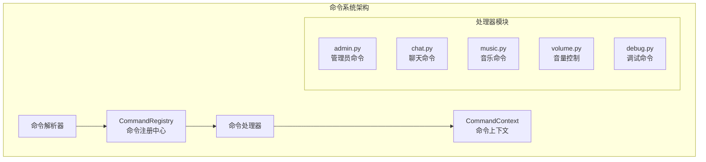
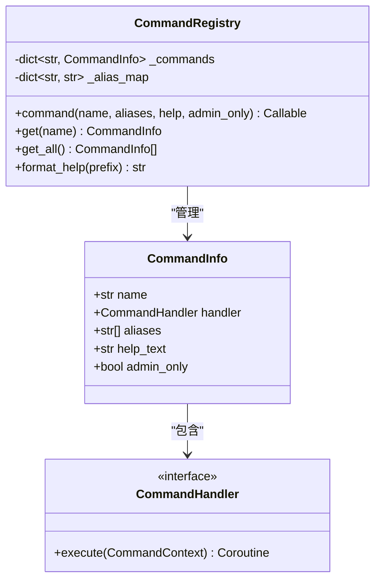
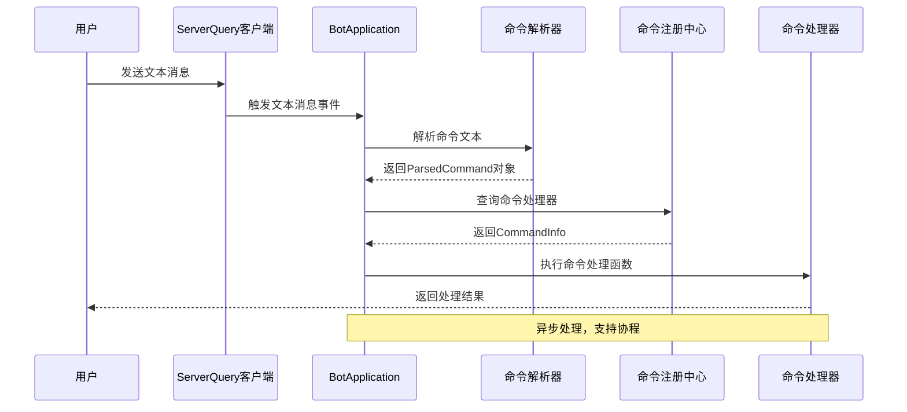
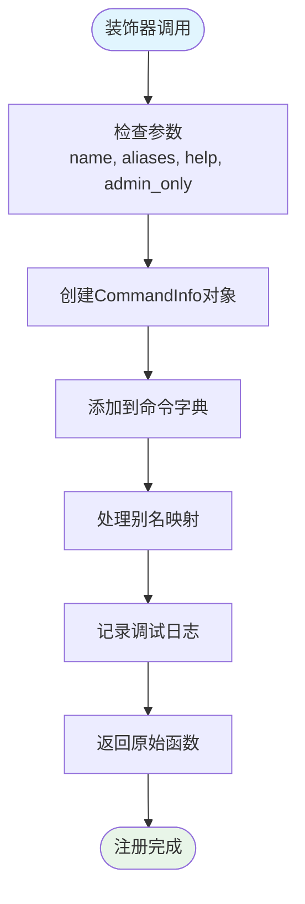
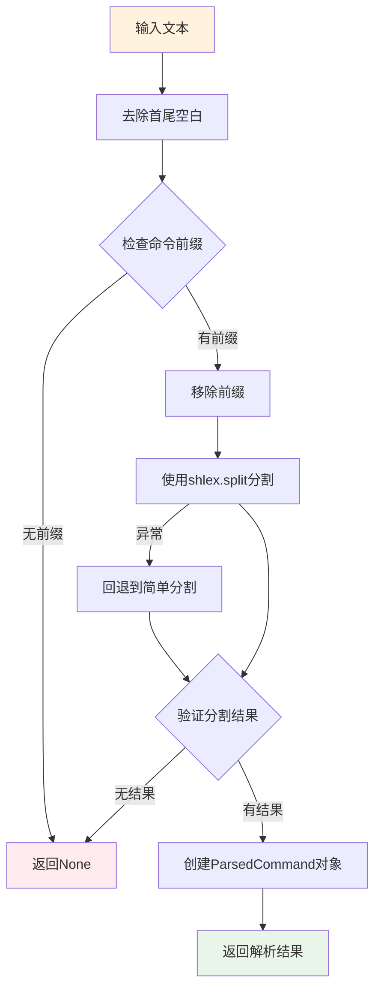
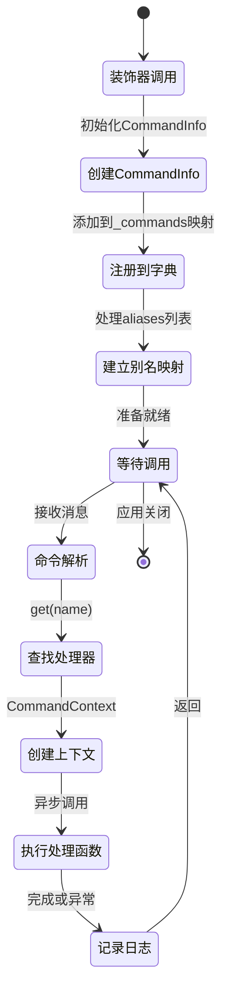
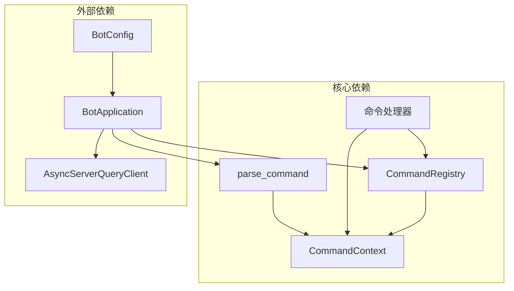

# 命令注册机制

<cite>
**本文档引用的文件**
- [registry.py](file://bot/core/commands/registry.py)
- [context.py](file://bot/core/commands/context.py)
- [parser.py](file://bot/core/commands/parser.py)
- [app.py](file://bot/app.py)
- [admin.py](file://bot/core/commands/handlers/admin.py)
- [chat.py](file://bot/core/commands/handlers/chat.py)
- [music.py](file://bot/core/commands/handlers/music.py)
- [volume.py](file://bot/core/commands/handlers/volume.py)
- [debug.py](file://bot/core/commands/handlers/debug.py)
- [config.py](file://bot/config.py)
- [config.yaml](file://config/config.yaml)
</cite>

## 目录
1. [简介](#简介)
2. [项目结构](#项目结构)
3. [核心组件](#核心组件)
4. [架构概览](#架构概览)
5. [详细组件分析](#详细组件分析)
6. [依赖关系分析](#依赖关系分析)
7. [性能考虑](#性能考虑)
8. [故障排除指南](#故障排除指南)
9. [最佳实践](#最佳实践)
10. [结论](#结论)

## 简介

本项目采用装饰器模式实现命令注册机制，通过CommandRegistry类提供统一的命令管理接口。该机制允许开发者以声明式的方式注册命令处理器，自动处理参数解析、别名映射和帮助文本管理。系统支持异步命令处理，具备完善的错误处理和日志记录功能。

## 项目结构

命令系统位于`bot/core/commands/`目录下，采用模块化设计：



**图表来源**
- [registry.py:28-94](file://bot/core/commands/registry.py#L28-L94)
- [context.py:13-70](file://bot/core/commands/context.py#L13-L70)
- [parser.py:22-67](file://bot/core/commands/parser.py#L22-L67)

**章节来源**
- [registry.py:1-94](file://bot/core/commands/registry.py#L1-L94)
- [app.py:140-151](file://bot/app.py#L140-L151)

## 核心组件

### CommandRegistry类

CommandRegistry是命令注册机制的核心，实现了装饰器模式和命令管理功能：



**图表来源**
- [registry.py:28-94](file://bot/core/commands/registry.py#L28-L94)

### CommandInfo数据结构

CommandInfo用于存储命令元数据，包括：
- 命令名称：唯一标识符
- 处理函数：实际的命令逻辑
- 别名列表：命令的替代名称
- 帮助文本：命令的使用说明
- 管理员权限：是否需要管理员权限

**章节来源**
- [registry.py:17-26](file://bot/core/commands/registry.py#L17-L26)
- [registry.py:28-66](file://bot/core/commands/registry.py#L28-L66)

## 架构概览

命令系统采用事件驱动架构，从消息接收到底层处理的完整流程如下：



**图表来源**
- [app.py:162-198](file://bot/app.py#L162-L198)
- [parser.py:22-67](file://bot/core/commands/parser.py#L22-L67)
- [registry.py:68-78](file://bot/core/commands/registry.py#L68-L78)

## 详细组件分析

### 命令装饰器实现机制

命令装饰器采用Python的装饰器语法，提供简洁的注册方式：



**图表来源**
- [registry.py:35-66](file://bot/core/commands/registry.py#L35-L66)

### 参数处理机制

命令参数通过shlex模块进行安全解析，支持引号包裹的复杂参数：



**图表来源**
- [parser.py:22-67](file://bot/core/commands/parser.py#L22-L67)

### 命令生命周期

从装饰器调用到最终执行的完整生命周期：



**图表来源**
- [registry.py:68-82](file://bot/core/commands/registry.py#L68-L82)
- [context.py:20-70](file://bot/core/commands/context.py#L20-L70)

**章节来源**
- [registry.py:35-66](file://bot/core/commands/registry.py#L35-L66)
- [parser.py:22-67](file://bot/core/commands/parser.py#L22-L67)

### 命令处理器实现

各模块的命令处理器展示了不同的实现模式：

#### 音乐命令处理器
- 支持URL播放和搜索播放两种模式
- 实现投票跳过功能
- 提供队列管理和播放控制

#### 聊天命令处理器  
- 集成AI聊天服务
- 支持多个人设切换
- 实现上下文隔离和清理

#### 管理员命令处理器
- 包含跟随模式控制
- 支持定时提醒功能
- 提供欢迎消息设置

**章节来源**
- [music.py:17-243](file://bot/core/commands/handlers/music.py#L17-L243)
- [chat.py:18-81](file://bot/core/commands/handlers/chat.py#L18-L81)
- [admin.py:17-75](file://bot/core/commands/handlers/admin.py#L17-L75)

## 依赖关系分析

命令系统的核心依赖关系：



**图表来源**
- [app.py:13-14](file://bot/app.py#L13-L14)
- [registry.py:9](file://bot/core/commands/registry.py#L9)

**章节来源**
- [app.py:140-149](file://bot/app.py#L140-L149)
- [registry.py:13-14](file://bot/core/commands/registry.py#L13-L14)

## 性能考虑

### 内存优化
- 使用dataclass减少内存占用
- 字典查找O(1)时间复杂度
- 懒加载策略避免不必要的初始化

### 异步处理
- 全面采用async/await模式
- 非阻塞I/O操作
- 并发任务管理

### 缓存策略
- 命令别名映射缓存
- 配置环境变量插值缓存
- 日志级别动态调整

## 故障排除指南

### 常见问题及解决方案

#### 命令未注册
- 检查命令装饰器是否正确使用
- 确认注册函数在启动时被调用
- 验证命令名称唯一性

#### 参数解析失败
- 检查引号配对是否正确
- 验证命令前缀配置
- 确认参数边界条件

#### 权限不足
- 检查管理员权限配置
- 验证用户身份验证
- 确认命令访问控制

**章节来源**
- [registry.py:68-78](file://bot/core/commands/registry.py#L68-L78)
- [parser.py:46-49](file://bot/core/commands/parser.py#L46-L49)

## 最佳实践

### 命令注册最佳实践

1. **命名规范**
   - 使用小写字母和连字符
   - 避免与内置命令冲突
   - 保持命令语义清晰

2. **参数处理**
   - 始终验证参数有效性
   - 提供详细的错误提示
   - 支持多种输入格式

3. **权限管理**
   - 明确区分公开和管理员命令
   - 实施最小权限原则
   - 记录敏感操作日志

4. **错误处理**
   - 捕获并处理异常
   - 提供友好的错误信息
   - 实施降级策略

### 实际使用示例

以下是如何使用@registry.command装饰器注册自定义命令的完整示例：

```python
# 在命令处理器模块中
from bot.core.commands.registry import CommandRegistry
from bot.core.commands.context import CommandContext

def register(registry: CommandRegistry) -> None:
    """注册自定义命令处理器"""
    
    @registry.command(
        name="custom",           # 命令名称
        aliases=["c", "custom"],  # 别名列表
        help="这是一个自定义命令示例",  # 帮助文本
        admin_only=False        # 是否需要管理员权限
    )
    async def handle_custom(ctx: CommandContext) -> None:
        """自定义命令处理逻辑"""
        # 获取命令参数
        if not ctx.args:
            await ctx.reply_same("用法: !custom <参数>")
            return
            
        # 处理命令逻辑
        result = f"收到参数: {ctx.args}"
        await ctx.reply_same(result)
```

### 错误处理模式

```python
@registry.command("safe-command", help="安全命令示例")
async def handle_safe_command(ctx: CommandContext) -> None:
    try:
        # 可能失败的操作
        await risky_operation()
        await ctx.reply_same("操作成功")
    except ValueError as e:
        # 参数错误处理
        await ctx.reply_same(f"参数错误: {str(e)}")
    except Exception as e:
        # 通用错误处理
        logger.error(f"命令执行失败: {e}")
        await ctx.reply_same("操作失败，请重试")
```

**章节来源**
- [music.py:20-27](file://bot/core/commands/handlers/music.py#L20-L27)
- [chat.py:21-25](file://bot/core/commands/handlers/chat.py#L21-L25)
- [admin.py:62](file://bot/core/commands/handlers/admin.py#L62)

## 结论

本命令注册机制通过装饰器模式实现了高度模块化的命令管理系统。其设计特点包括：

1. **简洁的API**：使用装饰器语法简化命令注册
2. **灵活的配置**：支持别名、权限和帮助文本配置
3. **强大的扩展性**：模块化设计便于功能扩展
4. **完善的错误处理**：全面的异常捕获和日志记录
5. **高性能实现**：异步处理和内存优化

该机制为团队提供了可靠的命令处理基础设施，支持从简单的调试命令到复杂的音乐播放系统的各种应用场景。通过遵循最佳实践，开发者可以快速构建稳定、可维护的命令系统。