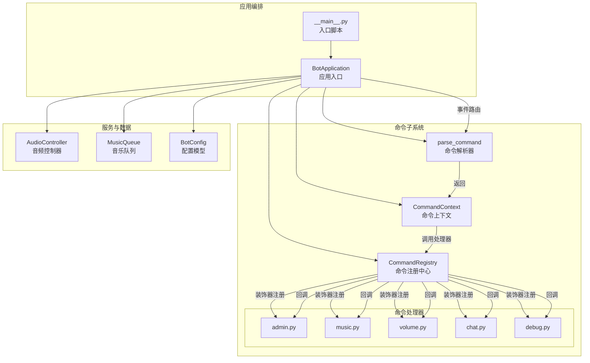
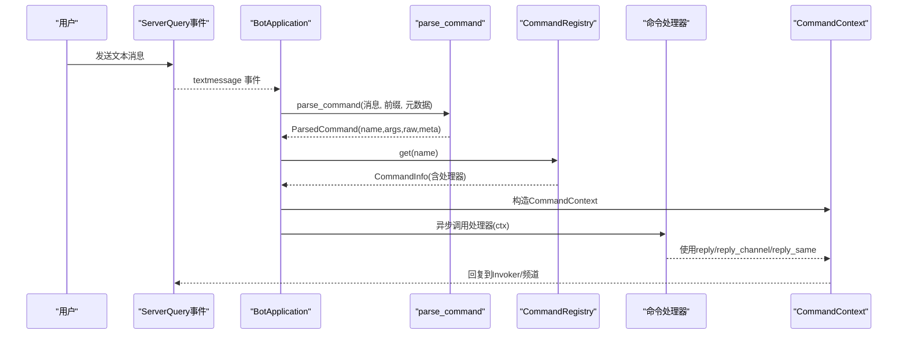
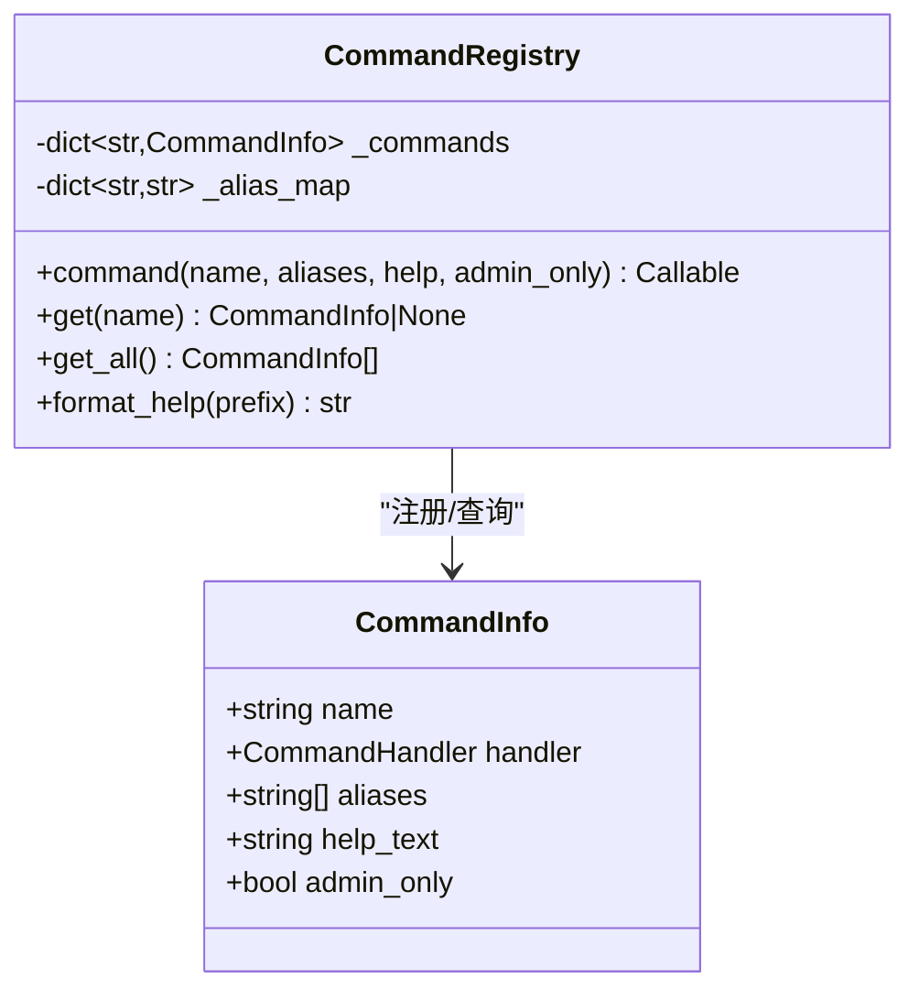
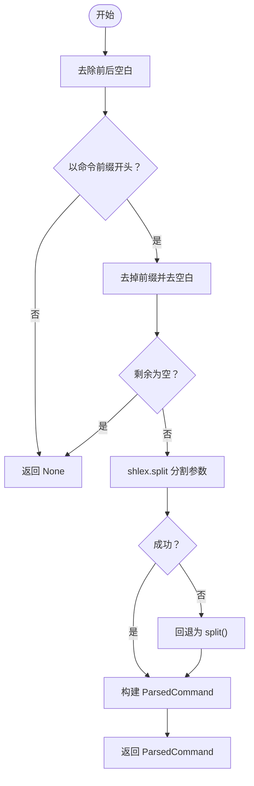
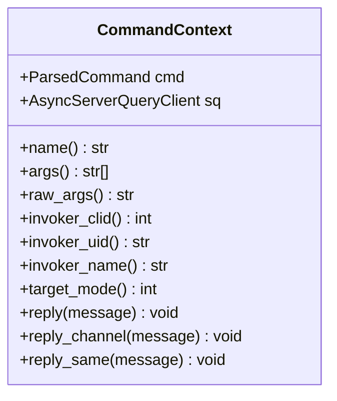
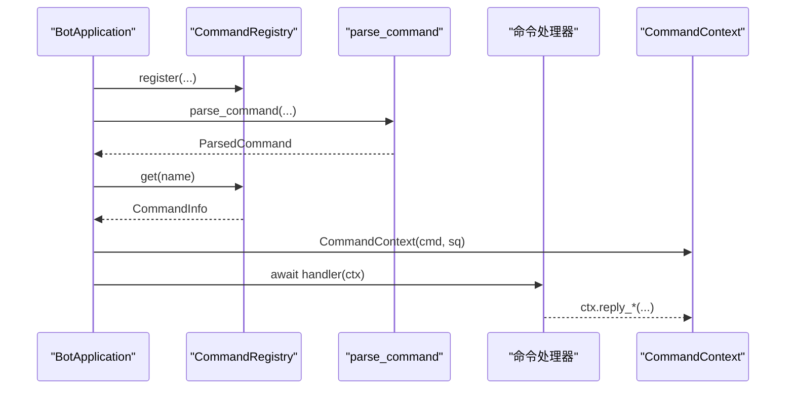
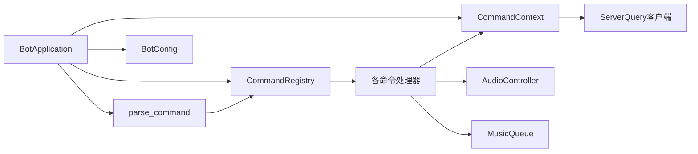

# 命令系统

<cite>
**本文引用的文件**
- [registry.py](file://bot/core/commands/registry.py)
- [parser.py](file://bot/core/commands/parser.py)
- [context.py](file://bot/core/commands/context.py)
- [app.py](file://bot/app.py)
- [__main__.py](file://bot/__main__.py)
- [admin.py](file://bot/core/commands/handlers/admin.py)
- [chat.py](file://bot/core/commands/handlers/chat.py)
- [debug.py](file://bot/core/commands/handlers/debug.py)
- [music.py](file://bot/core/commands/handlers/music.py)
- [volume.py](file://bot/core/commands/handlers/volume.py)
- [controller.py](file://bot/core/audio/controller.py)
- [manager.py](file://bot/services/queue/manager.py)
- [config.py](file://bot/config.py)
- [test_parser.py](file://tests/test_parser.py)
- [test_chat_context.py](file://tests/test_chat_context.py)
</cite>

## 目录
1. [简介](#简介)
2. [项目结构](#项目结构)
3. [核心组件](#核心组件)
4. [架构总览](#架构总览)
5. [详细组件分析](#详细组件分析)
6. [依赖分析](#依赖分析)
7. [性能考虑](#性能考虑)
8. [故障排查指南](#故障排查指南)
9. [结论](#结论)
10. [附录](#附录)

## 简介
本文件为命令系统的全面技术文档，围绕以下目标展开：命令注册机制（装饰器模式与动态注册）、命令解析器（参数提取、类型转换与验证）、权限控制与命令上下文管理、插件化扩展指南、常用命令使用示例以及自定义命令开发教程。文档以代码级分析为主，并辅以可视化图示，帮助不同背景的读者快速理解与上手。

## 项目结构
命令系统位于 bot/core/commands 目录，采用“注册中心 + 解析器 + 上下文”的分层设计，并通过应用入口统一编排。各功能模块按职责拆分为 handlers 子包，形成可插拔的扩展点。

图表来源
- [app.py:140-149](file://bot/app.py#L140-L149)
- [registry.py:28-66](file://bot/core/commands/registry.py#L28-L66)
- [parser.py:22-66](file://bot/core/commands/parser.py#L22-L66)
- [context.py:13-69](file://bot/core/commands/context.py#L13-L69)
- [admin.py:17-74](file://bot/core/commands/handlers/admin.py#L17-L74)
- [music.py:17-242](file://bot/core/commands/handlers/music.py#L17-L242)
- [volume.py:17-49](file://bot/core/commands/handlers/volume.py#L17-L49)
- [chat.py:18-80](file://bot/core/commands/handlers/chat.py#L18-L80)
- [debug.py:13-36](file://bot/core/commands/handlers/debug.py#L13-L36)
- [controller.py:24-143](file://bot/core/audio/controller.py#L24-L143)
- [manager.py:35-204](file://bot/services/queue/manager.py#L35-L204)
- [config.py:125-134](file://bot/config.py#L125-L134)

章节来源
- [app.py:140-149](file://bot/app.py#L140-L149)
- [registry.py:28-66](file://bot/core/commands/registry.py#L28-L66)
- [parser.py:22-66](file://bot/core/commands/parser.py#L22-L66)
- [context.py:13-69](file://bot/core/commands/context.py#L13-L69)

## 核心组件
- 命令注册中心：提供装饰器式注册、别名映射、帮助文本格式化与查询接口。
- 命令解析器：基于前缀识别、shlex 安全切分、参数与原始参数分离、元数据注入。
- 命令上下文：封装调用者信息与回复通道，屏蔽底层通信细节。
- 应用编排：集中初始化服务、注册命令、订阅事件、路由消息。
- 处理器模块：按功能分组（管理、音乐、音量、聊天、调试），每个模块提供 register 函数完成装饰器注册。

章节来源
- [registry.py:17-94](file://bot/core/commands/registry.py#L17-L94)
- [parser.py:9-66](file://bot/core/commands/parser.py#L9-L66)
- [context.py:13-70](file://bot/core/commands/context.py#L13-L70)
- [app.py:140-149](file://bot/app.py#L140-L149)

## 架构总览
命令系统遵循“事件驱动 + 装饰器注册 + 上下文传递”的模式。外部消息经应用层事件分发进入解析器，解析后由注册中心定位处理器，最终通过上下文进行回复。

图表来源
- [app.py:162-198](file://bot/app.py#L162-L198)
- [parser.py:22-66](file://bot/core/commands/parser.py#L22-L66)
- [registry.py:68-78](file://bot/core/commands/registry.py#L68-L78)
- [context.py:52-69](file://bot/core/commands/context.py#L52-L69)

## 详细组件分析

### 命令注册中心（CommandRegistry）
- 设计要点
  - 使用装饰器将命令处理器注册到内存字典，并建立别名到主命令的映射。
  - CommandInfo 承载名称、处理器、别名、帮助文本与管理员权限标记。
  - 提供 get/get_all/format_help，支持帮助生成与权限过滤。
- 关键流程
  - 装饰器注册：接收 name/aliases/help/admin_only，构造 CommandInfo 并写入索引。
  - 查询逻辑：优先精确匹配，其次别名映射；不存在则返回 None。
  - 帮助格式化：遍历排序后的命令，拼接名称、别名、帮助与权限标识。

图表来源
- [registry.py:28-94](file://bot/core/commands/registry.py#L28-L94)

章节来源
- [registry.py:28-94](file://bot/core/commands/registry.py#L28-L94)

### 命令解析器（parse_command）
- 设计要点
  - 基于前缀判断是否为命令；使用 shlex.split 安全分割参数，异常回退为简单 split。
  - 返回 ParsedCommand，包含命令名（小写）、参数列表、原始参数字符串与调用者元数据。
- 参数与类型处理
  - 名称：统一转小写，便于大小写不敏感匹配。
  - 参数：保持原始分词结果，便于后续处理器按需转换。
  - 元数据：Invoker 的 clid/uid/name/target_mode 透传至上下文。
- 错误与边界
  - 非命令前缀直接返回 None。
  - 切分失败回退策略避免崩溃。

图表来源
- [parser.py:22-66](file://bot/core/commands/parser.py#L22-L66)

章节来源
- [parser.py:22-66](file://bot/core/commands/parser.py#L22-L66)
- [test_parser.py:6-64](file://tests/test_parser.py#L6-L64)

### 命令上下文（CommandContext）
- 设计要点
  - 封装 ParsedCommand 与 ServerQuery 客户端，暴露只读属性与回复方法。
  - 提供 reply/reply_channel/reply_same，自动适配私聊/频道/原路回复。
- 与处理器协作
  - 处理器仅通过 ctx 访问参数与调用者信息，不关心底层通信细节。
  - reply_* 方法统一出口，便于未来扩展为多平台输出。

图表来源
- [context.py:13-70](file://bot/core/commands/context.py#L13-L70)

章节来源
- [context.py:13-70](file://bot/core/commands/context.py#L13-L70)

### 应用编排（BotApplication）
- 生命周期
  - 初始化：加载配置、创建服务实例、建立音频控制器与队列、创建聊天/AI服务等。
  - 注册：调用各模块 register，完成装饰器注册。
  - 事件：订阅 textmessage，将消息交由解析器与注册中心处理。
  - 启动：连接 ServerQuery、启动调度器与 webhook、进入运行循环。
- 命令路由
  - 解析 -> 查询 -> 构造上下文 -> 调用处理器 -> 异常捕获与回复。
- 音频与队列联动
  - 音乐命令与队列/音频控制器紧密耦合，播放完成后触发下一曲。

图表来源
- [app.py:140-198](file://bot/app.py#L140-L198)

章节来源
- [app.py:140-198](file://bot/app.py#L140-L198)
- [__main__.py:9-12](file://bot/__main__.py#L9-L12)

### 权限控制与命令上下文
- 权限控制
  - CommandInfo.admin_only 字段用于标记管理员命令。
  - 当前路由未在应用层做显式校验，建议在处理器内部或注册中心扩展鉴权钩子。
- 上下文管理
  - CommandContext 统一提供回复通道，屏蔽调用场景差异。
  - 可扩展：在上下文中增加权限令牌、角色集合、黑白名单等。

章节来源
- [registry.py:18-26](file://bot/core/commands/registry.py#L18-L26)
- [context.py:52-69](file://bot/core/commands/context.py#L52-L69)

### 插件化扩展指南与最佳实践
- 扩展步骤
  - 在 bot/core/commands/handlers 新建模块（如 mycmds.py）。
  - 实现 register(registry: CommandRegistry, app: BotApplication) -> None。
  - 在 BotApplication._register_commands 中导入并调用 register。
  - 使用 @registry.command(...) 装饰处理器函数。
- 最佳实践
  - 单一职责：每个模块聚焦一类命令。
  - 明确帮助：为每个命令提供 help 文本与 aliases。
  - 参数校验：在处理器内对参数进行显式类型转换与范围检查。
  - 错误处理：捕获异常并使用 ctx.reply_same 给出友好提示。
  - 配置驱动：将默认行为与阈值放入配置模型。

章节来源
- [app.py:140-149](file://bot/app.py#L140-L149)
- [admin.py:17-74](file://bot/core/commands/handlers/admin.py#L17-L74)
- [music.py:17-242](file://bot/core/commands/handlers/music.py#L17-L242)
- [volume.py:17-49](file://bot/core/commands/handlers/volume.py#L17-L49)
- [chat.py:18-80](file://bot/core/commands/handlers/chat.py#L18-L80)
- [debug.py:13-36](file://bot/core/commands/handlers/debug.py#L13-L36)

### 常用命令与使用示例
- 管理类
  - !help：查看帮助，支持别名 h。
  - !welcome <模板>：设置欢迎消息模板（管理员）。
  - !follow on/off：切换跟随模式（管理员）。
  - !remind <分钟> <消息>：设置一次性提醒。
- 音乐类
  - !play <歌曲名/链接>：搜索并播放，支持多平台链接。
  - !queue/q：查看队列。
  - !np：查看正在播放。
  - !skip/s：投票跳过。
  - !pause/resume/stop：控制播放（stop 为管理员）。
  - !lyrics/lrc：查看歌词（非直链）。
  - !clear：清空队列（管理员）。
  - !shuffle：随机打乱。
  - !repeat/r：切换重复模式。
  - !remove/rm <序号>：移除指定条目。
- 音量类
  - !volume/vol/v <0-100> 或 +/- 数值：查看/设置音量。
- 聊天类
  - !chat/ask/ai <消息>：与 AI 对话。
  - !persona/personality [<人设>]：查看/切换人设。
  - !clearctx：清除上下文。
- 调试类
  - !ping：响应测试。
  - !status：查看状态。

章节来源
- [admin.py:20-74](file://bot/core/commands/handlers/admin.py#L20-L74)
- [music.py:20-242](file://bot/core/commands/handlers/music.py#L20-L242)
- [volume.py:20-49](file://bot/core/commands/handlers/volume.py#L20-L49)
- [chat.py:21-80](file://bot/core/commands/handlers/chat.py#L21-L80)
- [debug.py:16-36](file://bot/core/commands/handlers/debug.py#L16-L36)

### 自定义命令开发教程
- 步骤
  - 在 handlers 下新建 mycmds.py，实现 register(registry, app)。
  - 使用 @registry.command(...) 装饰异步处理器函数。
  - 在 BotApplication._register_commands 中导入并调用 register。
  - 在处理器中使用 ctx.args/raw_args/invoker_* 获取参数与调用者信息。
  - 使用 ctx.reply_same 统一回复，必要时区分私聊/频道。
- 示例路径
  - 参考管理员命令注册与实现：[admin.py:17-74](file://bot/core/commands/handlers/admin.py#L17-L74)
  - 参考音乐命令注册与实现：[music.py:17-242](file://bot/core/commands/handlers/music.py#L17-L242)
  - 参考音量命令注册与实现：[volume.py:17-49](file://bot/core/commands/handlers/volume.py#L17-L49)
  - 参考聊天命令注册与实现：[chat.py:18-80](file://bot/core/commands/handlers/chat.py#L18-L80)
  - 参考调试命令注册与实现：[debug.py:13-36](file://bot/core/commands/handlers/debug.py#L13-L36)

章节来源
- [admin.py:17-74](file://bot/core/commands/handlers/admin.py#L17-L74)
- [music.py:17-242](file://bot/core/commands/handlers/music.py#L17-L242)
- [volume.py:17-49](file://bot/core/commands/handlers/volume.py#L17-L49)
- [chat.py:18-80](file://bot/core/commands/handlers/chat.py#L18-L80)
- [debug.py:13-36](file://bot/core/commands/handlers/debug.py#L13-L36)
- [app.py:140-149](file://bot/app.py#L140-L149)

## 依赖分析
- 内聚性
  - handlers 模块各自维护一组命令，内聚度高，便于扩展与测试。
- 耦合性
  - CommandRegistry 与 CommandContext 是跨模块共享的核心，处理器通过它们解耦通信细节。
  - BotApplication 负责装配与事件路由，是高层协调者。
- 外部依赖
  - ServerQuery 事件与回复接口。
  - 音频与队列服务用于音乐命令。
  - 配置模型用于参数化行为。

图表来源
- [app.py:140-198](file://bot/app.py#L140-L198)
- [registry.py:28-94](file://bot/core/commands/registry.py#L28-L94)
- [parser.py:22-66](file://bot/core/commands/parser.py#L22-L66)
- [context.py:13-70](file://bot/core/commands/context.py#L13-L70)
- [controller.py:24-143](file://bot/core/audio/controller.py#L24-L143)
- [manager.py:35-204](file://bot/services/queue/manager.py#L35-L204)
- [config.py:125-134](file://bot/config.py#L125-L134)

章节来源
- [app.py:140-198](file://bot/app.py#L140-L198)
- [registry.py:28-94](file://bot/core/commands/registry.py#L28-L94)
- [parser.py:22-66](file://bot/core/commands/parser.py#L22-L66)
- [context.py:13-70](file://bot/core/commands/context.py#L13-L70)

## 性能考虑
- 解析阶段
  - shlex.split 优于 split，能正确处理引号参数；失败回退保证鲁棒性。
- 注册与查询
  - 命令表与别名映射为哈希查找，查询复杂度 O(1)。
- 处理器执行
  - 异步处理器避免阻塞事件循环；建议在处理器内部对耗时操作使用任务或后台线程池。
- 音频与队列
  - 队列操作为列表/双端队列，next/peek/remove 等操作均摊 O(1)。
  - 音频控制器封装 FFmpeg 生命周期，注意 EOF 与错误回调的幂等处理。

## 故障排查指南
- 命令不生效
  - 检查命令前缀是否正确，确认 BotApplication._register_commands 是否调用了对应模块的 register。
  - 使用 !help 查看命令是否存在与别名是否正确。
- 参数解析异常
  - 引号未闭合会导致切分失败，解析器会回退；建议在处理器中对参数数量与格式进行显式校验。
  - 参考测试用例覆盖的边界情况：[test_parser.py:6-64](file://tests/test_parser.py#L6-L64)
- 回复通道问题
  - reply_same 会根据 target_mode 选择私聊/频道；若无回复，检查 Invoker 的 target_mode 与权限。
- 音乐播放失败
  - 链接过期或受限时会自动重试下一个条目；检查日志中的 URL 提取与播放错误。
  - 参考队列与音频控制器的错误处理流程：[music.py:203-242](file://bot/core/commands/handlers/music.py#L203-L242)、[controller.py:130-143](file://bot/core/audio/controller.py#L130-L143)
- 聊天上下文异常
  - 检查 per_channel_context 设置与缓冲区清理逻辑。
  - 参考聊天上下文测试：[test_chat_context.py:60-97](file://tests/test_chat_context.py#L60-L97)

章节来源
- [app.py:140-198](file://bot/app.py#L140-L198)
- [test_parser.py:6-64](file://tests/test_parser.py#L6-L64)
- [music.py:203-242](file://bot/core/commands/handlers/music.py#L203-L242)
- [controller.py:130-143](file://bot/core/audio/controller.py#L130-L143)
- [test_chat_context.py:60-97](file://tests/test_chat_context.py#L60-L97)

## 结论
命令系统以装饰器注册为核心，结合解析器与上下文，实现了清晰的职责分离与良好的扩展性。通过模块化的处理器与统一的回复接口，系统易于维护与演进。建议在应用层补充权限校验与参数验证，进一步提升安全性与健壮性。

## 附录
- 配置模型
  - TS3、音频、网易云、聊天、自动化、调度、Webhook、日志等配置项均以 Pydantic 模型承载，支持环境变量插值。
- 测试参考
  - 命令解析测试覆盖基本/多参数/带引号/大小写不敏感/元数据等场景。
  - 聊天上下文测试覆盖缓冲区容量、清理、令牌估算与按频道/用户隔离。

章节来源
- [config.py:125-160](file://bot/config.py#L125-L160)
- [test_parser.py:6-64](file://tests/test_parser.py#L6-L64)
- [test_chat_context.py:6-97](file://tests/test_chat_context.py#L6-L97)