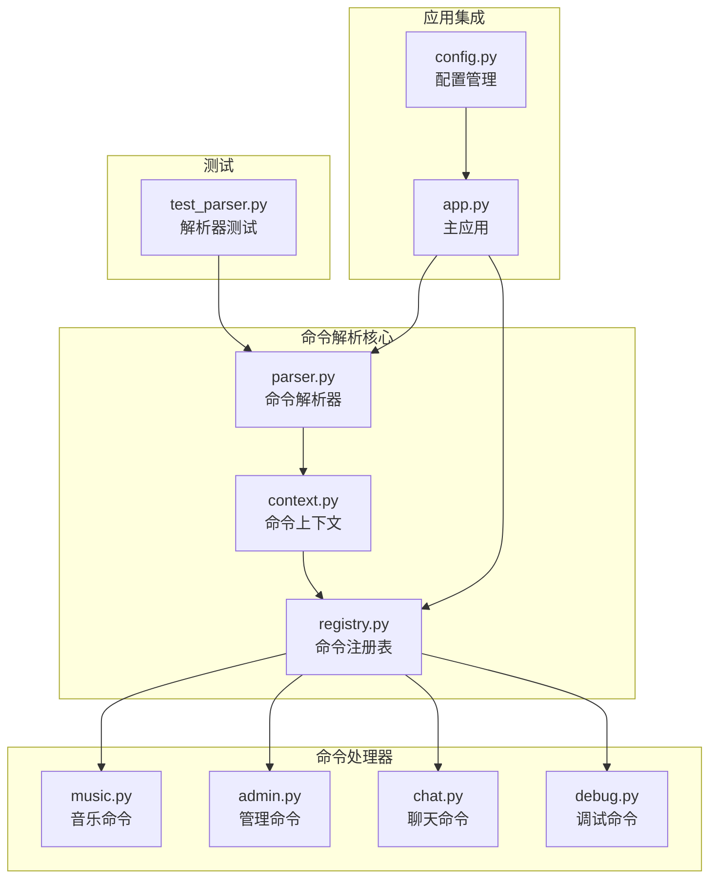
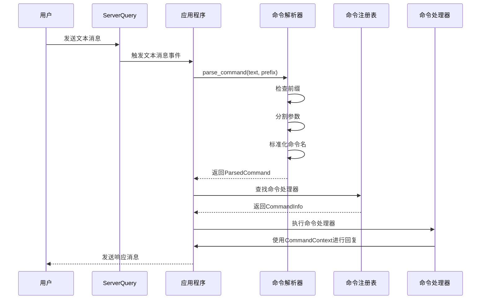
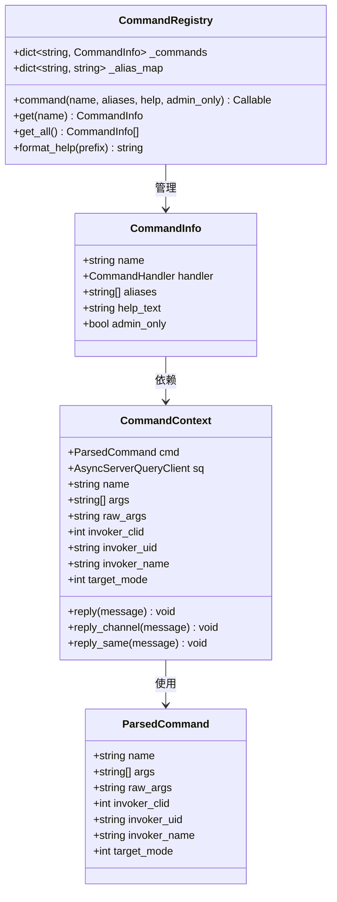
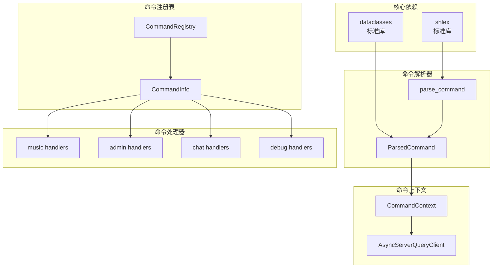

# 命令解析器

<cite>
**本文档引用的文件**
- [parser.py](file://bot/core/commands/parser.py)
- [context.py](file://bot/core/commands/context.py)
- [registry.py](file://bot/core/commands/registry.py)
- [app.py](file://bot/app.py)
- [music.py](file://bot/core/commands/handlers/music.py)
- [admin.py](file://bot/core/commands/handlers/admin.py)
- [chat.py](file://bot/core/commands/handlers/chat.py)
- [debug.py](file://bot/core/commands/handlers/debug.py)
- [test_parser.py](file://tests/test_parser.py)
- [config.py](file://bot/config.py)
- [config.yaml](file://config/config.yaml)
</cite>

## 目录
1. [简介](#简介)
2. [项目结构](#项目结构)
3. [核心组件](#核心组件)
4. [架构概览](#架构概览)
5. [详细组件分析](#详细组件分析)
6. [依赖分析](#依赖分析)
7. [性能考虑](#性能考虑)
8. [故障排除指南](#故障排除指南)
9. [结论](#结论)
10. [附录](#附录)

## 简介

命令解析器是 Teamspeak3 机器人系统的核心组件，负责将用户输入的文本消息转换为可执行的命令对象。该系统实现了完整的命令解析功能，包括命令前缀识别、参数分割、类型转换和错误处理机制。

系统采用模块化设计，通过装饰器注册命令处理器，支持多种命令格式和参数类型。命令解析器不仅处理基本的命令调用，还提供了丰富的元数据传递功能，使得命令处理器能够访问调用者信息和回复机制。

## 项目结构

命令解析器相关代码主要分布在以下目录中：



**图表来源**
- [parser.py:1-67](file://bot/core/commands/parser.py#L1-L67)
- [context.py:1-70](file://bot/core/commands/context.py#L1-L70)
- [registry.py:1-94](file://bot/core/commands/registry.py#L1-L94)

**章节来源**
- [parser.py:1-67](file://bot/core/commands/parser.py#L1-L67)
- [context.py:1-70](file://bot/core/commands/context.py#L1-L70)
- [registry.py:1-94](file://bot/core/commands/registry.py#L1-L94)

## 核心组件

### 解析器 (Parser)

解析器是命令系统的基础组件，负责将原始文本转换为结构化的命令对象。其核心功能包括：

- **命令前缀识别**：检测消息是否以指定前缀开头
- **参数分割**：使用智能分词算法处理引号、转义字符
- **命令名称标准化**：自动转换为小写格式
- **元数据封装**：将调用者信息和目标模式包装到命令对象中

### 命令上下文 (CommandContext)

命令上下文为命令处理器提供运行时环境，包含：

- **命令元数据**：名称、参数、原始参数字符串
- **调用者信息**：客户端ID、用户UID、用户名
- **回复机制**：私聊回复、频道回复、同源回复
- **服务器查询客户端**：用于与 Teamspeak 服务器交互

### 命令注册表 (CommandRegistry)

注册表负责管理所有已注册的命令处理器：

- **装饰器注册**：通过 `@registry.command()` 装饰器注册命令
- **别名支持**：允许为命令定义多个别名
- **权限控制**：支持管理员专用命令
- **帮助信息生成**：自动生成命令帮助文档

**章节来源**
- [parser.py:22-67](file://bot/core/commands/parser.py#L22-L67)
- [context.py:13-70](file://bot/core/commands/context.py#L13-L70)
- [registry.py:28-94](file://bot/core/commands/registry.py#L28-L94)

## 架构概览

命令解析器采用事件驱动架构，与 Teamspeak 服务器通过 ServerQuery 协议通信：



**图表来源**
- [app.py:162-198](file://bot/app.py#L162-L198)
- [parser.py:22-67](file://bot/core/commands/parser.py#L22-L67)
- [registry.py:68-78](file://bot/core/commands/registry.py#L68-L78)

## 详细组件分析

### 命令解析器实现

命令解析器的核心实现位于 `parse_command` 函数中，采用多阶段解析策略：

#### 前缀识别阶段
解析器首先检查输入文本是否以指定前缀开头。如果不符合要求，直接返回 `None`，表示这不是一个有效的命令。

#### 参数分割阶段
使用 `shlex.split()` 进行智能分割，支持：
- 引号包裹的参数（如 `"hello world"`）
- 转义字符处理（如 `\"`）
- 多个连续空格的处理

如果 `shlex.split()` 抛出 `ValueError`（通常是由于不匹配的引号），解析器会回退到简单的 `split()` 方法。

#### 命令标准化
命令名称转换为小写形式，确保大小写不敏感的命令匹配。

#### 结果封装
将解析结果封装到 `ParsedCommand` 数据类中，包含：
- `name`: 命令名称
- `args`: 参数列表
- `raw_args`: 原始参数字符串
- 调用者元数据和目标模式



**图表来源**
- [parser.py:9-20](file://bot/core/commands/parser.py#L9-L20)
- [context.py:13-70](file://bot/core/commands/context.py#L13-L70)
- [registry.py:17-26](file://bot/core/commands/registry.py#L17-L26)

**章节来源**
- [parser.py:22-67](file://bot/core/commands/parser.py#L22-L67)
- [context.py:20-70](file://bot/core/commands/context.py#L20-L70)
- [registry.py:28-94](file://bot/core/commands/registry.py#L28-L94)

### 参数提取算法

命令解析器实现了灵活的参数提取算法，支持多种参数类型：

#### 位置参数处理
位置参数是最常见的参数类型，按顺序提取：
- `!play "周杰伦 晴天"` → 参数列表：`["周杰伦 晴天"]`
- `!remove 3` → 参数列表：`["3"]`

#### 命名参数支持
虽然解析器本身不直接支持命名参数语法（如 `--key=value`），但命令处理器可以通过以下方式实现类似功能：
- 使用第一个参数作为操作类型
- 后续参数作为键值对处理
- 自定义解析逻辑

#### 可变参数处理
解析器支持任意数量的参数，通过 `*args` 语法传递给命令处理器：
- `!remind 30 "该休息了"` → 第一个参数为时间，其余参数组合为消息内容

### 类型转换机制

命令解析器本身不进行类型转换，但命令处理器可以实现所需的类型转换：

#### 字符串类型
- `raw_args`: 完整的原始参数字符串
- `args`: 分割后的参数列表（字符串类型）

#### 整数类型转换
```python
try:
    minutes = int(ctx.args[0])
except ValueError:
    await ctx.reply_same("请输入分钟数，例如: !remind 30 该休息了")
```

#### 浮点数类型转换
```python
try:
    volume = float(ctx.args[0])
    if not 0 <= volume <= 100:
        raise ValueError("音量必须在0-100之间")
except ValueError as e:
    await ctx.reply_same(f"请输入有效的音量值: {e}")
```

#### 自定义类型转换
命令处理器可以实现复杂的类型转换逻辑：
- URL 验证和提取
- 时间戳解析
- 颜色代码解析
- 数学表达式计算

**章节来源**
- [admin.py:44-48](file://bot/core/commands/handlers/admin.py#L44-L48)
- [music.py:190-194](file://bot/core/commands/handlers/music.py#L190-L194)

### 错误处理机制

命令解析器实现了多层次的错误处理策略：

#### 解析阶段错误处理
- **不匹配引号**：回退到简单分割算法
- **空输入**：返回 `None`
- **无前缀**：返回 `None`

#### 执行阶段错误处理
应用程序捕获命令执行过程中的异常：
```python
try:
    await cmd_info.handler(ctx)
except Exception:
    logger.exception("Error executing command '%s'", cmd.name)
    try:
        await ctx.reply(f"命令执行出错: {cmd.name}")
    except Exception:
        pass
```

#### 参数验证错误处理
命令处理器内部实现参数验证：
- 类型检查和转换
- 范围验证
- 必需参数检查
- 格式验证

### 边界情况处理

系统针对各种边界情况进行了专门处理：

#### 空参数处理
- `!ping` → `args = []`
- `!help` → `raw_args = ""`

#### 特殊字符处理
- 引号嵌套：`!"hello \"world\""`
- 转义字符：`!echo "hello\\nworld"`
- 多个空格：`!play   multiple   spaces`

#### 编码问题处理
- 支持 Unicode 字符（如中文）
- 正确处理多字节字符

**章节来源**
- [test_parser.py:6-65](file://tests/test_parser.py#L6-L65)
- [parser.py:45-49](file://bot/core/commands/parser.py#L45-L49)

## 依赖分析

命令解析器的依赖关系相对简单，主要依赖于标准库和少量外部库：



**图表来源**
- [parser.py:3-7](file://bot/core/commands/parser.py#L3-L7)
- [context.py:7-11](file://bot/core/commands/context.py#L7-L11)
- [registry.py:5-11](file://bot/core/commands/registry.py#L5-L11)

**章节来源**
- [parser.py:3-7](file://bot/core/commands/parser.py#L3-L7)
- [context.py:7-11](file://bot/core/commands/context.py#L7-L11)
- [registry.py:5-11](file://bot/core/commands/registry.py#L5-L11)

## 性能考虑

命令解析器在设计时充分考虑了性能因素：

### 内存效率
- 使用 `dataclasses` 减少内存占用
- 避免不必要的字符串复制
- 参数列表按需创建

### 处理速度
- 单次扫描完成前缀检查
- 智能回退机制避免重复解析
- 最小化异常处理开销

### 扩展性
- 装饰器注册机制便于添加新命令
- 异步处理支持高并发
- 模块化设计便于维护

## 故障排除指南

### 常见问题诊断

#### 命令不被识别
- 检查命令前缀配置
- 验证消息格式
- 确认命令已正确注册

#### 参数解析错误
- 检查引号配对
- 验证转义字符使用
- 确认编码格式

#### 类型转换失败
- 实现适当的错误处理
- 提供清晰的错误信息
- 添加参数验证逻辑

### 调试技巧

#### 启用详细日志
```python
import logging
logging.basicConfig(level=logging.DEBUG)
```

#### 使用测试用例
参考现有的测试用例来验证解析行为：
- [test_parser.py](file://tests/test_parser.py)

#### 参数验证
在命令处理器中添加参数验证逻辑：
```python
if not ctx.args:
    await ctx.reply_same("缺少必需参数")
    return
```

**章节来源**
- [app.py:190-198](file://bot/app.py#L190-L198)
- [test_parser.py:6-65](file://tests/test_parser.py#L6-L65)

## 结论

命令解析器是一个设计精良、功能完整的组件，它成功地将复杂的文本解析任务抽象为简洁的接口。系统的主要优势包括：

1. **健壮性**：完善的错误处理和边界情况处理
2. **灵活性**：支持多种参数类型和格式
3. **可扩展性**：模块化设计便于添加新功能
4. **易用性**：简洁的 API 和丰富的示例

通过合理的架构设计和详细的实现细节，命令解析器为整个 Teamspeak3 机器人系统提供了坚实的基础。

## 附录

### 命令格式示例

#### 基本命令
```
!play "周杰伦 晴天"
!remove 3
!help
```

#### 高级命令
```
!remind 30 "该休息了"
!follow on
!persona gamer_friend
```

### 配置选项

命令前缀默认配置为 `!`，可通过配置文件修改：
- 配置文件路径：`config/config.yaml`
- 配置项：`ts3.command_prefix`

### 测试覆盖

现有测试用例覆盖了主要的解析场景：
- 基本命令解析
- 多参数处理
- 引号参数处理
- 大小写不敏感
- 元数据传递