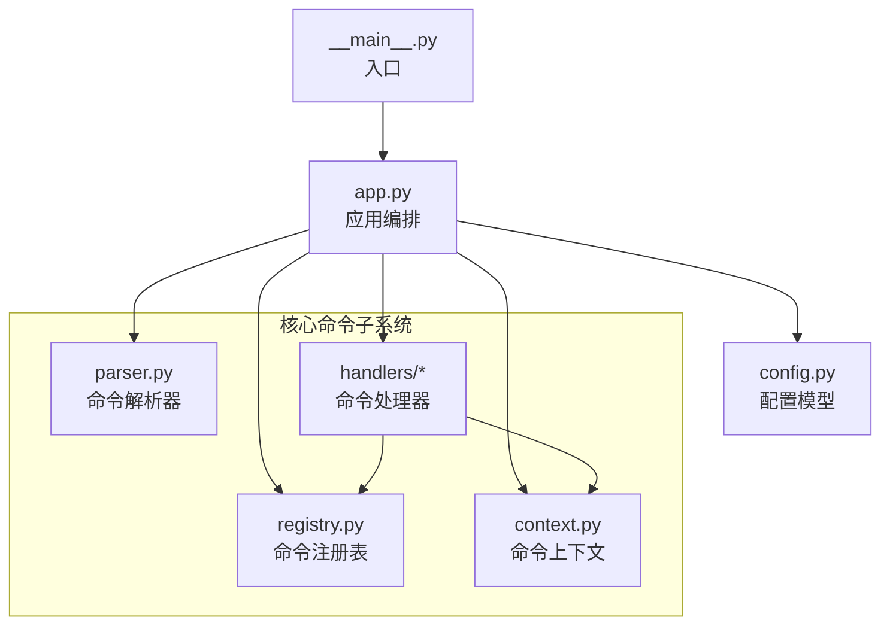
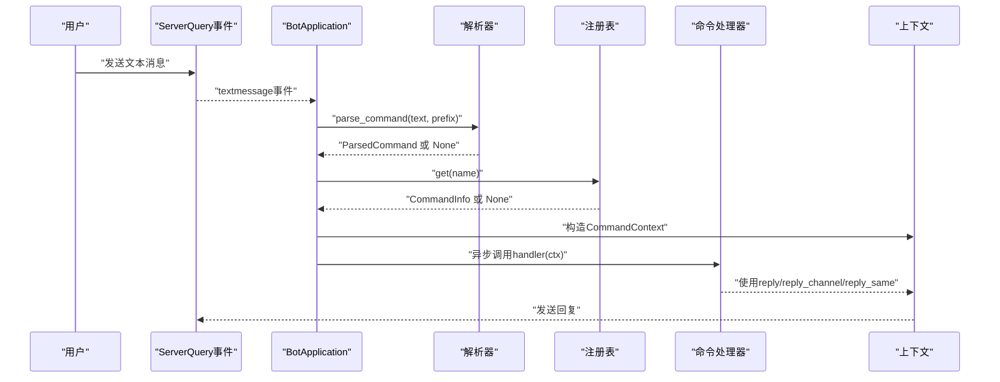
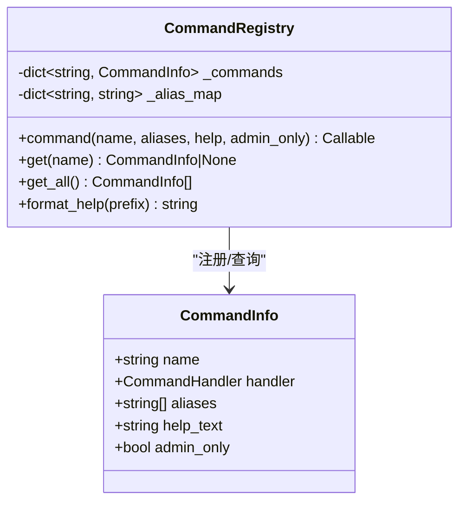
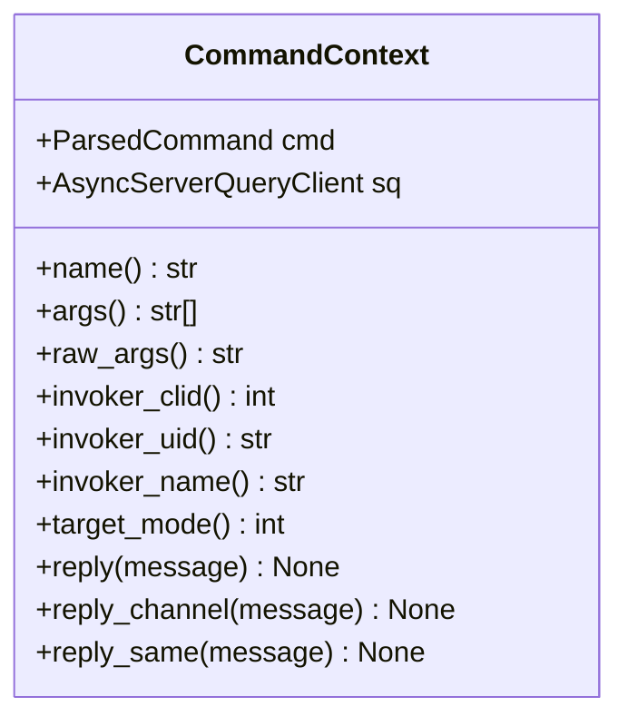
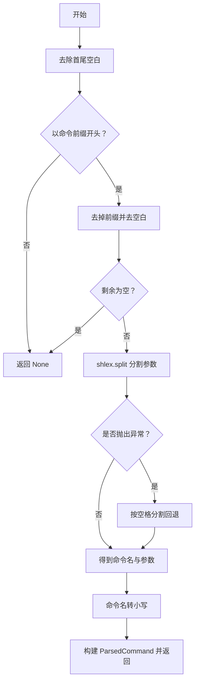
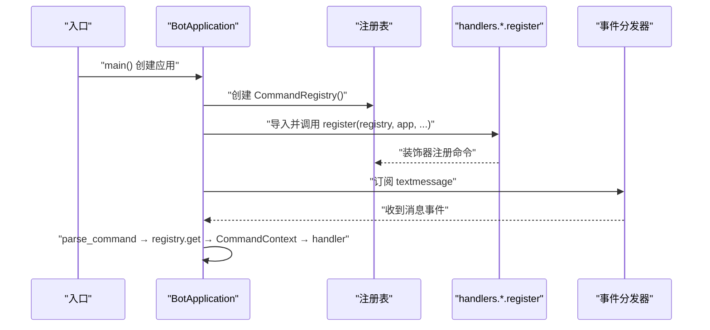
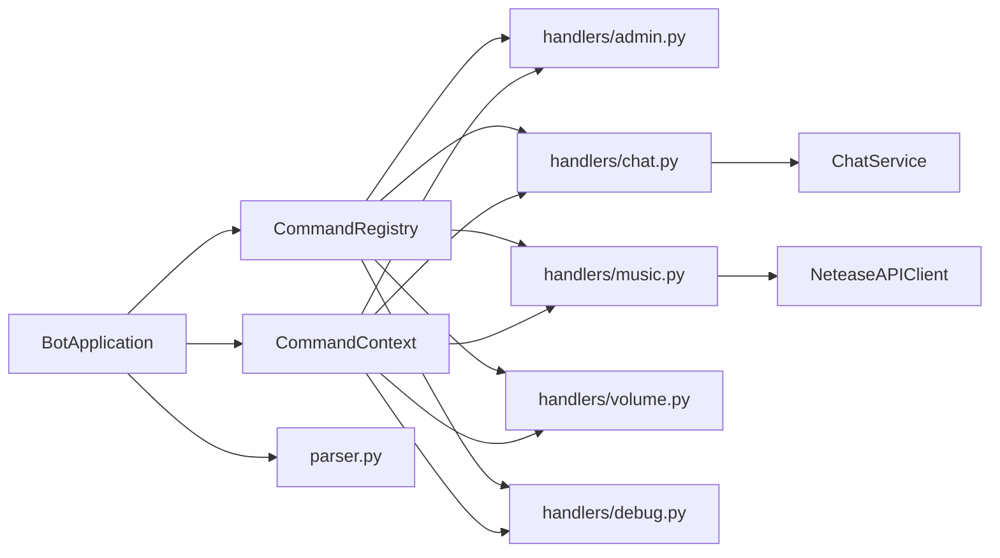

# 插件扩展机制

<cite>
**本文引用的文件**
- [bot/core/commands/registry.py](file://bot/core/commands/registry.py)
- [bot/core/commands/context.py](file://bot/core/commands/context.py)
- [bot/core/commands/parser.py](file://bot/core/commands/parser.py)
- [bot/app.py](file://bot/app.py)
- [bot/core/commands/handlers/admin.py](file://bot/core/commands/handlers/admin.py)
- [bot/core/commands/handlers/chat.py](file://bot/core/commands/handlers/chat.py)
- [bot/core/commands/handlers/music.py](file://bot/core/commands/handlers/music.py)
- [bot/core/commands/handlers/volume.py](file://bot/core/commands/handlers/volume.py)
- [bot/core/commands/handlers/debug.py](file://bot/core/commands/handlers/debug.py)
- [bot/config.py](file://bot/config.py)
- [bot/__main__.py](file://bot/__main__.py)
- [tests/test_parser.py](file://tests/test_parser.py)
- [tests/conftest.py](file://tests/conftest.py)
- [bot/services/chat/service.py](file://bot/services/chat/service.py)
- [bot/services/netease/client.py](file://bot/services/netease/client.py)
- [pyproject.toml](file://pyproject.toml)
</cite>

## 目录
1. [简介](#简介)
2. [项目结构](#项目结构)
3. [核心组件](#核心组件)
4. [架构总览](#架构总览)
5. [详细组件分析](#详细组件分析)
6. [依赖分析](#依赖分析)
7. [性能考虑](#性能考虑)
8. [故障排查指南](#故障排查指南)
9. [结论](#结论)
10. [附录](#附录)

## 简介
本指南围绕插件扩展机制与命令系统的插件化架构展开，重点解释装饰器模式的应用、动态注册机制、命令处理器的编写规范、参数与返回值约定、模块化组织方式，并提供从简单文本命令到复杂交互式命令的完整开发示例。同时涵盖测试策略、调试技巧以及如何扩展现有命令功能与新增命令类别。

## 项目结构
本项目采用“分层+按功能域划分”的组织方式：
- 核心命令子系统位于 bot/core/commands，包含解析器、上下文、注册表与各功能域的命令处理器（handlers）
- 应用入口与生命周期管理位于 bot/app.py，负责装配服务、注册命令与事件路由
- 配置模型位于 bot/config.py，提供运行时可调参数
- 测试位于 tests/，覆盖解析器等关键逻辑
- 服务层（如聊天、网易云）位于 bot/services 下，供命令处理器调用

图表来源
- [bot/app.py:140-149](file://bot/app.py#L140-L149)
- [bot/core/commands/registry.py:28-66](file://bot/core/commands/registry.py#L28-L66)
- [bot/core/commands/context.py:13-70](file://bot/core/commands/context.py#L13-L70)
- [bot/core/commands/parser.py:22-67](file://bot/core/commands/parser.py#L22-L67)
- [bot/core/commands/handlers/admin.py:17-75](file://bot/core/commands/handlers/admin.py#L17-L75)
- [bot/core/commands/handlers/chat.py:18-81](file://bot/core/commands/handlers/chat.py#L18-L81)
- [bot/core/commands/handlers/music.py:17-243](file://bot/core/commands/handlers/music.py#L17-L243)
- [bot/core/commands/handlers/volume.py:17-50](file://bot/core/commands/handlers/volume.py#L17-L50)
- [bot/core/commands/handlers/debug.py:13-37](file://bot/core/commands/handlers/debug.py#L13-L37)

章节来源
- [bot/app.py:140-149](file://bot/app.py#L140-L149)
- [bot/config.py:125-134](file://bot/config.py#L125-L134)

## 核心组件
- 命令注册表：基于装饰器的动态注册，支持别名映射与帮助信息格式化
- 命令上下文：封装调用元数据与回复辅助方法
- 命令解析器：将文本消息解析为命令对象，支持引号参数与前缀匹配
- 应用编排：加载配置、实例化服务、注册命令与事件监听、启动生命周期

章节来源
- [bot/core/commands/registry.py:28-93](file://bot/core/commands/registry.py#L28-L93)
- [bot/core/commands/context.py:13-70](file://bot/core/commands/context.py#L13-L70)
- [bot/core/commands/parser.py:22-67](file://bot/core/commands/parser.py#L22-L67)
- [bot/app.py:140-149](file://bot/app.py#L140-L149)

## 架构总览
命令系统通过“解析—查找—执行—回复”的流水线工作，装饰器驱动的注册表实现松耦合扩展，处理器仅关注业务逻辑与上下文交互。

图表来源
- [bot/app.py:162-198](file://bot/app.py#L162-L198)
- [bot/core/commands/parser.py:22-67](file://bot/core/commands/parser.py#L22-L67)
- [bot/core/commands/registry.py:68-78](file://bot/core/commands/registry.py#L68-L78)
- [bot/core/commands/context.py:52-69](file://bot/core/commands/context.py#L52-L69)

## 详细组件分析

### 命令注册表与装饰器模式
- 装饰器签名：接收命令名、别名、帮助文本与管理员权限标记，返回可直接修饰处理器函数的装饰器
- 注册行为：将命令信息写入字典，并建立别名到主名的映射；记录日志便于调试
- 查询策略：优先精确匹配，其次别名映射；提供全量导出与帮助格式化能力

图表来源
- [bot/core/commands/registry.py:17-26](file://bot/core/commands/registry.py#L17-L26)
- [bot/core/commands/registry.py:28-66](file://bot/core/commands/registry.py#L28-L66)
- [bot/core/commands/registry.py:68-93](file://bot/core/commands/registry.py#L68-L93)

章节来源
- [bot/core/commands/registry.py:28-93](file://bot/core/commands/registry.py#L28-L93)

### 命令上下文与回复策略
- 上下文属性：暴露命令名、参数、原始参数、调用者身份与目标模式
- 回复方法：
  - 私聊回复：针对个人
  - 频道回复：针对当前频道
  - 同源回复：根据目标模式自动选择私聊或频道回复

图表来源
- [bot/core/commands/context.py:13-70](file://bot/core/commands/context.py#L13-L70)

章节来源
- [bot/core/commands/context.py:13-70](file://bot/core/commands/context.py#L13-L70)

### 命令解析器与参数处理
- 前缀校验：剥离前缀后进行参数分割
- 参数分割：优先使用安全的 shell 解析，失败回退为简单分割
- 结果封装：生成命令名（小写）、参数列表与原始参数字符串，附带调用者与目标模式

图表来源
- [bot/core/commands/parser.py:22-67](file://bot/core/commands/parser.py#L22-L67)

章节来源
- [bot/core/commands/parser.py:22-67](file://bot/core/commands/parser.py#L22-L67)

### 应用编排与事件路由
- 生命周期：加载配置 → 实例化服务 → 连接 ServerQuery → 注册命令与事件 → 启动后台服务 → 运行直至中断
- 命令路由：textmessage 事件 → 解析 → 查找 → 执行 → 异常捕获与友好提示
- 动态注册：在应用初始化阶段导入各功能域的 handlers 包并调用其 register 方法完成注册

图表来源
- [bot/__main__.py:9-12](file://bot/__main__.py#L9-L12)
- [bot/app.py:140-149](file://bot/app.py#L140-L149)
- [bot/app.py:162-198](file://bot/app.py#L162-L198)

章节来源
- [bot/__main__.py:9-12](file://bot/__main__.py#L9-L12)
- [bot/app.py:140-149](file://bot/app.py#L140-L149)
- [bot/app.py:162-198](file://bot/app.py#L162-L198)

### 命令处理器编写规范
- 函数签名：接收 CommandContext，返回协程
- 参数处理：
  - 使用 args 获取拆分后的参数列表
  - 使用 raw_args 获取原始参数字符串（适合需要保留引号语义的场景）
  - 使用 name/target_mode 判断命令类型与回复范围
- 返回值约定：所有处理器均为异步函数，不返回业务结果，统一通过上下文的回复方法输出
- 权限控制：通过注册表的 admin_only 字段标识管理员命令，处理器内部可结合调用者身份进一步验证
- 错误处理：建议在处理器内进行参数校验与异常捕获，并通过 ctx.reply_* 输出用户友好的错误提示

章节来源
- [bot/core/commands/context.py:24-69](file://bot/core/commands/context.py#L24-L69)
- [bot/core/commands/registry.py:35-66](file://bot/core/commands/registry.py#L35-L66)

### 模块化设计与插件组织
- handlers 子包按功能域划分：admin、chat、music、volume、debug
- 每个模块提供 register(registry, app, ...) 函数，集中完成该域命令的装饰器注册
- 应用在启动时统一导入并调用各域 register，形成“域即插件”的结构
- 可扩展性：新增命令类别只需新建一个 handlers/*.py 文件并实现 register 即可

章节来源
- [bot/app.py:142-148](file://bot/app.py#L142-L148)
- [bot/core/commands/handlers/admin.py:17-75](file://bot/core/commands/handlers/admin.py#L17-L75)
- [bot/core/commands/handlers/chat.py:18-81](file://bot/core/commands/handlers/chat.py#L18-L81)
- [bot/core/commands/handlers/music.py:17-243](file://bot/core/commands/handlers/music.py#L17-L243)
- [bot/core/commands/handlers/volume.py:17-50](file://bot/core/commands/handlers/volume.py#L17-L50)
- [bot/core/commands/handlers/debug.py:13-37](file://bot/core/commands/handlers/debug.py#L13-L37)

### 完整开发示例

#### 示例一：简单文本命令（!ping）
- 目标：实现一个无需参数、直接回复“pong!”的命令
- 步骤：
  - 在对应 handlers/*.py 中定义 register(registry, app) 函数
  - 使用 registry.command("ping", help="响应测试") 装饰处理器
  - 处理器中使用 ctx.reply_same("pong!") 输出
- 关键点：处理器不读取参数，直接回复；help 文本用于帮助信息生成

章节来源
- [bot/core/commands/handlers/debug.py:16-18](file://bot/core/commands/handlers/debug.py#L16-L18)
- [bot/core/commands/registry.py:35-66](file://bot/core/commands/registry.py#L35-L66)

#### 示例二：带参数的文本命令（!volume）
- 目标：支持查看与调节音量，支持绝对值与相对调整
- 步骤：
  - 使用 ctx.args 获取参数，ctx.raw_args 获取原始字符串
  - 解析参数：支持 +10、-10 的相对调整与 0-100 的绝对值
  - 通过 app.audio.set_volume 设置音量，并使用 ctx.reply_same 输出反馈
- 关键点：参数校验与边界处理（0-100），相对/绝对两种模式

章节来源
- [bot/core/commands/handlers/volume.py:20-49](file://bot/core/commands/handlers/volume.py#L20-L49)

#### 示例三：复杂交互命令（!chat）
- 目标：与 AI 对话，支持切换人设与清理上下文
- 步骤：
  - 读取 ctx.raw_args 作为用户消息
  - 通过 app.sq.whoami 获取频道 ID，隔离上下文
  - 调用 app.chat_service.chat(...) 获取回复
  - 支持 !persona 列表与切换，支持 !clearctx 清理上下文
- 关键点：上下文隔离、Persona 切换、异常兜底

章节来源
- [bot/core/commands/handlers/chat.py:21-40](file://bot/core/commands/handlers/chat.py#L21-L40)
- [bot/core/commands/handlers/chat.py:42-70](file://bot/core/commands/handlers/chat.py#L42-L70)
- [bot/core/commands/handlers/chat.py:71-81](file://bot/core/commands/handlers/chat.py#L71-L81)
- [bot/services/chat/service.py:61-110](file://bot/services/chat/service.py#L61-L110)

#### 示例四：播放队列命令（!play）
- 目标：支持搜索与播放、URL 直播播放、队列入队与立即播放
- 步骤：
  - 判断 ctx.raw_args 是否为 URL，若是则走 URL 提取流程
  - 否则走搜索流程，取第一个结果并入队
  - 若当前空闲则立即播放，否则排队等待
- 关键点：URL 与搜索两条路径，CDN 链接过期处理，队列状态与播放回调联动

章节来源
- [bot/core/commands/handlers/music.py:20-93](file://bot/core/commands/handlers/music.py#L20-L93)
- [bot/services/netease/client.py:77-95](file://bot/services/netease/client.py#L77-L95)

#### 示例五：管理员命令（!remind）
- 目标：动态设置定时提醒（基于 asyncio.delay）
- 步骤：
  - 校验参数数量与分钟数合法性
  - 创建后台任务延迟触发提醒
  - 使用 ctx.reply_same 输出确认信息
- 关键点：动态提醒无需持久化调度器，适合轻量场景

章节来源
- [bot/core/commands/handlers/admin.py:38-60](file://bot/core/commands/handlers/admin.py#L38-L60)

### 扩展现有命令功能与新增命令类别
- 扩展现有命令：在对应 handlers/*.py 中修改或新增处理器，利用 ctx 与 app 的能力增强功能
- 新增命令类别：新建 handlers/newcategory.py，实现 register(registry, app, ...)，在 app.py 的注册阶段引入即可

章节来源
- [bot/app.py:142-148](file://bot/app.py#L142-L148)
- [bot/core/commands/handlers/admin.py:17-75](file://bot/core/commands/handlers/admin.py#L17-L75)
- [bot/core/commands/handlers/chat.py:18-81](file://bot/core/commands/handlers/chat.py#L18-L81)
- [bot/core/commands/handlers/music.py:17-243](file://bot/core/commands/handlers/music.py#L17-L243)
- [bot/core/commands/handlers/volume.py:17-50](file://bot/core/commands/handlers/volume.py#L17-L50)
- [bot/core/commands/handlers/debug.py:13-37](file://bot/core/commands/handlers/debug.py#L13-L37)

## 依赖分析
- 组件耦合：命令处理器依赖注册表与上下文；应用编排依赖解析器与注册表；处理器可按需访问服务层（如音频、聊天、网易云）
- 外部依赖：yt-dlp 用于音频提取，OpenAI 兼容接口用于对话，APScheduler 用于定时任务
- 循环依赖：未发现循环导入；handlers 通过装饰器间接依赖注册表

图表来源
- [bot/core/commands/registry.py:28-66](file://bot/core/commands/registry.py#L28-L66)
- [bot/core/commands/context.py:13-70](file://bot/core/commands/context.py#L13-L70)
- [bot/app.py:140-149](file://bot/app.py#L140-L149)
- [bot/core/commands/handlers/chat.py:18-81](file://bot/core/commands/handlers/chat.py#L18-L81)
- [bot/core/commands/handlers/music.py:17-243](file://bot/core/commands/handlers/music.py#L17-L243)
- [bot/services/chat/service.py:15-115](file://bot/services/chat/service.py#L15-L115)
- [bot/services/netease/client.py:25-161](file://bot/services/netease/client.py#L25-L161)

章节来源
- [bot/app.py:140-149](file://bot/app.py#L140-L149)
- [bot/core/commands/handlers/music.py:17-243](file://bot/core/commands/handlers/music.py#L17-L243)
- [bot/core/commands/handlers/chat.py:18-81](file://bot/core/commands/handlers/chat.py#L18-L81)

## 性能考虑
- 解析性能：shlex.split 优于逐字符切割，避免异常回退路径
- 命令查找：注册表使用字典 O(1) 查找，别名映射减少重复存储
- I/O 优化：音频 URL 按需提取，避免缓存过期链接；聊天上下文按令牌窗口裁剪
- 并发与资源：后台任务与调度器独立运行，确保命令执行不阻塞

## 故障排查指南
- 命令不生效：
  - 检查命令前缀与配置一致
  - 确认 handlers.register 已被 app 注册调用
  - 查看日志中“Registered command”记录
- 参数解析异常：
  - 使用测试用例覆盖引号参数、大小写与空参数场景
- 回复方向不符：
  - 检查 target_mode 与回复方法选择（私聊/频道/同源）
- 服务调用失败：
  - 检查外部服务连通性与凭据配置
  - 在处理器中增加 try/catch 并使用 ctx.reply_* 输出用户可见错误

章节来源
- [tests/test_parser.py:6-65](file://tests/test_parser.py#L6-L65)
- [bot/app.py:190-197](file://bot/app.py#L190-L197)

## 结论
本项目通过装饰器驱动的命令注册表与清晰的上下文抽象，实现了高内聚、低耦合的插件化命令系统。开发者可按功能域模块化扩展，遵循参数与回复约定即可快速实现从简单到复杂的交互式命令，并借助完善的测试与调试手段保障质量。

## 附录

### 开发清单
- 编写处理器：定义 register(registry, app, ...)，使用 registry.command(...) 装饰
- 参数校验：优先使用 ctx.args/raw_args，注意边界与类型转换
- 回复策略：根据 target_mode 选择合适回复方法
- 错误处理：捕获异常并友好提示，避免向用户暴露内部错误
- 测试覆盖：新增解析与命令行为的单元测试
- 文档与帮助：完善 help 文本，确保 format_help 输出清晰

### 配置要点
- 命令前缀：通过配置项 ts3.command_prefix 控制
- 日志级别：通过 logging.level 控制
- 服务参数：聊天、音频、定时等均可通过配置文件调整

章节来源
- [bot/config.py:36-46](file://bot/config.py#L36-L46)
- [bot/config.py:117-123](file://bot/config.py#L117-L123)
- [bot/app.py:112-138](file://bot/app.py#L112-L138)