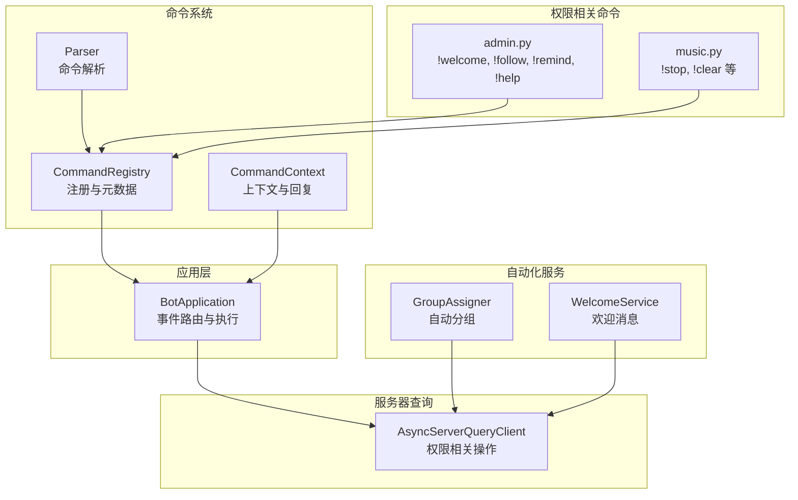
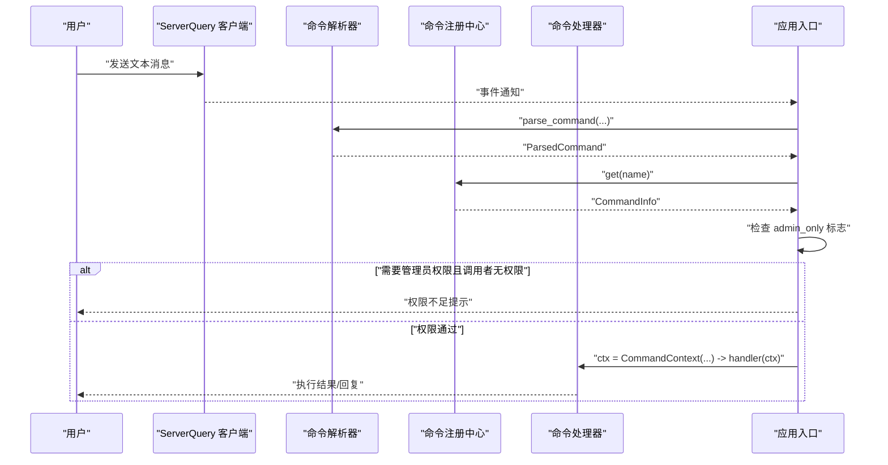
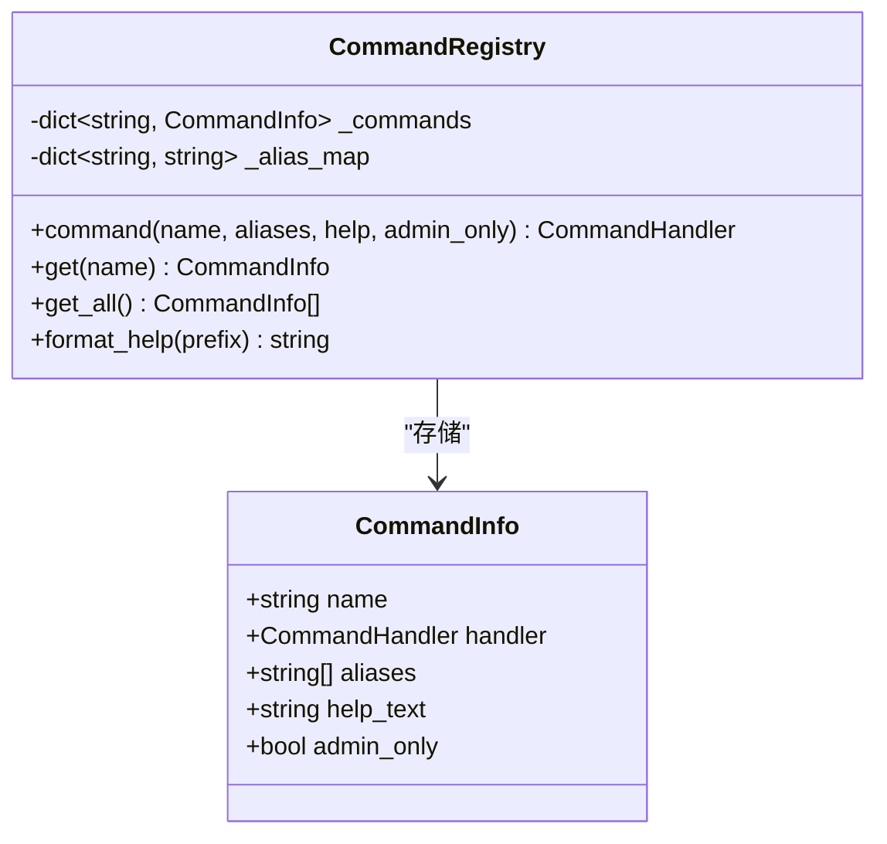
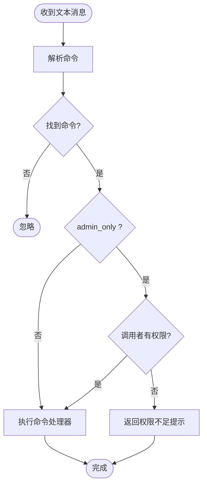
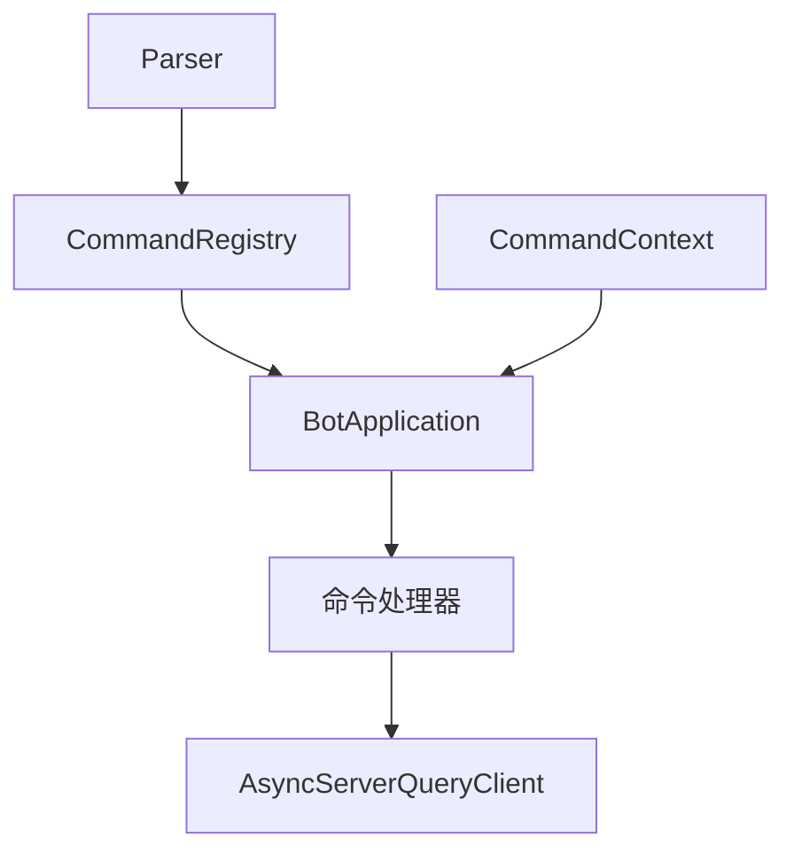

# 权限控制系统

<cite>
**本文档引用的文件**
- [bot/app.py](file://bot/app.py)
- [bot/config.py](file://bot/config.py)
- [bot/core/commands/context.py](file://bot/core/commands/context.py)
- [bot/core/commands/registry.py](file://bot/core/commands/registry.py)
- [bot/core/commands/handlers/admin.py](file://bot/core/commands/handlers/admin.py)
- [bot/core/commands/handlers/music.py](file://bot/core/commands/handlers/music.py)
- [bot/core/commands/parser.py](file://bot/core/commands/parser.py)
- [bot/core/serverquery/client.py](file://bot/core/serverquery/client.py)
- [bot/services/automation/groups.py](file://bot/services/automation/groups.py)
- [bot/services/automation/welcome.py](file://bot/services/automation/welcome.py)
- [config/config.yaml](file://config/config.yaml)
</cite>

## 目录
1. [简介](#简介)
2. [项目结构](#项目结构)
3. [核心组件](#核心组件)
4. [架构概览](#架构概览)
5. [详细组件分析](#详细组件分析)
6. [依赖分析](#依赖分析)
7. [性能考虑](#性能考虑)
8. [故障排除指南](#故障排除指南)
9. [结论](#结论)
10. [附录](#附录)

## 简介
本文件为权限控制系统的技术文档，聚焦于管理员权限的判断逻辑与实现机制，涵盖权限级别定义、权限验证流程、admin_only 标志的作用与具体实现、不同用户权限级别的区分与处理方式（普通用户、频道管理员、服务器管理员），以及安全考虑与最佳实践。同时提供权限验证失败时的错误处理与用户体验优化建议，并展示如何在自定义命令中实现权限控制。

## 项目结构
权限控制相关代码主要分布在以下模块：
- 命令注册与元数据：commands/registry.py
- 命令上下文与回复封装：commands/context.py
- 命令解析器：commands/parser.py
- 应用入口与事件路由：app.py
- 权限相关命令示例：commands/handlers/admin.py、commands/handlers/music.py
- 服务器查询客户端与权限相关操作：serverquery/client.py
- 自动化服务（与权限相关的组分配）：services/automation/groups.py
- 配置模型与默认值：config.py、config/config.yaml

**图表来源**
- [bot/core/commands/registry.py:28-94](file://bot/core/commands/registry.py#L28-L94)
- [bot/core/commands/context.py:13-70](file://bot/core/commands/context.py#L13-L70)
- [bot/core/commands/parser.py:22-67](file://bot/core/commands/parser.py#L22-L67)
- [bot/app.py:140-198](file://bot/app.py#L140-L198)
- [bot/core/commands/handlers/admin.py:17-75](file://bot/core/commands/handlers/admin.py#L17-L75)
- [bot/core/commands/handlers/music.py:17-243](file://bot/core/commands/handlers/music.py#L17-L243)
- [bot/core/serverquery/client.py:27-406](file://bot/core/serverquery/client.py#L27-L406)
- [bot/services/automation/groups.py:17-66](file://bot/services/automation/groups.py#L17-L66)
- [bot/services/automation/welcome.py:17-71](file://bot/services/automation/welcome.py#L17-L71)

**章节来源**
- [bot/app.py:140-198](file://bot/app.py#L140-L198)
- [bot/core/commands/registry.py:28-94](file://bot/core/commands/registry.py#L28-L94)
- [bot/core/commands/context.py:13-70](file://bot/core/commands/context.py#L13-L70)
- [bot/core/commands/parser.py:22-67](file://bot/core/commands/parser.py#L22-L67)

## 核心组件
- 命令注册中心（CommandRegistry）
  - 提供装饰器式注册命令，存储命令名称、别名、帮助文本与 admin_only 标志。
  - 支持通过名称或别名查找命令信息。
  - 在帮助输出中根据 admin_only 标志标注“管理员”标识。
- 命令上下文（CommandContext）
  - 封装调用者元数据（clid、uid、name、target_mode）与回复方法（私聊/频道/同场景）。
- 命令解析器（Parser）
  - 将文本消息解析为命令对象，提取命令名、参数与原始参数字符串，并携带调用者与目标模式信息。
- 应用入口（BotApplication）
  - 负责注册命令处理器、建立 ServerQuery 连接、订阅事件、路由文本消息到命令系统。
  - 在命令执行前进行权限检查（基于 admin_only 标志），并在异常时进行统一错误处理与用户反馈。
- 权限相关命令
  - 管理员命令示例：!welcome、!follow、!remind（admin_only=True）。
  - 音乐管理命令示例：!stop、!clear（admin_only=True）。
- 服务器查询客户端（AsyncServerQueryClient）
  - 提供权限相关操作接口（如组管理、移动用户等），并封装错误类型与响应解析。
- 自动化服务
  - GroupAssigner：自动为新成员分配服务器组（涉及权限与用户状态）。
  - WelcomeService：向新成员发送欢迎消息（影响用户体验与可见性）。

**章节来源**
- [bot/core/commands/registry.py:17-94](file://bot/core/commands/registry.py#L17-L94)
- [bot/core/commands/context.py:13-70](file://bot/core/commands/context.py#L13-L70)
- [bot/core/commands/parser.py:9-67](file://bot/core/commands/parser.py#L9-L67)
- [bot/app.py:140-198](file://bot/app.py#L140-L198)
- [bot/core/commands/handlers/admin.py:17-75](file://bot/core/commands/handlers/admin.py#L17-L75)
- [bot/core/commands/handlers/music.py:132-172](file://bot/core/commands/handlers/music.py#L132-L172)
- [bot/core/serverquery/client.py:27-406](file://bot/core/serverquery/client.py#L27-L406)
- [bot/services/automation/groups.py:17-66](file://bot/services/automation/groups.py#L17-L66)
- [bot/services/automation/welcome.py:17-71](file://bot/services/automation/welcome.py#L17-L71)

## 架构概览
权限控制在命令执行链路中的位置如下：

**图表来源**
- [bot/app.py:162-198](file://bot/app.py#L162-L198)
- [bot/core/commands/parser.py:22-67](file://bot/core/commands/parser.py#L22-L67)
- [bot/core/commands/registry.py:68-83](file://bot/core/commands/registry.py#L68-L83)
- [bot/core/commands/context.py:20-70](file://bot/core/commands/context.py#L20-L70)

## 详细组件分析

### 权限级别定义与区分
- 当前代码库未实现频道管理员与服务器管理员的细粒度权限区分。权限控制以 admin_only 标志作为唯一管理员门槛。
- 用户角色与权限映射（基于现有实现）：
  - 普通用户：可执行非 admin_only 命令。
  - 管理员：可执行所有命令（含 admin_only 命令）。
- 说明：若需扩展至频道管理员/服务器管理员，可在 CommandContext 中引入用户权限组信息，并在命令执行前进行更细粒度的权限校验。

**章节来源**
- [bot/core/commands/registry.py:25](file://bot/core/commands/registry.py#L25)
- [bot/core/commands/handlers/admin.py:20](file://bot/core/commands/handlers/admin.py#L20)
- [bot/core/commands/handlers/music.py:132](file://bot/core/commands/handlers/music.py#L132)

### admin_only 标志的作用与实现
- admin_only 标志存储在 CommandInfo 中，用于标识命令是否仅管理员可执行。
- 注册流程：装饰器将 admin_only 参数写入 CommandInfo。
- 执行流程：应用入口在获取命令后，依据 admin_only 与调用者身份决定是否允许执行。
- 帮助输出：format_help 会根据 admin_only 标志在命令行末尾添加“管理员”标识，便于用户识别。

**图表来源**
- [bot/core/commands/registry.py:17-66](file://bot/core/commands/registry.py#L17-L66)

**章节来源**
- [bot/core/commands/registry.py:17-66](file://bot/core/commands/registry.py#L17-L66)
- [bot/core/commands/registry.py:84-94](file://bot/core/commands/registry.py#L84-L94)

### 权限验证流程
- 文本消息进入应用入口后，先由解析器提取命令与参数，再通过注册中心按名称或别名查找命令信息。
- 若命令存在且标记为 admin_only，则应用入口进行权限检查；否则直接执行。
- 权限检查失败时，应用入口捕获异常并向调用者发送错误提示，避免泄露内部细节。

**图表来源**
- [bot/app.py:162-198](file://bot/app.py#L162-L198)
- [bot/core/commands/parser.py:22-67](file://bot/core/commands/parser.py#L22-L67)
- [bot/core/commands/registry.py:68-83](file://bot/core/commands/registry.py#L68-L83)

**章节来源**
- [bot/app.py:162-198](file://bot/app.py#L162-L198)

### 不同用户权限级别的处理方式
- 普通用户：可使用非管理员命令（如 !chat、!persona、!clearctx、!play、!queue 等）。
- 管理员：可使用管理员命令（如 !welcome、!follow、!remind、!stop、!clear 等）。
- 实际权限判定：当前实现通过 admin_only 标志进行简单判定；若需更精细的权限模型，可在 CommandContext 中引入用户权限组信息，并在应用入口处进行权限校验。

**章节来源**
- [bot/core/commands/handlers/admin.py:17-75](file://bot/core/commands/handlers/admin.py#L17-L75)
- [bot/core/commands/handlers/music.py:17-243](file://bot/core/commands/handlers/music.py#L17-L243)

### 权限控制的安全考虑与最佳实践
- 最小权限原则：仅授予必要权限，避免过度授权。
- 输入验证与清理：对命令参数进行严格验证，防止注入与越权操作。
- 错误处理与日志：统一捕获异常并记录日志，向用户返回通用错误提示，避免泄露内部信息。
- 会话与身份绑定：确保 invoker_clid、invoker_uid、invoker_name 等元数据准确传递，避免身份混淆。
- 权限边界清晰：明确区分管理员命令与普通命令，避免误用导致系统风险。

**章节来源**
- [bot/app.py:188-198](file://bot/app.py#L188-L198)

### 权限验证失败时的错误处理与用户体验优化
- 统一异常捕获：在命令执行过程中捕获异常，记录日志并发送友好提示。
- 上下文感知回复：根据 target_mode 决定私聊或频道回复，提升用户体验。
- 帮助信息：format_help 将 admin_only 命令标注为“管理员”，帮助用户快速识别权限要求。

**章节来源**
- [bot/app.py:188-198](file://bot/app.py#L188-L198)
- [bot/core/commands/context.py:52-70](file://bot/core/commands/context.py#L52-L70)
- [bot/core/commands/registry.py:84-94](file://bot/core/commands/registry.py#L84-L94)

### 在自定义命令中实现权限控制
- 使用装饰器注册命令时设置 admin_only=True，即可将命令标记为管理员专用。
- 在命令处理器内部，仍可根据业务需求进行二次校验（如特定频道或特定用户组）。
- 通过 CommandContext 的 invoker_* 元数据与 ServerQuery 客户端接口，实现更复杂的权限逻辑。

**章节来源**
- [bot/core/commands/registry.py:35-66](file://bot/core/commands/registry.py#L35-L66)
- [bot/core/commands/context.py:20-70](file://bot/core/commands/context.py#L20-L70)
- [bot/core/serverquery/client.py:365-405](file://bot/core/serverquery/client.py#L365-L405)

## 依赖分析
- 命令系统依赖关系
  - Parser 生成 ParsedCommand，CommandRegistry 存储 CommandInfo，BotApplication 通过 CommandRegistry 获取处理器并执行。
  - CommandContext 封装调用者元数据与回复方法，贯穿命令执行链路。
- 权限相关依赖
  - admin_only 标志由 CommandRegistry 管理，应用入口在执行前读取该标志进行权限判定。
  - 权限相关命令（!welcome、!follow、!remind、!stop、!clear）均通过装饰器注册并标记为管理员专用。

**图表来源**
- [bot/core/commands/parser.py:22-67](file://bot/core/commands/parser.py#L22-L67)
- [bot/core/commands/registry.py:28-94](file://bot/core/commands/registry.py#L28-L94)
- [bot/app.py:140-198](file://bot/app.py#L140-L198)
- [bot/core/serverquery/client.py:27-406](file://bot/core/serverquery/client.py#L27-L406)

**章节来源**
- [bot/core/commands/parser.py:22-67](file://bot/core/commands/parser.py#L22-L67)
- [bot/core/commands/registry.py:28-94](file://bot/core/commands/registry.py#L28-L94)
- [bot/app.py:140-198](file://bot/app.py#L140-L198)

## 性能考虑
- 命令解析与查找：解析器使用轻量级分词与别名映射，时间复杂度近似 O(n)（n 为命令名长度），查找为 O(1)。
- 权限检查：仅在命令存在且标记为 admin_only 时进行额外判定，成本极低。
- 异常处理：统一捕获与日志记录，避免异常传播导致的性能损耗。
- 并发与异步：应用入口与命令处理器均为异步实现，适合高并发场景。

[本节为一般性指导，无需列出具体文件来源]

## 故障排除指南
- 权限不足提示
  - 现象：执行管理员命令时收到权限不足提示。
  - 排查：确认调用者是否具备管理员身份；检查 admin_only 标志是否正确设置。
- 命令未找到
  - 现象：输入有效命令但无响应。
  - 排查：确认命令是否已注册；检查别名映射与大小写敏感性。
- 服务器查询错误
  - 现象：执行涉及服务器查询的操作时失败。
  - 排查：检查连接状态、用户名密码、虚拟服务器 ID；查看错误日志定位问题。
- 回复失败
  - 现象：命令执行成功但用户未收到回复。
  - 排查：确认 target_mode 与回复方法（私聊/频道/同场景）；检查网络与权限。

**章节来源**
- [bot/app.py:188-198](file://bot/app.py#L188-L198)
- [bot/core/serverquery/client.py:18-25](file://bot/core/serverquery/client.py#L18-L25)

## 结论
本权限控制系统以 admin_only 标志为核心，结合命令注册中心与应用入口的权限检查机制，实现了简洁而有效的管理员权限控制。当前实现满足基本需求，若需进一步增强，可在 CommandContext 中引入更细粒度的权限模型，并在应用入口处集成更复杂的权限校验逻辑，从而支持频道管理员与服务器管理员等多层级权限体系。

[本节为总结性内容，无需列出具体文件来源]

## 附录
- 配置项参考
  - TS3 连接配置：主机、查询端口、语音端口、用户名、密码、虚拟服务器 ID、昵称、默认频道 ID、命令前缀。
  - 日志配置：日志级别、格式、文件路径、轮转大小与备份数。
  - Webhook 配置：启用开关、主机、端口、密钥。

**章节来源**
- [bot/config.py:36-134](file://bot/config.py#L36-L134)
- [config/config.yaml:1-76](file://config/config.yaml#L1-76)