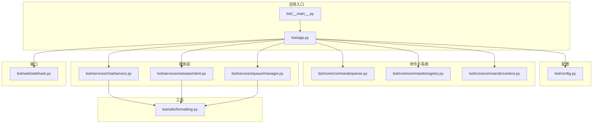
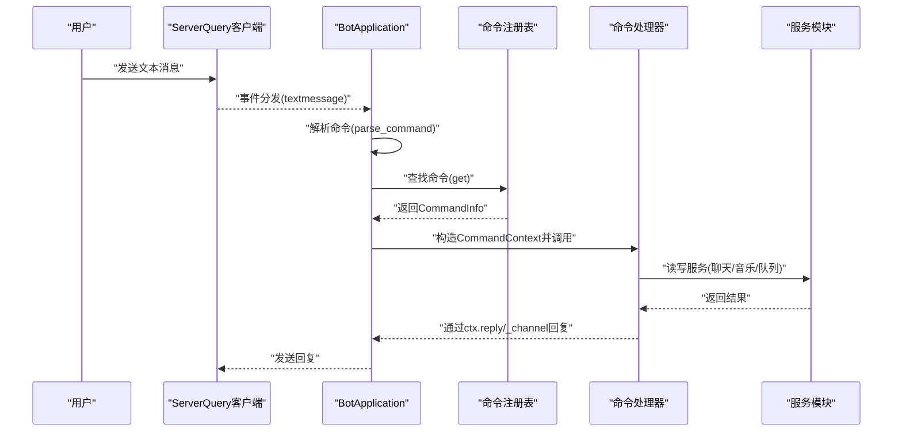
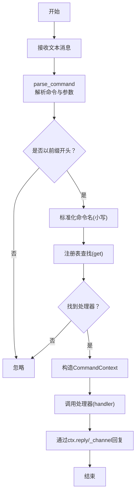
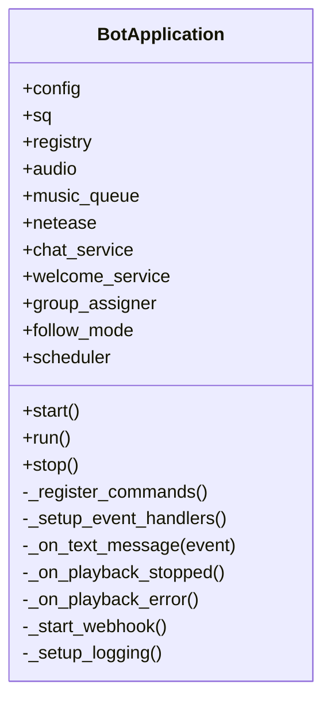
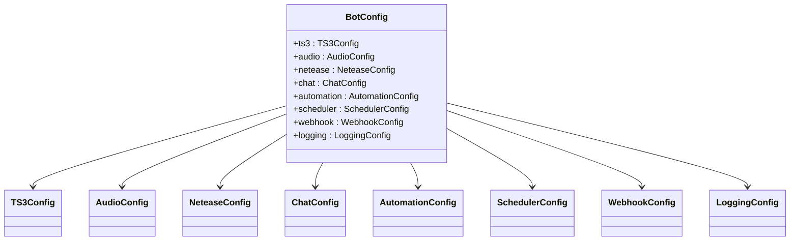
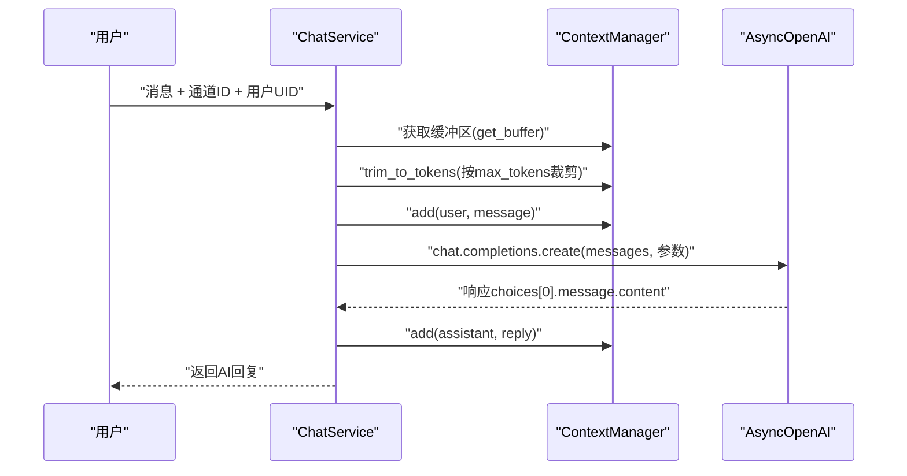
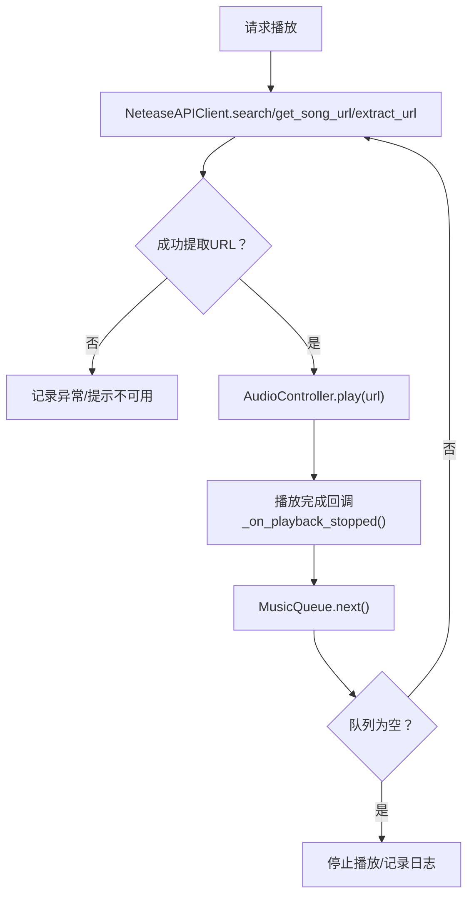
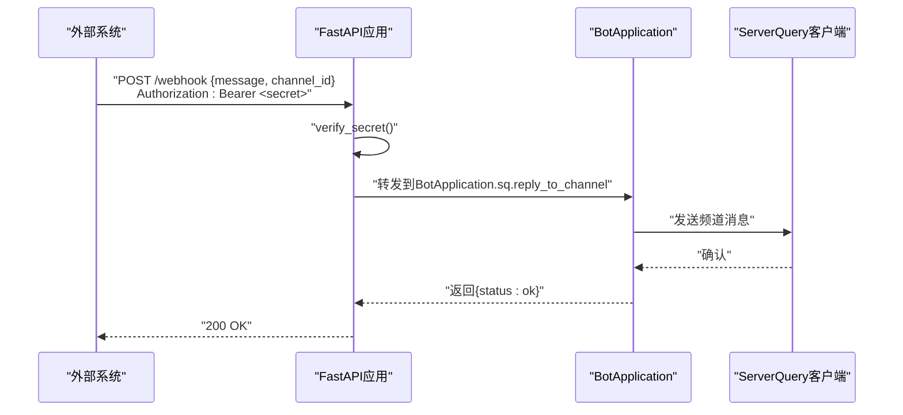
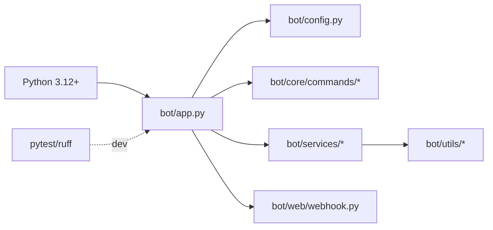

# 代码规范

<cite>
**本文引用的文件**
- [pyproject.toml](file://pyproject.toml)
- [requirements.txt](file://requirements.txt)
- [bot/app.py](file://bot/app.py)
- [bot/__main__.py](file://bot/__main__.py)
- [bot/config.py](file://bot/config.py)
- [bot/core/commands/context.py](file://bot/core/commands/context.py)
- [bot/core/commands/parser.py](file://bot/core/commands/parser.py)
- [bot/core/commands/registry.py](file://bot/core/commands/registry.py)
- [bot/utils/formatting.py](file://bot/utils/formatting.py)
- [bot/web/webhook.py](file://bot/web/webhook.py)
- [bot/services/chat/service.py](file://bot/services/chat/service.py)
- [bot/services/netease/client.py](file://bot/services/netease/client.py)
- [bot/services/queue/manager.py](file://bot/services/queue/manager.py)
- [tests/conftest.py](file://tests/conftest.py)
- [tests/test_parser.py](file://tests/test_parser.py)
</cite>

## 目录
1. [引言](#引言)
2. [项目结构](#项目结构)
3. [核心组件](#核心组件)
4. [架构总览](#架构总览)
5. [详细组件分析](#详细组件分析)
6. [依赖分析](#依赖分析)
7. [性能考虑](#性能考虑)
8. [故障排查指南](#故障排查指南)
9. [结论](#结论)
10. [附录](#附录)

## 引言
本文件面向本项目的开发者与维护者，系统性地阐述代码风格指南、命名约定、代码组织原则与工程实践。内容覆盖以下方面：
- Python 编码标准与 PEP 8 的遵循现状与建议
- 异步编程最佳实践与事件循环管理
- 类型注解的使用规范与常见模式
- 模块导入规则与包结构组织
- 函数与类的设计原则与职责边界
- 错误处理模式与异常传播策略
- 代码格式化与静态分析工具配置（Ruff、pytest）
- 具体示例路径与可直接参考的实现片段

本规范既适用于新功能开发，也适用于现有代码的重构与审查。

## 项目结构
项目采用按“领域/功能”分层的包结构，核心模块如下：
- 应用入口与主控制器：bot/app.py、bot/__main__.py
- 配置模型与加载：bot/config.py
- 命令子系统：bot/core/commands/*（解析、注册、上下文）
- 服务层：bot/services/*
  - 聊天服务：bot/services/chat/*
  - 音乐服务：bot/services/netease/*、bot/services/queue/*
- 工具与通用能力：bot/utils/*
- Webhook 接口：bot/web/webhook.py
- 测试：tests/*

图表来源
- [bot/__main__.py](file://bot/__main__.py)
- [bot/app.py](file://bot/app.py)
- [bot/config.py](file://bot/config.py)
- [bot/core/commands/parser.py](file://bot/core/commands/parser.py)
- [bot/core/commands/registry.py](file://bot/core/commands/registry.py)
- [bot/core/commands/context.py](file://bot/core/commands/context.py)
- [bot/services/chat/service.py](file://bot/services/chat/service.py)
- [bot/services/netease/client.py](file://bot/services/netease/client.py)
- [bot/services/queue/manager.py](file://bot/services/queue/manager.py)
- [bot/utils/formatting.py](file://bot/utils/formatting.py)
- [bot/web/webhook.py](file://bot/web/webhook.py)

章节来源
- [bot/__main__.py](file://bot/__main__.py)
- [bot/app.py](file://bot/app.py)
- [bot/config.py](file://bot/config.py)

## 核心组件
- BotApplication：应用主控制器，负责装配各子系统、连接 ServerQuery、注册命令与事件监听器、启动后台服务（调度器、Webhook）、优雅停机。
- 配置系统：基于 Pydantic 的配置模型，支持环境变量插值与默认值，集中管理 TS3、音频、聊天、自动化、调度、Webhook、日志等配置。
- 命令子系统：命令解析（parser）、注册表（registry）、上下文（context），形成“文本消息 → 解析 → 注册表查找 → 上下文执行”的闭环。
- 服务层：
  - ChatService：基于 OpenAI 兼容接口的聊天服务，支持多角色（personas）、通道级上下文隔离、令牌感知的上下文裁剪。
  - NeteaseAPIClient：通过 yt-dlp 抽取可播放音频 URL，搜索与歌词缓存，避免缓存过期的音频链接。
  - MusicQueue：队列管理、重复模式、跳过投票、历史记录与格式化输出。
- Webhook：FastAPI 提供受密钥保护的 Webhook 接口与状态查询端点。
- 工具：格式化工具（BBCode、时长格式化、截断）。

章节来源
- [bot/app.py](file://bot/app.py)
- [bot/config.py](file://bot/config.py)
- [bot/core/commands/context.py](file://bot/core/commands/context.py)
- [bot/core/commands/parser.py](file://bot/core/commands/parser.py)
- [bot/core/commands/registry.py](file://bot/core/commands/registry.py)
- [bot/services/chat/service.py](file://bot/services/chat/service.py)
- [bot/services/netease/client.py](file://bot/services/netease/client.py)
- [bot/services/queue/manager.py](file://bot/services/queue/manager.py)
- [bot/web/webhook.py](file://bot/web/webhook.py)
- [bot/utils/formatting.py](file://bot/utils/formatting.py)

## 架构总览
应用采用“事件驱动 + 命令路由 + 服务编排”的架构：
- 文本消息经由 ServerQuery 事件分发器进入命令解析器，解析后由注册表定位处理器，处理器通过 CommandContext 访问 ServerQuery 客户端进行回复。
- 各服务模块（聊天、音乐、调度、Webhook）由 BotApplication 统一初始化与生命周期管理。
- 音频播放与队列管理通过回调机制联动，自动播放下一首或处理错误。

图表来源
- [bot/app.py](file://bot/app.py)
- [bot/core/commands/parser.py](file://bot/core/commands/parser.py)
- [bot/core/commands/registry.py](file://bot/core/commands/registry.py)
- [bot/core/commands/context.py](file://bot/core/commands/context.py)

## 详细组件分析

### 命令解析与路由
- 解析器：支持带引号参数、区分大小写命令名（统一转小写）、保留原始参数字符串，便于回显与调试。
- 注册表：装饰器式注册命令，支持别名、帮助文本、管理员权限标记；提供统一的帮助信息格式化。
- 上下文：封装调用元数据与回复辅助方法，区分私聊/频道回复场景。

图表来源
- [bot/core/commands/parser.py](file://bot/core/commands/parser.py)
- [bot/core/commands/registry.py](file://bot/core/commands/registry.py)
- [bot/core/commands/context.py](file://bot/core/commands/context.py)

章节来源
- [bot/core/commands/parser.py](file://bot/core/commands/parser.py)
- [bot/core/commands/registry.py](file://bot/core/commands/registry.py)
- [bot/core/commands/context.py](file://bot/core/commands/context.py)

### 应用主控制器（BotApplication）
- 生命周期：加载配置 → 初始化组件 → 连接 ServerQuery → 注册命令与事件 → 启动后台服务 → 运行直到中断 → 优雅停机。
- 事件处理：文本消息路由至命令系统；播放完成/错误回调驱动队列前进。
- Webhook：条件启动，受密钥保护，提供状态查询与健康检查端点。
- 日志：根据配置设置级别与文件轮转，统一格式输出。

图表来源
- [bot/app.py](file://bot/app.py)

章节来源
- [bot/app.py](file://bot/app.py)

### 配置系统（Pydantic 模型）
- 使用 BaseModel 定义各子系统配置，字段范围约束（ge/le）、枚举值限制（Literal）、敏感信息使用 SecretStr。
- 支持环境变量插值，递归遍历结构替换占位符，兼容外部注入。
- 默认配置与文件配置并存，优先文件存在性，再回退默认值。

图表来源
- [bot/config.py](file://bot/config.py)

章节来源
- [bot/config.py](file://bot/config.py)

### 聊天服务（ChatService）
- 基于 OpenAI 兼容接口，支持多角色（personas）与通道级上下文隔离。
- 上下文缓冲区具备令牌感知的裁剪能力，避免超出模型上下文窗口。
- 错误捕获并返回友好提示，同时记录异常日志。

图表来源
- [bot/services/chat/service.py](file://bot/services/chat/service.py)

章节来源
- [bot/services/chat/service.py](file://bot/services/chat/service.py)

### 音乐服务（NeteaseAPIClient 与 MusicQueue）
- NeteaseAPIClient：通过 yt-dlp 抽取可播放 URL，搜索与歌词使用 TTL 缓存；音频 URL 不缓存，确保时效性。
- MusicQueue：支持 FIFO、单曲循环、全部循环、跳过投票、历史记录与格式化输出；重复模式切换与阈值计算清晰。

图表来源
- [bot/services/netease/client.py](file://bot/services/netease/client.py)
- [bot/services/queue/manager.py](file://bot/services/queue/manager.py)
- [bot/app.py](file://bot/app.py)

章节来源
- [bot/services/netease/client.py](file://bot/services/netease/client.py)
- [bot/services/queue/manager.py](file://bot/services/queue/manager.py)
- [bot/app.py](file://bot/app.py)

### Webhook 接口
- 受 Bearer 密钥保护的 /webhook 与 /status 端点，/health 提供健康检查。
- 通过 FastAPI 依赖注入校验密钥，异常时返回 403/500 并记录日志。

图表来源
- [bot/web/webhook.py](file://bot/web/webhook.py)
- [bot/app.py](file://bot/app.py)

章节来源
- [bot/web/webhook.py](file://bot/web/webhook.py)
- [bot/app.py](file://bot/app.py)

## 依赖分析
- 语言与运行时：Python 3.12+，使用 asyncio 与异步客户端（httpx、openai）。
- 核心依赖：pydantic/pydantic-settings（配置）、httpx/openai（网络）、apscheduler/fastapi/uvicorn（调度与Web）、yt-dlp（音视频抽取）。
- 开发依赖：pytest、pytest-asyncio、ruff（lint）。
- 项目内依赖：模块间通过相对导入与明确的包结构组织，避免循环依赖。

图表来源
- [pyproject.toml](file://pyproject.toml)
- [requirements.txt](file://requirements.txt)
- [bot/app.py](file://bot/app.py)

章节来源
- [pyproject.toml](file://pyproject.toml)
- [requirements.txt](file://requirements.txt)

## 性能考虑
- 异步 I/O：网络请求与外部 API 调用均采用异步客户端，减少阻塞，提升并发吞吐。
- 缓存策略：搜索与歌词使用 TTL 缓存，避免频繁访问外部服务；音频 URL 不缓存，确保播放稳定性。
- 上下文裁剪：聊天服务对消息上下文按令牌数裁剪，防止超限与资源浪费。
- 队列与重复模式：合理使用重复模式与跳过投票，平衡用户体验与公平性。
- 日志与文件句柄：日志文件轮转与异常降级，避免磁盘与句柄泄漏。

## 故障排查指南
- 命令不生效
  - 检查命令前缀与大小写是否匹配，确认已注册且未被管理员限制。
  - 参考：[命令解析与注册](file://bot/core/commands/parser.py)、[命令注册表](file://bot/core/commands/registry.py)
- 播放失败或链接过期
  - 确认 yt-dlp 可用与网络可达；音频 URL 每次播放前重新提取。
  - 参考：[NeteaseAPIClient](file://bot/services/netease/client.py)
- Webhook 无法访问
  - 校验密钥头 Authorization 是否为 Bearer <secret>；查看 /health 与 /status。
  - 参考：[Webhook](file://bot/web/webhook.py)
- 聊天无响应或报错
  - 检查 API Base URL 与密钥；关注上下文令牌上限导致的裁剪。
  - 参考：[ChatService](file://bot/services/chat/service.py)
- 配置问题
  - 确认配置文件存在与环境变量插值；必要时回退默认配置。
  - 参考：[配置加载](file://bot/config.py)

章节来源
- [bot/core/commands/parser.py](file://bot/core/commands/parser.py)
- [bot/core/commands/registry.py](file://bot/core/commands/registry.py)
- [bot/services/netease/client.py](file://bot/services/netease/client.py)
- [bot/web/webhook.py](file://bot/web/webhook.py)
- [bot/services/chat/service.py](file://bot/services/chat/service.py)
- [bot/config.py](file://bot/config.py)

## 结论
本项目在结构上遵循“事件驱动 + 命令路由 + 服务编排”的设计，配置与类型注解清晰，异步与错误处理策略明确。建议在后续迭代中持续强化：
- 逐步引入更严格的类型注解与 mypy 校验
- 扩展单元测试覆盖与集成测试
- 规范化文档与注释，提升可读性与可维护性

## 附录

### Python 代码风格与 PEP 8 遵循现状
- 模块导入：统一使用绝对导入与 from __future__ annotations；第三方与标准库分组清晰。
- 命名约定：类名使用 PascalCase，函数/变量使用 snake_case；常量大写。
- 字段与类型：Pydantic 字段使用 Field 约束范围与默认值；广泛使用类型注解（如 Callable[[...], Coroutine[...]]）。
- 文档字符串：模块、类、函数均提供 docstring，描述用途、参数与返回值。
- 行长度：Ruff 配置 line-length=100，满足长链式调用与注释需求。
- 选择性规则：Ruff lint 选择 E/F/I/N/W，覆盖错误、格式、导入顺序与命名规范。

章节来源
- [pyproject.toml](file://pyproject.toml)
- [bot/app.py](file://bot/app.py)
- [bot/config.py](file://bot/config.py)
- [bot/core/commands/registry.py](file://bot/core/commands/registry.py)

### 异步编程最佳实践
- 使用 asyncio.run 在入口处启动事件循环；在应用内部使用 await 处理异步调用。
- 对外网络请求统一采用异步客户端（httpx、openai），避免阻塞主线程。
- 在回调与事件处理中捕获异常并记录日志，保证系统稳定性。

章节来源
- [bot/__main__.py](file://bot/__main__.py)
- [bot/app.py](file://bot/app.py)
- [bot/services/chat/service.py](file://bot/services/chat/service.py)
- [bot/services/netease/client.py](file://bot/services/netease/client.py)

### 类型注解使用规范
- 函数签名：明确参数与返回值类型；异步函数使用 Coroutine/None。
- 数据类：使用 dataclass 与字段标注，配合 field(default_factory=...)。
- 泛型与联合类型：在需要时使用 Union、Optional、Literal 等。
- 类型检查：建议结合 mypy 或 IDE 类型检查工具进行静态验证。

章节来源
- [bot/core/commands/context.py](file://bot/core/commands/context.py)
- [bot/core/commands/registry.py](file://bot/core/commands/registry.py)
- [bot/services/queue/manager.py](file://bot/services/queue/manager.py)
- [bot/config.py](file://bot/config.py)

### 模块导入规则与包组织
- 包结构：按功能域划分（core、services、utils、web），模块内仅导入所需依赖。
- 相对导入：在同级或子包内使用相对导入，避免硬编码路径。
- 条件导入：在需要时延迟导入第三方库，减少启动开销。

章节来源
- [bot/app.py](file://bot/app.py)
- [bot/web/webhook.py](file://bot/web/webhook.py)
- [bot/services/chat/service.py](file://bot/services/chat/service.py)

### 函数与类的设计原则
- 单一职责：每个类/函数聚焦一个核心功能（如命令解析、队列管理、聊天服务）。
- 明确接口：通过 Pydantic 模型定义配置接口，通过 dataclass 定义数据结构。
- 可测试性：将副作用（网络、IO）抽象为可注入的服务，便于测试替身。

章节来源
- [bot/core/commands/parser.py](file://bot/core/commands/parser.py)
- [bot/services/queue/manager.py](file://bot/services/queue/manager.py)
- [bot/services/chat/service.py](file://bot/services/chat/service.py)

### 错误处理模式
- 异常捕获：在关键流程（播放、API 调用、Webhook）捕获异常并记录日志。
- 友好提示：向用户返回可理解的错误信息，避免泄露内部细节。
- 优雅降级：文件日志失败时降级为控制台输出；Webhook 失败返回 500 并记录异常。

章节来源
- [bot/app.py](file://bot/app.py)
- [bot/web/webhook.py](file://bot/web/webhook.py)
- [bot/services/chat/service.py](file://bot/services/chat/service.py)

### 代码格式化与静态分析工具
- 格式化与检查：使用 Ruff（lint 与格式化能力），目标版本 Python 3.12，行宽 100。
- 测试框架：pytest 与 pytest-asyncio，自动异步模式。
- 依赖声明：生产依赖与开发依赖分离，确保最小化运行时体积。

章节来源
- [pyproject.toml](file://pyproject.toml)
- [requirements.txt](file://requirements.txt)

### 测试用例与示例路径
- 命令解析测试：覆盖基本命令、多参数、引号参数、大小写、元数据等场景。
- 共享夹具：提供默认配置与事件分发器夹具，便于快速编写测试。

章节来源
- [tests/test_parser.py](file://tests/test_parser.py)
- [tests/conftest.py](file://tests/conftest.py)