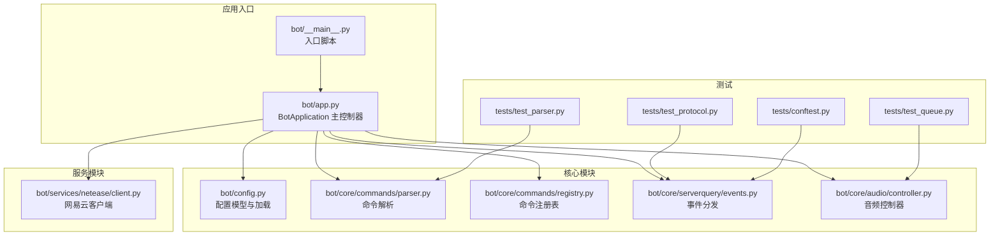
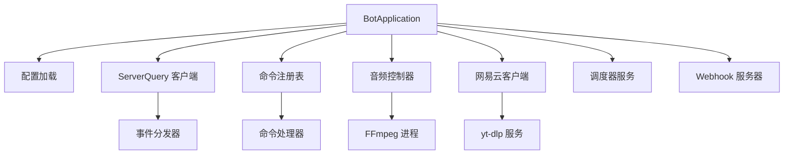
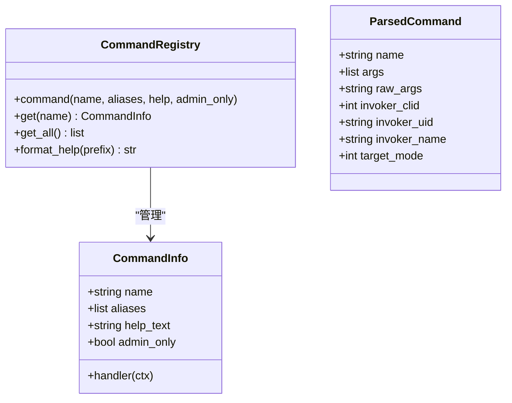
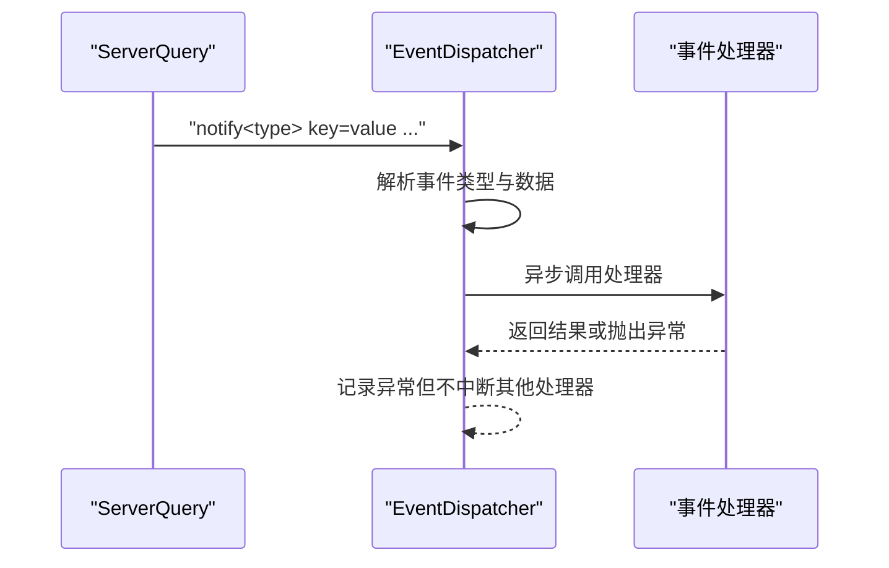
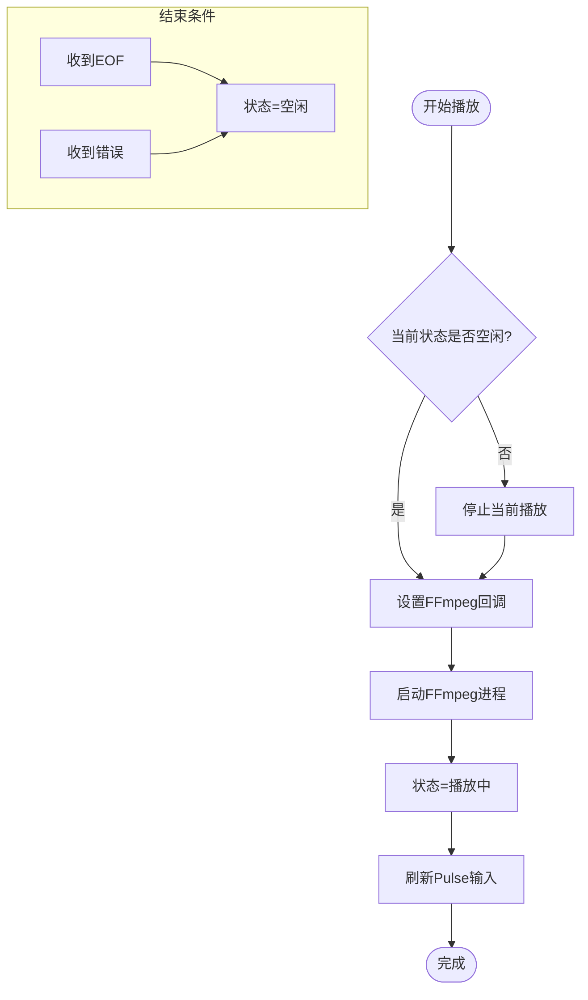
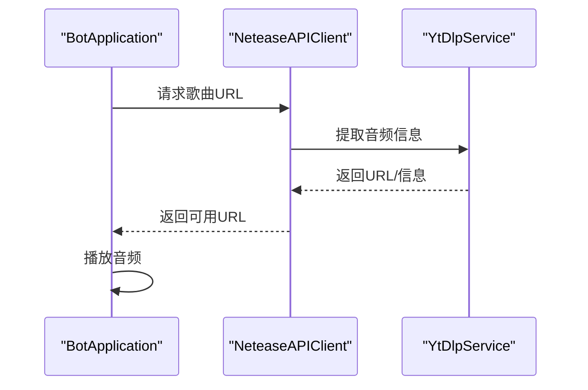
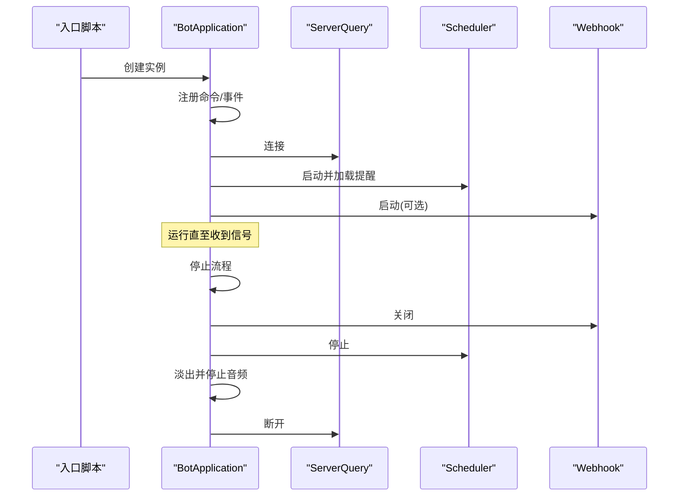
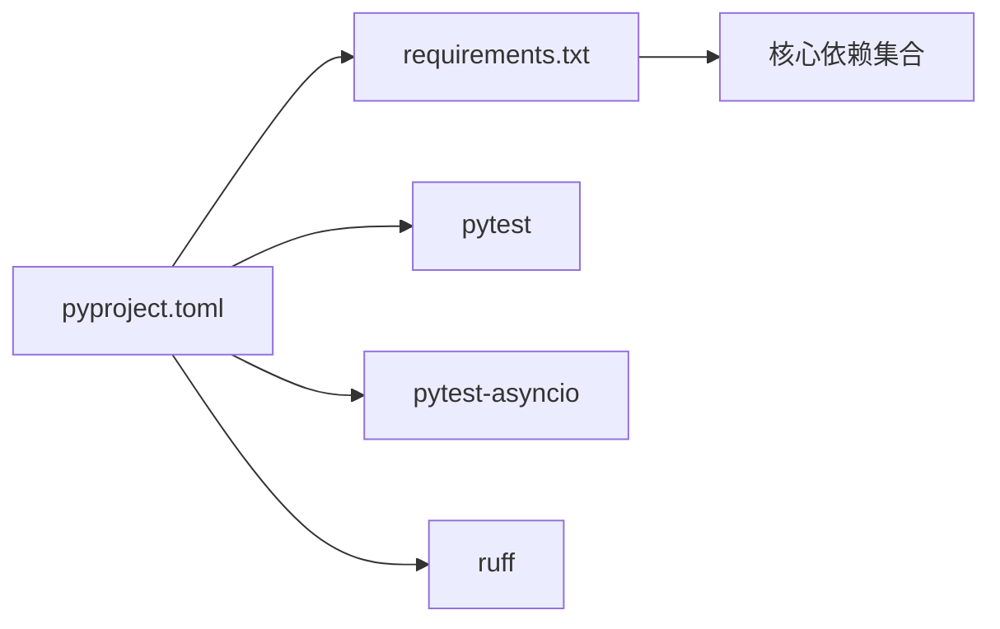

# 开发指南

<cite>
**本文引用的文件**
- [bot/app.py](file://bot/app.py)
- [bot/__main__.py](file://bot/__main__.py)
- [bot/config.py](file://bot/config.py)
- [pyproject.toml](file://pyproject.toml)
- [requirements.txt](file://requirements.txt)
- [bot/core/commands/parser.py](file://bot/core/commands/parser.py)
- [bot/core/commands/registry.py](file://bot/core/commands/registry.py)
- [bot/core/audio/controller.py](file://bot/core/audio/controller.py)
- [bot/core/serverquery/events.py](file://bot/core/serverquery/events.py)
- [bot/services/netease/client.py](file://bot/services/netease/client.py)
- [tests/conftest.py](file://tests/conftest.py)
- [tests/test_parser.py](file://tests/test_parser.py)
- [tests/test_protocol.py](file://tests/test_protocol.py)
- [tests/test_queue.py](file://tests/test_queue.py)
</cite>

## 目录
1. [简介](#简介)
2. [项目结构](#项目结构)
3. [核心组件](#核心组件)
4. [架构总览](#架构总览)
5. [详细组件分析](#详细组件分析)
6. [依赖分析](#依赖分析)
7. [性能考虑](#性能考虑)
8. [故障排查指南](#故障排查指南)
9. [结论](#结论)
10. [附录](#附录)

## 简介
本开发指南面向参与 Teamspeak3 Bot 项目的开发者，系统性说明代码结构规范、测试策略与调试技巧；深入讲解单元测试编写方法与覆盖率目标；阐述代码贡献流程、版本管理与发布策略；并提供开发环境搭建、IDE 配置与调试工具推荐，以及代码审查标准与质量保证流程。

## 项目结构
项目采用按功能域分层的组织方式：核心模块（命令解析、ServerQuery 事件、音频控制）、服务模块（网易云/聊天/Automation/Scheduler/Webhook）、工具与 Web 入口等。测试覆盖协议、解析器、队列等关键路径。

图表来源
- [bot/__main__.py:1-17](file://bot/__main__.py#L1-L17)
- [bot/app.py:1-348](file://bot/app.py#L1-L348)
- [bot/config.py:1-160](file://bot/config.py#L1-L160)
- [bot/core/commands/parser.py:1-67](file://bot/core/commands/parser.py#L1-L67)
- [bot/core/commands/registry.py:1-94](file://bot/core/commands/registry.py#L1-L94)
- [bot/core/serverquery/events.py:1-156](file://bot/core/serverquery/events.py#L1-L156)
- [bot/core/audio/controller.py:1-143](file://bot/core/audio/controller.py#L1-L143)
- [bot/services/netease/client.py:1-161](file://bot/services/netease/client.py#L1-L161)
- [tests/test_parser.py:1-65](file://tests/test_parser.py#L1-L65)
- [tests/test_protocol.py:1-118](file://tests/test_protocol.py#L1-L118)
- [tests/test_queue.py:1-159](file://tests/test_queue.py#L1-L159)
- [tests/conftest.py:1-19](file://tests/conftest.py#L1-L19)

章节来源
- [bot/app.py:27-111](file://bot/app.py#L27-L111)
- [bot/config.py:125-160](file://bot/config.py#L125-L160)

## 核心组件
- 应用主控制器：负责装配各子系统、连接 ServerQuery、注册命令与事件、启动后台服务（调度器、Webhook）与优雅停机。
- 命令系统：解析消息为命令对象，注册命令处理器并通过上下文执行。
- ServerQuery 事件：事件分发器与多种事件类型封装，支持安全回调调用。
- 音频控制：统一状态机与音量控制，对接 FFmpeg 流播放。
- 网易云服务：基于 yt-dlp 的搜索与音频提取，歌词缓存与错误处理。
- 配置系统：基于 Pydantic 的强类型配置模型，支持环境变量插值与多路径加载。

章节来源
- [bot/app.py:27-348](file://bot/app.py#L27-L348)
- [bot/core/commands/parser.py:22-67](file://bot/core/commands/parser.py#L22-L67)
- [bot/core/commands/registry.py:28-94](file://bot/core/commands/registry.py#L28-L94)
- [bot/core/serverquery/events.py:102-156](file://bot/core/serverquery/events.py#L102-L156)
- [bot/core/audio/controller.py:24-143](file://bot/core/audio/controller.py#L24-L143)
- [bot/services/netease/client.py:25-161](file://bot/services/netease/client.py#L25-L161)
- [bot/config.py:36-160](file://bot/config.py#L36-L160)

## 架构总览
应用以 BotApplication 为中心，围绕配置驱动装配各子系统。命令从 ServerQuery 文本消息进入，经解析与注册表路由到具体处理器；音频播放由控制器统一管理；网易云服务通过 yt-dlp 提供可播放 URL；Webhook 作为外部接口；调度器负责定时提醒。

图表来源
- [bot/app.py:39-101](file://bot/app.py#L39-L101)
- [bot/core/serverquery/events.py:102-156](file://bot/core/serverquery/events.py#L102-L156)
- [bot/core/audio/controller.py:24-88](file://bot/core/audio/controller.py#L24-L88)
- [bot/services/netease/client.py:25-95](file://bot/services/netease/client.py#L25-L95)

## 详细组件分析

### 命令解析与注册
- 解析器将带前缀的消息拆分为命令名与参数，支持引号包裹的参数与回退解析。
- 注册表提供装饰器式注册、别名映射、帮助文本格式化与管理员权限控制。

图表来源
- [bot/core/commands/registry.py:28-94](file://bot/core/commands/registry.py#L28-L94)
- [bot/core/commands/parser.py:9-67](file://bot/core/commands/parser.py#L9-L67)

章节来源
- [bot/core/commands/parser.py:22-67](file://bot/core/commands/parser.py#L22-L67)
- [bot/core/commands/registry.py:35-94](file://bot/core/commands/registry.py#L35-L94)

### ServerQuery 事件分发
- 事件分发器支持订阅/取消订阅/广播，对回调异常进行捕获与日志记录。
- 多种事件类型封装（加入/离开/移动/文本消息），便于上层业务使用。

图表来源
- [bot/core/serverquery/events.py:102-156](file://bot/core/serverquery/events.py#L102-L156)

章节来源
- [bot/core/serverquery/events.py:18-156](file://bot/core/serverquery/events.py#L18-L156)

### 音频控制器与播放流程
- 统一状态机（空闲/播放中/暂停），支持播放、停止、暂停/恢复、音量设置与淡入淡出。
- 与 FFmpeg 进程生命周期绑定，并在 EOF 或错误时触发回调。

图表来源
- [bot/core/audio/controller.py:70-143](file://bot/core/audio/controller.py#L70-L143)

章节来源
- [bot/core/audio/controller.py:24-143](file://bot/core/audio/controller.py#L24-L143)

### 网易云客户端与 URL 提取
- 使用 yt-dlp 提取可播放 URL，避免缓存音频直链（易过期）。
- 支持搜索、歌词获取、URL 提取与平台支持检测。

图表来源
- [bot/services/netease/client.py:68-95](file://bot/services/netease/client.py#L68-L95)
- [bot/app.py:206-245](file://bot/app.py#L206-L245)

章节来源
- [bot/services/netease/client.py:25-161](file://bot/services/netease/client.py#L25-L161)
- [bot/app.py:199-253](file://bot/app.py#L199-L253)

### 应用生命周期与信号处理
- 启动阶段：注册命令与事件、连接 ServerQuery、启动调度器与 Webhook。
- 停机阶段：关闭 Webhook、停止调度器、淡出并停止音频、清理资源、断开连接。

图表来源
- [bot/__main__.py:9-16](file://bot/__main__.py#L9-L16)
- [bot/app.py:283-348](file://bot/app.py#L283-L348)

章节来源
- [bot/__main__.py:1-17](file://bot/__main__.py#L1-L17)
- [bot/app.py:283-348](file://bot/app.py#L283-L348)

## 依赖分析
- 语言与运行时：Python >= 3.12。
- 核心库：Pydantic/Settings（配置）、HTTPX（网络）、APScheduler（调度）、FastAPI/Uvicorn（Webhook）、yt-dlp（媒体提取）。
- 开发工具：pytest 及其 asyncio 插件、Ruff（lint/format）。

图表来源
- [pyproject.toml:1-35](file://pyproject.toml#L1-L35)
- [requirements.txt:1-10](file://requirements.txt#L1-L10)

章节来源
- [pyproject.toml:1-35](file://pyproject.toml#L1-L35)
- [requirements.txt:1-10](file://requirements.txt#L1-L10)

## 性能考虑
- 音频播放：避免重复启动 FFmpeg，利用状态机与回调减少阻塞；音量调节采用渐变降低突兀切换。
- 网易云 URL：每次播放前重新提取，确保链接有效性；歌词与搜索结果使用 TTL 缓存降低请求频率。
- 事件处理：异步广播多个处理器，注意单个处理器异常不影响其他处理器。
- 调度与并发：使用 asyncio.gather 并发触发事件处理器，合理设置任务粒度。

章节来源
- [bot/core/audio/controller.py:70-143](file://bot/core/audio/controller.py#L70-L143)
- [bot/services/netease/client.py:40-161](file://bot/services/netease/client.py#L40-L161)
- [bot/core/serverquery/events.py:120-131](file://bot/core/serverquery/events.py#L120-L131)

## 故障排查指南
- 日志配置：支持控制台与轮转文件输出，级别与文件路径可通过配置调整。
- 命令执行错误：命令处理器异常会被捕获并记录，同时向频道发送“命令执行出错”提示。
- 播放错误：播放器在 EOF 或错误时会尝试下一个条目或提示用户。
- 事件处理异常：事件分发器对处理器异常进行捕获与记录，避免影响其他订阅者。
- 配置加载：支持多路径查找与环境变量插值，若未找到配置文件则使用默认值。

章节来源
- [bot/app.py:112-139](file://bot/app.py#L112-L139)
- [bot/app.py:188-198](file://bot/app.py#L188-L198)
- [bot/app.py:247-253](file://bot/app.py#L247-L253)
- [bot/core/serverquery/events.py:132-138](file://bot/core/serverquery/events.py#L132-L138)
- [bot/config.py:136-160](file://bot/config.py#L136-L160)

## 结论
本项目以清晰的模块划分与配置驱动实现高内聚低耦合；命令系统与事件分发器提供良好的扩展点；音频与网络服务通过统一抽象提升稳定性。建议在后续迭代中完善测试覆盖（尤其是命令处理器与 Webhook）、增强可观测性与告警机制，并持续优化缓存策略与错误重试。

## 附录

### 代码结构规范
- 文件命名：小写加下划线，模块按功能域组织。
- 类与函数：使用清晰的职责边界与单一入口；长函数拆分为更小的私有方法。
- 异常处理：明确区分业务异常与系统异常；对外部依赖异常进行包装与降级。
- 日志：统一格式与级别；关键路径记录上下文信息（如 URL、用户标识）。

### 测试策略与覆盖率
- 单元测试：针对解析器、协议编解码、队列逻辑、事件分发等核心模块编写用例。
- 集成测试：模拟 ServerQuery 事件与命令执行路径，验证端到端行为。
- 覆盖率目标：建议关键模块（解析器、协议、队列、音频控制器）达到 80%+ 行覆盖率与 70%+ 分支覆盖率。
- 测试运行：通过 pytest 与 asyncio 模式自动发现与执行测试。

章节来源
- [tests/test_parser.py:1-65](file://tests/test_parser.py#L1-L65)
- [tests/test_protocol.py:1-118](file://tests/test_protocol.py#L1-L118)
- [tests/test_queue.py:1-159](file://tests/test_queue.py#L1-L159)
- [tests/conftest.py:1-19](file://tests/conftest.py#L1-L19)
- [pyproject.toml:32-35](file://pyproject.toml#L32-L35)

### 调试技巧
- 使用日志级别与文件输出定位问题；必要时开启 JSON 格式日志便于采集。
- 在命令处理器中添加最小可复现步骤与断点；对异步回调进行隔离测试。
- 对音频播放问题，检查 PulseSink 名称、FFmpeg 路径与权限；对网易云 URL 提取失败，确认 yt-dlp 版本与网络连通性。
- 使用事件分发器的最小复现用例，验证事件类型与数据解析。

章节来源
- [bot/config.py:117-123](file://bot/config.py#L117-L123)
- [bot/core/audio/controller.py:31-52](file://bot/core/audio/controller.py#L31-L52)
- [bot/services/netease/client.py:77-91](file://bot/services/netease/client.py#L77-L91)

### 代码贡献流程
- 分支策略：主分支保护，功能开发在特性分支，修复紧急问题在 hotfix 分支。
- 提交规范：简短标题 + 详细描述 + 关联 Issue；每提交聚焦单一变更。
- 代码审查：至少一名 reviewer，关注设计一致性、边界条件、错误处理与性能影响。
- CI/CD：自动化运行测试与静态检查；通过后方可合并。

章节来源
- [pyproject.toml:18-23](file://pyproject.toml#L18-L23)
- [pyproject.toml:25-31](file://pyproject.toml#L25-L31)

### 版本管理与发布策略
- 版本号：遵循语义化版本；大改动/破坏性变更升主版本，新增功能升次版本，修复升补丁版本。
- 发布流程：在 release 分支打标签并生成变更日志；制品包含源码与 Docker 镜像（如启用）。
- 配置兼容：新增配置项需保持默认兼容，旧字段标注弃用并在后续版本移除。

章节来源
- [pyproject.toml:2-4](file://pyproject.toml#L2-L4)

### 开发环境搭建与 IDE 配置
- Python：使用 pyenv 或虚拟环境安装 Python 3.12+。
- 依赖安装：先安装核心依赖，再安装开发依赖（pytest、ruff）。
- IDE 推荐：VSCode（Python/pytest/ruff 扩展）；启用格式化与 Lint；配置 pytest 运行参数。
- 调试工具：使用断点与日志；对异步代码使用 asyncio.run 或 pytest-asyncio 的协程支持。

章节来源
- [requirements.txt:1-10](file://requirements.txt#L1-L10)
- [pyproject.toml:18-23](file://pyproject.toml#L18-L23)
- [pyproject.toml:25-31](file://pyproject.toml#L25-L31)

### 代码审查标准
- 正确性：覆盖边界条件与异常路径；对外部依赖进行错误处理与降级。
- 可读性：命名清晰、注释简洁、函数长度适中；复杂逻辑拆分为辅助方法。
- 性能：避免不必要的网络与磁盘 IO；合理使用缓存与并发。
- 安全性：敏感信息使用 SecretStr；输入校验与转义；最小权限原则。
- 可维护性：模块职责单一；接口稳定；错误信息对用户友好且对开发者有用。

章节来源
- [bot/config.py:8-9](file://bot/config.py#L8-L9)
- [bot/core/commands/parser.py:44-50](file://bot/core/commands/parser.py#L44-L50)
- [bot/core/serverquery/events.py:132-138](file://bot/core/serverquery/events.py#L132-L138)