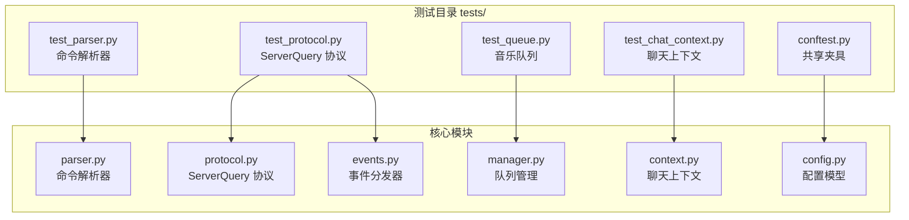
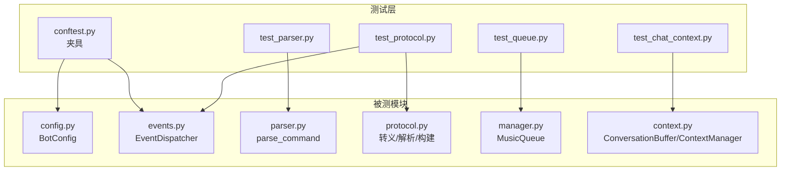
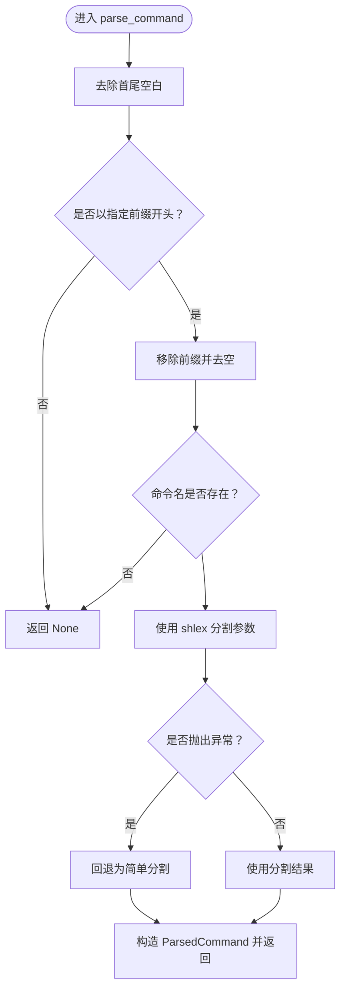
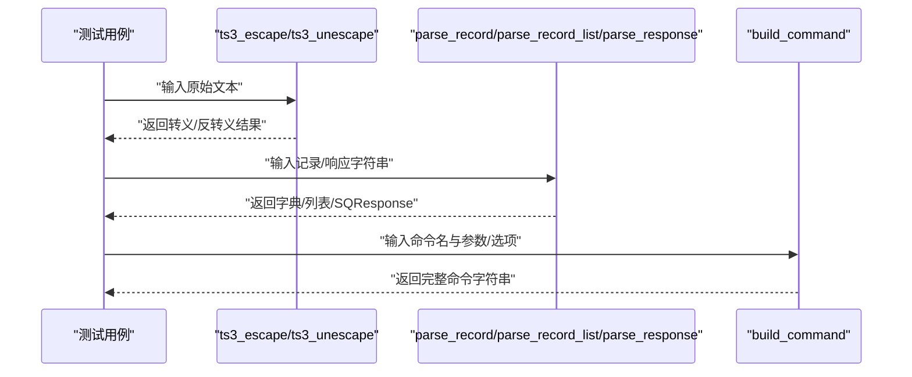
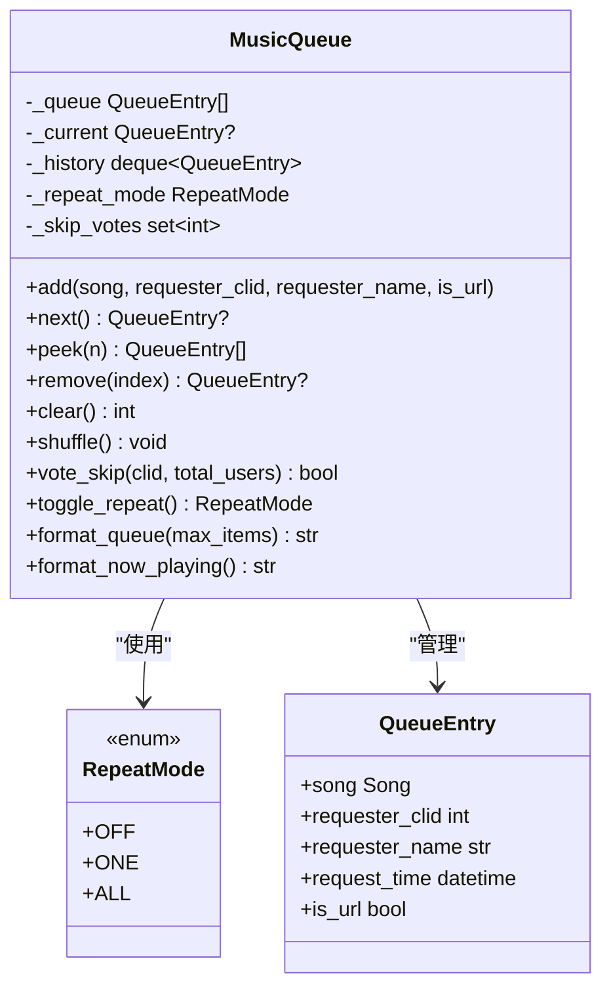
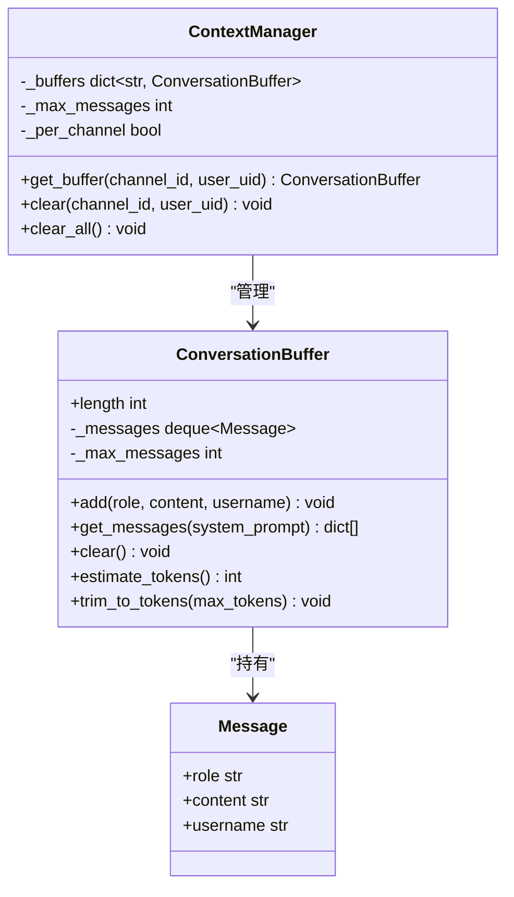
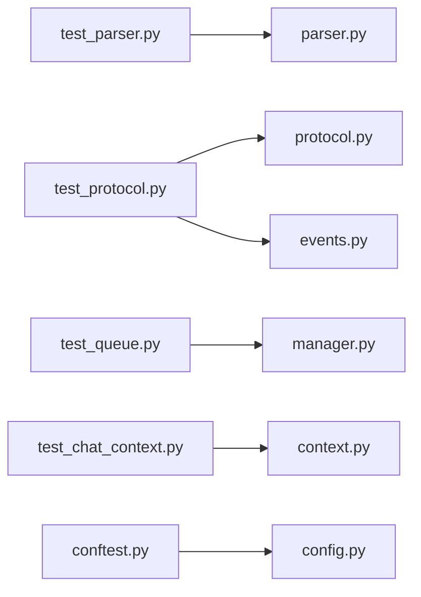

# 测试指南

<cite>
**本文引用的文件**
- [tests/conftest.py](file://tests/conftest.py)
- [tests/test_parser.py](file://tests/test_parser.py)
- [tests/test_protocol.py](file://tests/test_protocol.py)
- [tests/test_queue.py](file://tests/test_queue.py)
- [tests/test_chat_context.py](file://tests/test_chat_context.py)
- [pyproject.toml](file://pyproject.toml)
- [bot/core/commands/parser.py](file://bot/core/commands/parser.py)
- [bot/core/serverquery/protocol.py](file://bot/core/serverquery/protocol.py)
- [bot/core/serverquery/events.py](file://bot/core/serverquery/events.py)
- [bot/services/queue/manager.py](file://bot/services/queue/manager.py)
- [bot/services/chat/context.py](file://bot/services/chat/context.py)
- [bot/config.py](file://bot/config.py)
- [config/config.yaml](file://config/config.yaml)
</cite>

## 目录
1. [引言](#引言)
2. [项目结构](#项目结构)
3. [核心组件](#核心组件)
4. [架构总览](#架构总览)
5. [详细组件分析](#详细组件分析)
6. [依赖分析](#依赖分析)
7. [性能考虑](#性能考虑)
8. [故障排查指南](#故障排查指南)
9. [结论](#结论)
10. [附录](#附录)

## 引言
本测试指南面向希望为 Teamspeak3 机器人项目编写与维护高质量测试的开发者。内容覆盖单元测试编写方法、测试用例设计原则、测试覆盖率要求、现有测试文件结构与夹具（fixtures）使用、pytest 配置与运行方式，并针对以下模块提供分层测试策略：
- 命令解析器测试
- ServerQuery 协议测试
- 队列管理测试
- 聊天上下文测试

同时给出测试数据准备、模拟对象使用、异步测试最佳实践，以及测试环境搭建、持续集成配置与测试报告生成方法。

## 项目结构
测试目录采用按功能模块划分的方式组织，每个模块对应一个测试文件，便于定位与维护。pytest 通过配置自动发现 tests 目录下的测试用例。

图表来源
- [tests/conftest.py:1-19](file://tests/conftest.py#L1-L19)
- [tests/test_parser.py:1-65](file://tests/test_parser.py#L1-L65)
- [tests/test_protocol.py:1-118](file://tests/test_protocol.py#L1-L118)
- [tests/test_queue.py:1-159](file://tests/test_queue.py#L1-L159)
- [tests/test_chat_context.py:1-97](file://tests/test_chat_context.py#L1-L97)
- [bot/core/commands/parser.py:1-67](file://bot/core/commands/parser.py#L1-L67)
- [bot/core/serverquery/protocol.py:1-160](file://bot/core/serverquery/protocol.py#L1-L160)
- [bot/core/serverquery/events.py:1-156](file://bot/core/serverquery/events.py#L1-L156)
- [bot/services/queue/manager.py:1-204](file://bot/services/queue/manager.py#L1-L204)
- [bot/services/chat/context.py:1-101](file://bot/services/chat/context.py#L1-L101)
- [bot/config.py:1-160](file://bot/config.py#L1-L160)

章节来源
- [tests/conftest.py:1-19](file://tests/conftest.py#L1-L19)
- [pyproject.toml:32-35](file://pyproject.toml#L32-L35)

## 核心组件
本节概述与测试直接相关的模块职责与接口，帮助理解测试目标与边界。

- 命令解析器：从文本消息中提取命令名称、参数与调用者元信息，支持前缀匹配、引号参数、大小写不敏感等行为。
- ServerQuery 协议：负责转义/反转义特殊字符、解析记录与响应、构建命令字符串。
- 事件分发器：基于事件类型订阅/取消订阅处理器，异步并发触发回调。
- 队列管理：多用户公平队列、跳过投票、循环模式（关闭/单曲/全部）、格式化输出。
- 聊天上下文：对话缓冲区与按频道/用户的上下文管理，令牌估算与裁剪。

章节来源
- [bot/core/commands/parser.py:22-67](file://bot/core/commands/parser.py#L22-L67)
- [bot/core/serverquery/protocol.py:38-160](file://bot/core/serverquery/protocol.py#L38-L160)
- [bot/core/serverquery/events.py:102-156](file://bot/core/serverquery/events.py#L102-L156)
- [bot/services/queue/manager.py:35-204](file://bot/services/queue/manager.py#L35-L204)
- [bot/services/chat/context.py:18-101](file://bot/services/chat/context.py#L18-L101)

## 架构总览
下图展示测试与被测模块之间的关系，以及夹具如何注入配置与事件分发器实例。

图表来源
- [tests/conftest.py:11-18](file://tests/conftest.py#L11-L18)
- [bot/config.py:125-134](file://bot/config.py#L125-L134)
- [bot/core/serverquery/events.py:102-156](file://bot/core/serverquery/events.py#L102-L156)
- [bot/core/commands/parser.py:22-67](file://bot/core/commands/parser.py#L22-L67)
- [bot/core/serverquery/protocol.py:38-160](file://bot/core/serverquery/protocol.py#L38-L160)
- [bot/services/queue/manager.py:35-204](file://bot/services/queue/manager.py#L35-L204)
- [bot/services/chat/context.py:18-101](file://bot/services/chat/context.py#L18-L101)

## 详细组件分析

### 命令解析器测试
- 测试目标：验证 parse_command 的行为，包括基本命令、多参数、带引号参数、不同前缀、大小写不敏感、元信息传递、无参数与空输入处理。
- 设计原则：
  - 边界条件：空前缀、仅前缀、纯前缀、无命令名。
  - 输入多样性：英文、中文、引号包裹、特殊字符。
  - 元信息完整性：调用者 ID、UID、名称、目标模式。
- 夹具使用：无需自定义夹具，直接导入被测函数进行断言。
- 推荐用例数量：至少覆盖每种分支路径一次；对引号与转义场景增加额外用例以确保健壮性。

图表来源
- [bot/core/commands/parser.py:22-67](file://bot/core/commands/parser.py#L22-L67)

章节来源
- [tests/test_parser.py:6-65](file://tests/test_parser.py#L6-L65)
- [bot/core/commands/parser.py:22-67](file://bot/core/commands/parser.py#L22-L67)

### ServerQuery 协议测试
- 测试目标：覆盖转义/反转义、记录解析、记录列表解析、完整响应解析、命令构建。
- 关键点：
  - 转义/反转义：空串、无特殊字符、未知转义序列保留原样、往返一致性。
  - 记录解析：键值对、空记录、转义值。
  - 响应解析：成功/错误、横幅行忽略、数据行合并。
  - 命令构建：参数转义、选项拼接。
- 夹具使用：无需自定义夹具，直接导入被测函数进行断言。
- 异步测试：事件分发器涉及异步并发，建议在独立测试中验证并发安全与错误捕获。

图表来源
- [tests/test_protocol.py:13-118](file://tests/test_protocol.py#L13-L118)
- [bot/core/serverquery/protocol.py:38-160](file://bot/core/serverquery/protocol.py#L38-L160)

章节来源
- [tests/test_protocol.py:13-118](file://tests/test_protocol.py#L13-L118)
- [bot/core/serverquery/protocol.py:38-160](file://bot/core/serverquery/protocol.py#L38-L160)

### 队列管理测试
- 测试目标：MusicQueue 的增删查改、轮转、洗牌、跳过投票阈值、循环模式切换与行为、格式化输出。
- 设计原则：
  - 行为正确性：next() 在不同循环模式下的返回逻辑、历史记录更新。
  - 边界条件：空队列、索引越界、清空后状态。
  - 统计与一致性：洗牌后元素集合不变、阈值计算逻辑。
- 数据准备：使用 Song 模型构造测试条目，统一时间戳与请求者信息。
- 夹具使用：无需自定义夹具，直接实例化 MusicQueue 进行测试。

图表来源
- [bot/services/queue/manager.py:35-204](file://bot/services/queue/manager.py#L35-L204)

章节来源
- [tests/test_queue.py:13-159](file://tests/test_queue.py#L13-L159)
- [bot/services/queue/manager.py:35-204](file://bot/services/queue/manager.py#L35-L204)

### 聊天上下文测试
- 测试目标：ConversationBuffer 的消息添加、系统提示、最大消息数限制、清理、用户名嵌入、令牌估算与裁剪；ContextManager 的按频道/用户隔离与清理。
- 设计原则：
  - 容器行为：滑动窗口、最旧消息优先移除。
  - 上下文格式：OpenAI 风格的消息数组、系统提示插入位置。
  - 令牌控制：中文字符估算、阈值裁剪。
- 夹具使用：无需自定义夹具，直接实例化缓冲区与管理器进行测试。

图表来源
- [bot/services/chat/context.py:18-101](file://bot/services/chat/context.py#L18-L101)

章节来源
- [tests/test_chat_context.py:6-97](file://tests/test_chat_context.py#L6-L97)
- [bot/services/chat/context.py:18-101](file://bot/services/chat/context.py#L18-L101)

## 依赖分析
- 测试与被测模块耦合度低：测试通过公开函数/类直接调用，避免对内部实现细节的强依赖。
- 外部依赖：
  - pytest 及其 asyncio 支持用于异步测试。
  - pydantic 用于配置模型，测试中通过夹具注入默认配置。
  - 事件分发器依赖 asyncio 并发执行，测试需关注并发安全性与异常捕获。
- 循环依赖：未见明显循环依赖，模块间职责清晰。

图表来源
- [tests/test_parser.py:1-65](file://tests/test_parser.py#L1-L65)
- [bot/core/commands/parser.py:1-67](file://bot/core/commands/parser.py#L1-L67)
- [tests/test_protocol.py:1-118](file://tests/test_protocol.py#L1-L118)
- [bot/core/serverquery/protocol.py:1-160](file://bot/core/serverquery/protocol.py#L1-L160)
- [bot/core/serverquery/events.py:1-156](file://bot/core/serverquery/events.py#L1-L156)
- [tests/test_queue.py:1-159](file://tests/test_queue.py#L1-L159)
- [bot/services/queue/manager.py:1-204](file://bot/services/queue/manager.py#L1-L204)
- [tests/test_chat_context.py:1-97](file://tests/test_chat_context.py#L1-L97)
- [bot/services/chat/context.py:1-101](file://bot/services/chat/context.py#L1-L101)
- [tests/conftest.py:1-19](file://tests/conftest.py#L1-L19)
- [bot/config.py:1-160](file://bot/config.py#L1-L160)

章节来源
- [pyproject.toml:18-23](file://pyproject.toml#L18-L23)
- [bot/config.py:125-134](file://bot/config.py#L125-L134)

## 性能考虑
- 测试执行效率：
  - 使用 pytest 的并发执行能力（如 asyncio_mode），但避免在单测中引入真实网络或外部进程。
  - 对于大量消息的令牌估算与裁剪，建议在测试中使用较小规模数据集，确保断言快速完成。
- 内存占用：
  - 队列与缓冲区使用固定长度容器，测试中应覆盖最大容量与清空场景，避免内存泄漏。
- I/O 与外部服务：
  - ServerQuery 协议测试尽量使用纯函数与字符串输入输出，避免真实连接。
  - 聊天上下文测试不依赖外部 LLM API，仅验证格式化与统计逻辑。

## 故障排查指南
- 常见问题与解决思路：
  - 断言失败：检查输入数据是否符合预期格式（如引号、转义、大小写）。
  - 异步测试不稳定：确认使用了正确的 asyncio 模式与事件循环；避免在测试中混用同步与异步。
  - 队列/上下文状态异常：核对边界条件（空队列、索引越界、清空后重置）。
  - 配置加载异常：检查环境变量与配置文件路径，确保夹具能正确注入默认配置。
- 日志与调试：
  - 事件分发器在处理异常时会记录日志，可在测试中观察日志输出定位问题。
  - 使用 pytest 的详细输出模式（如 -v）查看失败用例的具体断言信息。

章节来源
- [bot/core/serverquery/events.py:132-138](file://bot/core/serverquery/events.py#L132-L138)
- [bot/config.py:136-159](file://bot/config.py#L136-L159)

## 结论
本测试指南提供了针对命令解析器、ServerQuery 协议、队列管理与聊天上下文的系统化测试方法。通过明确的测试用例设计原则、夹具使用与异步测试最佳实践，可有效提升代码质量与可维护性。建议在持续集成中启用测试报告生成与覆盖率统计，逐步提高关键路径的覆盖率。

## 附录

### 单元测试编写方法与用例设计原则
- 原则
  - 每个测试聚焦单一行为或边界条件。
  - 使用参数化与夹具减少重复代码。
  - 对异常路径与边界条件进行显式断言。
  - 不依赖外部系统，使用纯函数与模拟对象。
- 建议
  - 为每个公共函数/类提供独立测试文件。
  - 使用“Given-When-Then”结构组织测试步骤。
  - 对异步函数使用合适的 asyncio 模式与事件循环。

### 测试夹具（fixtures）使用
- 共享夹具
  - 配置夹具：提供默认 BotConfig 实例，便于测试配置相关逻辑。
  - 事件分发器夹具：提供 EventDispatcher 实例，便于测试事件订阅/发布。
- 使用示例
  - 在测试类或函数参数中声明夹具名称，pytest 自动注入实例。
  - 避免在夹具中引入副作用，保持测试可重复性。

章节来源
- [tests/conftest.py:11-18](file://tests/conftest.py#L11-L18)

### pytest 配置与测试运行
- 配置项
  - asyncio_mode：启用异步测试模式。
  - testpaths：指定测试目录。
- 运行方式
  - 基本运行：pytest
  - 详细输出：pytest -v
  - 并发执行：pytest --asyncio-mode=auto
  - 生成覆盖率：pytest --cov=bot --cov-report=term-missing
  - 生成 HTML 报告：pytest --cov=bot --cov-report=html

章节来源
- [pyproject.toml:32-35](file://pyproject.toml#L32-L35)

### 测试数据准备与模拟对象
- 测试数据
  - 使用简单、可预测的数据构造器（如 _make_song）生成测试实体。
  - 对于字符串与数值，选择边界值与典型值组合。
- 模拟对象
  - 对外部依赖（如网络请求、文件系统）使用模拟对象或临时文件。
  - 对异步依赖使用 asyncio 的模拟任务或事件循环。

### 异步测试最佳实践
- 使用 asyncio_mode=auto 或手动管理事件循环。
- 对并发操作使用 gather 等机制时，确保异常被捕获并记录。
- 避免在测试中引入真实网络延迟与外部资源。

### 测试环境搭建与持续集成
- 环境要求
  - Python 版本：>=3.12
  - 依赖安装：pip install -e .[dev]
- CI 配置建议
  - 安装依赖与运行测试。
  - 生成覆盖率报告并上传至覆盖率平台。
  - 对关键模块设置覆盖率阈值（如语句/分支/行覆盖率）。

章节来源
- [pyproject.toml:1-35](file://pyproject.toml#L1-L35)

### 测试覆盖率要求
- 建议目标
  - 语句覆盖率：≥80%
  - 分支覆盖率：≥70%
  - 行覆盖率：≥80%
- 覆盖率收集
  - 使用 pytest-cov 插件生成覆盖率报告。
  - 将覆盖率报告集成到 CI 流水线，失败时阻止合并。

### 测试报告生成方法
- 命令
  - pytest --cov=bot --cov-report=term-missing
  - pytest --cov=bot --cov-report=html
- 输出
  - 控制台报告：显示缺失覆盖率的文件与行号。
  - HTML 报告：可视化覆盖率详情，便于审查。