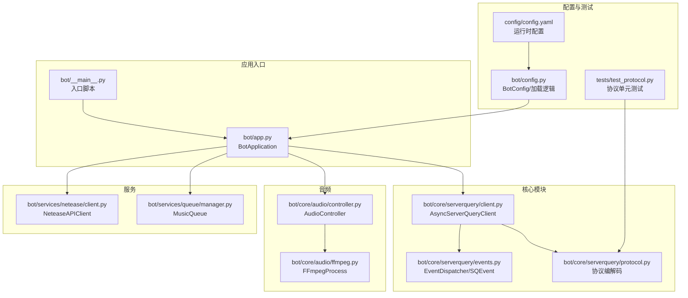
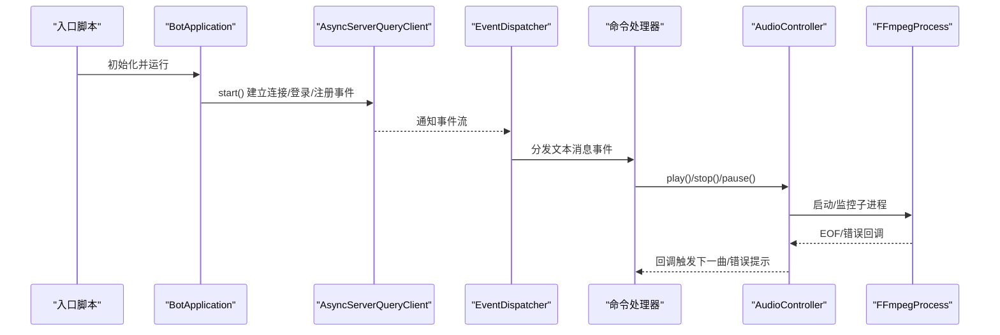
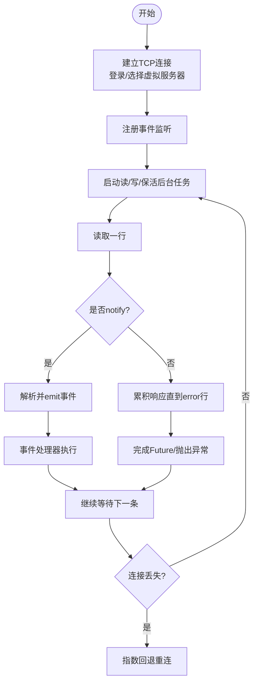
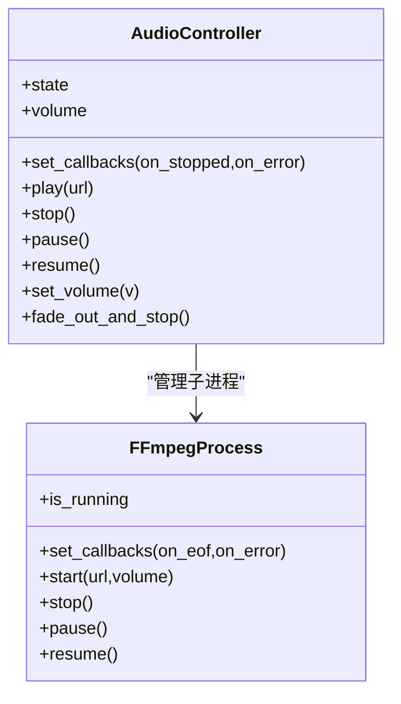
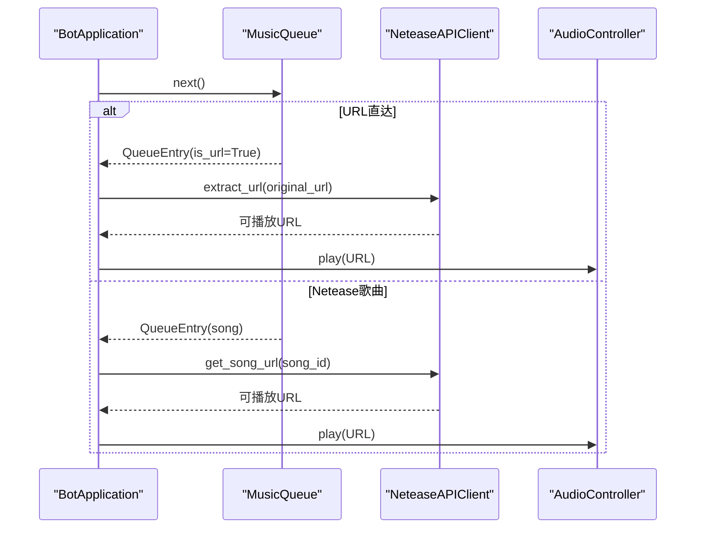
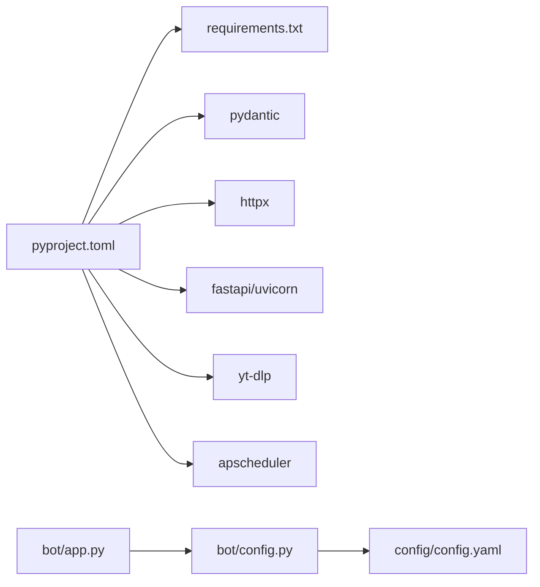

# 调试技巧

<cite>
**本文引用的文件**
- [bot/app.py](file://bot/app.py)
- [bot/__main__.py](file://bot/__main__.py)
- [bot/config.py](file://bot/config.py)
- [bot/core/serverquery/client.py](file://bot/core/serverquery/client.py)
- [bot/core/serverquery/events.py](file://bot/core/serverquery/events.py)
- [bot/core/serverquery/protocol.py](file://bot/core/serverquery/protocol.py)
- [bot/core/audio/controller.py](file://bot/core/audio/controller.py)
- [bot/core/audio/ffmpeg.py](file://bot/core/audio/ffmpeg.py)
- [bot/services/netease/client.py](file://bot/services/netease/client.py)
- [bot/services/queue/manager.py](file://bot/services/queue/manager.py)
- [bot/core/commands/handlers/debug.py](file://bot/core/commands/handlers/debug.py)
- [tests/test_protocol.py](file://tests/test_protocol.py)
- [config/config.yaml](file://config/config.yaml)
- [pyproject.toml](file://pyproject.toml)
- [requirements.txt](file://requirements.txt)
</cite>

## 目录
1. [简介](#简介)
2. [项目结构](#项目结构)
3. [核心组件](#核心组件)
4. [架构总览](#架构总览)
5. [详细组件分析](#详细组件分析)
6. [依赖分析](#依赖分析)
7. [性能考虑](#性能考虑)
8. [故障排查指南](#故障排查指南)
9. [结论](#结论)
10. [附录](#附录)

## 简介
本文件面向开发与运维工程师，系统化整理本项目的调试方法与工具使用建议，覆盖以下主题：
- Python 调试器（pdb、ipdb）的断点设置与变量检查
- 异步代码调试要点、事件循环与协程跟踪
- ServerQuery 连接调试、网络通信问题排查
- 音频播放问题诊断（FFmpeg、PulseAudio）
- 日志记录配置、错误追踪与性能分析
- 常见问题的调试流程与解决方案

## 项目结构
该项目采用按功能域分层的组织方式：应用入口负责生命周期编排；核心模块封装协议、事件与ServerQuery客户端；服务层提供音乐、聊天、调度等能力；工具与配置位于顶层。

图表来源
- [bot/__main__.py:1-17](file://bot/__main__.py#L1-L17)
- [bot/app.py:1-348](file://bot/app.py#L1-L348)
- [bot/core/serverquery/client.py:1-406](file://bot/core/serverquery/client.py#L1-L406)
- [bot/core/serverquery/events.py:1-156](file://bot/core/serverquery/events.py#L1-L156)
- [bot/core/serverquery/protocol.py:1-160](file://bot/core/serverquery/protocol.py#L1-L160)
- [bot/core/audio/controller.py:1-143](file://bot/core/audio/controller.py#L1-L143)
- [bot/core/audio/ffmpeg.py:1-162](file://bot/core/audio/ffmpeg.py#L1-L162)
- [bot/services/netease/client.py:1-161](file://bot/services/netease/client.py#L1-L161)
- [bot/services/queue/manager.py:1-204](file://bot/services/queue/manager.py#L1-L204)
- [bot/config.py:1-160](file://bot/config.py#L1-L160)
- [config/config.yaml:1-76](file://config/config.yaml#L1-L76)
- [tests/test_protocol.py:1-118](file://tests/test_protocol.py#L1-L118)

章节来源
- [bot/__main__.py:1-17](file://bot/__main__.py#L1-L17)
- [bot/app.py:1-348](file://bot/app.py#L1-L348)
- [bot/config.py:1-160](file://bot/config.py#L1-L160)
- [config/config.yaml:1-76](file://config/config.yaml#L1-L76)

## 核心组件
- 应用编排与生命周期：BotApplication 负责加载配置、实例化各子系统、建立ServerQuery连接、注册命令与事件、启动后台服务，并处理优雅停机。
- ServerQuery 客户端：AsyncServerQueryClient 提供连接管理、命令队列、事件派发、保活与自动重连。
- 事件系统：EventDispatcher 实现轻量级发布订阅，支持文本消息、加入/离开、移动等事件。
- 协议编解码：protocol 模块实现 TS3 特殊字符转义/反转义与响应解析。
- 音频控制：AudioController 封装 FFmpeg 子进程与音量控制器，提供播放、暂停、恢复、淡出停止与回调事件。
- 音乐服务：NeteaseAPIClient 使用 yt-dlp 抽取可播放 URL，避免缓存过期的 CDN 链接。
- 队列管理：MusicQueue 支持多用户点歌、跳过投票、重复模式与历史记录。

章节来源
- [bot/app.py:27-348](file://bot/app.py#L27-L348)
- [bot/core/serverquery/client.py:27-406](file://bot/core/serverquery/client.py#L27-L406)
- [bot/core/serverquery/events.py:18-156](file://bot/core/serverquery/events.py#L18-L156)
- [bot/core/serverquery/protocol.py:38-160](file://bot/core/serverquery/protocol.py#L38-L160)
- [bot/core/audio/controller.py:24-143](file://bot/core/audio/controller.py#L24-L143)
- [bot/core/audio/ffmpeg.py:16-162](file://bot/core/audio/ffmpeg.py#L16-L162)
- [bot/services/netease/client.py:25-161](file://bot/services/netease/client.py#L25-L161)
- [bot/services/queue/manager.py:35-204](file://bot/services/queue/manager.py#L35-L204)

## 架构总览
应用以异步事件驱动为核心，通过 ServerQuery 与 Teamspeak 服务器交互，内部以队列与回调串联命令、音频与网络服务。

图表来源
- [bot/app.py:283-348](file://bot/app.py#L283-L348)
- [bot/core/serverquery/client.py:81-170](file://bot/core/serverquery/client.py#L81-L170)
- [bot/core/serverquery/events.py:120-156](file://bot/core/serverquery/events.py#L120-L156)
- [bot/core/audio/controller.py:70-143](file://bot/core/audio/controller.py#L70-L143)
- [bot/core/audio/ffmpeg.py:54-162](file://bot/core/audio/ffmpeg.py#L54-L162)

## 详细组件分析

### 组件一：ServerQuery 客户端与事件系统
- 连接与保活：客户端在后台任务中维护读写循环与 whoami 心跳；断线后指数回退重连。
- 命令队列：所有命令入队串行执行，等待 Future 返回结果；非连接阶段使用 _raw_send_and_wait。
- 事件派发：reader 循环解析 notify 行并交由 EventDispatcher 发布；handler 执行异常会被安全捕获并记录。
- 文本消息路由：应用层将 textmessage 事件转换为命令上下文并执行。

图表来源
- [bot/core/serverquery/client.py:111-290](file://bot/core/serverquery/client.py#L111-L290)
- [bot/core/serverquery/events.py:102-156](file://bot/core/serverquery/events.py#L102-L156)

章节来源
- [bot/core/serverquery/client.py:27-406](file://bot/core/serverquery/client.py#L27-L406)
- [bot/core/serverquery/events.py:18-156](file://bot/core/serverquery/events.py#L18-L156)
- [bot/core/serverquery/protocol.py:95-160](file://bot/core/serverquery/protocol.py#L95-L160)

### 组件二：音频播放与FFmpeg子进程
- 控制器职责：统一状态机（空闲/播放/暂停）、音量控制、回调事件；对外暴露 play/stop/pause/resume/fade_out_and_stop。
- FFmpeg 管理：启动时构建参数列表（重连策略、音量增益、输出到 PulseAudio sink），stderr 监控用于判断 EOF 与错误；支持 SIGSTOP/SIGCONT 暂停/恢复。
- 回调链路：FFmpeg EOF 触发控制器状态切换与 on_stopped 回调；错误触发 on_error 回调。

图表来源
- [bot/core/audio/controller.py:24-143](file://bot/core/audio/controller.py#L24-L143)
- [bot/core/audio/ffmpeg.py:16-162](file://bot/core/audio/ffmpeg.py#L16-L162)

章节来源
- [bot/core/audio/controller.py:18-143](file://bot/core/audio/controller.py#L18-L143)
- [bot/core/audio/ffmpeg.py:16-162](file://bot/core/audio/ffmpeg.py#L16-L162)

### 组件三：音乐服务与URL抽取
- NeteaseAPIClient 使用 yt-dlp 抽取可播放 URL，避免缓存 CDN 链接；歌词接口仍使用官方 API。
- MusicQueue 管理队列、历史、重复模式与跳过投票，配合控制器实现自动播放下一曲。

图表来源
- [bot/app.py:199-246](file://bot/app.py#L199-L246)
- [bot/services/netease/client.py:68-96](file://bot/services/netease/client.py#L68-L96)
- [bot/services/queue/manager.py:90-119](file://bot/services/queue/manager.py#L90-L119)

章节来源
- [bot/services/netease/client.py:25-161](file://bot/services/netease/client.py#L25-L161)
- [bot/services/queue/manager.py:35-204](file://bot/services/queue/manager.py#L35-L204)

### 组件四：命令系统与调试命令
- 注册命令：应用启动时注册 debug/music/volume/chat/admin 等处理器。
- ping/status：提供基本连通性与运行时信息查询，便于快速验证。

章节来源
- [bot/app.py:140-151](file://bot/app.py#L140-L151)
- [bot/core/commands/handlers/debug.py:13-37](file://bot/core/commands/handlers/debug.py#L13-L37)

## 依赖分析
- 运行时依赖：pydantic、httpx、fastapi+uvicorn、yt-dlp、apscheduler 等。
- 开发依赖：pytest、pytest-asyncio、ruff。
- 配置来源：config.yaml 与环境变量插值；BotConfig 作为统一数据模型。

图表来源
- [pyproject.toml:1-35](file://pyproject.toml#L1-L35)
- [requirements.txt:1-10](file://requirements.txt#L1-L10)
- [bot/config.py:136-160](file://bot/config.py#L136-L160)
- [config/config.yaml:1-76](file://config/config.yaml#L1-L76)

章节来源
- [pyproject.toml:1-35](file://pyproject.toml#L1-L35)
- [requirements.txt:1-10](file://requirements.txt#L1-L10)
- [bot/config.py:125-160](file://bot/config.py#L125-L160)

## 性能考虑
- 异步串行化：ServerQuery 命令队列保证顺序执行，避免并发冲突；注意长阻塞操作会阻塞后续命令。
- FFmpeg 参数：合理设置重连参数与采样率/声道，减少网络抖动导致的中断与资源浪费。
- 缓存策略：Netease 搜索与歌词使用 TTL 缓存，降低外部 API 压力。
- 日志级别：生产环境建议 INFO 或更高，避免高频 DEBUG 影响性能。

## 故障排查指南

### 一、Python 调试器使用（pdb/ipdb）
- 断点设置
  - 在需要检查变量或定位异常的函数入口处插入断点标记，例如在命令处理函数、事件回调或播放控制路径中。
  - 对于异步函数，确保在协程上下文中设置断点，避免在事件循环外触发。
- 变量检查
  - 使用断点进入交互式调试后，检查关键对象属性（如 AudioController.state、FFmpegProcess.is_running、ServerQueryClient.connected）。
  - 在命令处理链路中，打印命令上下文与解析结果，确认前缀、目标模式与 invoker 信息正确。
- 推荐实践
  - 结合日志与断点双轨法：先用日志缩小范围，再用断点精确定位。
  - 在事件处理器中捕获异常并记录堆栈，便于后续断点复现。

章节来源
- [bot/app.py:162-198](file://bot/app.py#L162-L198)
- [bot/core/audio/controller.py:70-143](file://bot/core/audio/controller.py#L70-L143)
- [bot/core/serverquery/client.py:201-290](file://bot/core/serverquery/client.py#L201-L290)

### 二、异步代码调试与事件循环
- 关注点
  - 事件循环：确保在正确的事件循环中创建 Future 与 Task；避免在主线程直接调用 asyncio.run。
  - 并发与竞态：命令与事件可能并发到达，注意共享状态的保护与一致性。
  - 超时与取消：命令等待与网络读取均设置超时，异常路径需清理资源并恢复状态。
- 协程跟踪
  - 使用日志中的任务名称（如 sq-reader、sq-writer、ffmpeg-monitor）辅助定位卡顿或异常任务。
  - 在回调中记录时间戳，评估播放延迟与重连耗时。

章节来源
- [bot/core/serverquery/client.py:165-170](file://bot/core/serverquery/client.py#L165-L170)
- [bot/core/audio/ffmpeg.py:127-162](file://bot/core/audio/ffmpeg.py#L127-L162)

### 三、ServerQuery 连接调试
- 常见症状
  - 无法登录/掉线频繁：检查凭据、虚拟服务器ID与主机端口。
  - 事件不触发：确认事件注册是否成功，以及 notify 解析是否正确。
  - 命令超时：检查命令队列积压与网络延迟。
- 排查步骤
  - 启用更详细的日志，观察连接建立、登录、注册事件与心跳过程。
  - 使用 !status 命令确认 client_id 与连接状态。
  - 若出现连接丢失，查看重连延迟与异常日志，必要时调整最大重连间隔。
- 单元测试参考
  - 协议解析与命令构建的测试用例可帮助验证字符串拼接与转义是否符合预期。

章节来源
- [bot/core/serverquery/client.py:111-198](file://bot/core/serverquery/client.py#L111-L198)
- [bot/core/serverquery/events.py:139-156](file://bot/core/serverquery/events.py#L139-L156)
- [bot/core/serverquery/protocol.py:95-160](file://bot/core/serverquery/protocol.py#L95-L160)
- [bot/core/commands/handlers/debug.py:20-37](file://bot/core/commands/handlers/debug.py#L20-L37)
- [tests/test_protocol.py:1-118](file://tests/test_protocol.py#L1-L118)

### 四、网络通信问题排查
- ServerQuery
  - 检查防火墙与端口可达性；确认登录凭据与虚拟服务器ID一致。
  - 关注 reader 循环中的超时与 keepalive 失败日志。
- 音乐服务
  - yt-dlp 抽取失败通常由源站限制或链接过期引起；优先重试与降级策略（如使用原始URL重新抽取）。
  - 歌词接口若失败，检查 referer 与 UA 设置是否正确。
- Webhook/FastAPI
  - 若启用 webhook，确认主机/端口与密钥配置；通过日志确认服务启动与请求处理路径。

章节来源
- [bot/core/serverquery/client.py:278-290](file://bot/core/serverquery/client.py#L278-L290)
- [bot/services/netease/client.py:77-96](file://bot/services/netease/client.py#L77-L96)
- [bot/app.py:255-282](file://bot/app.py#L255-L282)

### 五、音频播放问题诊断
- FFmpeg 启动失败
  - 检查 ffmpeg 路径、PulseAudio sink 名称与权限；查看 stderr 输出与返回码。
  - 若返回码为 -25，表示被暂停（SIGSTOP），非错误；否则视为播放失败。
- 播放中断/卡顿
  - 调整重连参数与缓冲策略；确认网络稳定性与源站带宽。
  - 检查音量设置与 sink 输入刷新时机，避免启动瞬间静音。
- 淡出停止
  - 确认淡出时长与恢复音量逻辑，避免下次播放音量突变。

章节来源
- [bot/core/audio/ffmpeg.py:54-162](file://bot/core/audio/ffmpeg.py#L54-L162)
- [bot/core/audio/controller.py:114-129](file://bot/core/audio/controller.py#L114-L129)

### 六、日志记录配置与错误追踪
- 配置项
  - 日志级别、格式、文件路径、轮转大小与备份数量均可在配置中定义。
  - 应用启动时根据配置初始化 basicConfig，支持控制台与文件双重输出。
- 错误追踪
  - 事件处理器与命令执行均包裹异常捕获与日志记录，便于定位具体 handler 与事件类型。
  - 建议在关键路径增加上下文日志（如命令名、用户ID、URL片段），提升可追溯性。

章节来源
- [bot/config.py:117-123](file://bot/config.py#L117-L123)
- [bot/app.py:112-138](file://bot/app.py#L112-L138)
- [bot/core/serverquery/events.py:132-138](file://bot/core/serverquery/events.py#L132-L138)
- [bot/app.py:190-198](file://bot/app.py#L190-L198)

### 七、性能分析与优化建议
- 命令与事件吞吐
  - 使用日志统计事件到达速率与处理耗时，识别瓶颈（如网络IO或外部API）。
- 播放链路
  - 记录从队列取下一曲到 FFmpeg EOF 的端到端时延，结合网络质量进行优化。
- 缓存命中
  - 通过搜索与歌词缓存命中率评估 TTL 设置是否合理。

### 八、常见问题与调试流程
- 问题：Bot 启动后无任何日志
  - 流程：检查配置文件与环境变量插值；确认日志配置；查看入口脚本是否正常导入。
- 问题：!play 无效或报错
  - 流程：使用 !status 确认 ServerQuery 连接；检查命令注册与解析；验证 URL 抽取与播放回调。
- 问题：音频无声或断断续续
  - 流程：检查 FFmpeg 启动参数与返回码；确认 PulseAudio sink 可用；核对音量与淡出逻辑。
- 问题：事件不触发
  - 流程：确认事件注册成功；检查 notify 解析与派发；验证订阅者是否存在。

章节来源
- [bot/__main__.py:9-17](file://bot/__main__.py#L9-L17)
- [bot/app.py:140-151](file://bot/app.py#L140-L151)
- [bot/core/audio/ffmpeg.py:145-162](file://bot/core/audio/ffmpeg.py#L145-L162)
- [bot/core/serverquery/client.py:151-164](file://bot/core/serverquery/client.py#L151-L164)

## 结论
本项目的调试策略应围绕“异步事件驱动 + 明确边界”的设计展开：以日志为先、断点为辅，结合 ServerQuery 事件流与音频播放链路的关键节点进行分层排查。通过合理的配置与缓存策略、清晰的错误处理与回调机制，能够有效提升系统的可观测性与可维护性。

## 附录
- 配置示例与字段说明可参考配置文件与配置模型定义。
- 单元测试覆盖了协议层的关键行为，可作为协议正确性的参考基准。

章节来源
- [config/config.yaml:1-76](file://config/config.yaml#L1-L76)
- [bot/config.py:36-134](file://bot/config.py#L36-L134)
- [tests/test_protocol.py:13-118](file://tests/test_protocol.py#L13-L118)