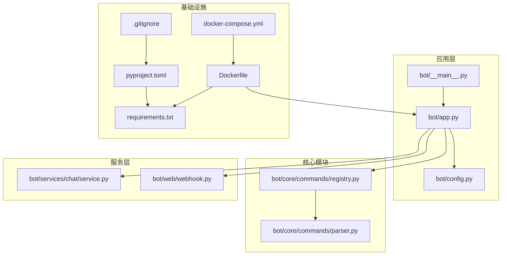
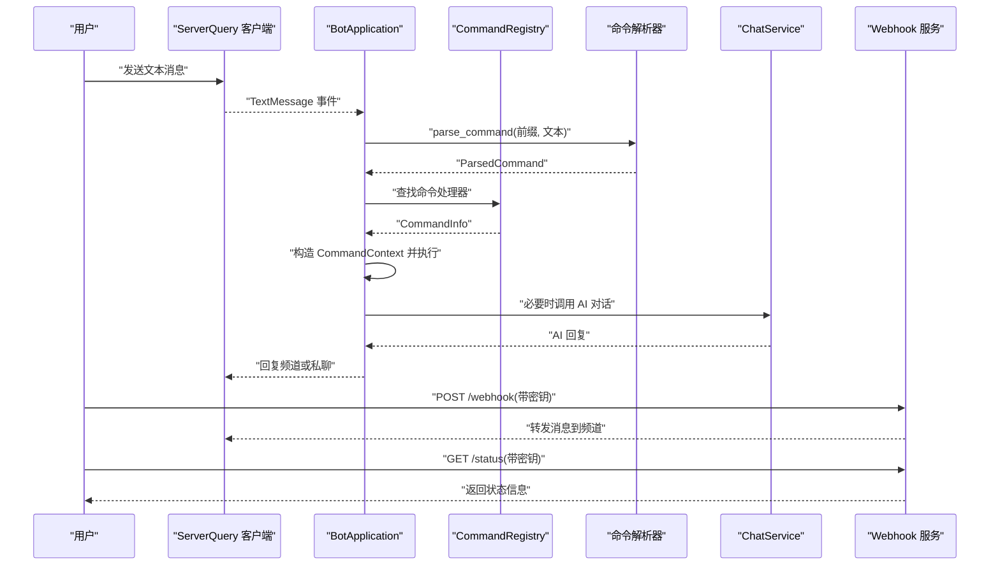
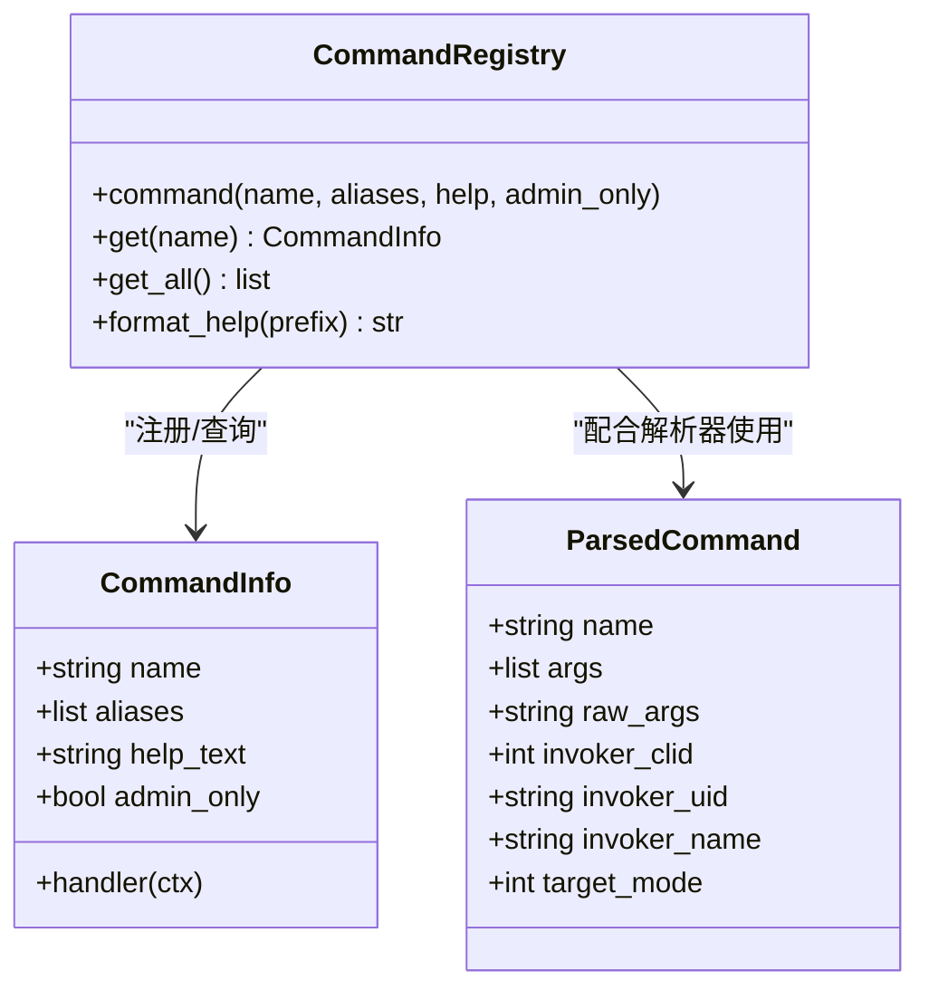
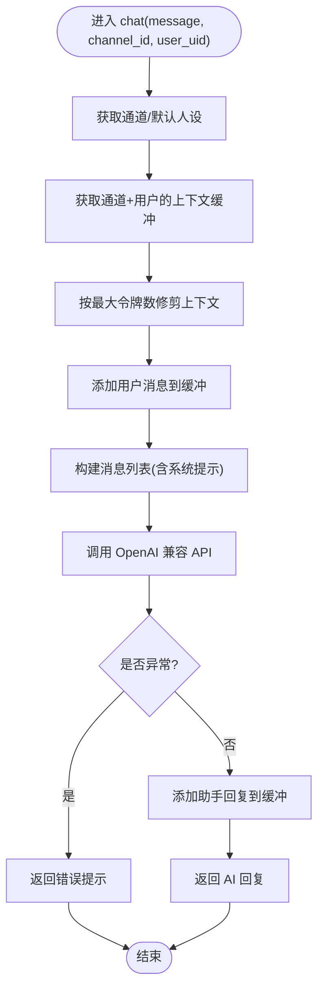
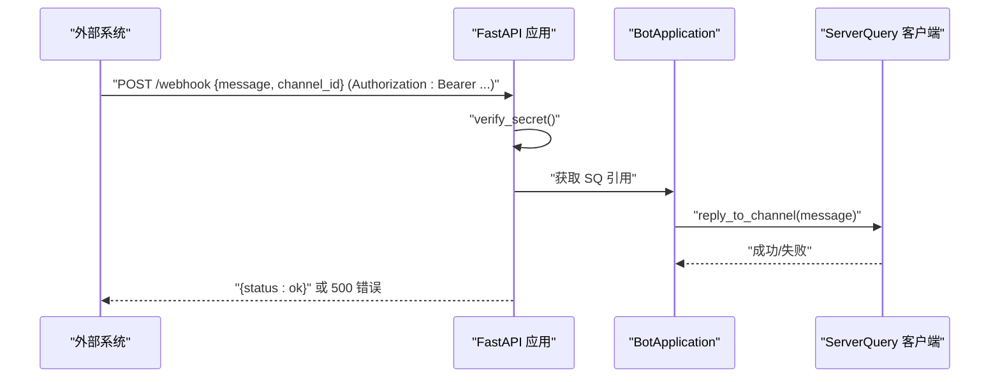
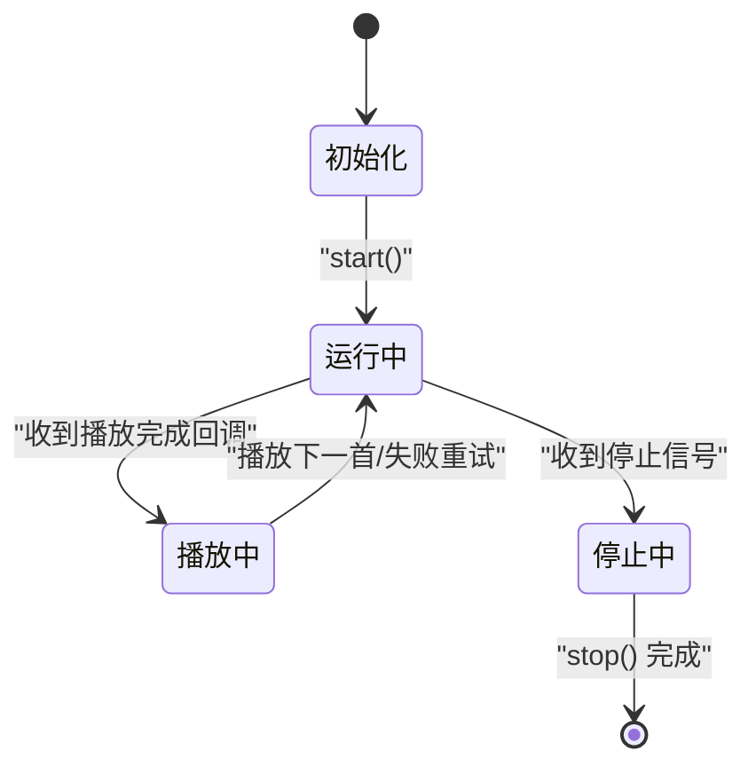
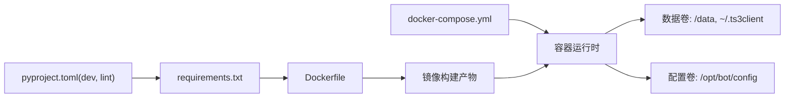

# 贡献流程

<cite>
**本文引用的文件**
- [pyproject.toml](file://pyproject.toml)
- [requirements.txt](file://requirements.txt)
- [Dockerfile](file://Dockerfile)
- [docker-compose.yml](file://docker-compose.yml)
- [.gitignore](file://.gitignore)
- [bot/__main__.py](file://bot/__main__.py)
- [bot/app.py](file://bot/app.py)
- [bot/config.py](file://bot/config.py)
- [bot/core/commands/parser.py](file://bot/core/commands/parser.py)
- [bot/core/commands/registry.py](file://bot/core/commands/registry.py)
- [bot/services/chat/service.py](file://bot/services/chat/service.py)
- [bot/web/webhook.py](file://bot/web/webhook.py)
- [tests/conftest.py](file://tests/conftest.py)
</cite>

## 目录
1. [简介](#简介)
2. [项目结构](#项目结构)
3. [核心组件](#核心组件)
4. [架构总览](#架构总览)
5. [详细组件分析](#详细组件分析)
6. [依赖分析](#依赖分析)
7. [性能考虑](#性能考虑)
8. [故障排查指南](#故障排查指南)
9. [结论](#结论)
10. [附录](#附录)

## 简介
本文件面向希望参与本项目的开发者，提供一套完整的协作开发与贡献流程指南。内容涵盖从 Fork 项目到提交 Pull Request 的全流程、代码审查与质量检查要求、合并标准、版本管理与发布策略、Git 工作流最佳实践（含 commit 消息格式、分支命名约定、冲突解决）、社区行为准则、问题报告与功能请求流程、参与讨论方式、文档改进贡献以及安全问题上报路径等。

## 项目结构
本项目采用按功能域分层的组织方式：核心业务逻辑位于 bot/ 下，包含音频控制、命令系统、服务编排、聊天与 Webhook 等模块；容器化运行通过 Dockerfile 与 docker-compose.yml 提供；测试位于 tests/；Python 依赖在 pyproject.toml 与 requirements.txt 中声明；.gitignore 控制忽略项。

图表来源
- [bot/app.py:1-348](file://bot/app.py#L1-L348)
- [bot/__main__.py:1-17](file://bot/__main__.py#L1-L17)
- [bot/config.py:1-160](file://bot/config.py#L1-L160)
- [bot/core/commands/parser.py:1-67](file://bot/core/commands/parser.py#L1-L67)
- [bot/core/commands/registry.py:1-94](file://bot/core/commands/registry.py#L1-L94)
- [bot/services/chat/service.py:1-115](file://bot/services/chat/service.py#L1-L115)
- [bot/web/webhook.py:1-76](file://bot/web/webhook.py#L1-L76)
- [Dockerfile:1-100](file://Dockerfile#L1-L100)
- [docker-compose.yml:1-33](file://docker-compose.yml#L1-L33)
- [pyproject.toml:1-35](file://pyproject.toml#L1-L35)
- [requirements.txt:1-10](file://requirements.txt#L1-L10)
- [.gitignore:1-19](file://.gitignore#L1-L19)

章节来源
- [bot/app.py:1-348](file://bot/app.py#L1-L348)
- [bot/__main__.py:1-17](file://bot/__main__.py#L1-L17)
- [bot/config.py:1-160](file://bot/config.py#L1-L160)
- [bot/core/commands/parser.py:1-67](file://bot/core/commands/parser.py#L1-L67)
- [bot/core/commands/registry.py:1-94](file://bot/core/commands/registry.py#L1-L94)
- [bot/services/chat/service.py:1-115](file://bot/services/chat/service.py#L1-L115)
- [bot/web/webhook.py:1-76](file://bot/web/webhook.py#L1-L76)
- [Dockerfile:1-100](file://Dockerfile#L1-L100)
- [docker-compose.yml:1-33](file://docker-compose.yml#L1-L33)
- [pyproject.toml:1-35](file://pyproject.toml#L1-L35)
- [requirements.txt:1-10](file://requirements.txt#L1-L10)
- [.gitignore:1-19](file://.gitignore#L1-L19)

## 核心组件
- 应用入口与生命周期：应用入口通过 bot/__main__.py 启动，BotApplication 负责加载配置、初始化各子系统、注册命令与事件监听器、连接 ServerQuery、启动调度器与 Webhook，并处理优雅停机。
- 配置系统：BotConfig 使用 Pydantic 定义各模块配置模型，支持从 YAML 文件加载并在运行时进行环境变量插值。
- 命令系统：CommandRegistry 提供装饰器式命令注册与别名映射，parser 将文本消息解析为命令对象。
- 聊天服务：ChatService 封装 OpenAI 兼容 API，支持多角色人设、通道级上下文隔离与令牌感知的上下文修剪。
- Webhook 服务：基于 FastAPI 提供受密钥保护的 Webhook 接口与状态查询接口，用于外部触发消息发送与健康检查。

章节来源
- [bot/__main__.py:1-17](file://bot/__main__.py#L1-L17)
- [bot/app.py:1-348](file://bot/app.py#L1-L348)
- [bot/config.py:1-160](file://bot/config.py#L1-L160)
- [bot/core/commands/parser.py:1-67](file://bot/core/commands/parser.py#L1-L67)
- [bot/core/commands/registry.py:1-94](file://bot/core/commands/registry.py#L1-L94)
- [bot/services/chat/service.py:1-115](file://bot/services/chat/service.py#L1-L115)
- [bot/web/webhook.py:1-76](file://bot/web/webhook.py#L1-L76)

## 架构总览
下图展示了应用启动、命令路由、事件驱动与外部集成的整体流程。

图表来源
- [bot/app.py:162-198](file://bot/app.py#L162-L198)
- [bot/core/commands/parser.py:22-67](file://bot/core/commands/parser.py#L22-L67)
- [bot/core/commands/registry.py:68-83](file://bot/core/commands/registry.py#L68-L83)
- [bot/services/chat/service.py:61-110](file://bot/services/chat/service.py#L61-L110)
- [bot/web/webhook.py:32-76](file://bot/web/webhook.py#L32-L76)

## 详细组件分析

### 组件一：命令系统（注册与解析）
- 注册机制：CommandRegistry 提供装饰器注册命令，支持别名与帮助文本，内部维护名称到处理器的映射及别名索引。
- 解析流程：parse_command 使用安全的参数分割策略，支持转义与引号包裹，返回标准化的 ParsedCommand 结构。
- 执行链路：BotApplication 在收到 TextMessage 事件后，先解析命令，再查表获取处理器，最后以 CommandContext 作为上下文执行。

图表来源
- [bot/core/commands/registry.py:17-94](file://bot/core/commands/registry.py#L17-L94)
- [bot/core/commands/parser.py:9-67](file://bot/core/commands/parser.py#L9-L67)

章节来源
- [bot/core/commands/registry.py:1-94](file://bot/core/commands/registry.py#L1-L94)
- [bot/core/commands/parser.py:1-67](file://bot/core/commands/parser.py#L1-L67)
- [bot/app.py:140-198](file://bot/app.py#L140-L198)

### 组件二：聊天服务（AI 对话）
- 功能要点：支持多角色人设、通道级上下文隔离、最大令牌数限制下的上下文修剪、错误兜底返回。
- 外部集成：通过 OpenAI 兼容 API 发起对话请求，返回 AI 回复并更新上下文缓冲区。

图表来源
- [bot/services/chat/service.py:61-110](file://bot/services/chat/service.py#L61-L110)

章节来源
- [bot/services/chat/service.py:1-115](file://bot/services/chat/service.py#L1-L115)

### 组件三：Webhook 服务（外部通知）
- 能力范围：提供受密钥保护的消息发送接口与运行状态查询接口；健康检查接口便于运维监控。
- 安全控制：通过请求头校验密钥，未通过则拒绝访问。

图表来源
- [bot/web/webhook.py:32-50](file://bot/web/webhook.py#L32-L50)
- [bot/web/webhook.py:51-69](file://bot/web/webhook.py#L51-L69)

章节来源
- [bot/web/webhook.py:1-76](file://bot/web/webhook.py#L1-L76)

### 组件四：应用生命周期与事件驱动
- 启动阶段：加载配置、初始化各子系统、注册命令与事件监听器、连接 ServerQuery、启动调度器与 Webhook。
- 运行阶段：接收 TextMessage 事件，路由至命令系统；播放完成后自动播放队列下一曲；出现播放错误时进行容错重试。
- 停止阶段：优雅关闭 Webhook、调度器、音频控制器，断开 ServerQuery 连接并发送下线消息。

图表来源
- [bot/app.py:283-348](file://bot/app.py#L283-L348)
- [bot/app.py:199-254](file://bot/app.py#L199-L254)

章节来源
- [bot/app.py:1-348](file://bot/app.py#L1-L348)

## 依赖分析
- Python 依赖：核心运行时依赖与可选开发依赖在 pyproject.toml 中定义；requirements.txt 用于镜像构建阶段安装。
- 容器化：Dockerfile 安装系统包（Xvfb、PulseAudio、FFmpeg、TeamSpeak 客户端等），复制应用代码与配置，设置非 root 用户与数据卷权限。
- 编排：docker-compose.yml 将配置挂载为只读、数据卷持久化、网络与环境变量注入，暴露 Webhook 端口。

图表来源
- [pyproject.toml:18-34](file://pyproject.toml#L18-L34)
- [requirements.txt:1-10](file://requirements.txt#L1-10)
- [Dockerfile:74-99](file://Dockerfile#L74-L99)
- [docker-compose.yml:9-28](file://docker-compose.yml#L9-L28)

章节来源
- [pyproject.toml:1-35](file://pyproject.toml#L1-L35)
- [requirements.txt:1-10](file://requirements.txt#L1-L10)
- [Dockerfile:1-100](file://Dockerfile#L1-L100)
- [docker-compose.yml:1-33](file://docker-compose.yml#L1-L33)

## 性能考虑
- 上下文修剪：聊天服务对上下文进行令牌级修剪，避免超出模型上下文窗口导致的失败与资源浪费。
- 自动播放与 CDN 链接失效处理：播放完成后重新提取 URL，应对临时链接过期问题，减少卡顿与失败率。
- 日志轮转：日志配置支持文件句柄与轮转策略，降低磁盘占用与 IO 压力。
- 容器资源：compose 中设置共享内存与临时目录大小，确保音频渲染与 GUI 相关操作稳定。

章节来源
- [bot/services/chat/service.py:85-110](file://bot/services/chat/service.py#L85-L110)
- [bot/app.py:206-246](file://bot/app.py#L206-L246)
- [bot/config.py:117-123](file://bot/config.py#L117-L123)
- [docker-compose.yml:24-26](file://docker-compose.yml#L24-L26)

## 故障排查指南
- 命令无法识别：确认命令前缀与大小写；检查 CommandRegistry 是否正确注册；查看解析器对引号与转义的支持。
- 播放失败：关注播放完成回调中的错误处理与重试逻辑；检查 Netease API 可用性与 URL 提取结果。
- Webhook 403：核对 Authorization 头与密钥配置；确认 Webhook 服务已启动且端口可达。
- 日志定位：根据配置的日志级别与文件路径，结合容器内日志卷进行排查。

章节来源
- [bot/core/commands/parser.py:22-67](file://bot/core/commands/parser.py#L22-L67)
- [bot/core/commands/registry.py:68-83](file://bot/core/commands/registry.py#L68-L83)
- [bot/app.py:199-254](file://bot/app.py#L199-L254)
- [bot/web/webhook.py:35-49](file://bot/web/webhook.py#L35-L49)
- [bot/config.py:117-123](file://bot/config.py#L117-L123)

## 结论
本指南提供了从开发准备、本地运行、代码贡献到发布运维的全链路实践建议。遵循统一的 Git 工作流、代码风格与测试规范，有助于提升协作效率与代码质量；结合容器化部署与可观测性配置，可保障服务稳定运行。

## 附录

### 代码贡献标准流程
- Fork 项目：在仓库页面点击 Fork，获得个人副本。
- 创建分支：基于主分支创建特性分支，命名建议见“Git 工作流最佳实践”。
- 提交代码：遵循“提交消息格式”与“代码风格规范”，确保通过本地测试。
- 提交 PR：在仓库页面发起 Pull Request，填写变更摘要与动机，等待审查与 CI 通过。
- 代码审查：审查者关注功能正确性、边界条件、性能影响与可维护性；作者按反馈修改直至达成一致。
- 合并标准：至少一名维护者批准；无阻塞性问题；CI 通过；变更清晰、文档完善。

### 代码审查流程与质量检查
- 代码风格：遵循 Ruff 规则与行宽限制；必要时补充类型注解与文档字符串。
- 单元测试：新增功能配套测试；覆盖正常路径与异常路径；保持测试稳定。
- 集成测试：涉及外部 API 或容器化场景时，提供最小可验证示例。
- 安全检查：敏感信息使用配置模型与环境变量注入；Webhook 密钥必须启用。

章节来源
- [pyproject.toml:25-34](file://pyproject.toml#L25-L34)
- [tests/conftest.py:1-19](file://tests/conftest.py#L1-L19)

### 版本管理策略、标签与发布流程
- 版本号：遵循语义化版本（MAJOR.MINOR.PATCH）。
- 标签命名：使用 vMAJOR.MINOR.PATCH 形式，如 v1.2.3。
- 发布流程：在主分支上打标签并推送；生成变更日志；更新镜像版本并推送至镜像仓库；更新 compose 中的镜像版本以便一键升级。

### Git 工作流最佳实践
- 分支命名约定
  - 功能分支：feature/主题
  - 修复分支：fix/问题描述
  - 文档分支：docs/主题
  - 热修复：hotfix/紧急修复
- 提交消息格式
  - 类型: 简要描述
  - 正文: 背景、动机、变更点、影响范围
  - 附注: 关联 Issue/PR 链接
- 冲突解决
  - 优先 rebase 主分支以保持线性历史
  - 若存在复杂冲突，拆分为更小提交并充分测试
  - 通过 PR 描述冲突原因与解决方案，便于审查

### 社区行为准则
- 尊重与包容：尊重不同观点与背景，避免人身攻击。
- 建设性沟通：提出问题时提供上下文与复现步骤；给出可行建议而非仅批评。
- 保密与安全：不泄露敏感信息；发现安全漏洞按“安全问题上报”流程处理。

### 问题报告与功能请求
- 问题报告模板（建议）
  - 环境信息：操作系统、Python 版本、依赖版本
  - 复现步骤：最小可复现步骤与期望/实际结果
  - 日志与截图：关键日志片段与相关界面截图
  - 补充信息：是否已尝试最新版本、是否可复现于其他环境
- 功能请求流程
  - 在议题中描述需求背景、预期行为与验收标准
  - 讨论技术方案与实现成本
  - 维护者评估后决定纳入路线图或关闭

### 参与讨论与文档改进
- 讨论渠道：通过 Issues/PR 讨论设计与实现细节。
- 文档改进：针对新增功能同步更新 README、配置说明与部署文档；保持示例与实现一致。

### 安全问题上报
- 私密上报：通过仓库的私有安全通告渠道提交漏洞详情与影响范围。
- 响应流程：维护团队确认后制定修复计划与披露时间表；修复后发布安全公告并更新版本。