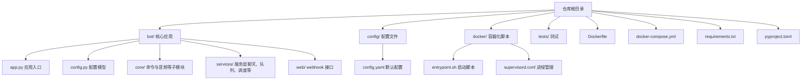
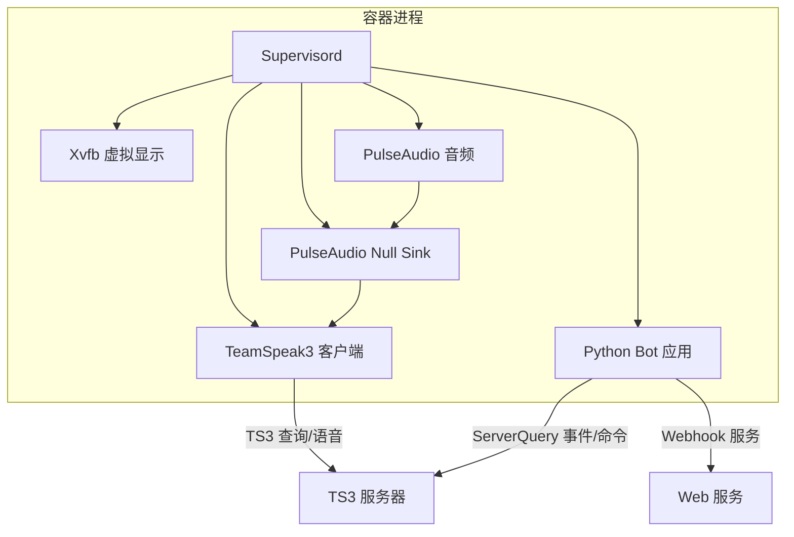
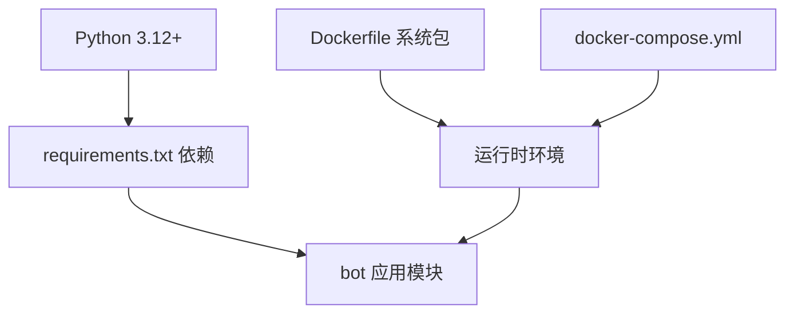

# 快速开始

<cite>
**本文引用的文件**
- [Dockerfile](file://Dockerfile)
- [docker-compose.yml](file://docker-compose.yml)
- [requirements.txt](file://requirements.txt)
- [pyproject.toml](file://pyproject.toml)
- [config/config.yaml](file://config/config.yaml)
- [bot/config.py](file://bot/config.py)
- [bot/__main__.py](file://bot/__main__.py)
- [bot/app.py](file://bot/app.py)
- [docker/entrypoint.sh](file://docker/entrypoint.sh)
- [docker/supervisord.conf](file://docker/supervisord.conf)
- [bot/core/commands/handlers/music.py](file://bot/core/commands/handlers/music.py)
- [bot/core/commands/handlers/admin.py](file://bot/core/commands/handlers/admin.py)
- [bot/web/webhook.py](file://bot/web/webhook.py)
- [tests/conftest.py](file://tests/conftest.py)
</cite>

## 目录
1. [简介](#简介)
2. [项目结构](#项目结构)
3. [核心组件](#核心组件)
4. [架构总览](#架构总览)
5. [详细组件分析](#详细组件分析)
6. [依赖分析](#依赖分析)
7. [性能考虑](#性能考虑)
8. [故障排除指南](#故障排除指南)
9. [结论](#结论)
10. [附录](#附录)

## 简介
本指南面向新手用户，帮助你在最短时间内完成 Teamspeak3_Bot 的安装与运行。内容涵盖环境要求、依赖安装、配置准备、Docker 部署与传统安装两种方式，并提供配置文件详解、常用命令示例以及常见问题排查建议。

## 项目结构
该项目采用模块化组织，核心逻辑集中在 bot/ 目录，容器化相关脚本位于 docker/，配置文件位于 config/，并通过 Dockerfile 和 docker-compose.yml 提供一键部署能力。

图表来源
- [Dockerfile:1-100](file://Dockerfile#L1-L100)
- [docker-compose.yml:1-33](file://docker-compose.yml#L1-L33)
- [bot/app.py:1-348](file://bot/app.py#L1-L348)
- [bot/config.py:1-160](file://bot/config.py#L1-L160)
- [config/config.yaml:1-76](file://config/config.yaml#L1-L76)
- [docker/entrypoint.sh:1-20](file://docker/entrypoint.sh#L1-L20)
- [docker/supervisord.conf:1-53](file://docker/supervisord.conf#L1-L53)

章节来源
- [Dockerfile:1-100](file://Dockerfile#L1-L100)
- [docker-compose.yml:1-33](file://docker-compose.yml#L1-L33)
- [bot/app.py:1-348](file://bot/app.py#L1-L348)
- [bot/config.py:1-160](file://bot/config.py#L1-L160)
- [config/config.yaml:1-76](file://config/config.yaml#L1-L76)
- [docker/entrypoint.sh:1-20](file://docker/entrypoint.sh#L1-L20)
- [docker/supervisord.conf:1-53](file://docker/supervisord.conf#L1-L53)

## 核心组件
- 应用入口：通过命令行入口加载配置并启动主应用。
- 配置系统：支持 YAML 配置与环境变量插值，定义 TS3、音频、网络云音乐、聊天、自动化、调度、Webhook、日志等模块。
- 主应用编排：负责连接 TS3 ServerQuery、注册命令、启动后台服务（调度器、Webhook）、处理事件与播放控制。
- 命令系统：内置音乐、音量、聊天、调试、管理员等命令处理器。
- Webhook：提供外部通知与状态查询接口（可选）。

章节来源
- [bot/__main__.py:1-17](file://bot/__main__.py#L1-L17)
- [bot/config.py:125-160](file://bot/config.py#L125-L160)
- [bot/app.py:27-111](file://bot/app.py#L27-L111)
- [bot/core/commands/handlers/music.py:17-243](file://bot/core/commands/handlers/music.py#L17-L243)
- [bot/core/commands/handlers/admin.py:17-75](file://bot/core/commands/handlers/admin.py#L17-L75)
- [bot/web/webhook.py:32-76](file://bot/web/webhook.py#L32-L76)

## 架构总览
下图展示了容器内进程与应用启动流程：Supervisord 管理虚拟显示、PulseAudio、TS3 客户端与 Python Bot；Bot 通过 ServerQuery 与 TS3 交互，同时提供 Webhook 服务（可选）。

图表来源
- [docker/supervisord.conf:1-53](file://docker/supervisord.conf#L1-L53)
- [docker/entrypoint.sh:1-20](file://docker/entrypoint.sh#L1-L20)
- [bot/app.py:283-301](file://bot/app.py#L283-L301)
- [bot/web/webhook.py:32-76](file://bot/web/webhook.py#L32-L76)

## 详细组件分析

### 安装与运行方式

- 方式一：Docker 一键部署（推荐）
  - 使用 docker-compose.yml 指定镜像构建、挂载卷、环境变量与端口映射。
  - 容器启动后由 entrypoint.sh 初始化 TS3 客户端身份并启动 supervisord。
  - supervisord 依次启动 Xvfb、PulseAudio、PulseAudio Null Sink、TS3 客户端与 Python Bot。
  - 参考路径：
    - [docker-compose.yml:1-33](file://docker-compose.yml#L1-L33)
    - [Dockerfile:1-100](file://Dockerfile#L1-L100)
    - [docker/entrypoint.sh:1-20](file://docker/entrypoint.sh#L1-L20)
    - [docker/supervisord.conf:1-53](file://docker/supervisord.conf#L1-L53)

- 方式二：传统安装（本地 Python 环境）
  - 环境要求：Python 版本需满足项目最低要求。
  - 依赖安装：使用 requirements.txt 或 pyproject.toml 中的依赖声明。
  - 运行入口：通过命令行运行包入口，加载配置并启动应用。
  - 参考路径：
    - [requirements.txt:1-10](file://requirements.txt#L1-L10)
    - [pyproject.toml:1-35](file://pyproject.toml#L1-L35)
    - [bot/__main__.py:1-17](file://bot/__main__.py#L1-L17)

章节来源
- [docker-compose.yml:1-33](file://docker-compose.yml#L1-L33)
- [Dockerfile:1-100](file://Dockerfile#L1-L100)
- [docker/entrypoint.sh:1-20](file://docker/entrypoint.sh#L1-L20)
- [docker/supervisord.conf:1-53](file://docker/supervisord.conf#L1-L53)
- [requirements.txt:1-10](file://requirements.txt#L1-L10)
- [pyproject.toml:1-35](file://pyproject.toml#L1-L35)
- [bot/__main__.py:1-17](file://bot/__main__.py#L1-L17)

### 配置文件详解与关键参数

- 配置加载机制
  - 支持从默认路径加载 YAML 配置，并对 ${ENV_VAR} 形式的环境变量进行插值替换。
  - 参考路径：
    - [bot/config.py:136-160](file://bot/config.py#L136-L160)
    - [config/config.yaml:1-76](file://config/config.yaml#L1-L76)

- 关键模块与参数说明
  - TS3 服务器
    - 主机地址、查询端口、语音端口、用户名、密码、虚拟服务器 ID、昵称、默认频道、命令前缀。
    - 参考路径：
      - [config/config.yaml:2-11](file://config/config.yaml#L2-L11)
      - [bot/config.py:36-46](file://bot/config.py#L36-L46)

  - 音频管道
    - PulseAudio Sink 名称、默认音量、淡入淡出时长、FFmpeg 路径、缓存目录与最大大小。
    - 参考路径：
      - [config/config.yaml:14-21](file://config/config.yaml#L14-L21)
      - [bot/config.py:48-55](file://bot/config.py#L48-L55)

  - 网易云音乐（yt-dlp）
    - 搜索上限、音频质量等级。
    - 参考路径：
      - [config/config.yaml:23-26](file://config/config.yaml#L23-L26)
      - [bot/config.py:57-61](file://bot/config.py#L57-L61)

  - AI 聊天
    - API 基础地址、密钥、模型、温度、最大 Token、上下文窗口、默认人设、按频道维护上下文。
    - 参考路径：
      - [config/config.yaml:28-37](file://config/config.yaml#L28-L37)
      - [bot/config.py:63-72](file://bot/config.py#L63-L72)

  - 自动化
    - 欢迎消息（启用、消息模板、延迟、发送模式）、自动分组、跟随模式（启用、频道列表、空频道离开、防抖）。
    - 参考路径：
      - [config/config.yaml:39-52](file://config/config.yaml#L39-L52)
      - [bot/config.py:74-91](file://bot/config.py#L74-L91)

  - 调度提醒
    - 提醒任务列表（名称、Cron 表达式、消息、频道 ID）。
    - 参考路径：
      - [config/config.yaml:55-61](file://config/config.yaml#L55-L61)
      - [bot/config.py:99-108](file://bot/config.py#L99-L108)

  - Webhook
    - 启用开关、监听主机、端口、密钥。
    - 参考路径：
      - [config/config.yaml:63-68](file://config/config.yaml#L63-L68)
      - [bot/config.py:110-115](file://bot/config.py#L110-L115)

  - 日志
    - 日志级别、格式、文件路径、单文件最大字节、备份数量。
    - 参考路径：
      - [config/config.yaml:70-76](file://config/config.yaml#L70-L76)
      - [bot/config.py:117-123](file://bot/config.py#L117-L123)

- 环境变量注入
  - 配置中以 ${ENV_VAR} 形式出现的变量会在运行时被环境变量替换，便于在不同环境间切换。
  - 参考路径：
    - [bot/config.py:12-30](file://bot/config.py#L12-L30)

章节来源
- [bot/config.py:12-30](file://bot/config.py#L12-L30)
- [bot/config.py:36-46](file://bot/config.py#L36-L46)
- [bot/config.py:48-55](file://bot/config.py#L48-L55)
- [bot/config.py:57-61](file://bot/config.py#L57-L61)
- [bot/config.py:63-72](file://bot/config.py#L63-L72)
- [bot/config.py:74-91](file://bot/config.py#L74-L91)
- [bot/config.py:99-108](file://bot/config.py#L99-L108)
- [bot/config.py:110-115](file://bot/config.py#L110-L115)
- [bot/config.py:117-123](file://bot/config.py#L117-L123)
- [config/config.yaml:1-76](file://config/config.yaml#L1-L76)

### 基本使用与常见命令

- 命令前缀
  - 默认为 “!”，可在配置中修改。
  - 参考路径：
    - [config/config.yaml](file://config/config.yaml#L11)
    - [bot/config.py](file://bot/config.py#L45)

- 音乐相关命令
  - 播放/点歌、暂停、继续、停止、跳过、队列、正在播放、歌词、清空、随机、重复、移除。
  - 参考路径：
    - [bot/core/commands/handlers/music.py:17-243](file://bot/core/commands/handlers/music.py#L17-L243)

- 管理员命令
  - 跟随模式开关、定时提醒、帮助、欢迎消息设置。
  - 参考路径：
    - [bot/core/commands/handlers/admin.py:17-75](file://bot/core/commands/handlers/admin.py#L17-L75)

- Webhook 使用（可选）
  - 发送消息至频道、查询状态、健康检查。
  - 参考路径：
    - [bot/web/webhook.py:32-76](file://bot/web/webhook.py#L32-L76)

章节来源
- [config/config.yaml](file://config/config.yaml#L11)
- [bot/config.py](file://bot/config.py#L45)
- [bot/core/commands/handlers/music.py:17-243](file://bot/core/commands/handlers/music.py#L17-L243)
- [bot/core/commands/handlers/admin.py:17-75](file://bot/core/commands/handlers/admin.py#L17-L75)
- [bot/web/webhook.py:32-76](file://bot/web/webhook.py#L32-L76)

## 依赖分析
- Python 版本与依赖
  - 最低 Python 版本要求与核心依赖（如 Pydantic、Pydantic Settings、PyYAML、HTTPX、OpenAI、APScheduler、FastAPI、Uvicorn、yt-dlp）均在配置文件中声明。
- 容器内系统依赖
  - 包含虚拟显示（Xvfb）、音频（PulseAudio、FFmpeg）、TS3 客户端依赖、进程管理（Supervisor）等。
- 运行时目录与权限
  - 容器内创建 /data/cache、/data/logs、/home/ts3bot/.ts3client 等目录并分配权限。

图表来源
- [requirements.txt:1-10](file://requirements.txt#L1-L10)
- [pyproject.toml:1-35](file://pyproject.toml#L1-L35)
- [Dockerfile:1-100](file://Dockerfile#L1-L100)
- [docker-compose.yml:1-33](file://docker-compose.yml#L1-L33)

章节来源
- [requirements.txt:1-10](file://requirements.txt#L1-L10)
- [pyproject.toml:1-35](file://pyproject.toml#L1-L35)
- [Dockerfile:1-100](file://Dockerfile#L1-L100)
- [docker-compose.yml:1-33](file://docker-compose.yml#L1-L33)

## 性能考虑
- 音频缓存与磁盘空间：合理设置缓存目录与最大大小，避免占用过多磁盘。
- 队列与重试：播放失败会自动尝试下一首，建议保持队列长度适中。
- Webhook 并发：外部触发频率过高时注意服务端资源占用。
- 日志轮转：启用文件日志并配置合理的大小与备份数量，防止日志过大影响性能。

## 故障排除指南
- 容器启动后无声音
  - 检查 PulseAudio 与 Null Sink 是否初始化成功，确认 supervisord 配置与日志。
  - 参考路径：
    - [docker/supervisord.conf:15-31](file://docker/supervisord.conf#L15-L31)
    - [docker/entrypoint.sh:12-15](file://docker/entrypoint.sh#L12-L15)

- TS3 客户端无法连接
  - 确认 TS3 主机、端口、凭据与虚拟服务器 ID 设置正确。
  - 参考路径：
    - [config/config.yaml:2-11](file://config/config.yaml#L2-L11)
    - [bot/config.py:36-46](file://bot/config.py#L36-L46)

- Webhook 无法访问
  - 检查 Webhook 开关、主机、端口与密钥配置，确认防火墙与端口映射。
  - 参考路径：
    - [config/config.yaml:63-68](file://config/config.yaml#L63-L68)
    - [bot/web/webhook.py:32-76](file://bot/web/webhook.py#L32-L76)

- 命令不生效
  - 确认命令前缀、管理员权限与事件订阅是否正常。
  - 参考路径：
    - [config/config.yaml](file://config/config.yaml#L11)
    - [bot/app.py:140-161](file://bot/app.py#L140-L161)

章节来源
- [docker/supervisord.conf:15-31](file://docker/supervisord.conf#L15-L31)
- [docker/entrypoint.sh:12-15](file://docker/entrypoint.sh#L12-L15)
- [config/config.yaml:2-11](file://config/config.yaml#L2-L11)
- [bot/config.py:36-46](file://bot/config.py#L36-L46)
- [config/config.yaml:63-68](file://config/config.yaml#L63-L68)
- [bot/web/webhook.py:32-76](file://bot/web/webhook.py#L32-L76)
- [config/config.yaml](file://config/config.yaml#L11)
- [bot/app.py:140-161](file://bot/app.py#L140-L161)

## 结论
通过本指南，你可以快速完成 Teamspeak3_Bot 的安装与运行。建议优先使用 Docker 一键部署，随后根据实际需求调整配置文件中的关键参数，并结合命令与 Webhook 实现基础功能。遇到问题时，可依据“故障排除指南”逐步定位与解决。

## 附录

### A. Docker 部署步骤（摘要）
- 准备 .env 文件（包含 TS3_HOST、TS3_PASSWORD、OPENAI_API_KEY 等必要环境变量）。
- 执行构建与启动：
  - docker-compose build
  - docker-compose up -d
- 访问 Webhook（如启用）与 TS3 频道查看效果。
- 参考路径：
  - [docker-compose.yml:8-22](file://docker-compose.yml#L8-L22)
  - [Dockerfile:74-81](file://Dockerfile#L74-L81)

章节来源
- [docker-compose.yml:8-22](file://docker-compose.yml#L8-L22)
- [Dockerfile:74-81](file://Dockerfile#L74-L81)

### B. 传统安装步骤（摘要）
- 环境要求：Python 版本满足项目要求。
- 安装依赖：pip 安装 requirements.txt 或使用 pyproject.toml。
- 运行应用：python -m bot。
- 参考路径：
  - [requirements.txt:1-10](file://requirements.txt#L1-L10)
  - [pyproject.toml:5-16](file://pyproject.toml#L5-L16)
  - [bot/__main__.py:9-12](file://bot/__main__.py#L9-L12)

章节来源
- [requirements.txt:1-10](file://requirements.txt#L1-L10)
- [pyproject.toml:5-16](file://pyproject.toml#L5-L16)
- [bot/__main__.py:9-12](file://bot/__main__.py#L9-L12)

### C. 常用命令清单（摘要）
- 音乐类：!play、!skip、!pause、!resume、!stop、!queue、!np、!lyrics、!clear、!shuffle、!repeat、!remove。
- 管理类：!follow、!remind、!help、!welcome。
- 参考路径：
  - [bot/core/commands/handlers/music.py:17-243](file://bot/core/commands/handlers/music.py#L17-L243)
  - [bot/core/commands/handlers/admin.py:17-75](file://bot/core/commands/handlers/admin.py#L17-L75)

章节来源
- [bot/core/commands/handlers/music.py:17-243](file://bot/core/commands/handlers/music.py#L17-L243)
- [bot/core/commands/handlers/admin.py:17-75](file://bot/core/commands/handlers/admin.py#L17-L75)