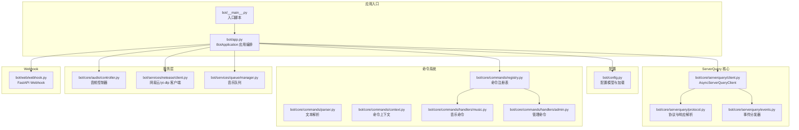
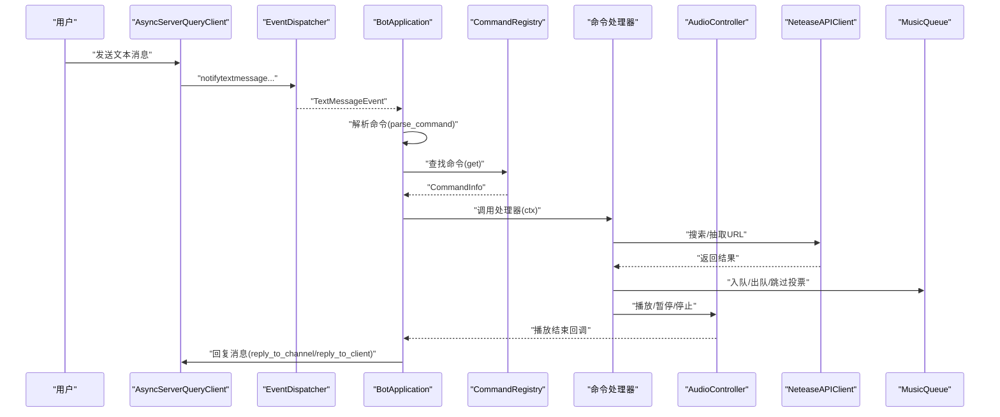
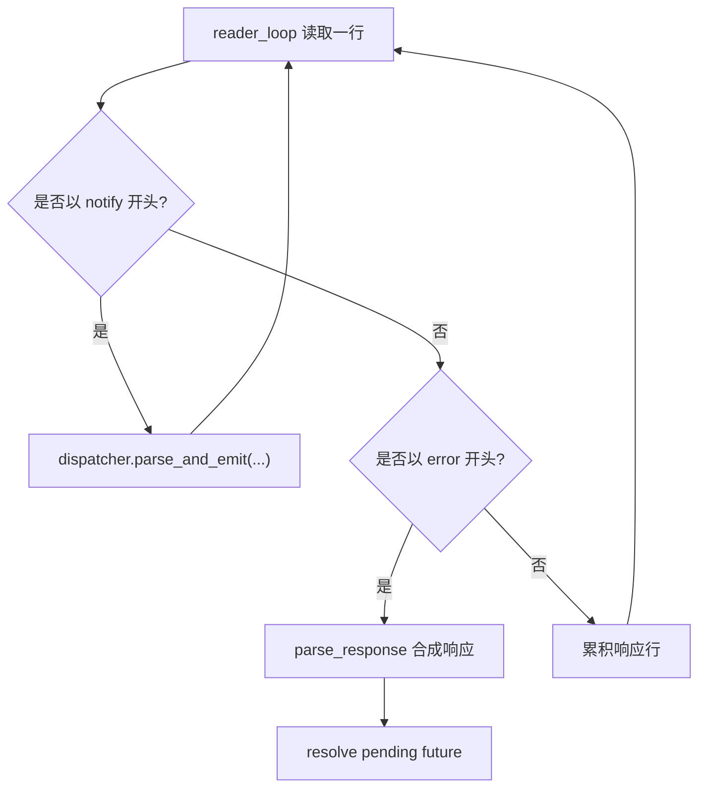
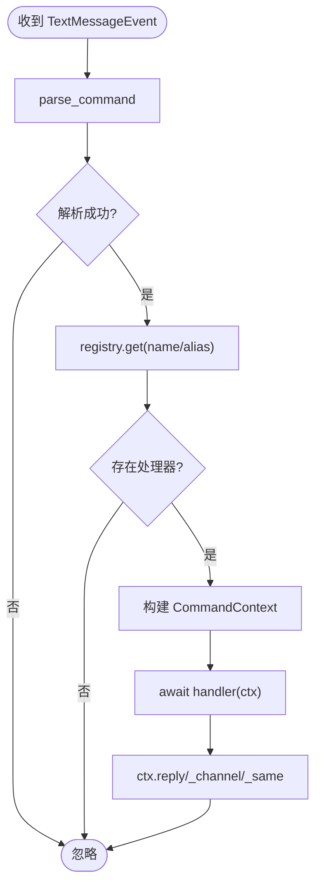
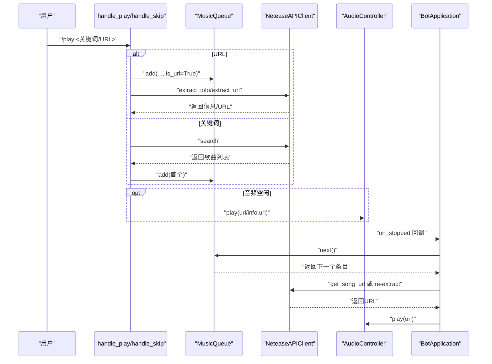
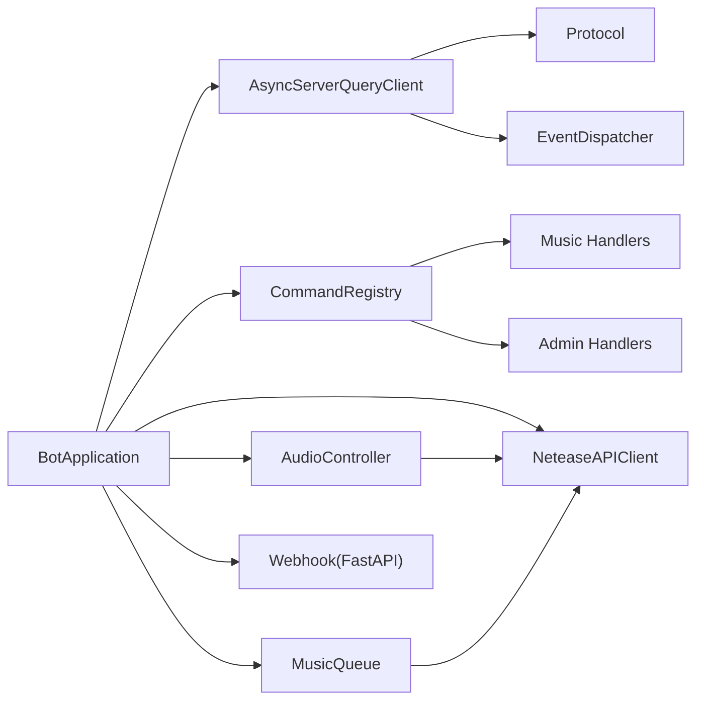

# 数据流与控制流

<cite>
**本文引用的文件**
- [bot/__main__.py](file://bot/__main__.py)
- [bot/app.py](file://bot/app.py)
- [bot/config.py](file://bot/config.py)
- [bot/core/serverquery/client.py](file://bot/core/serverquery/client.py)
- [bot/core/serverquery/protocol.py](file://bot/core/serverquery/protocol.py)
- [bot/core/serverquery/events.py](file://bot/core/serverquery/events.py)
- [bot/core/commands/parser.py](file://bot/core/commands/parser.py)
- [bot/core/commands/context.py](file://bot/core/commands/context.py)
- [bot/core/commands/registry.py](file://bot/core/commands/registry.py)
- [bot/core/commands/handlers/music.py](file://bot/core/commands/handlers/music.py)
- [bot/core/commands/handlers/admin.py](file://bot/core/commands/handlers/admin.py)
- [bot/core/audio/controller.py](file://bot/core/audio/controller.py)
- [bot/services/netease/client.py](file://bot/services/netease/client.py)
- [bot/services/queue/manager.py](file://bot/services/queue/manager.py)
- [bot/web/webhook.py](file://bot/web/webhook.py)
</cite>

## 目录
1. [引言](#引言)
2. [项目结构](#项目结构)
3. [核心组件](#核心组件)
4. [架构总览](#架构总览)
5. [详细组件分析](#详细组件分析)
6. [依赖分析](#依赖分析)
7. [性能考量](#性能考量)
8. [故障排查指南](#故障排查指南)
9. [结论](#结论)
10. [附录](#附录)

## 引言
本文件面向 Teamspeak3_Bot 的数据流与控制流进行系统化分析，围绕“从用户输入到系统响应”的完整处理链路展开，覆盖以下主题：
- ServerQuery 文本消息接收、命令解析、权限验证、执行处理与响应发送的全过程
- 异步数据流与 asyncio 事件循环的协调机制
- 控制流的分支逻辑（命令路由、错误处理与异常恢复）
- 数据流图与控制流图，展示系统的动态行为与状态转换
- 性能瓶颈识别与优化策略

## 项目结构
该项目采用模块化分层设计：应用入口负责启动与生命周期管理；核心模块包含 ServerQuery 客户端、协议与事件分发；命令系统由解析器、上下文与注册表组成；服务层包含音频控制器、网易云/YouTube 抽取、队列管理与自动化服务；Webhook 提供外部通知能力。

图表来源
- [bot/__main__.py:1-17](file://bot/__main__.py#L1-L17)
- [bot/app.py:1-348](file://bot/app.py#L1-L348)
- [bot/config.py:1-160](file://bot/config.py#L1-L160)
- [bot/core/serverquery/client.py:1-406](file://bot/core/serverquery/client.py#L1-L406)
- [bot/core/serverquery/protocol.py:1-160](file://bot/core/serverquery/protocol.py#L1-L160)
- [bot/core/serverquery/events.py:1-156](file://bot/core/serverquery/events.py#L1-L156)
- [bot/core/commands/parser.py:1-67](file://bot/core/commands/parser.py#L1-L67)
- [bot/core/commands/context.py:1-70](file://bot/core/commands/context.py#L1-L70)
- [bot/core/commands/registry.py:1-94](file://bot/core/commands/registry.py#L1-L94)
- [bot/core/commands/handlers/music.py:1-243](file://bot/core/commands/handlers/music.py#L1-L243)
- [bot/core/commands/handlers/admin.py:1-75](file://bot/core/commands/handlers/admin.py#L1-L75)
- [bot/core/audio/controller.py:1-143](file://bot/core/audio/controller.py#L1-L143)
- [bot/services/netease/client.py:1-161](file://bot/services/netease/client.py#L1-L161)
- [bot/services/queue/manager.py:1-204](file://bot/services/queue/manager.py#L1-L204)
- [bot/web/webhook.py:1-76](file://bot/web/webhook.py#L1-L76)

章节来源
- [bot/__main__.py:1-17](file://bot/__main__.py#L1-L17)
- [bot/app.py:1-348](file://bot/app.py#L1-L348)
- [bot/config.py:1-160](file://bot/config.py#L1-L160)

## 核心组件
- 应用编排器 BotApplication：负责装配各子系统、建立 ServerQuery 连接、注册命令与事件监听、启动后台服务（调度器、Webhook）、优雅停机。
- ServerQuery 客户端 AsyncServerQueryClient：维护持久连接、命令队列、读写与保活任务、自动重连与事件分发。
- 命令系统：解析文本为命令对象，通过注册表查找处理器，构造命令上下文并执行，支持别名与管理员权限标记。
- 音频控制器 AudioController：封装 FFmpeg 播放生命周期、音量控制与回调事件。
- 网易云/yt-dlp 客户端 NeteaseAPIClient：提供搜索、URL 抽取、歌词获取等能力，避免缓存播放 URL（因 CDN 链接易过期）。
- 音乐队列 MusicQueue：FIFO 队列、跳过投票、重复模式、历史记录与格式化输出。
- Webhook：对外提供受密钥保护的 HTTP 接口，用于远程推送消息与状态查询。

章节来源
- [bot/app.py:27-348](file://bot/app.py#L27-L348)
- [bot/core/serverquery/client.py:27-406](file://bot/core/serverquery/client.py#L27-L406)
- [bot/core/commands/parser.py:22-67](file://bot/core/commands/parser.py#L22-L67)
- [bot/core/commands/context.py:13-70](file://bot/core/commands/context.py#L13-L70)
- [bot/core/commands/registry.py:28-94](file://bot/core/commands/registry.py#L28-L94)
- [bot/core/audio/controller.py:24-143](file://bot/core/audio/controller.py#L24-L143)
- [bot/services/netease/client.py:25-161](file://bot/services/netease/client.py#L25-L161)
- [bot/services/queue/manager.py:35-204](file://bot/services/queue/manager.py#L35-L204)
- [bot/web/webhook.py:32-76](file://bot/web/webhook.py#L32-L76)

## 架构总览
系统以 asyncio 事件循环为核心，BotApplication 在启动阶段完成组件装配与连接建立，随后进入事件驱动的运行态。ServerQuery 通过事件分发器将文本消息转化为事件，交由命令路由处理；命令处理器通过上下文向 ServerQuery 发送回复；音频控制器与队列协同实现播放与跳过逻辑；Webhook 作为外部集成入口。

图表来源
- [bot/core/serverquery/events.py:139-156](file://bot/core/serverquery/events.py#L139-L156)
- [bot/app.py:162-198](file://bot/app.py#L162-L198)
- [bot/core/commands/parser.py:22-67](file://bot/core/commands/parser.py#L22-L67)
- [bot/core/commands/registry.py:68-78](file://bot/core/commands/registry.py#L68-L78)
- [bot/core/commands/context.py:52-70](file://bot/core/commands/context.py#L52-L70)
- [bot/core/audio/controller.py:70-88](file://bot/core/audio/controller.py#L70-L88)
- [bot/services/netease/client.py:40-96](file://bot/services/netease/client.py#L40-L96)
- [bot/services/queue/manager.py:90-119](file://bot/services/queue/manager.py#L90-L119)

## 详细组件分析

### ServerQuery 文本消息接收与事件分发
- 读取循环按行解析，区分 notify 事件与响应数据，遇到 error 行后合并解析为 SQResponse，并通过 Future 返回给发送方。
- 事件分发器将 notify 行解析为 SQEvent 并并发调用订阅者，日志记录事件类型与数据。
- 文本消息事件被路由到 BotApplication 的 _on_text_message，忽略来自自身的消息，解析命令并执行。

图表来源
- [bot/core/serverquery/client.py:201-254](file://bot/core/serverquery/client.py#L201-L254)
- [bot/core/serverquery/events.py:139-156](file://bot/core/serverquery/events.py#L139-L156)
- [bot/core/serverquery/protocol.py:95-135](file://bot/core/serverquery/protocol.py#L95-L135)

章节来源
- [bot/core/serverquery/client.py:201-254](file://bot/core/serverquery/client.py#L201-L254)
- [bot/core/serverquery/events.py:102-156](file://bot/core/serverquery/events.py#L102-L156)
- [bot/core/serverquery/protocol.py:63-135](file://bot/core/serverquery/protocol.py#L63-L135)

### 命令解析与路由
- 文本解析器使用安全分词策略，支持带引号参数，若解析失败则回退为简单分割。
- BotApplication 将解析后的命令交由注册表查找处理器，构造命令上下文后异步执行。
- 处理器内部可访问调用者元数据（clid/uid/name/target_mode），并通过上下文回复消息。

图表来源
- [bot/app.py:162-198](file://bot/app.py#L162-L198)
- [bot/core/commands/parser.py:22-67](file://bot/core/commands/parser.py#L22-L67)
- [bot/core/commands/registry.py:68-78](file://bot/core/commands/registry.py#L68-L78)
- [bot/core/commands/context.py:20-70](file://bot/core/commands/context.py#L20-L70)

章节来源
- [bot/app.py:162-198](file://bot/app.py#L162-L198)
- [bot/core/commands/parser.py:22-67](file://bot/core/commands/parser.py#L22-L67)
- [bot/core/commands/context.py:20-70](file://bot/core/commands/context.py#L20-L70)
- [bot/core/commands/registry.py:28-94](file://bot/core/commands/registry.py#L28-L94)

### 音乐命令处理与播放流程
- play 命令支持 URL 与关键词两种路径：URL 路径直接入队并存储原始 URL 以便后续重新抽取；关键词路径先搜索再入队。
- 当音频处于空闲状态时立即播放；否则排队等待。
- 音频播放结束触发回调，自动取出下一个条目；若为 URL 则重新抽取，否则通过网易云接口获取新 URL。
- skip 命令基于频道人数计算阈值进行投票跳过；pause/resume/stop 控制播放状态；queue/np 展示队列与当前播放信息；lyrics 获取歌词。

图表来源
- [bot/core/commands/handlers/music.py:20-93](file://bot/core/commands/handlers/music.py#L20-L93)
- [bot/core/commands/handlers/music.py:94-201](file://bot/core/commands/handlers/music.py#L94-L201)
- [bot/app.py:199-246](file://bot/app.py#L199-L246)
- [bot/services/netease/client.py:68-96](file://bot/services/netease/client.py#L68-L96)
- [bot/services/queue/manager.py:90-119](file://bot/services/queue/manager.py#L90-L119)
- [bot/core/audio/controller.py:70-88](file://bot/core/audio/controller.py#L70-L88)

章节来源
- [bot/core/commands/handlers/music.py:20-243](file://bot/core/commands/handlers/music.py#L20-L243)
- [bot/app.py:199-246](file://bot/app.py#L199-L246)
- [bot/services/netease/client.py:68-96](file://bot/services/netease/client.py#L68-L96)
- [bot/services/queue/manager.py:35-204](file://bot/services/queue/manager.py#L35-L204)
- [bot/core/audio/controller.py:24-143](file://bot/core/audio/controller.py#L24-L143)

### 管理命令与帮助
- follow：切换跟随模式开关并即时同步状态。
- remind：基于 asyncio 延时任务实现一次性提醒。
- help：输出所有命令的帮助信息（含别名与管理员标记）。
- welcome：更新欢迎消息模板。

章节来源
- [bot/core/commands/handlers/admin.py:17-75](file://bot/core/commands/handlers/admin.py#L17-L75)
- [bot/core/commands/registry.py:84-94](file://bot/core/commands/registry.py#L84-L94)

### Webhook 与外部集成
- 受密钥保护的 /webhook 接收外部消息并转发至当前频道。
- /status 返回连接状态、当前歌曲、队列长度与运行时长。
- /health 健康检查。

章节来源
- [bot/web/webhook.py:32-76](file://bot/web/webhook.py#L32-L76)

## 依赖分析
- 组件耦合与内聚
  - BotApplication 对各子系统进行高内聚编排，低耦合依赖（通过接口与回调）。
  - 命令系统与 ServerQuery 解耦：命令处理器仅通过上下文与客户端交互。
  - 音频控制器与播放队列通过回调解耦，便于状态迁移与错误恢复。
- 直接与间接依赖
  - AsyncServerQueryClient 依赖协议与事件分发器；对外暴露统一的发送与回复接口。
  - NeteaseAPIClient 依赖 yt-dlp 服务与缓存；不缓存播放 URL，降低过期风险。
  - Webhook 依赖 FastAPI 与 BotApplication 上下文。
- 循环依赖
  - 未发现循环导入；模块间通过函数与类边界清晰。

图表来源
- [bot/app.py:39-111](file://bot/app.py#L39-L111)
- [bot/core/serverquery/client.py:27-70](file://bot/core/serverquery/client.py#L27-L70)
- [bot/core/serverquery/protocol.py:1-160](file://bot/core/serverquery/protocol.py#L1-L160)
- [bot/core/serverquery/events.py:102-156](file://bot/core/serverquery/events.py#L102-L156)
- [bot/core/commands/registry.py:28-94](file://bot/core/commands/registry.py#L28-L94)
- [bot/core/commands/handlers/music.py:17-243](file://bot/core/commands/handlers/music.py#L17-L243)
- [bot/core/commands/handlers/admin.py:17-75](file://bot/core/commands/handlers/admin.py#L17-L75)
- [bot/core/audio/controller.py:24-143](file://bot/core/audio/controller.py#L24-L143)
- [bot/services/netease/client.py:25-161](file://bot/services/netease/client.py#L25-L161)
- [bot/services/queue/manager.py:35-204](file://bot/services/queue/manager.py#L35-L204)
- [bot/web/webhook.py:32-76](file://bot/web/webhook.py#L32-L76)

## 性能考量
- 异步 I/O 与并发
  - ServerQuery 读写与保活均在独立任务中运行，避免阻塞主事件循环。
  - 事件分发器对订阅者采用并发 gather，提升事件处理吞吐。
- 命令执行与网络请求
  - 命令处理器中的网络请求（搜索、URL 抽取、歌词）应尽量短路与超时控制，避免阻塞音频播放。
- 缓存策略
  - 搜索与歌词使用 TTL 缓存，减少重复请求；播放 URL 不缓存，确保稳定性。
- 音频播放与资源释放
  - 播放结束回调触发下一曲；错误回调降级为“尝试下一首”；优雅停机时进行淡出与资源回收。
- 队列与投票
  - 跳过投票按频道人数动态计算阈值，避免误判；重复模式减少不必要的网络请求。

[本节为通用性能建议，无需特定文件引用]

## 故障排查指南
- ServerQuery 连接问题
  - 检查登录凭据、虚拟服务器 ID 与昵称设置；确认端口可达；关注自动重连日志。
  - 若长时间无响应，保活任务会周期性发送 whoami，必要时查看超时与断线重连延迟。
- 命令执行异常
  - 命令处理器捕获异常并记录日志，同时尝试向调用者发送错误提示；检查命令是否存在、是否需要管理员权限。
- 音频播放失败
  - 播放结束回调与错误回调会触发“尝试下一首”；检查播放 URL 是否有效、网络是否稳定、yt-dlp 是否正常工作。
- Webhook 访问受限
  - 确认 Authorization 头与密钥一致；查看健康检查接口是否返回正常状态。

章节来源
- [bot/core/serverquery/client.py:87-110](file://bot/core/serverquery/client.py#L87-L110)
- [bot/app.py:190-198](file://bot/app.py#L190-L198)
- [bot/app.py:247-254](file://bot/app.py#L247-L254)
- [bot/web/webhook.py:35-49](file://bot/web/webhook.py#L35-L49)

## 结论
本系统以 asyncio 事件循环为核心，通过模块化设计实现了从 ServerQuery 文本消息到命令执行与响应的完整闭环。命令系统与服务层解耦良好，配合事件驱动与回调机制，具备良好的扩展性与可维护性。针对播放 URL 易过期的问题，系统采用“即时抽取”策略并辅以缓存，兼顾稳定性与性能。建议在生产环境中强化超时与重试策略、完善监控指标与告警，持续优化队列与播放状态的可观测性。

## 附录
- 配置项概览
  - TS3：主机、查询端口、语音端口、用户名/密码、虚拟服务器 ID、昵称、默认频道、命令前缀。
  - 音频：PulseSink 名称、默认音量、淡出时长、ffmpeg 路径、缓存目录与大小。
  - 网易云：API 基础地址、搜索上限、音质等级。
  - 聊天：API 基础地址、密钥、模型、温度、最大 token、上下文窗口、默认 persona、按频道上下文。
  - 自动化：欢迎消息、自动分组、跟随模式。
  - 调度：提醒任务列表。
  - Webhook：启用开关、监听地址与端口、密钥。
  - 日志：级别、格式、文件路径、轮转大小与备份数。

章节来源
- [bot/config.py:36-134](file://bot/config.py#L36-L134)