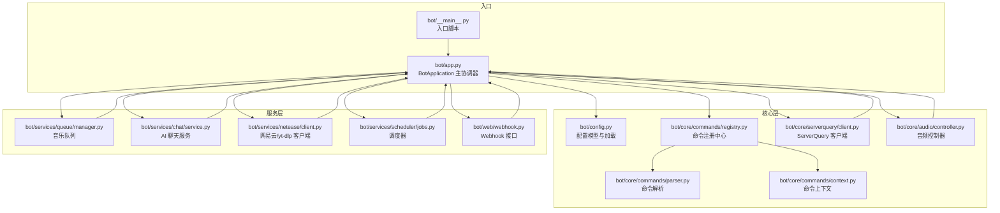
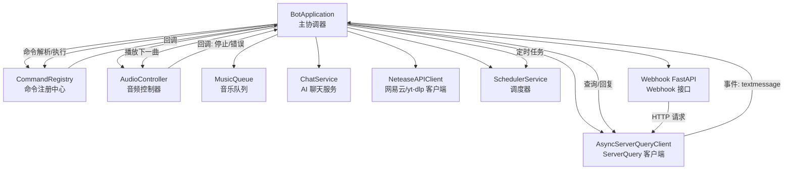
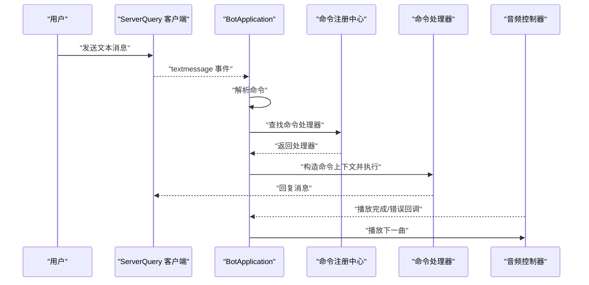
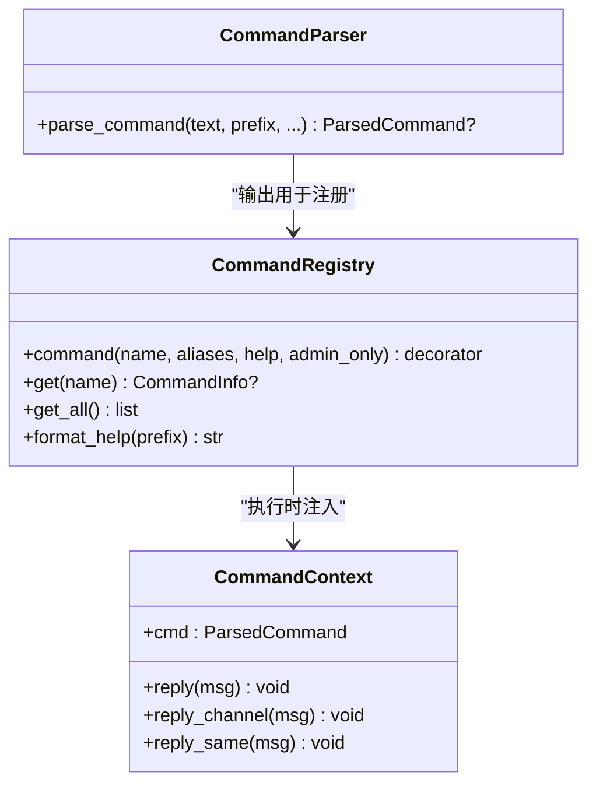
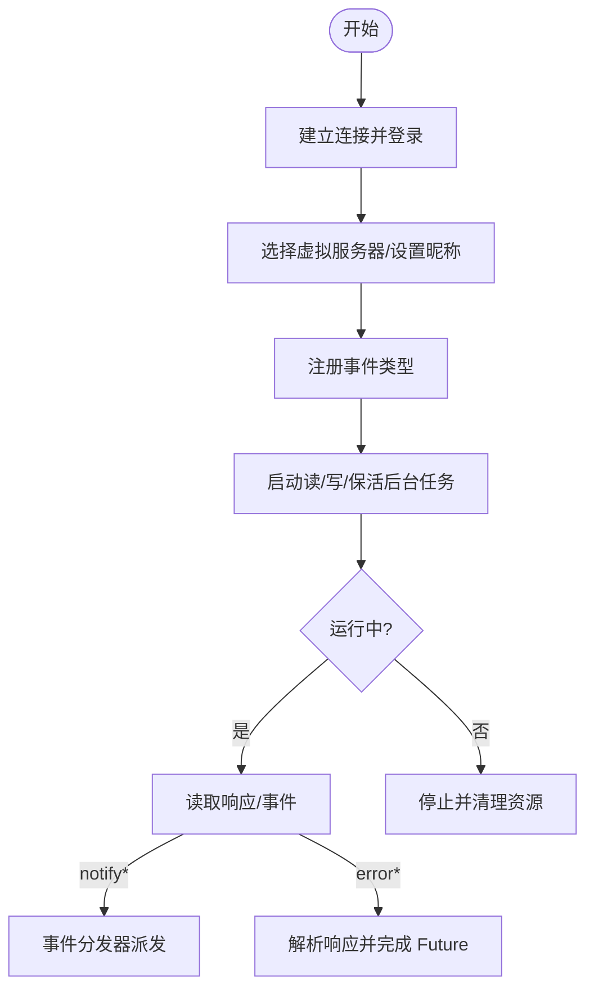
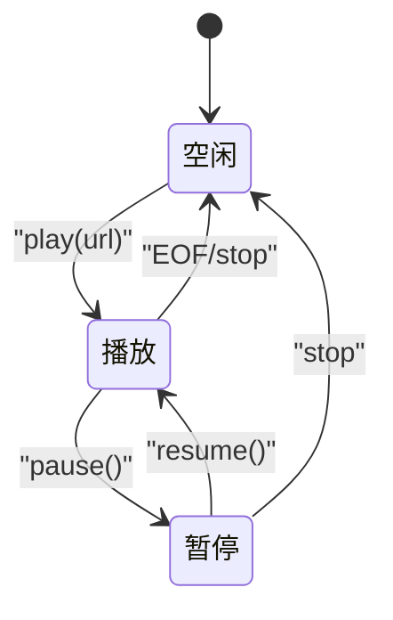
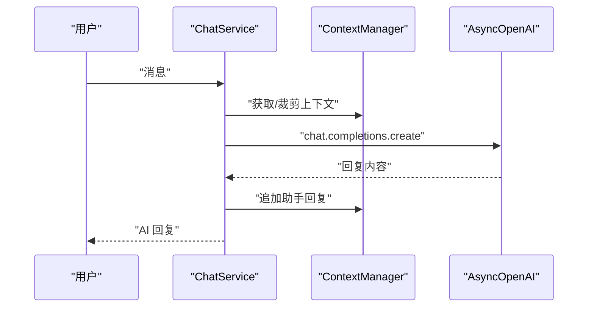
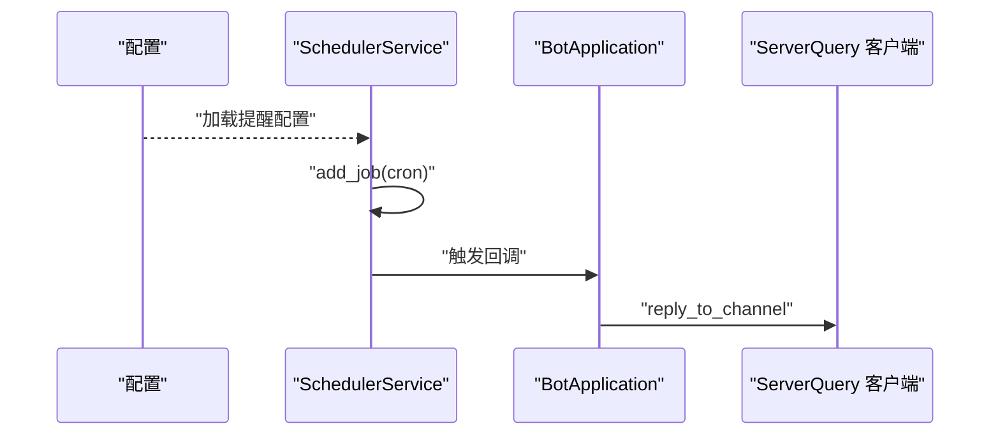
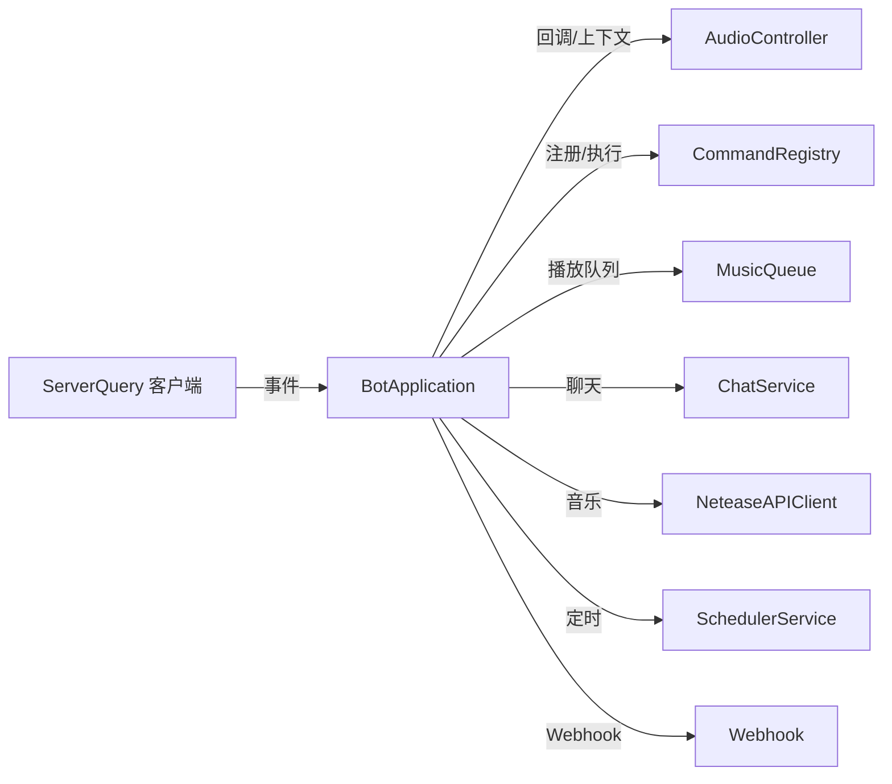

# 架构设计

<cite>
**本文引用的文件**
- [bot/app.py](file://bot/app.py)
- [bot/__main__.py](file://bot/__main__.py)
- [bot/config.py](file://bot/config.py)
- [bot/core/commands/parser.py](file://bot/core/commands/parser.py)
- [bot/core/commands/registry.py](file://bot/core/commands/registry.py)
- [bot/core/commands/context.py](file://bot/core/commands/context.py)
- [bot/core/commands/handlers/music.py](file://bot/core/commands/handlers/music.py)
- [bot/core/audio/controller.py](file://bot/core/audio/controller.py)
- [bot/services/queue/manager.py](file://bot/services/queue/manager.py)
- [bot/services/chat/service.py](file://bot/services/chat/service.py)
- [bot/core/serverquery/client.py](file://bot/core/serverquery/client.py)
- [bot/services/netease/client.py](file://bot/services/netease/client.py)
- [bot/services/scheduler/jobs.py](file://bot/services/scheduler/jobs.py)
- [bot/web/webhook.py](file://bot/web/webhook.py)
- [config/config.yaml](file://config/config.yaml)
</cite>

## 目录
1. [简介](#简介)
2. [项目结构](#项目结构)
3. [核心组件](#核心组件)
4. [架构总览](#架构总览)
5. [详细组件分析](#详细组件分析)
6. [依赖分析](#依赖分析)
7. [性能考虑](#性能考虑)
8. [故障排查指南](#故障排查指南)
9. [结论](#结论)
10. [附录](#附录)

## 简介
本项目是一个基于 Python 的 TeamSpeak3 机器人，围绕“主协调器 + 多服务模块 + 工具与基础设施”的分层与模块化架构构建。系统采用事件驱动与命令路由机制，通过 ServerQuery 实现与 TS3 服务器的双向通信；通过命令注册中心实现命令的解耦与扩展；通过音频控制器与播放队列实现音乐播放与自动播放；通过调度器、Webhook、自动化服务等模块实现后台任务与外部集成。

## 项目结构
项目采用按功能域划分的模块化组织方式：
- 核心层：命令解析、命令注册、命令上下文、ServerQuery 客户端、音频控制器
- 服务层：音乐队列、聊天服务（AI）、网易云客户端、调度器、自动化服务
- 基础设施：配置加载、日志、Webhook 接口
- 入口：应用入口脚本与主应用类

图表来源
- [bot/__main__.py:1-17](file://bot/__main__.py#L1-L17)
- [bot/app.py:1-348](file://bot/app.py#L1-L348)
- [bot/config.py:1-160](file://bot/config.py#L1-L160)
- [bot/core/commands/parser.py:1-67](file://bot/core/commands/parser.py#L1-L67)
- [bot/core/commands/registry.py:1-94](file://bot/core/commands/registry.py#L1-L94)
- [bot/core/commands/context.py:1-70](file://bot/core/commands/context.py#L1-L70)
- [bot/core/serverquery/client.py:1-406](file://bot/core/serverquery/client.py#L1-L406)
- [bot/core/audio/controller.py:1-143](file://bot/core/audio/controller.py#L1-L143)
- [bot/services/queue/manager.py:1-204](file://bot/services/queue/manager.py#L1-L204)
- [bot/services/chat/service.py:1-115](file://bot/services/chat/service.py#L1-L115)
- [bot/services/netease/client.py:1-161](file://bot/services/netease/client.py#L1-L161)
- [bot/services/scheduler/jobs.py:1-90](file://bot/services/scheduler/jobs.py#L1-L90)
- [bot/web/webhook.py:1-76](file://bot/web/webhook.py#L1-L76)

章节来源
- [bot/__main__.py:1-17](file://bot/__main__.py#L1-L17)
- [bot/app.py:27-111](file://bot/app.py#L27-L111)
- [bot/config.py:125-160](file://bot/config.py#L125-L160)

## 核心组件
- BotApplication：主协调器，负责装配所有子系统、建立连接、注册事件与命令、启动后台服务、统一生命周期管理。
- 命令系统：命令解析器、注册中心、命令上下文，形成“文本消息 → 解析 → 注册查找 → 上下文封装 → 执行”的清晰链路。
- ServerQuery 客户端：异步 Telnet 客户端，负责登录、事件订阅、命令队列、保活与自动重连。
- 音频与播放：音频控制器（状态机、音量、回调）、播放队列（FIFO、投票跳过、重复模式、历史记录）。
- 服务模块：AI 聊天服务（OpenAI 兼容接口、上下文管理、Persona）、网易云/yt-dlp 客户端（搜索、URL 提取、歌词）、调度器（APScheduler）、Webhook（FastAPI）。
- 配置：集中式 Pydantic 模型，支持环境变量插值与多位置默认配置。

章节来源
- [bot/app.py:27-111](file://bot/app.py#L27-L111)
- [bot/core/commands/parser.py:22-67](file://bot/core/commands/parser.py#L22-L67)
- [bot/core/commands/registry.py:28-94](file://bot/core/commands/registry.py#L28-L94)
- [bot/core/commands/context.py:13-70](file://bot/core/commands/context.py#L13-L70)
- [bot/core/serverquery/client.py:27-406](file://bot/core/serverquery/client.py#L27-L406)
- [bot/core/audio/controller.py:24-143](file://bot/core/audio/controller.py#L24-L143)
- [bot/services/queue/manager.py:35-204](file://bot/services/queue/manager.py#L35-L204)
- [bot/services/chat/service.py:15-115](file://bot/services/chat/service.py#L15-L115)
- [bot/services/netease/client.py:25-161](file://bot/services/netease/client.py#L25-L161)
- [bot/services/scheduler/jobs.py:18-90](file://bot/services/scheduler/jobs.py#L18-L90)
- [bot/web/webhook.py:32-76](file://bot/web/webhook.py#L32-L76)
- [bot/config.py:125-160](file://bot/config.py#L125-L160)

## 架构总览
系统采用“主协调器 + 事件驱动 + 命令模式 + 策略模式”的混合架构：
- 分层架构：入口层（__main__.py）→ 应用层（BotApplication）→ 核心层（命令/ServerQuery/音频）→ 服务层（队列/聊天/网易云/调度/Webhook）
- 模块化设计：各服务模块相对独立，通过 BotApplication 组装，彼此通过上下文与回调进行松耦合交互
- 事件驱动：ServerQuery 事件分发器将文本消息转换为事件，交由命令系统处理；音频控制器通过回调驱动自动播放
- 设计模式：
  - 命令模式：命令注册中心 + 命令处理器，便于扩展新命令
  - 策略模式：不同命令处理器对相同上下文进行不同行为，重复模式切换体现策略切换
  - 状态机：音频控制器的播放状态机
  - 回调/观察者：音频播放完成/错误回调、事件分发器订阅

图表来源
- [bot/app.py:140-161](file://bot/app.py#L140-L161)
- [bot/core/serverquery/client.py:151-164](file://bot/core/serverquery/client.py#L151-L164)
- [bot/core/audio/controller.py:61-69](file://bot/core/audio/controller.py#L61-L69)
- [bot/services/scheduler/jobs.py:25-42](file://bot/services/scheduler/jobs.py#L25-L42)
- [bot/web/webhook.py:39-69](file://bot/web/webhook.py#L39-L69)

## 详细组件分析

### BotApplication 主协调器
职责与生命周期：
- 加载配置、初始化各子系统实例
- 建立 ServerQuery 连接、注册命令与事件监听
- 启动调度器、Webhook 服务
- 提供优雅停机流程（停止 Webhook、调度器、淡出音频、断开连接）

关键交互：
- 文本消息路由：ServerQuery 事件 → 命令解析 → 注册查找 → 命令上下文 → 执行
- 音频自动播放：播放完成/错误回调 → 队列下一曲 → 获取 URL → 播放

图表来源
- [bot/app.py:162-198](file://bot/app.py#L162-L198)
- [bot/core/commands/parser.py:22-67](file://bot/core/commands/parser.py#L22-L67)
- [bot/core/commands/registry.py:68-78](file://bot/core/commands/registry.py#L68-L78)
- [bot/core/audio/controller.py:130-143](file://bot/core/audio/controller.py#L130-L143)

章节来源
- [bot/app.py:27-111](file://bot/app.py#L27-L111)
- [bot/app.py:283-348](file://bot/app.py#L283-L348)

### 命令系统（解析、注册、上下文）
- 命令解析：前缀识别、参数分割（shlex），生成解析对象
- 注册中心：装饰器注册、别名映射、帮助格式化
- 命令上下文：封装调用元数据与回复方法（私聊/频道/同场景）

图表来源
- [bot/core/commands/parser.py:22-67](file://bot/core/commands/parser.py#L22-L67)
- [bot/core/commands/registry.py:28-94](file://bot/core/commands/registry.py#L28-L94)
- [bot/core/commands/context.py:13-70](file://bot/core/commands/context.py#L13-L70)

章节来源
- [bot/core/commands/parser.py:1-67](file://bot/core/commands/parser.py#L1-L67)
- [bot/core/commands/registry.py:1-94](file://bot/core/commands/registry.py#L1-L94)
- [bot/core/commands/context.py:1-70](file://bot/core/commands/context.py#L1-L70)

### ServerQuery 客户端（事件驱动）
- 异步连接、登录、虚拟服务器选择、昵称更新、事件注册
- 命令队列保证串行执行，读写分离的后台任务
- 保活心跳、异常断线自动重连（指数退避）
- 事件分发器将 notify* 事件转为内部事件并派发

图表来源
- [bot/core/serverquery/client.py:81-170](file://bot/core/serverquery/client.py#L81-L170)
- [bot/core/serverquery/client.py:201-254](file://bot/core/serverquery/client.py#L201-L254)

章节来源
- [bot/core/serverquery/client.py:1-406](file://bot/core/serverquery/client.py#L1-L406)

### 音频控制器与播放队列
- 音频控制器：状态机（空闲/播放/暂停）、音量控制、回调通知
- 播放队列：FIFO、投票跳过、重复模式（关闭/单曲/列表）、历史记录、格式化展示

图表来源
- [bot/core/audio/controller.py:18-22](file://bot/core/audio/controller.py#L18-L22)
- [bot/core/audio/controller.py:130-143](file://bot/core/audio/controller.py#L130-L143)

章节来源
- [bot/core/audio/controller.py:1-143](file://bot/core/audio/controller.py#L1-L143)
- [bot/services/queue/manager.py:1-204](file://bot/services/queue/manager.py#L1-L204)

### AI 聊天服务与网易云客户端
- AI 聊天服务：OpenAI 兼容客户端、上下文管理（按频道/用户隔离）、Persona 切换、令牌感知裁剪
- 网易云客户端：使用 yt-dlp 进行搜索与 URL 提取，歌词缓存，不缓存过期的音频直链

图表来源
- [bot/services/chat/service.py:61-110](file://bot/services/chat/service.py#L61-L110)

章节来源
- [bot/services/chat/service.py:1-115](file://bot/services/chat/service.py#L1-L115)
- [bot/services/netease/client.py:1-161](file://bot/services/netease/client.py#L1-L161)

### 调度器与 Webhook
- 调度器：基于 APScheduler 的 Cron 任务，周期性向频道发送提醒
- Webhook：FastAPI 接口，校验密钥后向频道发送消息，并提供状态查询

图表来源
- [bot/services/scheduler/jobs.py:33-74](file://bot/services/scheduler/jobs.py#L33-L74)
- [bot/web/webhook.py:39-69](file://bot/web/webhook.py#L39-L69)

章节来源
- [bot/services/scheduler/jobs.py:1-90](file://bot/services/scheduler/jobs.py#L1-L90)
- [bot/web/webhook.py:1-76](file://bot/web/webhook.py#L1-L76)

## 依赖分析
- 组件内聚与耦合：
  - BotApplication 对各模块进行装配，但通过接口（回调、上下文）保持低耦合
  - 命令系统与 ServerQuery 解耦，通过事件与解析器桥接
  - 音频控制器与播放队列通过回调与应用层协作，避免直接依赖
- 外部依赖：
  - ServerQuery 协议栈（命令构建/解析、事件分发）
  - AsyncIO 与 APScheduler
  - FastAPI/uvicorn（可选 Webhook）
  - OpenAI 兼容 API（可选聊天）
  - yt-dlp（可选音乐提取）

图表来源
- [bot/app.py:140-161](file://bot/app.py#L140-L161)
- [bot/core/audio/controller.py:61-69](file://bot/core/audio/controller.py#L61-L69)
- [bot/core/commands/registry.py:68-78](file://bot/core/commands/registry.py#L68-L78)
- [bot/services/queue/manager.py:90-119](file://bot/services/queue/manager.py#L90-L119)
- [bot/services/chat/service.py:61-110](file://bot/services/chat/service.py#L61-L110)
- [bot/services/netease/client.py:77-95](file://bot/services/netease/client.py#L77-L95)
- [bot/services/scheduler/jobs.py:84-89](file://bot/services/scheduler/jobs.py#L84-L89)
- [bot/web/webhook.py:44-49](file://bot/web/webhook.py#L44-L49)

章节来源
- [bot/app.py:140-161](file://bot/app.py#L140-L161)

## 性能考虑
- I/O 密集与并发：
  - ServerQuery 使用异步读写与命令队列，避免阻塞
  - 音频播放与网络请求（yt-dlp/歌词）均采用异步，减少等待
- 缓存策略：
  - 搜索结果与歌词短期缓存，降低 API 压力
  - 音频直链不缓存，确保可用性
- 资源释放：
  - 优雅停机时先淡出再停止音频，再断开连接，避免资源泄漏
- 可扩展性：
  - 命令注册中心支持动态扩展命令
  - 事件与回调机制便于接入新服务

## 故障排查指南
- ServerQuery 连接问题：
  - 检查主机、端口、凭据与虚拟服务器 ID
  - 观察自动重连日志与指数退避
- 命令执行异常：
  - 查看命令执行日志与回退回复
  - 确认命令前缀与参数解析
- 音频播放失败：
  - 检查 FFmpeg 路径与 PulseSink 名称
  - 关注播放完成/错误回调后的自动播放链路
- Webhook 与调度器：
  - 校验密钥与端口
  - Cron 表达式格式与时区确认

章节来源
- [bot/core/serverquery/client.py:183-198](file://bot/core/serverquery/client.py#L183-L198)
- [bot/app.py:190-198](file://bot/app.py#L190-L198)
- [bot/core/audio/controller.py:130-143](file://bot/core/audio/controller.py#L130-L143)
- [bot/web/webhook.py:35-37](file://bot/web/webhook.py#L35-L37)
- [bot/services/scheduler/jobs.py:55-58](file://bot/services/scheduler/jobs.py#L55-L58)

## 结论
本项目以 BotApplication 为核心，结合命令模式、事件驱动与状态机，实现了模块化、可扩展且健壮的 TS3 机器人。通过清晰的职责划分与回调/上下文机制，系统在保证可维护性的同时具备良好的性能与可运维性。建议后续在以下方面持续优化：
- 增强错误恢复与可观测性（埋点与告警）
- 将关键配置与密钥进一步抽象为环境注入
- 扩展命令与服务的插件化加载机制

## 附录
- 配置文件示例路径与字段参考：[config/config.yaml:1-76](file://config/config.yaml#L1-L76)
- 入口脚本与应用类：[bot/__main__.py:1-17](file://bot/__main__.py#L1-L17)，[bot/app.py:1-348](file://bot/app.py#L1-L348)