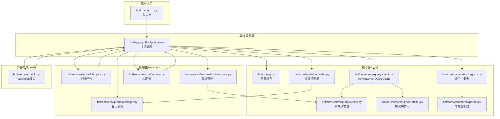
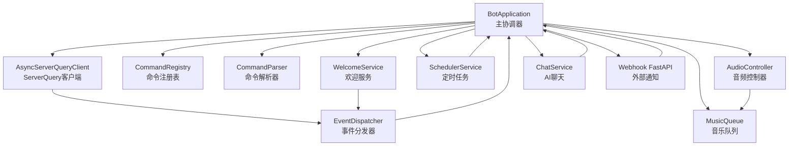
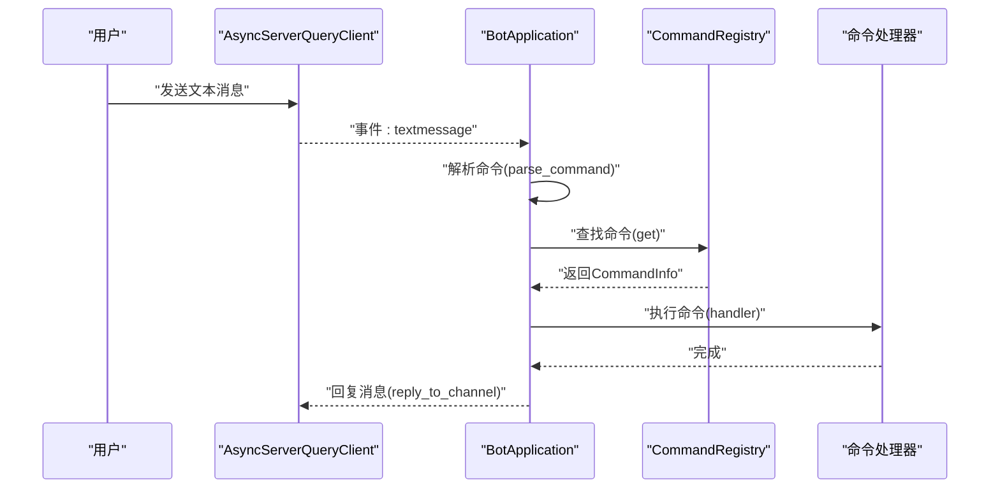
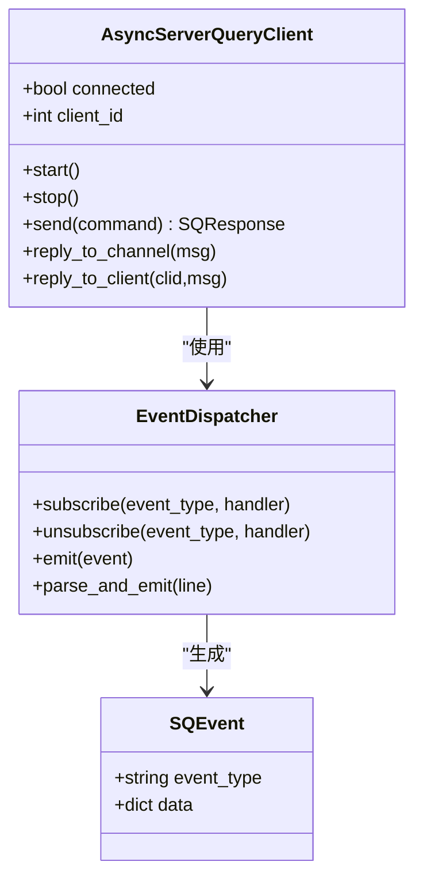
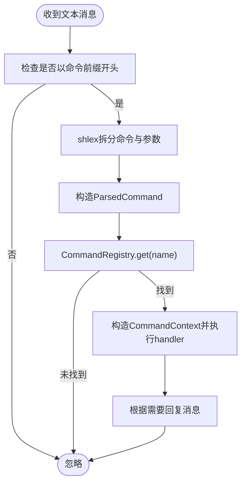
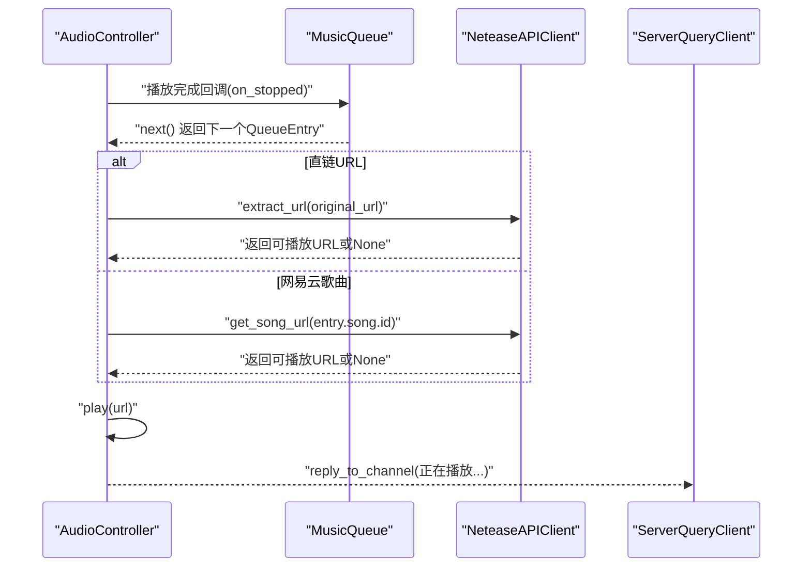
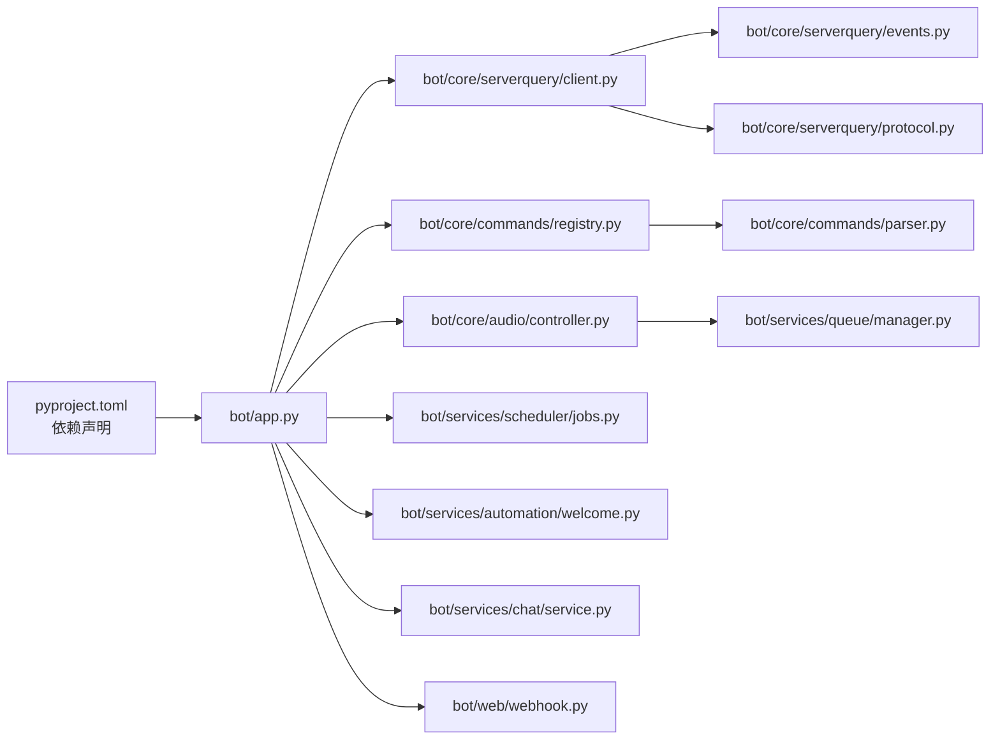

# 核心架构模式

<cite>
**本文引用的文件**
- [bot/app.py](file://bot/app.py)
- [bot/__main__.py](file://bot/__main__.py)
- [bot/config.py](file://bot/config.py)
- [bot/core/serverquery/client.py](file://bot/core/serverquery/client.py)
- [bot/core/serverquery/events.py](file://bot/core/serverquery/events.py)
- [bot/core/serverquery/protocol.py](file://bot/core/serverquery/protocol.py)
- [bot/core/commands/registry.py](file://bot/core/commands/registry.py)
- [bot/core/commands/parser.py](file://bot/core/commands/parser.py)
- [bot/core/audio/controller.py](file://bot/core/audio/controller.py)
- [bot/services/queue/manager.py](file://bot/services/queue/manager.py)
- [bot/services/scheduler/jobs.py](file://bot/services/scheduler/jobs.py)
- [bot/services/automation/welcome.py](file://bot/services/automation/welcome.py)
- [bot/services/chat/service.py](file://bot/services/chat/service.py)
- [bot/web/webhook.py](file://bot/web/webhook.py)
- [pyproject.toml](file://pyproject.toml)
</cite>

## 目录
1. [引言](#引言)
2. [项目结构](#项目结构)
3. [核心组件](#核心组件)
4. [架构总览](#架构总览)
5. [详细组件分析](#详细组件分析)
6. [依赖分析](#依赖分析)
7. [性能考虑](#性能考虑)
8. [故障排查指南](#故障排查指南)
9. [结论](#结论)
10. [附录](#附录)

## 引言
本文件系统性梳理 Teamspeak3_Bot 的核心架构模式，重点围绕以下主题展开：
- 分层架构设计：以 BotApplication 为主协调器，清晰划分配置、协议、命令与服务层。
- 模块化与依赖注入：通过构造函数注入与配置驱动，实现组件解耦与可替换性。
- 事件驱动架构：基于 ServerQuery 事件分发器与命令路由，形成松耦合的消息处理链路。
- 异步编程与并发控制：统一采用 asyncio，结合任务调度、队列与后台守护，保障高并发稳定性。
- 架构决策的技术考量：从性能、错误处理到可扩展性的权衡与实践。

## 项目结构
项目采用按功能域分层的组织方式，核心目录与职责如下：
- bot/core：底层基础设施（ServerQuery 协议、事件分发、命令解析与注册）
- bot/services：业务服务（自动化、聊天、音乐队列、定时任务等）
- bot/utils：通用工具（格式化等）
- bot/web：外部集成（Webhook）
- 配置与入口：配置模型与启动入口

图表来源
- [bot/__main__.py:1-17](file://bot/__main__.py#L1-L17)
- [bot/app.py:27-348](file://bot/app.py#L27-L348)
- [bot/config.py:125-160](file://bot/config.py#L125-L160)
- [bot/core/serverquery/client.py:27-406](file://bot/core/serverquery/client.py#L27-L406)
- [bot/core/serverquery/events.py:102-156](file://bot/core/serverquery/events.py#L102-L156)
- [bot/core/serverquery/protocol.py:38-160](file://bot/core/serverquery/protocol.py#L38-L160)
- [bot/core/commands/registry.py:28-94](file://bot/core/commands/registry.py#L28-L94)
- [bot/core/commands/parser.py:22-67](file://bot/core/commands/parser.py#L22-L67)
- [bot/core/audio/controller.py:24-143](file://bot/core/audio/controller.py#L24-L143)
- [bot/services/queue/manager.py:35-204](file://bot/services/queue/manager.py#L35-L204)
- [bot/services/scheduler/jobs.py:18-90](file://bot/services/scheduler/jobs.py#L18-L90)
- [bot/services/automation/welcome.py:17-71](file://bot/services/automation/welcome.py#L17-L71)
- [bot/services/chat/service.py:15-115](file://bot/services/chat/service.py#L15-L115)
- [bot/web/webhook.py:32-76](file://bot/web/webhook.py#L32-L76)

章节来源
- [bot/__main__.py:1-17](file://bot/__main__.py#L1-L17)
- [bot/app.py:27-348](file://bot/app.py#L27-L348)
- [bot/config.py:125-160](file://bot/config.py#L125-L160)

## 核心组件
本节聚焦于主协调器 BotApplication 的设计理念与职责划分，并概述其依赖的子系统。

- 设计理念
  - 单一职责：集中初始化、装配与生命周期管理。
  - 配置驱动：所有组件实例化均来自配置对象，便于环境隔离与测试替换。
  - 解耦与可插拔：通过事件分发器与回调接口，降低模块间耦合度。
  - 生命周期：明确 start/stop/run 的阶段划分，确保优雅启停与资源回收。

- 职责划分
  - 配置加载与日志：读取配置并按配置初始化日志级别与输出目标。
  - 组件装配：构建 ServerQuery 客户端、命令注册表、音频控制器、音乐队列、网易云客户端、聊天服务、自动化服务、调度器与 Webhook。
  - 事件绑定：注册 ServerQuery 文本消息事件到命令路由；订阅自动化事件。
  - 启停控制：连接 ServerQuery、启动调度器与 Webhook、关闭时进行资源回收与告警通知。

章节来源
- [bot/app.py:27-348](file://bot/app.py#L27-L348)

## 架构总览
整体采用“主协调器 + 多子系统”的分层架构。BotApplication 作为顶层协调者，负责：
- 初始化与装配：按配置创建各子系统实例。
- 事件路由：将 ServerQuery 文本消息转换为命令并交由注册表处理。
- 回调联动：音频播放完成/错误回调触发队列下一曲与状态通知。
- 并发与守护：后台任务（读写循环、保活、Webhook 服务器）独立运行。

图表来源
- [bot/app.py:27-348](file://bot/app.py#L27-L348)
- [bot/core/serverquery/client.py:27-406](file://bot/core/serverquery/client.py#L27-L406)
- [bot/core/serverquery/events.py:102-156](file://bot/core/serverquery/events.py#L102-L156)
- [bot/core/commands/registry.py:28-94](file://bot/core/commands/registry.py#L28-L94)
- [bot/core/commands/parser.py:22-67](file://bot/core/commands/parser.py#L22-L67)
- [bot/core/audio/controller.py:24-143](file://bot/core/audio/controller.py#L24-L143)
- [bot/services/queue/manager.py:35-204](file://bot/services/queue/manager.py#L35-L204)
- [bot/services/scheduler/jobs.py:18-90](file://bot/services/scheduler/jobs.py#L18-L90)
- [bot/services/automation/welcome.py:17-71](file://bot/services/automation/welcome.py#L17-L71)
- [bot/services/chat/service.py:15-115](file://bot/services/chat/service.py#L15-L115)
- [bot/web/webhook.py:32-76](file://bot/web/webhook.py#L32-L76)

## 详细组件分析

### 主协调器：BotApplication
- 角色定位：顶层编排者，负责装配、事件绑定、生命周期管理与异常兜底。
- 关键流程
  - 启动：注册命令与事件 → 连接 ServerQuery → 启动调度器与 Webhook → 运行直至中断。
  - 命令路由：文本消息 → 解析命令 → 查找处理器 → 执行并回复。
  - 音频回调：播放结束/错误 → 队列推进与通知。
  - 停止：关闭 Webhook、停止调度器、淡出音频、断开 ServerQuery。

图表来源
- [bot/app.py:162-198](file://bot/app.py#L162-L198)
- [bot/core/commands/parser.py:22-67](file://bot/core/commands/parser.py#L22-L67)
- [bot/core/commands/registry.py:68-78](file://bot/core/commands/registry.py#L68-L78)

章节来源
- [bot/app.py:27-348](file://bot/app.py#L27-L348)

### ServerQuery 客户端与事件驱动
- AsyncServerQueryClient
  - 责任：维护持久连接、命令队列、读写与保活后台任务、自动重连与错误传播。
  - 特性：命令串行化、超时与异常处理、事件注册与保活心跳。
- EventDispatcher
  - 责任：事件订阅/发布、安全调用、并发执行。
  - 事件类型：文本消息、客户端加入/离开、移动等。
- 协议编解码
  - 负责转义/反转义、记录解析、响应结构化。

图表来源
- [bot/core/serverquery/client.py:27-406](file://bot/core/serverquery/client.py#L27-L406)
- [bot/core/serverquery/events.py:102-156](file://bot/core/serverquery/events.py#L102-L156)
- [bot/core/serverquery/protocol.py:63-160](file://bot/core/serverquery/protocol.py#L63-L160)

章节来源
- [bot/core/serverquery/client.py:27-406](file://bot/core/serverquery/client.py#L27-L406)
- [bot/core/serverquery/events.py:102-156](file://bot/core/serverquery/events.py#L102-L156)
- [bot/core/serverquery/protocol.py:38-160](file://bot/core/serverquery/protocol.py#L38-L160)

### 命令系统：解析与注册
- 命令解析：基于前缀与 shell-like 语法解析，支持转义与参数提取。
- 注册表：装饰器式注册、别名映射、帮助信息格式化。
- 路由流程：事件 → 解析 → 查找 → 上下文构造 → 执行 → 错误日志与回复。

图表来源
- [bot/app.py:162-198](file://bot/app.py#L162-L198)
- [bot/core/commands/parser.py:22-67](file://bot/core/commands/parser.py#L22-L67)
- [bot/core/commands/registry.py:68-78](file://bot/core/commands/registry.py#L68-L78)

章节来源
- [bot/core/commands/parser.py:22-67](file://bot/core/commands/parser.py#L22-L67)
- [bot/core/commands/registry.py:28-94](file://bot/core/commands/registry.py#L28-L94)
- [bot/app.py:162-198](file://bot/app.py#L162-L198)

### 音频与队列：播放状态机与自动播放
- AudioController
  - 状态机：空闲/播放中/暂停，回调驱动 EOF/错误。
  - 音量控制：带渐变的音量设置与淡出停止。
- MusicQueue
  - 队列操作：入队、出队、窥视、移除、清空、洗牌。
  - 重复模式：单曲循环/全部循环/关闭。
  - 投票跳过：基于频道人数阈值的多数决定。
- 自动播放
  - 播放完成回调 → 取下一曲 → 若为直链则重新解析，否则通过网易云获取 URL → 播放并通知频道。

图表来源
- [bot/app.py:199-254](file://bot/app.py#L199-L254)
- [bot/core/audio/controller.py:70-143](file://bot/core/audio/controller.py#L70-L143)
- [bot/services/queue/manager.py:90-154](file://bot/services/queue/manager.py#L90-L154)

章节来源
- [bot/core/audio/controller.py:24-143](file://bot/core/audio/controller.py#L24-L143)
- [bot/services/queue/manager.py:35-204](file://bot/services/queue/manager.py#L35-L204)
- [bot/app.py:199-254](file://bot/app.py#L199-L254)

### 自动化服务：欢迎与群组分配
- WelcomeService
  - 订阅客户端加入事件 → 延迟确认在线 → 私聊/频道欢迎消息。
- GroupAssigner（由 BotApplication 装配）
  - 基于配置自动为新成员分配服务器组。
- FollowMode（跟随模式）
  - 监听频道变化，按配置移动/离开，具备防抖与去抖逻辑。

章节来源
- [bot/services/automation/welcome.py:17-71](file://bot/services/automation/welcome.py#L17-L71)
- [bot/app.py:77-98](file://bot/app.py#L77-L98)

### 调度与 Webhook
- SchedulerService
  - 基于 APScheduler 的异步调度器，支持 cron 表达式与提醒消息。
- Webhook
  - FastAPI 提供 /webhook 与 /status 接口，支持密钥校验与健康检查。

章节来源
- [bot/services/scheduler/jobs.py:18-90](file://bot/services/scheduler/jobs.py#L18-L90)
- [bot/web/webhook.py:32-76](file://bot/web/webhook.py#L32-L76)

## 依赖分析
- 内部依赖
  - BotApplication 依赖配置、ServerQuery 客户端、命令系统、音频与队列、自动化服务、调度器与 Webhook。
  - ServerQuery 客户端依赖事件分发器与协议编解码。
  - 命令系统依赖解析器与注册表。
  - 音频控制器依赖队列与网易云客户端。
- 外部依赖
  - 异步框架：asyncio（标准库）。
  - 第三方库：pydantic、openai、apscheduler、fastapi、uvicorn、yt-dlp 等。
- 耦合与内聚
  - 通过事件与回调实现低耦合；通过配置驱动提升可替换性。
  - 存在少量循环依赖风险（如 Webhook 依赖 BotApplication 的状态），但通过延迟导入与运行时注入缓解。

图表来源
- [pyproject.toml:6-16](file://pyproject.toml#L6-L16)
- [bot/app.py:27-348](file://bot/app.py#L27-L348)
- [bot/core/serverquery/client.py:27-406](file://bot/core/serverquery/client.py#L27-L406)
- [bot/core/serverquery/events.py:102-156](file://bot/core/serverquery/events.py#L102-L156)
- [bot/core/serverquery/protocol.py:38-160](file://bot/core/serverquery/protocol.py#L38-L160)
- [bot/core/commands/registry.py:28-94](file://bot/core/commands/registry.py#L28-L94)
- [bot/core/commands/parser.py:22-67](file://bot/core/commands/parser.py#L22-L67)
- [bot/core/audio/controller.py:24-143](file://bot/core/audio/controller.py#L24-L143)
- [bot/services/queue/manager.py:35-204](file://bot/services/queue/manager.py#L35-L204)
- [bot/services/scheduler/jobs.py:18-90](file://bot/services/scheduler/jobs.py#L18-L90)
- [bot/services/automation/welcome.py:17-71](file://bot/services/automation/welcome.py#L17-L71)
- [bot/services/chat/service.py:15-115](file://bot/services/chat/service.py#L15-L115)
- [bot/web/webhook.py:32-76](file://bot/web/webhook.py#L32-L76)

章节来源
- [pyproject.toml:6-16](file://pyproject.toml#L6-L16)

## 性能考虑
- 并发与任务管理
  - 使用 asyncio.gather 并发调用事件处理器，避免串行阻塞。
  - 后台任务（读/写/保活）分离，减少相互影响。
- 序列化与可靠性
  - 命令队列保证 ServerQuery 命令串行执行，避免竞态。
  - 自动重连与指数退避，提升网络波动下的稳定性。
- I/O 与缓存
  - 音频播放通过 FFmpeg 流式处理，避免大内存占用。
  - 配置中包含缓存目录与大小限制，建议结合磁盘空间规划。
- 资源回收
  - 停止时进行淡出与连接关闭，避免资源泄漏与音频突停。

## 故障排查指南
- ServerQuery 连接问题
  - 现象：无法登录/掉线频繁。
  - 排查：检查主机、端口、凭据与虚拟服务器 ID；查看自动重连日志。
- 命令执行异常
  - 现象：命令报错但未回显。
  - 排查：确认命令已注册、处理器内部异常已被捕获并记录；检查 invoker 信息与权限。
- 音频播放失败
  - 现象：播放错误或无法继续下一曲。
  - 排查：检查网易云 URL 获取与 CDN 链接有效期；确认 PulseAudio 源名称正确。
- Webhook 无法访问
  - 现象：/status 或 /webhook 返回 403/500。
  - 排查：核对密钥头 Authorization；确认 BotApplication.sq 已连接且频道消息发送成功。

章节来源
- [bot/core/serverquery/client.py:183-198](file://bot/core/serverquery/client.py#L183-L198)
- [bot/app.py:190-197](file://bot/app.py#L190-L197)
- [bot/app.py:247-254](file://bot/app.py#L247-L254)
- [bot/web/webhook.py:35-49](file://bot/web/webhook.py#L35-L49)

## 结论
本架构以 BotApplication 为核心协调器，通过配置驱动与事件回调实现模块解耦；以 asyncio 为基础的异步模型支撑高并发与稳健的后台任务；命令系统与队列/音频模块形成清晰的业务闭环。整体设计兼顾性能、可维护性与可扩展性，适合在多用户场景下稳定运行。

## 附录
- 入口与配置
  - 入口脚本通过 asyncio.run 启动 BotApplication.run，实现优雅启停。
  - 配置模型覆盖 TS3、音频、网易云、聊天、自动化、调度、Webhook 与日志等维度。

章节来源
- [bot/__main__.py:9-16](file://bot/__main__.py#L9-L16)
- [bot/config.py:125-160](file://bot/config.py#L125-L160)