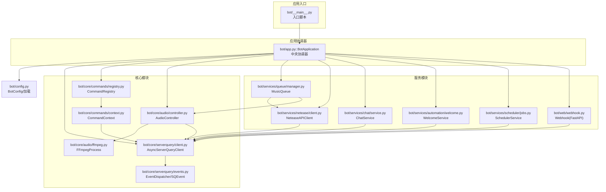
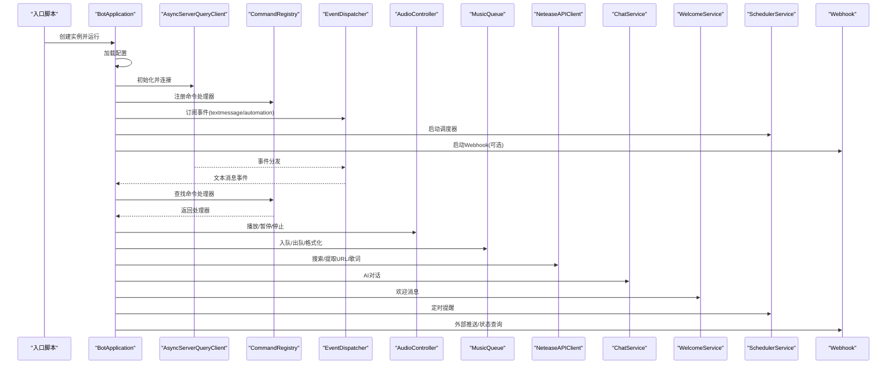
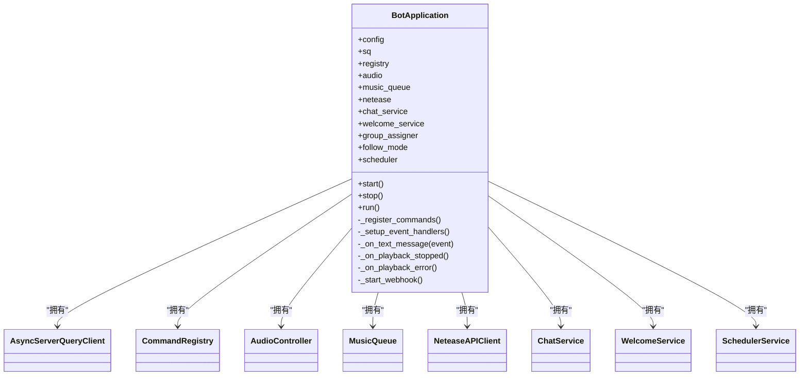
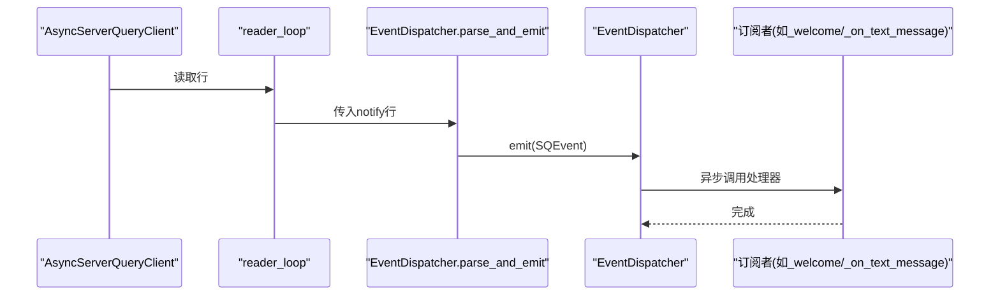
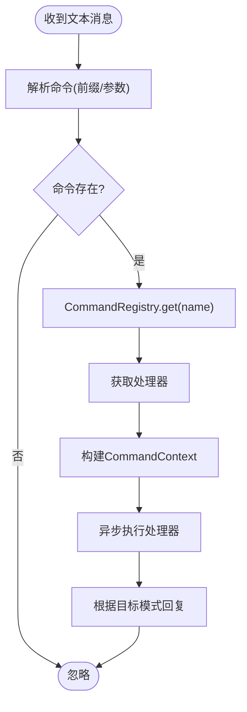
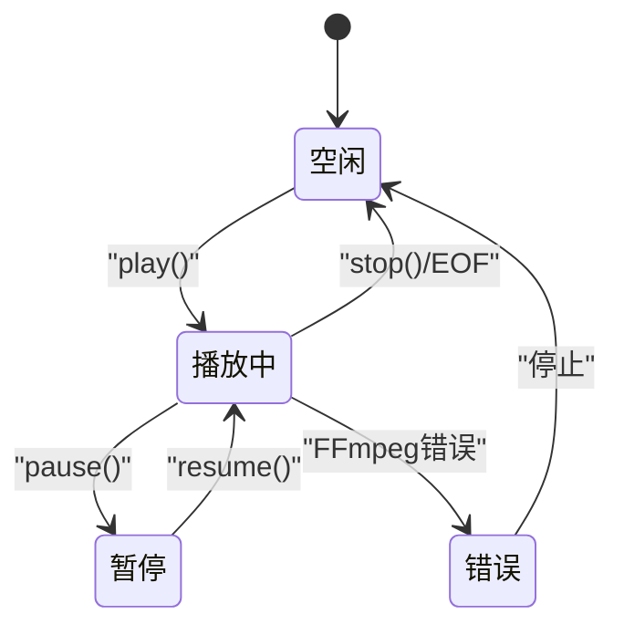
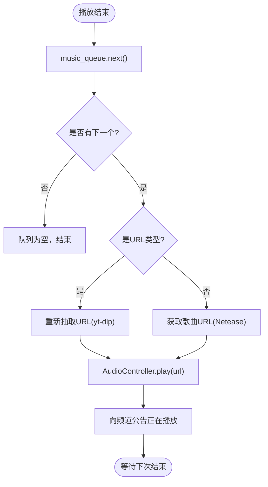
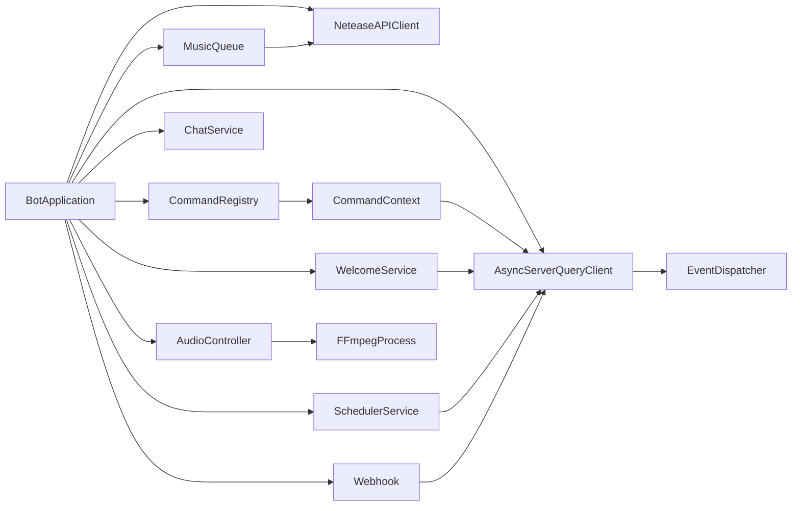

# 组件关系与交互

<cite>
**本文引用的文件**
- [bot/app.py](file://bot/app.py)
- [bot/__main__.py](file://bot/__main__.py)
- [bot/config.py](file://bot/config.py)
- [bot/core/audio/controller.py](file://bot/core/audio/controller.py)
- [bot/core/audio/ffmpeg.py](file://bot/core/audio/ffmpeg.py)
- [bot/core/commands/context.py](file://bot/core/commands/context.py)
- [bot/core/commands/registry.py](file://bot/core/commands/registry.py)
- [bot/core/commands/handlers/music.py](file://bot/core/commands/handlers/music.py)
- [bot/core/commands/handlers/admin.py](file://bot/core/commands/handlers/admin.py)
- [bot/core/serverquery/client.py](file://bot/core/serverquery/client.py)
- [bot/core/serverquery/events.py](file://bot/core/serverquery/events.py)
- [bot/services/automation/welcome.py](file://bot/services/automation/welcome.py)
- [bot/services/chat/service.py](file://bot/services/chat/service.py)
- [bot/services/netease/client.py](file://bot/services/netease/client.py)
- [bot/services/queue/manager.py](file://bot/services/queue/manager.py)
- [bot/services/scheduler/jobs.py](file://bot/services/scheduler/jobs.py)
- [bot/web/webhook.py](file://bot/web/webhook.py)
</cite>

## 目录
1. [简介](#简介)
2. [项目结构](#项目结构)
3. [核心组件](#核心组件)
4. [架构总览](#架构总览)
5. [详细组件分析](#详细组件分析)
6. [依赖分析](#依赖分析)
7. [性能考量](#性能考量)
8. [故障排查指南](#故障排查指南)
9. [结论](#结论)
10. [附录](#附录)

## 简介
本文件聚焦 Teamspeak3_Bot 的 BotApplication 中央协调器如何管理各服务组件，并深入解析 AudioController、CommandRegistry、ChatService、MusicQueue 等核心模块的初始化、依赖关系与交互机制。文档涵盖事件订阅、回调函数与异步消息传递，以及组件生命周期（启动顺序、依赖注入、资源清理）。同时提供组件交互图与数据流向图，帮助理解系统的动态行为与状态转换。

## 项目结构
项目采用按功能域分层组织：核心模块（音频、命令、ServerQuery）、服务模块（聊天、点歌、队列、调度、自动化、Webhook）与配置模块。BotApplication 作为顶层协调器，负责装配与编排这些模块。

图表来源
- [bot/app.py:27-111](file://bot/app.py#L27-L111)
- [bot/core/serverquery/client.py:27-54](file://bot/core/serverquery/client.py#L27-L54)
- [bot/core/serverquery/events.py:102-156](file://bot/core/serverquery/events.py#L102-L156)
- [bot/core/audio/controller.py:24-52](file://bot/core/audio/controller.py#L24-L52)
- [bot/core/audio/ffmpeg.py:16-40](file://bot/core/audio/ffmpeg.py#L16-L40)
- [bot/core/commands/context.py:13-23](file://bot/core/commands/context.py#L13-L23)
- [bot/core/commands/registry.py:28-67](file://bot/core/commands/registry.py#L28-L67)
- [bot/services/chat/service.py:15-48](file://bot/services/chat/service.py#L15-L48)
- [bot/services/netease/client.py:25-39](file://bot/services/netease/client.py#L25-L39)
- [bot/services/queue/manager.py:35-51](file://bot/services/queue/manager.py#L35-L51)
- [bot/services/automation/welcome.py:17-38](file://bot/services/automation/welcome.py#L17-L38)
- [bot/services/scheduler/jobs.py:18-32](file://bot/services/scheduler/jobs.py#L18-L32)
- [bot/web/webhook.py:32-76](file://bot/web/webhook.py#L32-L76)

章节来源
- [bot/app.py:27-111](file://bot/app.py#L27-L111)
- [bot/__main__.py:9-12](file://bot/__main__.py#L9-L12)
- [bot/config.py:125-134](file://bot/config.py#L125-L134)

## 核心组件
- BotApplication：负责加载配置、实例化所有服务组件、建立事件订阅、连接 ServerQuery、启动后台服务（调度器、Webhook），并在运行期处理信号以优雅停机。
- AsyncServerQueryClient：维护与 TeamSpeak ServerQuery 的持久连接，提供命令队列、事件分发、保活与自动重连。
- EventDispatcher：轻量级发布/订阅事件分发器，将 ServerQuery 的 notify 事件路由给订阅者。
- CommandRegistry：基于装饰器的命令注册中心，统一管理命令元数据与别名映射。
- CommandContext：封装命令调用上下文，提供回复消息的便捷方法。
- AudioController：高层音频控制器，封装 FFmpeg 子进程生命周期、音量控制与状态机，并通过回调通知播放结束/错误。
- FFmpegProcess：管理 FFmpeg 子进程，输出到 PulseAudio sink，监控 stderr 并触发回调。
- MusicQueue：多用户公平队列，支持跳过投票、重复模式、历史记录与格式化展示。
- NeteaseAPIClient：使用 yt-dlp 抽取可播放音频 URL，提供搜索、歌词等能力。
- ChatService：OpenAI 兼容 API 聊天服务，支持多 persona、通道/用户上下文隔离与令牌感知的上下文修剪。
- WelcomeService：新成员入房欢迎消息发送。
- SchedulerService：基于 APScheduler 的定时提醒任务管理。
- Webhook：FastAPI 提供外部推送接口与状态查询端点。

章节来源
- [bot/app.py:27-111](file://bot/app.py#L27-L111)
- [bot/core/serverquery/client.py:27-54](file://bot/core/serverquery/client.py#L27-L54)
- [bot/core/serverquery/events.py:102-156](file://bot/core/serverquery/events.py#L102-L156)
- [bot/core/commands/registry.py:28-67](file://bot/core/commands/registry.py#L28-L67)
- [bot/core/commands/context.py:13-23](file://bot/core/commands/context.py#L13-L23)
- [bot/core/audio/controller.py:24-52](file://bot/core/audio/controller.py#L24-L52)
- [bot/core/audio/ffmpeg.py:16-40](file://bot/core/audio/ffmpeg.py#L16-L40)
- [bot/services/queue/manager.py:35-51](file://bot/services/queue/manager.py#L35-L51)
- [bot/services/netease/client.py:25-39](file://bot/services/netease/client.py#L25-L39)
- [bot/services/chat/service.py:15-48](file://bot/services/chat/service.py#L15-L48)
- [bot/services/automation/welcome.py:17-38](file://bot/services/automation/welcome.py#L17-L38)
- [bot/services/scheduler/jobs.py:18-32](file://bot/services/scheduler/jobs.py#L18-L32)
- [bot/web/webhook.py:32-76](file://bot/web/webhook.py#L32-L76)

## 架构总览
BotApplication 作为中央协调器，完成以下生命周期步骤：
- 加载配置（BotConfig）
- 实例化核心与服务组件
- 建立 ServerQuery 连接与事件订阅
- 注册命令处理器
- 启动后台服务（调度器、Webhook）
- 运行直至收到中断信号，执行优雅停机

图表来源
- [bot/app.py:283-347](file://bot/app.py#L283-L347)
- [bot/core/serverquery/client.py:81-110](file://bot/core/serverquery/client.py#L81-L110)
- [bot/core/serverquery/events.py:139-156](file://bot/core/serverquery/events.py#L139-L156)
- [bot/core/commands/registry.py:68-83](file://bot/core/commands/registry.py#L68-L83)
- [bot/core/audio/controller.py:70-88](file://bot/core/audio/controller.py#L70-L88)
- [bot/services/queue/manager.py:72-120](file://bot/services/queue/manager.py#L72-L120)
- [bot/services/netease/client.py:40-96](file://bot/services/netease/client.py#L40-L96)
- [bot/services/automation/welcome.py:34-71](file://bot/services/automation/welcome.py#L34-L71)
- [bot/services/scheduler/jobs.py:25-42](file://bot/services/scheduler/jobs.py#L25-L42)
- [bot/web/webhook.py:32-76](file://bot/web/webhook.py#L32-L76)

## 详细组件分析

### BotApplication：中央协调器
- 职责
  - 加载配置并初始化所有组件
  - 建立 ServerQuery 连接与事件订阅
  - 注册命令处理器
  - 启动后台服务（调度器、Webhook）
  - 处理信号并执行优雅停机
- 关键流程
  - 初始化：构造 AsyncServerQueryClient、CommandRegistry、AudioController、MusicQueue、NeteaseAPIClient、ChatService、WelcomeService、GroupAssigner、FollowMode、SchedulerService
  - 事件绑定：订阅 textmessage 与自动化事件
  - 命令注册：注册 debug、music、volume、chat、admin 命令处理器
  - 启动：连接 ServerQuery、启动调度器、启动 Webhook
  - 停止：关闭 Webhook、停止调度器、淡出并停止音频、关闭 ChatService 与 NeteaseAPIClient、断开 ServerQuery

图表来源
- [bot/app.py:27-111](file://bot/app.py#L27-L111)
- [bot/app.py:283-347](file://bot/app.py#L283-L347)

章节来源
- [bot/app.py:27-111](file://bot/app.py#L27-L111)
- [bot/app.py:140-151](file://bot/app.py#L140-L151)
- [bot/app.py:152-161](file://bot/app.py#L152-L161)
- [bot/app.py:283-347](file://bot/app.py#L283-L347)

### AsyncServerQueryClient 与 EventDispatcher：事件驱动
- AsyncServerQueryClient
  - 维护连接、登录、虚拟服务器选择、昵称更新、事件注册
  - 后台任务：读取循环（解析 notify 事件并分发）、写入循环（命令队列串行执行）、保活心跳
  - 自动重连：指数退避
- EventDispatcher
  - 订阅/取消订阅事件类型
  - 安全调用处理器，捕获异常并记录日志
  - 解析 notify 行为并异步发射事件

图表来源
- [bot/core/serverquery/client.py:201-254](file://bot/core/serverquery/client.py#L201-L254)
- [bot/core/serverquery/events.py:139-156](file://bot/core/serverquery/events.py#L139-L156)

章节来源
- [bot/core/serverquery/client.py:27-54](file://bot/core/serverquery/client.py#L27-L54)
- [bot/core/serverquery/client.py:111-198](file://bot/core/serverquery/client.py#L111-L198)
- [bot/core/serverquery/client.py:201-290](file://bot/core/serverquery/client.py#L201-L290)
- [bot/core/serverquery/events.py:102-156](file://bot/core/serverquery/events.py#L102-L156)

### CommandRegistry 与 CommandContext：命令系统
- CommandRegistry
  - 装饰器式注册命令，维护名称与别名映射
  - 提供查找、列举与帮助文本格式化
- CommandContext
  - 封装命令参数、调用者信息与回复方法（私聊/频道/同上下文）

图表来源
- [bot/app.py:162-198](file://bot/app.py#L162-L198)
- [bot/core/commands/registry.py:68-83](file://bot/core/commands/registry.py#L68-L83)
- [bot/core/commands/context.py:20-70](file://bot/core/commands/context.py#L20-L70)

章节来源
- [bot/core/commands/registry.py:28-67](file://bot/core/commands/registry.py#L28-L67)
- [bot/core/commands/context.py:13-23](file://bot/core/commands/context.py#L13-L23)
- [bot/core/commands/handlers/music.py:17-93](file://bot/core/commands/handlers/music.py#L17-L93)
- [bot/core/commands/handlers/admin.py:17-75](file://bot/core/commands/handlers/admin.py#L17-L75)

### AudioController 与 FFmpegProcess：音频播放
- AudioController
  - 状态机：IDLE/PLAYING/PAUSED
  - 回调：播放结束、播放错误
  - 音量控制：带渐变的音量设置
  - 生命周期：播放、暂停、恢复、停止、淡出停止
- FFmpegProcess
  - 子进程管理：启动/停止/暂停/恢复
  - 输出到 PulseAudio sink
  - 监控 stderr，区分 EOF 与错误并触发回调

图表来源
- [bot/core/audio/controller.py:18-52](file://bot/core/audio/controller.py#L18-L52)
- [bot/core/audio/controller.py:70-143](file://bot/core/audio/controller.py#L70-L143)
- [bot/core/audio/ffmpeg.py:16-40](file://bot/core/audio/ffmpeg.py#L16-L40)
- [bot/core/audio/ffmpeg.py:127-162](file://bot/core/audio/ffmpeg.py#L127-L162)

章节来源
- [bot/core/audio/controller.py:24-52](file://bot/core/audio/controller.py#L24-L52)
- [bot/core/audio/controller.py:70-143](file://bot/core/audio/controller.py#L70-L143)
- [bot/core/audio/ffmpeg.py:54-116](file://bot/core/audio/ffmpeg.py#L54-L116)
- [bot/core/audio/ffmpeg.py:127-162](file://bot/core/audio/ffmpeg.py#L127-L162)

### MusicQueue：点歌队列
- 功能
  - 入队/出队/查看/移除/洗牌
  - 跳过投票（基于频道用户数量阈值）
  - 重复模式：关闭/单曲/列表
  - 历史记录与格式化展示
- 与播放器协作
  - 当播放结束时，自动取出下一个条目
  - 对 URL 类型条目，播放前重新抽取可播放 URL

图表来源
- [bot/app.py:199-254](file://bot/app.py#L199-L254)
- [bot/services/queue/manager.py:90-120](file://bot/services/queue/manager.py#L90-L120)
- [bot/services/netease/client.py:68-96](file://bot/services/netease/client.py#L68-L96)

章节来源
- [bot/services/queue/manager.py:35-51](file://bot/services/queue/manager.py#L35-L51)
- [bot/services/queue/manager.py:72-189](file://bot/services/queue/manager.py#L72-L189)
- [bot/app.py:199-254](file://bot/app.py#L199-L254)

### NeteaseAPIClient：音频抽取与缓存
- 使用 yt-dlp 抽取可播放 URL，避免缓存音频直链（因 CDN 链接会过期）
- 支持多种平台（网易云、YouTube、B站、SoundCloud 等）
- 提供搜索、歌词获取、信息提取等能力

章节来源
- [bot/services/netease/client.py:25-39](file://bot/services/netease/client.py#L25-L39)
- [bot/services/netease/client.py:40-96](file://bot/services/netease/client.py#L40-L96)
- [bot/services/netease/client.py:115-161](file://bot/services/netease/client.py#L115-L161)

### ChatService：AI 聊天
- OpenAI 兼容 API 集成
- 多 persona 系统提示词
- 每通道/每用户上下文管理与令牌感知修剪
- 提供聊天、清除上下文等方法

章节来源
- [bot/services/chat/service.py:15-48](file://bot/services/chat/service.py#L15-L48)
- [bot/services/chat/service.py:61-115](file://bot/services/chat/service.py#L61-L115)

### WelcomeService：自动化欢迎
- 订阅客户端进入事件
- 延迟发送欢迎消息（避免刷屏）
- 支持私聊或频道广播两种模式

章节来源
- [bot/services/automation/welcome.py:17-38](file://bot/services/automation/welcome.py#L17-L38)
- [bot/services/automation/welcome.py:39-71](file://bot/services/automation/welcome.py#L39-L71)

### SchedulerService：定时提醒
- 基于 APScheduler 的 Cron 表达式任务
- 支持动态添加/删除提醒
- 通过 ServerQuery 向指定频道发送提醒消息

章节来源
- [bot/services/scheduler/jobs.py:18-32](file://bot/services/scheduler/jobs.py#L18-L32)
- [bot/services/scheduler/jobs.py:33-90](file://bot/services/scheduler/jobs.py#L33-L90)

### Webhook：外部推送与状态查询
- FastAPI 应用，提供 /webhook 推送与 /status、/health 查询
- 支持可选的 Bearer Token 校验
- 与 BotApplication 协作，通过 ServerQuery 发送消息

章节来源
- [bot/web/webhook.py:32-76](file://bot/web/webhook.py#L32-L76)

## 依赖分析
- 组件耦合
  - BotApplication 对所有子组件具有强持有关系，形成“上帝对象”式的协调者角色
  - AudioController 依赖 FFmpegProcess 与 VolumeController；对外暴露回调接口
  - MusicQueue 依赖 NeteaseAPIClient 获取 URL；与 AudioController 协作推进播放
  - CommandRegistry 与 CommandContext 之间为松耦合的命令执行链
  - ServerQuery 通过 EventDispatcher 与各自动化/业务组件解耦
- 外部依赖
  - PulseAudio sink 名称用于音频输出
  - APScheduler 用于定时任务
  - FastAPI/Uvicorn 用于 Webhook 服务
  - yt-dlp 用于音频 URL 抽取
  - OpenAI 兼容 API 用于聊天

图表来源
- [bot/app.py:27-111](file://bot/app.py#L27-L111)
- [bot/core/audio/controller.py:24-52](file://bot/core/audio/controller.py#L24-L52)
- [bot/core/commands/context.py:13-23](file://bot/core/commands/context.py#L13-L23)
- [bot/core/serverquery/events.py:102-156](file://bot/core/serverquery/events.py#L102-L156)

章节来源
- [bot/app.py:27-111](file://bot/app.py#L27-L111)
- [bot/core/audio/controller.py:24-52](file://bot/core/audio/controller.py#L24-L52)
- [bot/core/commands/context.py:13-23](file://bot/core/commands/context.py#L13-L23)
- [bot/core/serverquery/events.py:102-156](file://bot/core/serverquery/events.py#L102-L156)

## 性能考量
- 音频播放
  - FFmpeg 参数优化（重连、流式重连、最大延迟）减少断流
  - 播放前短暂延时刷新 sink input，确保音量控制生效
  - 播放结束/错误后及时释放进程与回调
- 队列与命令
  - 出队与播放 URL 重新抽取在播放结束回调中进行，避免阻塞主线程
  - 命令处理器异步执行，通过 CommandContext 统一回复
- 网络与 API
  - NeteaseAPIClient 对搜索结果做短期缓存，降低重复请求
  - Webhook 与聊天服务均采用异步客户端，避免阻塞事件循环
- 调度与自动化
  - SchedulerService 使用异步调度器，任务并发安全
  - WelcomeService 延迟与在线校验避免重复打扰

## 故障排查指南
- ServerQuery 连接问题
  - 检查主机、端口、凭据与虚拟服务器 ID 是否正确
  - 观察自动重连日志，确认网络波动与超时设置
- 命令不响应
  - 确认命令前缀与注册命令列表一致
  - 检查 CommandRegistry 的查找与别名映射
- 播放异常
  - 查看 FFmpeg stderr 日志，区分 EOF 与错误
  - 检查 PulseAudio sink 名称与权限
  - 若为 URL 播放，确认 yt-dlp 可正常抽取
- Webhook 无法访问
  - 校验 Bearer Token 设置与请求头
  - 检查监听地址与端口占用
- 调度任务未触发
  - 校验 Cron 表达式格式与日志输出
  - 确认 SchedulerService 已启动且未被关闭

章节来源
- [bot/core/serverquery/client.py:183-198](file://bot/core/serverquery/client.py#L183-L198)
- [bot/core/audio/ffmpeg.py:127-162](file://bot/core/audio/ffmpeg.py#L127-L162)
- [bot/web/webhook.py:35-49](file://bot/web/webhook.py#L35-L49)
- [bot/services/scheduler/jobs.py:55-74](file://bot/services/scheduler/jobs.py#L55-L74)

## 结论
BotApplication 通过清晰的生命周期与事件驱动机制，将 ServerQuery、命令系统、音频播放、点歌队列、聊天、自动化与调度等模块有机整合。AudioController、CommandRegistry、ChatService、MusicQueue 等核心组件职责明确、接口简洁，配合回调与异步消息传递实现高内聚低耦合的系统架构。遵循本文提供的组件关系与交互图，有助于快速定位问题、扩展功能与优化性能。

## 附录
- 配置模型与默认值
  - BotConfig 包含 TS3、Audio、Netease、Chat、Automation、Scheduler、Webhook、Logging 等配置段
  - 支持环境变量插值，便于容器化部署

章节来源
- [bot/config.py:125-160](file://bot/config.py#L125-L160)