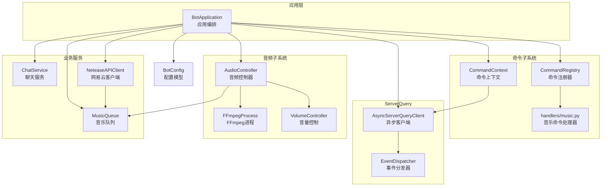
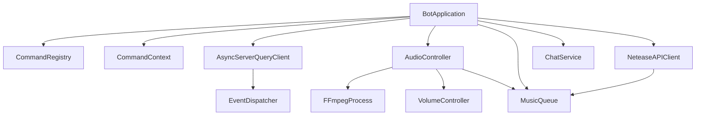
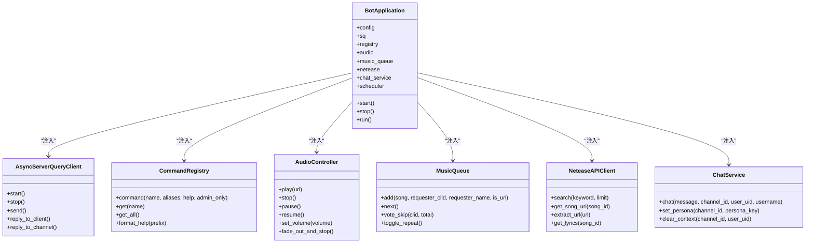
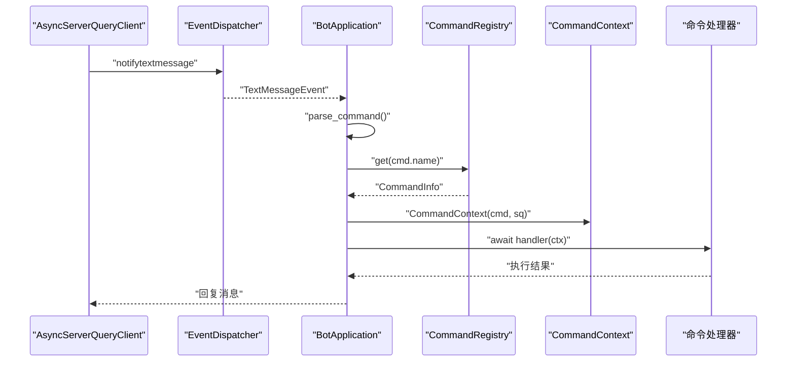
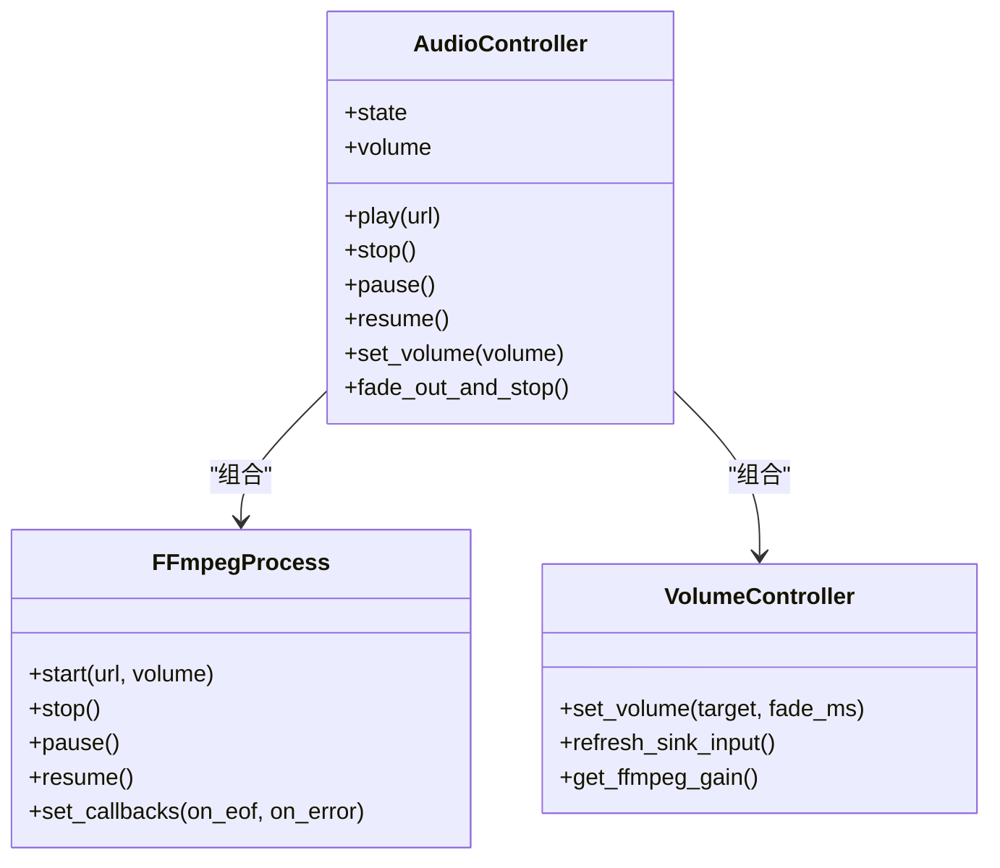
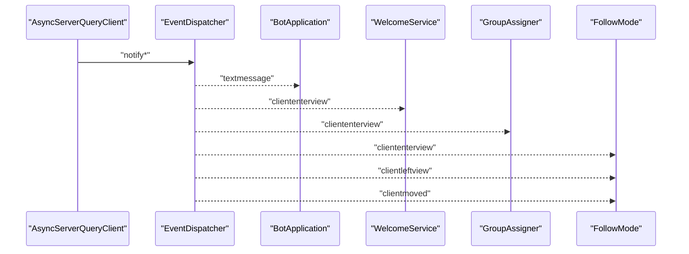
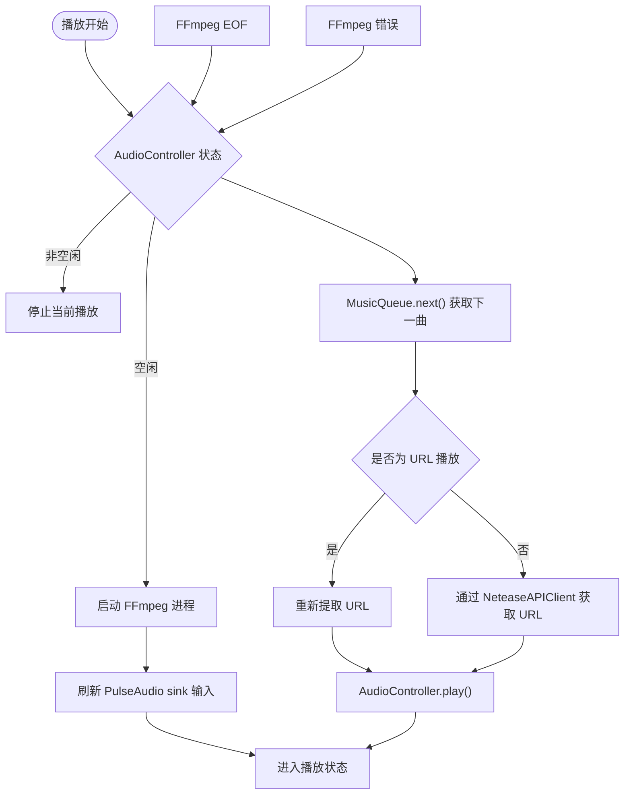
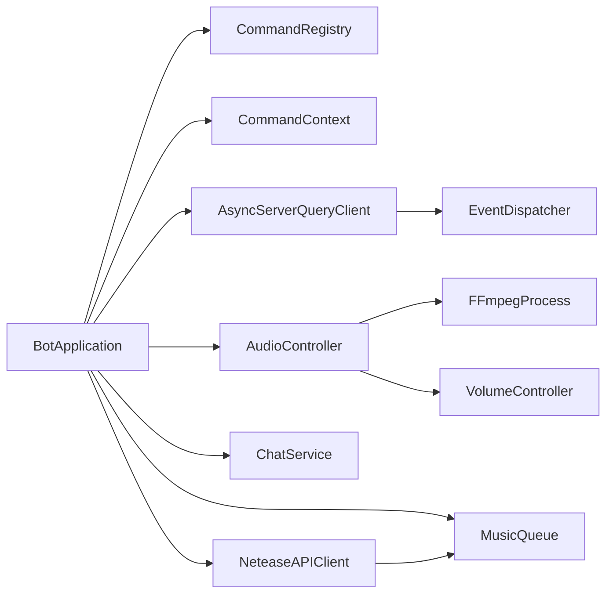

# 设计模式应用

<cite>
**本文引用的文件**
- [bot/app.py](file://bot/app.py)
- [bot/core/commands/registry.py](file://bot/core/commands/registry.py)
- [bot/core/commands/context.py](file://bot/core/commands/context.py)
- [bot/core/commands/handlers/music.py](file://bot/core/commands/handlers/music.py)
- [bot/core/serverquery/client.py](file://bot/core/serverquery/client.py)
- [bot/core/serverquery/events.py](file://bot/core/serverquery/events.py)
- [bot/core/audio/controller.py](file://bot/core/audio/controller.py)
- [bot/core/audio/ffmpeg.py](file://bot/core/audio/ffmpeg.py)
- [bot/core/audio/volume.py](file://bot/core/audio/volume.py)
- [bot/services/queue/manager.py](file://bot/services/queue/manager.py)
- [bot/services/chat/service.py](file://bot/services/chat/service.py)
- [bot/services/netease/client.py](file://bot/services/netease/client.py)
- [bot/config.py](file://bot/config.py)
</cite>

## 目录
1. [引言](#引言)
2. [项目结构](#项目结构)
3. [核心组件](#核心组件)
4. [架构总览](#架构总览)
5. [详细组件分析](#详细组件分析)
6. [依赖分析](#依赖分析)
7. [性能考虑](#性能考虑)
8. [故障排查指南](#故障排查指南)
9. [结论](#结论)
10. [附录](#附录)

## 引言
本文件系统性梳理 Teamspeak3_Bot 中的设计模式应用，重点覆盖以下方面：
- 依赖注入与工厂：BotApplication 的构造函数注入与模块装配
- 命令模式：CommandRegistry 的注册与执行流程
- 策略模式：音频处理与聊天服务中的可替换策略
- 观察者模式：ServerQuery 事件订阅与分发
- 实践建议：最佳实践与常见问题定位

## 项目结构
项目采用按功能域划分的层次化组织方式，核心模块包括：
- 应用入口与编排：bot/app.py
- 命令子系统：bot/core/commands/*（注册器、上下文、处理器）
- 服务器查询客户端：bot/core/serverquery/*（客户端、事件分发、协议）
- 音频子系统：bot/core/audio/*（控制器、FFmpeg进程、音量控制）
- 业务服务：bot/services/*（队列、聊天、网易云等）
- 配置：bot/config.py

图表来源
- [bot/app.py:27-111](file://bot/app.py#L27-L111)
- [bot/core/commands/registry.py:28-94](file://bot/core/commands/registry.py#L28-L94)
- [bot/core/commands/context.py:13-70](file://bot/core/commands/context.py#L13-L70)
- [bot/core/serverquery/client.py:27-170](file://bot/core/serverquery/client.py#L27-L170)
- [bot/core/serverquery/events.py:102-156](file://bot/core/serverquery/events.py#L102-L156)
- [bot/core/audio/controller.py:24-143](file://bot/core/audio/controller.py#L24-L143)
- [bot/core/audio/ffmpeg.py:16-162](file://bot/core/audio/ffmpeg.py#L16-L162)
- [bot/core/audio/volume.py:12-113](file://bot/core/audio/volume.py#L12-L113)
- [bot/services/queue/manager.py:35-204](file://bot/services/queue/manager.py#L35-L204)
- [bot/services/chat/service.py:15-115](file://bot/services/chat/service.py#L15-L115)
- [bot/services/netease/client.py:25-161](file://bot/services/netease/client.py#L25-L161)
- [bot/config.py:125-160](file://bot/config.py#L125-L160)

章节来源
- [bot/app.py:27-111](file://bot/app.py#L27-L111)
- [bot/config.py:125-160](file://bot/config.py#L125-L160)

## 核心组件
- BotApplication：应用生命周期与模块装配中心，负责加载配置、实例化各子系统、建立事件与命令路由、启动后台服务。
- CommandRegistry：基于装饰器的命令注册器，统一管理命令元数据与别名映射。
- CommandContext：封装命令调用上下文与回复辅助方法。
- AsyncServerQueryClient：异步 ServerQuery 客户端，维护连接、命令队列、事件分发与自动重连。
- EventDispatcher：轻量级发布/订阅事件分发器，支持并发安全地调用多个处理器。
- AudioController：音频播放高层控制器，协调 FFmpeg 与音量控制，暴露播放状态与回调。
- MusicQueue：多用户公平队列，支持跳过投票、重复模式与历史记录。
- ChatService：AI 聊天服务，基于 OpenAI 兼容接口，支持多角色与上下文窗口。
- NeteaseAPIClient：基于 yt-dlp 的音频提取与搜索客户端。

章节来源
- [bot/app.py:27-111](file://bot/app.py#L27-L111)
- [bot/core/commands/registry.py:28-94](file://bot/core/commands/registry.py#L28-L94)
- [bot/core/commands/context.py:13-70](file://bot/core/commands/context.py#L13-L70)
- [bot/core/serverquery/client.py:27-170](file://bot/core/serverquery/client.py#L27-L170)
- [bot/core/serverquery/events.py:102-156](file://bot/core/serverquery/events.py#L102-L156)
- [bot/core/audio/controller.py:24-143](file://bot/core/audio/controller.py#L24-L143)
- [bot/services/queue/manager.py:35-204](file://bot/services/queue/manager.py#L35-L204)
- [bot/services/chat/service.py:15-115](file://bot/services/chat/service.py#L15-L115)
- [bot/services/netease/client.py:25-161](file://bot/services/netease/client.py#L25-L161)

## 架构总览
应用以 BotApplication 为中心，通过构造函数注入完成模块装配；命令系统由 CommandRegistry 统一注册与查找；ServerQuery 事件通过 EventDispatcher 分发给订阅者；音频子系统以 AudioController 为核心，协调 FFmpeg 与音量控制；业务服务如 MusicQueue、ChatService、NeteaseAPIClient 提供具体能力。

图表来源
- [bot/app.py:27-111](file://bot/app.py#L27-L111)
- [bot/core/serverquery/client.py:27-170](file://bot/core/serverquery/client.py#L27-L170)
- [bot/core/audio/controller.py:24-143](file://bot/core/audio/controller.py#L24-L143)

## 详细组件分析

### 依赖注入与工厂模式（BotApplication）
- 构造函数注入：BotApplication 在初始化阶段接收配置并直接实例化所有核心组件，形成强内聚的装配点。例如：
  - 创建 AsyncServerQueryClient 并注入主机、端口、凭据、虚拟服务器ID与昵称
  - 创建 CommandRegistry 用于命令注册
  - 创建 AudioController 并注入 FFmpeg 路径、Pulse 洗手间名称、默认音量与淡入时长
  - 创建 MusicQueue、NeteaseAPIClient、ChatService 等
  - 创建自动化服务（WelcomeService、GroupAssigner、FollowMode）并注入应用实例
- 工厂模式：在需要延迟创建或动态选择实现时，可通过工厂函数或类工厂进行封装。例如，可在应用启动前根据配置动态决定 ChatService 的实现（不同后端），但当前代码中 ChatService 作为单一实现直接注入。

图表来源
- [bot/app.py:39-111](file://bot/app.py#L39-L111)
- [bot/core/serverquery/client.py:27-170](file://bot/core/serverquery/client.py#L27-L170)
- [bot/core/commands/registry.py:28-94](file://bot/core/commands/registry.py#L28-L94)
- [bot/core/audio/controller.py:24-143](file://bot/core/audio/controller.py#L24-L143)
- [bot/services/queue/manager.py:35-204](file://bot/services/queue/manager.py#L35-L204)
- [bot/services/netease/client.py:25-161](file://bot/services/netease/client.py#L25-L161)
- [bot/services/chat/service.py:15-115](file://bot/services/chat/service.py#L15-L115)

章节来源
- [bot/app.py:39-111](file://bot/app.py#L39-L111)

### 命令模式（CommandRegistry 与 CommandContext）
- 注册与查找：CommandRegistry 使用装饰器注册命令，内部维护命令字典与别名映射，支持按名称或别名查找。
- 执行流程：文本消息经 ServerQuery 事件分发到 BotApplication 的消息处理逻辑，解析命令后查表获取 CommandInfo，构造 CommandContext 并调用处理器协程。
- 处理器示例：handlers/music.py 中的注册函数集中定义命令与处理器，体现“命令对象”与“执行器”的分离。

图表来源
- [bot/core/serverquery/client.py:27-170](file://bot/core/serverquery/client.py#L27-L170)
- [bot/core/serverquery/events.py:102-156](file://bot/core/serverquery/events.py#L102-L156)
- [bot/app.py:162-198](file://bot/app.py#L162-L198)
- [bot/core/commands/registry.py:68-83](file://bot/core/commands/registry.py#L68-L83)
- [bot/core/commands/context.py:20-70](file://bot/core/commands/context.py#L20-L70)
- [bot/core/commands/handlers/music.py:17-93](file://bot/core/commands/handlers/music.py#L17-L93)

章节来源
- [bot/core/commands/registry.py:28-94](file://bot/core/commands/registry.py#L28-L94)
- [bot/core/commands/context.py:13-70](file://bot/core/commands/context.py#L13-L70)
- [bot/core/commands/handlers/music.py:17-93](file://bot/core/commands/handlers/music.py#L17-L93)
- [bot/app.py:162-198](file://bot/app.py#L162-L198)

### 策略模式（音频处理与聊天服务）
- 音频处理策略：
  - AudioController 作为高层控制器，内部组合 FFmpegProcess 与 VolumeController，通过设置回调与状态机实现播放、暂停、恢复与淡出停止等行为。策略体现在：
    - FFmpeg 参数与输出格式策略（在 FFmpegProcess 中封装）
    - 音量控制策略（VolumeController 使用 FFmpeg 滤镜与 pactl 双层控制）
  - 通过 set_callbacks 注入播放结束与错误回调，实现“算法替换”（例如替换不同的播放器或音量控制策略）。
- 聊天服务策略：
  - ChatService 通过 Persona（角色）与 ContextManager 实现对话策略的可替换性（不同角色、不同上下文窗口）。通过 set_persona 可按频道切换策略，通过模型参数与温度等实现不同风格的回复策略。

图表来源
- [bot/core/audio/controller.py:24-143](file://bot/core/audio/controller.py#L24-L143)
- [bot/core/audio/ffmpeg.py:16-162](file://bot/core/audio/ffmpeg.py#L16-L162)
- [bot/core/audio/volume.py:12-113](file://bot/core/audio/volume.py#L12-L113)

章节来源
- [bot/core/audio/controller.py:24-143](file://bot/core/audio/controller.py#L24-L143)
- [bot/core/audio/ffmpeg.py:16-162](file://bot/core/audio/ffmpeg.py#L16-L162)
- [bot/core/audio/volume.py:12-113](file://bot/core/audio/volume.py#L12-L113)
- [bot/services/chat/service.py:15-115](file://bot/services/chat/service.py#L15-L115)

### 观察者模式（ServerQuery 事件驱动）
- 订阅与分发：EventDispatcher 提供 subscribe/unsubscribe/emit 接口，支持同一事件类型多处理器并发调用。
- 应用场景：
  - 文本消息：BotApplication 订阅 textmessage 事件，解析并路由至命令系统
  - 自动化服务：WelcomeService、GroupAssigner、FollowMode 通过 subscribe 订阅相应事件，实现业务逻辑
- 错误隔离：EventDispatcher 内部以安全调用包装处理器，避免单个处理器异常影响其他处理器。

图表来源
- [bot/core/serverquery/client.py:27-170](file://bot/core/serverquery/client.py#L27-L170)
- [bot/core/serverquery/events.py:102-156](file://bot/core/serverquery/events.py#L102-L156)
- [bot/app.py:152-161](file://bot/app.py#L152-L161)
- [bot/services/automation/follow.py:61-70](file://bot/services/automation/follow.py#L61-L70)
- [bot/services/automation/groups.py:32-34](file://bot/services/automation/groups.py#L32-L34)

章节来源
- [bot/core/serverquery/events.py:102-156](file://bot/core/serverquery/events.py#L102-L156)
- [bot/core/serverquery/client.py:27-170](file://bot/core/serverquery/client.py#L27-L170)
- [bot/app.py:152-161](file://bot/app.py#L152-L161)

### 音频播放与队列联动
- 播放回调：AudioController 将 FFmpeg 的 EOF 与错误事件转换为应用层回调，触发队列下一曲播放与错误提示。
- 队列策略：MusicQueue 支持重复模式（OFF/ONE/ALL）、跳过投票、随机打乱与历史记录，配合 NeteaseAPIClient 的 URL 提取策略，实现灵活的播放调度。

图表来源
- [bot/core/audio/controller.py:70-143](file://bot/core/audio/controller.py#L70-L143)
- [bot/services/queue/manager.py:90-119](file://bot/services/queue/manager.py#L90-L119)
- [bot/services/netease/client.py:68-91](file://bot/services/netease/client.py#L68-L91)
- [bot/core/audio/ffmpeg.py:54-162](file://bot/core/audio/ffmpeg.py#L54-L162)

章节来源
- [bot/core/audio/controller.py:70-143](file://bot/core/audio/controller.py#L70-L143)
- [bot/services/queue/manager.py:90-119](file://bot/services/queue/manager.py#L90-L119)
- [bot/services/netease/client.py:68-91](file://bot/services/netease/client.py#L68-L91)
- [bot/core/audio/ffmpeg.py:54-162](file://bot/core/audio/ffmpeg.py#L54-L162)

## 依赖分析
- 组件耦合与内聚：
  - BotApplication 对各子系统进行高内聚装配，降低跨模块耦合
  - CommandRegistry 与 CommandContext 解耦命令定义与执行环境
  - EventDispatcher 与 AsyncServerQueryClient 解耦事件产生与消费
- 外部依赖：
  - ServerQuery 协议与事件格式
  - FFmpeg 与 PulseAudio 生态
  - OpenAI 兼容 API 与 Netease/Lyric API

图表来源
- [bot/app.py:27-111](file://bot/app.py#L27-L111)
- [bot/core/serverquery/client.py:27-170](file://bot/core/serverquery/client.py#L27-L170)
- [bot/core/audio/controller.py:24-143](file://bot/core/audio/controller.py#L24-L143)

章节来源
- [bot/app.py:27-111](file://bot/app.py#L27-L111)
- [bot/core/serverquery/client.py:27-170](file://bot/core/serverquery/client.py#L27-L170)
- [bot/core/audio/controller.py:24-143](file://bot/core/audio/controller.py#L24-L143)

## 性能考虑
- 异步与并发：ServerQuery 客户端使用 asyncio 队列与任务，保证命令串行执行与事件并发分发。
- I/O 密集优化：音频播放与网络请求均采用异步方式，减少阻塞。
- 缓存策略：NeteaseAPIClient 对搜索与歌词使用 TTL 缓存，降低外部 API 压力。
- 资源释放：应用停止时统一关闭音频淡出、断开 ServerQuery、关闭聊天服务与网络客户端。

## 故障排查指南
- 命令执行异常：CommandContext 提供统一回复方法，BotApplication 在命令执行异常时捕获并回复错误信息。
- 播放错误：AudioController 在播放错误回调中尝试下一首，避免长时间卡死。
- 事件处理异常：EventDispatcher 对每个处理器调用进行安全包装，避免单个处理器异常导致整体事件链中断。
- 配置问题：BotConfig 支持环境变量插值，确保敏感信息与路径配置可动态调整。

章节来源
- [bot/app.py:188-198](file://bot/app.py#L188-L198)
- [bot/app.py:247-254](file://bot/app.py#L247-L254)
- [bot/core/serverquery/events.py:132-138](file://bot/core/serverquery/events.py#L132-L138)
- [bot/config.py:136-160](file://bot/config.py#L136-L160)

## 结论
本项目在应用层通过 BotApplication 实现了清晰的依赖注入与模块装配，在命令系统中体现了命令模式的解耦思想，在音频与聊天服务中通过组合与回调实现了策略的可替换性，在事件驱动架构中通过观察者模式实现了松耦合的订阅与分发。整体设计具备良好的扩展性与可维护性。

## 附录
- 最佳实践建议
  - 将可替换策略封装为独立类并通过构造函数注入，便于单元测试与替换
  - 事件处理器应保持幂等与快速返回，耗时操作放入后台任务
  - 对外部 API 调用增加超时与重试策略，并记录详细日志
  - 使用配置模型统一管理参数，支持环境变量插值与默认值