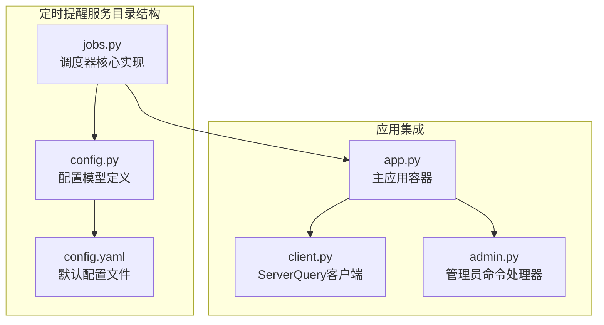
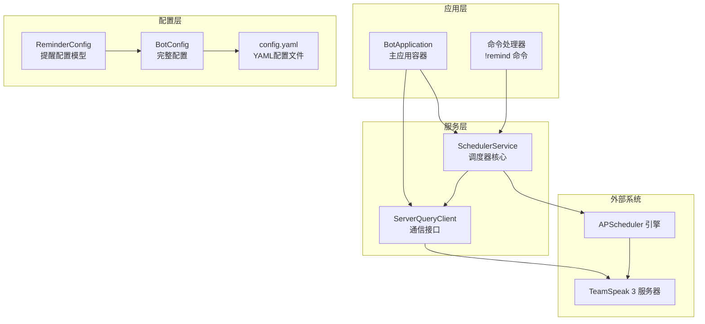
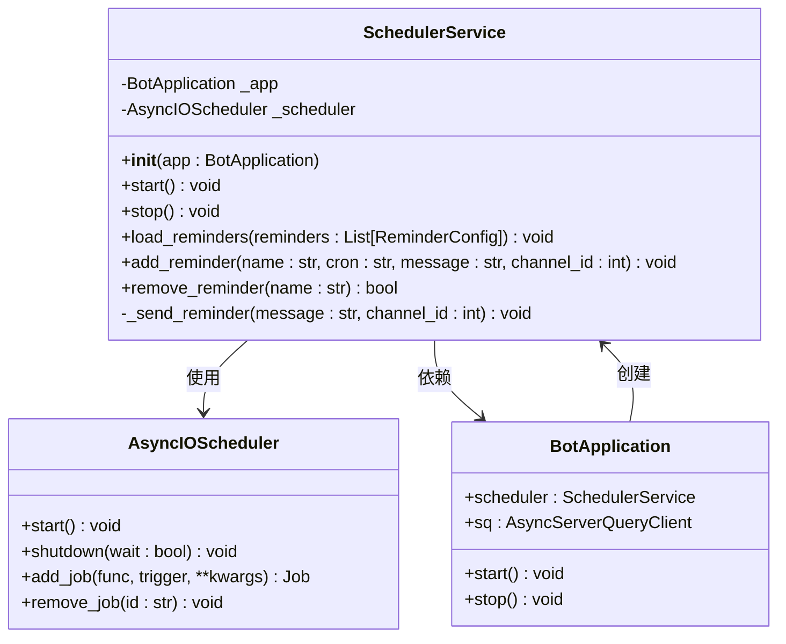
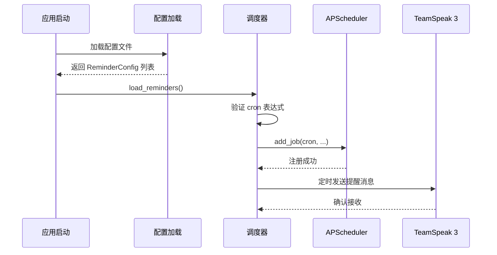
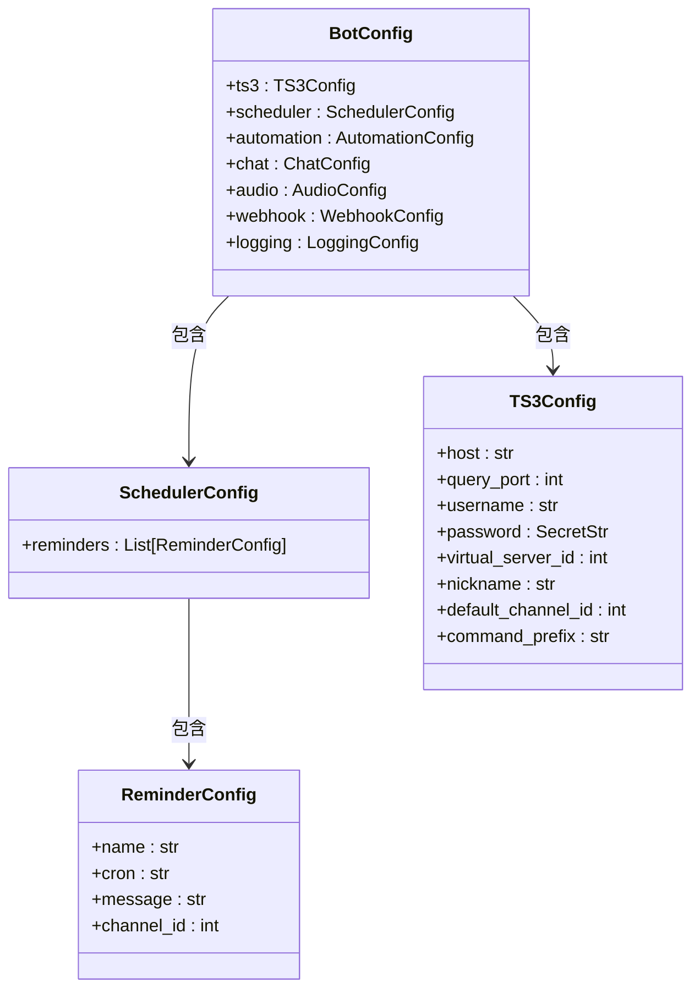
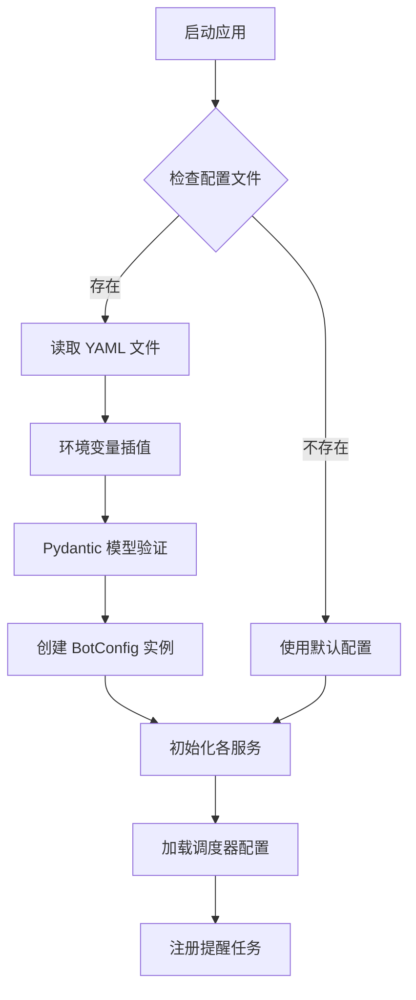
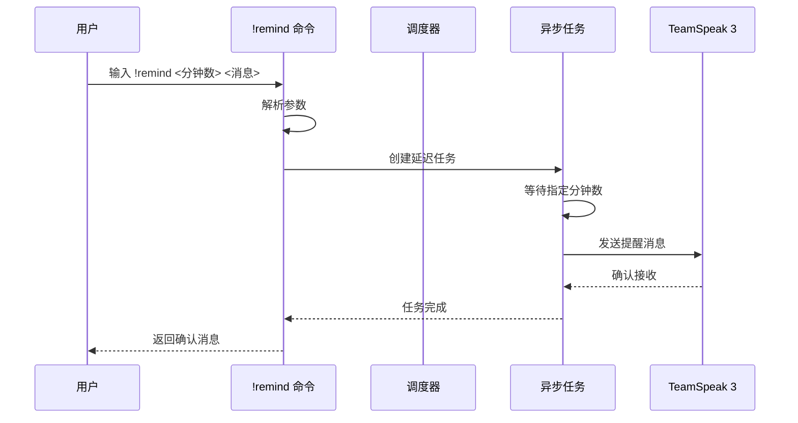
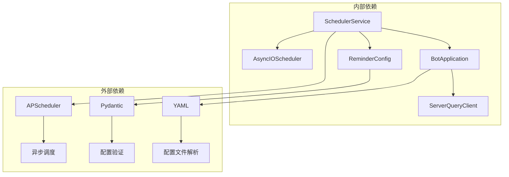
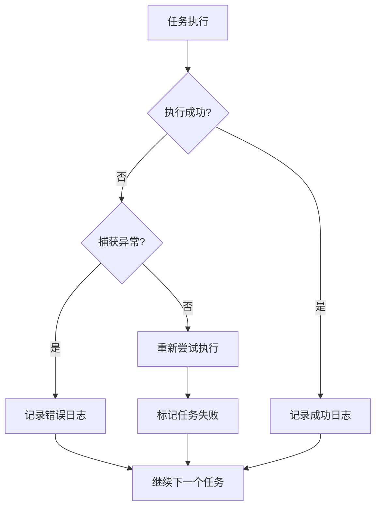

# 定时提醒服务

<cite>
**本文档引用的文件**
- [jobs.py](file://bot/services/scheduler/jobs.py)
- [app.py](file://bot/app.py)
- [config.py](file://bot/config.py)
- [config.yaml](file://config/config.yaml)
- [client.py](file://bot/core/serverquery/client.py)
- [admin.py](file://bot/core/commands/handlers/admin.py)
</cite>

## 目录
1. [简介](#简介)
2. [项目结构](#项目结构)
3. [核心组件](#核心组件)
4. [架构概览](#架构概览)
5. [详细组件分析](#详细组件分析)
6. [依赖关系分析](#依赖关系分析)
7. [性能考虑](#性能考虑)
8. [故障排除指南](#故障排除指南)
9. [结论](#结论)
10. [附录](#附录)

## 简介

定时提醒服务是基于 APScheduler 的异步任务调度系统，用于在 TeamSpeak 3 机器人中实现周期性提醒功能。该服务通过 cron 表达式精确控制任务执行时间，支持动态添加、修改和删除定时任务，并提供完整的任务执行监控和错误处理机制。

该服务集成了完整的配置管理系统，支持从 YAML 配置文件加载预定义的提醒任务，同时提供了运行时动态创建一次性提醒的能力。所有提醒任务都通过 ServerQuery 客户端发送到指定的频道或私聊目标。

## 项目结构

定时提醒服务位于项目的 `bot/services/scheduler/` 目录下，主要包含以下文件：



**图表来源**
- [jobs.py:1-90](file://bot/services/scheduler/jobs.py#L1-L90)
- [config.py:99-108](file://bot/config.py#L99-L108)
- [config.yaml:54-61](file://config/config.yaml#L54-L61)

**章节来源**
- [jobs.py:1-90](file://bot/services/scheduler/jobs.py#L1-L90)
- [config.py:1-160](file://bot/config.py#L1-L160)
- [config.yaml:1-76](file://config/config.yaml#L1-L76)

## 核心组件

定时提醒服务由以下核心组件构成：

### SchedulerService 类
- **职责**: 管理所有定时提醒任务的核心调度器
- **功能**: 任务添加、删除、启动停止、配置加载
- **调度引擎**: 基于 APScheduler 的异步调度器

### ReminderConfig 模型
- **职责**: 定义提醒任务的配置结构
- **字段**: 名称、cron 表达式、消息内容、频道 ID
- **验证**: 自动验证 cron 表达式的格式正确性

### BotApplication 集成
- **职责**: 将调度器集成到主应用生命周期中
- **生命周期**: 应用启动时自动加载配置中的提醒任务
- **优雅关闭**: 应用停止时安全关闭调度器

**章节来源**
- [jobs.py:18-90](file://bot/services/scheduler/jobs.py#L18-L90)
- [config.py:99-108](file://bot/config.py#L99-L108)
- [app.py:27-101](file://bot/app.py#L27-L101)

## 架构概览

定时提醒服务采用分层架构设计，确保了良好的可维护性和扩展性：



**图表来源**
- [app.py:27-101](file://bot/app.py#L27-L101)
- [jobs.py:18-32](file://bot/services/scheduler/jobs.py#L18-L32)
- [config.py:99-133](file://bot/config.py#L99-L133)

## 详细组件分析

### SchedulerService 调度器实现

SchedulerService 是定时提醒服务的核心组件，负责管理所有提醒任务的生命周期：



**图表来源**
- [jobs.py:18-90](file://bot/services/scheduler/jobs.py#L18-L90)
- [app.py:27-101](file://bot/app.py#L27-L101)

#### 任务调度算法

调度器使用 APScheduler 的 cron 触发器实现精确的时间调度：

- **Cron 表达式格式**: `minute hour day month day_of_week`
- **表达式验证**: 自动验证 cron 表达式的完整性
- **任务替换**: 支持同名任务的自动替换机制
- **异步执行**: 所有任务都在事件循环中异步执行

#### 时间管理机制



**图表来源**
- [jobs.py:33-74](file://bot/services/scheduler/jobs.py#L33-L74)
- [app.py:294-296](file://bot/app.py#L294-L296)

#### 任务执行监控

调度器实现了多层次的任务执行监控：

- **日志记录**: 详细的任务执行日志
- **异常捕获**: 自动捕获并记录任务执行异常
- **状态跟踪**: 支持任务的动态添加和删除

**章节来源**
- [jobs.py:18-90](file://bot/services/scheduler/jobs.py#L18-L90)

### 配置管理系统

配置系统采用 Pydantic 模型定义，提供了类型安全的配置管理：



**图表来源**
- [config.py:125-133](file://bot/config.py#L125-L133)
- [config.py:106-108](file://bot/config.py#L106-L108)
- [config.py:99-104](file://bot/config.py#L99-L104)

#### 配置加载流程



**图表来源**
- [config.py:136-160](file://bot/config.py#L136-L160)

**章节来源**
- [config.py:99-133](file://bot/config.py#L99-L133)
- [config.yaml:54-61](file://config/config.yaml#L54-L61)

### 动态提醒功能

除了配置文件中的静态提醒外，系统还支持运行时动态创建一次性提醒：



**图表来源**
- [admin.py:38-61](file://bot/core/commands/handlers/admin.py#L38-L61)

**章节来源**
- [admin.py:38-61](file://bot/core/commands/handlers/admin.py#L38-L61)

## 依赖关系分析

定时提醒服务的依赖关系清晰明确，遵循了单一职责原则：



**图表来源**
- [jobs.py:8-10](file://bot/services/scheduler/jobs.py#L8-L10)
- [config.py:8-9](file://bot/config.py#L8-L9)

### 外部依赖管理

- **APScheduler**: 提供异步任务调度能力
- **Pydantic**: 提供配置模型的类型安全验证
- **YAML**: 支持配置文件的灵活管理

**章节来源**
- [jobs.py:1-16](file://bot/services/scheduler/jobs.py#L1-L16)
- [config.py:1-10](file://bot/config.py#L1-L10)

## 性能考虑

### 资源使用优化

1. **内存管理**: 调度器仅在应用启动时创建一次实例
2. **CPU 使用**: 使用 APScheduler 的高效调度算法
3. **网络优化**: 通过 ServerQuery 客户端复用连接

### 任务执行效率

- **异步执行**: 所有提醒任务都是异步执行，不阻塞主事件循环
- **批量加载**: 支持从配置文件批量加载多个提醒任务
- **资源清理**: 应用停止时自动清理所有调度任务

### 故障恢复策略



**图表来源**
- [jobs.py:84-89](file://bot/services/scheduler/jobs.py#L84-L89)

## 故障排除指南

### 常见问题及解决方案

#### Cron 表达式错误
- **症状**: 任务无法正常添加
- **原因**: cron 表达式格式不正确
- **解决**: 检查 cron 表达式的五个部分是否完整

#### ServerQuery 连接问题
- **症状**: 提醒消息无法发送
- **原因**: ServerQuery 连接中断
- **解决**: 检查网络连接和服务器状态

#### 配置文件加载失败
- **症状**: 应用启动时报配置错误
- **原因**: YAML 格式错误或字段缺失
- **解决**: 验证配置文件格式和必需字段

**章节来源**
- [jobs.py:55-58](file://bot/services/scheduler/jobs.py#L55-L58)
- [config.py:136-160](file://bot/config.py#L136-L160)

## 结论

定时提醒服务是一个设计精良的异步任务调度系统，具有以下特点：

1. **可靠性**: 基于成熟的 APScheduler 库，提供稳定的任务调度能力
2. **易用性**: 简单的 cron 表达式语法，易于理解和使用
3. **可扩展性**: 清晰的架构设计，便于功能扩展和定制
4. **可观测性**: 完善的日志记录和错误处理机制

该服务为 TeamSpeak 3 机器人提供了强大的自动化提醒功能，可以满足各种场景下的定时通知需求。

## 附录

### 任务配置示例

#### 静态配置（config.yaml）
```yaml
scheduler:
  reminders:
    - name: "daily_greeting"
      cron: "0 9 * * *"
      message: "早上好！新的一天开始了"
      channel_id: 0
    - name: "evening_reminder"
      cron: "0 18 * * *"
      message: "下午好！记得休息一下"
      channel_id: 0
```

#### 动态配置（运行时创建）
使用 `!remind` 命令创建一次性提醒：
```
!remind 30 该休息了
```

### Cron 表达式参考

| 字段 | 允许值 | 描述 |
|------|--------|------|
| minute | 0-59 | 分钟 |
| hour | 0-23 | 小时 |
| day | 1-31 | 日期 |
| month | 1-12 | 月份 |
| day_of_week | 0-6 | 星期（0=星期日） |

### 扩展开发指南

#### 添加新的调度器功能
1. 在 `SchedulerService` 中添加新方法
2. 更新相应的日志记录
3. 测试新功能的正确性

#### 集成新的消息渠道
1. 扩展 `ServerQueryClient` 的消息发送方法
2. 更新调度器以支持新的目标类型
3. 添加相应的配置选项

#### 性能监控增强
1. 添加任务执行时间统计
2. 实现任务失败重试机制
3. 添加资源使用监控