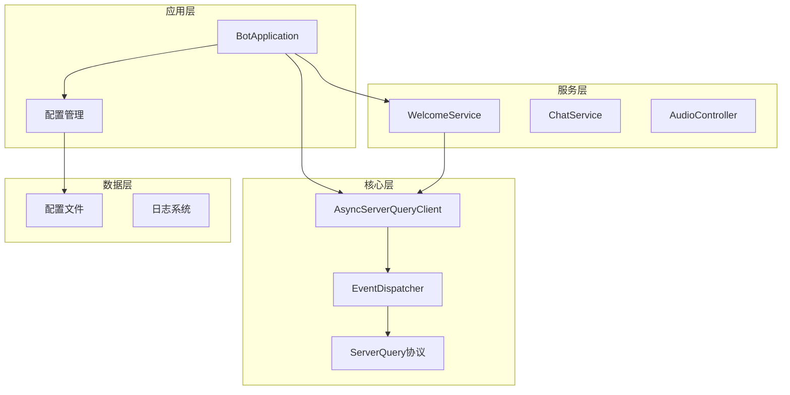
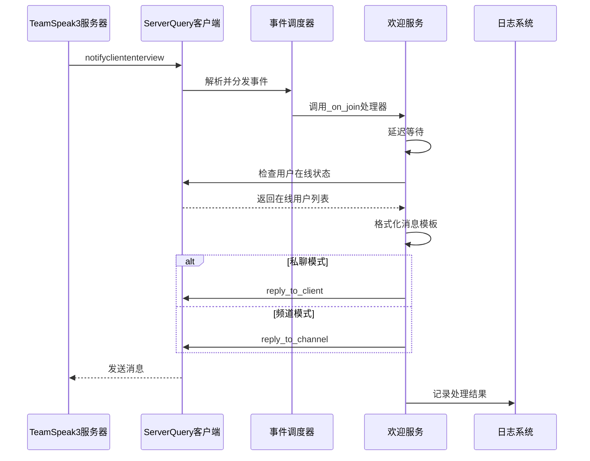
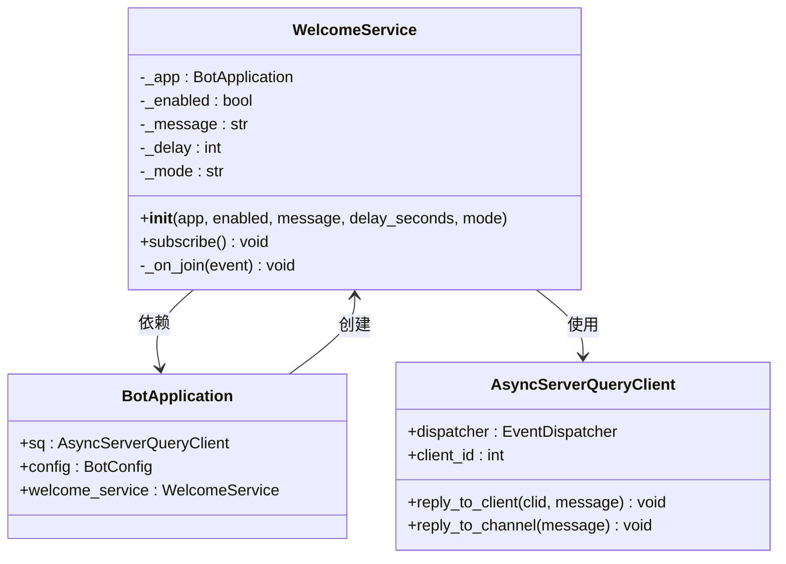
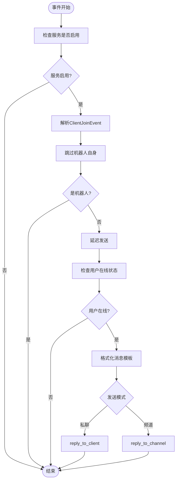
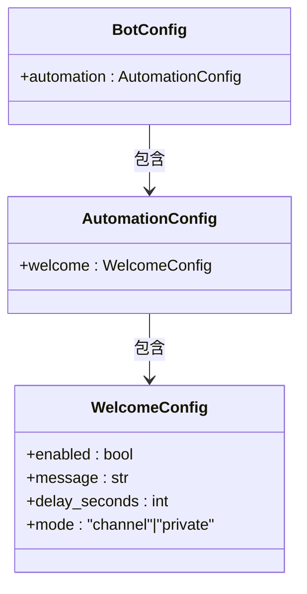
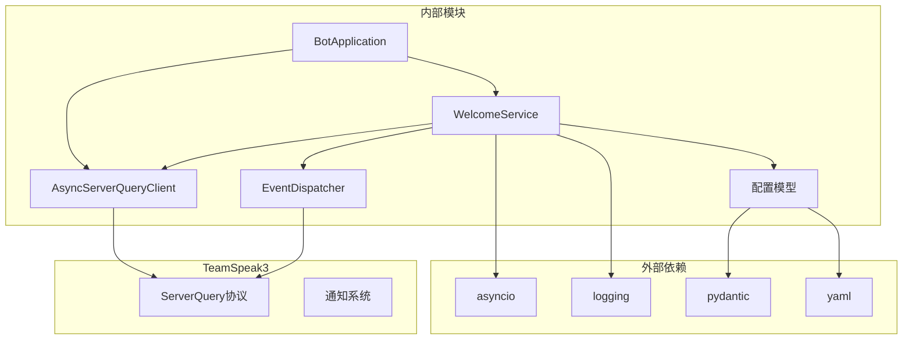

# 欢迎消息系统

<cite>
**本文档引用的文件**
- [welcome.py](file://bot/services/automation/welcome.py)
- [events.py](file://bot/core/serverquery/events.py)
- [client.py](file://bot/core/serverquery/client.py)
- [app.py](file://bot/app.py)
- [config.py](file://bot/config.py)
- [config.yaml](file://config/config.yaml)
- [formatting.py](file://bot/utils/formatting.py)
- [admin.py](file://bot/core/commands/handlers/admin.py)
</cite>

## 目录
1. [简介](#简介)
2. [项目结构](#项目结构)
3. [核心组件](#核心组件)
4. [架构概览](#架构概览)
5. [详细组件分析](#详细组件分析)
6. [依赖关系分析](#依赖关系分析)
7. [性能考虑](#性能考虑)
8. [故障排除指南](#故障排除指南)
9. [结论](#结论)
10. [附录](#附录)

## 简介

欢迎消息系统是 TeamSpeak3 机器人中的一个自动化功能模块，负责在新用户加入服务器时自动发送欢迎消息。该系统实现了完整的事件驱动架构，包括事件订阅机制、消息格式化、延迟发送策略和多种消息发送模式。

本系统基于异步编程模型，使用 Python 的 asyncio 库实现非阻塞的事件处理和消息发送。通过 ServerQuery 协议与 TeamSpeak3 服务器通信，支持频道广播和私聊两种消息发送模式。

## 项目结构

欢迎消息系统位于项目的自动化服务模块中，采用分层架构设计：



**图表来源**
- [app.py:27-111](file://bot/app.py#L27-L111)
- [welcome.py:17-33](file://bot/services/automation/welcome.py#L17-L33)

**章节来源**
- [app.py:1-348](file://bot/app.py#L1-L348)
- [welcome.py:1-71](file://bot/services/automation/welcome.py#L1-L71)

## 核心组件

### WelcomeService 类

WelcomeService 是欢迎消息系统的核心类，负责处理用户加入事件并发送相应的欢迎消息。

#### 主要特性
- **事件订阅**: 自动订阅客户端加入事件
- **消息格式化**: 支持模板化的消息格式
- **延迟发送**: 防止消息刷屏的延迟机制
- **多模式发送**: 支持频道广播和私聊模式
- **异常处理**: 完善的错误处理和日志记录

#### 关键方法
- `subscribe()`: 订阅客户端加入事件
- `_on_join()`: 处理客户端加入事件的核心逻辑
- 内部属性: `_enabled`, `_message`, `_delay`, `_mode`

**章节来源**
- [welcome.py:17-71](file://bot/services/automation/welcome.py#L17-L71)

### 事件系统

系统使用轻量级的发布/订阅事件调度器来处理 ServerQuery 通知。

#### 事件类型
- `ClientJoinEvent`: 客户端加入事件
- `ClientLeaveEvent`: 客户端离开事件  
- `TextMessageEvent`: 文本消息事件
- `ClientMovedEvent`: 客户端移动事件

#### 事件调度器
- `EventDispatcher`: 轻量级事件分发器
- 支持异步事件处理
- 错误安全的回调调用

**章节来源**
- [events.py:18-156](file://bot/core/serverquery/events.py#L18-L156)

### ServerQuery 客户端

AsyncServerQueryClient 提供与 TeamSpeak3 服务器的异步通信能力。

#### 核心功能
- 异步连接管理
- 命令队列和序列化执行
- 事件注册和路由
- 自动重连机制

#### 发送方法
- `reply_to_client()`: 私聊发送
- `reply_to_channel()`: 频道广播
- `send_text_message()`: 通用文本消息发送

**章节来源**
- [client.py:27-406](file://bot/core/serverquery/client.py#L27-L406)

## 架构概览

欢迎消息系统的整体架构采用事件驱动的设计模式：



**图表来源**
- [welcome.py:39-71](file://bot/services/automation/welcome.py#L39-L71)
- [events.py:139-156](file://bot/core/serverquery/events.py#L139-L156)
- [client.py:356-363](file://bot/core/serverquery/client.py#L356-L363)

## 详细组件分析

### WelcomeService 实现详解

#### 初始化过程
WelcomeService 在初始化时接收应用实例和配置参数：



**图表来源**
- [welcome.py:20-33](file://bot/services/automation/welcome.py#L20-L33)
- [app.py:77-83](file://bot/app.py#L77-L83)

#### 事件订阅机制

WelcomeService 通过以下流程实现事件订阅：

1. **配置检查**: 验证服务是否启用
2. **订阅注册**: 向事件调度器注册客户端加入事件处理器
3. **事件类型**: 订阅 `cliententerview` 事件类型

**章节来源**
- [welcome.py:34-37](file://bot/services/automation/welcome.py#L34-L37)
- [app.py:158-158](file://bot/app.py#L158-L158)

#### ClientJoinEvent 处理流程

事件处理的核心逻辑如下：



**图表来源**
- [welcome.py:39-71](file://bot/services/automation/welcome.py#L39-L71)

#### 消息格式化机制

系统支持模板化的消息格式，当前支持的占位符：
- `{username}`: 用户昵称
- `{uid}`: 用户唯一标识符

消息格式化使用 Python 的字符串格式化功能，确保消息内容的动态生成。

**章节来源**
- [welcome.py:58-62](file://bot/services/automation/welcome.py#L58-L62)

#### 延迟发送策略

延迟发送机制包含以下步骤：

1. **固定延迟**: 默认 2 秒延迟，防止消息刷屏
2. **状态验证**: 延迟后再次检查用户在线状态
3. **连接检查**: 通过 `client_list()` API 获取当前在线用户列表
4. **幂等性保证**: 确保用户仍在服务器上

**章节来源**
- [welcome.py:46-56](file://bot/services/automation/welcome.py#L46-L56)

#### 消息发送模式

系统支持两种发送模式：

| 模式 | 方法 | 用途 | 适用场景 |
|------|------|------|----------|
| 频道模式 | `reply_to_channel()` | 广播欢迎消息 | 公共频道，所有用户可见 |
| 私聊模式 | `reply_to_client()` | 一对一欢迎 | 特定用户或管理员 |

**章节来源**
- [welcome.py:64-68](file://bot/services/automation/welcome.py#L64-L68)
- [client.py:356-363](file://bot/core/serverquery/client.py#L356-L363)

### 配置参数详解

欢迎消息系统通过配置文件进行参数管理：

#### 配置结构



**图表来源**
- [config.py:74-79](file://bot/config.py#L74-L79)
- [config.py:93-96](file://bot/config.py#L93-L96)

#### 参数说明

| 参数名 | 类型 | 默认值 | 描述 | 示例 |
|--------|------|--------|------|------|
| enabled | bool | True | 是否启用欢迎消息功能 | `true` |
| message | str | "欢迎 {username} 来到我们的游戏频道！输入 !help 查看可用命令" | 欢迎消息模板 | `"欢迎 {username}!"` |
| delay_seconds | int | 2 | 发送延迟时间（秒） | `2` |
| mode | str | "channel" | 发送模式，可选值：`"channel"` 或 `"private"` | `"private"` |

**章节来源**
- [config.py:74-79](file://bot/config.py#L74-L79)
- [config.yaml:40-44](file://config/config.yaml#L40-L44)

### 实际使用示例

#### 基础配置示例

```yaml
automation:
  welcome:
    enabled: true
    message: "欢迎 {username} 加入我们的服务器！UID: {uid}"
    delay_seconds: 3
    mode: "channel"
```

#### 私聊模式配置

```yaml
automation:
  welcome:
    enabled: true
    message: "欢迎 {username}！请查看频道规则"
    delay_seconds: 2
    mode: "private"
```

#### 动态修改消息模板

系统提供了命令行接口来动态修改欢迎消息模板：

```bash
!welcome 欢迎 {username}！请遵守服务器规则
```

**章节来源**
- [admin.py:67-74](file://bot/core/commands/handlers/admin.py#L67-L74)

## 依赖关系分析

欢迎消息系统的依赖关系图：



**图表来源**
- [welcome.py:1-14](file://bot/services/automation/welcome.py#L1-L14)
- [events.py:1-12](file://bot/core/serverquery/events.py#L1-L12)
- [client.py:1-15](file://bot/core/serverquery/client.py#L1-L15)
- [config.py:1-9](file://bot/config.py#L1-L9)

### 组件耦合度分析

欢迎消息系统具有良好的模块化设计：

- **低耦合**: WelcomeService 仅依赖 BotApplication 接口
- **高内聚**: 所有欢迎消息相关的逻辑集中在单一类中
- **清晰边界**: 与 ServerQuery 客户端的交互通过明确的方法接口

**章节来源**
- [welcome.py:20-33](file://bot/services/automation/welcome.py#L20-L33)
- [app.py:77-83](file://bot/app.py#L77-L83)

## 性能考虑

### 异步处理优势

系统采用异步编程模型带来以下性能优势：

1. **非阻塞 I/O**: 事件处理不会阻塞其他操作
2. **并发处理**: 可以同时处理多个用户加入事件
3. **资源效率**: 减少线程切换开销

### 优化建议

#### 连接池管理
- 考虑实现 ServerQuery 连接池以提高并发性能
- 实现连接复用机制减少连接建立开销

#### 缓存策略
- 缓存用户信息减少重复查询
- 实现消息模板缓存机制

#### 监控指标
- 添加事件处理时间统计
- 监控消息发送成功率
- 实现告警机制检测异常情况

## 故障排除指南

### 常见问题及解决方案

#### 问题1: 欢迎消息不发送

**可能原因**:
- 服务未启用
- 机器人自身触发事件
- 用户在延迟期间离开

**解决方法**:
1. 检查配置文件中的 `enabled` 参数
2. 验证事件订阅是否成功
3. 检查延迟时间设置是否合理

**章节来源**
- [welcome.py:36-44](file://bot/services/automation/welcome.py#L36-L44)

#### 问题2: 私聊模式无法正常工作

**可能原因**:
- 用户权限不足
- 服务器设置限制
- 网络连接问题

**解决方法**:
1. 确认机器人具有发送私聊消息的权限
2. 检查服务器的隐私设置
3. 验证网络连接稳定性

#### 问题3: 消息格式化错误

**可能原因**:
- 模板变量缺失
- 字符编码问题
- 特殊字符处理

**解决方法**:
1. 验证消息模板中的占位符
2. 检查特殊字符的转义处理
3. 测试不同用户的用户名长度

### 日志分析

系统提供了详细的日志记录机制：

#### 关键日志点
- 事件订阅成功日志
- 消息发送异常日志
- 用户状态检查日志

#### 日志级别
- DEBUG: 详细的操作跟踪
- INFO: 正常运行状态
- WARNING: 可能的问题
- ERROR: 严重错误

**章节来源**
- [welcome.py:69-70](file://bot/services/automation/welcome.py#L69-L70)

## 结论

欢迎消息系统是一个设计精良的自动化功能模块，具有以下特点：

### 技术优势
- **事件驱动架构**: 基于异步事件处理，响应迅速
- **模块化设计**: 良好的职责分离和接口定义
- **配置灵活**: 支持运行时配置修改
- **错误处理**: 完善的异常捕获和恢复机制

### 扩展性
- 易于添加新的事件类型
- 支持自定义消息模板
- 可扩展的消息发送模式
- 灵活的配置管理

### 改进建议
1. 添加消息发送确认机制
2. 实现消息模板预览功能
3. 增加用户反馈收集
4. 优化性能监控和告警

该系统为 TeamSpeak3 机器人提供了一个稳定可靠的欢迎消息功能，能够有效提升用户体验和社区活跃度。

## 附录

### API 参考

#### WelcomeService 方法

| 方法名 | 参数 | 返回值 | 描述 |
|--------|------|--------|------|
| `subscribe` | 无 | `None` | 订阅客户端加入事件 |
| `_on_join` | `event: SQEvent` | `None` | 处理客户端加入事件 |

#### 配置参数参考

| 参数名 | 类型 | 必需 | 默认值 | 描述 |
|--------|------|------|--------|------|
| `enabled` | `bool` | 否 | `True` | 是否启用功能 |
| `message` | `str` | 否 | 标准欢迎消息 | 消息模板字符串 |
| `delay_seconds` | `int` | 否 | `2` | 延迟发送时间（秒） |
| `mode` | `"channel"|"private"` | 否 | `"channel"` | 发送模式 |

### 最佳实践

1. **合理设置延迟时间**: 避免过短导致刷屏，过长影响用户体验
2. **使用合适的模板**: 包含必要的用户信息但保持简洁
3. **监控系统性能**: 定期检查消息发送成功率
4. **测试不同场景**: 验证私聊和频道模式的功能
5. **备份配置**: 定期备份配置文件以防意外修改