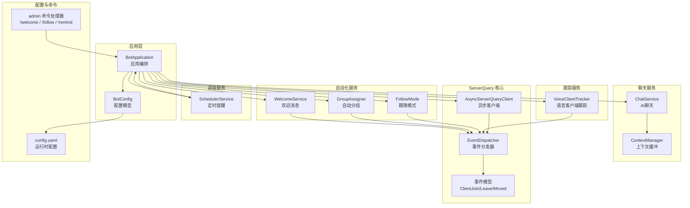
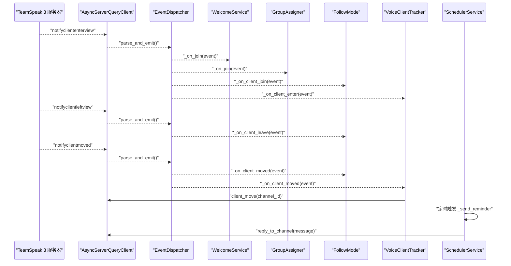
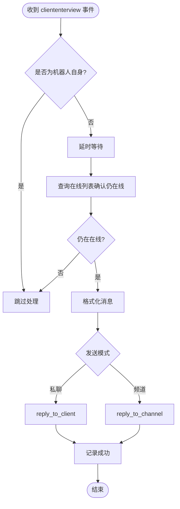
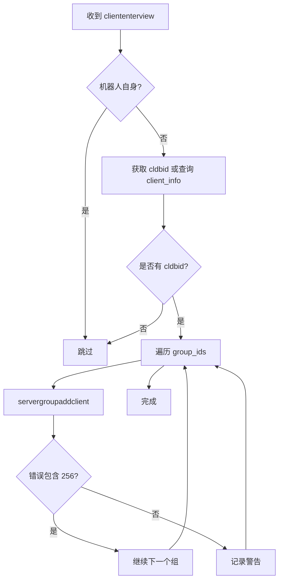
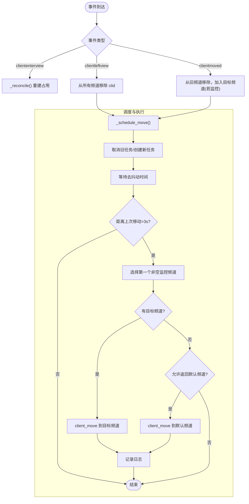
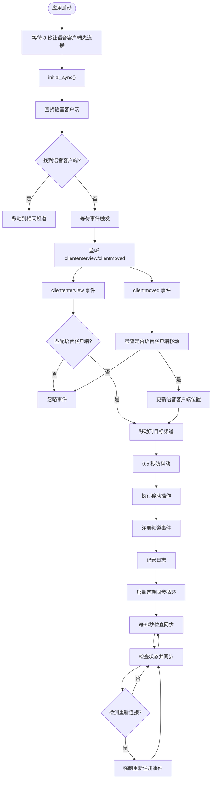
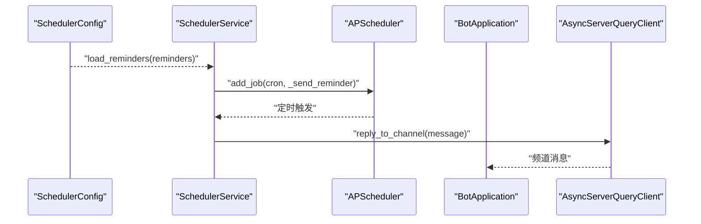
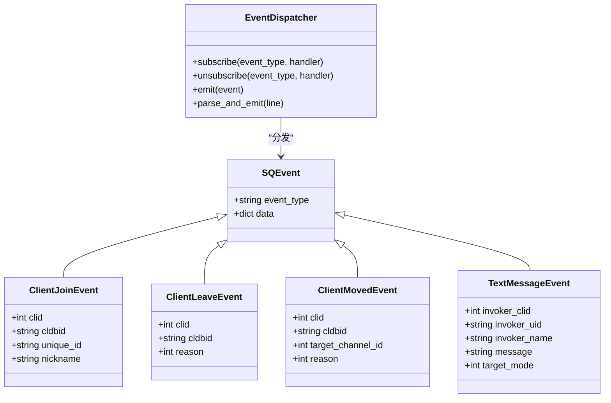
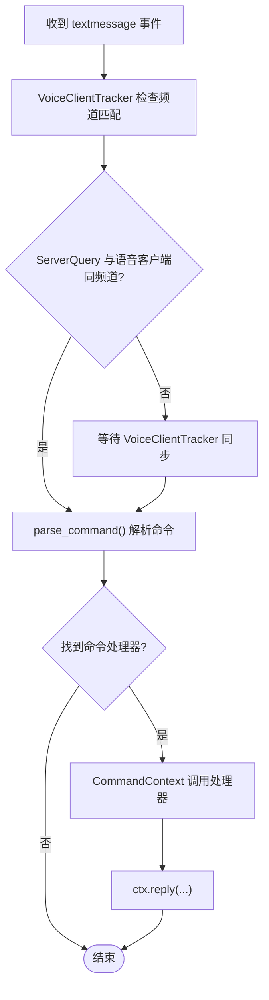
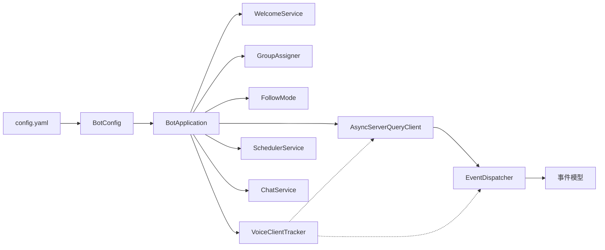

# 用户自动化服务

<cite>
**本文档引用的文件**
- [bot/services/automation/welcome.py](file://bot/services/automation/welcome.py)
- [bot/services/automation/groups.py](file://bot/services/automation/groups.py)
- [bot/services/automation/follow.py](file://bot/services/automation/follow.py)
- [bot/services/tracking/voice_tracker.py](file://bot/services/tracking/voice_tracker.py)
- [bot/services/scheduler/jobs.py](file://bot/services/scheduler/jobs.py)
- [bot/services/chat/service.py](file://bot/services/chat/service.py)
- [bot/services/chat/context.py](file://bot/services/chat/context.py)
- [bot/app.py](file://bot/app.py)
- [bot/config.py](file://bot/config.py)
- [bot/core/serverquery/events.py](file://bot/core/serverquery/events.py)
- [bot/core/serverquery/client.py](file://bot/core/serverquery/client.py)
- [bot/core/commands/handlers/admin.py](file://bot/core/commands/handlers/admin.py)
- [config/config.yaml](file://config/config.yaml)
</cite>

## 更新摘要
**变更内容**
- 新增 VoiceClientTracker 语音客户端跟踪服务章节
- 更新架构总览图以包含语音客户端跟踪功能
- 更新应用初始化流程说明
- 新增语音客户端跟踪与命令路由机制章节
- 更新依赖关系分析以反映新的跟踪服务
- **重大功能增强**：VoiceClientTracker 新增通道级事件注册机制、定期同步循环、内部状态管理优化以及改进的错误处理机制

## 目录
1. [简介](#简介)
2. [项目结构](#项目结构)
3. [核心组件](#核心组件)
4. [架构总览](#架构总览)
5. [详细组件分析](#详细组件分析)
6. [依赖关系分析](#依赖关系分析)
7. [性能考虑](#性能考虑)
8. [故障排除指南](#故障排除指南)
9. [结论](#结论)
10. [附录](#附录)

## 简介
本项目是一个基于 TeamSpeak 3 的自动化机器人服务，重点围绕"用户自动化"能力构建，包括：
- 欢迎消息系统：新成员加入时自动发送欢迎消息（支持频道广播或私聊）
- 自动分组机制：新成员加入时自动分配服务器组
- 跟随模式：机器人跟随用户进入监控频道，并在频道无人时返回默认频道
- **语音客户端跟踪服务**：实时跟踪语音客户端位置，确保 ServerQuery 能在任何频道接收用户命令
- 定时提醒服务：基于 APScheduler 的周期性提醒任务
- 事件驱动架构：通过 ServerQuery 事件分发器实现松耦合的消息路由与自动化触发
- 用户状态跟踪与消息路由：通过事件模型与上下文缓冲区实现状态感知与消息分发

本技术文档将从系统架构、组件设计、数据流、处理逻辑、错误处理、性能优化与最佳实践等维度进行深入剖析，并提供配置方法与扩展指南。

## 项目结构
项目采用按功能域划分的模块化组织方式，核心自动化服务位于 `bot/services/automation/`，**语音客户端跟踪服务位于 `bot/services/tracking/`**，调度服务位于 `bot/services/scheduler/`，聊天服务位于 `bot/services/chat/`，应用入口与配置位于 `bot/app.py` 和 `bot/config.py`，ServerQuery 事件与客户端位于 `bot/core/serverquery/`，配置文件位于 `config/config.yaml`。

**图表来源**
- [bot/app.py:27-161](file://bot/app.py#L27-L161)
- [bot/services/automation/welcome.py:17-71](file://bot/services/automation/welcome.py#L17-L71)
- [bot/services/automation/groups.py:17-66](file://bot/services/automation/groups.py#L17-L66)
- [bot/services/automation/follow.py:22-176](file://bot/services/automation/follow.py#L22-L176)
- [bot/services/tracking/voice_tracker.py:30-181](file://bot/services/tracking/voice_tracker.py#L30-L181)
- [bot/services/scheduler/jobs.py:18-90](file://bot/services/scheduler/jobs.py#L18-L90)
- [bot/services/chat/service.py:15-115](file://bot/services/chat/service.py#L15-L115)
- [bot/services/chat/context.py:18-101](file://bot/services/chat/context.py#L18-L101)
- [bot/core/serverquery/client.py:27-406](file://bot/core/serverquery/client.py#L27-L406)
- [bot/core/serverquery/events.py:102-156](file://bot/core/serverquery/events.py#L102-L156)
- [bot/core/commands/handlers/admin.py:17-75](file://bot/core/commands/handlers/admin.py#L17-L75)
- [config/config.yaml:1-76](file://config/config.yaml#L1-L76)

**章节来源**
- [bot/app.py:27-161](file://bot/app.py#L27-L161)
- [config/config.yaml:1-76](file://config/config.yaml#L1-L76)

## 核心组件
- 欢迎消息服务：订阅客户端加入事件，延迟后检查在线状态，格式化消息并发送至频道或私聊
- 自动分组服务：订阅客户端加入事件，获取数据库 ID 后批量添加服务器组，忽略重复添加错误
- 跟随模式：维护监控频道的占用表，去抖动与速率限制，根据占用情况移动机器人
- **语音客户端跟踪服务**：实时跟踪语音客户端位置，确保 ServerQuery 能在任何频道接收用户命令
- 定时提醒服务：基于 APScheduler 的 Cron 表达式调度，向指定频道发送提醒消息
- 事件驱动架构：EventDispatcher 提供轻量级发布/订阅，ServerQuery 客户端负责连接、事件注册与消息发送
- 用户状态跟踪与消息路由：通过事件模型与上下文缓冲实现状态感知与消息分发

**章节来源**
- [bot/services/automation/welcome.py:17-71](file://bot/services/automation/welcome.py#L17-L71)
- [bot/services/automation/groups.py:17-66](file://bot/services/automation/groups.py#L17-L66)
- [bot/services/automation/follow.py:22-176](file://bot/services/automation/follow.py#L22-L176)
- [bot/services/tracking/voice_tracker.py:30-181](file://bot/services/tracking/voice_tracker.py#L30-L181)
- [bot/services/scheduler/jobs.py:18-90](file://bot/services/scheduler/jobs.py#L18-L90)
- [bot/core/serverquery/events.py:102-156](file://bot/core/serverquery/events.py#L102-L156)
- [bot/core/serverquery/client.py:27-406](file://bot/core/serverquery/client.py#L27-L406)

## 架构总览
系统采用事件驱动与模块化编排：
- 应用层负责装配各服务、注册命令与事件监听、启动调度器与 Webhook
- ServerQuery 客户端维持长连接，事件分发器将通知事件投递到对应服务
- 自动化服务通过事件回调实现无侵入的业务逻辑
- **语音客户端跟踪服务实时同步 ServerQuery 与语音客户端的位置，确保命令路由不受频道限制**
- 调度服务独立于事件流，按计划执行周期性任务
- 聊天服务提供对话上下文与 AI 接口集成

**图表来源**
- [bot/core/serverquery/client.py:201-254](file://bot/core/serverquery/client.py#L201-L254)
- [bot/core/serverquery/events.py:139-156](file://bot/core/serverquery/events.py#L139-L156)
- [bot/services/automation/welcome.py:39-71](file://bot/services/automation/welcome.py#L39-L71)
- [bot/services/automation/groups.py:36-66](file://bot/services/automation/groups.py#L36-L66)
- [bot/services/automation/follow.py:71-102](file://bot/services/automation/follow.py#L71-L102)
- [bot/services/tracking/voice_tracker.py:104-150](file://bot/services/tracking/voice_tracker.py#L104-L150)
- [bot/services/scheduler/jobs.py:84-90](file://bot/services/scheduler/jobs.py#L84-L90)

## 详细组件分析

### 欢迎消息系统
- 订阅事件：当启用时，订阅客户端加入事件
- 延迟与防刷：加入后延迟若干秒，再次确认在线状态，避免机器人自身触发与重复欢迎
- 消息格式化：支持用户名与唯一标识占位符
- 发送策略：支持频道广播或私聊发送，异常捕获并记录日志

**图表来源**
- [bot/services/automation/welcome.py:39-71](file://bot/services/automation/welcome.py#L39-L71)
- [bot/core/serverquery/client.py:356-364](file://bot/core/serverquery/client.py#L356-L364)

**章节来源**
- [bot/services/automation/welcome.py:17-71](file://bot/services/automation/welcome.py#L17-L71)
- [bot/core/serverquery/client.py:356-364](file://bot/core/serverquery/client.py#L356-L364)

### 自动分组机制
- 订阅事件：启用且配置了目标组 ID 时订阅客户端加入事件
- 获取数据库 ID：若事件中未携带则通过 client_info 查询
- 批量添加：遍历组 ID 添加，忽略"已在组内"的错误码
- 异常处理：记录警告日志，不影响后续组添加

**图表来源**
- [bot/services/automation/groups.py:36-66](file://bot/services/automation/groups.py#L36-L66)
- [bot/core/serverquery/client.py:384-391](file://bot/core/serverquery/client.py#L384-L391)

**章节来源**
- [bot/services/automation/groups.py:17-66](file://bot/services/automation/groups.py#L17-L66)
- [bot/core/serverquery/client.py:384-391](file://bot/core/serverquery/client.py#L384-L391)

### 跟随模式
- 监控频道：维护一组监控频道的占用集合
- 事件处理：
  - 加入：重建占用映射并调度移动
  - 离开：移除占用并调度移动
  - 移动：从旧频道移除，若目标在监控频道则加入
- 去抖动与速率限制：使用任务取消与最小移动间隔，避免频繁移动
- 决策逻辑：优先选择有人的监控频道；若均为空且允许返回，默认频道

**图表来源**
- [bot/services/automation/follow.py:71-176](file://bot/services/automation/follow.py#L71-L176)
- [bot/core/serverquery/client.py:380-383](file://bot/core/serverquery/client.py#L380-L383)

**章节来源**
- [bot/services/automation/follow.py:22-176](file://bot/services/automation/follow.py#L22-L176)
- [bot/core/serverquery/client.py:380-383](file://bot/core/serverquery/client.py#L380-L383)

### 语音客户端跟踪服务
**重大功能增强**：VoiceClientTracker 服务经过重大升级，解决了 ServerQuery 文本频道事件只能接收来自 ServerQuery 客户端所在频道消息的问题，使机器人能够在任何频道接收用户命令。

#### 核心功能增强

**1. 通道级事件注册机制**
- **新增**：`_register_channel_events()` 方法实现了 per-channel 事件注册
- **重要性**：TS3 ServerQuery 需要 `event=channel id={cid}` 才能接收 `clientmoved` 通知
- **实现**：每次语音客户端移动时重新注册对应频道的事件

**2. 定期同步循环**
- **新增**：`_periodic_sync_loop()` 实现每30秒的定期同步
- **目的**：作为事件跟踪的后备机制，防止事件丢失
- **实现**：后台任务持续运行，检查并同步状态

**3. 内部状态管理优化**
- **新增**：`_registered_channel_id` 字段跟踪已注册的频道
- **目的**：避免重复注册频道事件，提高效率
- **实现**：比较当前频道与已注册频道，仅在需要时重新注册

**4. 改进的错误处理机制**
- **增强**：改进的异常处理和日志记录
- **错误码处理**：专门处理 "already member of channel" (错误码 770)
- **调试信息**：详细的日志记录帮助故障诊断

**5. ServerQuery 重新连接检测机制**
- **新增**：通过跟踪 `clid` 变化来检测重新连接
- **实现**：在定期同步中检测 `current_sq_clid != self._sq_clid`
- **效果**：重新注册频道事件，确保事件监听正常工作

**图表来源**
- [bot/services/tracking/voice_tracker.py:70-83](file://bot/services/tracking/voice_tracker.py#L70-L83)
- [bot/services/tracking/voice_tracker.py:84-95](file://bot/services/tracking/voice_tracker.py#L84-L95)
- [bot/services/tracking/voice_tracker.py:253-276](file://bot/services/tracking/voice_tracker.py#L253-L276)
- [bot/services/tracking/voice_tracker.py:345-367](file://bot/services/tracking/voice_tracker.py#L345-L367)

**章节来源**
- [bot/services/tracking/voice_tracker.py:30-181](file://bot/services/tracking/voice_tracker.py#L30-L181)

### 定时提醒服务
- 基于 APScheduler 的 Cron 调度
- 配置加载：从配置读取多个提醒项，逐个注册为 Cron 作业
- 执行流程：触发时调用 ServerQuery 客户端向频道发送消息
- 动态提醒：命令处理器也提供了基于 asyncio.delay 的动态提醒示例

**图表来源**
- [bot/services/scheduler/jobs.py:33-90](file://bot/services/scheduler/jobs.py#L33-L90)
- [bot/app.py:294-296](file://bot/app.py#L294-L296)
- [bot/core/commands/handlers/admin.py:38-61](file://bot/core/commands/handlers/admin.py#L38-L61)

**章节来源**
- [bot/services/scheduler/jobs.py:18-90](file://bot/services/scheduler/jobs.py#L18-L90)
- [bot/app.py:294-296](file://bot/app.py#L294-L296)
- [bot/core/commands/handlers/admin.py:38-61](file://bot/core/commands/handlers/admin.py#L38-L61)

### 事件驱动架构与消息路由
- 事件模型：定义了基础事件与多种具体事件（加入、离开、移动、文本消息）
- 事件分发器：提供订阅/取消订阅/安全调用/解析与发射
- ServerQuery 客户端：在读取循环中识别 notify 行并交由分发器处理
- **语音客户端跟踪服务确保 ServerQuery 与语音客户端同频道，从而保证文本消息路由不受频道限制**
- 文本消息路由：应用层将文本消息事件转交给命令解析器与注册表

**图表来源**
- [bot/core/serverquery/events.py:18-100](file://bot/core/serverquery/events.py#L18-L100)
- [bot/core/serverquery/events.py:102-156](file://bot/core/serverquery/events.py#L102-L156)

**章节来源**
- [bot/core/serverquery/events.py:18-156](file://bot/core/serverquery/events.py#L18-L156)
- [bot/core/serverquery/client.py:201-254](file://bot/core/serverquery/client.py#L201-L254)
- [bot/app.py:162-198](file://bot/app.py#L162-L198)

### 用户状态跟踪与消息路由机制
- 用户状态跟踪：FollowMode 维护监控频道的占用集合，结合去抖动与速率限制保证稳定性
- **语音客户端跟踪**：VoiceClientTracker 确保 ServerQuery 与语音客户端同频道，从而保证命令路由不受频道限制
- 消息路由：应用层将文本消息事件转换为命令对象，通过注册表查找处理器并执行
- 上下文缓冲：聊天服务使用 ContextManager 为每个频道或用户 UID 维护滑动窗口上下文，支持令牌估算与裁剪

**图表来源**
- [bot/app.py:162-198](file://bot/app.py#L162-L198)
- [bot/services/chat/context.py:68-101](file://bot/services/chat/context.py#L68-L101)
- [bot/services/tracking/voice_tracker.py:152-180](file://bot/services/tracking/voice_tracker.py#L152-L180)

**章节来源**
- [bot/app.py:162-198](file://bot/app.py#L162-L198)
- [bot/services/chat/context.py:18-101](file://bot/services/chat/context.py#L18-L101)

## 依赖关系分析
- 组件耦合：自动化服务均依赖 BotApplication 与 AsyncServerQueryClient，通过事件分发器解耦
- **新增依赖**：VoiceClientTracker 依赖 EventDispatcher 和 ServerQuery 客户端，但不与其他自动化服务直接耦合
- 外部依赖：APScheduler 用于定时任务；OpenAI 兼容 API 用于聊天服务；FFmpeg/PulseAudio 用于音频播放
- 配置注入：BotConfig 通过 Pydantic 模型统一管理，支持环境变量插值

**图表来源**
- [bot/app.py:39-111](file://bot/app.py#L39-L111)
- [bot/config.py:125-160](file://bot/config.py#L125-L160)
- [config/config.yaml:1-76](file://config/config.yaml#L1-L76)

**章节来源**
- [bot/app.py:39-111](file://bot/app.py#L39-L111)
- [bot/config.py:125-160](file://bot/config.py#L125-L160)
- [config/config.yaml:1-76](file://config/config.yaml#L1-L76)

## 性能考虑
- 事件处理并发：EventDispatcher 对同一事件类型的所有处理器并发调用，提高吞吐
- 延迟与防刷：欢迎消息与分组添加均采用延迟与在线状态二次确认，降低无效操作
- 去抖动与速率限制：跟随模式使用任务取消与最小移动间隔，避免频繁移动导致的 API 压力
- **语音客户端跟踪优化**：VoiceClientTracker 使用 0.5 秒防抖动和任务取消，避免频繁移动；初始同步延迟 3 秒，减少竞争条件；**新增的定期同步循环每30秒检查一次，作为事件跟踪的后备机制**
- **内部状态管理优化**：**新增的频道事件注册状态跟踪，避免重复注册，提高事件处理效率**
- **ServerQuery 重新连接检测**：**通过 `clid` 变化检测重新连接，自动重新注册频道事件，确保系统稳定性**
- 上下文裁剪：聊天服务对上下文进行令牌估算与滑动窗口裁剪，控制 API 费用与响应时间
- 连接健壮性：ServerQuery 客户端具备自动重连与保活心跳，提升稳定性

## 故障排除指南
- 欢迎消息不发送
  - 检查启用开关与模式配置
  - 确认机器人自身不会被误触发
  - 查看日志中的异常堆栈
- 自动分组失败
  - 确认目标组 ID 存在且有效
  - 检查 cldbid 是否可获取
  - 错误码 256 属于正常（已在组内），无需干预
- 跟随模式不移动
  - 检查监控频道 ID 是否正确
  - 观察日志中"去抖动/速率限制/频道为空"等提示
  - 确认默认频道 ID 设置
- **语音客户端跟踪问题**
  - **检查语音客户端昵称配置是否正确**
  - **查看 VoiceClientTracker 日志中的"Voice client not found"警告**
  - **确认 ServerQuery 与语音客户端确实位于不同频道**
  - **验证事件监听是否正常工作（cliententerview/clientmoved）**
  - **检查频道事件注册状态，确认每30秒的定期同步是否正常运行**
  - **查看日志中的"Registered channel events"信息，确认频道事件注册成功**
  - **检查重新连接检测机制：查看 "ServerQuery reconnected" 日志条目**
- 定时提醒未触发
  - 检查 Cron 表达式格式
  - 确认调度器已启动并加载了提醒配置
- ServerQuery 连接中断
  - 查看自动重连日志
  - 检查网络与认证参数

**章节来源**
- [bot/services/automation/welcome.py:64-71](file://bot/services/automation/welcome.py#L64-L71)
- [bot/services/automation/groups.py:62-66](file://bot/services/automation/groups.py#L62-L66)
- [bot/services/automation/follow.py:119-155](file://bot/services/automation/follow.py#L119-L155)
- [bot/services/tracking/voice_tracker.py:99-102](file://bot/services/tracking/voice_tracker.py#L99-L102)
- [bot/services/scheduler/jobs.py:55-74](file://bot/services/scheduler/jobs.py#L55-L74)
- [bot/core/serverquery/client.py:183-198](file://bot/core/serverquery/client.py#L183-L198)

## 结论
本用户自动化服务通过事件驱动与模块化设计，实现了欢迎消息、自动分组、跟随模式与**语音客户端跟踪**等核心功能，并与定时提醒、聊天上下文管理形成有机整体。**新增的 VoiceClientTracker 服务经过重大功能增强，解决了 ServerQuery 文本频道事件的频道限制问题，使机器人能够在任何频道接收用户命令，显著提升了系统的实用性和用户体验**。其架构清晰、扩展性强，便于在现有基础上新增自动化规则与服务。

## 附录

### 自动化规则配置方法
- 欢迎消息
  - 启用开关、消息模板、延迟秒数、发送模式（频道/私聊）
- 自动分组
  - 启用开关、目标组 ID 列表
- 跟随模式
  - 启用开关、监控频道 ID 列表、频道清空时返回默认频道、去抖动秒数、默认频道 ID
- **语音客户端跟踪**
  - **语音客户端昵称配置（默认："MusicBot"）**
- 定时提醒
  - 在配置中添加提醒项，包含名称、Cron 表达式、消息内容与频道 ID

**章节来源**
- [bot/config.py:74-96](file://bot/config.py#L74-L96)
- [config/config.yaml:38-61](file://config/config.yaml#L38-L61)

### 扩展指南
- 新增自动化服务
  - 在 `bot/services/automation/` 下创建新模块，实现订阅与事件处理
  - 在 `BotApplication.__init__` 中实例化并注册订阅
- **新增语音客户端跟踪**
  - **在 `bot/services/tracking/` 下创建新跟踪服务**
  - **在 `BotApplication.__init__` 中实例化并注册订阅**
  - **确保跟踪服务与现有事件系统兼容**
- 新增定时任务
  - 在 `SchedulerService` 中扩展任务类型或添加新的调度函数
- 新增命令
  - 在 `bot/core/commands/handlers/admin.py` 中注册新命令处理器
- 聊天上下文扩展
  - 在 `ContextManager` 中调整 per_channel 与 per_user 策略，或增加新的上下文清理逻辑

**章节来源**
- [bot/app.py:76-100](file://bot/app.py#L76-L100)
- [bot/core/commands/handlers/admin.py:17-75](file://bot/core/commands/handlers/admin.py#L17-L75)
- [bot/services/chat/context.py:68-101](file://bot/services/chat/context.py#L68-L101)