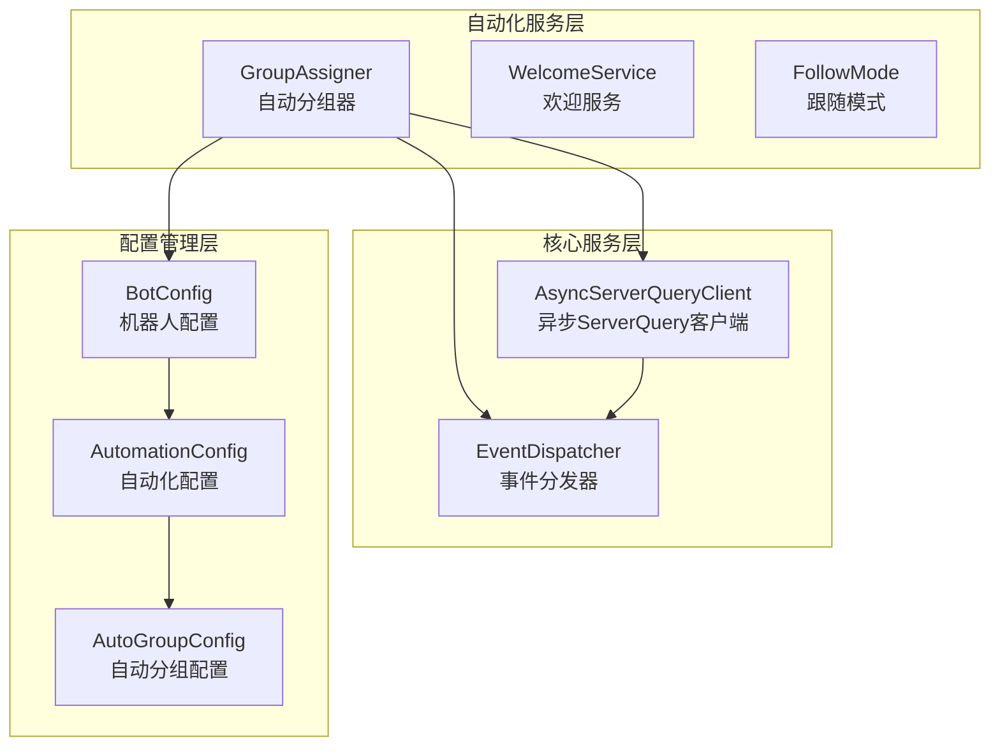
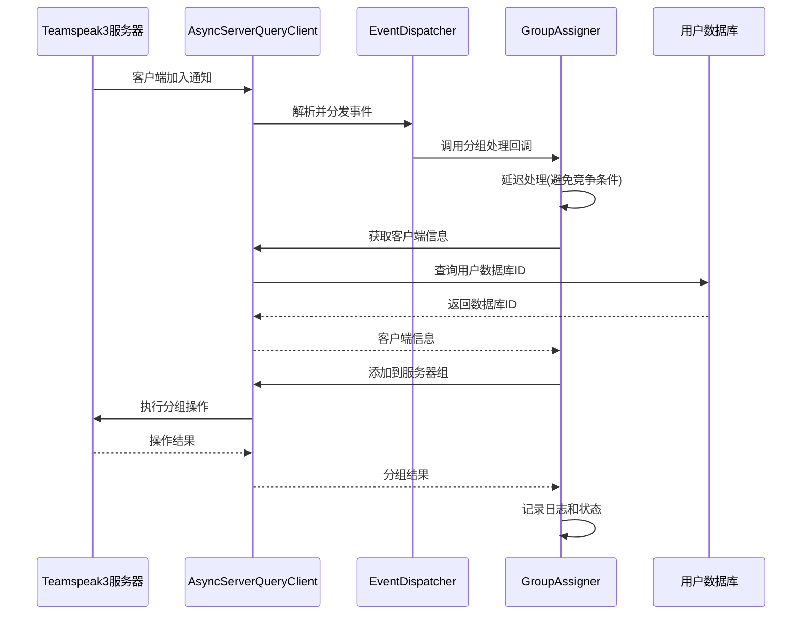
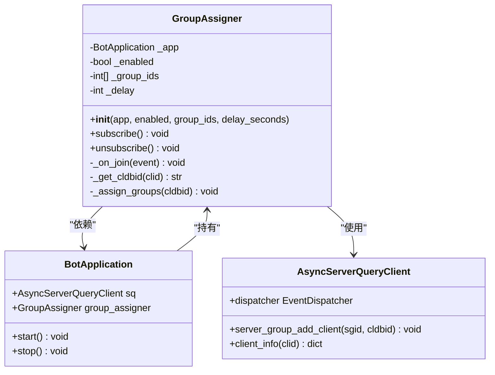
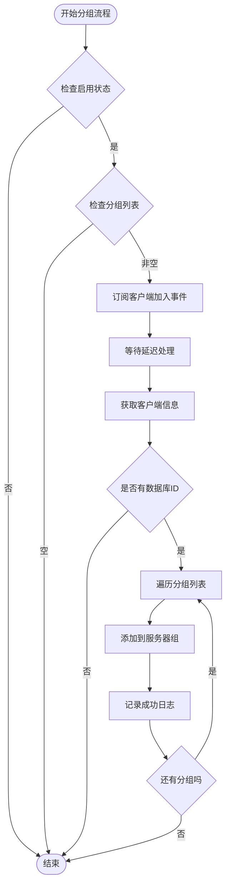
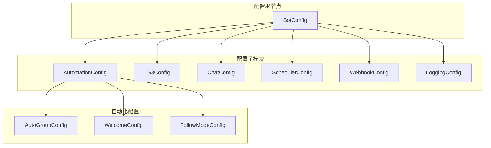
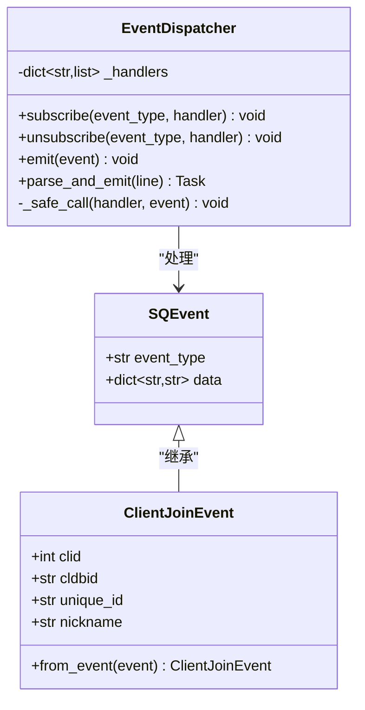
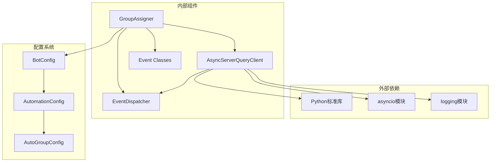
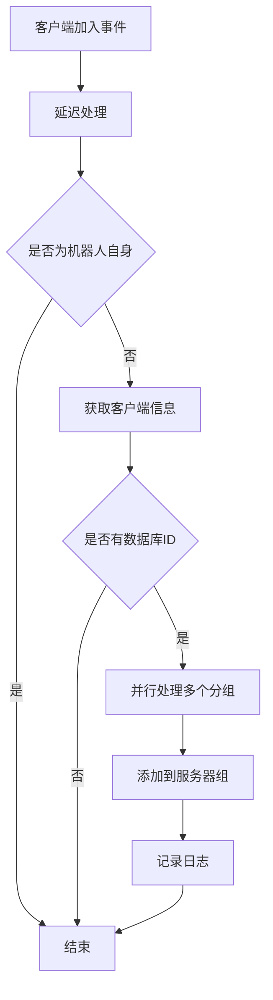

# 自动分组机制

<cite>
**本文档引用的文件**
- [groups.py](file://bot/services/automation/groups.py)
- [app.py](file://bot/app.py)
- [config.py](file://bot/config.py)
- [config.yaml](file://config/config.yaml)
- [client.py](file://bot/core/serverquery/client.py)
- [events.py](file://bot/core/serverquery/events.py)
- [protocol.py](file://bot/core/serverquery/protocol.py)
</cite>

## 目录
1. [简介](#简介)
2. [项目结构](#项目结构)
3. [核心组件](#核心组件)
4. [架构概览](#架构概览)
5. [详细组件分析](#详细组件分析)
6. [依赖关系分析](#依赖关系分析)
7. [性能考虑](#性能考虑)
8. [故障排除指南](#故障排除指南)
9. [结论](#结论)
10. [附录](#附录)

## 简介

自动分组机制是Teamspeak3机器人系统中的一个关键功能模块，负责在新成员加入服务器时自动分配适当的服务器组。该机制通过监听客户端加入事件，获取用户数据库ID，并将其添加到预配置的服务器组中，实现了完全自动化的用户权限管理。

本系统基于异步事件驱动架构，采用轻量级的事件分发器模式，确保高并发场景下的稳定性和响应性。系统支持延迟处理、错误恢复和日志记录等企业级特性。

## 项目结构

自动分组机制在项目中的组织结构如下：



**图表来源**
- [groups.py:17-66](file://bot/services/automation/groups.py#L17-L66)
- [app.py:85-89](file://bot/app.py#L85-L89)
- [config.py:81-96](file://bot/config.py#L81-L96)

**章节来源**
- [groups.py:1-66](file://bot/services/automation/groups.py#L1-L66)
- [app.py:27-111](file://bot/app.py#L27-L111)
- [config.py:125-134](file://bot/config.py#L125-L134)

## 核心组件

### GroupAssigner类

GroupAssigner是自动分组机制的核心实现类，负责处理所有分组相关的逻辑。其主要职责包括：

- **事件订阅管理**：注册和处理客户端加入事件
- **用户身份验证**：获取和验证用户的数据库ID
- **分组分配执行**：将用户添加到指定的服务器组
- **错误处理和日志记录**：处理各种异常情况并记录相关信息

### 配置系统

系统采用分层配置架构，支持运行时环境变量注入和静态配置文件管理：

- **BotConfig**：顶层配置容器，包含所有子配置模块
- **AutomationConfig**：自动化功能配置集合
- **AutoGroupConfig**：专门的自动分组配置模型

### 事件系统

基于数据类的事件模型，提供类型安全的事件处理机制：

- **ClientJoinEvent**：客户端加入事件的数据封装
- **SQEvent**：基础ServerQuery事件类型
- **EventDispatcher**：轻量级发布订阅事件分发器

**章节来源**
- [groups.py:17-31](file://bot/services/automation/groups.py#L17-L31)
- [config.py:81-96](file://bot/config.py#L81-L96)
- [events.py:18-42](file://bot/core/serverquery/events.py#L18-L42)

## 架构概览

自动分组机制采用事件驱动的异步架构，确保高并发场景下的稳定性和响应性：



**图表来源**
- [groups.py:36-66](file://bot/services/automation/groups.py#L36-L66)
- [client.py:384-387](file://bot/core/serverquery/client.py#L384-L387)
- [events.py:120-138](file://bot/core/serverquery/events.py#L120-L138)

## 详细组件分析

### GroupAssigner类深度分析

#### 类设计模式

GroupAssigner采用了职责分离的设计模式，将关注点清晰地划分为：



**图表来源**
- [groups.py:17-31](file://bot/services/automation/groups.py#L17-L31)
- [app.py:85-89](file://bot/app.py#L85-L89)
- [client.py:384-387](file://bot/core/serverquery/client.py#L384-L387)

#### 分组算法实现

分组算法采用简单而高效的线性扫描策略：



**图表来源**
- [groups.py:36-66](file://bot/services/automation/groups.py#L36-L66)

#### 错误处理机制

系统实现了多层次的错误处理策略：

1. **连接错误处理**：捕获网络连接异常
2. **权限错误处理**：识别并处理权限不足的情况
3. **重复添加处理**：忽略用户已存在于目标组的情况
4. **日志记录**：详细记录所有异常情况

**章节来源**
- [groups.py:36-66](file://bot/services/automation/groups.py#L36-L66)

### 配置系统分析

#### 配置层次结构



**图表来源**
- [config.py:125-134](file://bot/config.py#L125-L134)
- [config.py:93-96](file://bot/config.py#L93-L96)

#### 环境变量注入机制

配置系统支持运行时环境变量注入，提供了灵活的部署选项：

- **${ENV_VAR}** 模式替换
- **递归配置遍历**
- **默认值回退机制**

**章节来源**
- [config.py:12-30](file://bot/config.py#L12-L30)
- [config.py:136-159](file://bot/config.py#L136-L159)

### 事件系统分析

#### 事件分发器设计

EventDispatcher实现了轻量级的发布订阅模式：



**图表来源**
- [events.py:102-138](file://bot/core/serverquery/events.py#L102-L138)
- [events.py:26-42](file://bot/core/serverquery/events.py#L26-L42)

#### 异步事件处理

系统采用异步事件处理模型，确保高并发场景下的性能：

- **协程任务管理**：使用asyncio任务队列
- **并发处理**：支持多个处理器同时处理事件
- **异常隔离**：每个处理器的异常不影响其他处理器

**章节来源**
- [events.py:120-138](file://bot/core/serverquery/events.py#L120-L138)

## 依赖关系分析

### 组件耦合度分析

自动分组机制展现了良好的内聚性和低耦合性：



**图表来源**
- [groups.py:9-12](file://bot/services/automation/groups.py#L9-L12)
- [client.py:8-13](file://bot/core/serverquery/client.py#L8-L13)
- [config.py:8-9](file://bot/config.py#L8-L9)

### 关键依赖关系

1. **GroupAssigner → AsyncServerQueryClient**：直接依赖ServerQuery客户端进行实际操作
2. **EventDispatcher → SQEvent**：事件处理的基础抽象
3. **BotApplication → GroupAssigner**：应用层的组合关系
4. **配置系统 → 运行时参数**：环境变量和配置文件的结合

**章节来源**
- [groups.py:9-12](file://bot/services/automation/groups.py#L9-L12)
- [app.py:85-89](file://bot/app.py#L85-L89)

## 性能考虑

### 异步处理优势

系统采用异步编程模型，在高并发场景下具有显著优势：

- **事件驱动**：无需轮询，事件触发时才执行处理
- **资源高效**：单线程多任务处理，减少上下文切换开销
- **内存友好**：协程比线程更节省内存

### 并发控制机制



**图表来源**
- [groups.py:36-66](file://bot/services/automation/groups.py#L36-L66)

### 内存和CPU优化

- **惰性加载**：仅在需要时创建和初始化组件
- **对象池化**：复用事件对象和字符串
- **批量操作**：支持一次添加到多个分组

## 故障排除指南

### 常见问题诊断

#### 分组失败问题

**症状**：用户无法被分配到指定分组

**可能原因**：
1. **权限不足**：机器人账户缺少servergroupaddclient权限
2. **数据库ID缺失**：无法获取用户的client_database_id
3. **分组ID无效**：配置的服务器组ID不存在

**解决方案**：
1. 验证机器人账户权限设置
2. 检查用户是否已建立数据库记录
3. 确认服务器组ID的有效性

#### 事件处理延迟

**症状**：用户加入后延迟才获得分组

**可能原因**：
1. **延迟配置过高**：delay_seconds设置过大
2. **网络延迟**：ServerQuery连接不稳定
3. **并发竞争**：多个事件同时到达

**解决方案**：
1. 调整delay_seconds参数（建议3-5秒）
2. 检查网络连接质量
3. 实施事件去重机制

#### 重复分组问题

**症状**：用户被重复添加到同一分组

**可能原因**：
1. **未正确处理错误码**：忽略已存在的错误
2. **事件重复触发**：客户端加入事件被多次触发

**解决方案**：
1. 检查错误码处理逻辑
2. 实施事件去重和幂等性保证

**章节来源**
- [groups.py:62-66](file://bot/services/automation/groups.py#L62-L66)
- [client.py:18-25](file://bot/core/serverquery/client.py#L18-L25)

### 日志分析技巧

系统提供了详细的日志记录机制，有助于问题诊断：

- **INFO级别**：成功操作的确认信息
- **WARNING级别**：可恢复的警告信息
- **ERROR级别**：严重错误和异常情况

**章节来源**
- [groups.py:60-66](file://bot/services/automation/groups.py#L60-L66)

## 结论

自动分组机制是一个设计精良、实现简洁但功能强大的系统。其核心优势包括：

1. **架构简洁**：采用事件驱动和职责分离的设计模式
2. **扩展性强**：支持配置驱动的分组策略
3. **稳定性高**：完善的错误处理和日志记录机制
4. **性能优异**：异步处理模型确保高并发场景下的响应性

该系统为Teamspeak3服务器提供了可靠的自动化用户管理能力，通过简单的配置即可实现复杂的分组策略。未来可以考虑增加更多高级功能，如条件分组、优先级处理和冲突解决机制。

## 附录

### 配置示例

#### 基础配置示例

```yaml
automation:
  auto_groups:
    enabled: true
    group_ids: [1, 2, 3]
```

#### 高级配置示例

```yaml
automation:
  auto_groups:
    enabled: true
    group_ids: [10, 15, 20]
    delay_seconds: 3
```

### 自定义规则编写指南

#### 基本规则结构

1. **启用开关**：控制功能的开启和关闭
2. **分组列表**：定义要分配的服务器组ID列表
3. **延迟设置**：避免竞争条件的时间延迟
4. **错误处理**：定义异常情况的处理策略

#### 最佳实践建议

1. **分组顺序**：按重要性排序，确保关键权限优先
2. **测试策略**：先在测试环境中验证规则
3. **监控设置**：建立日志监控和告警机制
4. **回滚计划**：准备快速禁用和恢复的方案

### 与TeamSpeak3权限系统的集成

#### 权限要求

自动分组功能需要以下权限：
- `b_client_create`：创建客户端记录
- `b_servergroup_modify_power`：修改服务器组权限
- `b_servergroup_member_add`：添加成员到服务器组

#### 集成注意事项

1. **权限继承**：理解服务器组的权限继承机制
2. **优先级处理**：合理安排多个服务器组的优先级
3. **冲突解决**：制定明确的冲突解决策略
4. **审计日志**：保持完整的操作记录

**章节来源**
- [config.yaml:45-47](file://config/config.yaml#L45-L47)
- [config.py:81-84](file://bot/config.py#L81-L84)