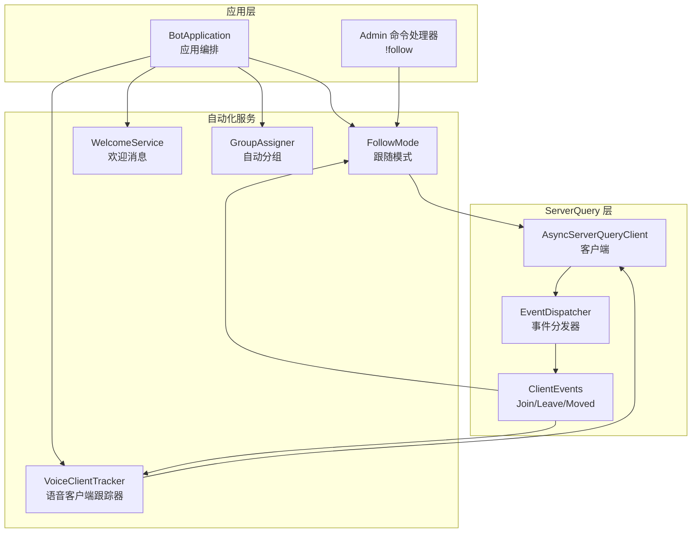
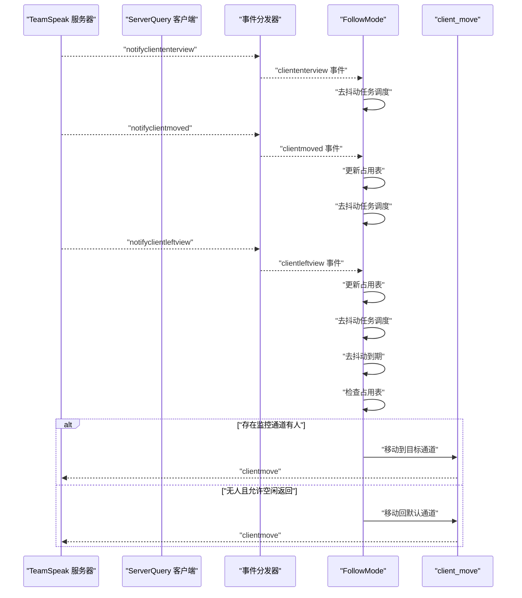
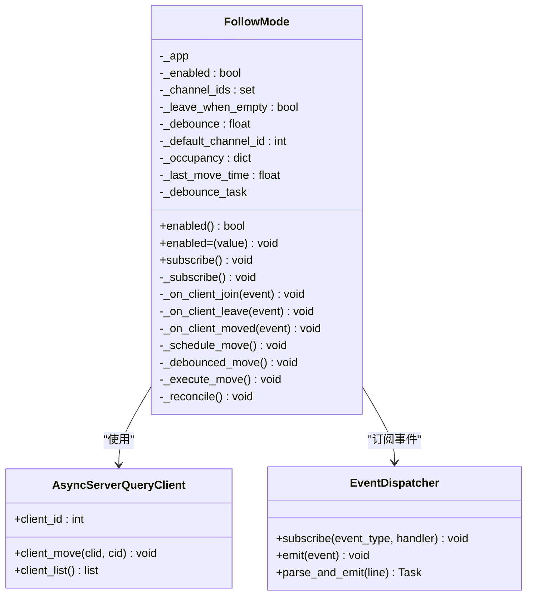
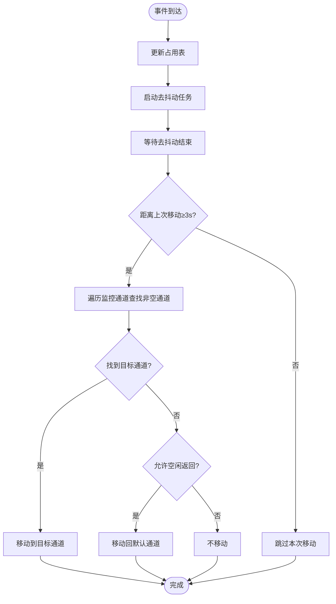
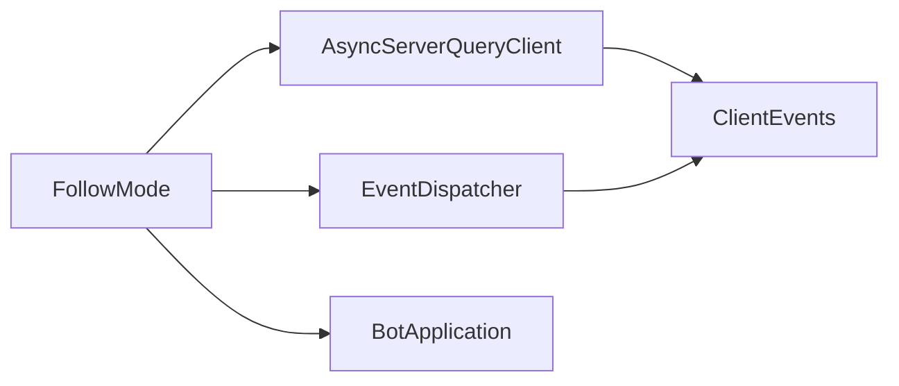

# 跟随模式

<cite>
**本文档引用的文件**
- [follow.py](file://bot/services/automation/follow.py)
- [events.py](file://bot/core/serverquery/events.py)
- [client.py](file://bot/core/serverquery/client.py)
- [app.py](file://bot/app.py)
- [config.py](file://bot/config.py)
- [config.yaml](file://config/config.yaml)
- [admin.py](file://bot/core/commands/handlers/admin.py)
- [voice_tracker.py](file://bot/services/tracking/voice_tracker.py)
</cite>

## 目录
1. [简介](#简介)
2. [项目结构](#项目结构)
3. [核心组件](#核心组件)
4. [架构总览](#架构总览)
5. [详细组件分析](#详细组件分析)
6. [依赖关系分析](#依赖关系分析)
7. [性能考量](#性能考量)
8. [故障排查指南](#故障排查指南)
9. [结论](#结论)
10. [附录](#附录)

## 简介
本文件系统性阐述跟随模式（FollowMode）的功能与实现，覆盖以下方面：
- 跟随逻辑算法与目标选择策略
- 跟随状态管理与去抖动机制
- 触发条件、移动频率限制与通道占用统计
- 配置项说明：跟随范围、空闲返回策略、去抖动时间等
- 与其他自动化功能的协同机制
- 不同场景的应用案例与性能优化建议

## 项目结构
跟随模式位于自动化服务模块中，通过事件驱动与ServerQuery客户端协作完成用户跟随行为。关键文件与职责如下：
- bot/services/automation/follow.py：FollowMode类实现
- bot/core/serverquery/events.py：事件模型与分发器
- bot/core/serverquery/client.py：ServerQuery客户端与命令接口
- bot/app.py：应用编排，注册事件与自动化服务
- bot/config.py：配置模型定义
- config/config.yaml：默认配置示例
- bot/core/commands/handlers/admin.py：!follow管理命令
- bot/services/tracking/voice_tracker.py：语音客户端跟踪器（定期同步方法）

**图表来源**
- [app.py:91-98](file://bot/app.py#L91-L98)
- [app.py:157-160](file://bot/app.py#L157-L160)
- [follow.py:65-70](file://bot/services/automation/follow.py#L65-L70)
- [events.py:102-156](file://bot/core/serverquery/events.py#L102-L156)
- [client.py:327-382](file://bot/core/serverquery/client.py#L327-L382)
- [voice_tracker.py:67-72](file://bot/services/tracking/voice_tracker.py#L67-L72)

**章节来源**
- [app.py:91-98](file://bot/app.py#L91-L98)
- [app.py:157-160](file://bot/app.py#L157-L160)
- [follow.py:65-70](file://bot/services/automation/follow.py#L65-L70)
- [events.py:102-156](file://bot/core/serverquery/events.py#L102-L156)
- [client.py:327-382](file://bot/core/serverquery/client.py#L327-L382)
- [voice_tracker.py:67-72](file://bot/services/tracking/voice_tracker.py#L67-L72)

## 核心组件
- FollowMode：负责订阅ServerQuery事件、维护通道占用表、去抖动调度与实际移动执行。
- AsyncServerQueryClient：提供client_move、client_list等底层命令能力。
- EventDispatcher：事件发布/订阅基础设施，支持cliententerview、clientleftview、clientmoved等事件。
- BotApplication：在启动时创建FollowMode实例，并在事件路由中注册其订阅。
- 配置模型：FollowModeConfig定义了启用开关、监控通道列表、空闲返回策略、去抖动时间等。
- VoiceClientTracker：语音客户端跟踪器，采用定期同步方法保持ServerQuery客户端与语音客户端在同一频道。

**章节来源**
- [follow.py:22-49](file://bot/services/automation/follow.py#L22-L49)
- [client.py:380-382](file://bot/core/serverquery/client.py#L380-L382)
- [events.py:102-156](file://bot/core/serverquery/events.py#L102-L156)
- [app.py:91-98](file://bot/app.py#L91-L98)
- [config.py:86-91](file://bot/config.py#L86-L91)
- [voice_tracker.py:35-66](file://bot/services/tracking/voice_tracker.py#L35-L66)

## 架构总览
FollowMode采用"事件驱动 + 去抖动 + 占用统计"的架构：
- 订阅事件：cliententerview、clientleftview、clientmoved
- 维护占用表：channel_id → set(client_id)，用于快速判断目标通道是否有人
- 去抖动：收到事件后不立即移动，而是等待固定秒数再执行，避免频繁切换
- 移动决策：优先选择仍有用户的监控通道；若无用户且允许空闲返回，则回到默认通道
- 频率限制：两次移动之间至少间隔3秒，防止过度移动

**图表来源**
- [events.py:102-156](file://bot/core/serverquery/events.py#L102-L156)
- [follow.py:71-102](file://bot/services/automation/follow.py#L71-L102)
- [follow.py:104-154](file://bot/services/automation/follow.py#L104-L154)
- [client.py:380-382](file://bot/core/serverquery/client.py#L380-L382)

## 详细组件分析

### FollowMode 类设计
FollowMode通过数据类与异步任务实现事件驱动的跟随逻辑，核心字段与方法如下：
- 字段
  - _channel_ids：监控通道集合
  - _occupancy：通道占用映射（通道ID→用户集合）
  - _debounce：去抖动时间（秒）
  - _leave_when_empty：空闲时是否返回默认通道
  - _default_channel_id：默认通道ID
  - _last_move_time：上次移动时间戳
  - _debounce_task：去抖动任务句柄
- 方法
  - subscribe/_subscribe：注册cliententerview、clientleftview、clientmoved事件
  - _on_client_join/_on_client_leave/_on_client_moved：事件回调，维护占用表
  - _schedule_move/_debounced_move：去抖动调度与执行
  - _execute_move：移动决策与执行
  - _reconcile：从服务器状态重建占用表

**图表来源**
- [follow.py:22-176](file://bot/services/automation/follow.py#L22-L176)
- [client.py:327-382](file://bot/core/serverquery/client.py#L327-L382)
- [events.py:102-156](file://bot/core/serverquery/events.py#L102-L156)

**章节来源**
- [follow.py:22-176](file://bot/services/automation/follow.py#L22-L176)
- [client.py:327-382](file://bot/core/serverquery/client.py#L327-L382)
- [events.py:102-156](file://bot/core/serverquery/events.py#L102-L156)

### 跟随逻辑算法与目标选择策略
- 事件驱动：订阅cliententerview、clientleftview、clientmoved三种事件，分别对应用户进入、离开、移动。
- 占用表维护：
  - cliententerview：先通过client_list同步一次状态，确保占用表准确
  - clientleftview：从所有监控通道中移除该用户
  - clientmoved：从旧通道移除，若目标通道在监控列表则加入
- 目标选择：
  - 优先选择仍有人的监控通道
  - 若无人且允许空闲返回，则移动到默认通道
- 去抖动与频率限制：
  - 每次事件触发后，取消之前的去抖动任务并新建一个
  - 去抖动结束后执行移动决策
  - 两次移动之间至少间隔3秒

**图表来源**
- [follow.py:71-102](file://bot/services/automation/follow.py#L71-L102)
- [follow.py:104-154](file://bot/services/automation/follow.py#L104-L154)

**章节来源**
- [follow.py:71-102](file://bot/services/automation/follow.py#L71-L102)
- [follow.py:104-154](file://bot/services/automation/follow.py#L104-L154)

### 跟随状态管理
- 启停控制：enabled属性变化时自动注册/注销事件订阅
- 去抖动任务：每次事件触发都会取消旧任务并创建新任务，保证最终只执行一次移动
- 占用表重建：_reconcile会拉取服务器当前client_list，重建监控通道的占用映射，用于初始化或恢复状态

**章节来源**
- [follow.py:55-69](file://bot/services/automation/follow.py#L55-L69)
- [follow.py:156-176](file://bot/services/automation/follow.py#L156-L176)

### 触发条件与事件流
- 用户进入：cliententerview事件触发，先进行一次状态同步，再调度去抖动
- 用户离开：clientleftview事件触发，从占用表移除该用户，调度去抖动
- 用户移动：clientmoved事件触发，从旧通道移除，若目标通道在监控列表则加入，调度去抖动

**章节来源**
- [follow.py:71-102](file://bot/services/automation/follow.py#L71-L102)
- [events.py:26-99](file://bot/core/serverquery/events.py#L26-L99)

### 路径规划机制
- FollowMode不涉及复杂路径规划，仅根据占用表选择目标通道并调用client_move移动到目标通道或默认通道
- 实际路径由TeamSpeak服务器内部处理，FollowMode仅负责目标通道的选择与移动命令的发送

**章节来源**
- [follow.py:139-154](file://bot/services/automation/follow.py#L139-L154)
- [client.py:380-382](file://bot/core/serverquery/client.py#L380-L382)

### 配置选项说明
FollowModeConfig包含以下关键参数：
- enabled：是否启用跟随模式
- channel_ids：监控的通道ID列表
- leave_when_empty：当监控通道均无人时是否返回默认通道
- debounce_seconds：去抖动时间（秒）

配置加载流程：
- BotApplication在构造时读取配置并创建FollowMode实例
- 默认配置来自config/config.yaml，可通过环境变量插值覆盖敏感信息

**章节来源**
- [config.py:86-91](file://bot/config.py#L86-L91)
- [app.py:91-98](file://bot/app.py#L91-L98)
- [config.yaml:48-52](file://config/config.yaml#L48-L52)

### 与其他自动化功能的协同机制
- 事件解耦：FollowMode通过EventDispatcher订阅事件，与欢迎消息、自动分组等功能共享同一事件源
- 生命周期：BotApplication在启动阶段统一注册各自动化服务的订阅
- 命令入口：!follow命令通过Admin处理器切换FollowMode.enabled，并可触发_reconcile以恢复状态
- 语音客户端跟踪：VoiceClientTracker采用定期同步方法（每30秒检查一次），确保ServerQuery客户端与语音客户端保持在同一频道

**章节来源**
- [app.py:157-160](file://bot/app.py#L157-L160)
- [admin.py:20-36](file://bot/core/commands/handlers/admin.py#L20-L36)
- [voice_tracker.py:95-107](file://bot/services/tracking/voice_tracker.py#L95-L107)

## 依赖关系分析
FollowMode与核心组件的依赖关系如下：
- 依赖AsyncServerQueryClient：用于client_move与client_list
- 依赖EventDispatcher：用于订阅与接收cliententerview、clientleftview、clientmoved事件
- 依赖BotApplication：作为容器，提供SQ客户端与事件分发器

**图表来源**
- [follow.py:65-70](file://bot/services/automation/follow.py#L65-L70)
- [client.py:327-382](file://bot/core/serverquery/client.py#L327-L382)
- [events.py:102-156](file://bot/core/serverquery/events.py#L102-L156)

**章节来源**
- [follow.py:65-70](file://bot/services/automation/follow.py#L65-L70)
- [client.py:327-382](file://bot/core/serverquery/client.py#L327-L382)
- [events.py:102-156](file://bot/core/serverquery/events.py#L102-L156)

## 性能考量
- 去抖动与频率限制
  - 去抖动时间：减少频繁移动带来的抖动
  - 最小移动间隔：避免短时间内多次移动导致服务器压力
- 占用表查询
  - O(1)集合操作，整体占用表更新为O(N)（N为监控通道数）
- 事件处理并发
  - 使用asyncio.gather并行处理事件回调，降低延迟
- 状态重建
  - _reconcile通过client_list一次性重建占用表，避免逐事件增量更新的误差累积
- 语音客户端跟踪性能
  - VoiceClientTracker采用定期同步（30秒间隔），平衡准确性与性能

**章节来源**
- [follow.py:104-154](file://bot/services/automation/follow.py#L104-L154)
- [events.py:120-131](file://bot/core/serverquery/events.py#L120-L131)
- [voice_tracker.py:95-107](file://bot/services/tracking/voice_tracker.py#L95-L107)

## 故障排查指南
- 无法移动到目标通道
  - 检查目标通道ID是否在channel_ids中
  - 确认bot具备移动权限
  - 查看日志中的异常堆栈
- 未按预期移动
  - 检查去抖动时间是否过短或过长
  - 确认leave_when_empty设置是否符合预期
  - 使用!follow on后手动触发_reconcile重建占用表
- 事件未被触发
  - 确认BotApplication已注册FollowMode订阅
  - 检查EventDispatcher是否正常工作
- 语音客户端跟踪问题
  - VoiceClientTracker定期同步可能错过事件，但会在下次30秒检查时修复
  - 检查ServerQuery连接状态和频道事件注册

**章节来源**
- [follow.py:139-154](file://bot/services/automation/follow.py#L139-L154)
- [app.py:157-160](file://bot/app.py#L157-L160)
- [admin.py:20-36](file://bot/core/commands/handlers/admin.py#L20-L36)
- [voice_tracker.py:95-107](file://bot/services/tracking/voice_tracker.py#L95-L107)

## 结论
FollowMode通过简洁而稳健的事件驱动架构实现了高效的用户跟随行为：以占用表为核心的数据结构、去抖动与频率限制保障稳定性、与ServerQuery客户端紧密协作完成移动。配合配置化参数与命令入口，可在多种场景下灵活启用与调整。VoiceClientTracker采用定期同步方法，虽然相比事件驱动稍显简化，但更加可靠稳定。建议在高并发场景下适当增大去抖动时间与最小移动间隔，以平衡响应速度与服务器负载。

## 附录
- 配置文件位置与默认值参考：config/config.yaml
- 配置模型定义：bot/config.py 中的FollowModeConfig
- 命令入口：!follow on/off
- 语音客户端跟踪器：定期同步（30秒间隔）确保ServerQuery与语音客户端频道一致

**章节来源**
- [config.yaml:48-52](file://config/config.yaml#L48-L52)
- [config.py:86-91](file://bot/config.py#L86-L91)
- [admin.py:20-36](file://bot/core/commands/handlers/admin.py#L20-L36)
- [voice_tracker.py:95-107](file://bot/services/tracking/voice_tracker.py#L95-L107)