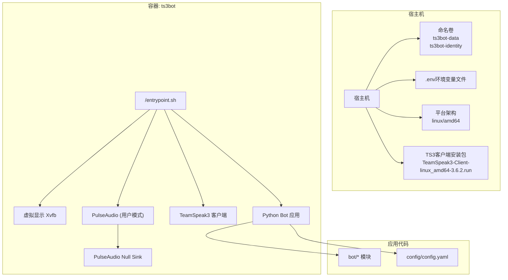
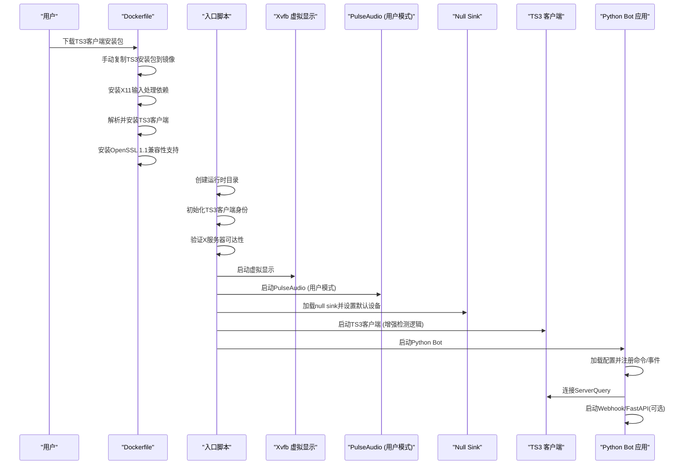
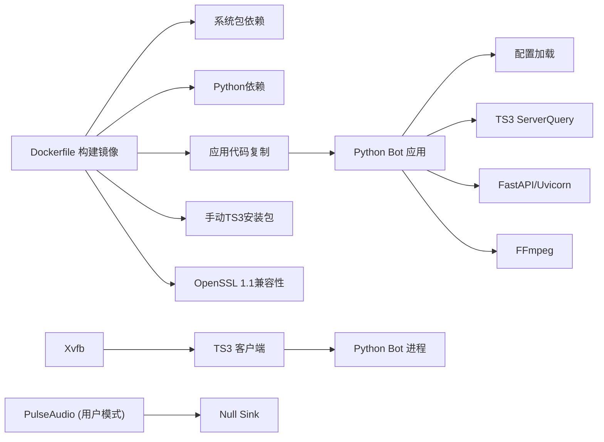

# Docker容器化部署

<cite>
**本文档引用的文件**
- [Dockerfile](file://Dockerfile)
- [docker-compose.yml](file://docker-compose.yml)
- [docker/entrypoint.sh](file://docker/entrypoint.sh)
- [docker/supervisord.conf](file://docker/supervisord.conf)
- [docker/ts3client/init_identity.py](file://docker/ts3client/init_identity.py)
- [docker/pulseaudio/default.pa](file://docker/pulseaudio/default.pa)
- [requirements.txt](file://requirements.txt)
- [config/config.yaml](file://config/config.yaml)
</cite>

## 更新摘要
**变更内容**
- Dockerfile新增OpenSSL 1.1兼容性支持，解决Debian Bookworm中OpenSSL 3.x与TeamSpeak 3客户端的ABI兼容性问题
- 增强的X11输入处理和显示管理依赖，包括完整的libxcb生态系统支持（libxcb1、libx11-6、libxrender1等）
- entrypoint.sh实现X服务器可达性验证，使用xdotool检查DISPLAY环境变量配置的X服务器响应性
- 改进的共享库检测逻辑，增强TS3客户端启动前的依赖检查和错误诊断
- 完全移除Supervisor依赖，采用直接bash脚本管理所有进程，简化了进程管理架构
- 改进TS3客户端启动过程，增强二进制文件查找策略和多级回退机制
- 优化PulseAudio配置，提供更好的容器内音频支持和资源管理

## 目录
1. [简介](#简介)
2. [项目结构](#项目结构)
3. [核心组件](#核心组件)
4. [架构总览](#架构总览)
5. [详细组件分析](#详细组件分析)
6. [平台特定配置](#平台特定配置)
7. [依赖关系分析](#依赖关系分析)
8. [性能考虑](#性能考虑)
9. [故障排除指南](#故障排除指南)
10. [结论](#结论)
11. [附录](#附录)

## 简介
本文件面向Docker容器化部署，深入解析该Teamspeak3 Bot项目的容器构建与运行机制。内容涵盖：
- Dockerfile构建流程：系统包安装、Python环境配置、TeamSpeak3客户端集成、依赖管理
- docker-compose.yml服务编排：服务定义、网络设置、卷挂载、环境变量、平台特定配置
- 容器启动脚本工作原理：初始化流程、权限设置、服务启动顺序、X服务器可达性验证
- 部署步骤、镜像构建命令与容器运行示例
- 常见部署问题解决方案与最佳实践

**更新** Dockerfile经过重大改进，新增了OpenSSL 1.1兼容性支持和完整的X11输入处理和显示管理依赖，entrypoint.sh实现了X服务器可达性验证和增强的共享库检测，完全移除了Supervisor依赖，采用直接bash脚本管理进程。

## 项目结构
该项目采用分层组织方式，Docker相关配置集中在docker目录中，应用代码位于bot目录，配置文件位于config目录。Dockerfile负责构建镜像，docker-compose.yml负责编排单容器服务，入口脚本直接管理多进程。

**图表来源**
- [Dockerfile:1-150](file://Dockerfile#L1-L150)
- [docker-compose.yml:1-36](file://docker-compose.yml#L1-L36)
- [docker/entrypoint.sh:1-169](file://docker/entrypoint.sh#L1-L169)

**章节来源**
- [Dockerfile:1-150](file://Dockerfile#L1-L150)
- [docker-compose.yml:1-36](file://docker-compose.yml#L1-L36)

## 核心组件
- **直接进程管理脚本**：在容器启动时初始化目录与TS3客户端身份，然后通过bash脚本直接管理Xvfb、PulseAudio、TS3客户端与Python Bot进程。**更新** 完全移除了Supervisor依赖，采用更简洁的进程管理方式。
- **OpenSSL 1.1兼容性支持**：**新增功能** Dockerfile现在包含专门的OpenSSL 1.1安装步骤，解决Debian Bookworm中OpenSSL 3.x与TeamSpeak 3客户端的ABI兼容性问题，确保TS3客户端能够正常运行。
- **增强的X11输入处理**：**新增功能** 完整的X11生态系统支持，包括libxcb、libx11、libxrender、libxrandr、libxfixes等依赖，提供更好的图形处理能力和TeamSpeak 3客户端兼容性。
- **X服务器可达性验证**：entrypoint.sh现在包含X服务器响应性检查功能，使用xdotool验证DISPLAY环境变量配置的X服务器是否可访问，确保容器内虚拟显示正常工作。
- **增强的共享库检测**：改进的TS3客户端启动过程包含多级共享库检查，使用ldd命令验证所有必需的共享库是否可用，提供详细的错误诊断信息。
- **改进的TS3客户端检测逻辑**：入口脚本现在包含多种TS3客户端二进制文件的查找策略，支持多种命名模式和回退机制，包括精确匹配、通配符搜索和ELF二进制文件检测。
- **改进的PulseAudio配置**：使用用户模式启动PulseAudio，提供更好的容器内音频支持和资源管理，避免了系统模式的权限问题。
- **TS3客户端初始化脚本**：在首次运行时生成settings.db，配置音频设备使用PulseAudio的null sink，并写入自动连接书签。
- **应用配置**：通过YAML配置文件与环境变量插值，支持TS3、音频、网易云音乐、AI聊天、自动化、调度、Webhook与日志等模块。
- **Dockerfile**：定义基础镜像、系统依赖、Python依赖、应用代码复制、用户与权限、PulseAudio配置以及入口点。**更新** 新增了OpenSSL 1.1兼容性支持和完整的X11输入处理和显示管理依赖，移除了process manager依赖，简化了镜像构建过程。

**章节来源**
- [docker/entrypoint.sh:1-169](file://docker/entrypoint.sh#L1-L169)
- [docker/ts3client/init_identity.py:1-92](file://docker/ts3client/init_identity.py#L1-L92)
- [docker/pulseaudio/default.pa:1-20](file://docker/pulseaudio/default.pa#L1-L20)
- [config/config.yaml:1-76](file://config/config.yaml#L1-L76)
- [Dockerfile:1-150](file://Dockerfile#L1-L150)

## 架构总览
容器内采用直接bash脚本管理多个子进程，确保各组件按序启动与自愈。TS3客户端通过headless模式运行，配合PulseAudio的null sink实现无显示器音频播放。Python Bot通过FastAPI提供Webhook服务（可选），并通过ServerQuery与TS3服务器交互。

**图表来源**
- [docker/entrypoint.sh:1-169](file://docker/entrypoint.sh#L1-L169)

## 详细组件分析

### Dockerfile构建流程
- 基础镜像与环境变量：基于python:3.12-slim-bookworm，设置非交互式前端以避免安装时的交互提示。
- **系统包安装**：安装虚拟显示（Xvfb）、音频（PulseAudio及其工具）、音视频解码（FFmpeg）、**新增X11输入处理和显示管理依赖**（libxcb1、libx11-6、libxrender1、libxrandr2、libxfixes3、libxcb-xinerama0、libxcb-image0、libxcb-keysyms1、libxcb-render-util0、libxcb-icccm4、libxcb-sync1、libxcb-xkb1、libxkbcommon0、libxkbcommon-x11-0、libfontconfig1、libfreetype6、libdbus-1-3、libnss3、libasound2、libxcursor1、libxcomposite1、libxi6、libxtst6、libxkbfile1、libxcb-cursor0、libxcb-shape0、libxcb-xfixes0、libxcb-glx0、libxcb-dri2-0、libxcb-dri3-0、libxcb-present0、libxshmfence1、libdrm2、libgbm1、libegl1、libgl1）、TS3客户端运行时依赖（libevent-2.1-7、libxdamage1、libpci3、libxslt1.1、libatomic1、libxcb-xinput0）、实用工具（wget、bzip2、xdotool、sqlite3、dbus）。
- **OpenSSL 1.1兼容性支持**：**新增功能** 由于Debian Bookworm默认提供OpenSSL 3.x，而TeamSpeak 3客户端是针对OpenSSL 1.x构建的，Dockerfile现在包含专门的兼容性支持。通过从Debian Bullseye安全仓库安装libssl1.1，确保TS3客户端能够正常运行，解决ABI兼容性问题。
- **移除的依赖**：process manager（Supervisor）已被移除，简化了镜像构建过程。
- **TeamSpeak3客户端**：**重大变更** 现在采用手动下载安装方式。用户需要先从TeamSpeak官网下载对应版本的安装包，然后将其放在项目根目录下，Dockerfile会自动复制并安装。这种方式提供了更好的版本控制和下载源控制。
- **TS3客户端安装流程**：
  - 用户需要下载：`wget https://files.teamspeak-services.com/releases/client/3.6.2/TeamSpeak3-Client-linux_amd64-3.6.2.run`
  - Dockerfile会复制安装包到`/tmp/ts3client.run`
  - 使用`--nox11`参数跳过X11检查（因为容器内有Xvfb）
  - 解析并安装到`/opt/ts3client`
  - 设置必要的可执行权限
  - 删除临时文件
- **Python依赖**：复制requirements.txt并安装，确保无缓存以减小镜像体积。
- 应用代码复制：复制bot、config、docker目录至/opt/bot。
- 运行时设置：创建ts3bot用户与数据目录，设置权限；复制PulseAudio配置；复制入口脚本并赋予执行权限；设置工作目录与入口点。

**章节来源**
- [Dockerfile:1-150](file://Dockerfile#L1-L150)
- [requirements.txt:1-11](file://requirements.txt#L1-L11)

### docker-compose.yml服务编排
- 服务定义：构建上下文指向仓库根目录，使用Dockerfile；容器名称为ts3bot；重启策略为unless-stopped。
- 卷挂载：挂载config目录为只读；挂载命名卷ts3bot-data用于缓存与日志；挂载命名卷ts3bot-identity用于TS3客户端身份信息持久化。
- 端口映射：默认暴露WEBHOOK_PORT（默认8080）到容器内部8080。
- 环境变量：从.env文件读取；传递TS3_HOST、TS3_PASSWORD、NETEASE_API_URL、OPENAI_API_KEY、OPENAI_API_BASE、OPENAI_MODEL、WEBHOOK_SECRET等；默认NETEASE_API_URL指向host.docker.internal，OPENAI_API_BASE与OPENAI_MODEL提供默认值。
- 共享内存与临时文件系统：shm_size设置为256m；/tmp与PulseAudio socket目录使用tmpfs提升性能与安全性。
- 网络别名：通过extra_hosts将host.docker.internal解析为host-gateway，便于容器内访问宿主机服务。
- **平台特定配置**：新增build.platforms和platform字段，明确指定容器运行在linux/amd64架构上。

**更新** 新增平台特定配置，确保容器在AMD64架构上运行，避免跨架构兼容性问题。

**章节来源**
- [docker-compose.yml:1-36](file://docker-compose.yml#L1-L36)

### 容器启动脚本与直接进程管理
- **直接进程管理**：入口脚本现在直接管理所有进程，不再依赖Supervisor。创建/data/cache、/data/logs、/home/ts3bot/.ts3client等运行时目录；首次运行时调用init_identity.py初始化TS3客户端身份；启动Xvfb、PulseAudio、TS3客户端和Python Bot。
- **X服务器可达性验证**：**新增功能** 在启动TS3客户端之前，使用xdotool检查X服务器响应性，验证DISPLAY环境变量配置是否正确，确保虚拟显示正常工作。
- **改进的PulseAudio启动**：使用用户模式启动PulseAudio，避免了系统模式的权限问题。
- **增强的错误处理**：在每个进程启动后都添加了错误处理和日志记录，如果初始化失败会跳过并使用默认设置。
- **进程管理**：每个进程启动后都会保存PID，便于后续的进程监控和管理。
- **增强的TS3客户端检测**：现在包含多种TS3客户端二进制文件的查找策略，支持多种命名模式和回退机制。

**更新** 完全移除了Supervisor依赖，采用直接bash脚本管理进程，提供了更简洁的进程管理方式。

**章节来源**
- [docker/entrypoint.sh:1-169](file://docker/entrypoint.sh#L1-L169)

### TS3客户端初始化
- 功能：在/home/ts3bot/.ts3client/settings.db不存在时创建数据库，配置音频设备使用PulseAudio的ts3bot_sink；写入自动连接书签（从环境变量TS3_HOST、TS3_VOICE_PORT、TS3_NICKNAME读取）。
- **增强的错误处理**：init_identity.py现在包含完整的异常处理机制，记录错误信息并优雅退出。
- 作用：确保TS3客户端在headless环境下能正确识别PulseAudio输出设备并自动连接目标服务器。

**更新** 初始化脚本增加了健壮的错误处理和调试功能。

**章节来源**
- [docker/ts3client/init_identity.py:1-92](file://docker/ts3client/init_identity.py#L1-L92)

### 改进的PulseAudio配置
- **用户模式启动**：使用用户模式启动PulseAudio，提供更好的容器内音频支持和资源管理，避免了系统模式的权限问题。
- 功能：加载ts3bot_sink作为null sink，设置为默认sink与source；启用本地Unix域套接字协议供容器内应用访问；禁用自动挂起以保证Docker环境稳定性。
- **改进的模块加载**：增加了module-always-sink和module-rescue-streams模块，提高音频流的稳定性。
- **增强的错误处理**：在加载模块和设置默认设备时都添加了错误处理，如果失败会显示错误信息但不会阻止容器启动。

**更新** PulseAudio配置从系统模式改为用户模式，提供了更好的容器内音频支持。

**章节来源**
- [docker/pulseaudio/default.pa:1-20](file://docker/pulseaudio/default.pa#L1-L20)

### 应用配置与运行
- 配置加载：支持从/config/config.yaml或/opt/bot/config/config.yaml加载，对${ENV_VAR}进行环境变量插值；SecretStr类型用于敏感信息。
- 应用生命周期：BotApplication负责加载配置、创建服务实例、连接ServerQuery、注册命令与事件监听、启动后台服务（调度器、Webhook、自动播放）、优雅停止。
- 入口点：通过python -m bot启动，内部调用BotApplication.run()进入事件循环，等待信号中断后执行停止流程。

**章节来源**
- [config/config.yaml:1-76](file://config/config.yaml#L1-L76)

## 平台特定配置

### 架构限制说明
当前容器配置明确限制在linux/amd64架构上运行，这是由以下因素决定的：

- **TeamSpeak3客户端依赖**：TS3 Linux客户端依赖于特定的二进制库和系统接口，这些在ARM64架构上可能不可用或行为不同
- **PulseAudio模块兼容性**：某些PulseAudio模块和null sink功能在非AMD64架构上可能存在兼容性问题
- **FFmpeg编译依赖**：FFmpeg在不同架构上的编译配置和可用性存在差异
- **Xvfb虚拟显示**：虚拟显示服务在非标准架构上的稳定性有待验证
- **X11输入处理**：新增的完整X11生态系统依赖在非AMD64架构上可能存在兼容性问题
- **OpenSSL兼容性**：OpenSSL 1.1兼容性支持是针对特定架构的解决方案

### 平台配置详解
docker-compose.yml中的平台配置包含两个关键字段：

- **build.platforms**：在构建阶段指定支持的平台架构，确保镜像构建在正确的架构上进行
- **platform**：在运行阶段强制容器使用指定的架构，防止跨架构运行带来的兼容性问题

### 多架构部署考虑
虽然当前配置限制在linux/amd64，但以下是一些可能的替代方案：

- **使用官方多架构镜像**：寻找已构建好的多架构版本
- **条件构建**：根据宿主机架构动态选择不同的构建配置
- **功能降级**：在非AMD64架构上禁用某些依赖架构的功能

**章节来源**
- [docker-compose.yml:6-10](file://docker-compose.yml#L6-L10)

## 依赖关系分析
- 构建期依赖：Dockerfile中apt安装的系统包与pip安装的Python包。
- 运行期依赖：直接管理的Xvfb、PulseAudio、TS3客户端、Python Bot；容器内的FastAPI/Uvicorn用于Webhook；FFmpeg用于音视频处理。
- 外部依赖：TS3服务器（ServerQuery）、外部API（网易云音乐、OpenAI）。

**图表来源**
- [Dockerfile:1-150](file://Dockerfile#L1-L150)
- [docker/entrypoint.sh:1-169](file://docker/entrypoint.sh#L1-L169)
- [requirements.txt:1-11](file://requirements.txt#L1-L11)

**章节来源**
- [Dockerfile:1-150](file://Dockerfile#L1-L150)
- [docker/entrypoint.sh:1-169](file://docker/entrypoint.sh#L1-L169)
- [requirements.txt:1-11](file://requirements.txt#L1-L11)

## 性能考虑
- 共享内存：shm_size设置为256m，满足容器内多媒体处理需求。
- 临时文件系统：/tmp与PulseAudio socket使用tmpfs，减少磁盘IO，提高响应速度。
- **改进的PulseAudio配置**：用户模式启动提供更好的资源管理和音频稳定性。
- **直接进程管理**：移除了Supervisor的额外开销，减少了进程间通信的复杂性。
- **增强的X11输入处理**：新增的完整X11生态系统依赖提供了更好的图形处理能力。
- **OpenSSL 1.1兼容性**：专门的兼容性支持确保TS3客户端稳定运行，避免因库版本不兼容导致的性能问题。
- **增强的共享库检测**：改进的TS3客户端启动过程减少了不必要的启动尝试和错误重试。
- 缓存与日志：/data/cache与/data/logs挂载到命名卷，便于持久化与性能优化。
- **平台性能**：linux/amd64架构提供最佳的兼容性和性能表现，避免跨架构带来的性能损失。

**更新** 完全移除了Supervisor依赖，采用了更直接的进程管理方式，提高了整体性能和稳定性。

## 故障排除指南
- TS3客户端无法连接或无声音
  - 检查PulseAudio是否正常启动且已加载null sink。
  - 确认DISPLAY与PULSE_SERVER环境变量正确传递给TS3客户端与Bot进程。
  - 验证TS3_HOST、TS3_VOICE_PORT、TS3_NICKNAME等环境变量是否正确。
  - **X服务器可达性问题**：**新增** 检查entrypoint.sh中的xdotool输出，确认X服务器响应性验证是否通过。
  - **共享库缺失问题**：**新增** 检查TS3客户端启动前的共享库检测输出，确认所有必需的共享库是否可用。
  - **OpenSSL兼容性问题**：**新增** 检查OpenSSL 1.1兼容性安装是否成功，确认libssl1.1是否正确安装。
  - **检查平台兼容性**：确认宿主机架构为linux/amd64，避免跨架构导致的问题。
  - **查看增强的日志**：检查/data/logs目录下的详细日志文件，包括pulseaudio.log、ts3client.log等。
  - **TS3客户端检测问题**：如果TS3客户端无法启动，检查入口脚本的二进制文件查找逻辑和调试输出。
  - **手动安装包问题**：**新增** 确认TS3客户端安装包已正确下载并放置在项目根目录，检查Dockerfile中的COPY指令是否成功执行。
- Webhook无法访问
  - 确认WEBHOOK_PORT映射正确，且容器内端口8080已启用。
  - 检查WEBHOOK_SECRET与配置中的secret一致。
- 音频播放异常
  - 确认FFmpeg已安装并可执行路径正确。
  - 检查PulseAudio socket路径与权限。
- 首次启动未生成settings.db
  - 确保init_identity.py执行成功，检查/home/ts3bot/.ts3client目录权限。
  - **检查初始化脚本错误**：查看init_identity.py的错误输出，确认数据库创建是否成功。
- 配置不生效
  - 确认/config/config.yaml存在且路径正确，或/opt/bot/config/config.yaml存在。
  - 检查环境变量插值是否正确，确认SecretStr字段未为空。
- **平台相关问题**
  - **镜像构建失败**：检查宿主机架构是否为linux/amd64，如为ARM64需使用多架构构建工具链
  - **容器启动异常**：确认Docker版本支持linux/amd64架构，检查容器运行时配置
  - **性能问题**：验证宿主机架构与容器平台配置一致，避免跨架构性能损失
- **新故障排除功能**
  - **调试模式**：入口脚本现在包含详细的调试输出，可以在启动时看到每个步骤的状态
  - **进程监控**：所有进程都有独立的日志文件，便于定位具体问题
  - **用户模式音频**：PulseAudio用户模式提供了更好的容器内音频支持和资源管理
  - **增强的TS3检测**：入口脚本现在提供详细的TS3客户端二进制文件查找调试信息
  - **X服务器验证**：**新增** 检查X服务器可达性验证输出，确认DISPLAY环境变量配置正确
  - **共享库诊断**：**新增** 检查共享库检测输出，确认所有必需的共享库都已安装
  - **OpenSSL兼容性诊断**：**新增** 检查OpenSSL 1.1兼容性安装状态，确认TS3客户端能够正常运行
  - **手动安装包验证**：**新增** 检查/opt/ts3client目录下的TS3客户端文件完整性

**更新** 新增了基于直接进程管理和用户模式音频的故障排除指南，以及手动TS3安装包和OpenSSL兼容性相关的故障排除步骤。

**章节来源**
- [docker/entrypoint.sh:1-169](file://docker/entrypoint.sh#L1-L169)
- [docker/ts3client/init_identity.py:1-92](file://docker/ts3client/init_identity.py#L1-L92)
- [config/config.yaml:1-76](file://config/config.yaml#L1-L76)
- [docker-compose.yml:6-10](file://docker-compose.yml#L6-L10)

## 结论
该容器化方案通过Dockerfile精确控制系统与Python依赖，结合直接bash脚本管理多进程，实现了TS3客户端headless运行与Python Bot的稳定服务。**经过重大改进的Dockerfile新增了OpenSSL 1.1兼容性支持和完整的X11输入处理和显示管理依赖，entrypoint.sh实现了X服务器可达性验证和增强的共享库检测，完全移除了Supervisor依赖，采用直接bash脚本管理进程**。特别重要的是，TeamSpeak客户端安装流程已从自动下载改为手动下载，这种方式提供了更好的版本控制和下载源控制，用户可以精确选择所需的TS3客户端版本。docker-compose.yml提供了灵活的卷挂载与环境变量配置，新增的平台特定配置确保了在linux/amd64架构上的最佳兼容性和性能。遵循本文档的部署步骤与最佳实践，可快速完成容器化部署并解决常见问题。

**更新** 强调Dockerfile重大改进的重要性，特别是手动TS3客户端安装流程的优势、新增的X11生态系统支持和OpenSSL 1.1兼容性支持，确保部署的稳定性和性能。

## 附录

### 部署步骤与命令示例
- **准备TS3客户端安装包**：**重大变更** 需要手动下载并放置TS3客户端安装包
  - 从TeamSpeak官网下载：`wget https://files.teamspeak-services.com/releases/client/3.6.2/TeamSpeak3-Client-linux_amd64-3.6.2.run`
  - 将下载的安装包放置在项目根目录
  - 确认文件名为：`TeamSpeak3-Client-linux_amd64-3.6.2.run`
- 准备环境变量文件：创建.env文件，包含TS3_HOST、TS3_PASSWORD、OPENAI_API_KEY、OPENAI_API_BASE、OPENAI_MODEL、WEBHOOK_SECRET等必要变量。
- **平台检查**：确认宿主机架构为linux/amd64，使用 `uname -m` 和 `arch` 命令验证
- 构建镜像：
  - 使用Dockerfile在仓库根目录构建镜像，自动应用平台配置
  - **注意**：构建过程中会自动复制并安装TS3客户端安装包
  - **OpenSSL兼容性**：构建过程会自动安装OpenSSL 1.1兼容性支持
- 运行容器：
  - 使用docker-compose启动服务，确保卷与端口映射正确。
  - **多架构构建**：如需在ARM64上构建，使用 `docker buildx build --platform linux/amd64 -t ts3bot .`
- 验证服务：
  - 查看/data/logs中的日志文件，确认各进程启动成功。
  - 访问Webhook端口（默认8080）验证服务可用性。
  - **平台验证**：检查容器运行状态，确认平台为linux/amd64
- **调试和监控**：
  - **查看详细日志**：使用 `docker logs ts3bot` 查看完整的启动日志
  - **检查进程状态**：使用 `docker exec ts3bot ps aux` 查看进程状态
  - **进入容器调试**：使用 `docker exec -it ts3bot bash` 进入容器进行调试
  - **TS3客户端调试**：如果TS3客户端启动有问题，查看入口脚本的二进制文件查找调试输出
  - **X服务器验证**：**新增** 检查X服务器可达性验证输出，确认DISPLAY环境变量配置正确
  - **共享库诊断**：**新增** 检查共享库检测输出，确认所有必需的共享库都已安装
  - **OpenSSL兼容性诊断**：**新增** 检查OpenSSL 1.1兼容性安装状态，确认TS3客户端能够正常运行
  - **手动安装包验证**：**新增** 检查/opt/ts3client目录下的TS3客户端文件完整性

**更新** 新增了TS3客户端手动安装包准备步骤和OpenSSL兼容性相关的部署指导。

**章节来源**
- [docker-compose.yml:1-36](file://docker-compose.yml#L1-L36)
- [Dockerfile:68-112](file://Dockerfile#L68-L112)