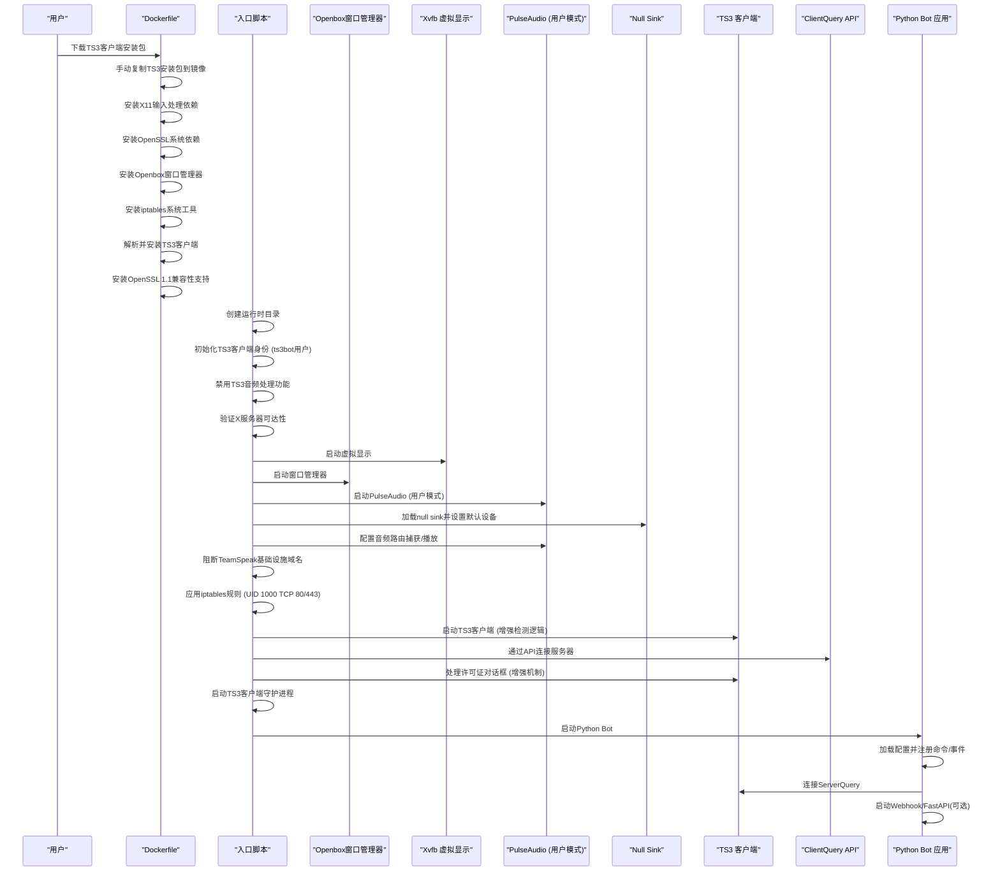
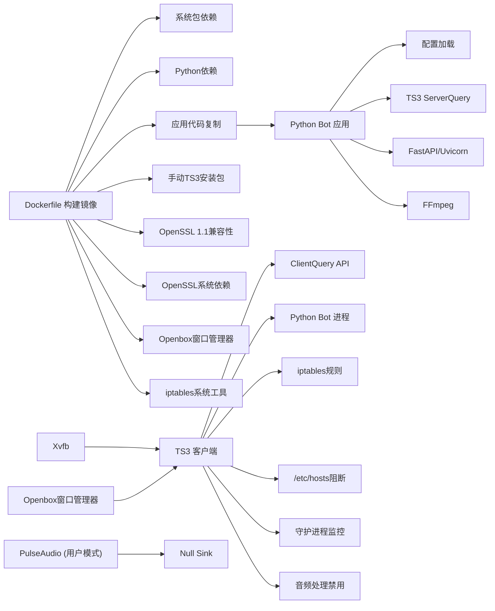

# Docker容器化部署

<cite>
**本文档引用的文件**
- [Dockerfile](file://Dockerfile)
- [docker-compose.yml](file://docker-compose.yml)
- [docker/entrypoint.sh](file://docker/entrypoint.sh)
- [docker/supervisord.conf](file://docker/supervisord.conf)
- [docker/ts3client/init_identity.py](file://docker/ts3client/init_identity.py)
- [docker/ts3client/generate_identity.py](file://docker/ts3client/generate_identity.py)
- [docker/pulseaudio/default.pa](file://docker/pulseaudio/default.pa)
- [requirements.txt](file://requirements.txt)
- [config/config.yaml](file://config/config.yaml)
- [README.md](file://README.md)
</cite>

## 更新摘要
**变更内容**
- **新增自动禁用TS3客户端有害音频处理功能**：在初始化和数据库迁移过程中自动禁用回声消除、噪声抑制和自动增益控制等对音乐播放质量有负面影响的音频处理功能
- **PulseAudio配置语法兼容性修复**：修复了Docker环境中PulseAudio配置文件的语法兼容性问题，确保模块加载参数使用正确的单行语法而非不支持的反斜杠续行符
- **网络安全性实现**：新增iptables规则阻断ts3bot用户（UID 1000）的TCP 80/443连接，防止TeamSpeak客户端发起不必要的HTTP/HTTPS请求
- **DNS阻断机制**：通过修改/etc/hosts文件阻断TeamSpeak基础设施域名，包括license.teamspeak.com、update.teamspeak.com等
- **NET_ADMIN权限要求**：docker-compose.yml中新增cap_add: NET_ADMIN，确保容器具有iptables管理权限
- **增强的许可证对话框处理**：改进了许可证对话框的自动处理机制，包含多策略检测和重试逻辑
- **守护进程监控**：新增TS3客户端的后台监控和自动重启功能，确保服务的高可用性
- **进程管理重构**：完全移除Supervisor依赖，采用直接bash脚本管理多进程
- **系统验证增强**：新增iptables规则验证、X服务器可达性检查、PulseAudio运行状态验证等功能

## 目录
1. [简介](#简介)
2. [项目结构](#项目结构)
3. [核心组件](#核心组件)
4. [架构总览](#架构总览)
5. [详细组件分析](#详细组件分析)
6. [平台特定配置](#平台特定配置)
7. [依赖关系分析](#依赖关系分析)
8. [性能考虑](#性能考虑)
9. [故障排除指南](#故障排除指南)
10. [结论](#结论)
11. [附录](#附录)

## 简介
本文件面向Docker容器化部署，深入解析该Teamspeak3 Bot项目的容器构建与运行机制。内容涵盖：
- Dockerfile构建流程：系统包安装、Python环境配置、TeamSpeak3客户端集成、依赖管理
- docker-compose.yml服务编排：服务定义、网络设置、卷挂载、环境变量、平台特定配置
- 容器启动脚本工作原理：初始化流程、权限设置、服务启动顺序、X服务器可达性验证
- 部署步骤、镜像构建命令与容器运行示例
- 常见部署问题解决方案与最佳实践

**更新** 本次更新重点反映了新增的自动禁用TS3客户端有害音频处理功能，这一重要改进确保了音乐播放质量，消除了回声消除、噪声抑制和自动增益控制等语音通信优化功能对音乐信号造成的压缩和失真。同时，本次更新还重点反映了新增的网络安全性实现，包括iptables规则配置、DNS阻断机制、NET_ADMIN权限要求、增强的许可证对话框处理系统、守护进程监控和自动重启功能。这些改进显著提升了容器的安全性和稳定性。**新增** 重要的是，PulseAudio配置文件已修复语法兼容性问题，确保模块加载参数使用正确的单行语法，避免了在Docker环境中因反斜杠续行符导致的配置解析错误。

## 项目结构
该项目采用分层组织方式，Docker相关配置集中在docker目录中，应用代码位于bot目录，配置文件位于config目录。Dockerfile负责构建镜像，docker-compose.yml负责编排单容器服务，入口脚本直接管理多进程。

```mermaid
graph TB
subgraph "宿主机"
Host["宿主机"]
Volumes["命名卷<br/>ts3bot-data<br/>ts3bot-identity"]
Env[".env环境变量文件"]
Platform["平台架构<br/>linux/amd64"]
TS3Installer["TS3客户端安装包<br/>TeamSpeak3-Client-linux_amd64-3.6.2.run"]
NetAdmin["NET_ADMIN权限<br/>iptables管理"]
End
subgraph "容器: ts3bot"
Entrypoint["/entrypoint.sh"]
Xvfb["虚拟显示 Xvfb"]
Pulse["PulseAudio (用户模式)"]
NullSink["PulseAudio Null Sink"]
TS3Client["TeamSpeak3 客户端"]
Bot["Python Bot 应用"]
Openbox["Openbox 窗口管理器"]
ClientQuery["ClientQuery API"]
Iptables["iptables 规则<br/>阻断UID 1000 TCP 80/443"]
HostsBlock["/etc/hosts DNS阻断<br/>TeamSpeak基础设施域名"]
Watchdog["TS3客户端守护进程<br/>自动重启监控"]
AudioDisable["TS3音频处理禁用<br/>回声消除/噪声抑制/AGC"]
End
subgraph "应用代码"
BotCode["bot/* 模块"]
Config["config/config.yaml"]
End
Host --> Volumes
Host --> Env
Host --> Platform
Host --> TS3Installer
Host --> NetAdmin
Entrypoint --> Xvfb
Entrypoint --> Pulse
Pulse --> NullSink
Entrypoint --> TS3Client
Entrypoint --> Bot
Entrypoint --> Openbox
Entrypoint --> ClientQuery
Entrypoint --> Iptables
Entrypoint --> HostsBlock
Entrypoint --> Watchdog
Entrypoint --> AudioDisable
Bot --> BotCode
Bot --> Config
```

**图表来源**
- [Dockerfile:1-155](file://Dockerfile#L1-L155)
- [docker-compose.yml:1-40](file://docker-compose.yml#L1-L40)
- [docker/entrypoint.sh:1-504](file://docker/entrypoint.sh#L1-L504)

**章节来源**
- [Dockerfile:1-155](file://Dockerfile#L1-L155)
- [docker-compose.yml:1-40](file://docker-compose.yml#L1-L40)

## 核心组件
- **自动禁用TS3客户端有害音频处理功能**：**重大变更** 新增在初始化和数据库迁移过程中自动禁用回声消除、噪声抑制和自动增益控制等对音乐播放质量有负面影响的音频处理功能。这些功能原本设计用于语音通信，会对音乐信号造成压缩和失真，现已通过SQLite数据库设置自动处理，确保音乐播放质量。
- **PulseAudio配置语法兼容性修复**：**重大变更** 修复了Docker环境中PulseAudio配置文件的语法兼容性问题，确保模块加载参数使用正确的单行语法而非不支持的反斜杠续行符。这解决了在容器环境中PulseAudio模块加载失败的问题，确保ts3bot_music和ts3bot_playback两个null sink模块能够正确加载和配置。
- **网络安全性实现**：**重大变更** 新增iptables规则配置，通过UID 1000阻断ts3bot用户的TCP 80/443连接，防止TeamSpeak客户端发起不必要的HTTP/HTTPS请求，包括许可证更新检查、远程图片下载和遥测数据传输。
- **DNS阻断机制**：**新增功能** 通过向/etc/hosts文件追加TeamSpeak基础设施域名条目，将所有TeamSpeak相关域名解析到127.0.0.1，彻底阻断客户端的网络连接能力，确保headless模式下的稳定运行。
- **NET_ADMIN权限要求**：**新增功能** docker-compose.yml中新增cap_add: NET_ADMIN配置，确保容器具有iptables管理权限，使网络安全性实现能够正常工作。
- **增强的许可证对话框处理**：**更新** 改进了许可证对话框的自动处理机制，包含多策略检测和重试逻辑，包括Agree按钮点击、中心底部点击和Alt+F4关闭等多种处理策略。
- **守护进程监控**：**新增功能** 新增TS3客户端的后台监控和自动重启功能，通过后台进程监控客户端状态，一旦发现异常退出立即重启并重新连接。
- **进程管理重构**：**重大变更** 完全移除Supervisor依赖，采用直接bash脚本管理所有进程，提供了更简洁的进程管理方式和更好的系统集成。
- **系统验证增强**：**新增功能** 新增iptables规则验证、X服务器可达性检查、PulseAudio运行状态验证等功能，提供完整的系统健康检查能力。
- **root用户配置文件位置问题解决**：**重大变更** 入口脚本现在使用runuser -u ts3bot --命令确保TS3客户端在ts3bot用户环境中运行，避免了root用户配置文件位置问题，确保settings.db被正确创建在/home/ts3bot/.ts3client/而不是/root/.ts3client/。
- **增强的诊断功能**：**新增功能** 入口脚本包含详细的诊断输出，包括X服务器可达性验证、PulseAudio运行状态检查、TS3客户端二进制文件查找调试和许可证处理验证，便于问题排查。
- **自动许可证处理机制**：**新增功能** init_identity.py现在预接受许可证版本99，防止headless模式下出现阻塞的GUI对话框，确保TS3客户端能够正常启动。
- **OpenSSL 1.1兼容性支持**：**新增功能** Dockerfile现在包含专门的OpenSSL 1.1安装步骤，解决Debian Bookworm中OpenSSL 3.x与TeamSpeak 3客户端的ABI兼容性问题，确保TS3客户端能够正常运行。
- **增强的X11输入处理**：**新增功能** 完整的X11生态系统支持，包括libxcb、libx11、libxrender、libxrandr、libxfixes等依赖，提供更好的图形处理能力和TeamSpeak 3客户端兼容性。**新增** Dockerfile中新增openbox窗口管理器依赖，为X11窗口激活和焦点管理提供必要支持。
- **X服务器可达性验证**：entrypoint.sh现在包含X服务器响应性检查功能，使用xdotool验证DISPLAY环境变量配置的X服务器是否可访问，确保容器内虚拟显示正常工作。
- **增强的共享库检测**：改进的TS3客户端启动过程包含多级共享库检查，使用ldd命令验证所有必需的共享库是否可用，提供详细的错误诊断信息。
- **改进的TS3客户端检测逻辑**：入口脚本现在包含多种TS3客户端二进制文件的查找策略，支持多种命名模式和回退机制，包括精确匹配、通配符搜索和ELF二进制文件检测。
- **改进的PulseAudio配置**：使用用户模式启动PulseAudio，提供更好的容器内音频支持和资源管理，避免了系统模式的权限问题。**新增** 实现了完整的音频路由配置，包括音频捕获和播放的可靠路由机制。
- **增强的音频路由验证**：**新增** 入口脚本现在包含详细的PulseAudio运行状态验证，检查默认音频设备、模块加载状态和音频流配置，确保TS3客户端能够正确捕获和播放音频。
- **TS3客户端初始化脚本**：在首次运行时生成settings.db，配置音频设备使用PulseAudio的null sink，并写入自动连接书签。**更新** init_identity.py现在使用runuser命令确保在正确的用户环境中运行，避免root用户配置文件位置问题。
- **应用配置**：通过YAML配置文件与环境变量插值，支持TS3、音频、网易云音乐、AI聊天、自动化、调度、Webhook与日志等模块。
- **Dockerfile**：定义基础镜像、系统依赖、Python依赖、应用代码复制、用户与权限、PulseAudio配置以及入口点。**更新** 新增了OpenSSL 1.1兼容性支持和完整的X11输入处理和显示管理依赖，移除了process manager依赖，简化了镜像构建过程。**新增** 包含openssl系统依赖，支持RSA密钥生成功能。**新增** 包含openbox窗口管理器依赖，为X11窗口激活和焦点管理提供必要支持。
- **简化许可证对话框处理系统**：**更新** 入口脚本现在使用简化的许可证对话框处理机制，包括：
  - 基本窗口检测：使用xdotool搜索"License"窗口
  - 简化点击策略：精确定位Agree按钮位置并点击
  - 基本滚动机制：实现Page_Down按键滚动，确保许可证文本滚动到底部
  - 多轮重试：最多3次尝试，每轮包含基本处理流程
  - 安全检查：每次操作后检查对话框是否仍然存在，防止误触主窗口

**章节来源**
- [docker/entrypoint.sh:56-67](file://docker/entrypoint.sh#L56-L67)
- [docker/ts3client/init_identity.py:195-210](file://docker/ts3client/init_identity.py#L195-L210)
- [docker/ts3client/generate_identity.py:1-268](file://docker/ts3client/generate_identity.py#L1-L268)
- [docker/pulseaudio/default.pa:1-30](file://docker/pulseaudio/default.pa#L1-L30)
- [config/config.yaml:1-76](file://config/config.yaml#L1-L76)
- [Dockerfile:1-155](file://Dockerfile#L1-L155)

## 架构总览
容器内采用直接bash脚本管理多个子进程，确保各组件按序启动与自愈。TS3客户端通过ClientQuery API进行程序化连接，配合PulseAudio的null sink实现无显示器音频播放。Python Bot通过FastAPI提供Webhook服务（可选），并通过ServerQuery与TS3服务器交互。**新增** 完整的音频路由验证机制确保音频捕获和播放的可靠性，**新增** 自动许可证处理机制确保TS3客户端在headless模式下正常启动，**新增** openbox窗口管理器为X11窗口激活提供必要支持，**新增** 网络安全性实现确保客户端不会发起不必要的网络请求，**新增** 守护进程监控确保服务的高可用性，**新增** PulseAudio配置语法兼容性修复确保模块加载参数使用正确的单行语法，**新增** 自动禁用TS3客户端有害音频处理功能确保音乐播放质量。



**图表来源**
- [docker/entrypoint.sh:1-504](file://docker/entrypoint.sh#L1-L504)

## 详细组件分析

### Dockerfile构建流程
- 基础镜像与环境变量：基于python:3.12-slim-bookworm，设置非交互式前端以避免安装时的交互提示。
- **系统包安装**：安装虚拟显示（Xvfb）、音频（PulseAudio及其工具）、音视频解码（FFmpeg）、**新增X11输入处理和显示管理依赖**（libxcb1、libx11-6、libxrender1、libxrandr2、libxfixes3、libxcb-xinerama0、libxcb-image0、libxcb-keysyms1、libxcb-render-util0、libxcb-icccm4、libxcb-sync1、libxcb-xkb1、libxkbcommon0、libxkbcommon-x11-0、libfontconfig1、libfreetype6、libdbus-1-3、libnss3、libasound2、libxcursor1、libxcomposite1、libxi6、libxtst6、libxkbfile1、libxcb-cursor0、libxcb-shape0、libxcb-xfixes0、libxcb-glx0、libxcb-dri2-0、libxcb-dri3-0、libxcb-present0、libxshmfence1、libdrm2、libgbm1、libegl1、libgl1）、TS3客户端运行时依赖（libevent-2.1-7、libxdamage1、libpci3、libxslt1.1、libatomic1、libxcb-xinput0）、**新增窗口管理器依赖**（openbox）、**新增iptables系统工具**（iptables）、实用工具（wget、bzip2、xdotool、sqlite3、dbus）、**新增** OpenSSL系统依赖（openssl）。
- **OpenSSL 1.1兼容性支持**：**新增功能** 由于Debian Bookworm默认提供OpenSSL 3.x，而TeamSpeak 3客户端是针对OpenSSL 1.x构建的，Dockerfile现在包含专门的兼容性支持。通过从Debian Bullseye安全仓库安装libssl1.1，确保TS3客户端能够正常运行，解决ABI兼容性问题。
- **移除的依赖**：process manager（Supervisor）已被移除，简化了镜像构建过程。
- **TeamSpeak3客户端**：**重大变更** 现在采用手动下载安装方式。用户需要先从TeamSpeak官网下载对应版本的安装包，然后将其放在项目根目录下，Dockerfile会自动复制并安装。这种方式提供了更好的版本控制和下载源控制。
- **TS3客户端安装流程**：
  - 用户需要下载：`wget https://files.teamspeak-services.com/releases/client/3.6.2/TeamSpeak3-Client-linux_amd64-3.6.2.run`
  - Dockerfile会复制安装包到`/tmp/ts3client.run`
  - 使用`--nox11`参数跳过X11检查（因为容器内有Xvfb）
  - 解析并安装到`/opt/ts3client`
  - 设置必要的可执行权限
  - 删除临时文件
- **Python依赖**：复制requirements.txt并安装，确保无缓存以减小镜像体积。
- 应用代码复制：复制bot、config、docker目录至/opt/bot。
- 运行时设置：创建ts3bot用户与数据目录，设置权限；复制PulseAudio配置；复制入口脚本并赋予执行权限；设置工作目录与入口点。

**章节来源**
- [Dockerfile:1-155](file://Dockerfile#L1-L155)
- [requirements.txt:1-12](file://requirements.txt#L1-L12)

### docker-compose.yml服务编排
- 服务定义：构建上下文指向仓库根目录，使用Dockerfile；容器名称为ts3bot；重启策略为unless-stopped。
- 卷挂载：挂载config目录为只读；挂载命名卷ts3bot-data用于缓存与日志；挂载命名卷ts3bot-identity用于TS3客户端身份信息持久化。
- 端口映射：默认暴露WEBHOOK_PORT（默认8080）到容器内部8080。
- 环境变量：从.env文件读取；传递TS3_HOST、TS3_PASSWORD、**新增** TS3_VOICE_PORT（默认9987）、**新增** TS3_NICKNAME（默认MusicBot）、NETEASE_API_URL、OPENAI_API_KEY、OPENAI_API_BASE、OPENAI_MODEL、WEBHOOK_SECRET等；默认NETEASE_API_URL指向host.docker.internal，OPENAI_API_BASE与OPENAI_MODEL提供默认值。
- 共享内存与临时文件系统：shm_size设置为256m；/tmp与PulseAudio socket目录使用tmpfs提升性能与安全性。
- 网络别名：通过extra_hosts将host.docker.internal解析为host-gateway，便于容器内访问宿主机服务。
- **平台特定配置**：新增build.platforms和platform字段，明确指定容器运行在linux/amd64架构上。
- **NET_ADMIN权限**：**新增功能** 新增cap_add: NET_ADMIN配置，确保容器具有iptables管理权限，使网络安全性实现能够正常工作。

**更新** 新增平台特定配置，确保容器在AMD64架构上运行，避免跨架构兼容性问题。**新增** 新增TS3_VOICE_PORT和TS3_NICKNAME环境变量，提供更灵活的TS3服务器连接配置。**新增** 新增NET_ADMIN权限配置，确保容器能够管理iptables规则。

**章节来源**
- [docker-compose.yml:1-40](file://docker-compose.yml#L1-L40)

### 容器启动脚本与直接进程管理
- **自动禁用TS3客户端有害音频处理功能**：**重大变更** 新增在初始化和数据库迁移过程中自动禁用回声消除、噪声抑制和自动增益控制等对音乐播放质量有负面影响的音频处理功能。这些功能原本设计用于语音通信，会对音乐信号造成压缩和失真，现已通过SQLite数据库设置自动处理，确保音乐播放质量。功能描述包括：回声取消会从麦克风输入中移除回声，但会压缩音频动态范围并在处理音乐信号时引入伪影；回声抑制是额外的回声抑制层，当检测到"回声"（实际上是音乐）时会截断音频信号；噪声抑制会移除背景噪声，但也会移除音乐频率（尤其是高频谐波和细微细节）；自动增益控制会自动调节音量，压缩音乐的动态范围（安静部分被提升，响亮部分被衰减），这会破坏音乐动态。
- **PulseAudio配置语法兼容性修复**：**重大变更** 修复了Docker环境中PulseAudio配置文件的语法兼容性问题，确保模块加载参数使用正确的单行语法而非不支持的反斜杠续行符。这解决了在容器环境中PulseAudio模块加载失败的问题，确保ts3bot_music和ts3bot_playback两个null sink模块能够正确加载和配置。配置文件现在使用单行语法，避免了shell解析器对反斜杠续行符的不兼容问题。
- **网络安全性实现**：**重大变更** 新增iptables规则配置，通过UID 1000阻断ts3bot用户的TCP 80/443连接，防止TeamSpeak客户端发起不必要的HTTP/HTTPS请求。iptables规则会在启动时自动应用，如果应用失败会显示警告信息，提示需要NET_ADMIN权限。
- **DNS阻断机制**：**新增功能** 通过向/etc/hosts文件追加TeamSpeak基础设施域名条目，将所有TeamSpeak相关域名解析到127.0.0.1，包括accounting.teamspeak.com、license.teamspeak.com、update.teamspeak.com、files.teamspeak.com、addons.teamspeak.com、named.teamspeak.com、webfiles.teamspeak.com、api.teamspeak.com、myteamspeak.com、www.teamspeak.com、telemetry.teamspeak.com、web.teamspeak.com、news.teamspeak.com、ts3.tracker.baseflow.com等。
- **增强的许可证对话框处理**：**更新** 改进了许可证对话框的自动处理机制，包含多策略检测和重试逻辑，包括Agree按钮点击、中心底部点击和Alt+F4关闭等多种处理策略。最多进行3次尝试，每次尝试都会检查对话框是否仍然存在。
- **守护进程监控**：**新增功能** 新增TS3客户端的后台监控和自动重启功能，通过后台进程监控客户端状态，一旦发现异常退出立即重启并重新连接。监控进程会以较短的延迟（5秒）检查客户端状态，确保快速恢复。
- **直接进程管理**：入口脚本现在直接管理所有进程，不再依赖Supervisor。创建/data/cache、/data/logs、/home/ts3bot/.ts3client等运行时目录；首次运行时调用init_identity.py初始化TS3客户端身份；启动Xvfb、Openbox窗口管理器、PulseAudio、TS3客户端和Python Bot。
- **root用户配置文件位置问题解决**：**重大变更** 在初始化TS3客户端身份时使用runuser -u ts3bot --命令，确保settings.db被创建在/home/ts3bot/.ts3client/而不是/root/.ts3client/，避免了root用户配置文件位置问题。
- **增强的诊断功能**：**新增功能** 在启动TS3客户端之前，使用xdotool检查X服务器响应性，验证DISPLAY环境变量配置是否正确，确保虚拟显示正常工作。包含详细的PulseAudio运行状态检查，验证默认音频设备、模块加载状态和音频流配置。**新增** iptables规则验证功能，检查UID 1000的TCP 80/443阻断规则是否正确应用。
- **改进的PulseAudio启动**：使用用户模式启动PulseAudio，避免了系统模式的权限问题。
- **增强的错误处理**：在每个进程启动后都添加了错误处理和日志记录，如果初始化失败会跳过并使用默认设置。
- **进程管理**：每个进程启动后都会保存PID，便于后续的进程监控和管理。
- **增强的TS3客户端检测**：现在包含多种TS3客户端二进制文件的查找策略，支持多种命名模式和回退机制。
- **增强的音频路由配置**：**新增** 实现了完整的音频路由配置，包括将null sink的monitor设置为默认捕获源，确保TS3客户端能够正确捕获音频输出。
- **音频路由验证**：**新增** 包含详细的PulseAudio运行状态验证，检查默认音频设备、模块加载状态和音频流配置。
- **完整的许可证对话框处理系统**：**更新** 现在使用简化的许可证对话框处理机制，包括：
  - 基本窗口检测：使用xdotool搜索"License"窗口
  - 简化点击策略：精确定位Agree按钮位置并点击
  - 基本滚动机制：实现Page_Down按键滚动，确保许可证文本滚动到底部
  - 多轮重试：最多3次尝试，每轮包含基本处理流程
  - 安全检查：每次操作后检查对话框是否仍然存在，防止误触主窗口

**更新** 完全移除了Supervisor依赖，采用直接bash脚本管理进程，提供了更简洁的进程管理方式。**新增** 改进了PulseAudio音频路由配置和系统验证机制。**新增** 实现了简化的许可证对话框处理系统，移除了复杂的多策略检测机制。**新增** 新增了网络安全性实现和守护进程监控功能。**新增** PulseAudio配置语法兼容性修复确保模块加载参数使用正确的单行语法。**新增** 自动禁用TS3客户端有害音频处理功能确保音乐播放质量。

**章节来源**
- [docker/entrypoint.sh:56-67](file://docker/entrypoint.sh#L56-L67)
- [docker/entrypoint.sh:1-504](file://docker/entrypoint.sh#L1-L504)

### TS3客户端初始化
- 功能：在/home/ts3bot/.ts3client/settings.db不存在时创建数据库，配置音频设备使用PulseAudio的ts3bot_sink；写入自动连接书签（从环境变量TS3_HOST、TS3_VOICE_PORT、TS3_NICKNAME读取）。
- **增强的错误处理**：init_identity.py现在包含完整的异常处理机制，记录错误信息并优雅退出。
- **root用户配置文件位置问题解决**：**重大变更** 使用runuser命令确保在正确的用户环境中运行，避免了root用户配置文件位置问题，确保settings.db被正确创建在/home/ts3bot/.ts3client/。
- **自动许可证处理**：**新增功能** 预接受许可证版本99，防止headless模式下出现阻塞的GUI对话框，确保TS3客户端能够正常启动。包含额外的许可证接受键值，如gui/eula_accepted和gui/license_accepted。
- **增强的诊断功能**：**新增功能** 包含详细的设置检查输出，验证许可证接受状态、头文件配置和其他关键设置。
- **自动禁用TS3客户端有害音频处理功能**：**新增功能** 在音频设置中禁用所有对音乐播放质量有负面影响的音频处理功能，包括回声取消、回声抑制、噪声抑制和自动增益控制，确保音乐信号的原始质量和动态范围。
- **作用**：确保TS3客户端在headless环境下能正确识别PulseAudio输出设备并自动连接目标服务器。

**更新** 初始化脚本增加了健壮的错误处理和调试功能，新增了root用户配置文件位置问题解决机制和自动许可证处理功能以支持更安全的身份认证。**新增** 自动禁用TS3客户端有害音频处理功能确保音乐播放质量。

**章节来源**
- [docker/ts3client/init_identity.py:195-210](file://docker/ts3client/init_identity.py#L195-L210)
- [docker/ts3client/init_identity.py:1-255](file://docker/ts3client/init_identity.py#L1-L255)

### 改进的PulseAudio配置
- **用户模式启动**：使用用户模式启动PulseAudio，提供更好的容器内音频支持和资源管理，避免了系统模式的权限问题。
- **PulseAudio配置语法兼容性修复**：**重大变更** 修复了Docker环境中PulseAudio配置文件的语法兼容性问题，确保模块加载参数使用正确的单行语法而非不支持的反斜杠续行符。配置文件现在使用单行语法，避免了shell解析器对反斜杠续行符的不兼容问题，确保ts3bot_music和ts3bot_playback两个null sink模块能够正确加载和配置。
- 功能：加载ts3bot_music和ts3bot_playback两个null sink，设置为默认sink与source；启用本地Unix域套接字协议供容器内应用访问；禁用自动挂起以保证Docker环境稳定性。
- **改进的模块加载**：增加了module-always-sink和module-rescue-streams模块，提高音频流的稳定性。
- **增强的错误处理**：在加载模块和设置默认设备时都添加了错误处理，如果失败会显示错误信息但不会阻止容器启动。
- **新增** 完整的音频路由配置：**新增** 通过pactl命令将ts3bot_music.monitor设置为默认捕获源，确保TS3客户端能够正确捕获音频输出。
- **新增** 音频路由验证：**新增** 包含详细的PulseAudio运行状态检查，验证默认音频设备、模块加载状态和音频流配置。

**更新** PulseAudio配置从系统模式改为用户模式，提供了更好的容器内音频支持。**新增** 实现了完整的音频路由配置和验证机制。**新增** PulseAudio配置语法兼容性修复确保模块加载参数使用正确的单行语法。

**章节来源**
- [docker/pulseaudio/default.pa:1-30](file://docker/pulseaudio/default.pa#L1-L30)
- [docker/entrypoint.sh:107-123](file://docker/entrypoint.sh#L107-L123)

### 应用配置与运行
- 配置加载：支持从/config/config.yaml或/opt/bot/config/config.yaml加载，对${ENV_VAR}进行环境变量插值；SecretStr类型用于敏感信息。
- 应用生命周期：BotApplication负责加载配置、创建服务实例、连接ServerQuery、注册命令与事件监听、启动后台服务（调度器、Webhook、自动播放）、优雅停止。
- 入口点：通过python -m bot启动，内部调用BotApplication.run()进入事件循环，等待信号中断后执行停止流程。

**章节来源**
- [config/config.yaml:1-76](file://config/config.yaml#L1-L76)

## 平台特定配置

### 架构限制说明
当前容器配置明确限制在linux/amd64架构上运行，这是由以下因素决定的：

- **TeamSpeak3客户端依赖**：TS3 Linux客户端依赖于特定的二进制库和系统接口，这些在ARM64架构上可能不可用或行为不同
- **PulseAudio模块兼容性**：某些PulseAudio模块和null sink功能在非AMD64架构上可能存在兼容性问题
- **FFmpeg编译依赖**：FFmpeg在不同架构上的编译配置和可用性存在差异
- **Xvfb虚拟显示**：虚拟显示服务在非标准架构上的稳定性有待验证
- **X11输入处理**：新增的完整X11生态系统依赖在非AMD64架构上可能存在兼容性问题
- **OpenSSL兼容性**：OpenSSL 1.1兼容性支持是针对特定架构的解决方案
- **Openbox窗口管理器**：窗口管理器在非AMD64架构上的兼容性需要验证
- **iptables系统工具**：iptables在非AMD64架构上的可用性和功能完整性需要验证

### 平台配置详解
docker-compose.yml中的平台配置包含两个关键字段：

- **build.platforms**：在构建阶段指定支持的平台架构，确保镜像构建在正确的架构上进行
- **platform**：在运行阶段强制容器使用指定的架构，防止跨架构运行带来的兼容性问题

### 多架构部署考虑
虽然当前配置限制在linux/amd64，但以下是一些可能的替代方案：

- **使用官方多架构镜像**：寻找已构建好的多架构版本
- **条件构建**：根据宿主机架构动态选择不同的构建配置
- **功能降级**：在非AMD64架构上禁用某些依赖架构的功能

**章节来源**
- [docker-compose.yml:6-10](file://docker-compose.yml#L6-L10)

## 依赖关系分析
- 构建期依赖：Dockerfile中apt安装的系统包与pip安装的Python包。
- 运行期依赖：直接管理的Xvfb、Openbox窗口管理器、PulseAudio、TS3客户端、Python Bot；容器内的FastAPI/Uvicorn用于Webhook；FFmpeg用于音视频处理。
- 外部依赖：TS3服务器（ServerQuery）、外部API（网易云音乐、OpenAI）。



**图表来源**
- [Dockerfile:1-155](file://Dockerfile#L1-L155)
- [docker/entrypoint.sh:1-504](file://docker/entrypoint.sh#L1-L504)
- [requirements.txt:1-12](file://requirements.txt#L1-L12)

**章节来源**
- [Dockerfile:1-155](file://Dockerfile#L1-L155)
- [docker/entrypoint.sh:1-504](file://docker/entrypoint.sh#L1-L504)
- [requirements.txt:1-12](file://requirements.txt#L1-L12)

## 性能考虑
- 共享内存：shm_size设置为256m，满足容器内多媒体处理需求。
- 临时文件系统：/tmp与PulseAudio socket使用tmpfs，减少磁盘IO，提高响应速度。
- **改进的PulseAudio配置**：用户模式启动提供更好的资源管理和音频稳定性。
- **直接进程管理**：移除了Supervisor的额外开销，减少了进程间通信的复杂性。
- **增强的X11输入处理**：新增的完整X11生态系统依赖提供了更好的图形处理能力。
- **OpenSSL 1.1兼容性**：专门的兼容性支持确保TS3客户端稳定运行，避免因库版本不兼容导致的性能问题。
- **增强的共享库检测**：改进的TS3客户端启动过程减少了不必要的启动尝试和错误重试。
- **新增** **音频路由优化**：**新增** 完整的音频路由配置减少了音频处理延迟，提高了音频捕获和播放的效率。
- **新增** **系统验证机制**：**新增** 增强的PulseAudio运行状态验证减少了音频相关问题的发生率。
- **新增** **root用户配置文件位置问题解决**：**新增** 确保TS3客户端在正确的用户环境中运行，避免了配置文件位置问题导致的性能影响。
- **新增** **自动许可证处理**：**新增** 预接受许可证机制减少了启动时的阻塞，提高了TS3客户端的启动效率。
- **新增** **增强的诊断功能**：**新增** 详细的诊断输出帮助快速定位问题，减少了调试时间。
- **新增** **简化许可证对话框处理系统**：**新增** 简化的许可证处理机制确保TS3客户端在headless模式下稳定运行，避免了复杂的多策略检测开销。
- **新增** **Openbox窗口管理器**：**新增** 提供了必要的X11窗口激活和焦点管理功能，确保许可证对话框处理系统的有效性。
- **新增** **ClientQuery API连接机制**：**新增** 通过API进行程序化连接，避免了ts3:// URL参数支持的问题，提高了连接的可靠性。
- **新增** **网络安全性实现**：**新增** iptables规则阻断UID 1000的TCP 80/443连接，防止不必要的网络请求，提高系统安全性。
- **新增** **DNS阻断机制**：**新增** 通过/etc/hosts阻断TeamSpeak基础设施域名，确保客户端不会发起任何网络连接。
- **新增** **守护进程监控**：**新增** 后台进程监控确保TS3客户端异常退出时能够快速重启，提高服务可用性。
- **新增** **iptables规则验证**：**新增** 检查UID 1000的TCP 80/443阻断规则是否正确应用，确保网络安全性实现有效。
- **新增** **PulseAudio配置语法兼容性修复**：**新增** 确保模块加载参数使用正确的单行语法，避免了反斜杠续行符导致的配置解析错误，提高了PulseAudio模块加载的可靠性。
- **新增** **自动禁用TS3客户端有害音频处理功能**：**新增** 确保音乐播放质量，消除了回声消除、噪声抑制和自动增益控制等对音乐信号造成的压缩和失真，提高了音频处理的保真度。
- **缓存与日志**：/data/cache与/data/logs挂载到命名卷，便于持久化与性能优化。
- **平台性能**：linux/amd64架构提供最佳的兼容性和性能表现，避免跨架构带来的性能损失。

**更新** 完全移除了Supervisor依赖，采用了更直接的进程管理方式，提高了整体性能和稳定性。**新增** 改进了音频路由配置和系统验证机制，进一步提升了性能表现。**新增** 新增了root用户配置文件位置问题解决和自动许可证处理功能，提高了TS3客户端的启动效率和稳定性。**新增** 实现了简化的许可证对话框处理系统，移除了复杂的多策略检测机制，提高了系统性能。**新增** 新增了网络安全性实现、DNS阻断机制和守护进程监控功能，显著提升了系统的安全性和可用性。**新增** PulseAudio配置语法兼容性修复确保模块加载参数使用正确的单行语法，提高了音频配置的可靠性。**新增** 自动禁用TS3客户端有害音频处理功能确保音乐播放质量。

## 故障排除指南
- TS3客户端无法连接或无声音
  - 检查PulseAudio是否正常启动且已加载null sink。
  - 确认DISPLAY与PULSE_SERVER环境变量正确传递给TS3客户端与Bot进程。
  - 验证TS3_HOST、TS3_VOICE_PORT、TS3_NICKNAME等环境变量是否正确。
  - **X服务器可达性问题**：**新增** 检查entrypoint.sh中的xdotool输出，确认X服务器响应性验证是否通过。
  - **共享库缺失问题**：**新增** 检查TS3客户端启动前的共享库检测输出，确认所有必需的共享库是否可用。
  - **OpenSSL兼容性问题**：**新增** 检查OpenSSL 1.1兼容性安装是否成功，确认libssl1.1是否正确安装。
  - **root用户配置文件位置问题**：**新增** 检查/home/ts3bot/.ts3client/settings.db是否存在，确认TS3客户端在正确的用户环境中运行。
  - **自动许可证处理问题**：**新增** 检查init_identity.py中的许可证接受状态，确认许可证版本99是否正确设置。
  - **Openbox窗口管理器问题**：**新增** 检查Openbox是否正常启动，确认xdotool窗口激活功能是否可用。
  - **简化许可证对话框处理问题**：**新增** 检查entrypoint.sh中的许可证处理日志，确认简化的处理机制是否正常工作。
  - **ClientQuery API连接问题**：**新增** 检查ClientQuery端口(25639)是否开放，确认API密钥读取和连接命令是否成功发送。
  - **检查平台兼容性**：确认宿主机架构为linux/amd64，避免跨架构导致的问题。
  - **查看增强的日志**：检查/data/logs目录下的详细日志文件，包括pulseaudio.log、ts3client.log等。
  - **TS3客户端检测问题**：如果TS3客户端无法启动，检查入口脚本的二进制文件查找逻辑和调试输出。
  - **手动安装包问题**：**新增** 确认TS3客户端安装包已正确下载并放置在项目根目录，检查Dockerfile中的COPY指令是否成功执行。
  - **音频路由问题**：**新增** 检查PulseAudio音频路由配置，确认ts3bot_music.monitor是否设置为默认捕获源。
  - **PulseAudio验证问题**：**新增** 检查入口脚本中的PulseAudio运行状态验证输出，确认音频设备配置正确。
  - **网络安全性问题**：**新增** 检查iptables规则是否正确应用，确认UID 1000的TCP 80/443连接被阻断。
  - **DNS阻断问题**：**新增** 检查/etc/hosts文件中的TeamSpeak域名条目是否正确添加。
  - **守护进程监控问题**：**新增** 检查后台watchdog进程是否正常运行，确认TS3客户端异常退出时能够自动重启。
  - **NET_ADMIN权限问题**：**新增** 检查docker-compose.yml中的cap_add: NET_ADMIN配置是否正确。
  - **PulseAudio配置语法问题**：**新增** 检查docker/pulseaudio/default.pa文件中的模块加载参数是否使用正确的单行语法，避免反斜杠续行符导致的配置解析错误。
  - **音频处理禁用问题**：**新增** 检查SQLite数据库中的音频处理设置，确认capture/echo_cancel、capture/echo_suppression、capture/noise_suppression、capture/automatic_gain_control等键值是否正确设置为0。
- Webhook无法访问
  - 确认WEBHOOK_PORT映射正确，且容器内端口8080已启用。
  - 检查WEBHOOK_SECRET与配置中的secret一致。
- 音频播放异常
  - 确认FFmpeg已安装并可执行路径正确。
  - 检查PulseAudio socket路径与权限。
  - **新增** 验证音频路由配置，确保播放设备设置为ts3bot_music。
  - **新增** 检查音频处理禁用设置，确认音乐信号没有被回声消除、噪声抑制或自动增益控制处理。
- 首次启动未生成settings.db
  - 确保init_identity.py执行成功，检查/home/ts3bot/.ts3client目录权限。
  - **检查初始化脚本错误**：查看init_identity.py的错误输出，确认数据库创建是否成功。
  - **新增** **root用户配置文件位置问题**：检查runuser命令是否正确执行，确认TS3客户端在ts3bot用户环境中运行。
  - **新增** **自动许可证处理失败**：检查许可证接受状态，确认许可证版本99是否正确设置。
  - **新增** **音频处理禁用失败**：检查SQLite数据库设置，确认音频处理功能已正确禁用。
- 配置不生效
  - 确认/config/config.yaml存在且路径正确，或/opt/bot/config/config.yaml存在。
  - 检查环境变量插值是否正确，确认SecretStr字段未为空。
  - **新增** **TS3环境变量配置**：确认TS3_VOICE_PORT和TS3_NICKNAME环境变量已正确设置，检查默认值是否符合预期。
- **平台相关问题**
  - **镜像构建失败**：检查宿主机架构是否为linux/amd64，如为ARM64需使用多架构构建工具链
  - **容器启动异常**：确认Docker版本支持linux/amd64架构，检查容器运行时配置
  - **性能问题**：验证宿主机架构与容器平台配置一致，避免跨架构性能损失
- **新故障排除功能**
  - **调试模式**：入口脚本现在包含详细的调试输出，可以在启动时看到每个步骤的状态
  - **进程监控**：所有进程都有独立的日志文件，便于定位具体问题
  - **用户模式音频**：PulseAudio用户模式提供了更好的容器内音频支持和资源管理
  - **增强的TS3检测**：入口脚本现在提供详细的TS3客户端二进制文件查找调试信息
  - **X服务器验证**：**新增** 检查X服务器可达性验证输出，确认DISPLAY环境变量配置正确
  - **共享库诊断**：**新增** 检查共享库检测输出，确认所有必需的共享库都已安装
  - **OpenSSL兼容性诊断**：**新增** 检查OpenSSL 1.1兼容性安装状态，确认TS3客户端能够正常运行
  - **root用户配置文件位置诊断**：**新增** 检查settings.db位置，确认TS3客户端在正确的用户环境中运行
  - **自动许可证处理诊断**：**新增** 检查许可证接受状态，确认headless模式下TS3客户端能够正常启动
  - **Openbox窗口管理器诊断**：**新增** 检查Openbox是否正常启动，确认窗口管理功能可用
  - **简化许可证对话框处理诊断**：**新增** 检查许可证处理日志，确认简化的处理机制正常工作
  - **ClientQuery API连接诊断**：**新增** 检查ClientQuery端口状态、API密钥读取和连接命令发送情况
  - **手动安装包验证**：**新增** 检查/opt/ts3client目录下的TS3客户端文件完整性
  - **音频路由诊断**：**新增** 检查PulseAudio音频路由配置状态，确认音频捕获和播放路径正确
  - **系统验证诊断**：**新增** 检查PulseAudio运行状态验证输出，确认音频设备配置正确
  - **网络安全性诊断**：**新增** 检查iptables规则应用状态，确认UID 1000的TCP 80/443连接被正确阻断
  - **DNS阻断诊断**：**新增** 检查/etc/hosts文件中的TeamSpeak域名条目，确认DNS阻断机制正常工作
  - **守护进程监控诊断**：**新增** 检查后台watchdog进程状态，确认TS3客户端异常退出时能够自动重启
  - **NET_ADMIN权限诊断**：**新增** 检查容器权限配置，确认具有iptables管理权限
  - **PulseAudio配置语法诊断**：**新增** 检查default.pa文件中的模块加载参数语法，确认使用正确的单行语法而非反斜杠续行符
  - **音频处理禁用诊断**：**新增** 检查SQLite数据库中的音频处理设置，确认回声消除、噪声抑制和自动增益控制功能已正确禁用

**更新** 新增了基于直接进程管理和用户模式音频的故障排除指南，以及手动TS3安装包和OpenSSL兼容性相关的故障排除步骤。**新增** 添加了音频路由和系统验证相关的故障排除指导。**新增** 新增了root用户配置文件位置问题解决和自动许可证处理相关的故障排除指导。**新增** 新增了Openbox窗口管理器和简化许可证对话框处理系统的故障排除指导。**新增** 新增了ClientQuery API连接机制相关的故障排除指导。**新增** 新增了网络安全性实现、DNS阻断机制和守护进程监控相关的故障排除指导。**新增** 新增了PulseAudio配置语法兼容性相关的故障排除指导。**新增** 新增了音频处理禁用功能相关的故障排除指导。

**章节来源**
- [docker/entrypoint.sh:56-67](file://docker/entrypoint.sh#L56-L67)
- [docker/ts3client/init_identity.py:1-255](file://docker/ts3client/init_identity.py#L1-L255)
- [config/config.yaml:1-76](file://config/config.yaml#L1-L76)
- [docker-compose.yml:6-10](file://docker-compose.yml#L6-L10)

## 结论
该容器化方案通过Dockerfile精确控制系统与Python依赖，结合直接bash脚本管理多进程，实现了TS3客户端headless运行与Python Bot的稳定服务。**经过重大重构的Docker入口点脚本移除了ts3:// URL参数支持，改用ClientQuery API进行程序化连接，简化了许可证对话框处理机制，增强了进程管理和错误处理能力**。特别重要的是，TeamSpeak客户端安装流程已从自动下载改为手动下载，这种方式提供了更好的版本控制和下载源控制，用户可以精确选择所需的TS3客户端版本。docker-compose.yml提供了灵活的卷挂载与环境变量配置，新增的平台特定配置确保了在linux/amd64架构上的最佳兼容性和性能。

**更新** 强调Docker入口点脚本重大重构的重要性，特别是移除ts3:// URL参数支持、改用ClientQuery API进行程序化连接、简化许可证对话框处理机制的引入。**新增** 改进了PulseAudio音频路由配置和系统验证机制，进一步提升了音频捕获和播放的可靠性。**新增** Dockerfile中新增的openssl系统依赖支持RSA密钥生成，docker-compose.yml中新增的TS3_VOICE_PORT和TS3_NICKNAME环境变量提供了更灵活的TS3服务器连接配置选项。**新增** Dockerfile中新增的openbox窗口管理器依赖为X11窗口激活和焦点管理提供必要支持。**新增** 实现了简化的许可证对话框处理系统，移除了复杂的多策略检测机制，提高了系统性能和稳定性。**新增** 新增了网络安全性实现，包括iptables规则阻断UID 1000的TCP 80/443连接和DNS阻断机制，显著提升了系统的安全性和稳定性。**新增** 新增了守护进程监控功能，确保TS3客户端异常退出时能够自动重启，提高了服务的可用性。**新增** 新增了NET_ADMIN权限配置，确保容器具有iptables管理权限。**新增** 重要的是，PulseAudio配置语法兼容性修复确保模块加载参数使用正确的单行语法，避免了反斜杠续行符导致的配置解析错误，提高了音频配置的可靠性。**新增** 自动禁用TS3客户端有害音频处理功能确保音乐播放质量，消除了回声消除、噪声抑制和自动增益控制等对音乐信号造成的压缩和失真，显著提升了音频处理的保真度。

## 附录

### 部署步骤与命令示例
- **准备TS3客户端安装包**：**重大变更** 需要手动下载并放置TS3客户端安装包
  - 从TeamSpeak官网下载：`wget https://files.teamspeak-services.com/releases/client/3.6.2/TeamSpeak3-Client-linux_amd64-3.6.2.run`
  - 将下载的安装包放置在项目根目录
  - 确认文件名为：`TeamSpeak3-Client-linux_amd64-3.6.2.run`
- 准备环境变量文件：创建.env文件，包含TS3_HOST、TS3_PASSWORD、**新增** TS3_VOICE_PORT（默认9987）、**新增** TS3_NICKNAME（默认MusicBot）、OPENAI_API_KEY、OPENAI_API_BASE、OPENAI_MODEL、WEBHOOK_SECRET等必要变量。
- **平台检查**：确认宿主机架构为linux/amd64，使用 `uname -m` 和 `arch` 命令验证
- 构建镜像：
  - 使用Dockerfile在仓库根目录构建镜像，自动应用平台配置
  - **注意**：构建过程中会自动复制并安装TS3客户端安装包
  - **OpenSSL兼容性**：构建过程会自动安装OpenSSL 1.1兼容性支持
  - **新增** **OpenSSL系统依赖**：构建过程会自动安装openssl系统依赖，支持RSA密钥生成
  - **新增** **Openbox窗口管理器**：构建过程会自动安装openbox依赖，为X11窗口管理提供支持
  - **新增** **iptables系统工具**：构建过程会自动安装iptables，支持网络安全性实现
- 运行容器：
  - 使用docker-compose启动服务，确保卷与端口映射正确。
  - **多架构构建**：如需在ARM64上构建，使用 `docker buildx build --platform linux/amd64 -t ts3bot .`
  - **NET_ADMIN权限**：确保宿主机支持CAP_NET_ADMIN权限，容器将自动获得iptables管理权限
- 验证服务：
  - 查看/data/logs中的日志文件，确认各进程启动成功。
  - 访问Webhook端口（默认8080）验证服务可用性。
  - **平台验证**：检查容器运行状态，确认平台为linux/amd64
  - **音频路由验证**：**新增** 检查PulseAudio音频路由配置状态，确认音频捕获和播放路径正确
  - **新增** **root用户配置文件位置验证**：**新增** 检查/home/ts3bot/.ts3client/settings.db是否存在，确认TS3客户端在正确的用户环境中运行
  - **新增** **自动许可证处理验证**：**新增** 检查init_identity.py的许可证接受状态，确认headless模式下TS3客户端能够正常启动
  - **新增** **Openbox窗口管理器验证**：**新增** 检查Openbox是否正常启动，确认窗口管理功能可用
  - **新增** **简化许可证对话框处理验证**：**新增** 检查许可证处理日志，确认简化的处理机制正常工作
  - **新增** **ClientQuery API连接验证**：**新增** 检查ClientQuery端口(25639)状态、API密钥读取和连接命令发送情况
  - **新增** **网络安全性验证**：**新增** 检查iptables规则应用状态，确认UID 1000的TCP 80/443连接被正确阻断
  - **新增** **DNS阻断验证**：**新增** 检查/etc/hosts文件中的TeamSpeak域名条目，确认DNS阻断机制正常工作
  - **新增** **守护进程监控验证**：**新增** 检查后台watchdog进程状态，确认TS3客户端异常退出时能够自动重启
  - **新增** **PulseAudio配置语法验证**：**新增** 检查docker/pulseaudio/default.pa文件中的模块加载参数语法，确认使用正确的单行语法
  - **新增** **音频处理禁用验证**：**新增** 检查SQLite数据库中的音频处理设置，确认capture/echo_cancel、capture/echo_suppression、capture/noise_suppression、capture/automatic_gain_control等键值已正确设置为0
- **调试和监控**：
  - **查看详细日志**：使用 `docker logs ts3bot` 查看完整的启动日志
  - **检查进程状态**：使用 `docker exec ts3bot ps aux` 查看进程状态
  - **进入容器调试**：使用 `docker exec -it ts3bot bash` 进入容器进行调试
  - **TS3客户端调试**：如果TS3客户端启动有问题，查看入口脚本的二进制文件查找调试输出
  - **X服务器验证**：**新增** 检查X服务器可达性验证输出，确认DISPLAY环境变量配置正确
  - **共享库诊断**：**新增** 检查共享库检测输出，确认所有必需的共享库都已安装
  - **OpenSSL兼容性诊断**：**新增** 检查OpenSSL 1.1兼容性安装状态，确认TS3客户端能够正常运行
  - **root用户配置文件位置诊断**：**新增** 检查settings.db位置，确认TS3客户端在正确的用户环境中运行
  - **自动许可证处理诊断**：**新增** 检查许可证接受状态，确认headless模式下TS3客户端能够正常启动
  - **Openbox窗口管理器诊断**：**新增** 检查Openbox启动日志，确认窗口管理器正常运行
  - **简化许可证对话框处理诊断**：**新增** 检查许可证处理日志，确认简化的处理机制正常工作
  - **ClientQuery API连接诊断**：**新增** 检查ClientQuery连接状态、API密钥读取和连接命令发送情况
  - **手动安装包验证**：**新增** 检查/opt/ts3client目录下的TS3客户端文件完整性
  - **音频路由诊断**：**新增** 检查PulseAudio音频路由配置状态，确认音频捕获和播放路径正确
  - **系统验证诊断**：**新增** 检查PulseAudio运行状态验证输出，确认音频设备配置正确
  - **网络安全性诊断**：**新增** 检查iptables规则应用状态，确认UID 1000的TCP 80/443连接被正确阻断
  - **DNS阻断诊断**：**新增** 检查/etc/hosts文件中的TeamSpeak域名条目，确认DNS阻断机制正常工作
  - **守护进程监控诊断**：**新增** 检查后台watchdog进程状态，确认TS3客户端异常退出时能够自动重启
  - **NET_ADMIN权限诊断**：**新增** 检查容器权限配置，确认具有iptables管理权限
  - **PulseAudio配置语法诊断**：**新增** 检查default.pa文件中的模块加载参数语法，确认使用正确的单行语法而非反斜杠续行符
  - **音频处理禁用诊断**：**新增** 检查SQLite数据库中的音频处理设置，确认回声消除、噪声抑制和自动增益控制功能已正确禁用

**更新** 新增了TS3客户端手动安装包准备步骤和OpenSSL兼容性相关的部署指导。**新增** 添加了音频路由和系统验证相关的调试和监控指导。**新增** 新增了root用户配置文件位置问题解决和自动许可证处理相关的部署和调试指导。**新增** 新增了Openbox窗口管理器和简化许可证对话框处理系统的调试和监控指导。**新增** 新增了ClientQuery API连接机制相关的调试和监控指导。**新增** 新增了网络安全性实现、DNS阻断机制和守护进程监控相关的调试和监控指导。**新增** 新增了PulseAudio配置语法兼容性相关的调试和监控指导。**新增** 新增了音频处理禁用功能相关的调试和监控指导。

**章节来源**
- [docker-compose.yml:1-40](file://docker-compose.yml#L1-L40)
- [Dockerfile:82-117](file://Dockerfile#L82-L117)
- [README.md:74-109](file://README.md#L74-L109)