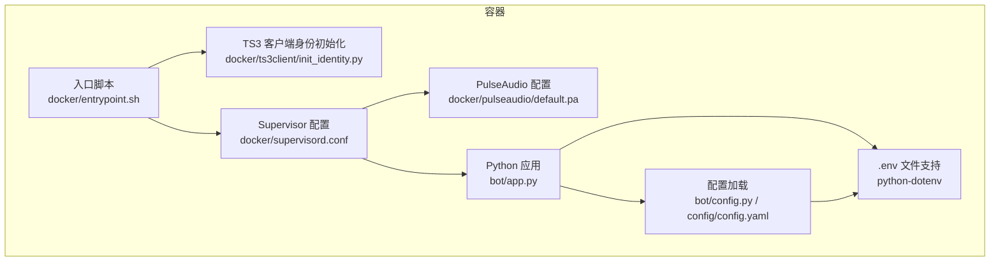
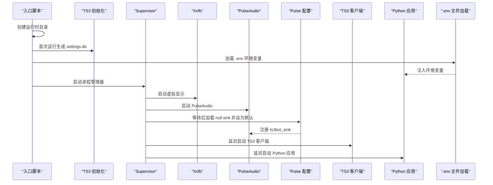
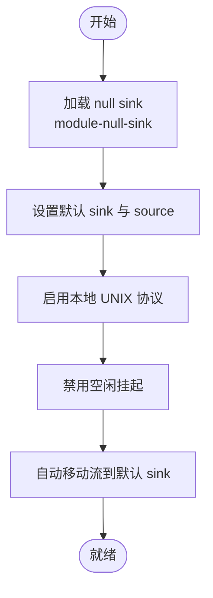
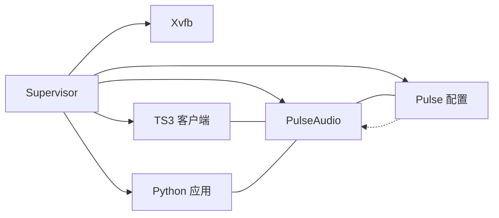
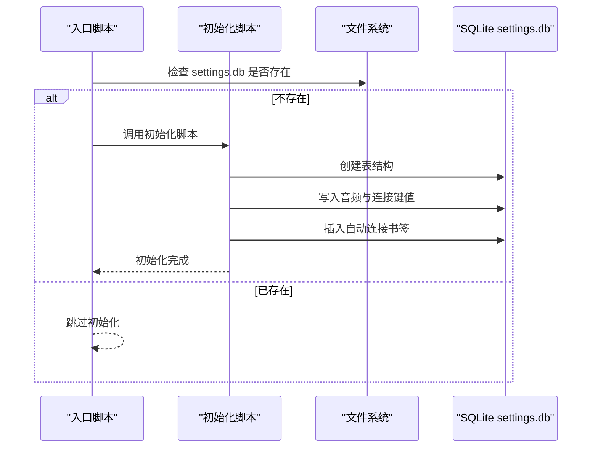
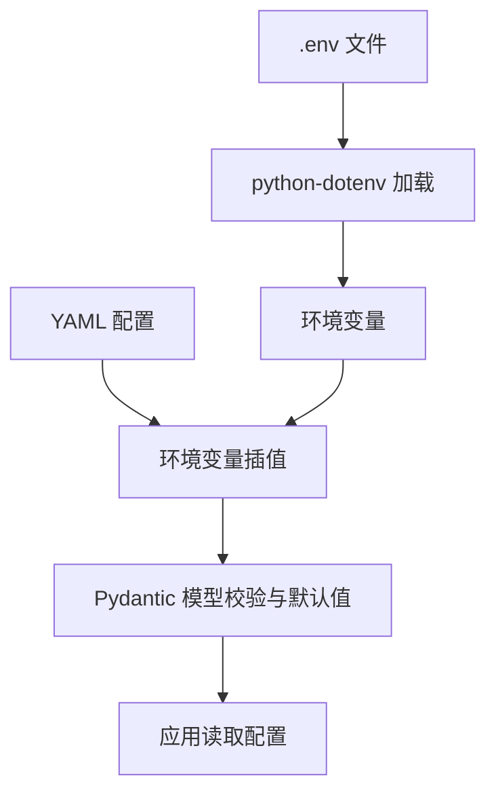
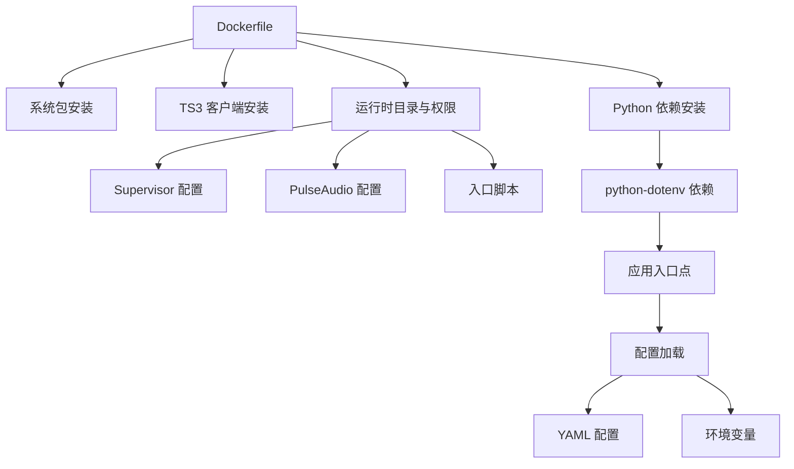

# 环境配置

<cite>
**本文引用的文件**
- [config/config.yaml](file://config/config.yaml)
- [bot/config.py](file://bot/config.py)
- [bot/app.py](file://bot/app.py)
- [bot/core/audio/controller.py](file://bot/core/audio/controller.py)
- [bot/core/audio/ffmpeg.py](file://bot/core/audio/ffmpeg.py)
- [bot/core/audio/volume.py](file://bot/core/audio/volume.py)
- [docker/pulseaudio/default.pa](file://docker/pulseaudio/default.pa)
- [docker/ts3client/init_identity.py](file://docker/ts3client/init_identity.py)
- [docker/supervisord.conf](file://docker/supervisord.conf)
- [docker/entrypoint.sh](file://docker/entrypoint.sh)
- [Dockerfile](file://Dockerfile)
- [docker-compose.yml](file://docker-compose.yml)
- [tests/conftest.py](file://tests/conftest.py)
- [requirements.txt](file://requirements.txt)
- [pyproject.toml](file://pyproject.toml)
- [bot/__main__.py](file://bot/__main__.py)
</cite>

## 更新摘要
**变更内容**
- 新增 python-dotenv 依赖支持，实现 .env 文件自动加载
- 在应用入口点集成 .env 文件加载机制
- 增强 Docker Compose 环境变量管理策略
- 保持原有配置系统与环境变量插值功能

## 目录
1. [简介](#简介)
2. [项目结构](#项目结构)
3. [核心组件](#核心组件)
4. [架构总览](#架构总览)
5. [详细组件分析](#详细组件分析)
6. [依赖关系分析](#依赖关系分析)
7. [性能考虑](#性能考虑)
8. [故障排查指南](#故障排查指南)
9. [结论](#结论)
10. [附录](#附录)

## 简介
本文件面向环境配置与部署，围绕以下主题展开：
- PulseAudio 音频配置：虚拟音频设备、默认输出、本地协议与延迟优化
- Supervisor 进程管理：多进程启动顺序、自动重启与日志管理
- TeamSpeak3 客户端身份初始化：SQLite 设置数据库、音频设备映射、连接参数
- 环境变量：配置项、默认值与自定义方式，包括 .env 文件支持
- 开发与生产差异策略与性能调优建议

## 项目结构
该项目采用容器化部署，核心由 Python 应用、PulseAudio、Supervisor 和 TS3 客户端组成。容器入口脚本负责初始化用户身份与运行时目录，并通过 Supervisor 统一管理各子进程。新增的 .env 文件支持为开发环境提供了便捷的配置管理方式。

**图表来源**
- [docker/entrypoint.sh:1-20](file://docker/entrypoint.sh#L1-L20)
- [docker/supervisord.conf:1-53](file://docker/supervisord.conf#L1-L53)
- [docker/pulseaudio/default.pa:1-20](file://docker/pulseaudio/default.pa#L1-L20)
- [docker/ts3client/init_identity.py:1-92](file://docker/ts3client/init_identity.py#L1-L92)
- [bot/app.py:1-348](file://bot/app.py#L1-L348)
- [bot/config.py:1-160](file://bot/config.py#L1-L160)
- [config/config.yaml:1-76](file://config/config.yaml#L1-L76)
- [bot/__main__.py:1-22](file://bot/__main__.py#L1-L22)

**章节来源**
- [docker/entrypoint.sh:1-20](file://docker/entrypoint.sh#L1-L20)
- [docker/supervisord.conf:1-53](file://docker/supervisord.conf#L1-L53)
- [docker/pulseaudio/default.pa:1-20](file://docker/pulseaudio/default.pa#L1-L20)
- [docker/ts3client/init_identity.py:1-92](file://docker/ts3client/init_identity.py#L1-L92)
- [bot/app.py:1-348](file://bot/app.py#L1-L348)
- [bot/config.py:1-160](file://bot/config.py#L1-L160)
- [config/config.yaml:1-76](file://config/config.yaml#L1-L76)
- [bot/__main__.py:1-22](file://bot/__main__.py#L1-L22)

## 核心组件
- 音频系统：通过 FFmpeg 将流媒体解码并写入 PulseAudio 虚拟 sink；音量控制分层（FFmpeg 滤镜 + pactl 实时调整），支持淡入淡出与状态机管理
- 进程管理：Supervisor 启动 Xvfb、PulseAudio、TS3 客户端与 Python 应用，统一日志与自动重启
- TS3 客户端身份：首次运行时生成 settings.db，映射音频设备到 PulseAudio 虚拟 sink，并可预设自动连接书签
- 配置系统：YAML 配置文件 + 环境变量插值，Pydantic 数据模型校验与默认值
- **新增** 环境变量管理：支持 .env 文件自动加载，增强开发环境配置便利性

**章节来源**
- [bot/core/audio/controller.py:1-143](file://bot/core/audio/controller.py#L1-L143)
- [bot/core/audio/ffmpeg.py:1-162](file://bot/core/audio/ffmpeg.py#L1-L162)
- [bot/core/audio/volume.py:1-113](file://bot/core/audio/volume.py#L1-L113)
- [docker/supervisord.conf:1-53](file://docker/supervisord.conf#L1-L53)
- [docker/ts3client/init_identity.py:1-92](file://docker/ts3client/init_identity.py#L1-L92)
- [bot/config.py:1-160](file://bot/config.py#L1-L160)
- [config/config.yaml:1-76](file://config/config.yaml#L1-L76)
- [bot/__main__.py:1-22](file://bot/__main__.py#L1-L22)

## 架构总览
容器启动流程概览如下：

**图表来源**
- [docker/entrypoint.sh:1-20](file://docker/entrypoint.sh#L1-L20)
- [docker/ts3client/init_identity.py:1-92](file://docker/ts3client/init_identity.py#L1-L92)
- [docker/supervisord.conf:1-53](file://docker/supervisord.conf#L1-L53)
- [bot/__main__.py:1-22](file://bot/__main__.py#L1-L22)

## 详细组件分析

### PulseAudio 音频配置
- 虚拟音频设备
  - 在容器内加载 null sink，命名为 ts3bot_sink，并设置为默认输出与默认源
  - 通过本地 UNIX 协议暴露给宿主或容器内的 FFmpeg 使用
- 默认行为
  - 禁止空闲挂起，避免在容器中因空闲导致音频中断
  - 自动将新流移动到默认 sink，减少手动路由开销
- 与应用集成
  - Python 应用通过 AudioController 与 FFmpegProcess 控制播放
  - VolumeController 通过 pactl 对 sink input 实时调节音量，实现平滑淡入淡出

**图表来源**
- [docker/pulseaudio/default.pa:1-20](file://docker/pulseaudio/default.pa#L1-L20)

**章节来源**
- [docker/pulseaudio/default.pa:1-20](file://docker/pulseaudio/default.pa#L1-L20)
- [bot/core/audio/controller.py:1-143](file://bot/core/audio/controller.py#L1-L143)
- [bot/core/audio/ffmpeg.py:1-162](file://bot/core/audio/ffmpeg.py#L1-L162)
- [bot/core/audio/volume.py:1-113](file://bot/core/audio/volume.py#L1-L113)

### Supervisor 进程管理配置
- 进程编排
  - Xvfb：虚拟显示，供 TS3 客户端 GUI 依赖
  - PulseAudio：音频服务，设置 DISPLAY 并保持常驻
  - Pulse 配置：延迟启动，确保 PulseAudio 就绪后再注册 null sink
  - TS3 客户端：延迟启动，等待 PulseAudio 与配置完成
  - Python 应用：延迟启动，等待 TS3 客户端可用
- 自动重启与日志
  - 所有程序均开启 autorestart，优先级从低到高，保证依赖链正确
  - 日志输出到 /data/logs 下的独立文件，便于问题定位
- 环境变量
  - DISPLAY 统一指向 :99
  - PULSE_SERVER 指向用户命名空间的 UNIX 套接字，确保 FFmpeg 与 TS3 客户端能访问

**图表来源**
- [docker/supervisord.conf:1-53](file://docker/supervisord.conf#L1-L53)

**章节来源**
- [docker/supervisord.conf:1-53](file://docker/supervisord.conf#L1-L53)

### TeamSpeak3 客户端身份初始化
- 目标
  - 首次运行时在用户家目录生成 settings.db，避免交互式初始化
  - 将音频采集/回放设备映射到 PulseAudio 的 ts3bot_sink 及其 monitor
  - 可选添加自动连接书签，使用环境变量中的服务器地址、端口与昵称
- 关键点
  - SQLite 表结构与键值遵循 TS3 客户端预期
  - 语音激活关闭，仅用于播放音频场景
  - 自动重连开启，提升稳定性

**图表来源**
- [docker/entrypoint.sh:1-20](file://docker/entrypoint.sh#L1-L20)
- [docker/ts3client/init_identity.py:1-92](file://docker/ts3client/init_identity.py#L1-L92)

**章节来源**
- [docker/entrypoint.sh:1-20](file://docker/entrypoint.sh#L1-L20)
- [docker/ts3client/init_identity.py:1-92](file://docker/ts3client/init_identity.py#L1-L92)

### 环境变量管理与 .env 文件支持
- **新增** .env 文件加载机制
  - 应用入口点自动加载项目根目录下的 .env 文件
  - 使用 python-dotenv 库实现环境变量注入
  - 支持开发环境的本地配置管理
- 配置来源
  - YAML 文件：config/config.yaml，包含 TS3、音频、网络云音乐、聊天、自动化、计划任务、Webhook、日志等
  - 环境变量插值：bot/config.py 中实现 ${VAR} 替换，支持在 YAML 中引用
  - **新增** .env 文件：支持项目根目录的 .env 文件配置
  - 默认值：Pydantic 模型提供字段默认值，未找到配置文件时仍可运行
- 关键环境变量
  - TS3_HOST、TS3_PASSWORD：TS3 服务器连接凭据
  - OPENAI_*：Chat 服务相关 API 基础地址、密钥与模型
  - WEBHOOK_SECRET：Webhook 访问密钥
  - NETEASE_API_URL：网易云接口地址（默认指向 host.docker.internal）
- Docker Compose 映射
  - env_file 引入 .env
  - 端口映射：WEBHOOK_PORT 映射到 8080
  - 共享卷：数据卷 /data 与身份卷 ~/.ts3client

**图表来源**
- [bot/__main__.py:1-22](file://bot/__main__.py#L1-L22)
- [config/config.yaml:1-76](file://config/config.yaml#L1-L76)
- [bot/config.py:1-160](file://bot/config.py#L1-L160)
- [docker-compose.yml:1-33](file://docker-compose.yml#L1-L33)

**章节来源**
- [bot/__main__.py:1-22](file://bot/__main__.py#L1-L22)
- [config/config.yaml:1-76](file://config/config.yaml#L1-L76)
- [bot/config.py:1-160](file://bot/config.py#L1-L160)
- [docker-compose.yml:1-33](file://docker-compose.yml#L1-L33)

## 依赖关系分析
- 容器构建依赖
  - 系统包：Xvfb、PulseAudio、FFmpeg、Qt/X11 依赖、Supervisor、sqlite3、wget 等
  - TS3 客户端：下载指定版本并解压到 /opt/ts3client
  - Python 依赖：requirements.txt，**新增** python-dotenv>=1.0
- 运行时依赖
  - PulseAudio 与 Xvfb 为 TS3 客户端 GUI 与音频提供支撑
  - Supervisor 统一管理生命周期与日志
  - Python 应用通过 Pydantic 配置模型与 YAML 配置文件驱动
  - **新增** python-dotenv 提供 .env 文件支持

**图表来源**
- [Dockerfile:1-100](file://Dockerfile#L1-L100)
- [pyproject.toml:1-36](file://pyproject.toml#L1-L36)

**章节来源**
- [Dockerfile:1-100](file://Dockerfile#L1-L100)
- [requirements.txt:1-11](file://requirements.txt#L1-L11)
- [pyproject.toml:1-36](file://pyproject.toml#L1-L36)

## 性能考虑
- PulseAudio 与 FFmpeg
  - 使用固定采样率与声道数（48kHz/立体声）以减少转码开销
  - 通过 pactl 实时音量调节配合 FFmpeg 滤镜，降低音频卡顿
  - 禁止空闲挂起，避免容器内音频中断
- 进程管理
  - 通过延迟启动与优先级排序，确保依赖链稳定
  - autorestart 提升可用性，但需结合日志监控防止无限重启
- 缓存与磁盘
  - 音频缓存目录位于 /data/cache，建议在生产环境挂载高性能持久卷
- 网络与 API
  - Chat 服务与网易云接口的超时与重试策略应在应用层合理配置
- 资源限制
  - docker-compose 中设置了共享内存与 tmpfs，可根据负载调整
- **新增** .env 文件性能
  - .env 文件加载在应用启动时进行，对运行时性能影响极小
  - 建议在开发环境使用 .env 文件简化配置管理

## 故障排查指南
- PulseAudio 相关
  - 确认 null sink 已加载且为默认 sink；检查本地 UNIX 协议套接字是否存在
  - 若音量无法调节，确认 pactl 可用且已刷新 sink input
- TS3 客户端
  - 首次运行是否成功生成 settings.db；自动连接书签是否正确
  - 环境变量 TS3_HOST/TS3_VOICE_PORT/TS3_NICKNAME 是否正确传入
- 进程管理
  - 查看 /data/logs 下各进程日志文件，确认启动顺序与错误堆栈
  - 检查 DISPLAY 与 PULSE_SERVER 环境变量是否一致
- 配置加载
  - 确认 YAML 文件路径与权限；检查环境变量插值是否生效
  - 未找到配置文件时，应用会回退到默认值，注意敏感信息（如密码）应通过环境变量注入
- **新增** .env 文件问题
  - 确认 .env 文件存在于项目根目录且具有正确的权限
  - 检查 .env 文件格式是否正确，键值对之间使用等号分隔
  - 验证 .env 文件未被 .gitignore 忽略

**章节来源**
- [docker/pulseaudio/default.pa:1-20](file://docker/pulseaudio/default.pa#L1-L20)
- [bot/core/audio/volume.py:1-113](file://bot/core/audio/volume.py#L1-L113)
- [docker/ts3client/init_identity.py:1-92](file://docker/ts3client/init_identity.py#L1-L92)
- [docker/supervisord.conf:1-53](file://docker/supervisord.conf#L1-L53)
- [bot/config.py:1-160](file://bot/config.py#L1-L160)
- [bot/__main__.py:1-22](file://bot/__main__.py#L1-L22)

## 结论
本项目通过容器化将音频、TS3 客户端与应用整合在同一运行环境中，借助 Supervisor 实现稳定的多进程编排，PulseAudio 提供可靠的虚拟音频输出。配置系统支持 YAML 与环境变量混合模式，既满足开发调试灵活性，也便于生产环境安全注入。**新增的 .env 文件支持进一步增强了开发环境的配置便利性**，通过 python-dotenv 实现自动加载，简化了本地开发的配置管理工作。按本文建议进行环境变量与资源规划，可获得更稳健的运行表现。

## 附录

### 开发环境与生产环境配置策略
- 开发环境
  - 使用 .env 文件集中管理环境变量，支持本地开发的灵活配置
  - 将 config/config.yaml 作为只读挂载，便于热更新配置
  - 临时卷 /tmp 与 /run/user/* 用于调试期快速迭代
  - **新增** .env 文件应包含开发所需的 API 密钥和测试配置
- 生产环境
  - 将敏感配置（TS3 密码、OpenAI 密钥、Webhook 密钥）置于外部密钥管理或环境注入
  - 持久卷挂载 /data 与 ~/.ts3client，确保日志与身份数据不丢失
  - 限制容器资源（CPU/内存/共享内存），并设置合理的健康检查
  - **新增** 生产环境建议使用 docker-compose 的 env_file 机制管理环境变量

### 环境变量清单与默认值
- TS3 连接
  - TS3_HOST：TS3 服务器地址（必填）
  - TS3_PASSWORD：服务器管理员密码（必填）
  - TS3_VOICE_PORT：语音端口，默认 9987
  - TS3_NICKNAME：机器人昵称，默认 MusicBot
- AI 聊天
  - OPENAI_API_BASE：API 基础地址，默认 https://api.openai.com/v1
  - OPENAI_API_KEY：API 密钥（必填）
  - OPENAI_MODEL：模型名称，默认 gpt-4o-mini
- Webhook
  - WEBHOOK_SECRET：密钥（可选）
  - WEBHOOK_PORT：对外端口，默认 8080
- 网易云接口
  - NETEASE_API_URL：接口地址，默认 host.docker.internal:3000
- 日志
  - LOG_LEVEL：日志级别，默认 INFO
  - LOG_FILE：日志文件路径，默认 /data/logs/bot.log
  - LOG_MAX_BYTES：单文件大小，默认 10MB
  - LOG_BACKUP_COUNT：备份数，默认 5
- **新增** .env 文件支持
  - 支持在项目根目录创建 .env 文件进行本地配置
  - .env 文件中的变量会自动注入到应用环境中
  - 建议使用 .env 文件存储开发环境的敏感配置

**章节来源**
- [config/config.yaml:1-76](file://config/config.yaml#L1-L76)
- [docker-compose.yml:1-33](file://docker-compose.yml#L1-L33)
- [bot/config.py:1-160](file://bot/config.py#L1-L160)
- [bot/__main__.py:1-22](file://bot/__main__.py#L1-L22)