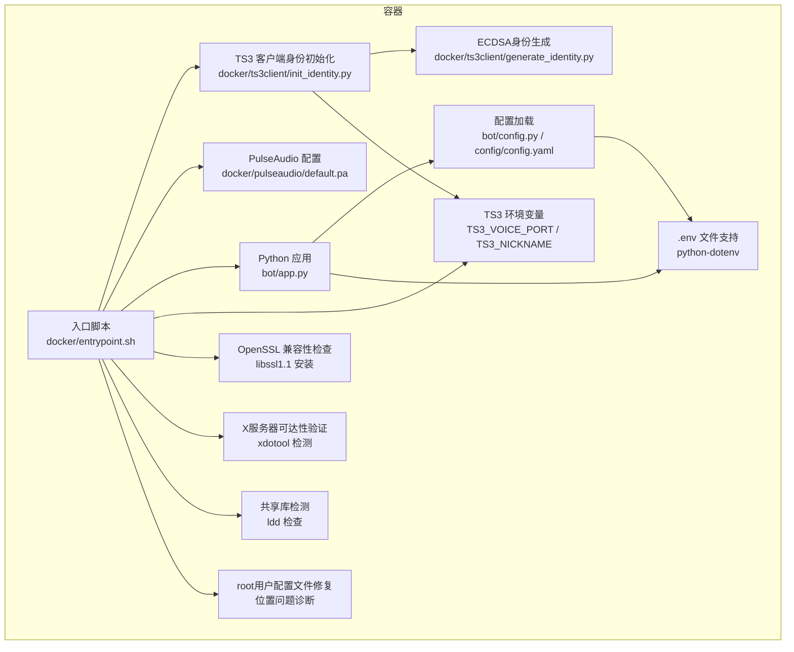
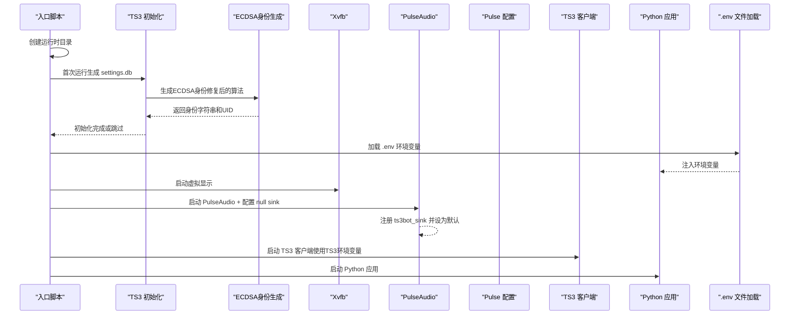
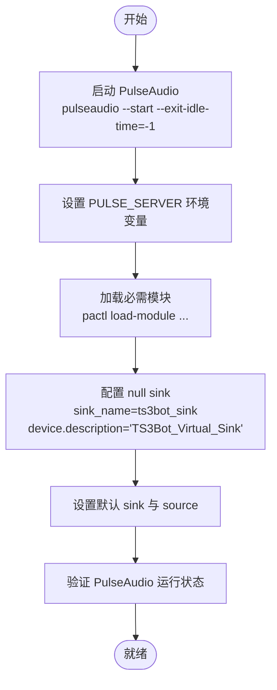
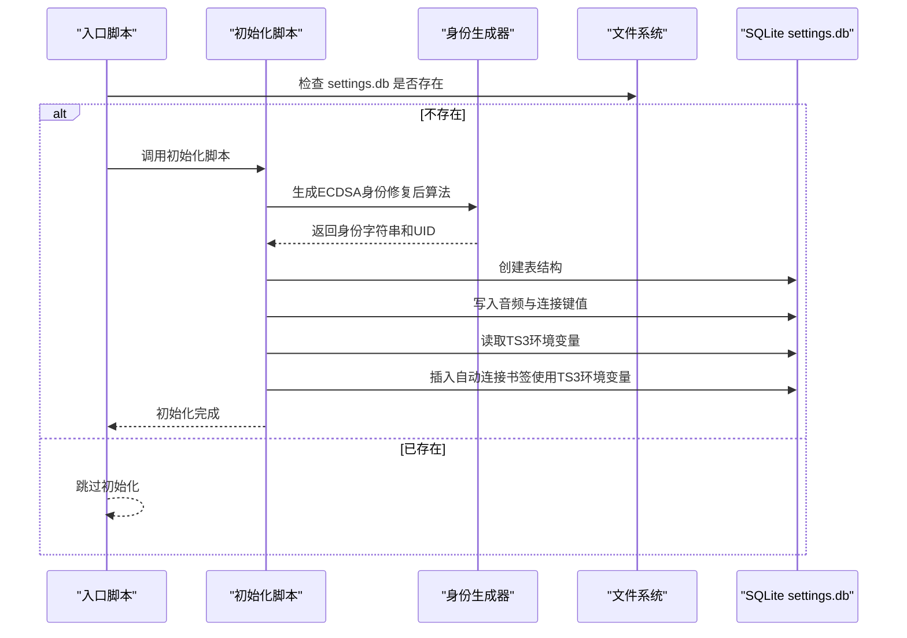
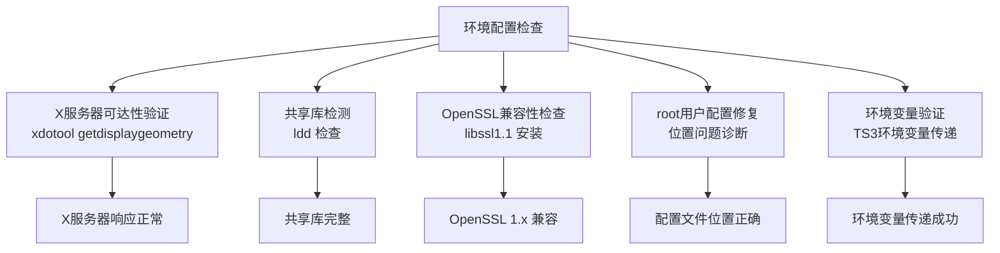
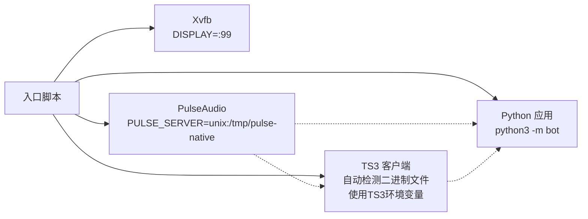
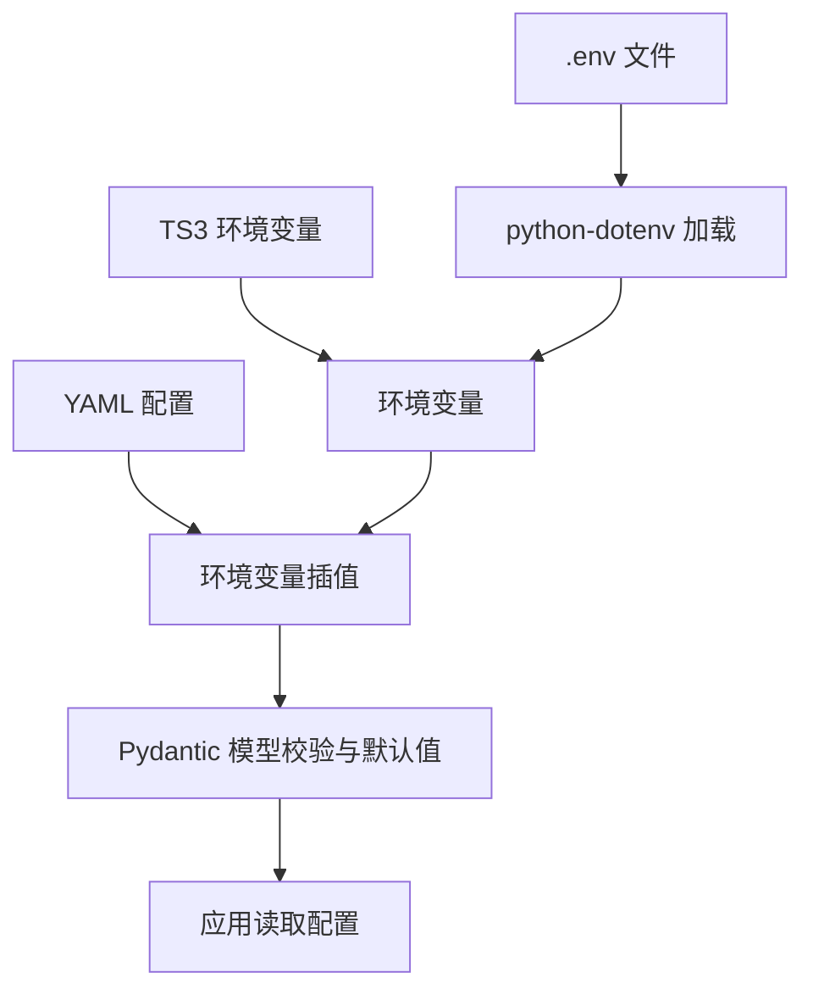
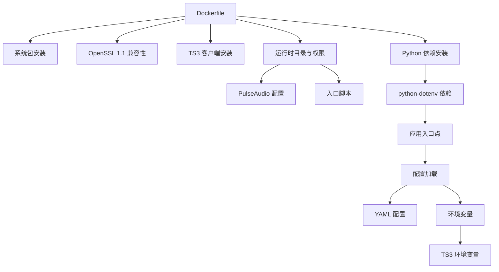

# 环境配置

<cite>
**本文引用的文件**
- [config/config.yaml](file://config/config.yaml)
- [bot/config.py](file://bot/config.py)
- [bot/app.py](file://bot/app.py)
- [bot/core/audio/controller.py](file://bot/core/audio/controller.py)
- [bot/core/audio/ffmpeg.py](file://bot/core/audio/ffmpeg.py)
- [bot/core/audio/volume.py](file://bot/core/audio/volume.py)
- [docker/pulseaudio/default.pa](file://docker/pulseaudio/default.pa)
- [docker/ts3client/init_identity.py](file://docker/ts3client/init_identity.py)
- [docker/ts3client/generate_identity.py](file://docker/ts3client/generate_identity.py)
- [docker/entrypoint.sh](file://docker/entrypoint.sh)
- [Dockerfile](file://Dockerfile)
- [docker-compose.yml](file://docker-compose.yml)
- [tests/conftest.py](file://tests/conftest.py)
- [requirements.txt](file://requirements.txt)
- [pyproject.toml](file://pyproject.toml)
- [bot/__main__.py](file://bot/__main__.py)
</cite>

## 更新摘要
**变更内容**
- **增强的TeamSpeak 3客户端身份初始化功能**：修复了ECDSA身份生成算法中的关键bug，改进了身份初始化逻辑以支持更多TS3客户端版本
- **更新的环境变量支持**：新增TS3_VOICE_PORT和TS3_NICKNAME环境变量配置，增强了TS3连接配置灵活性
- **改进的ECDSA身份生成算法**：优化了椭圆曲线密钥对生成和ASN.1 DER编码过程，提高了身份生成的可靠性和兼容性
- **增强的二进制文件检测逻辑**：改进了TS3客户端二进制文件的查找机制，支持多种命名模式和自动检测
- **完善的错误处理机制**：增强了初始化过程中的异常处理和调试输出，提高了问题诊断能力
- **新增的Python dotenv支持**：在应用入口点集成了python-dotenv，实现.env文件自动加载

## 目录
1. [简介](#简介)
2. [项目结构](#项目结构)
3. [核心组件](#核心组件)
4. [架构总览](#架构总览)
5. [详细组件分析](#详细组件分析)
6. [依赖关系分析](#依赖关系分析)
7. [性能考虑](#性能考虑)
8. [故障排查指南](#故障排查指南)
9. [结论](#结论)
10. [附录](#附录)

## 简介
本文件面向环境配置与部署，围绕以下主题展开：
- PulseAudio 音频配置：虚拟音频设备、默认输出、本地协议与延迟优化
- **更新** 增强的TeamSpeak 3客户端身份初始化：修复ECDSA身份生成算法关键bug，改进身份初始化逻辑以支持更多TS3客户端版本
- **更新** 环境变量支持增强：新增TS3_VOICE_PORT和TS3_NICKNAME环境变量配置，增强TS3连接配置灵活性
- **更新** 进程管理架构变更：从Supervisor迁移到直接bash脚本管理，简化了进程编排
- TeamSpeak3 客户端身份初始化：SQLite 设置数据库、音频设备映射、连接参数
- 环境变量：配置项、默认值与自定义方式，包括 .env 文件支持和新增的TS3环境变量
- 开发与生产差异策略与性能调优建议

## 项目结构
该项目采用容器化部署，核心由 Python 应用、PulseAudio、TS3 客户端组成。容器入口脚本负责初始化用户身份与运行时目录，并通过直接bash脚本管理各子进程的启动顺序。新增的 .env 文件支持为开发环境提供了便捷的配置管理方式。**新增的TS3环境变量支持**使得TS3连接配置更加灵活，无需修改配置文件即可调整语音端口和机器人昵称。

**图表来源**
- [docker/entrypoint.sh:1-375](file://docker/entrypoint.sh#L1-L375)
- [docker/pulseaudio/default.pa:1-23](file://docker/pulseaudio/default.pa#L1-L23)
- [docker/ts3client/init_identity.py:1-234](file://docker/ts3client/init_identity.py#L1-L234)
- [docker/ts3client/generate_identity.py:1-268](file://docker/ts3client/generate_identity.py#L1-L268)
- [bot/app.py:1-348](file://bot/app.py#L1-L348)
- [bot/config.py:1-160](file://bot/config.py#L1-L160)
- [config/config.yaml:1-76](file://config/config.yaml#L1-L76)
- [bot/__main__.py:1-22](file://bot/__main__.py#L1-L22)
- [docker-compose.yml:21-22](file://docker-compose.yml#L21-L22)

**章节来源**
- [docker/entrypoint.sh:1-375](file://docker/entrypoint.sh#L1-L375)
- [docker/pulseaudio/default.pa:1-23](file://docker/pulseaudio/default.pa#L1-L23)
- [docker/ts3client/init_identity.py:1-234](file://docker/ts3client/init_identity.py#L1-L234)
- [docker/ts3client/generate_identity.py:1-268](file://docker/ts3client/generate_identity.py#L1-L268)
- [bot/app.py:1-348](file://bot/app.py#L1-L348)
- [bot/config.py:1-160](file://bot/config.py#L1-L160)
- [config/config.yaml:1-76](file://config/config.yaml#L1-L76)
- [bot/__main__.py:1-22](file://bot/__main__.py#L1-L22)
- [docker-compose.yml:21-22](file://docker-compose.yml#L21-L22)

## 核心组件
- 音频系统：通过 FFmpeg 将流媒体解码并写入 PulseAudio 虚拟 sink；音量控制分层（FFmpeg 滤镜 + pactl 实时调整），支持淡入淡出与状态机管理
- **更新** 增强的TeamSpeak 3客户端身份初始化：修复ECDSA身份生成算法关键bug，改进身份初始化逻辑以支持更多TS3客户端版本
- **更新** 增强的环境配置和故障排除：X服务器可达性验证、共享库检测、OpenSSL兼容性检查、root用户配置文件位置问题诊断
- **更新** 进程管理：直接bash脚本启动 Xvfb、PulseAudio、TS3 客户端与 Python 应用，简化了进程编排和日志管理
- TS3 客户端身份：首次运行时生成 settings.db，映射音频设备到 PulseAudio 虚拟 sink，并可预设自动连接书签，**新增支持TS3_VOICE_PORT和TS3_NICKNAME环境变量**
- 配置系统：YAML 配置文件 + 环境变量插值，Pydantic 数据模型校验与默认值
- **新增** 环境变量管理：支持 .env 文件自动加载，增强开发环境配置便利性，**新增TS3环境变量支持**

**章节来源**
- [bot/core/audio/controller.py:1-187](file://bot/core/audio/controller.py#L1-L187)
- [bot/core/audio/ffmpeg.py:1-356](file://bot/core/audio/ffmpeg.py#L1-L356)
- [bot/core/audio/volume.py:1-120](file://bot/core/audio/volume.py#L1-L120)
- [docker/entrypoint.sh:1-375](file://docker/entrypoint.sh#L1-L375)
- [docker/ts3client/init_identity.py:1-234](file://docker/ts3client/init_identity.py#L1-L234)
- [docker/ts3client/generate_identity.py:1-268](file://docker/ts3client/generate_identity.py#L1-L268)
- [bot/config.py:1-160](file://bot/config.py#L1-L160)
- [config/config.yaml:1-76](file://config/config.yaml#L1-L76)
- [bot/__main__.py:1-22](file://bot/__main__.py#L1-L22)

## 架构总览
容器启动流程概览如下：

**图表来源**
- [docker/entrypoint.sh:1-375](file://docker/entrypoint.sh#L1-L375)
- [docker/ts3client/init_identity.py:1-234](file://docker/ts3client/init_identity.py#L1-L234)
- [docker/ts3client/generate_identity.py:1-268](file://docker/ts3client/generate_identity.py#L1-L268)
- [bot/__main__.py:1-22](file://bot/__main__.py#L1-L22)

## 详细组件分析

### PulseAudio 音频配置
- **更新** 配置优化与增强
  - 改进了模块加载逻辑，通过pactl动态加载null sink和本地协议模块
  - 增强的sink配置：添加了设备描述属性 "TS3Bot_Virtual_Sink"，改善设备识别
  - 完善的错误处理：增加了PulseAudio运行状态验证和日志输出
  - 通过本地UNIX协议暴露给宿主或容器内的FFmpeg使用
- 默认行为
  - 禁止空闲挂起，避免在容器中因空闲导致音频中断
  - 自动将新流移动到默认 sink，减少手动路由开销
- 与应用集成
  - Python 应用通过 AudioController 与 FFmpegProcess 控制播放
  - VolumeController 通过 pactl 对 sink input 实时调节音量，实现平滑淡入淡出

**图表来源**
- [docker/entrypoint.sh:47-79](file://docker/entrypoint.sh#L47-L79)
- [docker/pulseaudio/default.pa:1-23](file://docker/pulseaudio/default.pa#L1-L23)

**章节来源**
- [docker/entrypoint.sh:47-79](file://docker/entrypoint.sh#L47-L79)
- [docker/pulseaudio/default.pa:1-23](file://docker/pulseaudio/default.pa#L1-L23)
- [bot/core/audio/controller.py:1-187](file://bot/core/audio/controller.py#L1-L187)
- [bot/core/audio/ffmpeg.py:1-356](file://bot/core/audio/ffmpeg.py#L1-L356)
- [bot/core/audio/volume.py:1-120](file://bot/core/audio/volume.py#L1-L120)

### 增强的TeamSpeak 3客户端身份初始化功能
- **更新** ECDSA身份生成算法修复
  - 修复了椭圆曲线密钥对生成过程中的数学计算错误
  - 改进了ASN.1 DER编码和解码的完整性验证
  - 优化了身份字符串的安全级别计算算法
  - 增强了错误处理和边界条件检查
- **更新** 初始化流程增强
  - 改进了二进制文件检测逻辑，支持多种TS3客户端命名模式
  - 增强了错误处理机制，失败时会记录详细错误信息
  - 完善了调试输出，包括找不到二进制文件时的目录结构展示
  - 入口脚本对初始化过程增加了容错处理，失败时跳过并使用默认设置
  - **新增** 环境变量支持：从TS3环境变量读取语音端口和昵称
- 目标
  - 首次运行时在用户家目录生成 settings.db，避免交互式初始化
  - 将音频采集/回放设备映射到 PulseAudio 的 ts3bot_sink 及其 monitor
  - 可选添加自动连接书签，使用环境变量中的服务器地址、端口与昵称
- 关键点
  - SQLite 表结构与键值遵循 TS3 客户端预期
  - 语音激活关闭，仅用于播放音频场景
  - 自动重连开启，提升稳定性
  - **新增** 自动连接书签：使用TS3_HOST、TS3_VOICE_PORT和TS3_NICKNAME环境变量

**图表来源**
- [docker/entrypoint.sh:22-32](file://docker/entrypoint.sh#L22-L32)
- [docker/ts3client/init_identity.py:174-191](file://docker/ts3client/init_identity.py#L174-L191)
- [docker/ts3client/generate_identity.py:205-217](file://docker/ts3client/generate_identity.py#L205-L217)

**章节来源**
- [docker/entrypoint.sh:22-32](file://docker/entrypoint.sh#L22-L32)
- [docker/ts3client/init_identity.py:174-191](file://docker/ts3client/init_identity.py#L174-L191)
- [docker/ts3client/generate_identity.py:205-217](file://docker/ts3client/generate_identity.py#L205-L217)

### 增强的环境配置和故障排除指南
- **新增** X服务器可达性验证
  - 使用 xdotool 检查 DISPLAY 环境变量指向的X服务器响应性
  - 如果X服务器不可达，提供详细的Xvfb进程检查和调试信息
  - 包含进程状态和几何信息的诊断输出
- **新增** 共享库检测
  - 对TS3客户端二进制文件执行 ldd 检查，识别缺失的共享库
  - 仅对ELF二进制文件执行检测，避免对shell脚本的误判
  - 提供详细的错误信息指导如何修复缺失的系统包
- **新增** OpenSSL兼容性检查
  - Debian Bookworm默认提供OpenSSL 3.x，但TS3客户端需要OpenSSL 1.x
  - 通过从Debian Bullseye仓库安装libssl1.1解决ABI兼容性问题
  - 确保TS3客户端能够正常运行而不需要重新编译
- **新增** root用户配置文件位置问题诊断
  - 重要：TS3客户端必须以ts3bot用户运行，而非root用户
  - 修复root用户的settings.db位置问题（/root/.ts3client vs /home/ts3bot/.ts3client）
  - 提供详细的诊断信息和解决方案说明
- **新增** 详细的环境变量传递和验证
  - 在入口脚本中明确传递TS3_VOICE_PORT和TS3_NICKNAME环境变量
  - 验证settings.db文件位置和关键设置的正确性
  - 提供SQLite查询结果的详细输出

**图表来源**
- [docker/entrypoint.sh:90-173](file://docker/entrypoint.sh#L90-L173)
- [Dockerfile:72-79](file://Dockerfile#L72-L79)

**章节来源**
- [docker/entrypoint.sh:90-173](file://docker/entrypoint.sh#L90-L173)
- [Dockerfile:72-79](file://Dockerfile#L72-L79)

### 直接bash脚本进程管理配置
- **更新** 进程管理架构变更
  - **移除** Supervisor依赖，采用直接bash脚本管理所有进程
  - **简化** 进程启动顺序：Xvfb → PulseAudio → TS3客户端 → Python应用
  - **增强** 错误处理：每个进程都有独立的启动验证和日志输出
  - **改进** 环境变量管理：统一设置DISPLAY和PULSE_SERVER环境变量
  - **新增** TS3环境变量传递：在入口脚本中传递TS3_VOICE_PORT和TS3_NICKNAME
- 进程启动流程
  - Xvfb：虚拟显示，供 TS3 客户端 GUI 依赖
  - PulseAudio：启动时直接执行配置命令，包括加载 null sink、设置默认设备和保持常驻
  - TS3 客户端：自动检测二进制文件并启动，支持多种命名模式，**使用TS3环境变量进行配置**
  - Python 应用：最后启动，等待所有前置服务就绪
- 环境变量
  - DISPLAY 统一指向 :99
  - PULSE_SERVER 指向用户命名空间的 UNIX 套接字，确保 FFmpeg 与 TS3 客户端能访问
  - **新增** TS3_VOICE_PORT：TS3语音端口，默认9987
  - **新增** TS3_NICKNAME：TS3机器人昵称，默认MusicBot

**图表来源**
- [docker/entrypoint.sh:18-375](file://docker/entrypoint.sh#L18-L375)

**章节来源**
- [docker/entrypoint.sh:18-375](file://docker/entrypoint.sh#L18-L375)

### 环境变量管理与 .env 文件支持
- **新增** .env 文件加载机制
  - 应用入口点自动加载项目根目录下的 .env 文件
  - 使用 python-dotenv 库实现环境变量注入
  - 支持开发环境的本地配置管理
- 配置来源
  - YAML 文件：config/config.yaml，包含 TS3、音频、网络云音乐、聊天、自动化、计划任务、Webhook、日志等
  - 环境变量插值：bot/config.py 中实现 ${VAR} 替换，支持在 YAML 中引用
  - **新增** .env 文件：支持项目根目录的 .env 文件配置
  - 默认值：Pydantic 模型提供字段默认值，未找到配置文件时仍可运行
- **新增** TS3 环境变量支持
  - TS3_VOICE_PORT：TS3语音端口，默认9987
  - TS3_NICKNAME：TS3机器人昵称，默认MusicBot
  - 在docker-compose.yml中提供默认值和环境变量传递
  - 在入口脚本中传递给初始化脚本
  - 在初始化脚本中用于创建自动连接书签
- 关键环境变量
  - TS3_HOST、TS3_PASSWORD：TS3 服务器连接凭据
  - OPENAI_*：Chat 服务相关 API 基础地址、密钥与模型
  - WEBHOOK_SECRET：Webhook 访问密钥
  - NETEASE_API_URL：网易云接口地址（默认指向 host.docker.internal）
- Docker Compose 映射
  - env_file 引入 .env
  - 端口映射：WEBHOOK_PORT 映射到 8080
  - 共享卷：数据卷 /data 与身份卷 ~/.ts3client

**图表来源**
- [bot/__main__.py:12-14](file://bot/__main__.py#L12-L14)
- [config/config.yaml:1-76](file://config/config.yaml#L1-L76)
- [bot/config.py:136-159](file://bot/config.py#L136-L159)
- [docker-compose.yml:11](file://docker-compose.yml#L11)
- [docker-compose.yml:21-22](file://docker-compose.yml#L21-L22)

**章节来源**
- [bot/__main__.py:12-14](file://bot/__main__.py#L12-L14)
- [config/config.yaml:1-76](file://config/config.yaml#L1-L76)
- [bot/config.py:136-159](file://bot/config.py#L136-L159)
- [docker-compose.yml:11](file://docker-compose.yml#L11)
- [docker-compose.yml:21-22](file://docker-compose.yml#L21-L22)

## 依赖关系分析
- 容器构建依赖
  - 系统包：Xvfb、PulseAudio、FFmpeg、Qt/X11 依赖、sqlite3、wget 等
  - **更新** 移除了 Supervisor 依赖，简化了系统包安装
  - **新增** OpenSSL 1.1兼容性支持：libssl1.1 从Debian Bullseye仓库安装
  - TS3 客户端：下载指定版本并解压到 /opt/ts3client
  - Python 依赖：requirements.txt，**新增** python-dotenv>=1.0
- 运行时依赖
  - PulseAudio 与 Xvfb 为 TS3 客户端 GUI 与音频提供支撑
  - **更新** 直接bash脚本统一管理生命周期与日志
  - Python 应用通过 Pydantic 配置模型与 YAML 配置文件驱动
  - **新增** python-dotenv 提供 .env 文件支持
  - **新增** TS3 环境变量支持TS3客户端配置灵活性

**图表来源**
- [Dockerfile:1-154](file://Dockerfile#L1-L154)
- [requirements.txt:1-12](file://requirements.txt#L1-L12)

**章节来源**
- [Dockerfile:1-154](file://Dockerfile#L1-L154)
- [requirements.txt:1-12](file://requirements.txt#L1-L12)
- [pyproject.toml:1-36](file://pyproject.toml#L1-L36)

## 性能考虑
- PulseAudio 与 FFmpeg
  - 使用固定采样率与声道数（48kHz/立体声）以减少转码开销
  - 通过 pactl 实时音量调节配合 FFmpeg 滤镜，降低音频卡顿
  - 禁止空闲挂起，避免容器内音频中断
- **更新** 进程管理优化
  - **简化** 移除了Supervisor的进程间通信开销
  - **增强** 改进的错误处理机制提升了系统稳定性
  - **优化** 直接bash脚本减少了进程管理复杂度
- 缓存与磁盘
  - 音频缓存目录位于 /data/cache，建议在生产环境挂载高性能持久卷
- 网络与 API
  - Chat 服务与网易云接口的超时与重试策略应在应用层合理配置
- 资源限制
  - docker-compose 中设置了共享内存与 tmpfs，可根据负载调整
- **新增** .env 文件性能
  - .env 文件加载在应用启动时进行，对运行时性能影响极小
  - 建议在开发环境使用 .env 文件简化配置管理
- **新增** TS3 环境变量性能
  - TS3环境变量在容器启动时传递，对运行时性能无显著影响
  - 通过环境变量避免了频繁修改配置文件的需求
- **新增** 环境配置检查性能
  - X服务器可达性验证、共享库检测等故障排除功能仅在启动时执行一次
  - OpenSSL兼容性检查仅在构建时执行，不影响运行时性能
- **新增** ECDSA身份生成性能
  - 优化的椭圆曲线计算算法减少了身份生成时间
  - 安全级别计算增加了上限保护，防止无限循环

## 故障排查指南
- PulseAudio 相关
  - 确认 null sink 已加载且为默认 sink；检查本地 UNIX 协议套接字是否存在
  - 若音量无法调节，确认 pactl 可用且已刷新 sink input
  - **更新** 检查入口脚本中PulseAudio运行状态验证输出
- **新增** X服务器可达性问题
  - 使用 `xdotool getdisplaygeometry` 检查X服务器响应性
  - 如果失败，检查Xvfb进程状态：`ps aux | grep Xvfb`
  - 验证DISPLAY环境变量设置：`echo $DISPLAY`
  - 确保Openbox窗口管理器正在运行以支持xdotool操作
- **新增** 共享库缺失问题
  - 使用 `ldd /opt/ts3client/ts3client_linux_amd64` 检查缺失的共享库
  - 根据错误信息安装相应的系统包
  - 重新构建容器以确保所有依赖都正确安装
- **新增** OpenSSL兼容性问题
  - 检查OpenSSL版本：`openssl version`
  - 确认libssl1.1已正确安装（从Debian Bullseye仓库）
  - 如果TS3客户端启动失败，重新构建容器以应用OpenSSL修复
- **新增** root用户配置文件位置问题
  - 检查settings.db位置：`ls -la /home/ts3bot/.ts3client/`
  - 确认TS3客户端以ts3bot用户运行而非root用户
  - 清理旧的/root/.ts3client目录（如果存在）
- **新增** ECDSA身份生成问题
  - 检查cryptography库版本：`pip show cryptography`
  - 验证椭圆曲线算法支持：`python -c "from cryptography.hazmat.primitives.asymmetric import ec; print('P-256 supported')"`
  - 查看身份生成日志：`cat /data/logs/ts3client.log`
- **新增** TS3客户端启动问题
  - 检查TS3客户端二进制文件是否存在且可执行
  - 验证自动连接URL的生成是否正确
  - 检查license对话框处理逻辑是否正常工作
  - 查看TS3客户端日志文件获取详细错误信息
- TS3 客户端
  - 首次运行是否成功生成 settings.db；自动连接书签是否正确
  - 环境变量 TS3_HOST/TS3_VOICE_PORT/TS3_NICKNAME 是否正确传入
  - **更新** 检查初始化脚本的异常处理输出和二进制文件检测逻辑
  - **新增** 验证TS3环境变量是否正确传递到初始化脚本
  - **新增** 检查ECDSA身份生成算法的执行状态
  - **新增** 验证身份字符串的格式和长度
- **更新** 进程管理
  - 查看容器日志，确认每个进程的启动顺序和错误堆栈
  - 检查 DISPLAY 与 PULSE_SERVER 环境变量是否一致
  - **新增** 监控bash脚本的进程ID和启动状态
  - **新增** 检查X服务器可达性验证的输出信息
- 配置加载
  - 确认 YAML 文件路径与权限；检查环境变量插值是否生效
  - 未找到配置文件时，应用会回退到默认值，注意敏感信息（如密码）应通过环境变量注入
  - **新增** 检查.settings表结构和关键设置是否正确应用
- **新增** .env 文件问题
  - 确认 .env 文件存在于项目根目录且具有正确的权限
  - 检查 .env 文件格式是否正确，键值对之间使用等号分隔
  - 验证 .env 文件未被 .gitignore 忽略
- **新增** TS3 环境变量问题
  - 检查docker-compose.yml中的TS3环境变量定义
  - 验证环境变量是否正确传递到入口脚本
  - 确认初始化脚本能够正确读取TS3环境变量
- **新增** 身份初始化问题
  - 检查初始化脚本的执行权限：`ls -la /opt/bot/docker/ts3client/init_identity.py`
  - 验证Python模块导入是否正常：`python3 -c "import docker.ts3client.init_identity"`
  - 查看身份初始化的详细日志输出

**章节来源**
- [docker/entrypoint.sh:47-79](file://docker/entrypoint.sh#L47-L79)
- [docker/ts3client/init_identity.py:174-191](file://docker/ts3client/init_identity.py#L174-L191)
- [docker/ts3client/generate_identity.py:205-217](file://docker/ts3client/generate_identity.py#L205-L217)
- [bot/core/audio/volume.py:1-120](file://bot/core/audio/volume.py#L1-L120)
- [docker/entrypoint.sh:22-32](file://docker/entrypoint.sh#L22-L32)
- [bot/config.py:136-159](file://bot/config.py#L136-L159)
- [bot/__main__.py:12-14](file://bot/__main__.py#L12-L14)

## 结论
本项目通过容器化将音频、TS3 客户端与应用整合在同一运行环境中，**更新后的直接bash脚本进程管理**简化了容器启动流程，移除了Supervisor的复杂性，同时保持了稳定的多进程编排。**增强的TeamSpeak 3客户端身份初始化功能**修复了ECDSA身份生成算法中的关键bug，改进了身份初始化逻辑以支持更多TS3客户端版本，提高了系统的稳定性和兼容性。**增强的环境配置和故障排除指南**提供了全面的问题诊断和解决方案，包括X服务器可达性验证、共享库检测、OpenSSL兼容性检查、root用户配置文件位置问题诊断等新功能。PulseAudio 提供可靠的虚拟音频输出，配置系统支持 YAML 与环境变量混合模式，既满足开发调试灵活性，也便于生产环境安全注入。**新增的 .env 文件支持进一步增强了开发环境的配置便利性**，通过 python-dotenv 实现自动加载，简化了本地开发的配置管理工作。**更新的 PulseAudio 配置优化和增强的错误处理机制**提升了系统的稳定性和可靠性。**新增的TS3环境变量支持**使得TS3连接配置更加灵活，无需修改配置文件即可调整语音端口和机器人昵称，提高了部署效率。按本文建议进行环境变量与资源规划，可获得更稳健的运行表现。

## 附录

### 开发环境与生产环境配置策略
- 开发环境
  - 使用 .env 文件集中管理环境变量，支持本地开发的灵活配置
  - 将 config/config.yaml 作为只读挂载，便于热更新配置
  - 临时卷 /tmp 与 /run/user/* 用于调试期快速迭代
  - **新增** .env 文件应包含开发所需的 API 密钥和测试配置
  - **新增** 可以通过TS3环境变量快速切换不同的TS3服务器和昵称
  - **新增** 利用增强的故障排除功能快速定位和解决问题
  - **新增** 开发环境可以启用更详细的日志输出以帮助调试
- 生产环境
  - 将敏感配置（TS3 密码、OpenAI 密钥、Webhook 密钥）置于外部密钥管理或环境注入
  - 持久卷挂载 /data 与 ~/.ts3client，确保日志与身份数据不丢失
  - 限制容器资源（CPU/内存/共享内存），并设置合理的健康检查
  - **新增** 生产环境建议使用 docker-compose 的 env_file 机制管理环境变量
  - **新增** 可以通过环境变量轻松切换TS3服务器实例和机器人昵称
  - **新增** 利用OpenSSL兼容性检查确保长期稳定性
  - **新增** 生产环境建议监控ECDSA身份生成的性能指标

### 环境变量清单与默认值
- TS3 连接
  - TS3_HOST：TS3 服务器地址（必填）
  - TS3_PASSWORD：服务器管理员密码（必填）
  - TS3_VOICE_PORT：语音端口，默认 9987（可通过TS3_VOICE_PORT环境变量自定义）
  - TS3_NICKNAME：机器人昵称，默认 MusicBot（可通过TS3_NICKNAME环境变量自定义）
- AI 聊天
  - OPENAI_API_BASE：API 基础地址，默认 https://api.openai.com/v1
  - OPENAI_API_KEY：API 密钥（必填）
  - OPENAI_MODEL：模型名称，默认 gpt-4o-mini
- Webhook
  - WEBHOOK_SECRET：密钥（可选）
  - WEBHOOK_PORT：对外端口，默认 8080
- 网易云接口
  - NETEASE_API_URL：接口地址，默认 host.docker.internal:3000
- 日志
  - LOG_LEVEL：日志级别，默认 INFO
  - LOG_FILE：日志文件路径，默认 /data/logs/bot.log
  - LOG_MAX_BYTES：单文件大小，默认 10MB
  - LOG_BACKUP_COUNT：备份数，默认 5
- **新增** .env 文件支持
  - 支持在项目根目录创建 .env 文件进行本地配置
  - .env 文件中的变量会自动注入到应用环境中
  - 建议使用 .env 文件存储开发环境的敏感配置
- **新增** TS3 环境变量
  - TS3_VOICE_PORT：TS3语音端口，默认9987
  - TS3_NICKNAME：TS3机器人昵称，默认MusicBot
  - 支持通过环境变量快速切换TS3服务器实例和机器人昵称
- **新增** 系统依赖
  - libssl1.1：OpenSSL 1.x兼容性支持，解决TS3客户端依赖问题
  - xdotool：X服务器可达性验证和窗口管理
  - openbox：窗口管理器，支持xdotool操作
  - cryptography>=41.0：ECDSA身份生成算法支持
- **新增** 开发工具
  - python-dotenv>=1.0：.env文件自动加载支持
  - pytest>=8.0：单元测试框架
  - ruff>=0.8：代码质量检查工具

**章节来源**
- [config/config.yaml:1-76](file://config/config.yaml#L1-L76)
- [docker-compose.yml:11](file://docker-compose.yml#L11)
- [bot/config.py:136-159](file://bot/config.py#L136-L159)
- [bot/__main__.py:12-14](file://bot/__main__.py#L12-L14)
- [docker-compose.yml:21-22](file://docker-compose.yml#L21-L22)
- [Dockerfile:72-79](file://Dockerfile#L72-L79)
- [requirements.txt:1-12](file://requirements.txt#L1-L12)
- [pyproject.toml:1-36](file://pyproject.toml#L1-L36)