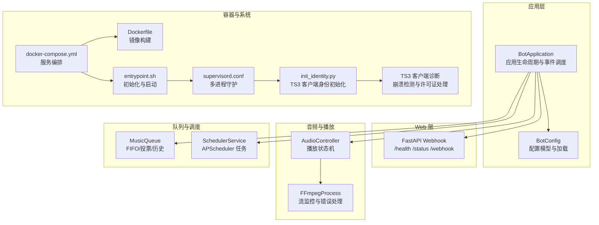
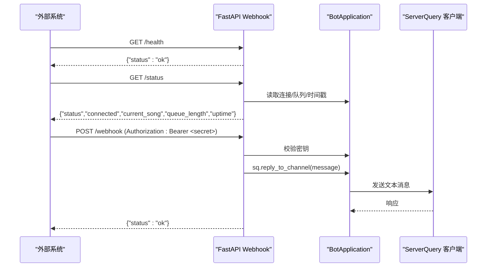
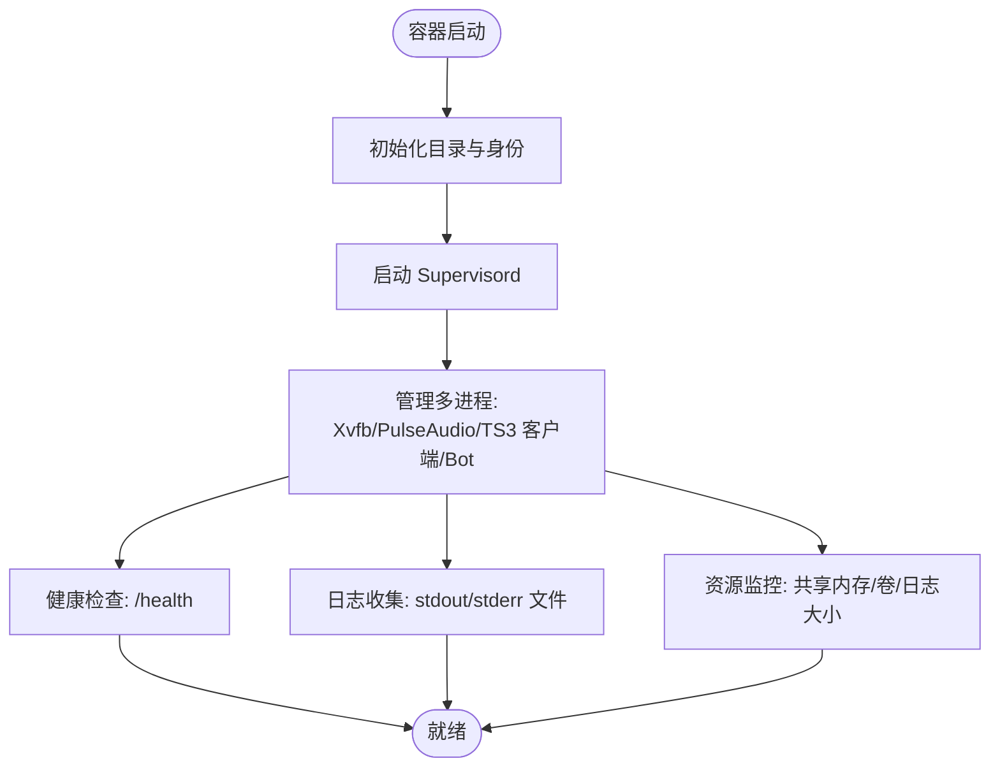
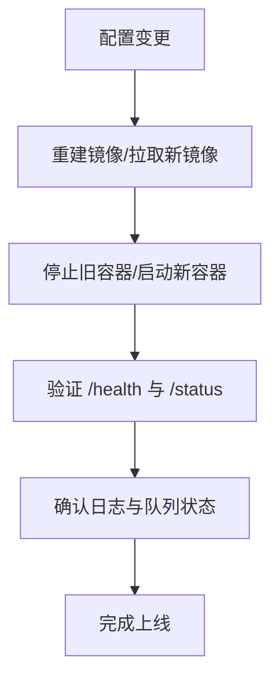
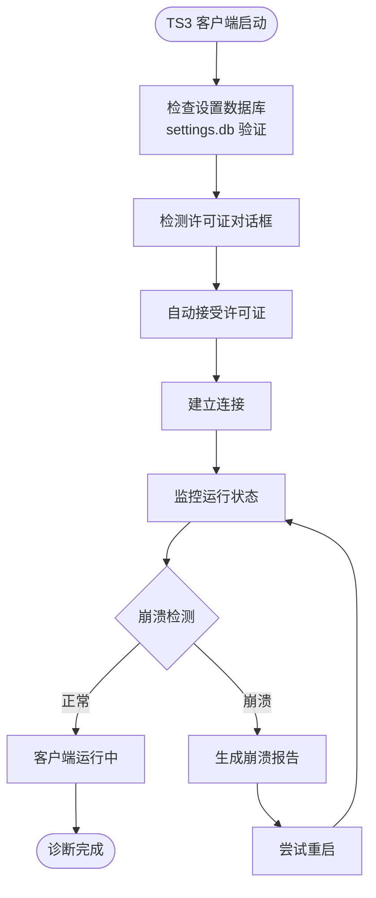
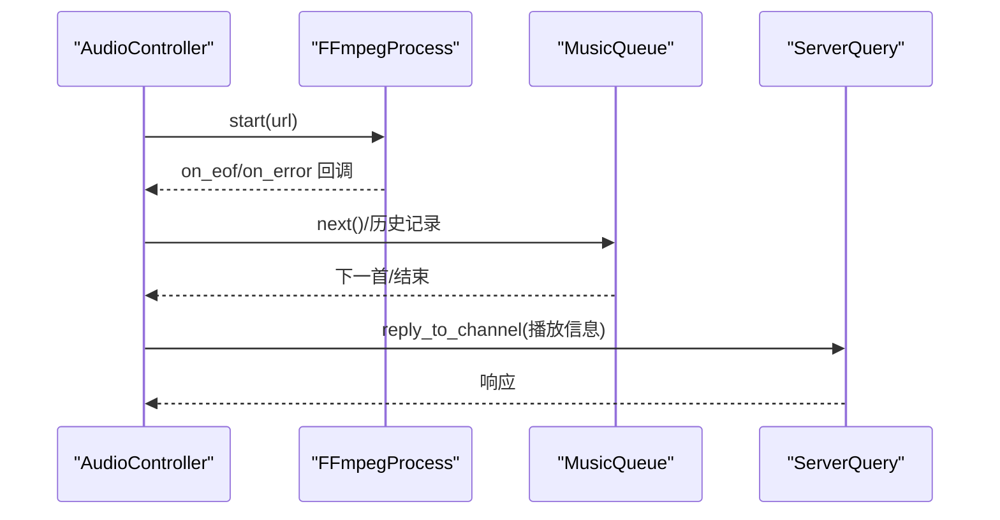
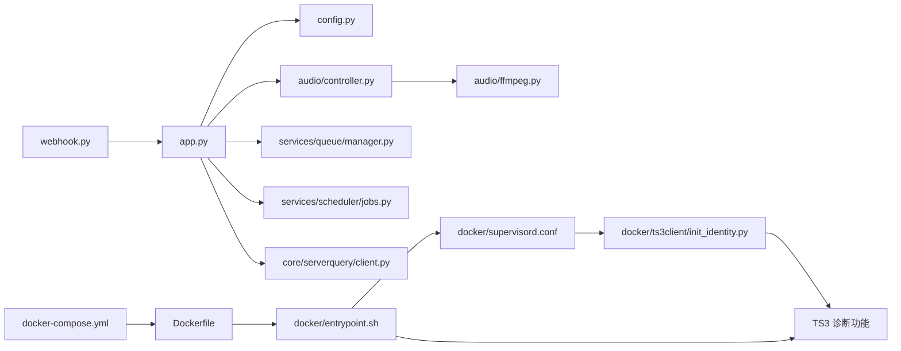

# 监控与维护

<cite>
**本文引用的文件**
- [bot/web/webhook.py](file://bot/web/webhook.py)
- [bot/app.py](file://bot/app.py)
- [bot/config.py](file://bot/config.py)
- [config/config.yaml](file://config/config.yaml)
- [docker-compose.yml](file://docker-compose.yml)
- [Dockerfile](file://Dockerfile)
- [docker/entrypoint.sh](file://docker/entrypoint.sh)
- [docker/supervisord.conf](file://docker/supervisord.conf)
- [docker/ts3client/init_identity.py](file://docker/ts3client/init_identity.py)
- [bot/core/commands/handlers/debug.py](file://bot/core/commands/handlers/debug.py)
- [bot/core/audio/controller.py](file://bot/core/audio/controller.py)
- [bot/core/audio/ffmpeg.py](file://bot/core/audio/ffmpeg.py)
- [bot/core/serverquery/client.py](file://bot/core/serverquery/client.py)
- [bot/core/serverquery/events.py](file://bot/core/serverquery/events.py)
- [bot/services/queue/manager.py](file://bot/services/queue/manager.py)
- [bot/services/scheduler/jobs.py](file://bot/services/scheduler/jobs.py)
- [bot/services/netease/client.py](file://bot/services/netease/client.py)
- [bot/services/netease/cache.py](file://bot/services/netease/cache.py)
</cite>

## 目录
1. [简介](#简介)
2. [项目结构](#项目结构)
3. [核心组件](#核心组件)
4. [架构总览](#架构总览)
5. [详细组件分析](#详细组件分析)
6. [依赖分析](#依赖分析)
7. [性能考虑](#性能考虑)
8. [故障排除指南](#故障排除指南)
9. [结论](#结论)
10. [附录](#附录)

## 简介
本文件面向运维与维护场景，围绕以下目标展开：  
- Webhook API 的监控接口：健康检查、状态查询与性能指标获取路径  
- 容器监控策略：进程状态、资源使用与日志收集  
- 维护任务自动化：定期清理、备份策略与更新升级流程  
- 故障排除：常见错误诊断、日志分析方法与应急响应  
- 性能优化与容量规划：基于现有实现的建议与扩展策略  
- **TS3客户端诊断功能**：设置数据库验证、崩溃报告和许可证对话框处理机制

## 项目结构
项目采用模块化分层组织，Webhook API、应用主控、配置与容器编排相互解耦，便于独立部署与监控。



**图表来源**
- [bot/app.py:27-110](file://bot/app.py#L27-L110)
- [bot/web/webhook.py:16-75](file://bot/web/webhook.py#L16-L75)
- [bot/core/audio/controller.py:24-143](file://bot/core/audio/controller.py#L24-L143)
- [bot/core/audio/ffmpeg.py:90-161](file://bot/core/audio/ffmpeg.py#L90-L161)
- [bot/services/queue/manager.py:35-204](file://bot/services/queue/manager.py#L35-L204)
- [bot/services/scheduler/jobs.py:18-50](file://bot/services/scheduler/jobs.py#L18-L50)
- [docker-compose.yml:1-33](file://docker-compose.yml#L1-L33)
- [Dockerfile:1-100](file://Dockerfile#L1-L100)
- [docker/entrypoint.sh:1-20](file://docker/entrypoint.sh#L1-L20)
- [docker/supervisord.conf:1-53](file://docker/supervisord.conf#L1-L53)
- [docker/ts3client/init_identity.py:12-83](file://docker/ts3client/init_identity.py#L12-L83)

**章节来源**
- [bot/app.py:27-110](file://bot/app.py#L27-L110)
- [bot/web/webhook.py:16-75](file://bot/web/webhook.py#L16-L75)
- [docker-compose.yml:1-33](file://docker-compose.yml#L1-L33)
- [Dockerfile:1-100](file://Dockerfile#L1-L100)

## 核心组件
- Webhook API：提供健康检查、状态查询与外部通知入口，支持可选密钥鉴权
- 应用主控：负责服务实例化、事件注册、后台服务（Webhook、调度）启动与优雅停机
- 配置系统：集中管理 TS3、音频、网络、日志、Webhook 等参数，并支持环境变量插值
- 音频播放：基于 FFmpeg 的播放控制与错误监控，配合音量控制器
- 队列与调度：音乐队列管理与定时提醒任务
- 容器运行：Supervisord 多进程守护、TS3 客户端身份初始化、日志与缓存目录挂载
- **TS3客户端诊断**：自动设置数据库验证、许可证对话框处理、崩溃检测与报告机制

**章节来源**
- [bot/web/webhook.py:32-75](file://bot/web/webhook.py#L32-L75)
- [bot/app.py:255-301](file://bot/app.py#L255-L301)
- [bot/config.py:125-160](file://bot/config.py#L125-L160)
- [config/config.yaml:62-76](file://config/config.yaml#L62-L76)
- [bot/core/audio/controller.py:24-143](file://bot/core/audio/controller.py#L24-L143)
- [bot/core/audio/ffmpeg.py:90-161](file://bot/core/audio/ffmpeg.py#L90-L161)
- [bot/services/queue/manager.py:35-204](file://bot/services/queue/manager.py#L35-L204)
- [bot/services/scheduler/jobs.py:18-50](file://bot/services/scheduler/jobs.py#L18-L50)
- [docker/supervisord.conf:1-53](file://docker/supervisord.conf#L1-L53)
- [docker/ts3client/init_identity.py:12-83](file://docker/ts3client/init_identity.py#L12-L83)

## 架构总览
Webhook API 作为外部可观测性入口，与应用主控共享上下文；应用主控通过配置驱动各子系统；容器层提供稳定的运行环境与进程守护。

```mermaid
graph TB
C["客户端/外部系统"] --> H["/health 健康检查"]
C --> S["/status 状态查询"]
C --> W["/webhook Webhook 推送"]
subgraph "应用主控"
A["BotApplication"]
Q["MusicQueue"]
AU["AudioController"]
FF["FFmpegProcess"]
SC["SchedulerService"]
CF["BotConfig"]
end
subgraph "容器与系统"
SU["Supervisord"]
TS["TS3 客户端"]
PA["PulseAudio"]
XV["Xvfb 虚拟显示"]
DI["TS3 客户端诊断"]
END
H --> A
S --> A
W --> A
A --> Q
A --> AU
AU --> FF
A --> SC
A --> CF
SU --> XV
SU --> PA
SU --> TS
TS --> DI
```

**图表来源**
- [bot/web/webhook.py:39-73](file://bot/web/webhook.py#L39-L73)
- [bot/app.py:255-301](file://bot/app.py#L255-L301)
- [bot/services/queue/manager.py:35-204](file://bot/services/queue/manager.py#L35-L204)
- [bot/core/audio/controller.py:24-143](file://bot/core/audio/controller.py#L24-L143)
- [bot/core/audio/ffmpeg.py:90-161](file://bot/core/audio/ffmpeg.py#L90-L161)
- [bot/services/scheduler/jobs.py:18-50](file://bot/services/scheduler/jobs.py#L18-L50)
- [docker/supervisord.conf:8-41](file://docker/supervisord.conf#L8-L41)

## 详细组件分析

### Webhook API 监控接口
- /health：返回服务健康状态，用于容器/平台健康探针
- /status：返回运行状态、连接状态、当前歌曲、队列长度与运行时长
- /webhook：接收外部消息并转发至指定频道，支持 Bearer 密钥鉴权



**图表来源**
- [bot/web/webhook.py:39-73](file://bot/web/webhook.py#L39-L73)
- [bot/app.py:255-301](file://bot/app.py#L255-L301)
- [bot/core/serverquery/client.py:165-200](file://bot/core/serverquery/client.py#L165-L200)

**章节来源**
- [bot/web/webhook.py:32-75](file://bot/web/webhook.py#L32-L75)
- [bot/config.py:110-115](file://bot/config.py#L110-L115)
- [config/config.yaml:62-67](file://config/config.yaml#L62-L67)

### 容器监控策略
- 进程状态监控：Supervisord 管理 Xvfb、PulseAudio、TS3 客户端与 Python Bot，自动重启与日志输出
- 资源使用情况：容器层面限制共享内存与临时空间，日志轮转与缓存目录挂载
- 日志收集：标准输出与文件日志结合，Supervisord 各程序独立日志文件



**图表来源**
- [docker/entrypoint.sh:6-19](file://docker/entrypoint.sh#L6-L19)
- [docker/supervisord.conf:8-52](file://docker/supervisord.conf#L8-L52)
- [docker-compose.yml:9-28](file://docker-compose.yml#L9-L28)
- [bot/config.py:117-123](file://bot/config.py#L117-L123)

**章节来源**
- [docker/entrypoint.sh:1-20](file://docker/entrypoint.sh#L1-L20)
- [docker/supervisord.conf:1-53](file://docker/supervisord.conf#L1-L53)
- [docker-compose.yml:1-33](file://docker-compose.yml#L1-L33)
- [bot/config.py:117-123](file://bot/config.py#L117-L123)

### 维护任务自动化流程
- 定期清理：TTL 缓存按过期键清理；日志轮转由配置控制
- 备份策略：数据卷 /data 与 TS3 客户端身份目录持久化
- 更新升级：容器镜像重建与滚动更新，配置热插拔（通过环境变量与配置文件）



**图表来源**
- [Dockerfile:74-96](file://Dockerfile#L74-L96)
- [docker-compose.yml:3-6](file://docker-compose.yml#L3-L6)
- [bot/web/webhook.py:71-73](file://bot/web/webhook.py#L71-L73)

**章节来源**
- [bot/services/netease/cache.py:9-45](file://bot/services/netease/cache.py#L9-L45)
- [bot/config.py:117-123](file://bot/config.py#L117-L123)
- [docker-compose.yml:9-13](file://docker-compose.yml#L9-L13)

### TS3客户端诊断功能

**新增** 详细的TS3客户端诊断功能，包括设置数据库验证、崩溃报告和许可证对话框处理

TS3客户端诊断功能提供了全面的自动化故障排除机制：

- **设置数据库验证**：启动前检查settings.db的存在性和正确性，验证关键设置项
- **许可证对话框处理**：自动检测并处理许可证/EULA对话框，防止headless模式阻塞
- **崩溃检测与报告**：监控TS3客户端进程状态，捕获崩溃信息并生成诊断报告
- **自动修复机制**：通过xdotool自动点击确认按钮，确保客户端能够正常启动



**图表来源**
- [docker/ts3client/init_identity.py:47-85](file://docker/ts3client/init_identity.py#L47-L85)
- [docker/entrypoint.sh:193-227](file://docker/entrypoint.sh#L193-L227)
- [docker/entrypoint.sh:233-250](file://docker/entrypoint.sh#L233-L250)

**章节来源**
- [docker/ts3client/init_identity.py:18-85](file://docker/ts3client/init_identity.py#L18-L85)
- [docker/entrypoint.sh:81-261](file://docker/entrypoint.sh#L81-L261)

### 音频播放与错误处理
- 播放状态机：IDLE/PLAYING/PAUSED，回调触发自动播放下一首或错误处理
- FFmpeg 监控：stderr 行读取、退出码判断、EOF 与错误事件上报
- ServerQuery 事件：文本消息路由、事件订阅与异常安全调用



**图表来源**
- [bot/core/audio/controller.py:70-143](file://bot/core/audio/controller.py#L70-L143)
- [bot/core/audio/ffmpeg.py:127-161](file://bot/core/audio/ffmpeg.py#L127-L161)
- [bot/services/queue/manager.py:90-119](file://bot/services/queue/manager.py#L90-L119)
- [bot/core/serverquery/client.py:165-200](file://bot/core/serverquery/client.py#L165-L200)

**章节来源**
- [bot/core/audio/controller.py:24-143](file://bot/core/audio/controller.py#L24-L143)
- [bot/core/audio/ffmpeg.py:90-161](file://bot/core/audio/ffmpeg.py#L90-L161)
- [bot/services/queue/manager.py:35-204](file://bot/services/queue/manager.py#L35-L204)
- [bot/core/serverquery/events.py:102-155](file://bot/core/serverquery/events.py#L102-L155)

## 依赖分析
- Webhook 依赖应用上下文与配置中的密钥字段
- 应用主控依赖配置模型、音频控制器、队列、调度与 ServerQuery 客户端
- 容器层依赖 Dockerfile、docker-compose 与 supervisord 配置
- **TS3客户端诊断依赖**：sqlite3数据库操作、xdotool窗口控制、环境变量配置



**图表来源**
- [bot/web/webhook.py:32-75](file://bot/web/webhook.py#L32-L75)
- [bot/app.py:27-110](file://bot/app.py#L27-L110)
- [bot/config.py:125-160](file://bot/config.py#L125-L160)
- [bot/core/audio/controller.py:24-143](file://bot/core/audio/controller.py#L24-L143)
- [bot/core/audio/ffmpeg.py:90-161](file://bot/core/audio/ffmpeg.py#L90-L161)
- [bot/services/queue/manager.py:35-204](file://bot/services/queue/manager.py#L35-L204)
- [bot/services/scheduler/jobs.py:18-50](file://bot/services/scheduler/jobs.py#L18-L50)
- [bot/core/serverquery/client.py:27-100](file://bot/core/serverquery/client.py#L27-L100)
- [docker-compose.yml:1-33](file://docker-compose.yml#L1-L33)
- [Dockerfile:1-100](file://Dockerfile#L1-L100)
- [docker/entrypoint.sh:1-20](file://docker/entrypoint.sh#L1-L20)
- [docker/supervisord.conf:1-53](file://docker/supervisord.conf#L1-L53)
- [docker/ts3client/init_identity.py:12-83](file://docker/ts3client/init_identity.py#L12-L83)

**章节来源**
- [bot/web/webhook.py:32-75](file://bot/web/webhook.py#L32-L75)
- [bot/app.py:27-110](file://bot/app.py#L27-L110)
- [bot/config.py:125-160](file://bot/config.py#L125-L160)

## 性能考虑
- 音频链路：避免频繁暂停/恢复，合理设置淡入淡出时长；CDN 链接过期时重新提取
- 队列与调度：队列长度与历史记录上限可控；定时任务并发安全（事件派发已做异常保护）
- 容器资源：共享内存与临时空间限制，日志轮转避免磁盘膨胀
- 网络依赖：yt-dlp 提取 URL，搜索结果使用 TTL 缓存降低 API 压力
- **TS3客户端性能**：通过自动诊断减少启动失败率，提高整体系统稳定性

## 故障排除指南
- Webhook 认证失败：检查 Authorization 头是否为 Bearer <secret>，并与配置一致
- /status 返回异常：确认应用已连接 ServerQuery，队列状态正常
- 播放中断：查看 FFmpeg 错误日志与播放回调事件；检查 CDN 链接是否过期
- ServerQuery 断连：关注重连逻辑与事件派发异常日志
- 容器进程崩溃：检查 Supervisord 各程序日志与容器健康探针
- **TS3客户端启动失败**：检查许可证对话框处理、设置数据库验证、X11连接状态
- **TS3客户端崩溃**：查看崩溃报告、检查共享库依赖、验证音频设备配置

**章节来源**
- [bot/web/webhook.py:35-49](file://bot/web/webhook.py#L35-L49)
- [bot/core/audio/ffmpeg.py:127-161](file://bot/core/audio/ffmpeg.py#L127-L161)
- [bot/core/serverquery/client.py:214-249](file://bot/core/serverquery/client.py#L214-L249)
- [bot/core/serverquery/events.py:132-138](file://bot/core/serverquery/events.py#L132-L138)
- [docker/supervisord.conf:8-52](file://docker/supervisord.conf#L8-L52)
- [docker/entrypoint.sh:193-250](file://docker/entrypoint.sh#L193-L250)

## 结论
本项目提供了轻量级但完整的监控与维护能力：Webhook API 支持健康检查与状态查询；容器层以 Supervisord 实现稳定运行与日志收集；应用主控通过配置驱动各子系统，具备良好的可观测性与可维护性。**新增的TS3客户端诊断功能进一步增强了系统的自愈能力，通过自动化的设置验证、许可证处理和崩溃检测，显著降低了TS3客户端相关的故障率。** 建议在生产环境中启用 Webhook 并结合容器健康探针与日志聚合，持续观察播放链路与队列状态，确保服务稳定运行。

## 附录

### Webhook API 规范
- /health：GET，返回服务健康状态
- /status：GET，需 Authorization: Bearer <secret>，返回运行状态、连接、当前歌曲、队列长度与运行时长
- /webhook：POST，需 Authorization: Bearer <secret>，请求体包含消息与频道 ID，成功返回状态

**章节来源**
- [bot/web/webhook.py:39-73](file://bot/web/webhook.py#L39-L73)
- [config/config.yaml:62-67](file://config/config.yaml#L62-L67)

### 配置要点
- Webhook 开关、主机、端口与密钥
- 日志级别、格式、文件路径与轮转参数
- TS3 主机、凭据、虚拟服务器与昵称
- 音频设备、默认音量与缓存目录

**章节来源**
- [bot/config.py:110-133](file://bot/config.py#L110-L133)
- [config/config.yaml:62-76](file://config/config.yaml#L62-L76)

### TS3客户端诊断配置
- 设置数据库验证：自动检查settings.db的完整性与关键设置
- 许可证自动接受：预设license/accepted_version和gui/eula_accepted
- 崩溃检测：监控进程退出码并生成诊断报告
- 窗口控制：使用xdotool自动处理许可证对话框和确认按钮

**章节来源**
- [docker/ts3client/init_identity.py:47-85](file://docker/ts3client/init_identity.py#L47-L85)
- [docker/entrypoint.sh:193-250](file://docker/entrypoint.sh#L193-L250)