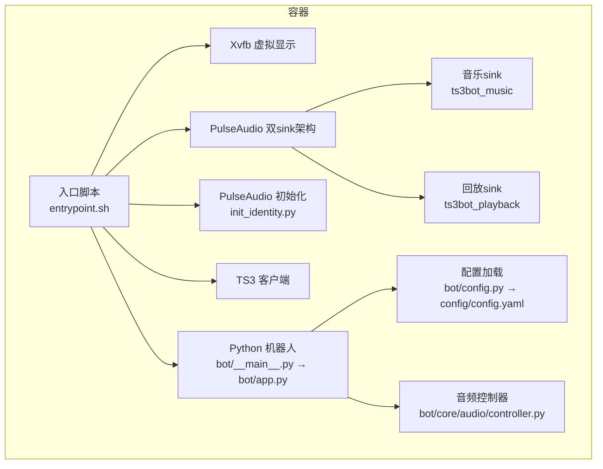
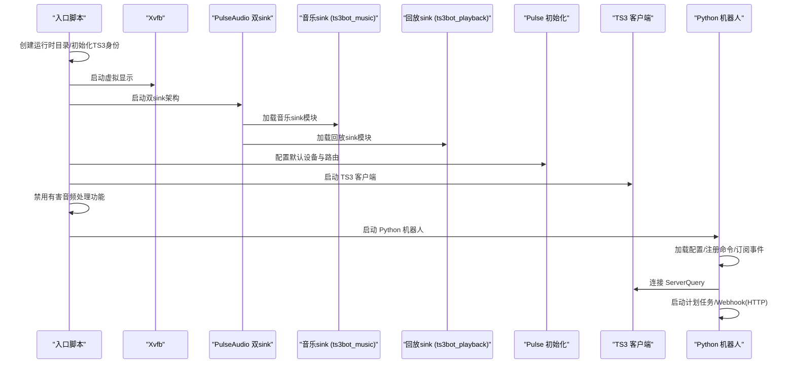
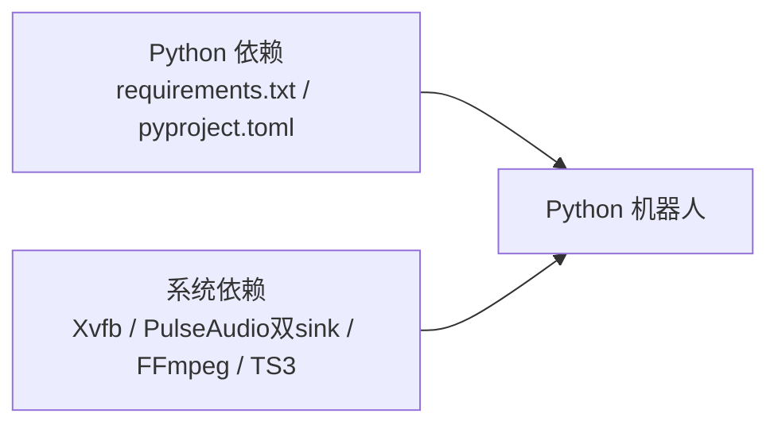

# 部署和运维

<cite>
**本文引用的文件**
- [Dockerfile](file://Dockerfile)
- [docker-compose.yml](file://docker-compose.yml)
- [entrypoint.sh](file://docker/entrypoint.sh)
- [supervisord.conf](file://docker/supervisord.conf)
- [default.pa](file://docker/pulseaudio/default.pa)
- [init_identity.py](file://docker/ts3client/init_identity.py)
- [config.py](file://bot/config.py)
- [config.yaml](file://config/config.yaml)
- [requirements.txt](file://requirements.txt)
- [pyproject.toml](file://pyproject.toml)
- [app.py](file://bot/app.py)
- [__main__.py](file://bot/__main__.py)
- [webhook.py](file://bot/web/webhook.py)
- [controller.py](file://bot/core/audio/controller.py)
</cite>

## 更新摘要
**变更内容**
- 增强的数据库迁移功能：在迁移过程中自动禁用有害的音频处理功能
- 新增音频处理功能禁用机制，确保新旧用户都能获得最佳的音乐播放体验
- 更新音频系统架构说明，强调音乐播放质量优化
- 新增音频处理功能的详细配置说明

## 目录
1. [简介](#简介)
2. [项目结构](#项目结构)
3. [核心组件](#核心组件)
4. [架构总览](#架构总览)
5. [详细组件分析](#详细组件分析)
6. [依赖分析](#依赖分析)
7. [性能考量](#性能考量)
8. [故障排除指南](#故障排除指南)
9. [结论](#结论)
10. [附录](#附录)

## 简介
本文件面向部署与运维工程师，系统性说明该 Teamspeak3 机器人的容器化部署流程与运行机制，涵盖镜像构建、服务编排、环境配置、进程管理、服务监控、性能优化与故障排除等主题，并提供生产环境最佳实践与安全建议。

## 项目结构
该项目采用"容器内直接进程控制"的架构：通过入口脚本直接管理虚拟显示（Xvfb）、音频（PulseAudio双sink架构）、TS3 客户端与 Python 机器人主程序；Python 主程序负责命令处理、音乐队列、AI 聊天、自动化服务与可选的 Webhook HTTP 服务。

**更新** 架构重构：从单sink向双sink架构迁移，实现语音隔离和音频处理优化

章节来源
- [Dockerfile:1-153](file://Dockerfile#L1-L153)
- [docker-compose.yml:1-40](file://docker-compose.yml#L1-L40)
- [entrypoint.sh:1-504](file://docker/entrypoint.sh#L1-L504)
- [supervisord.conf:1-49](file://docker/supervisord.conf#L1-L49)
- [default.pa:1-30](file://docker/pulseaudio/default.pa#L1-L30)
- [init_identity.py:1-255](file://docker/ts3client/init_identity.py#L1-L255)
- [config.yaml:1-77](file://config/config.yaml#L1-L77)
- [requirements.txt:1-11](file://requirements.txt#L1-L11)
- [pyproject.toml:1-36](file://pyproject.toml#L1-L36)
- [controller.py:1-187](file://bot/core/audio/controller.py#L1-L187)

## 核心组件
- 容器镜像与运行时
  - 基于精简 Python 运行时，安装虚拟显示、音频解码、TS3 客户端依赖与进程管理工具。
  - 构建阶段复制应用代码与 Docker 相关配置，运行阶段创建非特权用户与数据目录。
- 入口脚本
  - 初始化运行时目录、首次运行生成 TS3 客户端身份信息、直接启动 Xvfb、PulseAudio双sink架构、TS3 客户端与 Python 机器人主程序。
- 音频与显示
  - 使用双sink架构的PulseAudio，音乐sink专门用于FFmpeg输出，回放sink用于TS3客户端播放其他用户的音频，有效防止回音。
- 配置系统
  - 从 YAML 加载配置并通过环境变量插值，支持密钥类字段的安全封装。
- Webhook 服务
  - 可选的 HTTP 接入点，用于外部系统触发消息发送与状态查询。
- **新增** 音频处理优化
  - 自动禁用TS3客户端中有害的音频处理功能，包括回声消除、噪声抑制和自动增益控制，确保音乐播放质量。

**更新** 架构重构：双sink架构实现语音隔离，移除Supervisor依赖，新增音频处理优化

章节来源
- [Dockerfile:1-153](file://Dockerfile#L1-L153)
- [entrypoint.sh:1-504](file://docker/entrypoint.sh#L1-L504)
- [default.pa:1-30](file://docker/pulseaudio/default.pa#L1-L30)
- [init_identity.py:177-214](file://docker/ts3client/init_identity.py#L177-L214)
- [config.py:48-55](file://bot/config.py#L48-L55)
- [config.yaml:1-77](file://config/config.yaml#L1-L77)
- [webhook.py:32-76](file://bot/web/webhook.py#L32-L76)
- [controller.py:1-187](file://bot/core/audio/controller.py#L1-L187)

## 架构总览
容器内进程生命周期由入口脚本直接管理，确保各子进程按序启动与自动重启。Python 机器人通过 ServerQuery 与 TS3 交互，使用 FFmpeg 播放音频，结合 Netease/yt-dlp 获取音源，可选地对外暴露 Webhook HTTP 服务。双sink架构确保音乐播放不会被TS3客户端捕获形成回音，同时自动禁用有害的音频处理功能以优化音乐播放质量。

**更新** 架构重构：双sink架构确保语音隔离，新增音频处理功能禁用机制

章节来源
- [entrypoint.sh:101-133](file://docker/entrypoint.sh#L101-L133)
- [default.pa:7-20](file://docker/pulseaudio/default.pa#L7-L20)
- [init_identity.py:177-214](file://docker/ts3client/init_identity.py#L177-L214)
- [app.py:283-348](file://bot/app.py#L283-L348)
- [webhook.py:32-76](file://bot/web/webhook.py#L32-L76)

## 详细组件分析

### 容器镜像与构建流程
- 基础镜像与系统包
  - 选择轻量 Python 运行时，安装虚拟显示、PulseAudio、FFmpeg、TS3 客户端所需 X11/Qt 依赖与进程管理工具。
- TS3 客户端安装
  - 通过下载官方客户端安装包并解压到固定路径，保证无头运行能力。
- 应用层准备
  - 复制 Python 依赖清单、应用代码与 Docker 相关配置。
- 运行时用户与权限
  - 创建非特权用户，设置数据目录与配置目录归属，避免容器内 root 写权限问题。
- PulseAudio 配置注入
  - 注入双sink架构的PulseAudio配置，确保音频可用且实现语音隔离。

**更新** 移除Supervisor依赖，简化镜像构建，新增双sink配置

章节来源
- [Dockerfile:1-153](file://Dockerfile#L1-L153)

### 编排与环境配置（docker-compose）
- 服务定义
  - 构建上下文指向仓库根，容器名固定，重启策略为除非手动停止。
- 平台特定配置
  - 指定 `platforms: linux/amd64` 和 `platform: linux/amd64`，确保镜像构建和运行在 AMD64 架构上，增强跨平台部署的兼容性和稳定性。
- 环境与挂载
  - 通过 env_file 引入环境变量；挂载只读配置目录、持久化数据卷与 TS3 客户端身份目录；映射 Webhook 端口。
- 环境变量
  - 包含 TS3 连接参数、第三方 API 密钥与模型、Webhook 密钥等；提供默认值以降低初始配置复杂度。
- 运行时资源
  - 设置共享内存大小、临时文件系统，便于音频与显示运行。

**更新** 平台特定配置确保AMD64架构兼容性

章节来源
- [docker-compose.yml:1-40](file://docker-compose.yml#L1-L40)

### 入口脚本与进程管理
- 目录初始化
  - 在容器启动时创建缓存、日志、PulseAudio 运行时目录。
- 首次运行初始化
  - 若未检测到 TS3 客户端设置数据库，则调用初始化脚本写入必要的音频设备与自动连接书签。
- 音频设备迁移
  - **新增功能**：从旧的单sink配置自动迁移到新的双sink架构，确保现有用户配置的平滑过渡。
- **新增** 音频处理功能禁用
  - **增强功能**：在迁移过程中自动禁用TS3客户端中有害的音频处理功能，包括回声消除、噪声抑制、自动增益控制等，确保音乐播放质量。
- 直进程管理
  - 直接启动 Xvfb、PulseAudio双sink架构、TS3 客户端与 Python 机器人主程序，所有子进程的日志输出到共享卷。

**更新** 架构重构：从Supervisor转向直接进程控制，新增音频设备迁移功能和音频处理优化

章节来源
- [entrypoint.sh:1-504](file://docker/entrypoint.sh#L1-L504)
- [init_identity.py:1-255](file://docker/ts3client/init_identity.py#L1-L255)

### 音频系统配置与进程编排
- Xvfb
  - 提供虚拟显示，避免无 GUI 环境下的依赖问题。
- PulseAudio 双sink架构
  - **核心变更**：使用双sink设计实现语音隔离：
    - `ts3bot_music`：音乐sink，专门用于FFmpeg输出，TS3客户端从其monitor捕获
    - `ts3bot_playback`：回放sink，TS3客户端播放其他用户的音频，不被机器人捕获
  - 以非空闲退出模式运行，确保音频链路稳定。
- PulseAudio 初始化
  - 等待音频服务就绪后加载双sink模块、设置默认输出与监听源，保证后续播放不依赖物理设备。
- TS3 客户端
  - 在短暂延迟后启动，确保显示与音频已就绪。
- Python 机器人
  - 在稍后延迟后启动，等待 TS3 客户端与网络环境稳定。

**更新** 音频系统配置优化：双sink架构实现语音隔离

章节来源
- [default.pa:1-30](file://docker/pulseaudio/default.pa#L1-L30)

### 配置系统与环境变量插值
- 配置模型
  - 使用 Pydantic 定义各模块配置，包含 TS3、音频、网易云、聊天、自动化、计划任务、Webhook、日志等。
- 环境变量插值
  - 支持在 YAML 中使用 ${VAR} 占位符，启动时替换为宿主机或 compose 的环境变量值。
- 默认行为
  - 若未找到配置文件，仍可使用默认值，敏感字段通过 SecretStr 封装。

**更新** 配置系统保持不变，继续支持环境变量插值

章节来源
- [config.py:1-161](file://bot/config.py#L1-L161)
- [config.yaml:1-77](file://config/config.yaml#L1-L77)

### Webhook 服务与状态接口
- Webhook 接收
  - 提供受密钥保护的消息发送接口，转发至 TS3 频道。
- 状态查询
  - 返回运行状态、连接状态、当前播放、队列长度与运行时长等信息。
- 健康检查
  - 提供简单健康检查端点。

**更新** Webhook服务保持不变，继续提供HTTP接口

章节来源
- [webhook.py:32-76](file://bot/web/webhook.py#L32-L76)

### 机器人主程序与生命周期
- 启动阶段
  - 注册命令与事件处理器，连接 ServerQuery，启动计划任务与 Webhook（如启用）。
- 运行阶段
  - 响应文本消息、播放音乐、处理错误回调、维护队列。
- 关闭阶段
  - 优雅关闭 Webhook、停止计划任务、淡出并停止音频、断开 ServerQuery。

**更新** 主程序生命周期管理保持不变

章节来源
- [app.py:283-348](file://bot/app.py#L283-L348)
- [__main__.py:1-22](file://bot/__main__.py#L1-L22)

### **新增** 音频处理优化机制
- **增强功能**：自动禁用TS3客户端中有害的音频处理功能
- **功能说明**：
  - 回声消除（Echo Cancellation）：专为语音通信设计，会压缩音乐信号动态范围
  - 噪声抑制（Noise Suppression）：会移除音乐高频分量和细节
  - 自动增益控制（AGC）：会压缩音乐动态范围，破坏音乐表现力
- **实现方式**：
  - 在settings.db中设置相应的配置项为"0"
  - 确保音乐播放质量不受这些功能影响
- **适用范围**：
  - 新用户：首次运行时直接应用
  - 旧用户：迁移过程中自动禁用

**更新** 新增音频处理优化机制，确保音乐播放质量

章节来源
- [entrypoint.sh:56-67](file://docker/entrypoint.sh#L56-L67)
- [init_identity.py:195-210](file://docker/ts3client/init_identity.py#L195-L210)

## 依赖分析
- Python 依赖
  - 通过 requirements.txt 与 pyproject.toml 明确声明，包含配置、HTTP、调度、AI、媒体处理等模块。
- 容器依赖
  - 系统层面依赖 Xvfb、PulseAudio双sink架构、FFmpeg、TS3 客户端库；移除 Supervisor 依赖，直接进程管理。

**更新** 移除Supervisor依赖，简化系统依赖，新增双sink架构依赖

章节来源
- [requirements.txt:1-11](file://requirements.txt#L1-L11)
- [pyproject.toml:1-36](file://pyproject.toml#L1-L36)
- [Dockerfile:6-71](file://Dockerfile#L6-L71)

## 性能考量
- 音频与显示
  - 使用双sink架构避免物理设备依赖，减少资源占用；合理设置默认音量与淡入淡出时长，提升用户体验。
  - **新增优化**：双sink架构有效防止回音，提升音频质量。
  - **新增优化**：自动禁用有害音频处理功能，进一步提升音乐播放质量。
- 进程调度
  - 通过直接的进程管理，确保显示与音频先于业务进程就绪。
- 日志轮转
  - 配置文件中指定日志轮转参数，避免单文件过大影响 IO。
- 资源限制
  - 通过 compose 的共享内存与 tmpfs 限制，控制容器内存与临时空间使用。
- 网络与外部服务
  - 对外 API（如 OpenAI、网易云）的请求需考虑超时与重试策略，避免阻塞主循环。

**更新** 性能优化：双sink架构提升音频质量和系统稳定性，新增音频处理优化

章节来源
- [default.pa:1-30](file://docker/pulseaudio/default.pa#L1-L30)
- [config.yaml:69-77](file://config/config.yaml#L69-L77)
- [docker-compose.yml:28-31](file://docker-compose.yml#L28-L31)
- [entrypoint.sh:56-67](file://docker/entrypoint.sh#L56-L67)

## 故障排除指南
- 容器无法启动或进程频繁退出
  - 检查入口脚本日志与各子进程日志；确认 DISPLAY 与 PULSE_SERVER 环境变量是否正确传递。
- 音频无声或设备异常
  - 确认双sink模块已加载且默认设备已切换；检查 PulseAudio 运行状态与权限。
  - **新增诊断**：检查音乐sink和回放sink的状态，确认音频路由正确。
  - **新增诊断**：验证音频处理功能是否已正确禁用。
- TS3 客户端无法连接
  - 核对配置中的主机、端口、密码与昵称；首次运行会自动生成设置数据库，若异常可删除后重建。
- Webhook 无法访问或鉴权失败
  - 确认 Webhook 端口映射、密钥配置与请求头 Authorization 是否匹配。
- 日志过大或磁盘不足
  - 检查日志轮转配置与数据卷容量；必要时调整备份数量与单文件大小。
- 队列播放中断
  - 关注播放错误回调与 CDN 链接失效问题，必要时重新提取音源或切换备用源。
- **新增故障排除**：音频回音问题
  - 如果出现回音，检查TS3客户端的音频设备设置，确认使用的是正确的双sink配置。
- **新增故障排除**：音乐播放质量差
  - 检查settings.db中的音频处理配置，确认回声消除、噪声抑制、AGC等功能已正确禁用。

**更新** 故障排除：新增双sink架构相关的诊断方法和音频处理功能检查

章节来源
- [default.pa:1-30](file://docker/pulseaudio/default.pa#L1-L30)
- [init_identity.py:177-214](file://docker/ts3client/init_identity.py#L177-L214)
- [webhook.py:35-49](file://bot/web/webhook.py#L35-L49)
- [config.yaml:69-77](file://config/config.yaml#L69-L77)
- [app.py:247-254](file://bot/app.py#L247-L254)
- [entrypoint.sh:56-67](file://docker/entrypoint.sh#L56-L67)

## 结论
该部署方案通过容器化与直接进程控制，实现了 TS3 机器人在无头环境下的稳定运行。结合完善的配置系统、可选的 Webhook 接入与日志轮转，满足中小规模到中等规模团队的日常使用需求。**更新** 架构重构显著简化了部署流程，移除了Supervisor的复杂性，提升了启动效率和维护便利性。双sink架构的引入有效解决了音频回音问题，而新增的音频处理功能禁用机制进一步确保了音乐播放质量，为新旧用户都提供了最佳的音乐播放体验。

**更新** 结论：双sink架构带来的音频质量提升和部署流程简化，新增音频处理优化确保音乐播放质量

## 附录

### 部署步骤（镜像构建与服务编排）
- 准备环境变量文件（示例键位见 compose 文件），确保包含 TS3 连接参数与第三方 API 密钥。
- 构建镜像：使用根目录 Dockerfile 构建。
- 平台配置：确保平台设置为 linux/amd64 以获得最佳兼容性。
- 启动服务：执行容器编排，等待入口脚本启动各子进程。
- 初次运行：容器启动后会自动生成 TS3 客户端身份数据库与双sink音频配置，并自动禁用有害的音频处理功能。
- 访问 Webhook：根据映射端口与密钥进行消息推送与状态查询。

**更新** 部署步骤：简化入口脚本管理流程，新增双sink配置和音频处理优化

章节来源
- [docker-compose.yml:1-40](file://docker-compose.yml#L1-L40)
- [Dockerfile:1-153](file://Dockerfile#L1-L153)
- [entrypoint.sh:22-32](file://docker/entrypoint.sh#L22-L32)
- [entrypoint.sh:56-67](file://docker/entrypoint.sh#L56-L67)

### 生产环境最佳实践与安全考虑
- 安全
  - 使用只读配置卷与独立数据卷；为 Webhook 与 AI API 设置强密钥；避免在镜像中硬编码敏感信息。
  - 限制容器权限与能力，仅开放必要端口与挂载。
- 可靠性
  - 启用自动重启策略与健康检查；为日志与缓存设置合理的轮转与清理策略。
  - 对外 API 请求增加超时与重试逻辑，避免阻塞主循环。
- 可观测性
  - 通过容器日志与数据卷集中收集日志；结合外部监控系统采集关键指标（CPU、内存、磁盘、网络）。
- 性能
  - 合理设置共享内存与 tmpfs 大小；根据并发与负载调整队列与缓存策略。
- **新增实践**：双sink架构维护
  - 定期检查双sink模块状态，确保音乐sink和回放sink正常工作。
  - **新增实践**：音频处理功能监控
  - 定期验证TS3客户端的音频处理配置，确保有害功能已正确禁用。

**更新** 最佳实践：简化架构后的运维建议，新增双sink维护要点和音频处理监控

### 监控指标与日志管理
- 指标建议
  - 进程存活状态、CPU/内存使用率、日志文件大小、Webhook 请求量与错误率、播放成功率与平均时延。
  - **新增指标**：双sink音频质量指标，包括音频延迟、丢帧率等。
  - **新增指标**：音频处理功能状态监控，验证有害功能是否正确禁用。
- 日志管理
  - 使用配置中的轮转参数；将日志输出到共享卷以便外部采集；区分标准输出与错误输出。
- 维护指南
  - 定期清理过期缓存与日志；更新 TS3 客户端版本；升级依赖与镜像基础版本。
  - **新增维护**：定期检查双sink配置，确保音频路由正确。
  - **新增维护**：定期验证音频处理配置，确保音乐播放质量。

**更新** 监控：简化进程管理后的监控重点，新增双sink相关指标和音频处理监控

章节来源
- [config.yaml:69-77](file://config/config.yaml#L69-L77)
- [entrypoint.sh:1-504](file://docker/entrypoint.sh#L1-L504)

### 双sink架构详细配置说明

#### PulseAudio双sink配置详解
双sink架构通过以下配置实现语音隔离：

**音乐sink (ts3bot_music)**：
- 用途：专门用于FFmpeg输出音乐
- 设备描述：TS3Bot_Music
- 音频格式：48kHz采样率，s16le格式，立体声
- 默认输出：设置为系统默认sink

**回放sink (ts3bot_playback)**：
- 用途：TS3客户端播放其他用户的音频
- 设备描述：TS3Bot_Playback
- 音频格式：48kHz采样率，s16le格式，立体声
- 不参与捕获：确保其他用户的声音不会被机器人捕获

**配置文件位置**：`docker/pulseaudio/default.pa`

**章节来源**
- [default.pa:1-30](file://docker/pulseaudio/default.pa#L1-L30)

#### 音频设备迁移功能
**新增功能**：入口脚本包含从旧配置迁移到新双sink架构的功能：

1. **检测旧配置**：检查TS3客户端设置数据库中的音频设备配置
2. **自动迁移**：将旧的单sink配置 (`ts3bot_sink`) 迁移到新的双sink架构
3. **设置新路由**：
   - 捕获设备：`ts3bot_music.monitor`（仅捕获FFmpeg音乐输出）
   - 回放设备：`ts3bot_playback`（TS3客户端播放其他用户音频）

**迁移过程**：
- 修改 `capture/device` 为 `ts3bot_music.monitor`
- 修改 `playback/device` 为 `ts3bot_playback`
- 保持其他音频设置不变

**章节来源**
- [entrypoint.sh:46-55](file://docker/entrypoint.sh#L46-L55)
- [init_identity.py:177-200](file://docker/ts3client/init_identity.py#L177-L200)

#### **新增** 音频处理功能禁用机制
**增强功能**：在迁移过程中自动禁用有害的音频处理功能：

**禁用的功能列表**：
- `capture/echo_cancel`：回声消除，会压缩音乐信号动态范围
- `capture/echo_cancel_aggressive`：激进回声消除
- `capture/echo_suppression`：回声抑制，可能截断音频信号
- `capture/noise_suppression`：噪声抑制，会移除音乐高频分量
- `capture/automatic_gain_control`：自动增益控制，压缩音乐动态范围

**实现方式**：
- 通过sqlite3直接修改settings.db中的相应配置项
- 设置所有值为"0"以完全禁用这些功能
- 确保音乐播放质量不受影响

**适用场景**：
- 新用户：首次运行时直接应用禁用配置
- 旧用户：迁移过程中自动应用禁用配置

**章节来源**
- [entrypoint.sh:56-67](file://docker/entrypoint.sh#L56-L67)
- [init_identity.py:195-210](file://docker/ts3client/init_identity.py#L195-L210)

#### Supervisord配置更新
**重要更新**：supervisord配置已被标记为遗留配置，不再使用：

- **遗留标记**：配置文件明确标注为"legacy/unused"
- **替代方案**：使用入口脚本直接管理所有进程
- **保留目的**：仅为参考，不参与实际部署

**章节来源**
- [supervisord.conf:15-17](file://docker/supervisord.conf#L15-L17)