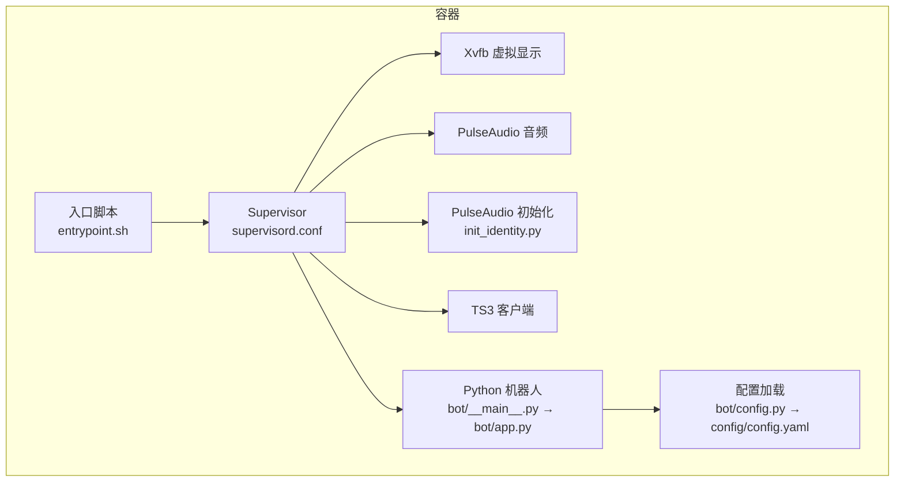
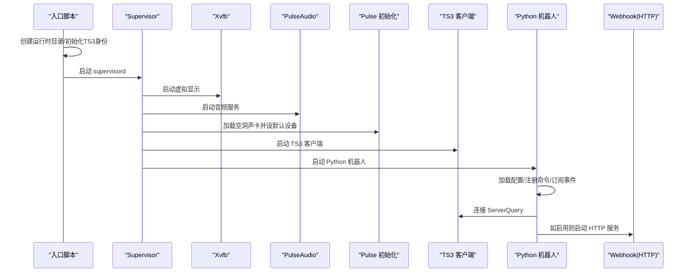
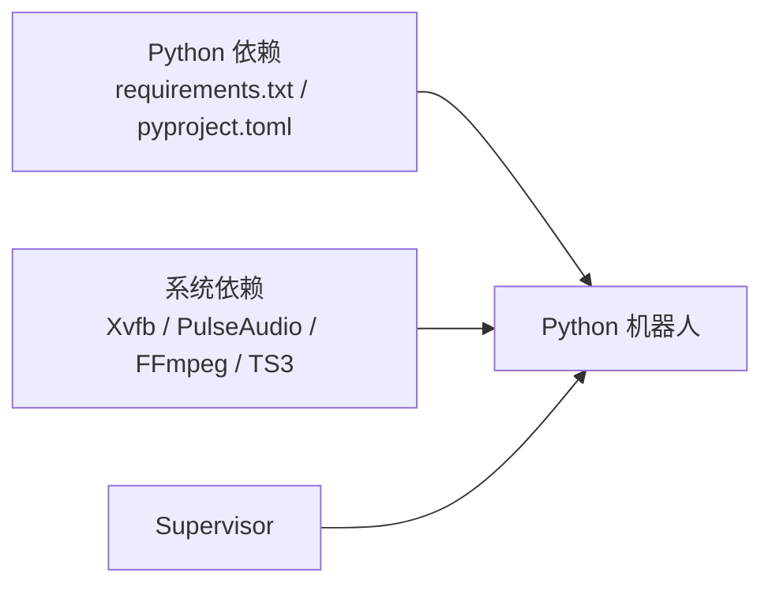

# 部署和运维

<cite>
**本文引用的文件**
- [Dockerfile](file://Dockerfile)
- [docker-compose.yml](file://docker-compose.yml)
- [entrypoint.sh](file://docker/entrypoint.sh)
- [supervisord.conf](file://docker/supervisord.conf)
- [default.pa](file://docker/pulseaudio/default.pa)
- [init_identity.py](file://docker/ts3client/init_identity.py)
- [config.yaml](file://config/config.yaml)
- [requirements.txt](file://requirements.txt)
- [pyproject.toml](file://pyproject.toml)
- [app.py](file://bot/app.py)
- [__main__.py](file://bot/__main__.py)
- [config.py](file://bot/config.py)
- [webhook.py](file://bot/web/webhook.py)
</cite>

## 目录
1. [简介](#简介)
2. [项目结构](#项目结构)
3. [核心组件](#核心组件)
4. [架构总览](#架构总览)
5. [详细组件分析](#详细组件分析)
6. [依赖分析](#依赖分析)
7. [性能考量](#性能考量)
8. [故障排除指南](#故障排除指南)
9. [结论](#结论)
10. [附录](#附录)

## 简介
本文件面向部署与运维工程师，系统性说明该 Teamspeak3 机器人的容器化部署流程与运行机制，涵盖镜像构建、服务编排、环境配置、进程管理、服务监控、性能优化与故障排除等主题，并提供生产环境最佳实践与安全建议。

## 项目结构
该项目采用"容器内多进程协同"的架构：通过 Supervisor 管理虚拟显示（Xvfb）、音频（PulseAudio）、TS3 客户端与 Python 机器人主程序；Python 主程序负责命令处理、音乐队列、AI 聊天、自动化服务与可选的 Webhook HTTP 服务。

**更新** 新增平台特定配置以增强跨平台兼容性

图表来源
- [entrypoint.sh:1-20](file://docker/entrypoint.sh#L1-L20)
- [supervisord.conf:1-53](file://docker/supervisord.conf#L1-L53)
- [init_identity.py:1-92](file://docker/ts3client/init_identity.py#L1-L92)
- [app.py:1-348](file://bot/app.py#L1-L348)
- [config.py:1-160](file://bot/config.py#L1-L160)
- [config.yaml:1-76](file://config/config.yaml#L1-L76)

章节来源
- [Dockerfile:1-100](file://Dockerfile#L1-L100)
- [docker-compose.yml:1-36](file://docker-compose.yml#L1-L36)
- [entrypoint.sh:1-20](file://docker/entrypoint.sh#L1-L20)
- [supervisord.conf:1-53](file://docker/supervisord.conf#L1-L53)
- [init_identity.py:1-92](file://docker/ts3client/init_identity.py#L1-L92)
- [config.yaml:1-76](file://config/config.yaml#L1-L76)
- [requirements.txt:1-10](file://requirements.txt#L1-L10)
- [pyproject.toml:1-35](file://pyproject.toml#L1-L35)

## 核心组件
- 容器镜像与运行时
  - 基于精简 Python 运行时，安装虚拟显示、音频解码、TS3 客户端依赖与进程管理工具。
  - 构建阶段复制应用代码与 Docker 相关配置，运行阶段创建非特权用户与数据目录。
- 入口脚本
  - 初始化运行时目录、首次运行生成 TS3 客户端身份信息、启动 Supervisor。
- Supervisor 配置
  - 管理 Xvfb、PulseAudio、PulseAudio 初始化（空洞声卡）、TS3 客户端与 Python 机器人主程序，统一输出日志至共享卷。
- 音频与显示
  - 使用 PulseAudio 空洞声卡作为虚拟设备，配合 Xvfb 提供无头图形环境。
- 配置系统
  - 从 YAML 加载配置并通过环境变量插值，支持密钥类字段的安全封装。
- Webhook 服务
  - 可选的 HTTP 接入点，用于外部系统触发消息发送与状态查询。

**更新** 平台特定配置确保在不同硬件架构上的稳定运行

章节来源
- [Dockerfile:1-100](file://Dockerfile#L1-L100)
- [entrypoint.sh:1-20](file://docker/entrypoint.sh#L1-L20)
- [supervisord.conf:1-53](file://docker/supervisord.conf#L1-L53)
- [default.pa:1-20](file://docker/pulseaudio/default.pa#L1-L20)
- [init_identity.py:1-92](file://docker/ts3client/init_identity.py#L1-L92)
- [config.py:136-160](file://bot/config.py#L136-L160)
- [config.yaml:1-76](file://config/config.yaml#L1-L76)
- [webhook.py:32-76](file://bot/web/webhook.py#L32-L76)

## 架构总览
容器内进程生命周期由 Supervisor 统一调度，确保各子进程按序启动与自动重启。Python 机器人通过 ServerQuery 与 TS3 交互，使用 FFmpeg 播放音频，结合 Netease/yt-dlp 获取音源，可选地对外暴露 Webhook HTTP 服务。

**更新** 平台特定配置确保跨架构兼容性

图表来源
- [entrypoint.sh:1-20](file://docker/entrypoint.sh#L1-L20)
- [supervisord.conf:1-53](file://docker/supervisord.conf#L1-L53)
- [init_identity.py:1-92](file://docker/ts3client/init_identity.py#L1-L92)
- [app.py:283-301](file://bot/app.py#L283-L301)
- [webhook.py:32-76](file://bot/web/webhook.py#L32-L76)

## 详细组件分析

### 容器镜像与构建流程
- 基础镜像与系统包
  - 选择轻量 Python 运行时，安装虚拟显示、PulseAudio、FFmpeg、TS3 客户端所需 X11/Qt 依赖与进程管理工具。
- TS3 客户端安装
  - 通过下载官方客户端安装包并解压到固定路径，保证无头运行能力。
- 应用层准备
  - 复制 Python 依赖清单、应用代码与 Docker 相关配置。
- 运行时用户与权限
  - 创建非特权用户，设置数据目录与配置目录归属，避免容器内 root 写权限问题。
- PulseAudio 与 Supervisor 配置注入
  - 注入最小化 PulseAudio 配置与 Supervisor 管理项，确保音频与显示可用。

章节来源
- [Dockerfile:1-100](file://Dockerfile#L1-L100)

### 编排与环境配置（docker-compose）
- 服务定义
  - 构建上下文指向仓库根，容器名固定，重启策略为除非手动停止。
- 平台特定配置
  - **新增** 指定 `platforms: linux/amd64` 和 `platform: linux/amd64`，确保镜像构建和运行在 AMD64 架构上，增强跨平台部署的兼容性和稳定性。
- 环境与挂载
  - 通过 env_file 引入环境变量；挂载只读配置目录、持久化数据卷与 TS3 客户端身份目录；映射 Webhook 端口。
- 环境变量
  - 包含 TS3 连接参数、第三方 API 密钥与模型、Webhook 密钥等；提供默认值以降低初始配置复杂度。
- 运行时资源
  - 设置共享内存大小、临时文件系统，便于音频与显示运行。

**更新** 新增平台特定配置以确保 AMD64 架构兼容性

章节来源
- [docker-compose.yml:1-36](file://docker-compose.yml#L1-L36)

### 入口脚本与进程管理
- 目录初始化
  - 在容器启动时创建缓存、日志、PulseAudio 运行时目录。
- 首次运行初始化
  - 若未检测到 TS3 客户端设置数据库，则调用初始化脚本写入必要的音频设备与自动连接书签。
- 启动 Supervisor
  - 以非守护模式启动 Supervisor 并加载统一配置，所有子进程的日志输出到共享卷。

章节来源
- [entrypoint.sh:1-20](file://docker/entrypoint.sh#L1-L20)
- [init_identity.py:1-92](file://docker/ts3client/init_identity.py#L1-L92)

### Supervisor 配置与进程编排
- Xvfb
  - 提供虚拟显示，避免无 GUI 环境下的依赖问题。
- PulseAudio
  - 以非空闲退出模式运行，确保音频链路稳定。
- PulseAudio 初始化
  - 等待音频服务就绪后加载空洞声卡模块、设置默认输出与监听源，保证后续播放不依赖物理设备。
- TS3 客户端
  - 在短暂延迟后启动，确保显示与音频已就绪。
- Python 机器人
  - 在稍后延迟后启动，等待 TS3 客户端与网络环境稳定。

章节来源
- [supervisord.conf:1-53](file://docker/supervisord.conf#L1-L53)
- [default.pa:1-20](file://docker/pulseaudio/default.pa#L1-L20)

### 配置系统与环境变量插值
- 配置模型
  - 使用 Pydantic 定义各模块配置，包含 TS3、音频、网易云、聊天、自动化、计划任务、Webhook、日志等。
- 环境变量插值
  - 支持在 YAML 中使用 ${VAR} 占位符，启动时替换为宿主机或 compose 的环境变量值。
- 默认行为
  - 若未找到配置文件，仍可使用默认值，敏感字段通过 SecretStr 封装。

章节来源
- [config.py:1-160](file://bot/config.py#L1-L160)
- [config.yaml:1-76](file://config/config.yaml#L1-L76)

### Webhook 服务与状态接口
- Webhook 接收
  - 提供受密钥保护的消息发送接口，转发至 TS3 频道。
- 状态查询
  - 返回运行状态、连接状态、当前播放、队列长度与运行时长等信息。
- 健康检查
  - 提供简单健康检查端点。

章节来源
- [webhook.py:32-76](file://bot/web/webhook.py#L32-L76)

### 机器人主程序与生命周期
- 启动阶段
  - 注册命令与事件处理器，连接 ServerQuery，启动计划任务与 Webhook（如启用）。
- 运行阶段
  - 响应文本消息、播放音乐、处理错误回调、维护队列。
- 关闭阶段
  - 优雅关闭 Webhook、停止计划任务、淡出并停止音频、断开 ServerQuery。

章节来源
- [app.py:283-348](file://bot/app.py#L283-L348)
- [__main__.py:1-17](file://bot/__main__.py#L1-L17)

## 依赖分析
- Python 依赖
  - 通过 requirements.txt 与 pyproject.toml 明确声明，包含配置、HTTP、调度、AI、媒体处理等模块。
- 容器依赖
  - 系统层面依赖 Xvfb、PulseAudio、FFmpeg、TS3 客户端库；Supervisor 管理多进程生命周期。

**更新** 平台特定配置确保依赖在不同架构上的一致性

图表来源
- [requirements.txt:1-10](file://requirements.txt#L1-L10)
- [pyproject.toml:1-35](file://pyproject.toml#L1-L35)
- [Dockerfile:6-59](file://Dockerfile#L6-L59)
- [supervisord.conf:1-53](file://docker/supervisord.conf#L1-L53)

章节来源
- [requirements.txt:1-10](file://requirements.txt#L1-L10)
- [pyproject.toml:1-35](file://pyproject.toml#L1-L35)
- [Dockerfile:6-59](file://Dockerfile#L6-L59)

## 性能考量
- 音频与显示
  - 使用空洞声卡避免物理设备依赖，减少资源占用；合理设置默认音量与淡入淡出时长，提升用户体验。
- 进程调度
  - 通过 Supervisor 的优先级与延迟启动，确保显示与音频先于业务进程就绪。
- 日志轮转
  - 配置文件中指定日志轮转参数，避免单文件过大影响 IO。
- 资源限制
  - 通过 compose 的共享内存与 tmpfs 限制，控制容器内存与临时空间使用。
- 网络与外部服务
  - 对外 API（如 OpenAI、网易云）的请求需考虑超时与重试策略，避免阻塞主循环。
- **新增** 平台一致性
  - **新增** 平台特定配置确保在不同硬件架构（特别是 AMD64）上的一致性能表现。

**更新** 新增平台一致性考量

章节来源
- [default.pa:1-20](file://docker/pulseaudio/default.pa#L1-L20)
- [supervisord.conf:24-41](file://docker/supervisord.conf#L24-L41)
- [config.yaml:69-76](file://config/config.yaml#L69-L76)
- [docker-compose.yml:23-28](file://docker-compose.yml#L23-L28)

## 故障排除指南
- 容器无法启动或进程频繁退出
  - 检查 Supervisor 日志与各子进程日志；确认 DISPLAY 与 PULSE_SERVER 环境变量是否正确传递。
- 音频无声或设备异常
  - 确认空洞声卡模块已加载且默认设备已切换；检查 PulseAudio 运行状态与权限。
- TS3 客户端无法连接
  - 核对配置中的主机、端口、密码与昵称；首次运行会自动生成设置数据库，若异常可删除后重建。
- Webhook 无法访问或鉴权失败
  - 确认 Webhook 端口映射、密钥配置与请求头 Authorization 是否匹配。
- 日志过大或磁盘不足
  - 检查日志轮转配置与数据卷容量；必要时调整备份数量与单文件大小。
- 队列播放中断
  - 关注播放错误回调与 CDN 链接失效问题，必要时重新提取音源或切换备用源。
- **新增** 平台兼容性问题
  - **新增** 如果遇到跨架构部署问题，确认平台配置是否正确设置为 linux/amd64；检查镜像构建是否针对正确的架构。

**更新** 新增平台兼容性故障排除指导

章节来源
- [supervisord.conf:1-53](file://docker/supervisord.conf#L1-L53)
- [default.pa:1-20](file://docker/pulseaudio/default.pa#L1-L20)
- [init_identity.py:12-83](file://docker/ts3client/init_identity.py#L12-L83)
- [webhook.py:35-49](file://bot/web/webhook.py#L35-L49)
- [config.yaml:69-76](file://config/config.yaml#L69-L76)
- [app.py:247-254](file://bot/app.py#L247-L254)

## 结论
该部署方案通过容器化与多进程编排，实现了 TS3 机器人在无头环境下的稳定运行。结合完善的配置系统、可选的 Webhook 接入与日志轮转，满足中小规模到中等规模团队的日常使用需求。生产环境中建议进一步强化安全与可观测性建设。**新增** 平台特定配置（linux/amd64）显著增强了跨平台部署的兼容性和稳定性，确保在不同硬件架构上的一致性能表现。

**更新** 结论部分新增平台兼容性总结

## 附录

### 部署步骤（镜像构建与服务编排）
- 准备环境变量文件（示例键位见 compose 文件），确保包含 TS3 连接参数与第三方 API 密钥。
- 构建镜像：使用根目录 Dockerfile 构建。
- **更新** 平台配置：确保平台设置为 linux/amd64 以获得最佳兼容性。
- 启动服务：执行容器编排，等待 Supervisor 启动各子进程。
- 初次运行：容器启动后会自动生成 TS3 客户端身份数据库与默认音频配置。
- 访问 Webhook：根据映射端口与密钥进行消息推送与状态查询。

**更新** 部署步骤中新增平台配置说明

章节来源
- [docker-compose.yml:1-36](file://docker-compose.yml#L1-L36)
- [Dockerfile:1-100](file://Dockerfile#L1-L100)
- [entrypoint.sh:11-15](file://docker/entrypoint.sh#L11-L15)

### 生产环境最佳实践与安全考虑
- 安全
  - 使用只读配置卷与独立数据卷；为 Webhook 与 AI API 设置强密钥；避免在镜像中硬编码敏感信息。
  - 限制容器权限与能力，仅开放必要端口与挂载。
- 可靠性
  - 启用自动重启策略与健康检查；为日志与缓存设置合理的轮转与清理策略。
  - 对外 API 请求增加超时与重试逻辑，避免阻塞主循环。
- 可观测性
  - 通过容器日志与数据卷集中收集日志；结合外部监控系统采集关键指标（CPU、内存、磁盘、网络）。
- 性能
  - 合理设置共享内存与 tmpfs 大小；根据并发与负载调整队列与缓存策略。
- **新增** 平台兼容性
  - **新增** 在多架构环境中部署时，确保平台配置一致；定期验证不同架构上的功能一致性。

**更新** 新增平台兼容性最佳实践

### 监控指标与日志管理
- 指标建议
  - 进程存活状态、CPU/内存使用率、日志文件大小、Webhook 请求量与错误率、播放成功率与平均时延。
- 日志管理
  - 使用配置中的轮转参数；将日志输出到共享卷以便外部采集；区分标准输出与错误输出。
- 维护指南
  - 定期清理过期缓存与日志；更新 TS3 客户端版本；升级依赖与镜像基础版本。
  - **新增** 平台监控：监控不同架构部署的一致性与性能差异。

**更新** 新增平台监控建议

章节来源
- [config.yaml:69-76](file://config/config.yaml#L69-L76)
- [supervisord.conf:3-52](file://docker/supervisord.conf#L3-L52)