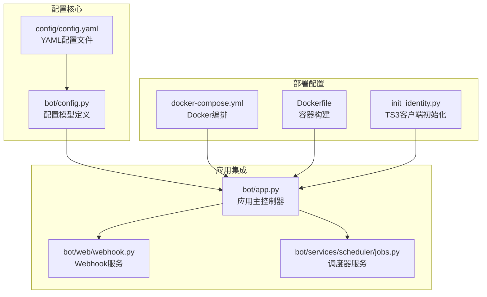
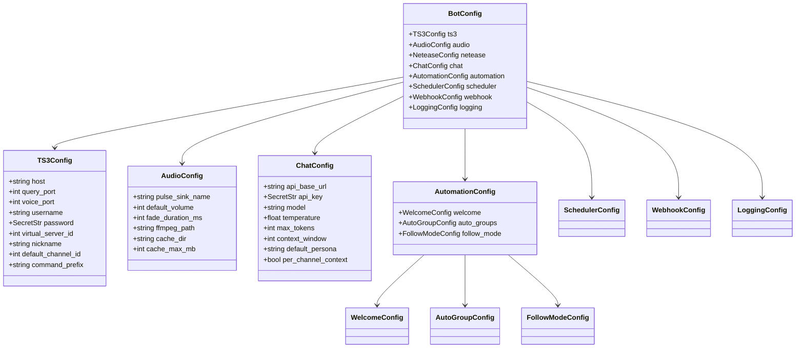
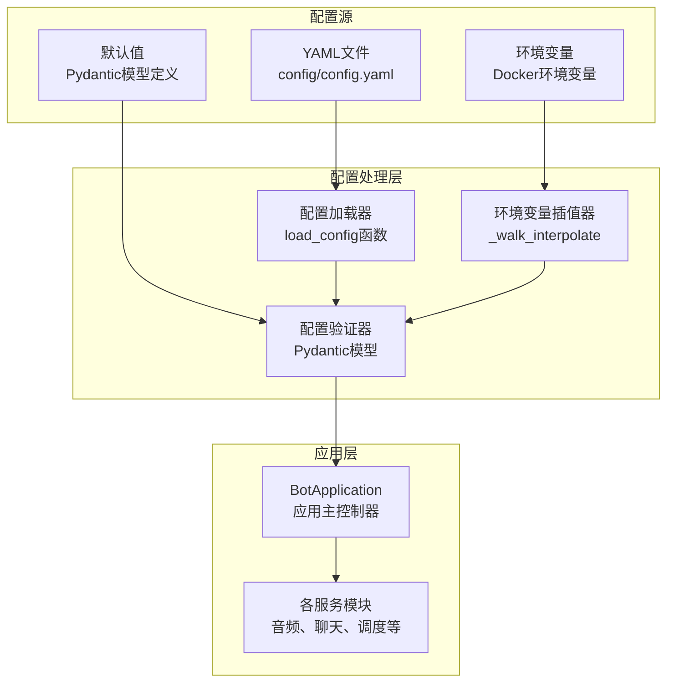
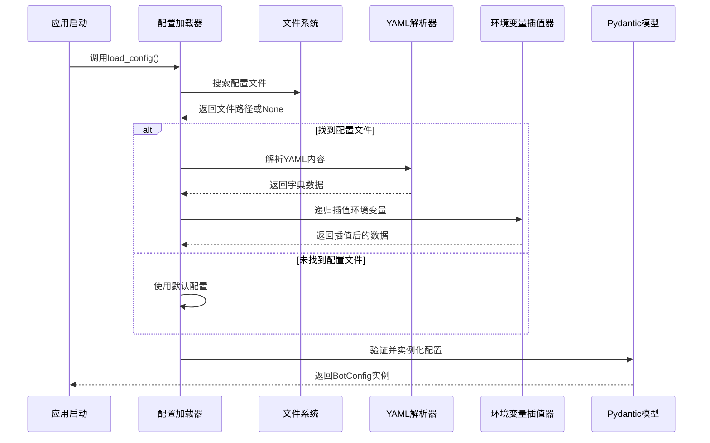
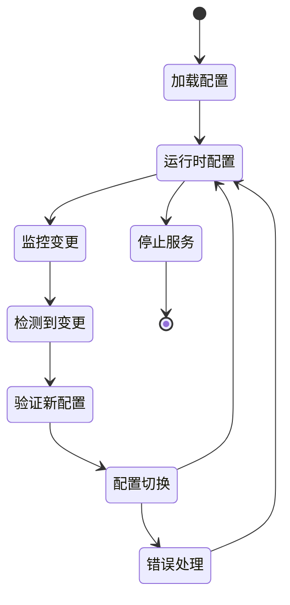
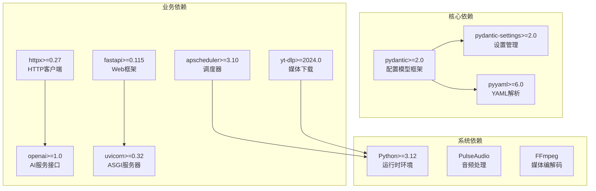

# 配置管理系统

<cite>
**本文档引用的文件**
- [bot/config.py](file://bot/config.py)
- [config/config.yaml](file://config/config.yaml)
- [bot/app.py](file://bot/app.py)
- [pyproject.toml](file://pyproject.toml)
- [docker-compose.yml](file://docker-compose.yml)
- [Dockerfile](file://Dockerfile)
- [bot/web/webhook.py](file://bot/web/webhook.py)
- [bot/services/scheduler/jobs.py](file://bot/services/scheduler/jobs.py)
- [docker/ts3client/init_identity.py](file://docker/ts3client/init_identity.py)
- [docker/supervisord.conf](file://docker/supervisord.conf)
</cite>

## 目录
1. [简介](#简介)
2. [项目结构](#项目结构)
3. [核心组件](#核心组件)
4. [架构概览](#架构概览)
5. [详细组件分析](#详细组件分析)
6. [依赖关系分析](#依赖关系分析)
7. [性能考虑](#性能考虑)
8. [故障排除指南](#故障排除指南)
9. [结论](#结论)
10. [附录](#附录)

## 简介

本配置管理系统为 TeamSpeak3 音乐机器人提供了完整的配置管理解决方案。系统采用 Pydantic 模型驱动的配置架构，结合 YAML 文件配置和环境变量插值，实现了类型安全、可验证、可扩展的配置管理机制。

系统支持多层配置结构，包括 TeamSpeak3 连接配置、音频处理配置、AI 聊天服务配置、自动化功能配置、调度器配置、Webhook 配置和日志配置等。通过环境变量插值机制，系统能够灵活地在不同部署环境中进行配置覆盖。

## 项目结构

配置管理系统主要由以下核心模块组成：



**图表来源**
- [bot/config.py:1-160](file://bot/config.py#L1-L160)
- [bot/app.py:1-348](file://bot/app.py#L1-L348)
- [config/config.yaml:1-76](file://config/config.yaml#L1-L76)

**章节来源**
- [bot/config.py:1-160](file://bot/config.py#L1-L160)
- [bot/app.py:1-348](file://bot/app.py#L1-L348)
- [config/config.yaml:1-76](file://config/config.yaml#L1-L76)

## 核心组件

### 配置模型架构

系统采用分层的 Pydantic 模型架构，每个配置类别都有独立的模型定义：



**图表来源**
- [bot/config.py:36-133](file://bot/config.py#L36-L133)

### 环境变量插值机制

系统实现了递归的环境变量插值功能，支持在 YAML 配置中使用 `${ENV_VAR}` 语法：

```mermaid
flowchart TD
Start([开始插值]) --> CheckType{检查数据类型}
CheckType --> |字符串| ReplaceEnv[替换${ENV_VAR}模式]
CheckType --> |字典| DictLoop[遍历字典键值]
CheckType --> |列表| ListLoop[遍历列表元素]
CheckType --> |其他| ReturnVal[返回原值]
ReplaceEnv --> GetEnv[获取环境变量值]
GetEnv --> EnvExists{环境变量存在?}
EnvExists --> |是| UseValue[使用环境变量值]
EnvExists --> |否| KeepPattern[保持原模式]
DictLoop --> RecurseDict[递归处理子元素]
ListLoop --> RecurseList[递归处理子元素]
UseValue --> ReturnStr[返回替换结果]
KeepPattern --> ReturnStr
RecurseDict --> ReturnDict[返回处理后的字典]
RecurseList --> ReturnList[返回处理后的列表]
ReturnVal --> End([结束])
ReturnStr --> End
ReturnDict --> End
ReturnList --> End
```

**图表来源**
- [bot/config.py:12-30](file://bot/config.py#L12-L30)

**章节来源**
- [bot/config.py:12-30](file://bot/config.py#L12-L30)
- [bot/config.py:136-159](file://bot/config.py#L136-L159)

## 架构概览

配置管理系统采用"模型驱动 + 文件配置 + 环境变量覆盖"的三层架构：



**图表来源**
- [bot/config.py:136-159](file://bot/config.py#L136-L159)
- [bot/app.py:39-41](file://bot/app.py#L39-L41)

## 详细组件分析

### 配置加载流程

配置加载过程遵循以下步骤：

1. **配置文件发现**：系统自动搜索常见位置的配置文件
2. **YAML 解析**：使用安全解析器读取配置文件
3. **环境变量插值**：递归替换配置中的环境变量模式
4. **模型验证**：通过 Pydantic 模型进行类型验证和约束检查
5. **实例化**：创建完整的配置对象供应用使用



**图表来源**
- [bot/config.py:136-159](file://bot/config.py#L136-L159)

### 配置分类管理

系统按功能域对配置进行了清晰的分类管理：

#### 基础连接配置 (TS3Config)
- **服务器连接参数**：主机地址、查询端口、语音端口
- **认证信息**：用户名、密码（使用 SecretStr 类型）
- **服务器标识**：虚拟服务器 ID、机器人昵称
- **默认行为**：默认频道、命令前缀

#### 音频处理配置 (AudioConfig)
- **音频设备**：PulseAudio 源名称、FFmpeg 路径
- **音量控制**：默认音量、淡入淡出时长
- **缓存管理**：缓存目录、最大缓存大小

#### AI 聊天配置 (ChatConfig)
- **API 设置**：基础 URL、API 密钥、模型名称
- **生成参数**：温度、最大令牌数、上下文窗口
- **个性化**：默认人物角色、频道上下文管理

#### 自动化配置 (AutomationConfig)
- **欢迎消息**：启用状态、消息模板、延迟时间、发送模式
- **自动分组**：启用状态、目标分组列表
- **跟随模式**：启用状态、监控频道列表、离开策略

#### 调度器配置 (SchedulerConfig)
- **提醒任务**：基于 Cron 表达式的定时提醒
- **任务管理**：动态添加、移除和管理提醒任务

#### Webhook 配置 (WebhookConfig)
- **服务开关**：启用/禁用 Webhook 服务
- **网络设置**：监听地址、端口、访问密钥
- **安全机制**：基于 Bearer Token 的身份验证

#### 日志配置 (LoggingConfig)
- **日志级别**：支持多种标准级别
- **输出格式**：文本或 JSON 格式
- **文件轮转**：日志文件大小限制、备份数量

**章节来源**
- [bot/config.py:36-133](file://bot/config.py#L36-L133)

### 动态更新与热重载机制

虽然系统当前实现采用一次性配置加载模式，但具备良好的扩展性以支持动态更新：



**图表来源**
- [bot/app.py:283-347](file://bot/app.py#L283-L347)

### 安全考虑

系统在多个层面实施了安全措施：

#### 敏感信息保护
- **SecretStr 类型**：所有敏感配置（如密码、API 密钥）使用 Pydantic 的 SecretStr 类型
- **环境变量优先**：敏感信息优先从环境变量加载，避免硬编码在配置文件中
- **日志过滤**：SecretStr 值在日志中会被安全地隐藏

#### 访问控制
- **Webhook 认证**：Webhook 接口使用 Bearer Token 进行身份验证
- **最小权限原则**：配置文件仅读取权限，不包含写操作

#### 数据验证
- **类型约束**：严格的类型检查确保配置值的有效性
- **范围限制**：数值字段具有合理的上下限约束
- **枚举验证**：字符串字段使用 Literal 类型限制有效值

**章节来源**
- [bot/config.py:41](file://bot/config.py#L41)
- [bot/web/webhook.py:35-37](file://bot/web/webhook.py#L35-L37)

## 依赖关系分析

配置管理系统的核心依赖关系如下：



**图表来源**
- [pyproject.toml:6-16](file://pyproject.toml#L6-L16)

**章节来源**
- [pyproject.toml:1-35](file://pyproject.toml#L1-L35)

## 性能考虑

### 配置加载性能
- **延迟加载**：配置在应用启动时一次性加载，避免运行时频繁 I/O 操作
- **内存优化**：使用 Pydantic 模型的高效内存布局
- **缓存策略**：配置对象在进程生命周期内复用

### 环境变量插值性能
- **递归优化**：插值函数采用深度优先遍历，避免重复计算
- **正则表达式缓存**：编译后的正则表达式在模块级缓存
- **短路求值**：不存在的环境变量直接返回原模式，避免异常开销

### 安全性能平衡
- **延迟验证**：配置验证在首次使用时进行，避免不必要的早期验证
- **最小暴露**：SecretStr 值只在需要时解密显示

## 故障排除指南

### 常见配置问题

#### 配置文件加载失败
**症状**：应用启动时报配置文件不存在错误
**解决方法**：
1. 检查配置文件路径是否正确
2. 确认文件权限设置
3. 验证 YAML 语法格式

#### 环境变量插值错误
**症状**：配置中的 `${VAR}` 模式未被正确替换
**解决方法**：
1. 确认环境变量已正确设置
2. 检查变量名拼写是否正确
3. 验证环境变量值的类型匹配

#### 配置验证失败
**症状**：应用启动时报配置验证错误
**解决方法**：
1. 检查配置值的数据类型
2. 验证数值范围约束
3. 确认枚举值的有效性

#### Webhook 认证失败
**症状**：Webhook 请求返回 403 错误
**解决方法**：
1. 检查 Webhook 密钥设置
2. 确认请求头 Authorization 格式
3. 验证密钥值的正确性

**章节来源**
- [bot/config.py:136-159](file://bot/config.py#L136-L159)
- [bot/web/webhook.py:35-37](file://bot/web/webhook.py#L35-L37)

## 结论

本配置管理系统通过 Pydantic 模型驱动的方式，实现了类型安全、可验证、可扩展的配置管理方案。系统的设计充分考虑了生产环境的需求，提供了完善的环境变量插值、配置验证、安全保护和部署灵活性。

系统的主要优势包括：
- **类型安全**：通过 Pydantic 模型确保配置的类型正确性
- **环境适配**：灵活的环境变量插值机制支持多环境部署
- **安全可靠**：敏感信息保护和访问控制机制
- **易于维护**：清晰的配置分类和模块化设计

对于未来的扩展，建议考虑实现配置热重载机制，以支持在不重启服务的情况下动态更新配置。

## 附录

### 部署环境配置策略

#### 开发环境
- 使用本地配置文件，环境变量用于覆盖敏感信息
- 启用详细日志记录
- 使用默认的开发数据库连接

#### 生产环境
- 使用 Docker 环境变量进行配置覆盖
- 配置文件挂载到只读卷
- 设置适当的日志轮转策略

#### 测试环境
- 使用测试专用的配置文件
- 禁用生产服务（如 Webhook）
- 配置模拟的外部服务端点

### 迁移指南

#### 从旧版本迁移
1. 备份现有配置文件
2. 更新依赖到最新版本
3. 验证配置兼容性
4. 逐步迁移配置项

#### 配置项命名规范
- 使用小写字母和下划线分隔
- 避免使用保留关键字
- 保持配置层次清晰

#### 最佳实践
- 将敏感信息存储在环境变量中
- 使用配置文件进行非敏感配置
- 定期审查和更新配置
- 建立配置变更的审批流程