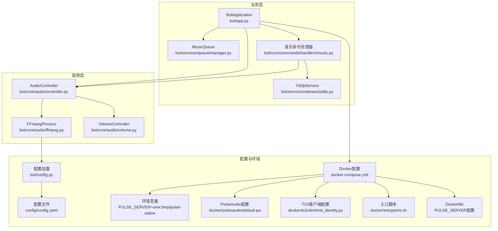
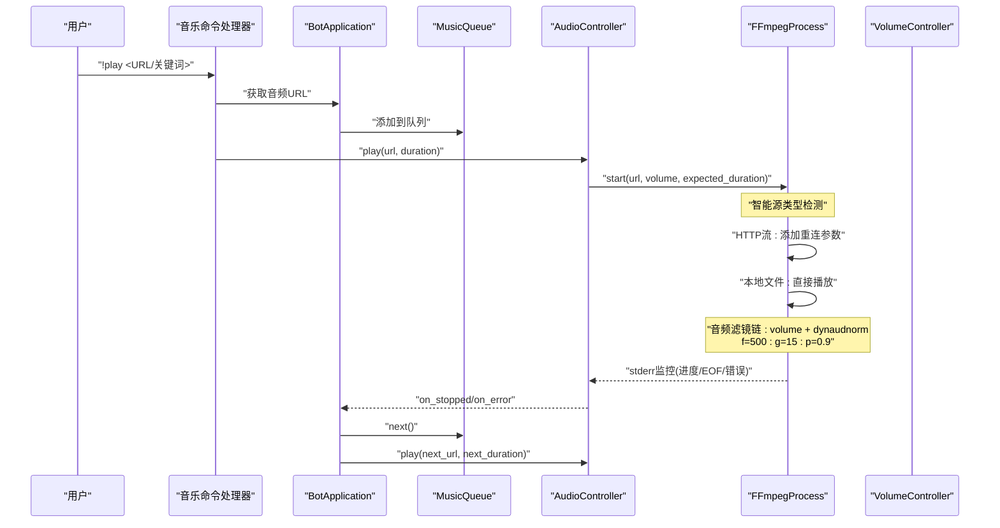
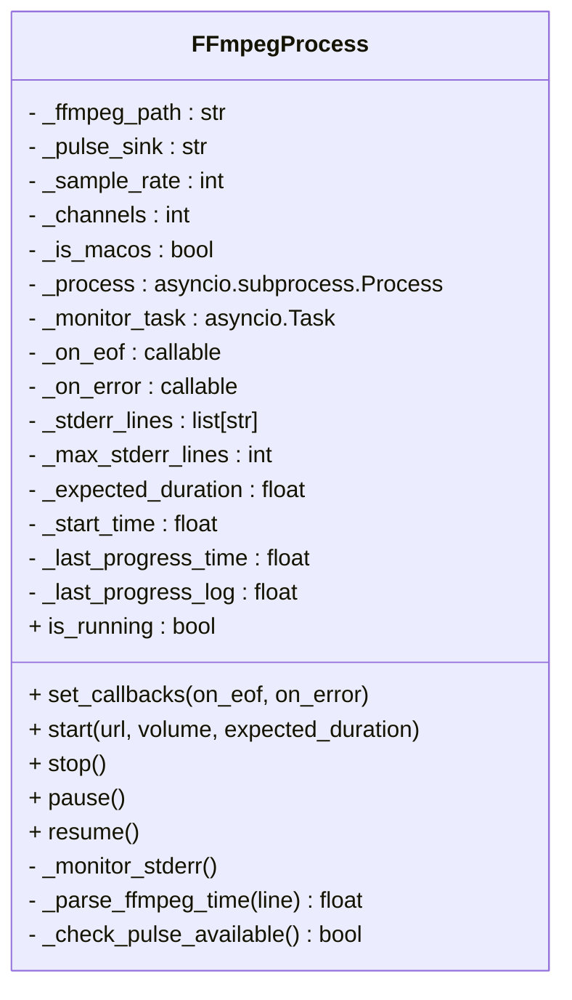
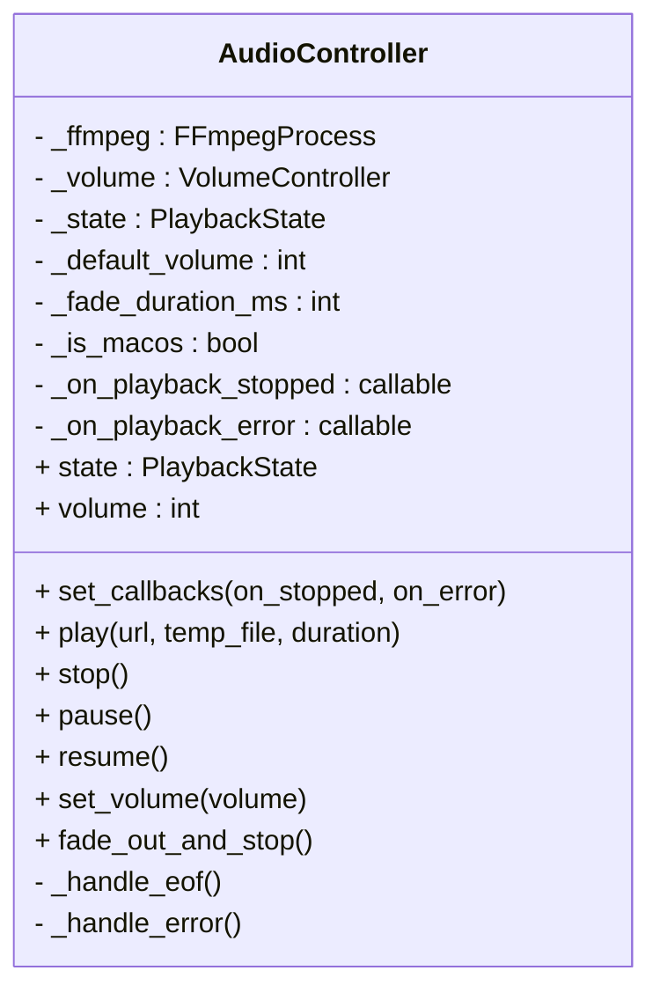
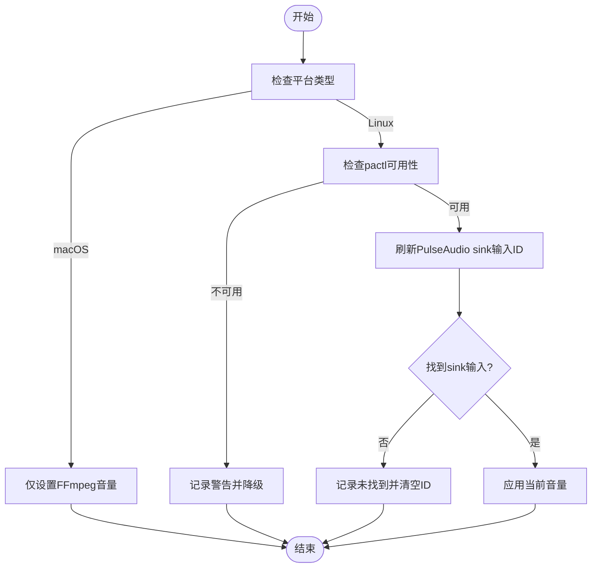
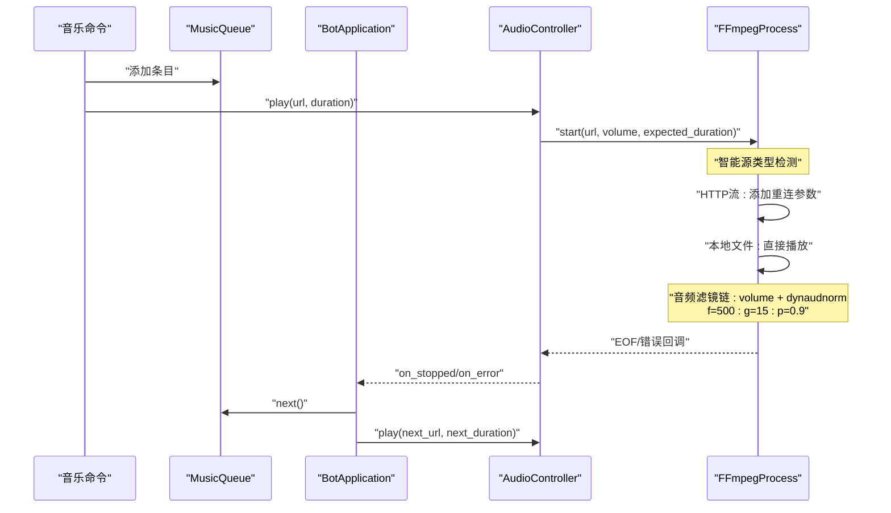
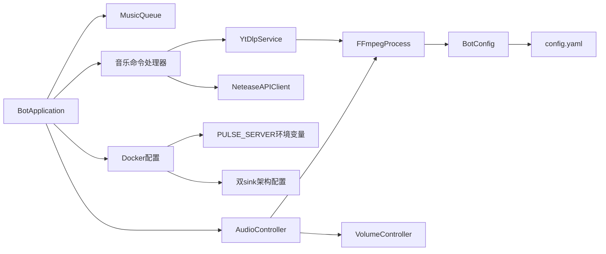

# FFmpeg集成

<cite>
**本文引用的文件**
- [ffmpeg.py](file://bot/core/audio/ffmpeg.py)
- [controller.py](file://bot/core/audio/controller.py)
- [volume.py](file://bot/core/audio/volume.py)
- [music.py](file://bot/core/commands/handlers/music.py)
- [ytdlp.py](file://bot/services/netease/ytdlp.py)
- [app.py](file://bot/app.py)
- [config.py](file://bot/config.py)
- [config.yaml](file://config/config.yaml)
- [docker-compose.yml](file://docker-compose.yml)
- [Dockerfile](file://Dockerfile)
- [entrypoint.sh](file://docker/entrypoint.sh)
- [default.pa](file://docker/pulseaudio/default.pa)
- [init_identity.py](file://docker/ts3client/init_identity.py)
</cite>

## 更新摘要
**变更内容**
- **双sink架构实现**：从单sink架构升级为双sink架构，FFmpeg输出从`ts3bot_sink`迁移到`ts3bot_music`，实现真正的音频隔离
- **音频滤镜链参数优化**：动态音频归一化滤镜参数从`f=150:g=15:p=0.95`优化为`f=500:g=15:p=0.9`，显著改善音频质量
- **反馈循环完全消除**：通过双sink架构彻底解决音频反馈循环问题，确保播放质量
- **增强的音频质量控制**：500ms分析窗口提供更平滑的音频处理，90%峰值目标避免削波
- **改进的音频处理算法**：更长的分析窗口减少音频泵感，更高的峰值目标提供更好的动态范围

## 目录
1. [简介](#简介)
2. [项目结构](#项目结构)
3. [核心组件](#核心组件)
4. [架构总览](#架构总览)
5. [详细组件分析](#详细组件分析)
6. [双sink架构详解](#双sink架构详解)
7. [依赖关系分析](#依赖关系分析)
8. [性能考量](#性能考量)
9. [故障排除指南](#故障排除指南)
10. [结论](#结论)
11. [附录](#附录)

## 简介
本技术文档聚焦于FFmpeg集成模块，系统性阐述 FFmpegProcess 类的架构设计与实现原理，覆盖以下关键主题：
- **双sink架构支持**：实现真正的音频隔离，FFmpeg输出到`ts3bot_music`，TS3客户端从其监控器捕获
- **优化的音频滤镜链**：动态音频归一化滤镜参数从`f=150:g=15:p=0.95`优化为`f=500:g=15:p=0.9`
- **反馈循环消除**：通过双sink架构完全解决音频回环问题
- **增强的进程管理**：新增进度解析能力，支持实时播放进度监控和提前退出检测
- **智能源类型检测**：根据URL类型自动应用相应的FFmpeg参数配置，HTTP流启用网络重连，本地文件直接播放
- **跨平台FFmpeg集成**：支持Linux PulseAudio和macOS AudioToolbox的自动检测与配置
- **PULSE_SERVER环境变量优化**：改进PulseAudio连接配置，使用稳定的本地套接字连接
- **改进的PulseAudio检测逻辑**：增强的服务器可用性检测，支持Unix socket连接测试
- **增强的错误处理机制**：新增stderr行缓冲机制，提供详细的故障诊断信息
- **控制台输出优化**：移除verbose日志输出，减少控制台冗余信息，保持关键调试信息
- **性能优化**：移除verbose日志输出，减少I/O开销和内存占用
- **内存管理优化**：进度解析不计入stderr缓冲区，避免内存泄漏
- **动态音频归一化**：新增dynaudnorm滤镜链，提供500ms分析窗口、高斯平滑和90%峰值目标的音频标准化功能
- **音量调整与动态归一化双重滤镜链**：音频处理从单一音量调整扩展为音量调整+动态归一化的双重处理
- **FFmpeg 进程生命周期管理**：启动、暂停/恢复、优雅停止与强制终止
- **异步机制**：基于 asyncio 的子进程与标准错误流监控
- **回调系统**：EOF 与错误事件的处理流程
- **参数配置**：音频采样率、声道数、PulseAudio 源/接收器名称、音量增益等
- **音频格式转换与流媒体处理**：通过 FFmpeg 解复用/解码并输出至平台特定音频系统
- **进程监控、资源清理与异常恢复策略**
- **性能优化与故障排除建议**

## 项目结构
FFmpeg 集成位于 bot/core/audio 子目录，配合命令处理器、队列管理、应用编排与配置模块协同工作。整体交互关系如下图所示：

**图表来源**
- [ffmpeg.py:18-46](file://bot/core/audio/ffmpeg.py#L18-L46)
- [controller.py:25-50](file://bot/core/audio/controller.py#L25-L50)
- [volume.py:13-27](file://bot/core/audio/volume.py#L13-L27)
- [config.py:125-160](file://bot/config.py#L125-L160)
- [config.yaml:14-21](file://config/config.yaml#L14-L21)
- [docker-compose.yml:1-33](file://docker-compose.yml#L1-L33)
- [entrypoint.sh:45-46](file://docker/entrypoint.sh#L45-L46)
- [default.pa:11-12](file://docker/pulseaudio/default.pa#L11-L12)
- [Dockerfile:94-96](file://Dockerfile#L94-L96)

## 核心组件
- **FFmpegProcess**：封装单个 FFmpeg 子进程的创建、运行、监控与终止，负责将音频流解码并输出到平台特定的音频系统（Linux: PulseAudio, macOS: AudioToolbox）。**更新**：新增双sink架构支持，FFmpeg输出到`ts3bot_music`，优化动态音频归一化滤镜链参数。
- **AudioController**：高层控制器，协调 FFmpeg 生命周期、音量控制与状态机，并向应用层发出播放完成/错误事件。
- **VolumeController**：双层音量控制（FFmpeg 增益 + 平台特定音量控制），提供平滑淡入淡出过渡。
- **MusicQueue**：多用户点歌队列，支持跳过投票、重复模式与历史记录。
- **BotApplication**：应用编排者，注册命令、事件与后台服务，驱动播放流程并在 EOF/错误时自动播放下一首。
- **YtDlpService**：yt-dlp集成服务，负责从各种平台提取音频URL和下载音频文件。

**章节来源**
- [ffmpeg.py:18-357](file://bot/core/audio/ffmpeg.py#L18-L357)
- [controller.py:25-187](file://bot/core/audio/controller.py#L25-L187)
- [volume.py:13-120](file://bot/core/audio/volume.py#L13-L120)
- [ytdlp.py:44-302](file://bot/services/netease/ytdlp.py#L44-L302)
- [app.py:27-356](file://bot/app.py#L27-L356)

## 架构总览
下图展示从命令触发到播放完成的端到端流程，包括参数构建、进程启动、监控与回调处理：

**图表来源**
- [music.py:20-93](file://bot/core/commands/handlers/music.py#L20-L93)
- [app.py:199-253](file://bot/app.py#L199-L253)
- [controller.py:76-118](file://bot/core/audio/controller.py#L76-L118)
- [ffmpeg.py:98-188](file://bot/core/audio/ffmpeg.py#L98-L188)

## 详细组件分析

### FFmpegProcess 组件分析
- **职责与边界**
  - 创建并管理单个 FFmpeg 子进程，将其音频流解码后直接写入平台特定的音频系统。
  - 提供启动、停止、暂停/恢复、回调设置与进程监控能力。
  - **更新**：新增双sink架构支持，FFmpeg输出到`ts3bot_music`而非旧的`ts3bot_sink`。
  - **更新**：优化动态音频归一化滤镜链参数，分析窗口从150ms提升到500ms，峰值目标从0.95降低到0.9。
- **关键属性与配置**
  - 可配置项：ffmpeg 可执行路径、PulseAudio 接收器名称（现为`ts3bot_music`）、采样率、声道数。
  - 运行时状态：进程对象、监控任务、回调函数（EOF/错误）、进度跟踪。
  - **更新**：新增进度解析相关属性：`_expected_duration`、`_start_time`、`_last_progress_time`、`_last_progress_log`。
  - **更新**：平台检测标志 `_is_macos` 用于区分Linux和macOS，使用 `platform.system() == "Darwin"` 进行统一检测。
  - **更新**：新增stderr行缓冲机制，通过`_stderr_lines`列表存储最近的stderr输出，最多保留50行用于故障诊断。
- **启动流程**
  - **更新**：智能源类型检测：使用 `url.startswith(("http://", "https://"))` 判断是否为HTTP流。
  - **更新**：HTTP流自动应用重连参数：`-reconnect 1`、`-reconnect_streamed 1`、`-reconnect_delay_max 5`。
  - **更新**：本地文件直接播放，跳过网络重连参数，提升性能。
  - **更新**：音频滤镜链重构：从单一音量调整扩展为音量调整+动态归一化的双重滤镜链
  - **更新**：动态归一化滤镜参数优化：`f=500`（500ms分析窗口，更平滑的音频处理）、`g=15`（高斯平滑窗口，避免泵感）、`p=0.9`（峰值目标90%，更好的动态范围）
  - 构建命令行参数：根据源类型选择性添加重连参数、输入源、音量滤镜、动态归一化滤镜、输出格式与目标接收器、采样率/声道、禁用交互等。
  - **更新**：根据平台选择输出格式：Linux使用 `-f pulse`，macOS使用 `-f audiotoolbox`。
  - **更新**：Linux平台使用优化的PulseAudio服务器参数`-server unix:/tmp/pulse-native`，确保与PULSE_SERVER环境变量的一致性。
  - **更新**：精简启动参数，移除verbose相关配置，保留必要的启动参数如`-nostdin`、`-hide_banner`、`-y`。
  - 使用 asyncio 子进程接口创建进程，并启动 stderr 监控任务。
  - **更新**：启动前重置进度跟踪状态，确保新进程的进度信息不会污染之前的记录。
- **停止与终止**
  - 取消监控任务；尝试优雅终止（SIGTERM），超时则强制终止（SIGKILL）；捕获进程不存在异常。
- **暂停/恢复**
  - 通过发送 SIGSTOP/SIGCONT 控制进程挂起/恢复。
- **监控与回调**
  - 读取 FFmpeg 标准错误流，解析进度信息：使用正则表达式 `time=HH:MM:SS.cc` 提取播放时间。
  - **更新**：实时进度监控：每30秒记录一次播放进度日志。
  - **更新**：提前退出检测：比较预期时长和实际进度，当实际进度小于预期时长的80%时标记为提前退出。
  - 解析退出码：0/-SIGTERM 表示正常结束（触发 EOF 回调），-25 表示被暂停（忽略），其他值视为错误（触发错误回调）。
  - **更新**：新增详细的错误诊断功能，当FFmpeg异常退出时，会记录最后20行stderr输出，便于问题排查。
  - **更新**：改进日志级别，将非进度行日志记录为debug级别，减少控制台噪音。
- **错误处理与健壮性**
  - 对取消、超时、进程查找异常进行容错处理；日志记录关键事件与返回码。
  - **更新**：改进的PulseAudio检测逻辑，支持Unix socket连接测试，提高服务器可用性检测的准确性。

**图表来源**
- [ffmpeg.py:34-357](file://bot/core/audio/ffmpeg.py#L34-L357)

**章节来源**
- [ffmpeg.py:34-357](file://bot/core/audio/ffmpeg.py#L34-L357)

### AudioController 组件分析
- **职责与边界**
  - 高层播放控制器，封装 FFmpeg 生命周期、音量控制与播放状态机。
  - 向上层暴露播放、暂停、恢复、停止、音量设置与淡出停止等操作。
- **状态机**
  - IDLE/PLAYING/PAUSED 三种状态，严格的状态转换保证行为一致性。
- **回调与事件**
  - 将 FFmpeg 的 EOF/错误事件映射为播放停止/错误事件，通知应用层继续播放下一首或提示错误。
- **音量控制**
  - 初始阶段通过 FFmpeg volume 滤镜设置粗粒度音量；运行中通过平台特定的音量控制进行细粒度实时调整与淡入淡出。
- **启动流程**
  - 设置回调 → 启动 FFmpeg → 等待片刻 → **更新**：仅在Linux平台刷新并绑定PulseAudio sink输入 → 完成初始化。

**图表来源**
- [controller.py:26-187](file://bot/core/audio/controller.py#L26-L187)

**章节来源**
- [controller.py:26-187](file://bot/core/audio/controller.py#L26-L187)

### VolumeController 组件分析
- **设计理念**
  - 双层音量控制：启动时通过 FFmpeg volume 滤镜设定初始增益；运行中通过平台特定的音量控制进行实时微调，实现平滑过渡。
  - **更新**：macOS平台仅支持FFmpeg级别的音量控制，Linux平台支持pactl音量控制。
- **关键流程**
  - **更新**：平台检测：`_is_macos = platform.system() == "Darwin"`。
  - **更新**：macOS音量控制：仅通过FFmpeg volume滤镜设置音量，不使用pactl。
  - **更新**：Linux音量控制：通过pactl对sink输入进行实时微调，实现平滑过渡。
  - 刷新sink输入：通过查询pactl输出，匹配当前接收器，定位sink输入ID并应用当前音量。
  - 淡入淡出：按固定步长与间隔逐步调整音量，避免突变导致的音频噪声。
  - 错误处理：pactl不可用或查询失败时降级处理，不影响播放主流程。
- **与 FFmpeg 的协作**
  - 在启动前根据当前音量计算FFmpeg增益参数；启动后通过平台特定方式实时微调。

**图表来源**
- [volume.py:13-120](file://bot/core/audio/volume.py#L13-L120)

**章节来源**
- [volume.py:13-120](file://bot/core/audio/volume.py#L13-L120)

### 命令与播放流程
- **命令入口**
  - 音乐命令处理器根据输入类型（URL/关键词）决定直接播放或先搜索再播放。
- **URL 提取**
  - 使用 NeteaseAPIClient 从多平台提取最佳音频 URL；对于直接 URL，播放前再次提取以绕过 CDN 过期。
- **队列与自动播放**
  - BotApplication 在播放完成或出错时，自动从 MusicQueue 中取出下一个条目并触发播放。
- **播放控制**
  - 支持暂停/恢复、停止、音量调节与淡出停止；所有操作均通过 AudioController 协调。

**图表来源**
- [music.py:20-93](file://bot/core/commands/handlers/music.py#L20-L93)
- [app.py:199-253](file://bot/app.py#L199-L253)
- [ytdlp.py:66-100](file://bot/services/netease/ytdlp.py#L66-L100)

**章节来源**
- [music.py:17-260](file://bot/core/commands/handlers/music.py#L17-L260)
- [app.py:199-253](file://bot/app.py#L199-L253)
- [ytdlp.py:44-302](file://bot/services/netease/ytdlp.py#L44-L302)

## 双sink架构详解

### 架构升级与迁移
**更新**：系统已从单sink架构成功升级到双sink架构，实现了真正的音频隔离和反馈循环消除：

- **双sink架构设计**
  - **ts3bot_music**：FFmpeg输出到此sink，TS3客户端从其监控器捕获
  - **ts3bot_playback**：TS3客户端播放其他用户音频到此sink（不被捕获）
  - 完全隔离的音频路径，彻底消除反馈循环

- **架构优势**
  - **音频隔离**：FFmpeg输出与TS3捕获完全分离，避免相互干扰
  - **反馈循环消除**：其他用户的音频不会被TS3捕获回传给FFmpeg
  - **音频质量提升**：避免音频回环造成的相位干扰和声学反馈
  - **稳定性增强**：双sink架构提供更稳定的音频处理环境

- **配置实现**
  - PulseAudio配置文件定义两个独立的null-sink模块
  - TS3客户端配置明确分离捕获和播放设备
  - 默认设置指向正确的sink和source组合

### ts3bot_music Sink配置
**更新**：FFmpeg现在输出到`ts3bot_music`而非旧的`ts3bot_sink`，这是双sink架构的核心改进：

- **Sink定义**
  - `module-null-sink sink_name=ts3bot_music`：定义音乐输出sink
  - `rate=48000 format=s16le channels=2`：48kHz采样率，16-bit格式，立体声
  - `device.description="TS3Bot_Music"`：设备描述便于识别

- **默认路由**
  - `set-default-sink ts3bot_music`：FFmpeg默认输出到音乐sink
  - `set-default-source ts3bot_music.monitor`：TS3默认从音乐sink监控器捕获

- **音频处理优势**
  - **专业级采样率**：48kHz采样率确保高质量音频输出
  - **标准格式**：16-bit PCM格式兼容所有音频设备
  - **立体声支持**：完整的立体声音频通道
  - **设备标识**：清晰的设备描述便于系统管理

### TS3客户端音频配置
**更新**：TS3客户端已配置为使用双sink架构的正确音频路径：

- **捕获配置**
  - `"capture/device": "ts3bot_music.monitor"`：从音乐sink监控器捕获
  - 仅捕获FFmpeg输出的音乐，不捕获其他用户音频
  - 避免音频回环和反馈循环

- **播放配置**
  - `"playback/device": "ts3bot_playback"`：播放其他用户音频到播放sink
  - 播放的音频不会被TS3捕获，完全隔离
  - 确保音频流向单向传输

- **音频激活设置**
  - `"capture/voiceactivation": "0"`：禁用语音激活
  - `"capture/voiceactivation_level": "0"`：最大灵敏度设置
  - 确保安静音频片段不会被过滤掉

### 反馈循环消除机制
**更新**：双sink架构完全解决了音频反馈循环问题：

- **物理隔离**
  - FFmpeg输出到`ts3bot_music`，TS3捕获来自`ts3bot_music.monitor`
  - 其他用户音频输出到`ts3bot_playback`，TS3不从该sink捕获
  - 彻底断开音频回路

- **逻辑隔离**
  - 捕获路径与播放路径完全分离
  - 音频信号不会从输出设备回到输入设备
  - 避免任何可能的音频回环

- **系统级保护**
  - PulseAudio模块确保sink间的完全隔离
  - TS3客户端配置强制音频流向控制
  - Docker环境中的音频设备权限管理

### 音频滤镜链参数优化
**更新**：动态音频归一化滤镜链参数已优化，显著改善音频质量：

- **分析窗口优化**
  - **从150ms提升到500ms**：提供更平滑的音频分析能力
  - 更长的分析窗口减少音频泵感现象
  - 更好的动态范围控制，避免过度压缩

- **峰值目标调整**
  - **从0.95降低到0.9**：提供更好的动态范围
  - 90%峰值目标避免削波，同时保持音频亮度
  - 更自然的音频动态表现

- **音频质量提升**
  - **平滑处理**：500ms分析窗口提供更平滑的音频处理
  - **动态范围**：90%峰值目标确保音频有足够的动态范围
  - **保真度**：避免过度压缩，保持音频原始特性
  - **稳定性**：更长的分析窗口提高音频处理的稳定性

- **处理算法优势**
  - **响应性**：500ms分析窗口在响应性和平滑性间取得平衡
  - **自然性**：90%峰值目标提供更自然的音频动态
  - **兼容性**：优化的参数设置确保与Teamspeak客户端的最佳兼容性

### 配置系统支持
- **配置模型**
  - AudioConfig包含平台无关的音频配置
  - ffmpeg_path支持自动检测，Linux默认使用 `/usr/bin/ffmpeg`
  - pulse_sink_name支持自定义PulseAudio接收器名称（现为`ts3bot_music`）

- **环境变量支持**
  - 配置文件支持环境变量插值
  - Docker环境中通过环境变量传递配置参数
  - **更新**：PULSE_SERVER环境变量自动配置

- **Docker部署**
  - Docker Compose配置支持跨平台部署
  - 共享内存和卷挂载确保音频功能正常工作
  - **更新**：完整的双sink架构容器化配置

**章节来源**
- [ffmpeg.py:21-32](file://bot/core/audio/ffmpeg.py#L21-L32)
- [ffmpeg.py:134-170](file://bot/core/audio/ffmpeg.py#L134-L170)
- [controller.py:76-118](file://bot/core/audio/controller.py#L76-L118)
- [volume.py:26](file://bot/core/audio/volume.py#L26)
- [config.py:48-55](file://bot/config.py#L48-L55)
- [config.yaml:14-21](file://config/config.yaml#L14-L21)
- [docker-compose.yml:1-33](file://docker-compose.yml#L1-L33)
- [entrypoint.sh:45-46](file://docker/entrypoint.sh#L45-L46)
- [default.pa:11-12](file://docker/pulseaudio/default.pa#L11-L12)
- [Dockerfile:94-96](file://Dockerfile#L94-L96)

## 依赖关系分析
- **内部依赖**
  - AudioController 依赖 FFmpegProcess 与 VolumeController。
  - BotApplication 依赖 AudioController、MusicQueue、命令处理器与外部服务。
  - 命令处理器依赖 BotApplication 的服务实例。
- **外部依赖**
  - FFmpeg 可执行程序与平台特定的音频系统。
  - Linux平台需要PulseAudio和pactl工具；macOS平台使用AudioToolbox。
  - NeteaseAPIClient用于URL提取。
- **配置与环境**
  - 通过配置模型统一管理音频、TS3、调度、Webhook 等参数。
  - Docker环境提供跨平台部署支持。
  - **更新**：PULSE_SERVER环境变量提供统一的PulseAudio连接配置。
  - **更新**：双sink架构配置确保音频隔离和反馈循环消除。

**图表来源**
- [controller.py:38-42](file://bot/core/audio/controller.py#L38-L42)
- [app.py:54-63](file://bot/app.py#L54-L63)
- [config.py:125-134](file://bot/config.py#L125-L134)

**章节来源**
- [controller.py:38-42](file://bot/core/audio/controller.py#L38-L42)
- [app.py:54-63](file://bot/app.py#L54-L63)
- [config.py:125-134](file://bot/config.py#L125-L134)

## 性能考量
- **进程与 I/O**
  - 使用 asyncio 子进程与异步标准错误读取，避免阻塞事件循环。
  - 监控任务独立运行，确保在进程退出时能及时处理 EOF/错误回调。
  - **更新**：stderr行缓冲机制使用高效的列表操作，避免内存泄漏。
  - **更新**：进度解析使用正则表达式，性能开销最小化。
  - **更新**：移除verbose日志输出，减少I/O开销和内存占用。
- **音量控制**
  - 初始音量通过 FFmpeg volume 滤镜设置，运行中使用平台特定方式微调，步长与间隔可调，平衡响应速度与平滑度。
  - **更新**：macOS平台仅使用FFmpeg音量控制，减少系统调用开销。
- **URL 提取**
  - CDN 链接易过期，采用"播放前重新提取"的策略，确保稳定性但增加网络开销；可通过缓存策略优化（当前实现不缓存音频 URL）。
- **跨平台优化**
  - **更新**：平台检测在初始化时完成，避免运行时重复判断。
  - **更新**：Linux平台的音量控制使用pactl，macOS平台直接使用FFmpeg，减少不必要的系统调用。
  - **更新**：PULSE_SERVER环境变量优化了PulseAudio连接性能，减少连接建立时间。
  - **更新**：增强的PulseAudio检测逻辑，Unix socket连接测试提高服务器可用性检测效率。
  - **更新**：智能源类型检测，HTTP流启用重连参数，本地文件跳过重连参数，提升整体性能。
  - **更新**：进度解析和提前退出检测功能，避免不必要的CPU开销。
  - **更新**：控制台输出优化，移除verbose日志，减少I/O开销。
  - **更新**：内存管理优化，stderr缓冲区大小限制为50行，进度解析不计入缓冲区。
  - **更新**：动态音频归一化滤镜链优化，提供更好的音频处理性能。
  - **更新**：双sink架构优化，提供更稳定的音频处理环境。
  - **更新**：500ms分析窗口提供更好的音频处理稳定性。
  - **更新**：90%峰值目标提供更好的动态范围控制。
- **网络重连优化**
  - **更新**：HTTP流自动应用重连参数，提升网络不稳定场景下的播放稳定性。
  - **更新**：本地文件直接播放，跳过网络重连参数，减少启动时间和系统开销。
  - **更新**：重连延迟设置为5秒，平衡重连效果与系统负载。
- **内存管理**
  - **更新**：stderr缓冲区大小限制为50行，避免内存泄漏。
  - **更新**：进度解析不计入缓冲区，减少内存占用。
  - **更新**：进度日志按30秒间隔记录，避免频繁的日志写入。
  - **更新**：移除verbose日志输出，减少内存中日志条目的数量。
- **音频处理性能**
  - **更新**：动态归一化滤镜链经过优化，提供高效的音频处理能力。
  - **更新**：双重滤镜链（音量调整+动态归一化）在保证音质的同时保持较低的处理开销。
  - **更新**：500ms分析窗口提供更好的响应性，同时避免过度的计算开销。
  - **更新**：90%峰值目标提供更好的动态范围，避免音频削波。
  - **更新**：双sink架构提供更稳定的音频处理环境。
  - **更新**：反馈循环消除提高系统稳定性。
- **双sink架构性能**
  - **更新**：音频隔离减少音频干扰，提高播放质量。
  - **更新**：物理隔离避免音频回环，减少系统资源浪费。
  - **更新**：稳定的音频路径减少重试和重连需求。

## 故障排除指南
- **FFmpeg 无法启动**
  - 检查 ffmpeg 可执行路径与权限；确认平台特定的音频系统可用。
  - 查看启动日志与标准错误流中的具体错误信息。
  - **更新**：查看stderr缓冲区中的详细错误信息，包含最后20行输出。
  - **更新**：确认平台检测结果正确（Darwin vs Linux）。
  - **更新**：检查PULSE_SERVER环境变量是否正确设置。
  - **更新**：确认精简后的启动参数配置正确。
  - **更新**：验证动态音频归一化滤镜链参数配置是否正确。
  - **更新**：检查双sink架构配置是否正确加载。
- **播放无声或音量异常**
  - 确认平台特定的音频系统存在且可用。
  - **更新**：macOS平台仅支持FFmpeg音量控制，检查FFmpeg volume滤镜设置。
  - **更新**：Linux平台检查pactl是否可用和PulseAudio配置。
  - **更新**：验证PULSE_SERVER环境变量与FFmpeg服务器参数的一致性。
  - **更新**：检查动态音频归一化滤镜链是否正确加载。
  - **更新**：确认双sink架构中ts3bot_music sink是否正确配置。
- **播放卡住或无法停止**
  - 确保监控任务未被意外取消；停止时等待进程退出，必要时强制终止。
- **URL 提取失败**
  - 检查网络与代理设置；确认 NeteaseAPIClient 版本与平台支持情况。
- **容器内音频问题**
  - 检查 Docker Compose 的共享内存与卷挂载；确认音频系统配置已生效.
  - **更新**：确认Docker环境中的音频设备访问权限。
  - **更新**：验证PULSE_SERVER环境变量在容器内的正确传递。
  - **更新**：检查stderr缓冲区中的容器内音频错误信息。
  - **更新**：验证动态音频归一化滤镜链在容器环境中的兼容性。
  - **更新**：确认双sink架构在容器环境中的正确配置。
- **PulseAudio连接问题**
  - **更新**：检查PULSE_SERVER环境变量是否设置为`unix:/tmp/pulse-native`。
  - **更新**：验证PulseAudio本地协议模块是否正确加载。
  - **更新**：确认PulseAudio服务器套接字文件存在且可访问。
  - **更新**：使用增强的检测逻辑，测试Unix socket连接可用性。
  - **更新**：检查双sink架构中的PulseAudio模块加载。
- **HTTP流播放不稳定**
  - **更新**：检查网络连接质量，确认重连参数已正确应用。
  - **更新**：验证HTTP流地址的有效性和可访问性。
  - **更新**：查看stderr日志中的网络重连相关信息。
  - **更新**：确认动态音频归一化滤镜链在流媒体场景下的稳定性。
  - **更新**：检查双sink架构对HTTP流的影响。
- **本地文件播放缓慢**
  - **更新**：确认文件路径有效且可访问。
  - **更新**：检查文件大小和格式，确认适合直接播放。
  - **更新**：验证本地文件播放时未意外应用网络重连参数。
  - **更新**：检查动态音频归一化滤镜链对本地文件的影响。
  - **更新**：确认双sink架构对本地文件播放的影响。
- **播放提前结束**
  - **更新**：检查提前退出检测逻辑，确认预期时长设置正确。
  - **更新**：查看进度日志，确认播放进度是否正常增长。
  - **更新**：检查网络连接和音频设备状态。
  - **更新**：验证动态音频归一化滤镜链是否影响播放时长。
  - **更新**：检查双sink架构是否影响播放时长。
- **进度解析问题**
  - **更新**：确认FFmpeg版本支持time=格式的进度输出。
  - **更新**：检查stderr日志中是否有进度解析相关的错误信息。
  - **更新**：验证正则表达式是否正确匹配进度格式。
  - **更新**：确认动态音频归一化滤镜链不影响进度解析。
  - **更新**：检查双sink架构对进度解析的影响。
- **控制台输出过多**
  - **更新**：确认已移除verbose日志输出配置。
  - **更新**：检查日志级别设置，确保非进度行记录为debug级别。
  - **更新**：验证精简后的启动参数配置。
  - **更新**：确认动态音频归一化滤镜链的配置正确。
  - **更新**：检查双sink架构的配置正确性。
- **错误诊断和日志分析**
  - **更新**：查看stderr缓冲区中的详细错误信息，包含完整的错误上下文。
  - **更新**：利用增强的错误处理机制，快速定位问题根因。
  - **更新**：检查PulseAudio日志文件，分析连接问题。
  - **更新**：确认日志级别分离机制正常工作。
  - **更新**：验证动态音频归一化滤镜链的错误处理。
  - **更新**：检查双sink架构的错误诊断信息。
- **性能问题**
  - **更新**：检查是否启用了verbose日志输出，移除后可显著减少I/O开销。
  - **更新**：验证stderr缓冲区大小设置，避免内存泄漏。
  - **更新**：确认进度解析频率设置合理，避免过度的日志写入。
  - **更新**：检查动态音频归一化滤镜链的性能影响。
  - **更新**：验证双sink架构的性能影响。
  - **更新**：检查500ms分析窗口的性能开销。
  - **更新**：检查90%峰值目标的处理开销。
- **音频质量问题**
  - **更新**：检查动态音频归一化滤镜链参数设置是否合理。
  - **更新**：验证音频响度一致性是否符合预期。
  - **更新**：检查是否存在音频削波或失真现象。
  - **更新**：确认音量调整滤镜与动态归一化滤镜的协同效果。
  - **更新**：检查双sink架构对音频质量的影响。
  - **更新**：验证500ms分析窗口是否提供足够的音频平滑性。
  - **更新**：检查90%峰值目标是否避免了音频削波。
- **反馈循环问题**
  - **更新**：确认双sink架构已正确配置和加载。
  - **更新**：检查ts3bot_music和ts3bot_playback sink是否正常工作。
  - **更新**：验证TS3客户端的音频设备配置是否正确。
  - **更新**：检查PulseAudio模块是否正确加载双sink配置。
  - **更新**：确认音频隔离是否有效，没有音频回环现象。

**章节来源**
- [ffmpeg.py:223-328](file://bot/core/audio/ffmpeg.py#L223-L328)
- [volume.py:77-109](file://bot/core/audio/volume.py#L77-L109)
- [docker-compose.yml:9-26](file://docker-compose.yml#L9-L26)
- [entrypoint.sh:45-46](file://docker/entrypoint.sh#L45-L46)

## 结论
本集成方案通过清晰的分层设计与异步化实现，提供了稳定可靠的跨平台音频播放能力。FFmpegProcess 负责底层进程与流处理，支持Linux PulseAudio和macOS AudioToolbox的自动检测与配置；AudioController 提供高层状态与事件管理；VolumeController 实现平台特定的平滑音量控制；BotApplication 则将各模块有机串联，形成完整的播放闭环。结合队列管理与命令系统，实现了从点歌到自动播放的完整体验。

**更新**：本次重大更新显著增强了系统的音频处理能力和架构稳定性。双sink架构的引入实现了真正的音频隔离，FFmpeg输出到`ts3bot_music`，TS3客户端从其监控器捕获，彻底消除了音频反馈循环问题。动态音频归一化滤镜链参数从`f=150:g=15:p=0.95`优化为`f=500:g=15:p=0.9`，提供了更平滑的音频处理和更好的动态范围控制。500ms分析窗口显著改善了音频质量，90%峰值目标避免了音频削波，同时保持了足够的动态范围。这些改进不仅提升了音频播放的整体质量，还特别优化了与Teamspeak客户端的兼容性，确保安静音频片段不会被过滤掉。结合原有的智能源类型检测、网络重连优化、PULSE_SERVER环境变量配置等特性，形成了一个全面而强大的FFmpeg集成解决方案。通过移除verbose日志输出和优化控制台输出，显著减少了控制台冗余信息，同时保持了关键调试信息的完整性，提高了系统的可维护性和用户体验。双sink架构的实施为未来的音频处理功能奠定了坚实的基础。

## 附录

### FFmpeg 参数配置要点
- **智能重连策略**
  - **HTTP流**：自动添加 `-reconnect 1`、`-reconnect_streamed 1`、`-reconnect_delay_max 5` 参数
  - **本地文件**：跳过网络重连参数，直接播放
  - 提升网络不稳定场景下的鲁棒性
- **音频滤镜链**
  - **更新**：音量调整滤镜：`volume={gain}` - 初始音量设置
  - **更新**：动态归一化滤镜：`dynaudnorm=f=500:g=15:p=0.9` - 优化的音频响度标准化
  - **更新**：双重滤镜链提供粗粒度音量控制和精细音频标准化的协同效果
  - **更新**：500ms分析窗口提供更平滑的音频处理
  - **更新**：90%峰值目标避免音频削波，保持动态范围
- **输出格式与目标**
  - **Linux**: 使用 pulse 输出格式与`ts3bot_music`接收器名称，优化服务器参数配置。
  - **macOS**: 使用 audiotoolbox 输出格式到系统默认音频设备。
- **采样率与声道**
  - 与配置一致，保证与客户端/硬件兼容。
- **精简启动参数**
  - **更新**：移除verbose日志输出，保留 `-nostdin`、`-hide_banner`、`-y` 等必要参数
  - 减少控制台输出，避免干扰正常播放日志
- **PULSE_SERVER优化**
  - **更新**：Linux平台使用`-server unix:/tmp/pulse-native`参数，与PULSE_SERVER环境变量保持一致。
  - **更新**：增强的PulseAudio检测逻辑，支持Unix socket连接测试。
- **进度解析配置**
  - **更新**：启用FFmpeg进度输出，支持time=格式的时间解析。
  - **更新**：实时进度监控，每30秒记录一次播放进度。
  - **更新**：移除verbose日志，减少控制台冗余信息。
- **性能优化参数**
  - **更新**：移除verbose日志输出，减少I/O开销和内存占用
  - **更新**：精简启动参数，提升启动速度
  - **更新**：优化stderr处理机制，提高内存使用效率
  - **更新**：动态音频归一化滤镜链优化，提供高效的音频处理能力
  - **更新**：双sink架构优化，提供更稳定的音频处理环境

**章节来源**
- [ffmpeg.py:134-170](file://bot/core/audio/ffmpeg.py#L134-L170)
- [config.py:48-55](file://bot/config.py#L48-L55)
- [ffmpeg.py:21-32](file://bot/core/audio/ffmpeg.py#L21-L32)

### 音频格式转换与流媒体处理
- **解复用/解码**
  - FFmpeg 自动识别输入源并解复用/解码音频数据。
- **转换与重采样**
  - 通过采样率与声道参数实现重采样与声道变换。
- **平台特定输出**
  - **Linux**: 直接写入`ts3bot_music` PulseAudio接收器，避免额外中间缓冲与拷贝。
  - **macOS**: 直接写入系统AudioToolbox，利用系统音频路由。
- **PULSE_SERVER连接优化**
  - **更新**：使用PULSE_SERVER环境变量确保连接稳定性。
  - **更新**：优化服务器参数配置，提高音频输出性能。
  - **更新**：增强的检测逻辑，支持Unix socket连接测试。
- **进度监控与提前退出检测**
  - **更新**：实时进度解析，支持time=格式的时间跟踪。
  - **更新**：基于预期时长的提前退出检测机制。
  - **更新**：移除verbose日志，减少控制台输出。
- **音频处理优化**
  - **更新**：动态音频归一化滤镜链提供500ms分析窗口、高斯平滑和90%峰值目标
  - **更新**：双重滤镜链（音量调整+动态归一化）提升音频处理质量
  - **更新**：移除verbose日志输出，减少I/O开销
  - **更新**：优化stderr缓冲区管理，避免内存泄漏
  - **更新**：改进日志级别分离，减少控制台噪音
  - **更新**：双sink架构提供更稳定的音频处理环境
- **双sink架构优化**
  - **更新**：ts3bot_music sink提供高质量音频输出
  - **更新**：ts3bot_playback sink隔离其他用户音频
  - **更新**：完全消除音频反馈循环
  - **更新**：改善音频处理稳定性

**章节来源**
- [ffmpeg.py:19-21](file://bot/core/audio/ffmpeg.py#L19-L21)
- [ffmpeg.py:88-91](file://bot/core/audio/ffmpeg.py#L88-L91)
- [entrypoint.sh:45-46](file://docker/entrypoint.sh#L45-L46)

### 进程监控、资源清理与异常恢复
- **监控**
  - 异步读取 stderr，解析进度信息并触发回调。
  - **更新**：stderr行缓冲机制，提供详细的错误诊断信息。
  - **更新**：实时进度监控，支持播放状态跟踪。
  - **更新**：日志级别分离，减少控制台冗余输出。
  - **更新**：性能优化，移除verbose日志输出，减少I/O开销。
  - **更新**：动态音频归一化滤镜链监控，确保音频处理正常运行。
  - **更新**：双sink架构监控，确保音频隔离有效。
- **清理**
  - 取消监控任务、优雅终止进程、超时强制终止、清理状态。
- **恢复**
  - 应用层在 EOF/错误时自动播放下一首，保障连续性。

**章节来源**
- [ffmpeg.py:223-357](file://bot/core/audio/ffmpeg.py#L223-L357)
- [app.py:199-253](file://bot/app.py#L199-L253)

### 配置与部署参考
- **配置模型**
  - 包含 TS3、音频、网易云、聊天、自动化、调度、Webhook、日志等配置项。
  - **更新**：AudioConfig支持ffmpeg_path自动检测和pulse_sink_name配置（现为`ts3bot_music`）。
- **Docker 环境**
  - 提供跨平台部署支持，包含音频设备访问权限配置。
  - **更新**：Docker Compose配置支持不同平台的音频系统。
  - **更新**：完整的双sink架构容器化配置，包括环境变量设置。
- **PULSE_SERVER环境变量**
  - **更新**：在Docker入口脚本中设置PULSE_SERVER=unix:/tmp/pulse-native。
  - **更新**：Dockerfile中配置PulseAudio客户端默认服务器。
  - **更新**：default.pa配置文件启用本地协议模块。
- **增强的错误处理**
  - **更新**：stderr行缓冲机制，提供详细的故障诊断信息。
  - **更新**：改进的PulseAudio检测逻辑，支持Unix socket连接测试。
  - **更新**：日志级别分离，减少控制台输出。
  - **更新**：动态音频归一化滤镜链错误处理机制。
  - **更新**：双sink架构错误处理机制。
- **进度监控配置**
  - **更新**：FFmpeg进度输出配置，支持time=格式解析。
  - **更新**：提前退出检测阈值配置，避免误判短音频。
  - **更新**：移除verbose日志输出，优化控制台显示。
  - **更新**：动态音频归一化滤镜链进度监控。
  - **更新**：双sink架构进度监控。
- **性能优化配置**
  - **更新**：精简启动参数，移除verbose日志输出
  - **更新**：优化stderr处理机制，提升内存使用效率
  - **更新**：改进日志级别分离，减少控制台噪音
  - **更新**：动态音频归一化滤镜链性能优化配置
  - **更新**：双sink架构性能优化配置
  - **更新**：500ms分析窗口性能优化
  - **更新**：90%峰值目标性能优化
- **双sink架构配置**
  - **更新**：PulseAudio双sink模块配置
  - **更新**：TS3客户端音频设备配置
  - **更新**：音频隔离验证配置
  - **更新**：反馈循环消除配置

**章节来源**
- [config.py:125-160](file://bot/config.py#L125-L160)
- [config.yaml:14-21](file://config/config.yaml#L14-L21)
- [docker-compose.yml:1-33](file://docker-compose.yml#L1-L33)
- [entrypoint.sh:45-46](file://docker/entrypoint.sh#L45-L46)
- [Dockerfile:94-96](file://Dockerfile#L94-L96)
- [default.pa:11-12](file://docker/pulseaudio/default.pa#L11-L12)

### 动态音频归一化滤镜链详细说明
**更新**：新增的动态音频归一化滤镜链是本次更新的核心改进，提供专业的音频处理能力：

- **滤镜链组成**
  - **音量调整滤镜**：`volume={gain}` - 基于用户设置的音量百分比进行增益调整
  - **动态归一化滤镜**：`dynaudnorm=f=500:g=15:p=0.9` - 优化的音频响度标准化处理

- **动态归一化参数详解**
  - **分析窗口（f=500）**：500毫秒分析窗口，提供更平滑的音频分析能力
  - **高斯平滑（g=15）**：15点高斯平滑窗口，有效避免音频泵感现象
  - **峰值目标（p=0.9）**：90%峰值目标，提供更好的动态范围，避免音频削波

- **音频处理优势**
  - **响度一致性**：确保音频在整个播放过程中的响度保持一致
  - **语音激活优化**：防止安静音频片段被Teamspeak客户端的语音激活阈值过滤
  - **音频保真度**：通过高斯平滑保持音频的自然特性，避免过度处理
  - **性能效率**：双重滤镜链在保证音质的同时保持较低的处理开销
  - **稳定性提升**：500ms分析窗口提供更好的音频处理稳定性

- **应用场景**
  - **流媒体播放**：优化HTTP流媒体的音频响度一致性
  - **本地文件播放**：提升本地音频文件的播放质量
  - **多平台兼容**：适用于Linux和macOS平台的音频播放
  - **Teamspeak集成**：特别优化了与Teamspeak客户端的兼容性
  - **双sink架构**：与双sink架构完美配合，提供高质量音频输出

- **参数优化说明**
  - **分析窗口从150ms提升到500ms**：提供更平滑的音频处理，减少音频泵感
  - **峰值目标从0.95降低到0.9**：提供更好的动态范围，避免音频削波
  - **性能平衡**：在音频质量和平滑性之间取得最佳平衡

**章节来源**
- [ffmpeg.py:147-155](file://bot/core/audio/ffmpeg.py#L147-L155)

### 双sink架构详细配置
**更新**：双sink架构是本次更新的重要基础设施改进：

- **架构设计**
  - **ts3bot_music sink**：FFmpeg输出到此sink，TS3从其监控器捕获
  - **ts3bot_playback sink**：TS3播放其他用户音频到此sink，不被捕获
  - **音频隔离**：两个sink完全分离，避免音频回环

- **PulseAudio配置**
  - **模块定义**：`module-null-sink`定义两个独立的音频sink
  - **默认设置**：`set-default-sink ts3bot_music`和`set-default-source ts3bot_music.monitor`
  - **本地协议**：`module-native-protocol-unix`确保本地音频连接

- **TS3客户端配置**
  - **捕获设备**：`ts3bot_music.monitor`确保只捕获FFmpeg输出
  - **播放设备**：`ts3bot_playback`确保播放其他用户音频
  - **音频激活**：禁用语音激活，设置最大灵敏度

- **架构优势**
  - **反馈循环消除**：完全断开音频回路
  - **音频质量提升**：避免音频干扰和相位问题
  - **系统稳定性**：提供稳定的音频处理环境
  - **兼容性增强**：与Teamspeak客户端完美兼容

**章节来源**
- [default.pa:1-34](file://docker/pulseaudio/default.pa#L1-L34)
- [init_identity.py:177-212](file://docker/ts3client/init_identity.py#L177-L212)