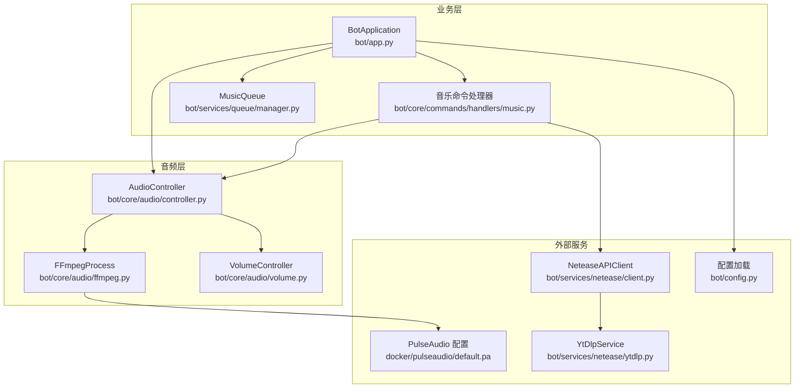
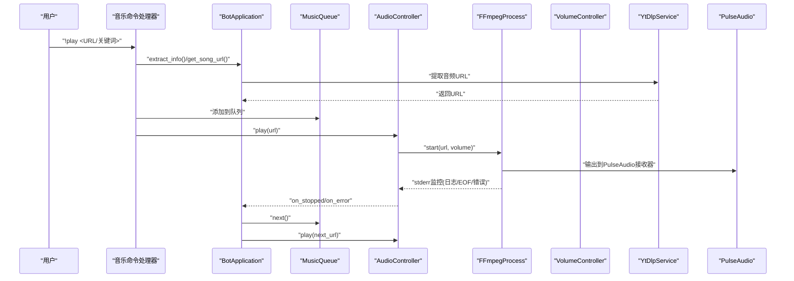
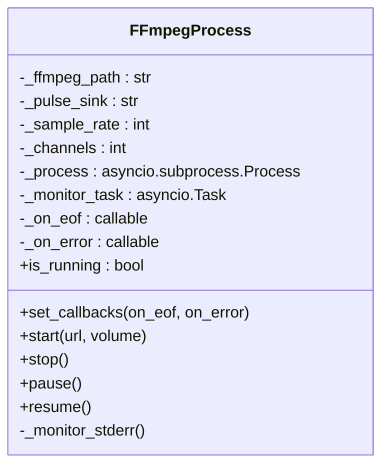
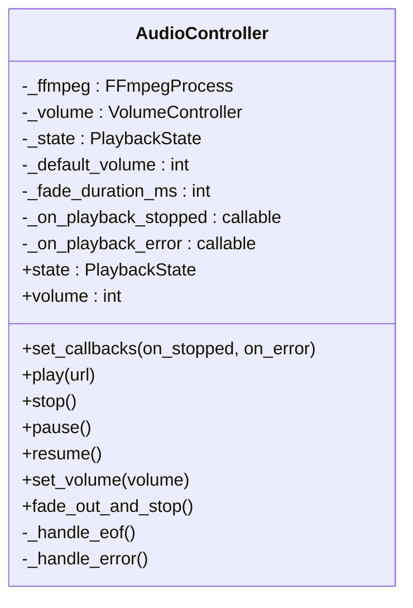
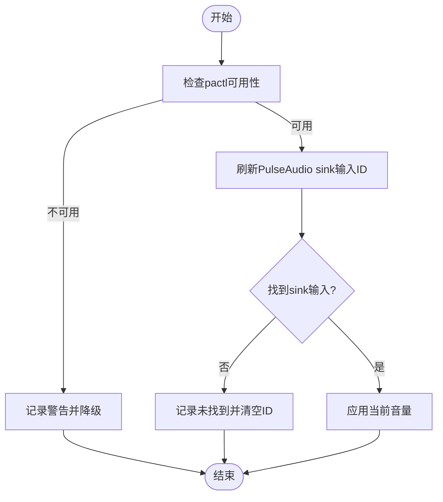
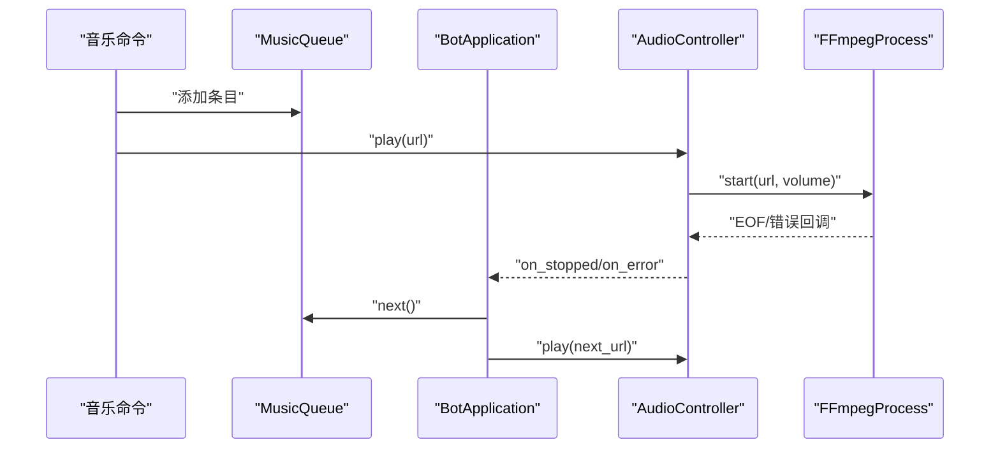
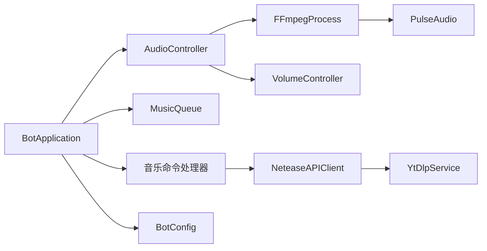

# FFmpeg集成

<cite>
**本文引用的文件**
- [ffmpeg.py](file://bot/core/audio/ffmpeg.py)
- [controller.py](file://bot/core/audio/controller.py)
- [volume.py](file://bot/core/audio/volume.py)
- [music.py](file://bot/core/commands/handlers/music.py)
- [manager.py](file://bot/services/queue/manager.py)
- [app.py](file://bot/app.py)
- [config.py](file://bot/config.py)
- [ytdlp.py](file://bot/services/netease/ytdlp.py)
- [client.py](file://bot/services/netease/client.py)
- [default.pa](file://docker/pulseaudio/default.pa)
- [docker-compose.yml](file://docker-compose.yml)
- [requirements.txt](file://requirements.txt)
</cite>

## 目录
1. [简介](#简介)
2. [项目结构](#项目结构)
3. [核心组件](#核心组件)
4. [架构总览](#架构总览)
5. [详细组件分析](#详细组件分析)
6. [依赖关系分析](#依赖关系分析)
7. [性能考量](#性能考量)
8. [故障排除指南](#故障排除指南)
9. [结论](#结论)
10. [附录](#附录)

## 简介
本技术文档聚焦于FFmpeg集成模块，系统性阐述 FFmpegProcess 类的架构设计与实现原理，覆盖以下关键主题：
- FFmpeg 进程生命周期管理：启动、暂停/恢复、优雅停止与强制终止
- 异步机制：基于 asyncio 的子进程与标准错误流监控
- 回调系统：EOF 与错误事件的处理流程
- 参数配置：音频采样率、声道数、PulseAudio 源/接收器名称、音量增益等
- 音频格式转换与流媒体处理：通过 FFmpeg 解复用/解码并输出至 PulseAudio
- 进程监控、资源清理与异常恢复策略
- 性能优化与故障排除建议

## 项目结构
FFmpeg 集成位于 bot/core/audio 子目录，配合命令处理器、队列管理、应用编排与配置模块协同工作。整体交互关系如下图所示：

图表来源
- [ffmpeg.py:16-162](file://bot/core/audio/ffmpeg.py#L16-L162)
- [controller.py:24-143](file://bot/core/audio/controller.py#L24-L143)
- [volume.py:12-113](file://bot/core/audio/volume.py#L12-L113)
- [music.py:17-243](file://bot/core/commands/handlers/music.py#L17-L243)
- [manager.py:35-204](file://bot/services/queue/manager.py#L35-L204)
- [app.py:27-348](file://bot/app.py#L27-L348)
- [config.py:125-160](file://bot/config.py#L125-L160)
- [ytdlp.py:31-192](file://bot/services/netease/ytdlp.py#L31-L192)
- [client.py:25-161](file://bot/services/netease/client.py#L25-L161)
- [default.pa:1-20](file://docker/pulseaudio/default.pa#L1-L20)

章节来源
- [ffmpeg.py:16-162](file://bot/core/audio/ffmpeg.py#L16-L162)
- [controller.py:24-143](file://bot/core/audio/controller.py#L24-L143)
- [volume.py:12-113](file://bot/core/audio/volume.py#L12-L113)
- [music.py:17-243](file://bot/core/commands/handlers/music.py#L17-L243)
- [manager.py:35-204](file://bot/services/queue/manager.py#L35-L204)
- [app.py:27-348](file://bot/app.py#L27-L348)
- [config.py:125-160](file://bot/config.py#L125-L160)
- [ytdlp.py:31-192](file://bot/services/netease/ytdlp.py#L31-L192)
- [client.py:25-161](file://bot/services/netease/client.py#L25-L161)
- [default.pa:1-20](file://docker/pulseaudio/default.pa#L1-L20)

## 核心组件
- FFmpegProcess：封装单个 FFmpeg 子进程的创建、运行、监控与终止，负责将音频流解码并输出到指定 PulseAudio 接收器。
- AudioController：高层控制器，协调 FFmpeg 生命周期、音量控制与状态机，并向应用层发出播放完成/错误事件。
- VolumeController：双层音量控制（FFmpeg 增益 + pactl 实时调整），提供平滑淡入淡出过渡。
- YtDlpService/NeteaseAPIClient：从各类平台提取可播放音频 URL，确保 CDN 链接新鲜有效。
- MusicQueue：多用户点歌队列，支持跳过投票、重复模式与历史记录。
- BotApplication：应用编排者，注册命令、事件与后台服务，驱动播放流程并在 EOF/错误时自动播放下一首。

章节来源
- [ffmpeg.py:16-162](file://bot/core/audio/ffmpeg.py#L16-L162)
- [controller.py:24-143](file://bot/core/audio/controller.py#L24-L143)
- [volume.py:12-113](file://bot/core/audio/volume.py#L12-L113)
- [ytdlp.py:31-192](file://bot/services/netease/ytdlp.py#L31-L192)
- [client.py:25-161](file://bot/services/netease/client.py#L25-L161)
- [manager.py:35-204](file://bot/services/queue/manager.py#L35-L204)
- [app.py:27-348](file://bot/app.py#L27-L348)

## 架构总览
下图展示从命令触发到播放完成的端到端流程，包括参数构建、进程启动、监控与回调处理：

图表来源
- [music.py:20-93](file://bot/core/commands/handlers/music.py#L20-L93)
- [app.py:199-253](file://bot/app.py#L199-L253)
- [controller.py:70-88](file://bot/core/audio/controller.py#L70-L88)
- [ffmpeg.py:54-93](file://bot/core/audio/ffmpeg.py#L54-L93)
- [ytdlp.py:53-67](file://bot/services/netease/ytdlp.py#L53-L67)

## 详细组件分析

### FFmpegProcess 组件分析
- 职责与边界
  - 创建并管理单个 FFmpeg 子进程，将其音频流解码后直接写入 PulseAudio 接收器。
  - 提供启动、停止、暂停/恢复、回调设置与进程监控能力。
- 关键属性与配置
  - 可配置项：ffmpeg 可执行路径、PulseAudio 接收器名称、采样率、声道数。
  - 运行时状态：进程对象、监控任务、回调函数（EOF/错误）。
- 启动流程
  - 构建命令行参数：重连策略、输入源、音量滤镜、输出格式与目标接收器、采样率/声道、禁用交互等。
  - 使用 asyncio 子进程接口创建进程，并启动 stderr 监控任务。
- 停止与终止
  - 取消监控任务；尝试优雅终止（SIGTERM），超时则强制终止（SIGKILL）；捕获进程不存在异常。
- 暂停/恢复
  - 通过发送 SIGSTOP/SIGCONT 控制进程挂起/恢复。
- 监控与回调
  - 读取 FFmpeg 标准错误流，解析退出码：0/-SIGTERM 表示正常结束（触发 EOF 回调），-25 表示被暂停（忽略），其他值视为错误（触发错误回调）。
- 错误处理与健壮性
  - 对取消、超时、进程查找异常进行容错处理；日志记录关键事件与返回码。

图表来源
- [ffmpeg.py:16-162](file://bot/core/audio/ffmpeg.py#L16-L162)

章节来源
- [ffmpeg.py:16-162](file://bot/core/audio/ffmpeg.py#L16-L162)

### AudioController 组件分析
- 职责与边界
  - 高层播放控制器，封装 FFmpeg 生命周期、音量控制与播放状态机。
  - 向上层暴露播放、暂停、恢复、停止、音量设置与淡出停止等操作。
- 状态机
  - IDLE/PLAYING/PAUSED 三种状态，严格的状态转换保证行为一致性。
- 回调与事件
  - 将 FFmpeg 的 EOF/错误事件映射为播放停止/错误事件，通知应用层继续播放下一首或提示错误。
- 音量控制
  - 初始阶段通过 FFmpeg volume 滤镜设置粗粒度音量；随后通过 pactl 对 PulseAudio sink 输入进行细粒度实时调整与淡入淡出。
- 启动流程
  - 设置回调 → 启动 FFmpeg → 等待片刻 → 刷新并绑定 PulseAudio sink 输入 → 完成初始化。

图表来源
- [controller.py:24-143](file://bot/core/audio/controller.py#L24-L143)

章节来源
- [controller.py:24-143](file://bot/core/audio/controller.py#L24-L143)

### VolumeController 组件分析
- 设计理念
  - 双层音量控制：启动时通过 FFmpeg volume 滤镜设定初始增益；运行中通过 pactl 对 sink 输入进行实时微调，实现平滑过渡。
- 关键流程
  - 刷新 sink 输入：通过查询 pactl 输出，匹配当前接收器，定位 sink 输入 ID 并应用当前音量。
  - 淡入淡出：按固定步长与间隔逐步调整音量，避免突变导致的音频噪声。
  - 错误处理：pactl 不可用或查询失败时降级处理，不影响播放主流程。
- 与 FFmpeg 的协作
  - 在启动前根据当前音量计算 FFmpeg 增益参数；启动后通过 pactl 实时微调。

图表来源
- [volume.py:77-109](file://bot/core/audio/volume.py#L77-L109)

章节来源
- [volume.py:12-113](file://bot/core/audio/volume.py#L12-L113)

### 命令与播放流程
- 命令入口
  - 音乐命令处理器根据输入类型（URL/关键词）决定直接播放或先搜索再播放。
- URL 提取
  - 使用 YtDlpService 从多平台提取最佳音频 URL；对于直接 URL，播放前再次提取以绕过 CDN 过期。
- 队列与自动播放
  - BotApplication 在播放完成或出错时，自动从 MusicQueue 中取出下一个条目并触发播放。
- 播放控制
  - 支持暂停/恢复、停止、音量调节与淡出停止；所有操作均通过 AudioController 协调。

图表来源
- [music.py:20-93](file://bot/core/commands/handlers/music.py#L20-L93)
- [app.py:199-253](file://bot/app.py#L199-L253)
- [manager.py:90-119](file://bot/services/queue/manager.py#L90-L119)

章节来源
- [music.py:17-243](file://bot/core/commands/handlers/music.py#L17-L243)
- [app.py:199-253](file://bot/app.py#L199-L253)
- [manager.py:35-204](file://bot/services/queue/manager.py#L35-L204)

## 依赖关系分析
- 内部依赖
  - AudioController 依赖 FFmpegProcess 与 VolumeController。
  - BotApplication 依赖 AudioController、MusicQueue、命令处理器与外部服务。
  - 命令处理器依赖 BotApplication 的服务实例。
- 外部依赖
  - FFmpeg 可执行程序与 PulseAudio 接收器。
  - yt-dlp 用于 URL 提取；pactl 用于音量控制。
- 配置与环境
  - 通过配置模型统一管理音频、TS3、调度、Webhook 等参数；Docker 环境提供 PulseAudio 默认配置与共享内存。

图表来源
- [controller.py:38-42](file://bot/core/audio/controller.py#L38-L42)
- [app.py:54-63](file://bot/app.py#L54-L63)
- [config.py:125-134](file://bot/config.py#L125-L134)

章节来源
- [controller.py:38-42](file://bot/core/audio/controller.py#L38-L42)
- [app.py:54-63](file://bot/app.py#L54-L63)
- [config.py:125-134](file://bot/config.py#L125-L134)

## 性能考量
- 进程与 I/O
  - 使用 asyncio 子进程与异步标准错误读取，避免阻塞事件循环。
  - 监控任务独立运行，确保在进程退出时能及时处理 EOF/错误回调。
- 音量控制
  - 初始音量通过 FFmpeg volume 滤镜设置，运行中使用 pactl 微调，步长与间隔可调，平衡响应速度与平滑度。
- URL 提取
  - CDN 链接易过期，采用“播放前重新提取”的策略，确保稳定性但增加网络开销；可通过缓存策略优化（当前实现不缓存音频 URL）。
- Docker/PulseAudio
  - 使用 null sink 与本地协议，避免不必要的音频设备依赖；禁用自动挂起，确保容器内稳定播放。

[本节为通用性能讨论，无需特定文件引用]

## 故障排除指南
- FFmpeg 无法启动
  - 检查 ffmpeg 可执行路径与权限；确认 PulseAudio 接收器名称一致。
  - 查看启动日志与标准错误流中的具体错误信息。
- 播放无声或音量异常
  - 确认 PulseAudio 接收器存在且默认 sink 已切换；检查 pactl 是否可用。
  - 验证 VolumeController 是否成功刷新 sink 输入 ID 并应用音量。
- 播放卡住或无法停止
  - 确保监控任务未被意外取消；停止时等待进程退出，必要时强制终止。
- URL 提取失败
  - 检查网络与代理设置；确认 yt-dlp 版本与平台支持情况。
- 容器内音频问题
  - 检查 Docker Compose 的共享内存与卷挂载；确认 PulseAudio 配置文件已生效。

章节来源
- [ffmpeg.py:94-115](file://bot/core/audio/ffmpeg.py#L94-L115)
- [volume.py:77-109](file://bot/core/audio/volume.py#L77-L109)
- [ytdlp.py:53-67](file://bot/services/netease/ytdlp.py#L53-L67)
- [default.pa:1-20](file://docker/pulseaudio/default.pa#L1-L20)
- [docker-compose.yml:9-26](file://docker-compose.yml#L9-L26)

## 结论
本集成方案通过清晰的分层设计与异步化实现，提供了稳定可靠的音频播放能力。FFmpegProcess 负责底层进程与流处理，AudioController 提供高层状态与事件管理，VolumeController 实现平滑音量控制，BotApplication 则将各模块有机串联，形成完整的播放闭环。结合队列管理与命令系统，实现了从点歌到自动播放的完整体验。未来可在 URL 缓存、错误重试与监控告警等方面进一步增强。

[本节为总结性内容，无需特定文件引用]

## 附录

### FFmpeg 参数配置要点
- 重连策略
  - 流式重连与最大延迟，提升网络不稳定场景下的鲁棒性。
- 音频滤镜
  - volume 滤镜用于初始音量设置；运行中通过 pactl 微调。
- 输出格式与目标
  - 使用 pulse 输出格式与指定接收器名称，确保音频写入正确的虚拟 sink。
- 采样率与声道
  - 与配置一致，保证与客户端/硬件兼容。
- 其他
  - 禁用交互、覆盖输出等选项，适配无人值守运行。

章节来源
- [ffmpeg.py:66-80](file://bot/core/audio/ffmpeg.py#L66-L80)
- [config.py:48-55](file://bot/config.py#L48-L55)

### 音频格式转换与流媒体处理
- 解复用/解码
  - FFmpeg 自动识别输入源并解复用/解码音频数据。
- 转换与重采样
  - 通过采样率与声道参数实现重采样与声道变换。
- 输出到 PulseAudio
  - 直接写入接收器，避免额外中间缓冲与拷贝。

章节来源
- [ffmpeg.py:19-21](file://bot/core/audio/ffmpeg.py#L19-L21)
- [default.pa:4-9](file://docker/pulseaudio/default.pa#L4-L9)

### 进程监控、资源清理与异常恢复
- 监控
  - 异步读取 stderr，解析退出码并触发回调。
- 清理
  - 取消监控任务、优雅终止进程、超时强制终止、清理状态。
- 恢复
  - 应用层在 EOF/错误时自动播放下一首，保障连续性。

章节来源
- [ffmpeg.py:127-162](file://bot/core/audio/ffmpeg.py#L127-L162)
- [app.py:199-253](file://bot/app.py#L199-L253)

### 配置与部署参考
- 配置模型
  - 包含 TS3、音频、网易云、聊天、自动化、调度、Webhook、日志等配置项。
- Docker 环境
  - 提供 PulseAudio 默认配置与共享内存挂载，便于容器内稳定运行。

章节来源
- [config.py:125-160](file://bot/config.py#L125-L160)
- [docker-compose.yml:1-33](file://docker-compose.yml#L1-L33)
- [default.pa:1-20](file://docker/pulseaudio/default.pa#L1-L20)
- [requirements.txt:1-10](file://requirements.txt#L1-L10)