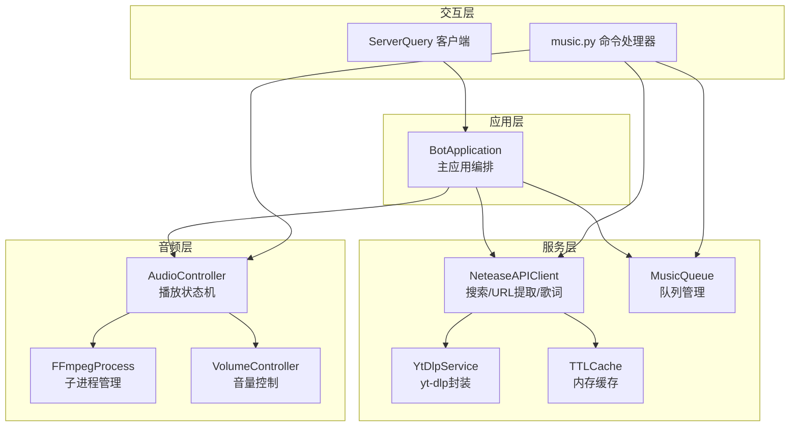
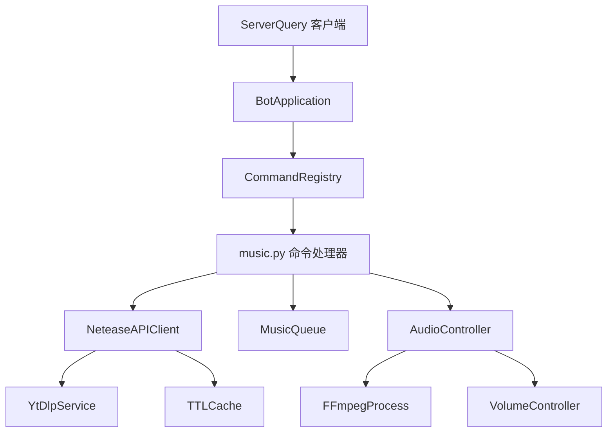
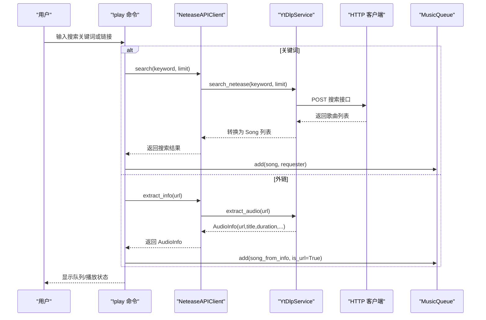
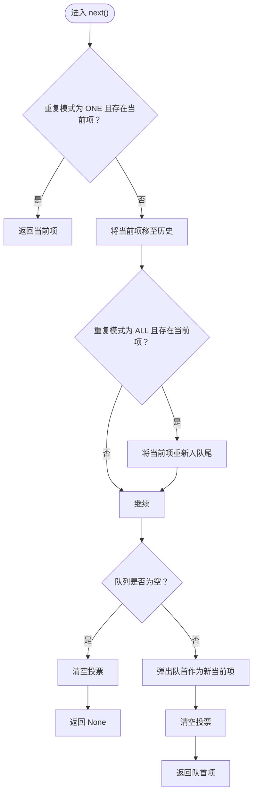
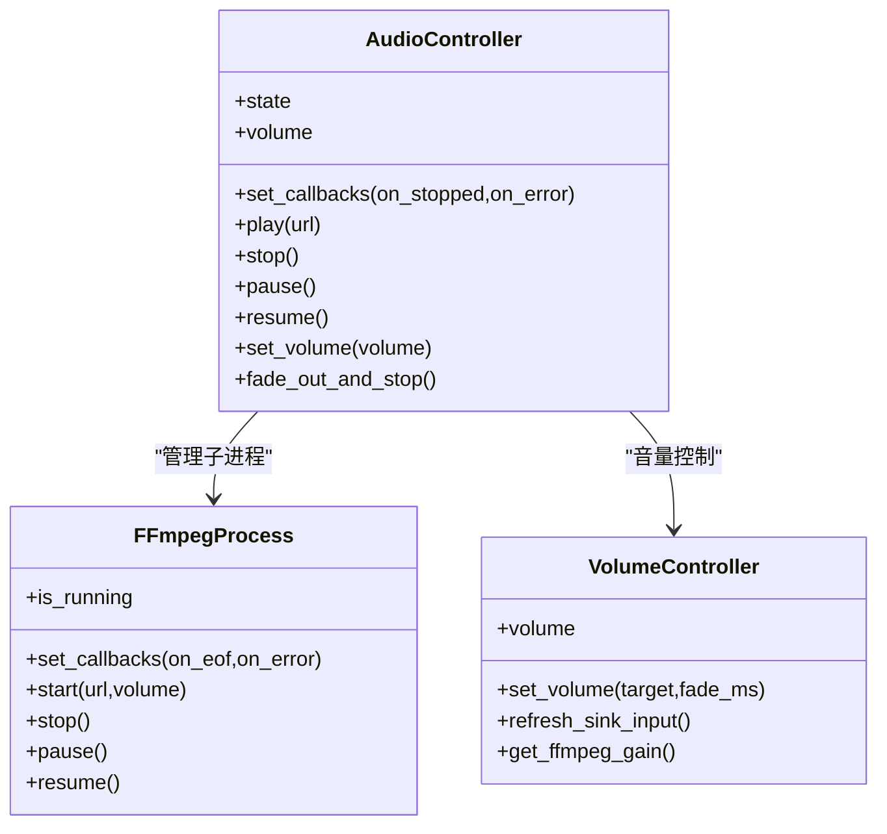
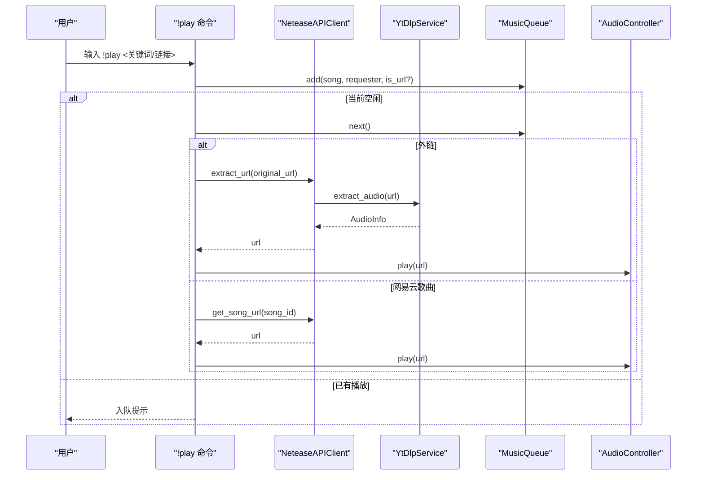
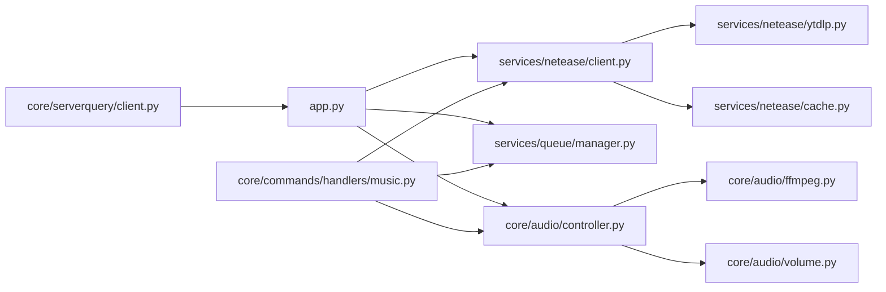

# 音乐搜索与获取

<cite>
**本文档引用的文件**
- [app.py](file://bot/app.py)
- [config.py](file://bot/config.py)
- [client.py](file://bot/services/netease/client.py)
- [models.py](file://bot/services/netease/models.py)
- [ytdlp.py](file://bot/services/netease/ytdlp.py)
- [cache.py](file://bot/services/netease/cache.py)
- [manager.py](file://bot/services/queue/manager.py)
- [controller.py](file://bot/core/audio/controller.py)
- [ffmpeg.py](file://bot/core/audio/ffmpeg.py)
- [volume.py](file://bot/core/audio/volume.py)
- [music.py](file://bot/core/commands/handlers/music.py)
- [client.py](file://bot/core/serverquery/client.py)
- [config.yaml](file://config/config.yaml)
- [formatting.py](file://bot/utils/formatting.py)
- [test_queue.py](file://tests/test_queue.py)
</cite>

## 目录
1. [简介](#简介)
2. [项目结构](#项目结构)
3. [核心组件](#核心组件)
4. [架构总览](#架构总览)
5. [详细组件分析](#详细组件分析)
6. [依赖分析](#依赖分析)
7. [性能考虑](#性能考虑)
8. [故障排查指南](#故障排查指南)
9. [结论](#结论)
10. [附录](#附录)

## 简介
本项目是一个基于 TeamSpeak 3 的音乐搜索与获取机器人，**现已完全集成 yt-dlp**，支持多平台音源（网易云音乐、YouTube、Bilibili、SoundCloud 等），通过 yt-dlp 服务实现统一的 URL 提取与音频下载，结合队列管理器实现点歌、播放、跳过、重复等完整功能；同时提供歌词查询、音量控制、FFmpeg 播放管线与 PulseAudio 输出。系统采用模块化设计，主应用编排各子系统，命令处理器对接用户交互，服务层负责搜索与 URL 提取，队列管理器负责播放调度，音频控制器负责播放生命周期与音量。

## 项目结构
- bot/app.py：主应用入口，负责加载配置、实例化各服务、注册命令与事件、启动后台任务与服务器查询连接。
- bot/config.py：配置模型与加载逻辑，支持 YAML 文件与环境变量插值。
- bot/services/netease/*：网易云音乐相关服务，包括客户端、YT-DLP 封装、缓存与数据模型。
- bot/services/queue/manager.py：音乐队列管理器，支持重复模式、跳过投票、格式化输出。
- bot/core/audio/*：音频播放控制，包含 FFmpeg 子进程管理、音量控制与状态机。
- bot/core/commands/handlers/music.py：音乐类命令处理器，对接搜索、播放、跳过、歌词等功能。
- bot/core/serverquery/client.py：TeamSpeak 3 ServerQuery 异步客户端，负责事件订阅与消息路由。
- config/config.yaml：默认配置示例，包含 TS3、音频、网易云、日志等参数。
- bot/utils/formatting.py：显示格式化工具，如时长格式化、BBCode 包裹等。
- tests/test_queue.py：队列管理器单元测试，验证重复模式、跳过阈值、格式化输出等行为。

**图表来源**
- [app.py:27-111](file://bot/app.py#L27-L111)
- [client.py:25-96](file://bot/services/netease/client.py#L25-L96)
- [ytdlp.py:31-122](file://bot/services/netease/ytdlp.py#L31-L122)
- [cache.py:9-46](file://bot/services/netease/cache.py#L9-L46)
- [manager.py:35-204](file://bot/services/queue/manager.py#L35-L204)
- [controller.py:24-143](file://bot/core/audio/controller.py#L24-L143)
- [ffmpeg.py:16-162](file://bot/core/audio/ffmpeg.py#L16-L162)
- [volume.py:12-113](file://bot/core/audio/volume.py#L12-L113)
- [music.py:17-243](file://bot/core/commands/handlers/music.py#L17-L243)
- [client.py:27-150](file://bot/core/serverquery/client.py#L27-L150)

**章节来源**
- [app.py:27-111](file://bot/app.py#L27-L111)
- [config.py:125-160](file://bot/config.py#L125-L160)
- [config.yaml:1-76](file://config/config.yaml#L1-76)

## 核心组件
- 主应用 BotApplication：负责初始化 ServerQuery、命令注册、事件绑定、后台服务启动与优雅停机。
- NeteaseAPIClient：封装搜索、URL 提取、歌词获取与缓存；使用 YtDlpService 抽取可播放音频流。
- **YtDlpService**：对 yt-dlp 的异步封装，支持多平台 URL 解析与音频信息提取，包括网易云音乐、YouTube、Bilibili、SoundCloud 等。
- MusicQueue：队列管理器，支持 FIFO、重复模式（关闭/单曲/列表）、跳过投票、格式化展示。
- AudioController：播放状态机，管理 FFmpeg 子进程、音量控制与回调事件。
- FFmpegProcess：通过 FFmpeg 将音频流解码并输出到 PulseAudio。
- VolumeController：双层音量控制（FFmpeg 滤镜粗调 + pactl 细调），支持淡入淡出。
- 命令处理器 music.py：!play、!skip、!pause、!resume、!stop、!queue、!np、!lyrics、!repeat 等。
- ServerQuery 客户端：事件订阅与消息路由，支持自动重连与保活。
- 配置系统：BotConfig 模型与 YAML 加载，支持环境变量插值。

**章节来源**
- [app.py:27-111](file://bot/app.py#L27-L111)
- [client.py:25-96](file://bot/services/netease/client.py#L25-L96)
- [ytdlp.py:31-122](file://bot/services/netease/ytdlp.py#L31-L122)
- [manager.py:35-204](file://bot/services/queue/manager.py#L35-L204)
- [controller.py:24-143](file://bot/core/audio/controller.py#L24-L143)
- [ffmpeg.py:16-162](file://bot/core/audio/ffmpeg.py#L16-L162)
- [volume.py:12-113](file://bot/core/audio/volume.py#L12-L113)
- [music.py:17-243](file://bot/core/commands/handlers/music.py#L17-L243)
- [client.py:27-150](file://bot/core/serverquery/client.py#L27-L150)
- [config.py:125-160](file://bot/config.py#L125-L160)

## 架构总览
系统采用"应用编排 + 服务层 + 音频层 + 交互层"的分层架构：
- 应用层：BotApplication 负责装配与生命周期管理。
- 服务层：NeteaseAPIClient 与 YtDlpService 提供搜索与 URL 提取能力；TTLCache 缓存搜索与歌词结果。
- 音频层：AudioController 统一管理播放状态；FFmpegProcess 负责解码与输出；VolumeController 控制音量。
- 交互层：命令处理器对接 TS3 文本消息，MusicQueue 管理播放顺序；ServerQuery 客户端负责事件订阅与消息路由。

**图表来源**
- [app.py:140-161](file://bot/app.py#L140-L161)
- [music.py:17-243](file://bot/core/commands/handlers/music.py#L17-L243)
- [client.py:27-150](file://bot/core/serverquery/client.py#L27-L150)
- [client.py:25-96](file://bot/services/netease/client.py#L25-L96)
- [ytdlp.py:31-122](file://bot/services/netease/ytdlp.py#L31-L122)
- [cache.py:9-46](file://bot/services/netease/cache.py#L9-L46)
- [manager.py:35-204](file://bot/services/queue/manager.py#L35-L204)
- [controller.py:24-143](file://bot/core/audio/controller.py#L24-L143)
- [ffmpeg.py:16-162](file://bot/core/audio/ffmpeg.py#L16-L162)
- [volume.py:12-113](file://bot/core/audio/volume.py#L12-L113)

## 详细组件分析

### 音乐搜索与 URL 提取服务
- **搜索流程**：NeteaseAPIClient 使用 YtDlpService.search_netease 通过网易云网页搜索接口获取歌曲列表，结果经 TTLCache 缓存，默认 TTL 10 分钟。
- **URL 提取**：对于网易云歌曲，直接访问 music.163.com/song?id=... 并由 YtDlpService.extract_audio 获取可播放 URL；对于外部链接（YouTube/B站/SoundCloud 等），同样通过 yt-dlp 抽取音频信息与 URL。
- **歌词获取**：通过网易云歌词接口获取 LRC 文本，解析为 Lyrics 对象并缓存 30 分钟。
- **错误处理**：所有网络请求与 yt-dlp 调用均捕获异常并抛出自定义 MusicAPIError，便于上层统一处理。

**图表来源**
- [music.py:20-93](file://bot/core/commands/handlers/music.py#L20-L93)
- [client.py:40-66](file://bot/services/netease/client.py#L40-L66)
- [ytdlp.py:123-178](file://bot/services/netease/ytdlp.py#L123-L178)
- [ytdlp.py:53-122](file://bot/services/netease/ytdlp.py#L53-L122)
- [client.py:115-156](file://bot/services/netease/client.py#L115-L156)

**章节来源**
- [client.py:25-96](file://bot/services/netease/client.py#L25-L96)
- [ytdlp.py:31-122](file://bot/services/netease/ytdlp.py#L31-L122)
- [ytdlp.py:123-178](file://bot/services/netease/ytdlp.py#L123-L178)
- [cache.py:9-46](file://bot/services/netease/cache.py#L9-L46)
- [models.py:9-41](file://bot/services/netease/models.py#L9-L41)

### 队列管理器（MusicQueue）
- 数据结构：内部使用列表维护队列，使用双端队列记录历史；QueueEntry 包含 Song、请求者信息与是否为外链标记。
- 重复模式：OFF（FIFO）、ONE（单曲循环）、ALL（列表循环）。next() 方法根据模式决定是否将当前项重新入队或重复播放。
- 跳过投票：按频道用户总数计算阈值（半数以上加一），累计投票数达到阈值则触发跳过。
- 格式化输出：提供 format_queue 与 format_now_playing，用于 TS3 聊天展示。
- 其他操作：支持 peek、remove、clear、shuffle 等常用队列操作。

**图表来源**
- [manager.py:90-119](file://bot/services/queue/manager.py#L90-L119)

**章节来源**
- [manager.py:35-204](file://bot/services/queue/manager.py#L35-L204)
- [test_queue.py:13-159](file://tests/test_queue.py#L13-L159)

### 音频播放与音量控制
- AudioController：统一播放状态（IDLE/PLAYING/PAUSED），设置回调以响应 EOF 与错误；在播放开始后刷新 PulseAudio sink input 以便音量控制。
- FFmpegProcess：启动 FFmpeg 子进程，读取 URL 并输出到 PulseAudio sink；监控 stderr，处理 EOF 与错误事件；支持暂停/恢复（SIGSTOP/SIGCONT）。
- VolumeController：先通过 FFmpeg volume 滤镜进行初始增益设置，再通过 pactl 对 sink input 实现细粒度音量调整与淡入淡出。

**图表来源**
- [controller.py:24-143](file://bot/core/audio/controller.py#L24-L143)
- [ffmpeg.py:16-162](file://bot/core/audio/ffmpeg.py#L16-L162)
- [volume.py:12-113](file://bot/core/audio/volume.py#L12-L113)

**章节来源**
- [controller.py:24-143](file://bot/core/audio/controller.py#L24-L143)
- [ffmpeg.py:16-162](file://bot/core/audio/ffmpeg.py#L16-L162)
- [volume.py:12-113](file://bot/core/audio/volume.py#L12-L113)

### 命令处理与播放流程
- !play：支持关键词搜索与外链解析；外链通过 extract_info 生成临时 Song 并标记 is_url=True；若当前空闲则立即播放，否则入队。
- !skip：统计频道用户数，按阈值计算投票数，满足即跳过并播放下一首。
- !pause/resume/stop：控制播放状态。
- !queue/!np：格式化展示队列与当前播放信息。
- !lyrics：仅对网易云歌曲有效，从缓存或接口获取歌词。
- **自动播放**：AudioController 回调触发后，MusicQueue.next() 取出下一项；若为外链则重新提取 URL（CDN 链接会过期），否则从音乐页面获取最新 URL。

**图表来源**
- [music.py:20-93](file://bot/core/commands/handlers/music.py#L20-L93)
- [music.py:203-243](file://bot/core/commands/handlers/music.py#L203-L243)
- [client.py:68-91](file://bot/services/netease/client.py#L68-L91)
- [ytdlp.py:53-122](file://bot/services/netease/ytdlp.py#L53-L122)

**章节来源**
- [music.py:17-243](file://bot/core/commands/handlers/music.py#L17-L243)
- [app.py:199-246](file://bot/app.py#L199-L246)

### 配置与环境变量
- BotConfig：包含 TS3、音频、网易云、聊天、自动化、调度、Webhook、日志等配置项。
- YAML 配置：支持环境变量插值，如 TS3_HOST、TS3_PASSWORD、WEBHOOK_SECRET 等。
- 默认值：若未找到配置文件，使用默认值并仍可从环境变量注入敏感信息。

**章节来源**
- [config.py:125-160](file://bot/config.py#L125-L160)
- [config.yaml:1-76](file://config/config.yaml#L1-76)

## 依赖分析
- 外部依赖：yt-dlp、httpx、pydantic、pydantic-settings、fastapi、uvicorn、apscheduler 等。
- 内部耦合：App 依赖 NeteaseAPIClient、MusicQueue、AudioController；命令处理器依赖上述组件；NeteaseAPIClient 依赖 YtDlpService 与 TTLCache；AudioController 依赖 FFmpegProcess 与 VolumeController。
- 循环依赖：未发现循环导入；模块职责清晰，接口边界明确。

**图表来源**
- [app.py:27-111](file://bot/app.py#L27-L111)
- [client.py:25-96](file://bot/services/netease/client.py#L25-L96)
- [ytdlp.py:31-122](file://bot/services/netease/ytdlp.py#L31-L122)
- [cache.py:9-46](file://bot/services/netease/cache.py#L9-L46)
- [manager.py:35-204](file://bot/services/queue/manager.py#L35-L204)
- [controller.py:24-143](file://bot/core/audio/controller.py#L24-L143)
- [ffmpeg.py:16-162](file://bot/core/audio/ffmpeg.py#L16-L162)
- [volume.py:12-113](file://bot/core/audio/volume.py#L12-L113)
- [music.py:17-243](file://bot/core/commands/handlers/music.py#L17-L243)
- [client.py:27-150](file://bot/core/serverquery/client.py#L27-L150)

**章节来源**
- [requirements.txt:1-9](file://requirements.txt#L1-L9)

## 性能考虑
- **URL 提取策略**：CDN 链接具有较短有效期，因此在播放前通过 YtDlpService 重新提取，确保稳定性。
- **缓存策略**：搜索与歌词结果使用 TTLCache 缓存，减少重复请求；搜索 TTL 10 分钟，歌词 TTL 30 分钟。
- **音频管线**：FFmpeg 以只解码不下载的方式运行，避免磁盘 IO；音量控制采用两级方案，保证平滑过渡。
- **并发与阻塞**：yt-dlp 在线程池中执行，避免阻塞事件循环；ServerQuery 采用异步读写与保活机制。
- **队列调度**：FIFO 基础上支持重复模式与跳过投票，兼顾公平性与用户体验。

## 故障排查指南
- **播放失败**：检查 FFmpeg 是否可执行、PulseAudio 是否正常；查看 AudioController 回调日志；确认 URL 是否有效。
- **链接解析失败**：确认 URL 是否受支持（yt-dlp 支持域名单）；查看 YtDlpService 日志；必要时重试或更换来源。
- **歌词缺失**：确认歌曲是否有歌词（网易云接口返回为空）；检查缓存是否命中。
- **队列卡住**：检查 MusicQueue 的 current 与 _skip_votes 清理逻辑；确认重复模式设置。
- **ServerQuery 断线**：查看自动重连日志与指数退避延迟；确认凭据与虚拟服务器 ID。

**章节来源**
- [controller.py:130-143](file://bot/core/audio/controller.py#L130-L143)
- [ytdlp.py:53-122](file://bot/services/netease/ytdlp.py#L53-L122)
- [client.py:115-156](file://bot/services/netease/client.py#L115-L156)
- [manager.py:90-119](file://bot/services/queue/manager.py#L90-L119)
- [client.py:183-198](file://bot/core/serverquery/client.py#L183-L198)

## 结论
本系统通过模块化设计实现了从搜索、URL 提取、队列管理到音频播放的完整闭环。**NeteaseAPIClient 与 YtDlpService 的组合提供了强大的多平台支持**；TTLCache 与合理的播放策略保障了性能与稳定性；MusicQueue 的重复模式与跳过投票提升了多人场景下的公平性；AudioController 与 FFmpeg/PulseAudio 的配合实现了可靠的音频输出。整体架构清晰、扩展性强，适合进一步引入播放器均衡、速率限制与更丰富的调度策略。

## 附录

### 音乐数据模型（Song）
- 字段说明
  - id：整数，歌曲唯一标识。
  - title：字符串，歌曲标题。
  - artist：字符串，艺术家名称（多艺人以" / "拼接）。
  - album：字符串，专辑名称（可选）。
  - duration：timedelta，时长。
  - cover_url：字符串或 None，封面图地址（可选）。
- 属性
  - display_name：返回"标题 - 艺术家"格式的展示名。
- 工具方法
  - from_api：从旧版 API 响应数据构造 Song。

**章节来源**
- [models.py:9-41](file://bot/services/netease/models.py#L9-L41)

### 队列条目（QueueEntry）
- 字段说明
  - song：Song 对象。
  - requester_clid：请求者客户端 ID。
  - requester_name：请求者昵称。
  - request_time：请求时间。
  - is_url：布尔值，标记是否为外链而非网易云歌曲。

**章节来源**
- [manager.py:24-33](file://bot/services/queue/manager.py#L24-L33)

### 配置项摘要
- TS3：主机、查询端口、语音端口、用户名、密码、虚拟服务器 ID、昵称、默认频道、命令前缀。
- 音频：PulseAudio sink 名称、默认音量、淡入时长、FFmpeg 路径、缓存目录与大小。
- 网易云：搜索上限、音频质量等级。
- 聊天：API 基础地址、密钥、模型、温度、最大 token、上下文窗口、默认人设、按频道上下文。
- 自动化：欢迎消息、自动分组、跟随模式。
- 调度：提醒任务列表。
- Webhook：开关、主机、端口、密钥。
- 日志：级别、格式、文件路径、单文件大小与备份数。

**章节来源**
- [config.py:36-134](file://bot/config.py#L36-L134)
- [config.yaml:1-76](file://config/config.yaml#L1-76)

### 新增：yt-dlp 集成详解

#### YtDlpService 类
- **核心功能**：对 yt-dlp 的异步封装，支持多平台 URL 解析与音频信息提取。
- **异步设计**：使用 asyncio.to_thread 在线程池中执行同步操作，避免阻塞事件循环。
- **支持平台**：网易云音乐、YouTube、Bilibili、SoundCloud、Bandcamp 等。

#### AudioInfo 数据类
- **字段**：url、title、duration、thumbnail、source、original_url
- **用途**：封装从任意支持平台提取的音频信息

#### DownloadedAudio 数据类
- **字段**：path、title、duration、source、original_url
- **用途**：封装本地下载的音频文件信息

#### URL 支持检测
- **支持域名单**：music.163.com、youtube.com、youtu.be、bilibili.com、b23.tv、soundcloud.com、bandcamp.com
- **用途**：快速判断 URL 是否可被 yt-dlp 处理

**章节来源**
- [ytdlp.py:44-302](file://bot/services/netease/ytdlp.py#L44-L302)