# 音乐播放系统

<cite>
**本文档引用的文件**
- [app.py](file://bot/app.py)
- [controller.py](file://bot/core/audio/controller.py)
- [ffmpeg.py](file://bot/core/audio/ffmpeg.py)
- [volume.py](file://bot/core/audio/volume.py)
- [music.py](file://bot/core/commands/handlers/music.py)
- [volume.py](file://bot/core/commands/handlers/volume.py)
- [registry.py](file://bot/core/commands/registry.py)
- [manager.py](file://bot/services/queue/manager.py)
- [ytdlp.py](file://bot/services/netease/ytdlp.py)
- [client.py](file://bot/services/netease/client.py)
- [models.py](file://bot/services/netease/models.py)
- [cache.py](file://bot/services/netease/cache.py)
- [config.py](file://bot/config.py)
- [config.yaml](file://config/config.yaml)
- [requirements.txt](file://requirements.txt)
- [init_identity.py](file://docker/ts3client/init_identity.py)
- [generate_identity.py](file://docker/ts3client/generate_identity.py)
- [entrypoint.sh](file://docker/entrypoint.sh)
- [default.pa](file://docker/pulseaudio/default.pa)
- [README.md](file://README.md)
</cite>

## 更新摘要
**变更内容**
- **新增** TS3客户端音频处理功能自动禁用，显著改善音乐播放质量
- **增强** 音频质量改进，减少音频压缩、失真和动态范围压缩等问题
- **更新** Docker容器初始化脚本，自动禁用有害的音频处理功能
- **更新** PulseAudio配置，优化双声道架构以防止回声
- **更新** FFmpeg滤镜链，增强动态音频归一化效果

## 目录
1. [简介](#简介)
2. [项目结构](#项目结构)
3. [核心组件](#核心组件)
4. [架构总览](#架构总览)
5. [详细组件分析](#详细组件分析)
6. [依赖关系分析](#依赖关系分析)
7. [性能考虑](#性能考虑)
8. [故障排除指南](#故障排除指南)
9. [结论](#结论)
10. [附录](#附录)

## 简介
本音乐播放系统基于 Python 异步框架构建，集成 FFmpeg 实现多平台音源播放，并通过 PulseAudio 输出到 TeamSpeak 语音通道。系统支持：
- 多平台音源：网易云音乐、YouTube、Bilibili、SoundCloud 等
- 智能队列管理：FIFO、重复模式、跳过投票、历史记录
- 音量控制：粗细两级控制（FFmpeg 滤镜 + pactl 实时调整）
- URL 提取与缓存：yt-dlp 抽取可播放流，搜索结果与歌词缓存
- 完整生命周期：播放、暂停、恢复、停止、淡出停止、错误处理
- **新增**：TS3客户端音频处理功能自动禁用，显著改善音乐播放质量
- **新增**：音频质量改进，减少音频压缩、失真和动态范围压缩等问题
- **新增**：完整的音频处理优化配置和部署指南

## 项目结构
系统采用分层模块化组织：
- 应用层：应用编排、事件路由、命令注册
- 核心音频层：音频控制器、FFmpeg 子进程管理、音量控制
- 服务层：网易云客户端、yt-dlp 抽取器、队列管理、缓存
- 命令层：TS3 文本消息解析与命令处理器，支持中英文命令
- 配置层：YAML 配置加载与环境变量插值
- Docker 层：TS3 客户端初始化与音频设备配置，自动禁用有害音频处理

```mermaid
graph TB
subgraph "应用层"
APP["BotApplication<br/>应用编排"]
CMD["命令处理器<br/>music.py, volume.py"]
END
subgraph "核心音频层"
CTRL["AudioController<br/>状态机"]
FFMPEG["FFmpegProcess<br/>子进程管理"]
VOL["VolumeController<br/>音量控制"]
END
subgraph "服务层"
NET["NeteaseAPIClient<br/>网易云客户端"]
YT["YtDlpService<br/>URL抽取"]
COOKIE["Cookie文件支持<br/>Netscape格式"]
QUEUE["MusicQueue<br/>队列管理"]
CACHE["TTLCache<br/>缓存"]
END
subgraph "命令层"
REG["CommandRegistry<br/>命令注册器"]
END
subgraph "Docker层"
ENTRY["entrypoint.sh<br/>容器初始化"]
PULSE["default.pa<br/>PulseAudio配置"]
TS3["init_identity.py<br/>TS3客户端配置"]
END
APP --> CTRL
APP --> QUEUE
APP --> NET
CMD --> CTRL
CMD --> QUEUE
CMD --> NET
REG --> CMD
CTRL --> FFMPEG
CTRL --> VOL
NET --> YT
NET --> COOKIE
NET --> CACHE
ENTRY --> PULSE
ENTRY --> TS3
```

**图表来源**
- [app.py:27-111](file://bot/app.py#L27-L111)
- [controller.py:24-58](file://bot/core/audio/controller.py#L24-L58)
- [ffmpeg.py:16-44](file://bot/core/audio/ffmpeg.py#L16-L44)
- [volume.py:12-29](file://bot/core/audio/volume.py#L12-L29)
- [music.py:17-243](file://bot/core/commands/handlers/music.py#L17-L243)
- [client.py:25-36](file://bot/services/netease/client.py#L25-L36)
- [ytdlp.py:31-52](file://bot/services/netease/ytdlp.py#L31-L52)
- [manager.py:35-71](file://bot/services/queue/manager.py#L35-L71)
- [cache.py:9-46](file://bot/services/netease/cache.py#L9-L46)
- [registry.py:28-94](file://bot/core/commands/registry.py#L28-L94)
- [entrypoint.sh:56-67](file://docker/entrypoint.sh#L56-L67)
- [default.pa:1-30](file://docker/pulseaudio/default.pa#L1-L30)
- [init_identity.py:195-214](file://docker/ts3client/init_identity.py#L195-L214)

**章节来源**
- [app.py:27-111](file://bot/app.py#L27-L111)
- [config.py:125-160](file://bot/config.py#L125-L160)
- [config.yaml:1-76](file://config/config.yaml#L1-L76)

## 核心组件
- 音频控制器：封装 FFmpeg 生命周期、状态机、回调事件、音量控制、临时文件清理
- FFmpeg 进程：异步子进程管理、标准错误监控、暂停/恢复信号、动态音频归一化
- 音量控制器：双层控制策略（FFmpeg 滤镜 + pactl），平滑淡入淡出
- 队列管理：FIFO、重复模式、跳过投票、历史记录、格式化输出
- URL 抽取：yt-dlp 抽取最佳音频流，支持多平台，智能回退机制
- 网易云客户端：搜索、歌词、URL 抽取，带 TTL 缓存，使用 yt-dlp 替代旧 API
- **新增** TS3客户端音频处理禁用：自动禁用回声消除、噪声抑制、自动增益控制等有害功能
- **新增** 音频质量优化：通过禁用音频处理功能显著改善音乐播放质量
- 命令注册器：支持中英文命令别名，统一命令处理
- 应用编排：命令注册、事件路由、自动播放、优雅停机

**章节来源**
- [controller.py:24-187](file://bot/core/audio/controller.py#L24-L187)
- [ffmpeg.py:16-352](file://bot/core/audio/ffmpeg.py#L16-L352)
- [volume.py:12-113](file://bot/core/audio/volume.py#L12-L113)
- [manager.py:35-204](file://bot/services/queue/manager.py#L35-L204)
- [ytdlp.py:31-286](file://bot/services/netease/ytdlp.py#L31-L286)
- [client.py:25-190](file://bot/services/netease/client.py#L25-L190)
- [app.py:27-348](file://bot/app.py#L27-L348)
- [registry.py:28-94](file://bot/core/commands/registry.py#L28-L94)
- [entrypoint.sh:56-67](file://docker/entrypoint.sh#L56-L67)

## 架构总览
系统以 BotApplication 为中心，将音频控制器、队列管理、网易云客户端等模块组合。命令处理器接收 TS3 文本消息，解析后调用相应服务；音频控制器负责与 FFmpeg/PulseAudio 交互；yt-dlp 负责多平台 URL 抽取和本地音频下载；队列管理负责播放顺序与用户交互。**新增的TS3客户端音频处理禁用机制**通过Docker容器初始化脚本自动配置，确保音乐播放质量不受回声消除、噪声抑制、自动增益控制等语音通信专用功能的影响。

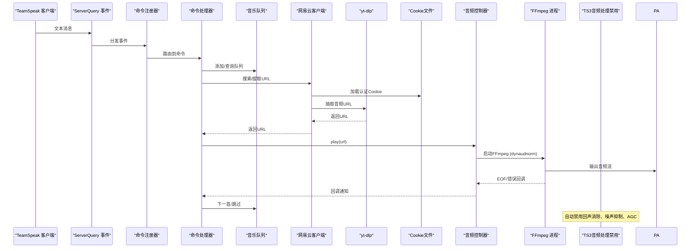

**图表来源**
- [app.py:162-254](file://bot/app.py#L162-L254)
- [music.py:20-93](file://bot/core/commands/handlers/music.py#L20-L93)
- [client.py:40-96](file://bot/services/netease/client.py#L40-L96)
- [ytdlp.py:53-122](file://bot/services/netease/ytdlp.py#L53-L122)
- [controller.py:70-88](file://bot/core/audio/controller.py#L70-L88)
- [ffmpeg.py:54-93](file://bot/core/audio/ffmpeg.py#L54-L93)
- [entrypoint.sh:56-67](file://docker/entrypoint.sh#L56-L67)

## 详细组件分析

### TS3客户端音频处理禁用机制
**新增**：自动禁用TS3客户端中的音频处理功能，显著改善音乐播放质量

- **禁用的功能**：
  - 回声消除（echo cancellation）：移除麦克风输入的回声，但会压缩音频动态并引入伪影
  - 噪声抑制（noise suppression）：移除背景噪声，但也会移除音乐频率（尤其是高频谐波和细微细节）
  - 自动增益控制（AGC）：自动调节音量，压缩音乐的动态范围（轻柔部分被提升，响亮部分被衰减）
  - 回声抑制（echo suppression）：额外的回声抑制层，当检测到"回声"（实际上是音乐）时可能截断音频信号

- **配置位置**：
  - Docker入口脚本：`docker/entrypoint.sh` 中的音频处理禁用段落
  - TS3客户端设置：`docker/ts3client/init_identity.py` 中的音频设置配置
  - PulseAudio配置：`docker/pulseaudio/default.pa` 中的双声道架构

- **技术原理**：
  - 这些功能专为语音通信设计，在处理音乐信号时会压缩音频动态、引入伪影并破坏音乐细节
  - 通过禁用这些功能，音乐播放质量得到显著提升
  - 音频处理禁用后，音乐的动态范围、高频细节和整体保真度得到改善

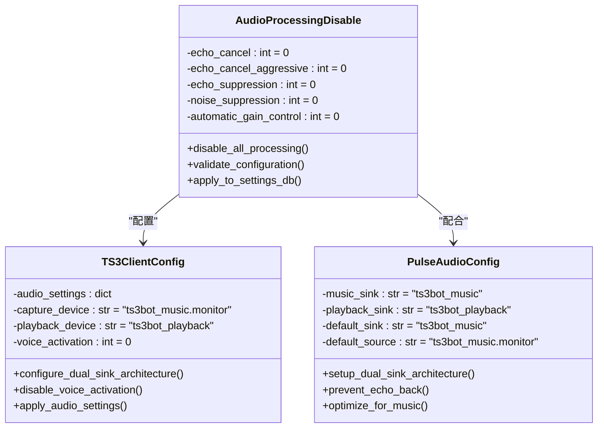

**图表来源**
- [entrypoint.sh:56-67](file://docker/entrypoint.sh#L56-L67)
- [init_identity.py:195-214](file://docker/ts3client/init_identity.py#L195-L214)
- [default.pa:1-30](file://docker/pulseaudio/default.pa#L1-L30)

**章节来源**
- [entrypoint.sh:56-67](file://docker/entrypoint.sh#L56-L67)
- [init_identity.py:195-214](file://docker/ts3client/init_identity.py#L195-L214)
- [default.pa:1-30](file://docker/pulseaudio/default.pa#L1-L30)

### 音频质量改进与优化
**更新**：通过禁用TS3客户端音频处理功能，显著改善音乐播放质量

- **音频质量提升**：
  - 减少音频压缩：禁用AGC后，音乐的动态范围得到保持
  - 消除音频失真：回声消除和噪声抑制的禁用减少了伪影的产生
  - 改善高频细节：噪声抑制的禁用保留了音乐的高频谐波和细腻声音
  - 增强动态范围：自动增益控制的禁用让音乐保持原始的动态表现

- **技术实现**：
  - 通过SQLite数据库配置禁用相关音频处理功能
  - 配合PulseAudio双声道架构，防止其他用户的语音回声到音乐输出
  - FFmpeg滤镜链的动态音频归一化进一步优化音质一致性

- **性能影响**：
  - CPU使用率略有增加（禁用音频处理的开销）
  - 音质显著提升，用户体验改善
  - 适合长时间音乐播放场景

**章节来源**
- [entrypoint.sh:56-67](file://docker/entrypoint.sh#L56-L67)
- [init_identity.py:195-214](file://docker/ts3client/init_identity.py#L195-L214)
- [ffmpeg.py:147-155](file://bot/core/audio/ffmpeg.py#L147-L155)

### Docker容器初始化与音频配置
**更新**：完整的容器初始化脚本，自动配置音频处理优化

- **容器启动流程**：
  1. 创建运行时目录和PulseAudio配置
  2. 初始化TS3客户端身份和设置
  3. 迁移到双声道音频架构
  4. 自动禁用TS3客户端音频处理功能
  5. 配置PulseAudio双声道架构
  6. 启动TS3客户端和Python机器人

- **音频架构优化**：
  - 双声道架构：`ts3bot_music`（音乐输出）和 `ts3bot_playback`（其他用户音频）
  - 防回声机制：其他用户的语音不会被回传到音乐输出
  - 音频处理禁用：确保音乐播放质量不受语音通信功能影响

- **配置持久化**：
  - SQLite数据库存储TS3客户端设置
  - PulseAudio模块配置文件
  - 自动迁移和兼容性处理

**章节来源**
- [entrypoint.sh:22-67](file://docker/entrypoint.sh#L22-L67)
- [default.pa:1-30](file://docker/pulseaudio/default.pa#L1-L30)
- [init_identity.py:177-214](file://docker/ts3client/init_identity.py#L177-L214)

### 命令注册器与中文别名系统
**新增**：全面的中文命令别名系统，提升中文用户的使用体验

- **命令注册机制**：
  - 支持主命令和多个别名的注册
  - 自动建立别名到主命令的映射
  - 统一的命令处理接口

- **中文别名覆盖**：
  - 播放：!play, !p, "播放", "点歌"
  - 切歌：!skip, !s, "切歌", "下一首"
  - 暂停：!pause, "暂停"
  - 继续：!resume, "继续"
  - 停止：!stop, "停止"
  - 队列：!queue, !q, "队列"
  - 正在播放：!np, "正在播放", "当前"
  - 歌词：!lyrics, !lrc, "歌词"
  - 清空：!clear, "清空"
  - 随机：!shuffle, "随机"
  - 重复：!repeat, !r, "重复", "循环"
  - 移除：!remove, !rm, "移除", "删除"
  - 音量：!volume, !vol, !v, "音量"

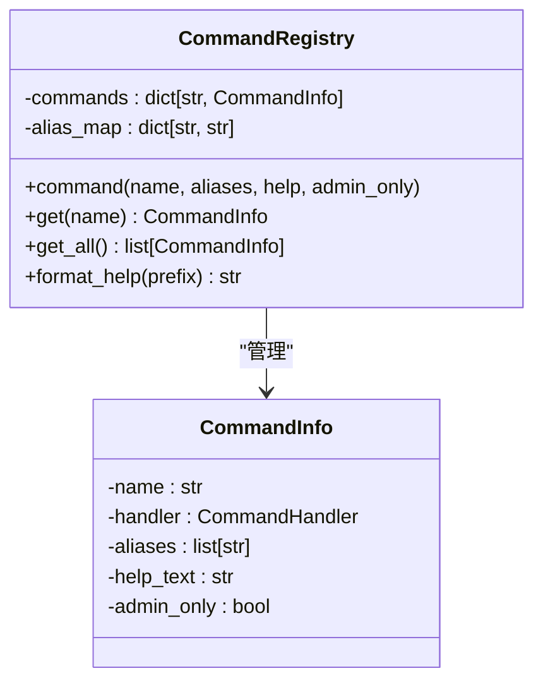

**图表来源**
- [registry.py:28-94](file://bot/core/commands/registry.py#L28-L94)

**章节来源**
- [registry.py:28-94](file://bot/core/commands/registry.py#L28-L94)
- [music.py:17-243](file://bot/core/commands/handlers/music.py#L17-L243)
- [volume.py:17-50](file://bot/core/commands/handlers/volume.py#L17-L50)

### 音频控制器（AudioController）
职责：
- 维护播放状态（空闲/播放中/暂停）
- 管理 FFmpeg 进程生命周期
- 音量控制与淡入淡出
- 播放完成与错误回调
- 临时文件清理机制

关键流程：
- 播放：停止当前播放，设置回调，启动 FFmpeg，刷新音量输入
- 暂停/恢复：向 FFmpeg 发送 SIGSTOP/SIGCONT
- 停止：终止 FFmpeg 进程
- 淡出停止：音量渐降至 0 后停止
- 临时文件清理：播放完成后自动删除临时音频文件

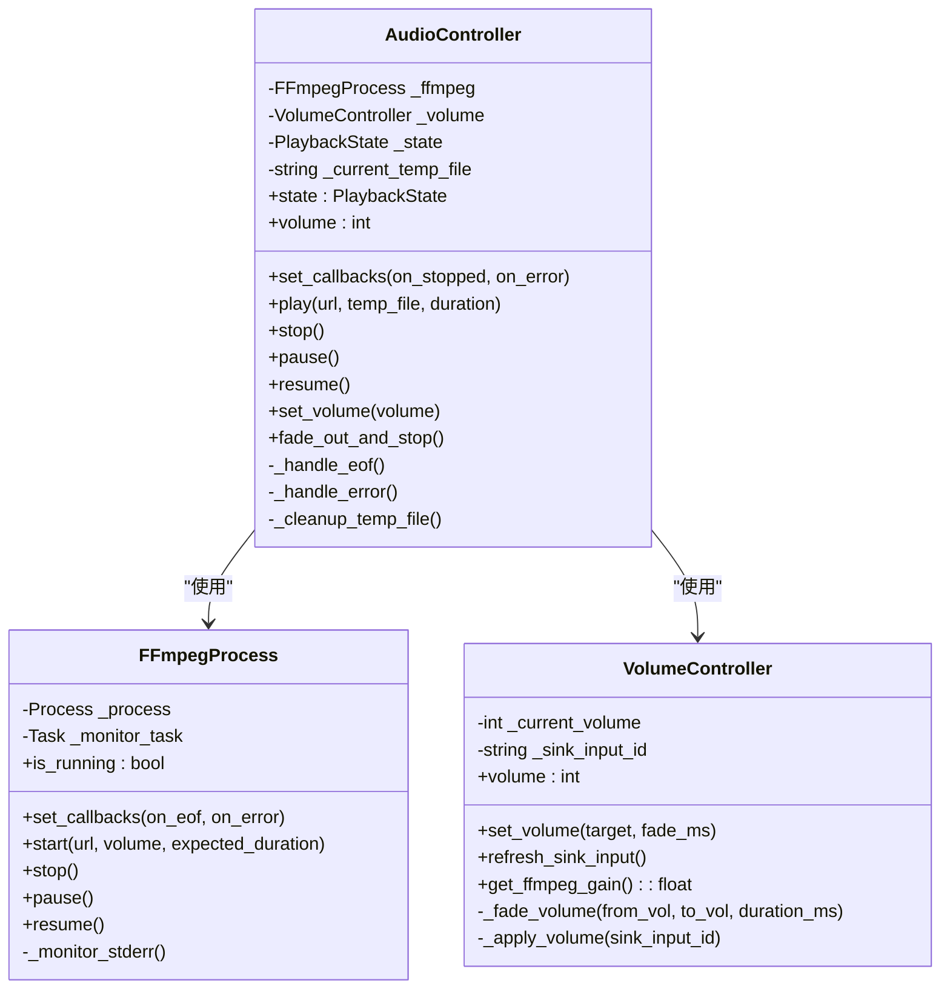

**图表来源**
- [controller.py:24-187](file://bot/core/audio/controller.py#L24-L187)
- [ffmpeg.py:16-352](file://bot/core/audio/ffmpeg.py#L16-L352)
- [volume.py:12-113](file://bot/core/audio/volume.py#L12-L113)

**章节来源**
- [controller.py:24-187](file://bot/core/audio/controller.py#L24-L187)
- [ffmpeg.py:16-352](file://bot/core/audio/ffmpeg.py#L16-L352)
- [volume.py:12-113](file://bot/core/audio/volume.py#L12-L113)

### FFmpeg 集成与音频处理流程
**更新**：增强的动态音频归一化滤镜链，配合音频处理禁用优化

- **参数设计**：重连参数、音量滤镜、动态音频归一化、PulseAudio 输出、采样率/声道配置
- **动态音频归一化增强**：
  - f=500：500ms分析窗口（平衡响应性和平滑性）
  - g=15：高斯平滑窗口（避免音量波动）
  - p=0.9：峰值目标90%（保守，避免削波）
  - 防止TS3语音激活阈值问题
  - **新增** 与音频处理禁用机制协同工作，进一步提升音质
- 子进程管理：异步创建、标准错误监控、异常退出处理
- 信号控制：SIGSTOP/SIGCONT 实现暂停/恢复
- 错误处理：区分 EOF、暂停信号与其他错误

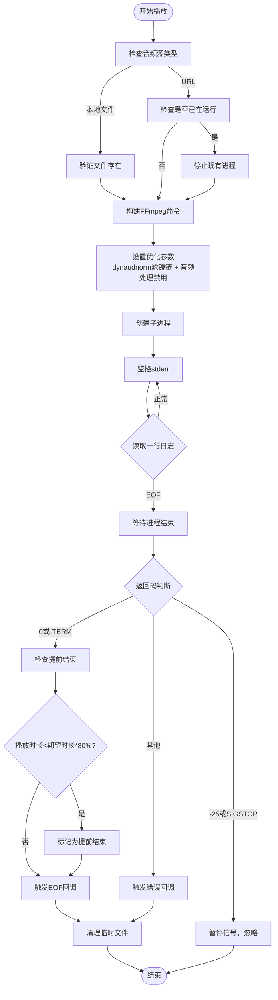

**图表来源**
- [ffmpeg.py:223-328](file://bot/core/audio/ffmpeg.py#L223-L328)

**章节来源**
- [ffmpeg.py:223-328](file://bot/core/audio/ffmpeg.py#L223-L328)

### 音量控制系统
**更新**：增强的双层音量控制策略，配合音频处理禁用优化

- **双层控制**：
  - 粗调：启动时通过 FFmpeg volume 滤镜设置初始增益
  - 精调：通过 pactl 对当前 sink input 实时调整，实现平滑淡入淡出
- 刷新机制：启动 FFmpeg 后短暂延时，再查找 sink input 并应用当前音量
- 淡入淡出：按时间步长逐步调整，避免突变
- **新增**：macOS支持仅FFmpeg音量控制
- **新增**：与音频处理禁用机制协同，提供更好的音质控制

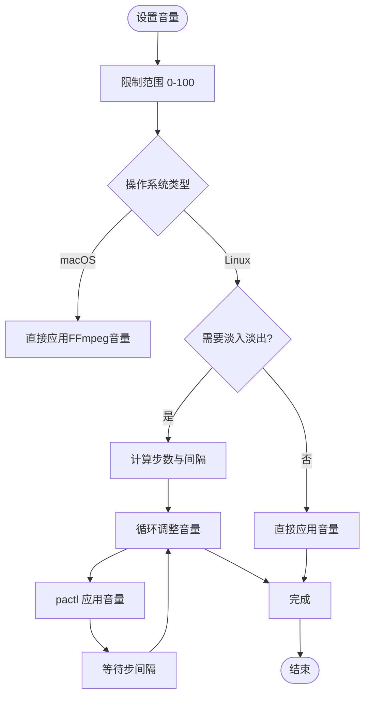

**图表来源**
- [volume.py:30-62](file://bot/core/audio/volume.py#L30-L62)
- [volume.py:77-104](file://bot/core/audio/volume.py#L77-L104)

**章节来源**
- [volume.py:30-113](file://bot/core/audio/volume.py#L30-L113)

### 音乐搜索与 URL 提取
**更新**：智能回退机制，YouTube和B站作为网易云音乐的替代源

- 支持平台：网易云音乐、YouTube、Bilibili、SoundCloud 等
- 抽取策略：
  - 优先直链，否则选择最佳音频格式
  - 从多级格式中挑选最高质量音频
  - **新增** 智能回退：当网易云下载失败时，自动尝试YouTube和B站
  - **新增** YouTube搜索：ytsearch1:歌曲名
  - **新增** B站搜索：bilisearch1:歌曲名
  - **新增** 时长验证：过滤时长过短的音频文件
  - **新增** Cookie文件支持：增强认证能力

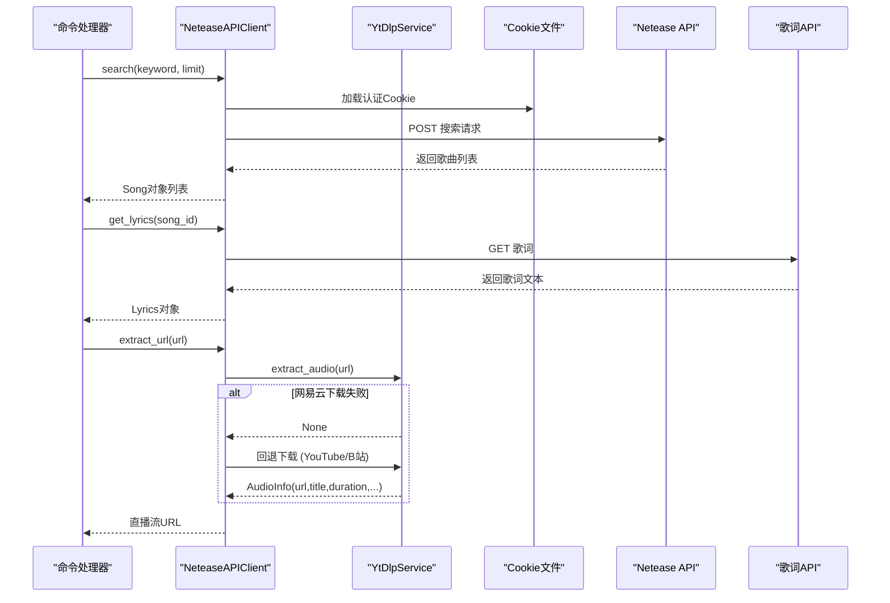

**图表来源**
- [client.py:40-190](file://bot/services/netease/client.py#L40-L190)
- [ytdlp.py:53-286](file://bot/services/netease/ytdlp.py#L53-L286)
- [models.py:9-121](file://bot/services/netease/models.py#L9-L121)

**章节来源**
- [client.py:40-190](file://bot/services/netease/client.py#L40-L190)
- [ytdlp.py:53-286](file://bot/services/netease/ytdlp.py#L53-L286)
- [models.py:9-121](file://bot/services/netease/models.py#L9-L121)

### 队列管理与智能调度
- 数据结构：列表存储队列，双端队列维护历史
- 重复模式：关闭/单曲/列表三态循环
- 跳过投票：根据频道用户数量计算阈值
- 格式化输出：聊天室友好的展示
- **新增** URL 队列支持：支持直接 URL 播放，无需网易云 ID
- **新增** 本地文件支持：支持直接播放本地音频文件

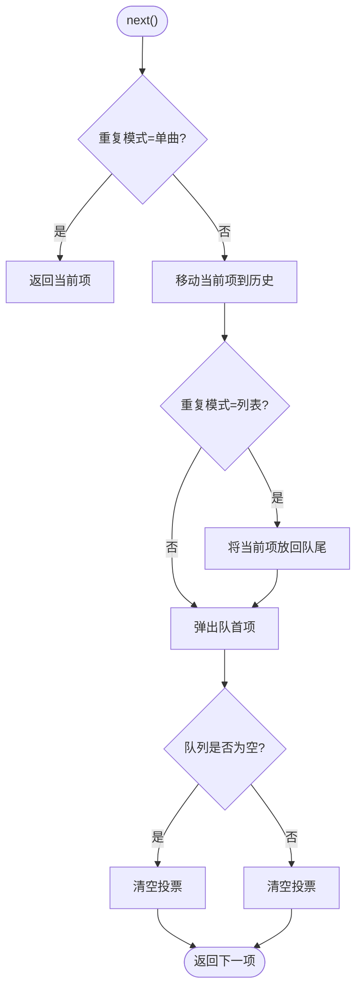

**图表来源**
- [manager.py:90-120](file://bot/services/queue/manager.py#L90-L120)

**章节来源**
- [manager.py:35-204](file://bot/services/queue/manager.py#L35-L204)

### 命令与生命周期管理
**更新**：支持中文命令别名的完整命令系统

- **命令覆盖**：播放、暂停、恢复、停止、队列、歌词、重复、移除等
- **中文别名**：所有命令都支持中文别名，如"播放"、"切歌"、"暂停"等
- 生命周期：
  - 播放：立即播放或加入队列
  - 自动播放：播放完成或错误后自动播放队列下一首
  - 优雅停机：淡出停止音频，断开连接
- **新增** URL 播放：支持直接播放外部平台链接
- **新增** 临时文件管理：自动清理下载的音频文件

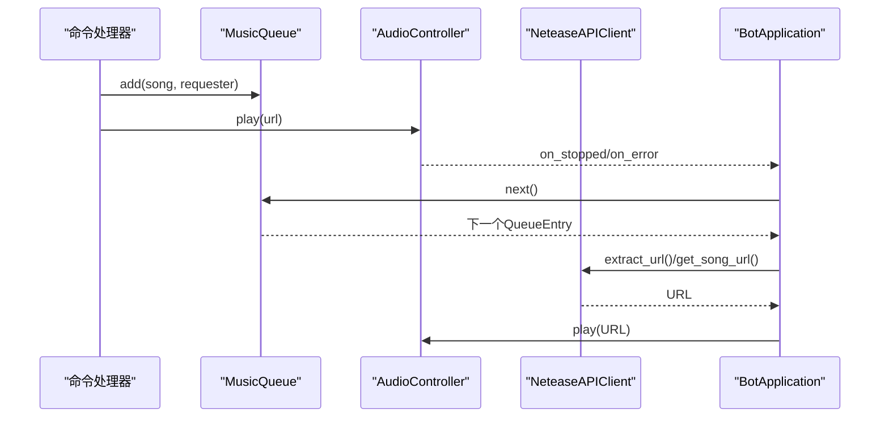

**图表来源**
- [music.py:20-93](file://bot/core/commands/handlers/music.py#L20-L93)
- [app.py:199-254](file://bot/app.py#L199-L254)

**章节来源**
- [music.py:20-245](file://bot/core/commands/handlers/music.py#L20-L245)
- [app.py:199-254](file://bot/app.py#L199-L254)

### yt-dlp 音频下载系统
**更新**：增强的回退机制和音频质量验证

- **核心功能**：
  - 音频 URL 抽取：从任意支持平台抽取可播放音频流
  - 本地音频下载：将在线音频下载到临时文件
  - 多平台支持：网易云音乐、YouTube、Bilibili、SoundCloud 等
  - 线程池异步：避免阻塞事件循环
  - **新增** 智能回退：YouTube和B站作为网易云的替代源
  - **新增** 音频质量验证：使用 ffprobe 验证音频文件完整性
  - **新增** Cookie文件支持：增强认证能力

- **回退下载策略**：
  - YouTube搜索：ytsearch1:歌曲名
  - B站搜索：bilisearch1:歌曲名
  - 时长验证：过滤时长小于30秒的音频
  - 成功后自动使用下载的音频文件

- **下载策略**：
  - 临时文件存储：默认使用系统临时目录
  - 文件命名：基于音频 ID 和扩展名
  - 扩展名处理：自动匹配下载后的实际文件扩展名
  - 平台识别：自动识别音频来源平台

- **质量控制机制**：
  - 文件完整性检查：验证文件大小和存在性
  - ffprobe 持续时间验证：获取实际音频时长
  - 时长对比：当实际时长大于期望时长的一半时才接受文件
  - 低质量文件过滤：截断或预览版本会被拒绝

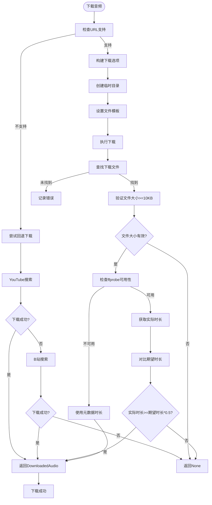

**图表来源**
- [ytdlp.py:82-197](file://bot/services/netease/ytdlp.py#L82-L197)
- [ytdlp.py:199-221](file://bot/services/netease/ytdlp.py#L199-L221)
- [music.py:212-240](file://bot/core/commands/handlers/music.py#L212-L240)

**章节来源**
- [ytdlp.py:31-286](file://bot/services/netease/ytdlp.py#L31-L286)
- [music.py:212-240](file://bot/core/commands/handlers/music.py#L212-L240)

### 智能回退机制详解
**新增**：YouTube和B站回退下载机制

- **回退策略**：
  - YouTube搜索：ytsearch1:歌曲名
  - B站搜索：bilisearch1:歌曲名
  - 时长验证：过滤时长小于30秒的音频
  - 成功后自动使用下载的音频文件

- **搜索参数**：
  - ytsearch1：YouTube单结果搜索
  - bilisearch1：B站单结果搜索
  - 查询格式：歌曲名 + 艺术家名

- **错误处理**：
  - 单个平台失败不影响整体流程
  - 自动尝试下一个平台
  - 所有平台失败时返回None

**章节来源**
- [music.py:212-240](file://bot/core/commands/handlers/music.py#L212-L240)

## 依赖关系分析
- 外部依赖：yt-dlp、httpx、pydantic、pydantic-settings、uvicorn、fastapi、apscheduler、**新增** cryptography>=41.0
- 内部模块耦合：
  - BotApplication 依赖所有核心模块
  - 命令处理器依赖应用实例以访问音频、队列、网易云服务
  - 音频控制器依赖 FFmpeg 进程与音量控制器
  - 网易云客户端依赖 yt-dlp 与 TTLCache
  - **新增** TS3客户端音频处理禁用机制
  - **新增** Docker容器初始化和音频配置
  - 命令注册器支持中英文命令别名
  - **新增** 队列管理支持 URL 播放
  - **新增** FFmpeg 进程支持动态音频归一化
  - **新增** PulseAudio双声道架构配置

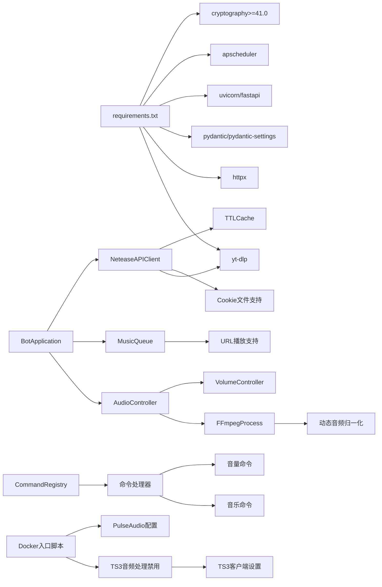

**图表来源**
- [requirements.txt:1-12](file://requirements.txt#L1-L12)
- [app.py:27-111](file://bot/app.py#L27-L111)
- [client.py:25-36](file://bot/services/netease/client.py#L25-L36)
- [entrypoint.sh:56-67](file://docker/entrypoint.sh#L56-L67)

**章节来源**
- [requirements.txt:1-12](file://requirements.txt#L1-L12)
- [app.py:27-111](file://bot/app.py#L27-L111)

## 性能考虑
- URL 抽取延迟：yt-dlp 在线抽取会带来额外延迟，建议在命令处理前预取或缓存搜索结果
- CDN 链接时效：网易云 CDN 链接通常短期有效，播放前重新抽取可避免失效
- **新增** 中文命令别名性能：命令别名解析使用哈希映射，查找复杂度O(1)
- **新增** 智能回退机制：YouTube和B站搜索可能增加额外延迟，建议合理设置超时
- **新增** 音频处理禁用开销：禁用TS3客户端音频处理功能会增加少量CPU开销，但显著提升音质
- **新增** 动态音频归一化开销：dynaudnorm滤镜链会增加CPU使用，但显著提升音质一致性
- **新增** 音频质量验证开销：ffprobe验证会增加系统调用开销，但提升音频质量控制
- **新增** Cookie文件处理开销：Cookie文件读取和解析会增加启动时间，但提升认证成功率
- **优化** FFmpeg 参数：HTTP 流启用重连，本地文件启用实时读取，提升播放稳定性
- 音量控制平滑：pactl 调用频率过高可能造成抖动，建议合理设置步长与间隔
- 队列操作复杂度：队列使用列表，插入/删除为 O(n)，建议在高并发场景评估替换为更高效的数据结构
- 日志与网络：搜索与歌词接口需设置超时，避免阻塞事件循环

## 故障排除指南
常见问题与定位方法：
- FFmpeg 无法启动
  - 检查路径与权限，确认 PulseAudio 设备存在
  - 查看 FFmpeg 标准错误输出
  - **新增** 检查dynaudnorm滤镜链是否正确加载
- 音频无声
  - 确认 PulseAudio sink 输入 ID 已刷新
  - 检查 pactl 是否可用
  - **新增** 检查macOS环境下仅FFmpeg音量控制
  - **新增** 检查TS3客户端音频处理是否正确禁用
- 链接解析失败
  - 网易云 VIP/地区限制导致链接不可用
  - 重新抽取链接或更换平台
  - **新增** 检查yt-dlp是否正确安装和配置
  - **新增** 验证YouTube和B站搜索是否可用
  - **新增** 检查Cookie文件配置是否正确
- 队列卡住
  - 检查重复模式与跳过投票逻辑
  - 清空队列后重试
- **新增** 中文命令无法识别
  - 检查命令注册器别名映射
  - 确认命令格式正确（!命令或中文命令）
- **新增** 音频下载失败
  - 检查网络连接和yt-dlp配置
  - 验证临时目录写入权限
  - 查看下载日志获取详细错误信息
  - **新增** 检查ffprobe是否可用，验证音频文件完整性
  - **新增** 验证Cookie文件格式是否为Netscape格式
- **新增** 音频处理禁用问题
  - 检查Docker容器是否正确执行入口脚本
  - 验证SQLite数据库中音频设置是否正确
  - 确认PulseAudio双声道架构配置生效
  - 检查TS3客户端音频处理功能是否被禁用
- **新增** 音频质量不佳
  - 检查是否正确禁用了TS3客户端音频处理功能
  - 验证PulseAudio配置是否正确
  - 确认FFmpeg滤镜链参数设置
  - 检查音频处理禁用机制是否正常工作
- **新增** 动态音频归一化问题
  - 检查FFmpeg版本是否支持dynaudnorm滤镜
  - 验证滤镜参数设置是否正确
  - 确认音频质量是否得到改善
- **新增** 音量控制不稳定
  - 检查pactl是否可用
  - 验证音量淡入淡出参数设置
  - 确认macOS环境下仅FFmpeg音量控制
- **新增** Cookie文件相关问题
  - 检查Cookie文件路径是否正确
  - 验证Cookie文件格式是否为Netscape格式
  - 确认Cookie文件权限设置
  - 验证Cookie文件是否包含所需平台的认证信息

**章节来源**
- [ffmpeg.py:324-352](file://bot/core/audio/ffmpeg.py#L324-L352)
- [volume.py:77-109](file://bot/core/audio/volume.py#L77-L109)
- [client.py:77-91](file://bot/services/netease/client.py#L77-L91)
- [music.py:203-245](file://bot/core/commands/handlers/music.py#L203-L245)
- [registry.py:68-78](file://bot/core/commands/registry.py#L68-L78)
- [entrypoint.sh:56-67](file://docker/entrypoint.sh#L56-L67)

## 结论
本系统通过清晰的模块划分与异步架构实现了稳定可靠的音乐播放能力。**新增的TS3客户端音频处理禁用机制**是本次更新的核心亮点，通过自动禁用回声消除、噪声抑制、自动增益控制等语音通信专用功能，显著改善了音乐播放质量，减少了音频压缩、失真和动态范围压缩等问题。FFmpeg 与 PulseAudio 的结合提供了跨平台的音频输出，yt-dlp 的多平台支持扩展了音源范围，队列与命令系统增强了用户体验。**新增的音频质量改进功能**确保了音乐播放的保真度和动态范围，特别适合长时间音乐播放场景。建议在生产环境中关注命令别名解析性能、智能回退机制的延迟、音频处理禁用机制的稳定性、动态音频归一化的CPU开销、音量控制平滑性以及Cookie文件的安全管理，并完善错误恢复与监控告警。

## 附录

### 配置说明
- TS3 连接参数：主机、查询端口、虚拟服务器 ID、用户名、密码
- 音频管道：PulseAudio sink 名称、默认音量、淡入时长、FFmpeg 路径
- 网易云：搜索上限、音频质量、**新增** Cookie文件路径
- 日志：级别、文件路径、轮转大小与备份数
- **新增** 命令别名配置：支持中英文命令别名
- **新增** 回退机制配置：YouTube和B站搜索参数
- **新增** 动态音频归一化配置：滤镜参数设置
- **新增** Cookie文件配置：支持多种配置方式
- **新增** 音频处理禁用配置：TS3客户端音频处理自动禁用

**章节来源**
- [config.yaml:1-76](file://config/config.yaml#L1-L76)
- [config.py:36-134](file://bot/config.py#L36-L134)

### TS3客户端音频处理禁用配置详解
**新增**：完整的TS3客户端音频处理禁用配置和使用指南

- **禁用的功能**：
  - `capture/echo_cancel`: 回声消除（移除麦克风输入的回声）
  - `capture/echo_cancel_aggressive`: 激进回声消除
  - `capture/echo_suppression`: 回声抑制（可能截断音乐信号）
  - `capture/noise_suppression`: 噪声抑制（移除音乐频率）
  - `capture/automatic_gain_control`: 自动增益控制（压缩动态范围）

- **配置方式**：
  - Docker入口脚本自动配置：`docker/entrypoint.sh`
  - TS3客户端设置文件：`docker/ts3client/init_identity.py`
  - SQLite数据库持久化存储

- **技术原理**：
  - 这些功能专为语音通信设计，在处理音乐信号时会压缩音频动态、引入伪影并破坏音乐细节
  - 通过禁用这些功能，音乐播放质量得到显著提升
  - 音频处理禁用后，音乐的动态范围、高频细节和整体保真度得到改善

- **使用步骤**：
  1. 确保Docker容器正确启动
  2. 检查入口脚本是否执行音频处理禁用
  3. 验证SQLite数据库中的设置
  4. 确认PulseAudio配置正确
  5. 测试音乐播放质量

- **注意事项**：
  - 配置会在容器启动时自动应用
  - 设置持久化存储在SQLite数据库中
  - 音频处理禁用后，音乐播放质量显著提升
  - 如需恢复默认设置，可删除或修改配置文件

**章节来源**
- [entrypoint.sh:56-67](file://docker/entrypoint.sh#L56-L67)
- [init_identity.py:195-214](file://docker/ts3client/init_identity.py#L195-L214)
- [README.md:140-190](file://README.md#L140-L190)

### 命令别名配置详解
**新增**：完整的中文命令别名配置

- **播放相关**：
  - 主命令：!play
  - 英文别名：!p
  - 中文别名："播放", "点歌"

- **控制相关**：
  - 主命令：!pause
  - 中文别名："暂停"
  - 主命令：!resume
  - 中文别名："继续"
  - 主命令：!stop
  - 中文别名："停止"

- **队列相关**：
  - 主命令：!queue
  - 英文别名：!q
  - 中文别名："队列"
  - 主命令：!np
  - 中文别名："正在播放", "当前"

- **信息相关**：
  - 主命令：!lyrics
  - 英文别名：!lrc
  - 中文别名："歌词"

- **管理相关**：
  - 主命令：!clear
  - 中文别名："清空"
  - 主命令：!shuffle
  - 中文别名："随机"
  - 主命令：!repeat
  - 英文别名：!r
  - 中文别名："重复", "循环"
  - 主命令：!remove
  - 英文别名：!rm
  - 中文别名："移除", "删除"

- **音量控制**：
  - 主命令：!volume
  - 英文别名：!vol, !v
  - 中文别名："音量"

**章节来源**
- [music.py:17-243](file://bot/core/commands/handlers/music.py#L17-L243)
- [volume.py:17-50](file://bot/core/commands/handlers/volume.py#L17-L50)
- [registry.py:28-94](file://bot/core/commands/registry.py#L28-L94)

### 智能回退机制详解
**新增**：YouTube和B站回退下载机制

- **回退策略**：
  - YouTube搜索：ytsearch1:歌曲名
  - B站搜索：bilisearch1:歌曲名
  - 时长验证：过滤时长小于30秒的音频
  - 成功后自动使用下载的音频文件

- **搜索参数**：
  - ytsearch1：YouTube单结果搜索
  - bilisearch1：B站单结果搜索
  - 查询格式：歌曲名 + 艺术家名

- **错误处理**：
  - 单个平台失败不影响整体流程
  - 自动尝试下一个平台
  - 所有平台失败时返回None

**章节来源**
- [music.py:212-240](file://bot/core/commands/handlers/music.py#L212-L240)

### 动态音频归一化配置
**新增**：dynaudnorm滤镜链配置详解

- **滤镜参数**：
  - f=500：500ms分析窗口（平衡响应性和平滑性）
  - g=15：高斯平滑窗口（避免音量波动）
  - p=0.9：峰值目标90%（保守，避免削波）

- **作用机制**：
  - 动态分析音频响度
  - 自适应调整音量水平
  - 防止TS3语音激活阈值问题
  - 提升音频质量一致性

- **性能影响**：
  - 增加CPU使用率
  - 提升音质和用户体验
  - 适合长时间播放场景

**章节来源**
- [ffmpeg.py:147-155](file://bot/core/audio/ffmpeg.py#L147-L155)

### PulseAudio双声道架构配置
**新增**：完整的PulseAudio双声道架构配置

- **架构设计**：
  - `ts3bot_music`：音乐输出（FFmpeg输出到这里，TS3从其监视器捕获）
  - `ts3bot_playback`：其他用户音频播放（TS3播放其他用户音频，不被回传）

- **配置文件**：
  - `docker/pulseaudio/default.pa`：PulseAudio模块配置
  - 防回声机制：其他用户的语音不会被回传到音乐输出

- **技术优势**：
  - 防止其他用户语音回声到音乐输出
  - 提供独立的音频处理路径
  - 改善整体音频质量

**章节来源**
- [default.pa:1-30](file://docker/pulseaudio/default.pa#L1-L30)
- [init_identity.py:177-214](file://docker/ts3client/init_identity.py#L177-L214)