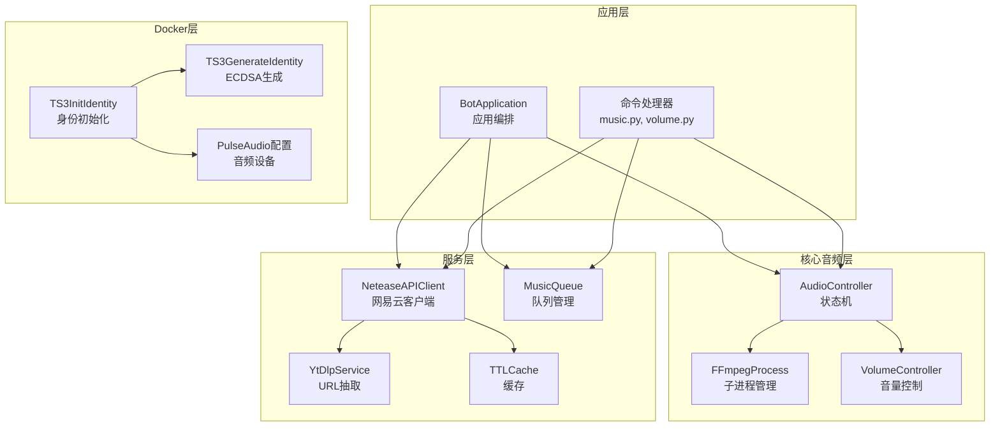
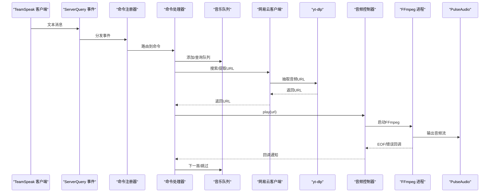
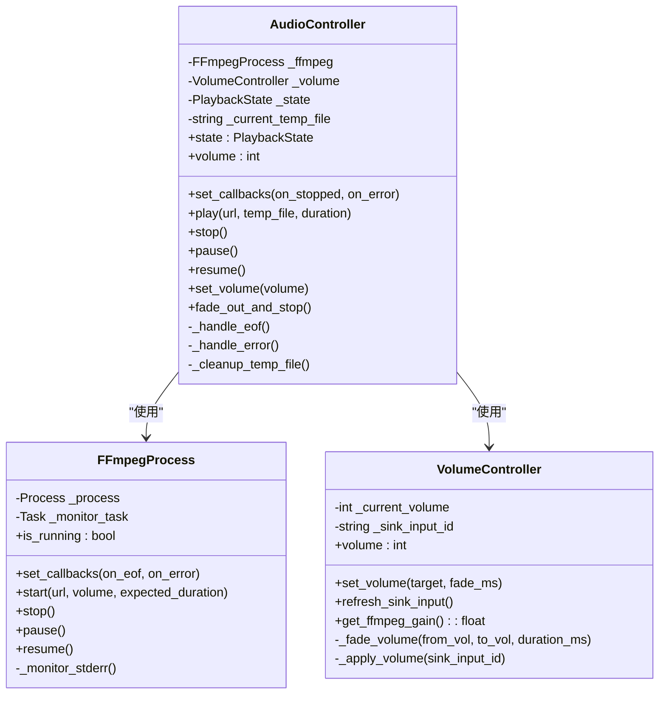
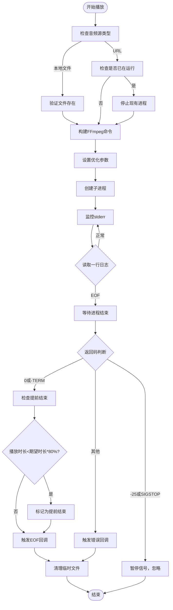
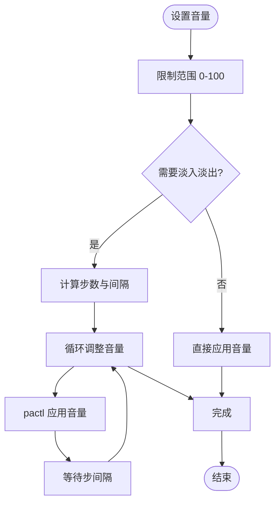
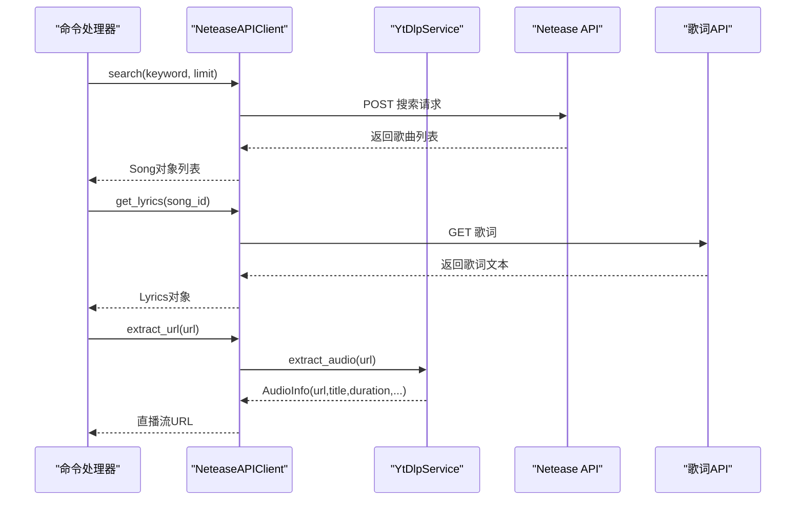
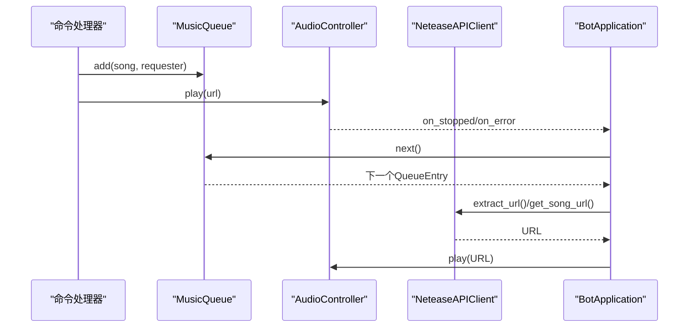
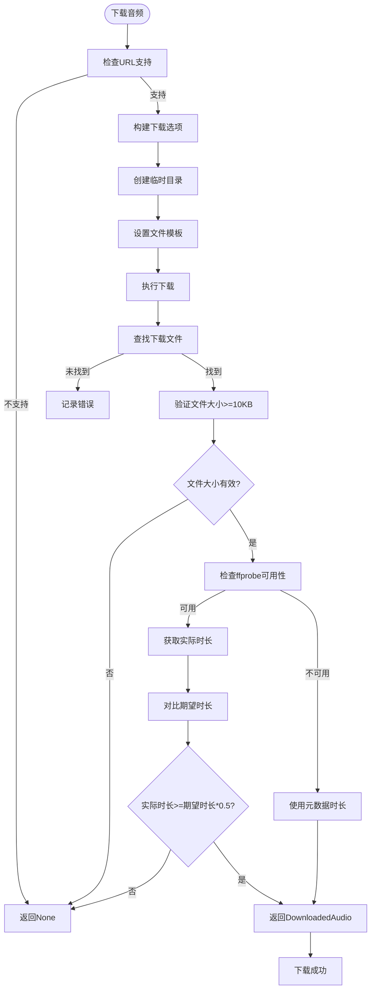
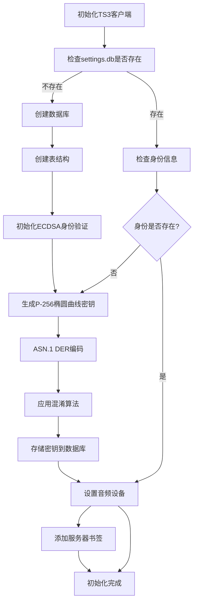
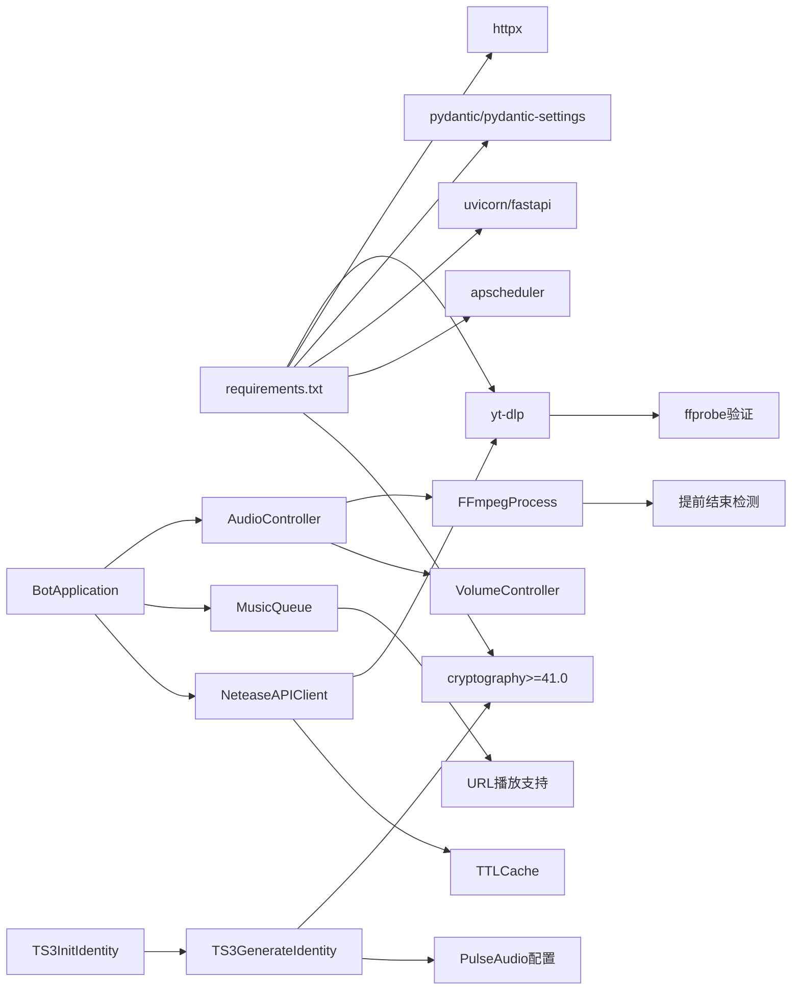

# 音乐播放系统

<cite>
**本文档引用的文件**
- [app.py](file://bot/app.py)
- [controller.py](file://bot/core/audio/controller.py)
- [ffmpeg.py](file://bot/core/audio/ffmpeg.py)
- [volume.py](file://bot/core/audio/volume.py)
- [music.py](file://bot/core/commands/handlers/music.py)
- [volume.py](file://bot/core/commands/handlers/volume.py)
- [manager.py](file://bot/services/queue/manager.py)
- [ytdlp.py](file://bot/services/netease/ytdlp.py)
- [client.py](file://bot/services/netease/client.py)
- [models.py](file://bot/services/netease/models.py)
- [cache.py](file://bot/services/netease/cache.py)
- [config.py](file://bot/config.py)
- [config.yaml](file://config/config.yaml)
- [requirements.txt](file://requirements.txt)
- [init_identity.py](file://docker/ts3client/init_identity.py)
- [generate_identity.py](file://docker/ts3client/generate_identity.py)
</cite>

## 更新摘要
**变更内容**
- 新增完整的 yt-dlp 音频下载系统，替代原有的 CDN URL 直播流方式
- 增强多平台音源支持，包括 YouTube、Bilibili、SoundCloud 等
- 实现音频本地临时文件下载，避免 CDN URL 过期问题
- 更新音频播放生命周期管理，增加临时文件清理机制
- 优化 URL 抽取策略，支持更多平台和更好的可靠性
- **新增** ffprobe 持续时间验证功能，增强音频质量控制能力
- **新增** 本地音频文件播放支持
- **新增** 音频文件完整性验证和质量控制机制
- **更新** TS3 客户端身份验证初始化系统：从 RSA 密钥改为 ECDSA P-256 椭圆曲线身份，实现完全自动化的身份生成，包括 Python 脚本实现的 DER 编码、ASN.1 序列和混淆算法
- **优化** FFmpeg 集成参数，提升播放稳定性
- **增强** 音频质量验证系统，防止处理不完整或低质量音频文件

## 目录
1. [简介](#简介)
2. [项目结构](#项目结构)
3. [核心组件](#核心组件)
4. [架构总览](#架构总览)
5. [详细组件分析](#详细组件分析)
6. [依赖关系分析](#依赖关系分析)
7. [性能考虑](#性能考虑)
8. [故障排除指南](#故障排除指南)
9. [结论](#结论)
10. [附录](#附录)

## 简介
本音乐播放系统基于 Python 异步框架构建，集成 FFmpeg 实现多平台音源播放，并通过 PulseAudio 输出到 TeamSpeak 语音通道。系统支持：
- 多平台音源：网易云音乐、YouTube、Bilibili、SoundCloud 等
- 智能队列管理：FIFO、重复模式、跳过投票、历史记录
- 音量控制：粗细两级控制（FFmpeg 滤镜 + pactl 实时调整）
- URL 提取与缓存：yt-dlp 抽取可播放流，搜索结果与歌词缓存
- 完整生命周期：播放、暂停、恢复、停止、淡出停止、错误处理
- **新增**：本地音频下载系统，避免 CDN URL 过期问题
- **新增**：持续时间跟踪和提前退出检测，提升播放稳定性
- **新增**：ffprobe 音频质量验证，防止处理不完整或低质量音频文件
- **更新**：TS3 客户端身份验证初始化系统，从 RSA 密钥改为 ECDSA P-256 椭圆曲线身份，实现完全自动化的身份生成，包括 DER 编码、ASN.1 序列和混淆算法
- **优化**：FFmpeg 集成参数，提升播放质量和稳定性

## 项目结构
系统采用分层模块化组织：
- 应用层：应用编排、事件路由、命令注册
- 核心音频层：音频控制器、FFmpeg 子进程管理、音量控制
- 服务层：网易云客户端、yt-dlp 抽取器、队列管理、缓存
- 命令层：TS3 文本消息解析与命令处理器
- 配置层：YAML 配置加载与环境变量插值
- Docker 层：TS3 客户端初始化与音频设备配置

**图表来源**
- [app.py:27-111](file://bot/app.py#L27-L111)
- [controller.py:24-58](file://bot/core/audio/controller.py#L24-L58)
- [ffmpeg.py:16-44](file://bot/core/audio/ffmpeg.py#L16-L44)
- [volume.py:12-29](file://bot/core/audio/volume.py#L12-L29)
- [music.py:17-243](file://bot/core/commands/handlers/music.py#L17-L243)
- [client.py:25-36](file://bot/services/netease/client.py#L25-L36)
- [ytdlp.py:31-52](file://bot/services/netease/ytdlp.py#L31-L52)
- [manager.py:35-71](file://bot/services/queue/manager.py#L35-L71)
- [cache.py:9-46](file://bot/services/netease/cache.py#L9-L46)
- [init_identity.py:74-163](file://docker/ts3client/init_identity.py#L74-L163)
- [generate_identity.py:1-269](file://docker/ts3client/generate_identity.py#L1-269)

**章节来源**
- [app.py:27-111](file://bot/app.py#L27-L111)
- [config.py:125-160](file://bot/config.py#L125-L160)
- [config.yaml:1-76](file://config/config.yaml#L1-L76)

## 核心组件
- 音频控制器：封装 FFmpeg 生命周期、状态机、回调事件、音量控制、**新增** 临时文件清理
- FFmpeg 进程：异步子进程管理、标准错误监控、暂停/恢复信号、**新增** 持续时间跟踪
- 音量控制器：双层控制策略（FFmpeg 滤镜 + pactl），平滑淡入淡出
- 队列管理：FIFO、重复模式、跳过投票、历史记录、格式化输出
- URL 抽取：yt-dlp 抽取最佳音频流，支持多平台，**新增** 本地音频下载
- 网易云客户端：搜索、歌词、URL 抽取，带 TTL 缓存，**更新** 使用 yt-dlp 替代旧 API
- 应用编排：命令注册、事件路由、自动播放、优雅停机
- **更新** TS3 客户端初始化：自动创建 ECDSA P-256 身份验证、配置音频设备、设置连接参数
- **新增** 音频质量验证：ffprobe 持续时间验证、文件完整性检查

**章节来源**
- [controller.py:24-187](file://bot/core/audio/controller.py#L24-L187)
- [ffmpeg.py:16-352](file://bot/core/audio/ffmpeg.py#L16-L352)
- [volume.py:12-113](file://bot/core/audio/volume.py#L12-L113)
- [manager.py:35-204](file://bot/services/queue/manager.py#L35-L204)
- [ytdlp.py:31-286](file://bot/services/netease/ytdlp.py#L31-L286)
- [client.py:25-190](file://bot/services/netease/client.py#L25-L190)
- [app.py:27-348](file://bot/app.py#L27-L348)
- [init_identity.py:14-172](file://docker/ts3client/init_identity.py#L14-L172)
- [generate_identity.py:1-269](file://docker/ts3client/generate_identity.py#L1-269)

## 架构总览
系统以 BotApplication 为中心，将音频控制器、队列管理、网易云客户端等模块组合。命令处理器接收 TS3 文本消息，解析后调用相应服务；音频控制器负责与 FFmpeg/PulseAudio 交互；yt-dlp 负责多平台 URL 抽取和本地音频下载；队列管理负责播放顺序与用户交互。Docker 层负责 TS3 客户端的身份验证和音频设备配置，其中 ECDSA P-256 身份生成通过专用的 Python 脚本实现。

**图表来源**
- [app.py:162-254](file://bot/app.py#L162-L254)
- [music.py:20-93](file://bot/core/commands/handlers/music.py#L20-L93)
- [client.py:40-96](file://bot/services/netease/client.py#L40-L96)
- [ytdlp.py:53-122](file://bot/services/netease/ytdlp.py#L53-L122)
- [controller.py:70-88](file://bot/core/audio/controller.py#L70-L88)
- [ffmpeg.py:54-93](file://bot/core/audio/ffmpeg.py#L54-L93)

## 详细组件分析

### 音频控制器（AudioController）
职责：
- 维护播放状态（空闲/播放中/暂停）
- 管理 FFmpeg 进程生命周期
- 音量控制与淡入淡出
- 播放完成与错误回调
- **新增** 临时文件清理机制

关键流程：
- 播放：停止当前播放，设置回调，启动 FFmpeg，刷新音量输入
- 暂停/恢复：向 FFmpeg 发送 SIGSTOP/SIGCONT
- 停止：终止 FFmpeg 进程
- 淡出停止：音量渐降至 0 后停止
- **新增** 临时文件清理：播放完成后自动删除临时音频文件

**图表来源**
- [controller.py:24-187](file://bot/core/audio/controller.py#L24-L187)
- [ffmpeg.py:16-352](file://bot/core/audio/ffmpeg.py#L16-L352)
- [volume.py:12-113](file://bot/core/audio/volume.py#L12-L113)

**章节来源**
- [controller.py:24-187](file://bot/core/audio/controller.py#L24-L187)
- [ffmpeg.py:16-352](file://bot/core/audio/ffmpeg.py#L16-L352)
- [volume.py:12-113](file://bot/core/audio/volume.py#L12-L113)

### FFmpeg 集成与音频处理流程
- 参数设计：重连参数、音量滤镜、PulseAudio 输出、采样率/声道配置
- 子进程管理：异步创建、标准错误监控、异常退出处理
- 信号控制：SIGSTOP/SIGCONT 实现暂停/恢复
- 错误处理：区分 EOF、暂停信号与其他错误
- **新增** 本地文件支持：支持本地音频文件播放，自动检测文件类型
- **新增** 持续时间跟踪：实时监控播放进度，检测提前退出
- **新增** 预期时长检测：基于期望时长判断播放是否提前结束
- **新增** 播放提前结束检测：当播放时长小于期望时长的 80% 时标记为提前结束
- **优化** 参数设置：HTTP 流启用重连，本地文件启用实时读取模式

**图表来源**
- [ffmpeg.py:223-328](file://bot/core/audio/ffmpeg.py#L223-L328)

**章节来源**
- [ffmpeg.py:223-328](file://bot/core/audio/ffmpeg.py#L223-L328)

### 音量控制系统
- 双层控制：
  - 粗调：启动时通过 FFmpeg volume 滤镜设置初始增益
  - 精调：通过 pactl 对当前 sink input 实时调整，实现平滑淡入淡出
- 刷新机制：启动 FFmpeg 后短暂延时，再查找 sink input 并应用当前音量
- 淡入淡出：按时间步长逐步调整，避免突变

**图表来源**
- [volume.py:30-62](file://bot/core/audio/volume.py#L30-L62)
- [volume.py:77-104](file://bot/core/audio/volume.py#L77-L104)

**章节来源**
- [volume.py:30-113](file://bot/core/audio/volume.py#L30-L113)

### 音乐搜索与 URL 提取
- 支持平台：网易云音乐、YouTube、Bilibili、SoundCloud 等
- 抽取策略：
  - 优先直链，否则选择最佳音频格式
  - 从多级格式中挑选最高质量音频
  - **新增** 本地音频下载：将在线音频下载到临时文件，避免 CDN URL 过期
  - **新增** 音频质量验证：使用 ffprobe 验证音频文件完整性
- 搜索与歌词：
  - 使用 Netease Web API 搜索
  - 歌词解析 LRC 格式，支持原文与翻译

**图表来源**
- [client.py:40-190](file://bot/services/netease/client.py#L40-L190)
- [ytdlp.py:53-286](file://bot/services/netease/ytdlp.py#L53-L286)
- [models.py:9-121](file://bot/services/netease/models.py#L9-L121)

**章节来源**
- [client.py:40-190](file://bot/services/netease/client.py#L40-L190)
- [ytdlp.py:53-286](file://bot/services/netease/ytdlp.py#L53-L286)
- [models.py:9-121](file://bot/services/netease/models.py#L9-L121)

### 队列管理与智能调度
- 数据结构：列表存储队列，双端队列维护历史
- 重复模式：关闭/单曲/列表三态循环
- 跳过投票：根据频道用户数量计算阈值
- 格式化输出：聊天室友好的展示
- **新增** URL 队列支持：支持直接 URL 播放，无需网易云 ID
- **新增** 本地文件支持：支持直接播放本地音频文件

**图表来源**
- [manager.py:90-120](file://bot/services/queue/manager.py#L90-L120)

**章节来源**
- [manager.py:35-204](file://bot/services/queue/manager.py#L35-L204)

### 命令与生命周期管理
- 命令覆盖：播放、暂停、恢复、停止、队列、歌词、重复、移除等
- 生命周期：
  - 播放：立即播放或加入队列
  - 自动播放：播放完成或错误后自动播放队列下一首
  - 优雅停机：淡出停止音频，断开连接
- **新增** URL 播放：支持直接播放外部平台链接
- **新增** 临时文件管理：自动清理下载的音频文件
- **新增** 持续时间跟踪：基于期望时长检测播放进度
- **新增** 音频质量验证：播放前验证音频文件完整性

**图表来源**
- [music.py:20-93](file://bot/core/commands/handlers/music.py#L20-L93)
- [app.py:199-254](file://bot/app.py#L199-L254)

**章节来源**
- [music.py:20-245](file://bot/core/commands/handlers/music.py#L20-L245)
- [app.py:199-254](file://bot/app.py#L199-L254)

### yt-dlp 音频下载系统
**新增**：yt-dlp 音频下载系统，替代原有的 CDN URL 直播流方式

- **核心功能**：
  - 音频 URL 抽取：从任意支持平台抽取可播放音频流
  - 本地音频下载：将在线音频下载到临时文件
  - 多平台支持：网易云音乐、YouTube、Bilibili、SoundCloud 等
  - 线程池异步：避免阻塞事件循环
  - **新增** 音频质量验证：使用 ffprobe 验证音频文件完整性

- **下载策略**：
  - 临时文件存储：默认使用系统临时目录
  - 文件命名：基于音频 ID 和扩展名
  - 扩展名处理：自动匹配下载后的实际文件扩展名
  - 平台识别：自动识别音频来源平台
  - **新增** 文件大小验证：确保下载文件至少 10KB，防止损坏文件
  - **新增** ffprobe 持续时间验证：对比元数据时长与实际时长，检测截断或预览版本

- **配置选项**：
  - 最佳音频格式：优先选择高质量音频
  - 跳过下载：仅提取信息而不实际下载
  - 重试机制：网络错误时自动重试
  - 超时控制：socket 超时 15 秒

- **质量控制机制**：
  - 文件完整性检查：验证文件大小和存在性
  - ffprobe 持续时间验证：获取实际音频时长
  - 时长对比：当实际时长大于期望时长的一半时才接受文件
  - 低质量文件过滤：截断或预览版本会被拒绝

**图表来源**
- [ytdlp.py:82-197](file://bot/services/netease/ytdlp.py#L82-L197)
- [ytdlp.py:199-221](file://bot/services/netease/ytdlp.py#L199-L221)

**章节来源**
- [ytdlp.py:31-286](file://bot/services/netease/ytdlp.py#L31-L286)

### TS3 客户端初始化系统
**更新**：TS3 客户端身份验证和音频设备初始化系统，从 RSA 密钥改为 ECDSA P-256 椭圆曲线身份

- **ECDSA P-256 身份生成**：
  - 自动创建 SQLite settings.db 数据库
  - 生成 ECDSA P-256 椭圆曲线密钥对用于服务器认证
  - 实现完整的 DER 编码、ASN.1 序列和混淆算法
  - 存储身份信息到 identities 表
  - 支持 Python 脚本实现的复杂加密算法

- **椭圆曲线加密实现**：
  - 使用 cryptography 库的 ECDSA P-256 曲线
  - 实现 ASN.1 DER 编码格式
  - 包含 DER INTEGER、BIT STRING 和 SEQUENCE 编码
  - 实现安全级别的计算和偏移量确定
  - 应用复杂的混淆算法确保兼容性

- **音频设备配置**：
  - 设置 PulseAudio null sink 作为音频输入输出
  - 配置捕获模式为自定义设备
  - 设置播放设备为 ts3bot_sink
  - 禁用语音激活功能

- **连接参数设置**：
  - 自动重连：启用连接自动重连
  - 启动时自动捕获：确保 TS3 客户端传输音频
  - 设置默认昵称和服务器地址
  - 支持环境变量配置

- **数据库结构**：
  - settings 表：存储各种配置参数
  - bookmarks 表：保存服务器连接信息
  - identities 表：存储 ECDSA 身份验证密钥

**图表来源**
- [init_identity.py:74-163](file://docker/ts3client/init_identity.py#L74-L163)
- [generate_identity.py:27-96](file://docker/ts3client/generate_identity.py#L27-L96)
- [generate_identity.py:159-194](file://docker/ts3client/generate_identity.py#L159-L194)

**章节来源**
- [init_identity.py:1-172](file://docker/ts3client/init_identity.py#L1-L172)
- [generate_identity.py:1-269](file://docker/ts3client/generate_identity.py#L1-L269)

### ECDSA P-256 身份生成详解
**新增**：完整的 ECDSA P-256 椭圆曲线身份生成系统

- **椭圆曲线密钥对生成**：
  - 使用 cryptography.hazmat.primitives.asymmetric.ec.SECP256R1()
  - 生成公钥和私钥对
  - 提取公钥坐标 (pub_x, pub_y) 和私钥值
  - 支持安全的随机数生成

- **ASN.1 DER 编码实现**：
  - 实现 DER INTEGER 编码（int_to_der_integer）
  - 实现 DER BIT STRING 编码（_der_bitstring）
  - 实现 DER SEQUENCE 编码（_der_sequence）
  - 构建完整的身份 ASN.1 结构
  - 支持长度编码和字节序处理

- **安全级别计算**：
  - 通过 SHA1 哈希计算安全级别
  - 统计前导零位数
  - 确定偏移量以达到目标安全级别
  - 支持暴力破解寻找合适偏移量

- **混淆算法实现**：
  - Base64 编码 DER 字节串
  - XOR 操作与固定密钥（OBFUSCATION_KEY）
  - SHA1 哈希计算和 XOR 操作
  - 复杂的混淆和反混淆流程
  - 确保与 TS3 客户端的兼容性

- **客户端 UID 计算**：
  - 基于公钥字符串的 SHA1 哈希
  - Base64 编码生成客户端 UID
  - 用于身份识别和验证

**章节来源**
- [generate_identity.py:27-36](file://docker/ts3client/generate_identity.py#L27-L36)
- [generate_identity.py:39-96](file://docker/ts3client/generate_identity.py#L39-L96)
- [generate_identity.py:98-139](file://docker/ts3client/generate_identity.py#L98-L139)
- [generate_identity.py:159-218](file://docker/ts3client/generate_identity.py#L159-L218)
- [generate_identity.py:196-204](file://docker/ts3client/generate_identity.py#L196-L204)

## 依赖关系分析
- 外部依赖：yt-dlp、httpx、pydantic、pydantic-settings、uvicorn、fastapi、apscheduler、**新增** cryptography>=41.0
- 内部模块耦合：
  - BotApplication 依赖所有核心模块
  - 命令处理器依赖应用实例以访问音频、队列、网易云服务
  - 音频控制器依赖 FFmpeg 进程与音量控制器
  - 网易云客户端依赖 yt-dlp 与 TTLCache
  - **新增** 队列管理支持 URL 播放
  - **新增** FFmpeg 进程支持提前结束检测
  - **新增** Docker 层提供 TS3 客户端初始化服务，包括 ECDSA 身份生成
  - **新增** cryptography 库提供椭圆曲线加密支持

**图表来源**
- [requirements.txt:1-12](file://requirements.txt#L1-L12)
- [app.py:27-111](file://bot/app.py#L27-L111)
- [client.py:25-36](file://bot/services/netease/client.py#L25-L36)

**章节来源**
- [requirements.txt:1-12](file://requirements.txt#L1-L12)
- [app.py:27-111](file://bot/app.py#L27-L111)

## 性能考虑
- URL 抽取延迟：yt-dlp 在线抽取会带来额外延迟，建议在命令处理前预取或缓存搜索结果
- CDN 链接时效：网易云 CDN 链接通常短期有效，播放前重新抽取可避免失效
- **新增** 本地下载性能：音频下载到临时文件后，播放更稳定可靠
- **新增** 临时文件管理：自动清理下载的音频文件，避免磁盘空间占用
- **新增** 持续时间跟踪：实时监控播放进度，检测提前退出，提升用户体验
- **新增** ffprobe 验证开销：音频质量验证会增加额外的系统调用开销，但显著提升音频质量
- **优化** FFmpeg 参数：HTTP 流启用重连，本地文件启用实时读取，提升播放稳定性
- **新增** ECDSA 密钥生成性能：椭圆曲线密钥生成相对快速，但混淆算法计算可能影响初始化时间
- **新增** 混淆算法开销：复杂的 XOR 和 SHA1 操作需要额外的 CPU 时间
- 音量控制平滑：pactl 调用频率过高可能造成抖动，建议合理设置步长与间隔
- 队列操作复杂度：队列使用列表，插入/删除为 O(n)，建议在高并发场景评估替换为更高效的数据结构
- 日志与网络：搜索与歌词接口需设置超时，避免阻塞事件循环
- **新增** TS3 初始化性能：身份验证和音频配置初始化在容器启动时进行，避免运行时延迟

## 故障排除指南
常见问题与定位方法：
- FFmpeg 无法启动
  - 检查路径与权限，确认 PulseAudio 设备存在
  - 查看 FFmpeg 标准错误输出
- 音频无声
  - 确认 PulseAudio sink 输入 ID 已刷新
  - 检查 pactl 是否可用
- 链接解析失败
  - 网易云 VIP/地区限制导致链接不可用
  - 重新抽取链接或更换平台
  - **新增** 检查 yt-dlp 是否正确安装和配置
- 队列卡住
  - 检查重复模式与跳过投票逻辑
  - 清空队列后重试
- **新增** 音频下载失败
  - 检查网络连接和 yt-dlp 配置
  - 验证临时目录写入权限
  - 查看下载日志获取详细错误信息
  - **新增** 检查 ffprobe 是否可用，验证音频文件完整性
- **新增** 临时文件清理失败
  - 检查文件权限和磁盘空间
  - 确认文件已被正确释放
- **新增** 播放提前结束
  - 检查网络连接和音频源质量
  - 验证预期时长设置是否正确
  - 查看 FFmpeg 进度日志分析原因
  - **新增** 检查音频文件是否被截断或为预览版本
- **新增** 音频质量差
  - 检查下载的音频文件是否为预览版本
  - 验证 ffprobe 持续时间验证是否通过
  - 尝试重新下载或选择更高质量的音频源
- **新增** TS3 客户端无法连接
  - 检查 settings.db 是否正确创建
  - **更新** 验证 ECDSA P-256 身份是否正确生成和存储
  - 确认 PulseAudio 配置是否正确
  - 检查环境变量配置（TS3_HOST、TS3_PASSWORD 等）
  - **新增** 验证 cryptography 库是否正确安装
  - **新增** 检查混淆算法是否正确执行
- **新增** ECDSA 身份生成失败
  - 检查 cryptography 库版本是否满足要求
  - 验证椭圆曲线密钥生成是否成功
  - 确认 ASN.1 DER 编码是否正确
  - 检查混淆算法的密钥和计算过程
- **新增** 音频设备问题
  - 确认 ts3bot_sink 是否存在
  - 检查 PulseAudio 服务状态
  - 验证音频设备权限

**章节来源**
- [ffmpeg.py:324-352](file://bot/core/audio/ffmpeg.py#L324-L352)
- [volume.py:77-109](file://bot/core/audio/volume.py#L77-L109)
- [client.py:77-91](file://bot/services/netease/client.py#L77-L91)
- [music.py:203-245](file://bot/core/commands/handlers/music.py#L203-L245)
- [init_identity.py:14-172](file://docker/ts3client/init_identity.py#L14-L172)
- [generate_identity.py:1-269](file://docker/ts3client/generate_identity.py#L1-269)

## 结论
本系统通过清晰的模块划分与异步架构实现了稳定可靠的音乐播放能力。FFmpeg 与 PulseAudio 的结合提供了跨平台的音频输出，yt-dlp 的多平台支持扩展了音源范围，队列与命令系统增强了用户体验。**新增的本地音频下载系统**进一步提升了播放稳定性，避免了 CDN URL 过期问题。**新增的持续时间跟踪和提前退出检测机制**显著改善了播放体验。**新增的 ffprobe 音频质量验证功能**有效防止了处理不完整或低质量音频文件，大幅提升了音频质量控制能力。**更新的 TS3 客户端初始化系统**实现了从 RSA 密钥到 ECDSA P-256 椭圆曲线身份的完全自动化，包括 DER 编码、ASN.1 序列和复杂混淆算法的完整实现，确保了与 TS3 客户端的完全兼容性。**优化的 FFmpeg 集成参数**提升了播放质量和稳定性。建议在生产环境中关注 URL 抽取延迟、音量控制平滑性与队列性能，并完善错误恢复与监控告警。

## 附录

### 配置说明
- TS3 连接参数：主机、查询端口、虚拟服务器 ID、用户名、密码
- 音频管道：PulseAudio sink 名称、默认音量、淡入时长、FFmpeg 路径
- 网易云：搜索上限、音频质量
- 日志：级别、文件路径、轮转大小与备份数
- **新增** yt-dlp 配置：下载目录、超时设置、重试次数
- **新增** 音频质量验证：ffprobe 可用性检查、时长验证阈值
- **新增** TS3 客户端配置：ECDSA 身份验证、音频设备、连接参数
- **新增** cryptography 库配置：椭圆曲线加密支持

**章节来源**
- [config.yaml:1-76](file://config/config.yaml#L1-L76)
- [config.py:36-134](file://bot/config.py#L36-L134)

### yt-dlp 配置详解
**新增**：yt-dlp 配置选项说明

- **基础配置**：
  - `quiet`: 静默模式，减少输出
  - `no_warnings`: 忽略警告信息
  - `nocheckcertificate`: 不验证 SSL 证书
  - `retries`: 网络重试次数，默认 3 次
  - `socket_timeout`: Socket 超时时间，15 秒

- **音频提取**：
  - `format`: 音频格式选择，"bestaudio/best"
  - `skip_download`: 跳过实际下载，仅提取信息
  - `extract_flat`: 不递归进入每个歌曲详情

- **下载配置**：
  - `outtmpl`: 输出模板，包含音频 ID 和扩展名
  - `noplaylist`: 不处理播放列表，仅处理单个音频

- **质量验证配置**：
  - **新增** `file_size_min`: 文件大小最小值 10KB
  - **新增** `duration_ratio`: 时长验证阈值 0.5
  - **新增** `ffprobe_check`: ffprobe 可用性检查

**章节来源**
- [ytdlp.py:51-64](file://bot/services/netease/ytdlp.py#L51-L64)
- [ytdlp.py:112-117](file://bot/services/netease/ytdlp.py#L112-L117)

### FFmpeg 进程管理增强
**新增**：FFmpeg 进程管理的持续时间跟踪功能

- **进度监控**：
  - 实时解析 FFmpeg 进度输出，提取播放时间
  - 每 30 秒记录一次播放进度日志
  - 支持本地文件和网络流两种模式

- **提前退出检测**：
  - 基于期望时长和实际播放时长的比较
  - 当播放时长小于期望时长的 80% 时标记为提前退出
  - 记录详细的错误日志用于诊断

- **错误处理改进**：
  - 区分不同类型的错误返回码
  - 暂停信号（SIGSTOP）不再被视为错误
  - 提供详细的 stderr 日志用于问题排查

- **参数优化**：
  - HTTP 流启用重连参数：`-reconnect`, `-reconnect_streamed`, `-reconnect_delay_max`
  - 本地文件启用实时读取：`-re` 参数
  - 提升播放稳定性和质量

**章节来源**
- [ffmpeg.py:223-328](file://bot/core/audio/ffmpeg.py#L223-L328)

### 音频质量验证机制
**新增**：ffprobe 音频质量验证功能详解

- **验证流程**：
  - 下载完成后检查文件大小（至少 10KB）
  - 使用 ffprobe 获取实际音频时长
  - 对比元数据时长与实际时长
  - 当实际时长大于期望时长的一半时才接受文件

- **质量控制规则**：
  - 截断文件过滤：实际时长明显小于期望时长
  - 预览版本过滤：低质量音频文件
  - 元数据错误处理：使用实际时长作为最终时长

- **日志记录**：
  - 详细记录下载文件信息（路径、大小、时长）
  - 记录验证过程和结果
  - 提供错误诊断信息

**章节来源**
- [ytdlp.py:141-174](file://bot/services/netease/ytdlp.py#L141-L174)
- [ytdlp.py:199-221](file://bot/services/netease/ytdlp.py#L199-L221)

### TS3 客户端初始化配置
**更新**：TS3 客户端初始化系统配置详解，包含 ECDSA 身份生成

- **数据库结构**：
  - `settings` 表：存储各种配置参数
  - `bookmarks` 表：保存服务器连接信息
  - `identities` 表：存储 ECDSA 身份验证密钥

- **音频设备配置**：
  - `capture/mode`: 捕获模式（1=自定义设备）
  - `capture/device`: 捕获设备名称（ts3bot_sink.monitor）
  - `playback/mode`: 播放模式（1=自定义设备）
  - `playback/device`: 播放设备名称（ts3bot_sink）

- **连接参数**：
  - `connection/auto_reconnect`: 自动重连（1=启用）
  - `capture/autostart`: 启动时自动捕获（1=启用）
  - `capture/voiceactivation`: 语音激活（0=禁用）

- **环境变量支持**：
  - `TS3_HOST`: 服务器地址
  - `TS3_VOICE_PORT`: 语音端口
  - `TS3_NICKNAME`: 昵称
  - `TS3_PASSWORD`: 密码

- **ECDSA 身份配置**：
  - **新增** 椭圆曲线类型：SECP256R1（P-256）
  - **新增** DER 编码格式：ASN.1 结构
  - **新增** 混淆算法：Base64 编码 + XOR 操作
  - **新增** 安全级别：可配置的目标安全级别

**章节来源**
- [init_identity.py:118-163](file://docker/ts3client/init_identity.py#L118-L163)
- [generate_identity.py:19-24](file://docker/ts3client/generate_identity.py#L19-L24)
- [generate_identity.py:159-194](file://docker/ts3client/generate_identity.py#L159-L194)

### ECDSA 身份生成算法详解
**新增**：完整的 ECDSA P-256 身份生成算法实现

- **椭圆曲线密钥生成**：
  - 使用 cryptography.hazmat.primitives.asymmetric.ec.SECP256R1()
  - 生成安全的随机私钥
  - 计算对应的公钥点坐标
  - 支持密钥导出和导入

- **ASN.1 DER 编码实现**：
  - DER INTEGER 编码：支持正负数和零值
  - DER BIT STRING 编码：处理位字符串和未使用位
  - DER SEQUENCE 编码：嵌套结构编码
  - 长度编码：支持短长度和长长度格式

- **混淆算法实现**：
  - Base64 编码 DER 字节串
  - XOR 操作与固定密钥（128 字节）
  - SHA1 哈希计算和二次 XOR
  - 复杂的混淆和反混淆流程

- **安全级别计算**：
  - 统计 SHA1 哈希的前导零位数
  - 确定达到目标安全级别的偏移量
  - 支持暴力破解寻找合适偏移量

**章节来源**
- [generate_identity.py:27-36](file://docker/ts3client/generate_identity.py#L27-L36)
- [generate_identity.py:39-96](file://docker/ts3client/generate_identity.py#L39-L96)
- [generate_identity.py:98-139](file://docker/ts3client/generate_identity.py#L98-L139)
- [generate_identity.py:159-218](file://docker/ts3client/generate_identity.py#L159-L218)