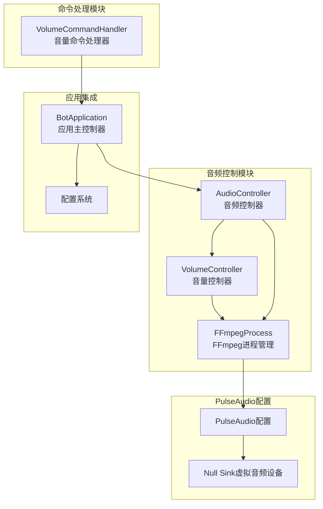
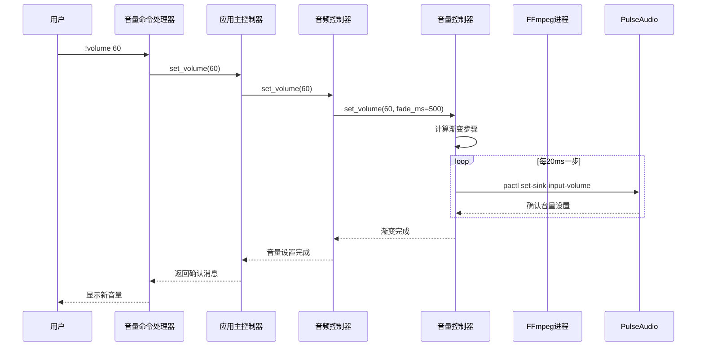
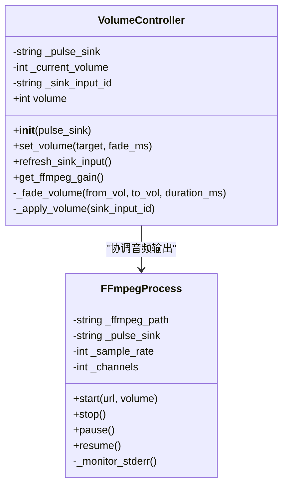
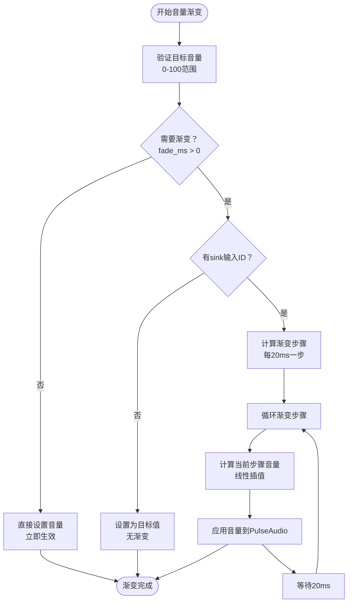
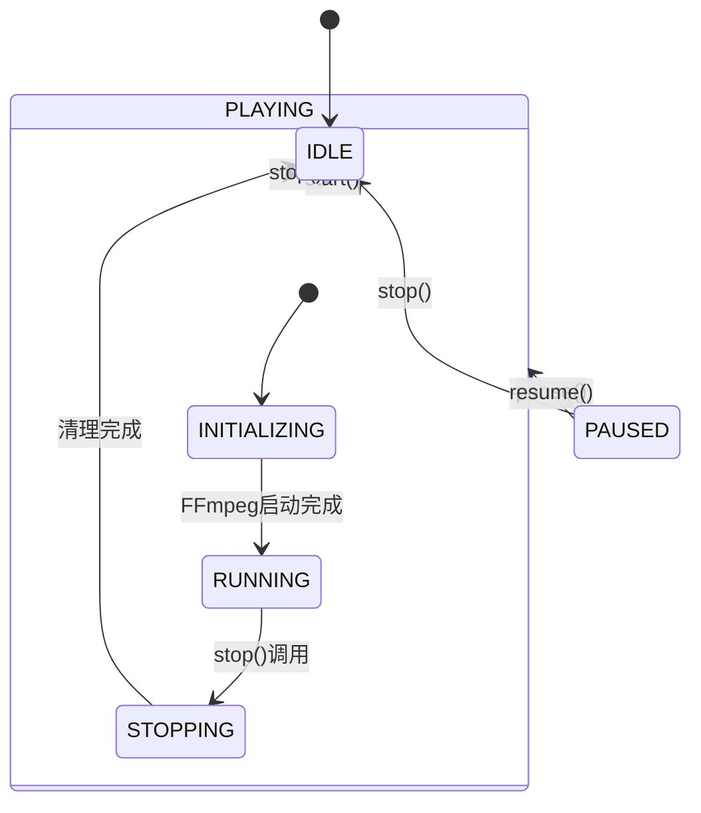
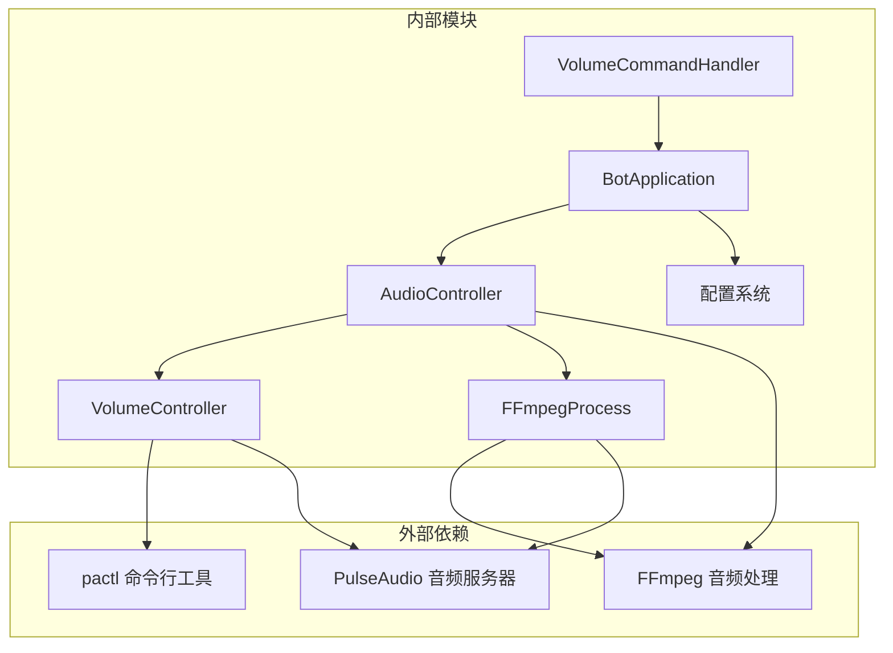

# 音量控制系统

<cite>
**本文档引用的文件**
- [volume.py](file://bot/core/audio/volume.py)
- [controller.py](file://bot/core/audio/controller.py)
- [ffmpeg.py](file://bot/core/audio/ffmpeg.py)
- [volume.py](file://bot/core/commands/handlers/volume.py)
- [app.py](file://bot/app.py)
- [config.py](file://bot/config.py)
- [default.pa](file://docker/pulseaudio/default.pa)
</cite>

## 目录
1. [简介](#简介)
2. [项目结构](#项目结构)
3. [核心组件](#核心组件)
4. [架构概览](#架构概览)
5. [详细组件分析](#详细组件分析)
6. [依赖关系分析](#依赖关系分析)
7. [性能考虑](#性能考虑)
8. [故障排除指南](#故障排除指南)
9. [结论](#结论)

## 简介

音量控制系统是 Teamspeak3 音乐机器人的重要组成部分，负责管理音频播放过程中的音量控制。该系统采用双层音量控制架构，结合 FFmpeg 音频滤镜和 PulseAudio 命令行工具，实现了平滑、无杂音的音量调节功能。

系统通过 VolumeController 类实现音量控制逻辑，AudioController 类作为高层控制器协调 FFmpeg 进程管理和音量控制，VolumeCommandHandler 提供用户交互接口。整个系统支持渐变音量调节、实时更新和错误处理机制。

## 项目结构

音量控制系统位于 bot/core/audio 目录下，包含以下关键文件：

**图表来源**
- [volume.py:12-113](file://bot/core/audio/volume.py#L12-L113)
- [controller.py:24-143](file://bot/core/audio/controller.py#L24-L143)
- [ffmpeg.py:16-162](file://bot/core/audio/ffmpeg.py#L16-L162)

**章节来源**
- [volume.py:1-113](file://bot/core/audio/volume.py#L1-L113)
- [controller.py:1-143](file://bot/core/audio/controller.py#L1-L143)
- [ffmpeg.py:1-162](file://bot/core/audio/ffmpeg.py#L1-L162)

## 核心组件

### VolumeController 类

VolumeController 是音量控制系统的核心类，实现了双层音量控制架构：

- **粗调控制**：通过 FFmpeg 的 volume 音频滤镜在进程启动时设置基础音量
- **精调控制**：通过 PulseAudio 的 pactl 命令实现实时音量微调
- **渐变算法**：提供平滑的音量过渡效果，避免突变杂音

### AudioController 类

AudioController 作为高层控制器，管理整个音频播放生命周期：

- 协调 FFmpeg 进程的启动、停止和暂停
- 统一音量控制接口
- 处理播放状态转换
- 实现优雅的音量渐变停止功能

### FFmpegProcess 类

FFmpegProcess 负责音频解码和输出到 PulseAudio：

- 管理 FFmpeg 子进程生命周期
- 设置音频参数（采样率、声道数）
- 监控进程状态和错误
- 支持流式重连机制

**章节来源**
- [volume.py:12-113](file://bot/core/audio/volume.py#L12-L113)
- [controller.py:24-143](file://bot/core/audio/controller.py#L24-L143)
- [ffmpeg.py:16-162](file://bot/core/audio/ffmpeg.py#L16-L162)

## 架构概览

音量控制系统采用分层架构设计，确保各组件职责清晰、耦合度低：

**图表来源**
- [volume.py:30-61](file://bot/core/audio/volume.py#L30-L61)
- [controller.py:109-112](file://bot/core/audio/controller.py#L109-L112)
- [volume.py:17-49](file://bot/core/commands/handlers/volume.py#L17-L49)

系统架构特点：
- **双层控制**：粗调（FFmpeg）+ 精调（PulseAudio）
- **异步处理**：基于 asyncio 的非阻塞操作
- **实时更新**：每20ms更新一次音量
- **错误恢复**：完善的异常处理和日志记录

## 详细组件分析

### VolumeController 设计与实现

VolumeController 采用双层音量控制策略，确保音量调节的平滑性和可靠性：

#### 核心属性和初始化

**图表来源**
- [volume.py:12-28](file://bot/core/audio/volume.py#L12-L28)
- [ffmpeg.py:16-44](file://bot/core/audio/ffmpeg.py#L16-L44)

#### 渐变音量算法

VolumeController 实现了精确的渐变算法，确保音量变化的平滑性：

**图表来源**
- [volume.py:30-61](file://bot/core/audio/volume.py#L30-L61)

渐变算法的关键特性：
- **步长控制**：每步20ms，确保平滑过渡
- **线性插值**：音量按时间线性变化
- **边界处理**：自动限制在0-100范围内
- **实时反馈**：每步都向PulseAudio发送更新

#### PulseAudio 集成机制

VolumeController 通过以下方式与 PulseAudio 集成：

1. **sink 输入发现**：使用 `pactl list sink-inputs` 命令查找当前音频流
2. **音量设置**：通过 `pactl set-sink-input-volume` 实时调整音量
3. **错误处理**：捕获并处理 PulseAudio 不可用的情况

**章节来源**
- [volume.py:30-113](file://bot/core/audio/volume.py#L30-L113)

### AudioController 协调机制

AudioController 作为高层控制器，负责协调各个组件的工作：

#### 播放生命周期管理

**图表来源**
- [controller.py:18-22](file://bot/core/audio/controller.py#L18-L22)
- [controller.py:70-107](file://bot/core/audio/controller.py#L70-L107)

#### 回调机制设计

AudioController 实现了完整的回调机制来处理播放事件：

- **播放结束回调**：自动播放队列中的下一首歌曲
- **播放错误回调**：处理播放失败并继续播放队列
- **优雅停止**：支持音量渐变后停止播放

**章节来源**
- [controller.py:24-143](file://bot/core/audio/controller.py#L24-L143)

### FFmpeg 音频处理

FFmpegProcess 类负责音频解码和输出到 PulseAudio：

#### 音频参数配置

FFmpeg 进程使用以下关键参数：
- **重连机制**：支持流式音频的自动重连
- **音频滤镜**：使用 volume 滤镜设置初始音量
- **输出格式**：使用 pulse 输出格式直接写入 PulseAudio
- **采样参数**：48kHz 采样率，立体声输出

#### 进程监控

FFmpegProcess 实现了完整的进程监控机制：
- **标准错误监控**：实时读取 FFmpeg 输出
- **状态检测**：区分正常结束、暂停和错误状态
- **优雅关闭**：支持终止信号和强制杀死

**章节来源**
- [ffmpeg.py:16-162](file://bot/core/audio/ffmpeg.py#L16-L162)

### 用户界面集成

VolumeCommandHandler 提供了用户友好的音量控制接口：

#### 命令语法支持

支持多种音量设置方式：
- **绝对音量**：`!volume 60` 设置为60%
- **相对调整**：`!volume +10` 增加10%，`!volume -5` 减少5%
- **查询当前音量**：`!volume` 显示当前音量

#### 错误处理

命令处理器实现了完善的错误处理：
- **参数验证**：检查音量范围和格式
- **用户反馈**：提供清晰的操作结果信息
- **异常恢复**：处理各种可能的错误情况

**章节来源**
- [volume.py:17-50](file://bot/core/commands/handlers/volume.py#L17-L50)

## 依赖关系分析

音量控制系统具有清晰的依赖关系，遵循单一职责原则：

**图表来源**
- [volume.py:66-70](file://bot/core/audio/volume.py#L66-L70)
- [ffmpeg.py:66-80](file://bot/core/audio/ffmpeg.py#L66-L80)
- [app.py:54-59](file://bot/app.py#L54-L59)

### 关键依赖点

1. **PulseAudio 依赖**：VolumeController 依赖 pactl 命令进行实时音量控制
2. **FFmpeg 依赖**：AudioController 依赖 FFmpeg 进行音频解码
3. **配置依赖**：所有组件都依赖配置系统进行参数设置

### 循环依赖检查

系统设计避免了循环依赖：
- VolumeController 不依赖 AudioController
- AudioController 不依赖 VolumeController
- 各组件通过 BotApplication 进行协调

**章节来源**
- [app.py:9-22](file://bot/app.py#L9-L22)
- [config.py:48-55](file://bot/config.py#L48-L55)

## 性能考虑

音量控制系统在设计时充分考虑了性能优化：

### 异步处理优势

- **非阻塞操作**：所有音量控制都是异步的，不会阻塞主线程
- **并发处理**：多个音量控制操作可以并行处理
- **资源效率**：使用 asyncio 的事件循环管理资源

### 内存管理

- **轻量级对象**：VolumeController 和 AudioController 都是轻量级对象
- **及时清理**：FFmpeg 进程结束后及时释放资源
- **状态跟踪**：只维护必要的状态信息

### 网络和 I/O 优化

- **最小化 I/O**：音量控制只进行必要的系统调用
- **批量操作**：在可能的情况下合并系统调用
- **超时控制**：为所有外部调用设置合理的超时时间

## 故障排除指南

### 常见问题及解决方案

#### PulseAudio 相关问题

**问题**：pactl 命令找不到
**症状**：音量控制警告日志
**解决方案**：
- 确保 PulseAudio 服务正常运行
- 检查系统 PATH 中是否包含 pactl
- 验证 PulseAudio 配置正确

**问题**：无法找到 sink 输入 ID
**症状**：音量设置无效但无错误日志
**解决方案**：
- 确认 FFmpeg 进程正在运行
- 检查 PulseAudio 配置中的 sink 名称
- 验证音频流确实输出到指定 sink

#### FFmpeg 相关问题

**问题**：音频流无法输出到 PulseAudio
**症状**：播放开始但无声音
**解决方案**：
- 检查 FFmpeg 安装和权限
- 验证 PulseAudio 配置正确
- 确认音频源 URL 可访问

#### 性能问题

**问题**：音量渐变不流畅
**症状**：音量变化出现卡顿
**解决方案**：
- 检查系统负载情况
- 调整渐变步长（减少到10ms）
- 确保 PulseAudio 服务器响应正常

### 日志分析

系统提供了详细的日志信息，有助于问题诊断：

- **调试级别**：显示详细的内部状态和操作
- **信息级别**：显示重要的系统事件
- **警告级别**：显示可恢复的错误
- **错误级别**：显示严重问题

**章节来源**
- [volume.py:65-75](file://bot/core/audio/volume.py#L65-L75)
- [ffmpeg.py:127-162](file://bot/core/audio/ffmpeg.py#L127-L162)

## 结论

音量控制系统通过精心设计的双层架构和异步处理机制，成功实现了平滑、可靠的音频音量控制功能。系统的主要优势包括：

1. **技术架构先进**：双层音量控制确保了音量调节的平滑性和可靠性
2. **用户体验优秀**：渐变音量和实时更新提供了流畅的用户体验
3. **系统集成完善**：与 FFmpeg 和 PulseAudio 的深度集成确保了稳定性
4. **错误处理健全**：完善的异常处理和日志记录便于问题诊断
5. **配置灵活**：支持通过配置文件自定义各种参数

该系统为 Teamspeak3 音乐机器人提供了坚实的基础，能够满足各种音频播放场景的需求。通过进一步的优化和扩展，可以支持更多高级功能，如均衡器、音频效果等。