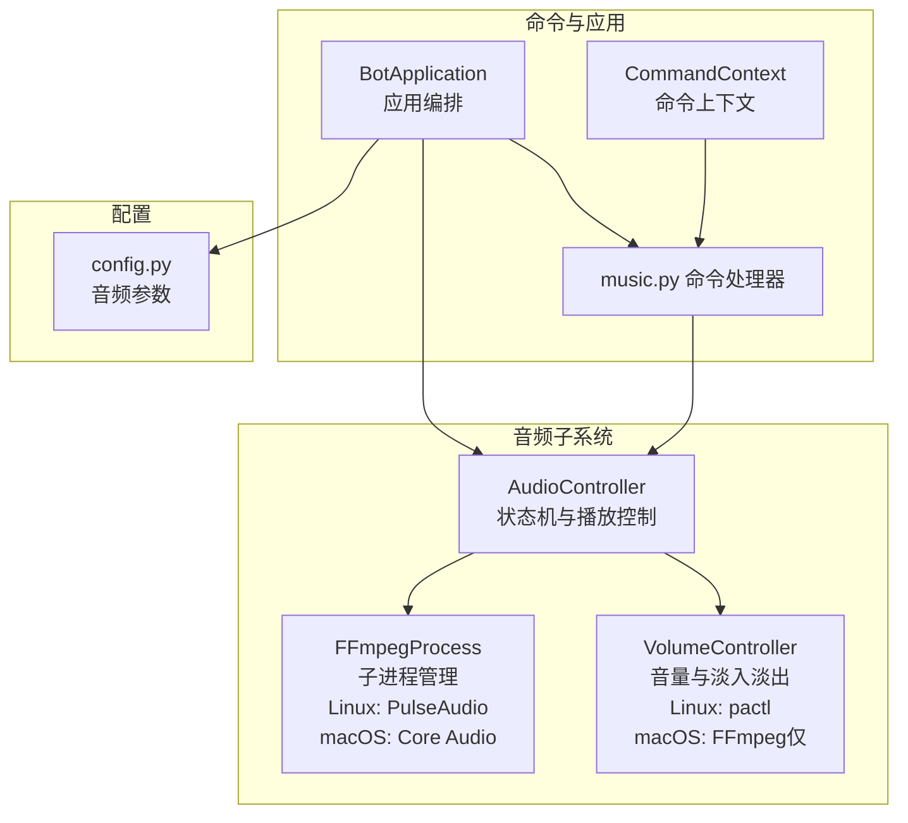
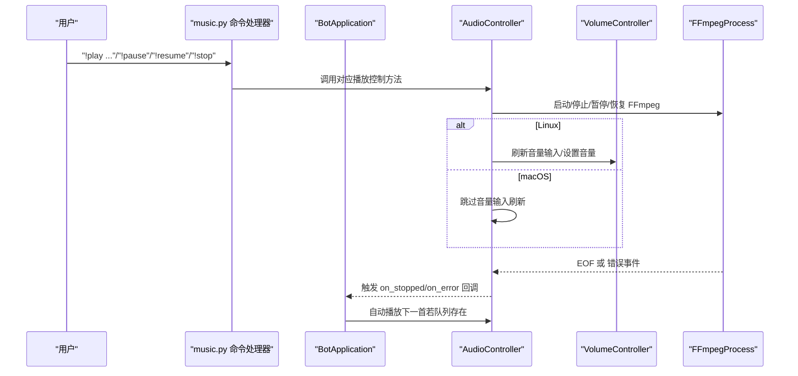
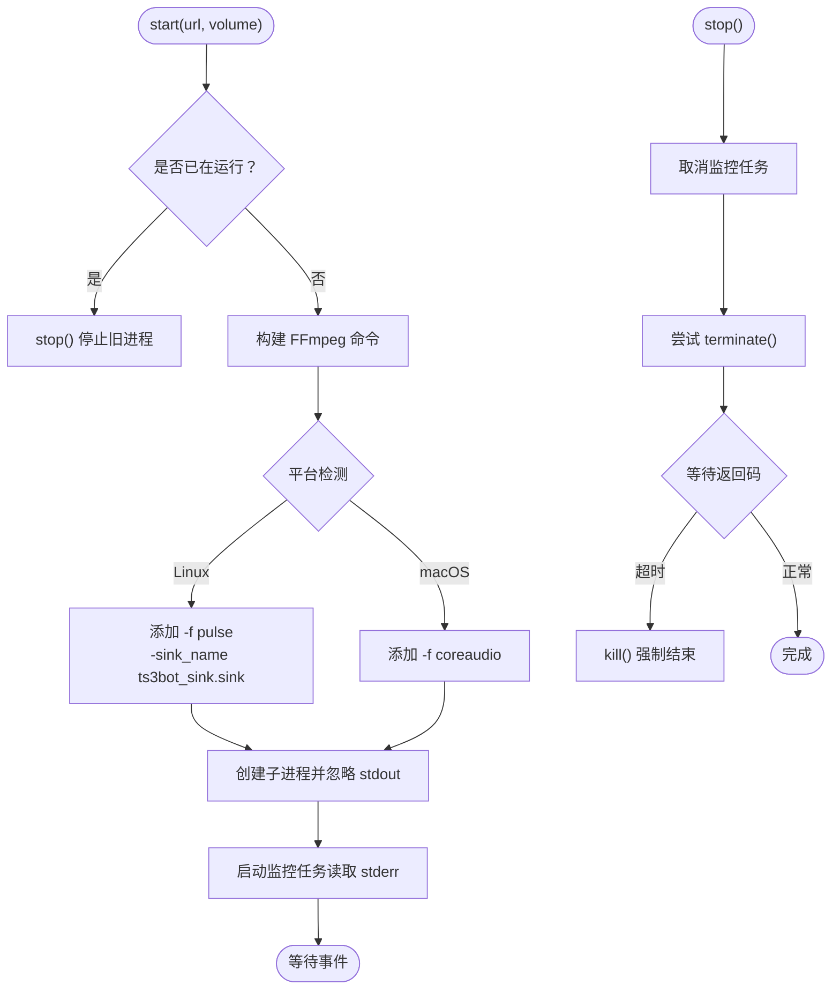
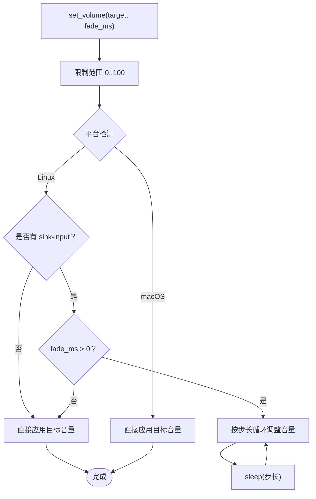
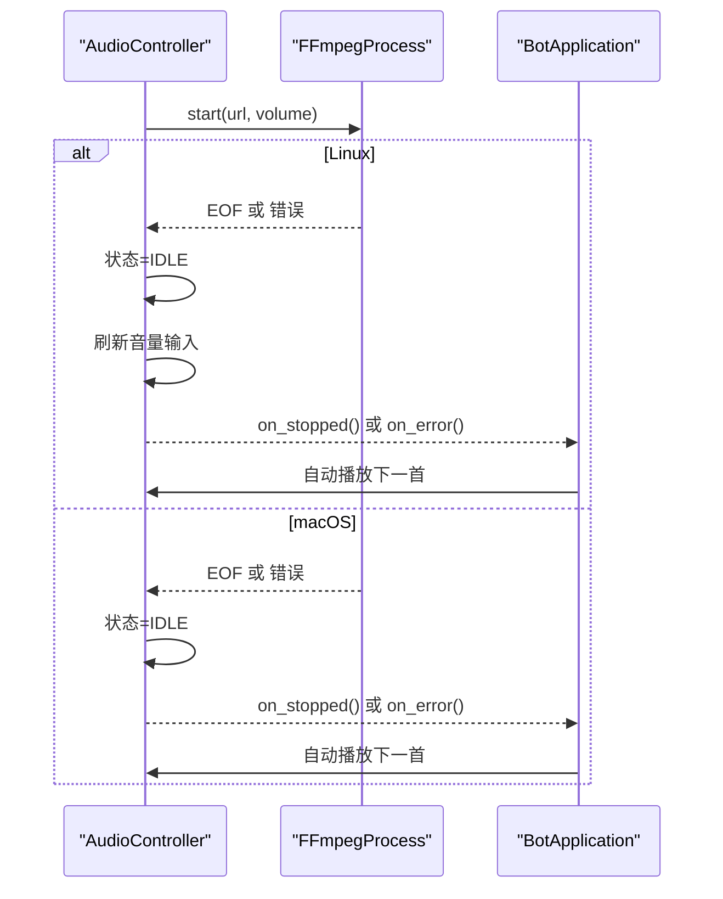
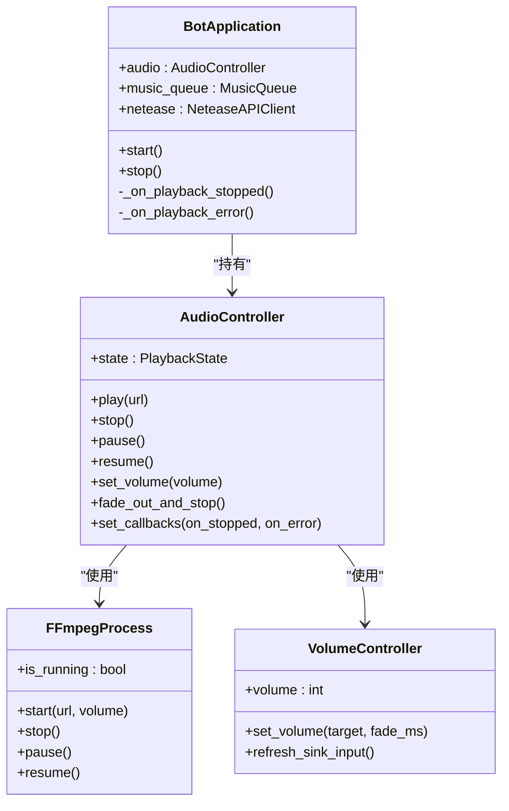
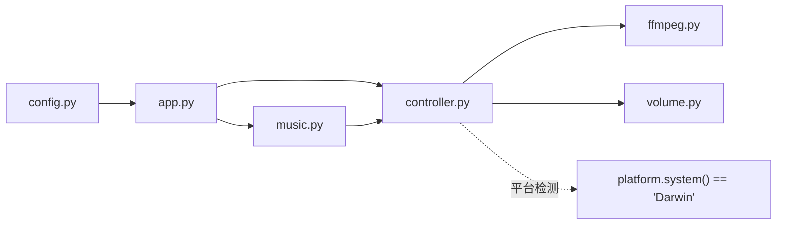

# 音频控制器

<cite>
**本文引用的文件**
- [controller.py](file://bot/core/audio/controller.py)
- [ffmpeg.py](file://bot/core/audio/ffmpeg.py)
- [volume.py](file://bot/core/audio/volume.py)
- [music.py](file://bot/core/commands/handlers/music.py)
- [app.py](file://bot/app.py)
- [context.py](file://bot/core/commands/context.py)
- [config.py](file://bot/config.py)
</cite>

## 更新摘要
**变更内容**
- 新增跨平台音频处理支持，包括 macOS Core Audio 输出
- 实现条件性 sink 输入刷新机制，Linux 和 macOS 采用不同策略
- 增强平台检测和兼容性处理
- 更新架构图以反映新的跨平台特性

## 目录
1. [简介](#简介)
2. [项目结构](#项目结构)
3. [核心组件](#核心组件)
4. [架构总览](#架构总览)
5. [详细组件分析](#详细组件分析)
6. [跨平台音频处理](#跨平台音频处理)
7. [依赖关系分析](#依赖关系分析)
8. [性能考虑](#性能考虑)
9. [故障排查指南](#故障排查指南)
10. [结论](#结论)
11. [附录](#附录)

## 简介
本技术文档围绕音频控制器模块展开，重点解析 AudioController 的架构设计与实现原理，涵盖：
- 播放状态机（IDLE、PLAYING、PAUSED）的状态转换逻辑
- 播放控制方法（play、stop、pause、resume）的实现机制与异步处理流程
- 回调函数系统的设计：播放停止与错误处理回调的注册与触发机制
- 音频播放生命周期的完整管理：播放开始、结束与异常处理
- **新增**：跨平台音频处理增强，包括 macOS Core Audio 支持和条件性 sink 输入刷新
- 性能优化建议与最佳实践

## 项目结构
音频控制器位于 bot/core/audio 目录，配合 FFmpeg 子进程管理和 PulseAudio 实时音量控制，形成完整的播放链路。命令层通过 BotApplication 将控制器与音乐队列、网络服务等模块集成。系统现已支持 Linux 和 macOS 两种平台。



**图表来源**
- [controller.py:24-146](file://bot/core/audio/controller.py#L24-L146)
- [ffmpeg.py:18-23](file://bot/core/audio/ffmpeg.py#L18-L23)
- [volume.py:13-20](file://bot/core/audio/volume.py#L13-L20)
- [music.py:17-243](file://bot/core/commands/handlers/music.py#L17-L243)
- [app.py:27-348](file://bot/app.py#L27-L348)
- [context.py:13-70](file://bot/core/commands/context.py#L13-L70)
- [config.py:48-55](file://bot/config.py#L48-L55)

**章节来源**
- [controller.py:1-146](file://bot/core/audio/controller.py#L1-L146)
- [ffmpeg.py:1-175](file://bot/core/audio/ffmpeg.py#L1-L175)
- [volume.py:1-120](file://bot/core/audio/volume.py#L1-L120)
- [music.py:1-243](file://bot/core/commands/handlers/music.py#L1-L243)
- [app.py:1-348](file://bot/app.py#L1-L348)
- [context.py:1-70](file://bot/core/commands/context.py#L1-L70)
- [config.py:1-160](file://bot/config.py#L1-L160)

## 核心组件
- **AudioController**：高层播放控制器，负责状态机、播放生命周期、回调事件分发、音量控制与 FFmpeg 进程协调。现已支持跨平台检测和条件性功能。
- **FFmpegProcess**：封装 FFmpeg 子进程的启动、停止、暂停/恢复、标准错误监控与退出码处理。Linux 使用 PulseAudio 输出，macOS 使用 Core Audio 输出。
- **VolumeController**：两层音量控制策略（FFmpeg 滤镜粗调 + pactl 实时微调）。Linux 支持精细控制，macOS 仅支持 FFmpeg 粗调。
- **BotApplication**：应用编排器，注入 AudioController 并注册播放完成/错误回调，驱动音乐队列自动播放下一首。
- **命令处理器 music.py**：将用户指令映射到 AudioController 的播放控制方法，并与队列联动。
- **CommandContext**：命令上下文封装，提供回复 TS3 的便捷方法。
- **config.py**：音频相关配置项，如 PulseAudio 源名、默认音量、淡入时长、FFmpeg 路径等。

**章节来源**
- [controller.py:24-146](file://bot/core/audio/controller.py#L24-L146)
- [ffmpeg.py:18-23](file://bot/core/audio/ffmpeg.py#L18-L23)
- [volume.py:13-20](file://bot/core/audio/volume.py#L13-L20)
- [app.py:27-348](file://bot/app.py#L27-L348)
- [music.py:17-243](file://bot/core/commands/handlers/music.py#L17-L243)
- [context.py:13-70](file://bot/core/commands/context.py#L13-L70)
- [config.py:48-55](file://bot/config.py#L48-L55)

## 架构总览
AudioController 作为门面，向上提供统一的播放接口，向下协调 FFmpeg 子进程与音量控制器。BotApplication 注册播放完成与错误回调，实现"一首歌结束后自动播放下一首"的自动化播放链路。系统现已支持跨平台音频输出。



**图表来源**
- [music.py:20-93](file://bot/core/commands/handlers/music.py#L20-L93)
- [app.py:199-253](file://bot/app.py#L199-L253)
- [controller.py:70-146](file://bot/core/audio/controller.py#L70-L146)
- [ffmpeg.py:54-175](file://bot/core/audio/ffmpeg.py#L54-L175)
- [volume.py:77-120](file://bot/core/audio/volume.py#L77-L120)

## 详细组件分析

### AudioController 状态机与播放控制
- **状态枚举 PlaybackState**：IDLE、PLAYING、PAUSED
- **状态转换**：
  - play：若非 IDLE 先 stop；启动 FFmpeg；进入 PLAYING；**Linux 平台**：稍后刷新音量输入
  - pause：仅 PLAYING 可暂停，进入 PAUSED
  - resume：仅 PAUSED 可继续，进入 PLAYING
  - stop：停止 FFmpeg，进入 IDLE
  - EOF/错误：进入 IDLE 并触发 on_stopped/on_error 回调
- **异步处理**：所有控制方法均为协程，确保非阻塞；**Linux 平台**：播放开始后短暂延时再刷新音量输入，避免 PulseAudio 未就绪导致的失败

```mermaid
stateDiagram-v2
[*] --> IDLE
IDLE --> PLAYING : "play()"
PLAYING --> PAUSED : "pause()"
PAUSED --> PLAYING : "resume()"
PLAYING --> IDLE : "stop()/EOF/错误"
PAUSED --> IDLE : "stop()"
note right of IDLE : "平台检测 : platform.system() == 'Darwin'"
note right of PLAYING : "Linux : 刷新音量输入<br/>macOS : 跳过刷新"
```

**图表来源**
- [controller.py:18-22](file://bot/core/audio/controller.py#L18-L22)
- [controller.py:70-107](file://bot/core/audio/controller.py#L70-L107)
- [controller.py:130-146](file://bot/core/audio/controller.py#L130-L146)

**章节来源**
- [controller.py:18-22](file://bot/core/audio/controller.py#L18-L22)
- [controller.py:70-107](file://bot/core/audio/controller.py#L70-L107)
- [controller.py:130-146](file://bot/core/audio/controller.py#L130-L146)

### FFmpegProcess 子进程管理
- **启动**：构建 FFmpeg 命令（重连参数、音量滤镜、平台特定输出），创建子进程并启动监控任务
- **停止**：取消监控任务；终止进程，超时则强制 kill；清理内部状态
- **暂停/恢复**：向进程发送 SIGSTOP/SIGCONT
- **监控**：读取 stderr 日志，区分 EOF（正常结束）、SIGSTOP（暂停）、其他错误码并触发回调
- **平台差异**：
  - Linux：使用 `-f pulse` 输出到 PulseAudio sink
  - macOS：使用 `-f coreaudio` 输出到系统 Core Audio



**图表来源**
- [ffmpeg.py:54-115](file://bot/core/audio/ffmpeg.py#L54-L115)
- [ffmpeg.py:127-175](file://bot/core/audio/ffmpeg.py#L127-L175)

**章节来源**
- [ffmpeg.py:18-23](file://bot/core/audio/ffmpeg.py#L18-L23)
- [ffmpeg.py:60-95](file://bot/core/audio/ffmpeg.py#L60-L95)
- [ffmpeg.py:140-175](file://bot/core/audio/ffmpeg.py#L140-L175)

### VolumeController 音量控制与淡入淡出
- **两层控制**：
  - FFmpeg 层：启动时设置音量滤镜，提供粗略音量
  - PulseAudio 层：通过 pactl 对 sink input 实时调整，实现平滑过渡（Linux 专用）
- **平台差异**：
  - Linux：支持两层控制，包括实时音量调整
  - macOS：仅支持 FFmpeg 粗调，无实时音量控制
- **刷新 sink 输入**：启动 FFmpeg 后扫描当前 PulseAudio sink 的 sink-input，定位并绑定实时音量控制（Linux 专用）
- **淡入淡出**：按固定步长与时间间隔逐步调整，避免突变噪声



**图表来源**
- [volume.py:30-61](file://bot/core/audio/volume.py#L30-L61)
- [volume.py:77-103](file://bot/core/audio/volume.py#L77-L103)

**章节来源**
- [volume.py:13-20](file://bot/core/audio/volume.py#L13-L20)
- [volume.py:32-52](file://bot/core/audio/volume.py#L32-L52)
- [volume.py:84-120](file://bot/core/audio/volume.py#L84-L120)

### 回调系统与播放生命周期
- **回调类型 PlaybackCallback**：无参协程函数
- **注册**：BotApplication 在构造时调用 AudioController.set_callbacks(on_stopped, on_error)
- **触发**：
  - EOF：AudioController._handle_eof 设置状态为 IDLE 并调用 on_stopped
  - 错误：AudioController._handle_error 设置状态为 IDLE 并调用 on_error
- **生命周期**：
  - 开始：play() 启动 FFmpeg，随后刷新音量输入（Linux 专用）
  - 结束：EOF 触发 on_stopped，BotApplication 自动播放下一首
  - 异常：错误码触发 on_error，BotApplication 尝试下一首



**图表来源**
- [controller.py:70-87](file://bot/core/audio/controller.py#L70-L87)
- [controller.py:130-146](file://bot/core/audio/controller.py#L130-L146)
- [app.py:199-253](file://bot/app.py#L199-L253)

**章节来源**
- [controller.py:61-68](file://bot/core/audio/controller.py#L61-L68)
- [controller.py:130-146](file://bot/core/audio/controller.py#L130-L146)
- [app.py:107-110](file://bot/app.py#L107-L110)

### 命令层与应用编排
- **music.py**：将 "!pause"、"!resume"、"!stop" 等命令映射到 AudioController 的对应方法；当处于 idle 时立即播放队列首曲
- **app.py**：在 BotApplication.__init__ 中注册回调；在 stop() 时执行 fade_out_and_stop() 安全关机
- **context.py**：CommandContext 提供 reply/reply_channel/reply_same 等便捷方法



**图表来源**
- [app.py:27-110](file://bot/app.py#L27-L110)
- [controller.py:24-52](file://bot/core/audio/controller.py#L24-L52)
- [ffmpeg.py:16-44](file://bot/core/audio/ffmpeg.py#L16-L44)
- [volume.py:12-29](file://bot/core/audio/volume.py#L12-L29)

**章节来源**
- [music.py:116-136](file://bot/core/commands/handlers/music.py#L116-L136)
- [app.py:107-110](file://bot/app.py#L107-L110)
- [context.py:13-70](file://bot/core/commands/context.py#L13-L70)

## 跨平台音频处理

### 平台检测与兼容性
系统通过 `platform.system() == "Darwin"` 进行平台检测，实现以下跨平台兼容性：

- **AudioController**：检测平台并在 Linux 上执行音量输入刷新，在 macOS 上跳过
- **FFmpegProcess**：根据平台选择不同的输出格式
  - Linux：`-f pulse` 输出到 PulseAudio sink
  - macOS：`-f coreaudio` 输出到系统 Core Audio
- **VolumeController**：根据平台决定音量控制策略
  - Linux：支持两层音量控制（FFmpeg + pactl）
  - macOS：仅支持 FFmpeg 粗调音量

### 条件性 sink 输入刷新
在 Linux 平台上，AudioController 在播放开始后会执行以下流程：
1. 启动 FFmpeg 进程
2. 等待 0.5 秒让 FFmpeg 完全启动
3. 调用 VolumeController.refresh_sink_input() 刷新 PulseAudio sink 输入
4. 应用当前音量设置

在 macOS 平台上，由于使用 Core Audio 输出，系统会跳过此流程。

**章节来源**
- [controller.py:87-91](file://bot/core/audio/controller.py#L87-L91)
- [ffmpeg.py:88-92](file://bot/core/audio/ffmpeg.py#L88-L92)
- [volume.py:84-120](file://bot/core/audio/volume.py#L84-L120)

## 依赖关系分析
- **AudioController** 依赖 FFmpegProcess 与 VolumeController
- **BotApplication** 依赖 AudioController，并通过 set_callbacks 注入播放完成/错误回调
- **命令处理器 music.py** 依赖 BotApplication 的 audio 实例
- **配置 config.py** 提供音频相关参数，影响 AudioController 初始化



**图表来源**
- [config.py:48-55](file://bot/config.py#L48-L55)
- [app.py:54-59](file://bot/app.py#L54-L59)
- [controller.py:10-11](file://bot/core/audio/controller.py#L10-L11)
- [music.py:20-93](file://bot/core/commands/handlers/music.py#L20-L93)

**章节来源**
- [controller.py:10-11](file://bot/core/audio/controller.py#L10-L11)
- [app.py:54-59](file://bot/app.py#L54-L59)
- [music.py:20-93](file://bot/core/commands/handlers/music.py#L20-L93)

## 性能考虑
- **子进程与 I/O 非阻塞**：AudioController 与 FFmpegProcess 均采用 asyncio，避免阻塞事件循环
- **音量控制平滑**：VolumeController 使用固定步长与步进延迟进行淡入淡出，降低突变噪声
- **启动后延时**：play() 后短暂 sleep 再刷新音量输入，确保 PulseAudio sink-input 就绪（Linux 专用）
- **重连参数**：FFmpegProcess 启动时启用流式重连参数，提升网络不稳定场景下的鲁棒性
- **资源回收**：stop() 显式取消监控任务并终止/杀死进程，防止僵尸进程
- **关机安全**：BotApplication.stop() 调用 fade_out_and_stop()，先淡出再停止，避免突停
- **平台优化**：macOS 平台跳过不必要的音量输入刷新，减少系统调用开销

**章节来源**
- [controller.py:86-87](file://bot/core/audio/controller.py#L86-L87)
- [volume.py:46-59](file://bot/core/audio/volume.py#L46-L59)
- [ffmpeg.py:66-80](file://bot/core/audio/ffmpeg.py#L66-L80)
- [ffmpeg.py:94-115](file://bot/core/audio/ffmpeg.py#L94-L115)
- [app.py:314-315](file://bot/app.py#L314-L315)

## 故障排查指南
- **无法播放/黑屏无声**
  - 检查 PulseAudio 源名与 FFmpeg 输出 sink 是否一致（Linux 专用）
  - 确认 FFmpeg 可执行路径与权限
  - 观察 FFmpeg stderr 日志，确认是否出现连接错误或格式不支持
  - **新增**：检查系统平台是否为 macOS，确认使用 Core Audio 输出
- **播放卡住或无法停止**
  - 确认 stop() 是否被调用且监控任务已取消
  - 检查进程是否被 SIGSTOP（pause）冻结
- **音量异常**
  - 确认 pactl 是否可用，sink-input 是否成功刷新（Linux 专用）
  - 检查音量范围与淡入时长配置
  - **新增**：在 macOS 平台上，音量控制仅限于 FFmpeg 粗调
- **回调未触发**
  - 确认 BotApplication 是否在初始化时注册了 on_stopped/on_error
  - 检查 FFmpeg 退出码是否为 EOF 或错误码
- **跨平台问题**
  - **Linux**：确认 PulseAudio 服务正常运行
  - **macOS**：确认系统 Core Audio 可用，检查音频输出设备设置

**章节来源**
- [ffmpeg.py:127-175](file://bot/core/audio/ffmpeg.py#L127-L175)
- [volume.py:77-108](file://bot/core/audio/volume.py#L77-L108)
- [app.py:107-110](file://bot/app.py#L107-L110)

## 结论
AudioController 通过清晰的状态机与回调机制，将 FFmpeg 子进程与 PulseAudio 音量控制解耦，实现了稳定、可扩展的音频播放能力。**新增的跨平台支持**使得系统能够在 Linux 和 macOS 上正常工作，其中 Linux 平台提供完整的音量控制功能，而 macOS 平台使用 Core Audio 输出并简化了音量控制流程。结合 BotApplication 的自动播放与优雅关机策略，整体系统具备良好的用户体验与健壮性。建议在生产环境中关注日志级别、网络稳定性、资源回收以及不同平台的特定配置，以获得更佳的运行表现。

## 附录
- **配置项参考**（来自 config.py）：
  - 音频设备：pulse_sink_name
  - 默认音量：default_volume
  - 淡入时长：fade_duration_ms
  - FFmpeg 路径：ffmpeg_path
- **常见命令**（来自 music.py）：
  - !play：点歌/解析链接并播放
  - !pause：暂停
  - !resume：继续
  - !stop：停止（管理员）
- **平台特定信息**：
  - **Linux**：使用 PulseAudio 输出，支持完整的音量控制
  - **macOS**：使用 Core Audio 输出，音量控制受限于系统限制

**章节来源**
- [config.py:48-55](file://bot/config.py#L48-L55)
- [music.py:20-93](file://bot/core/commands/handlers/music.py#L20-L93)