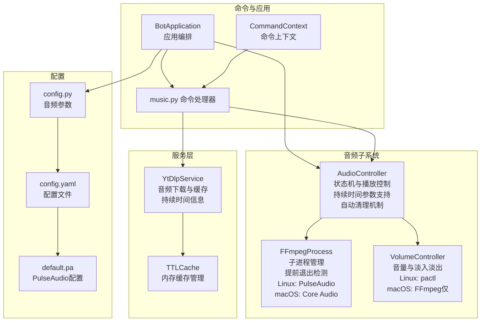
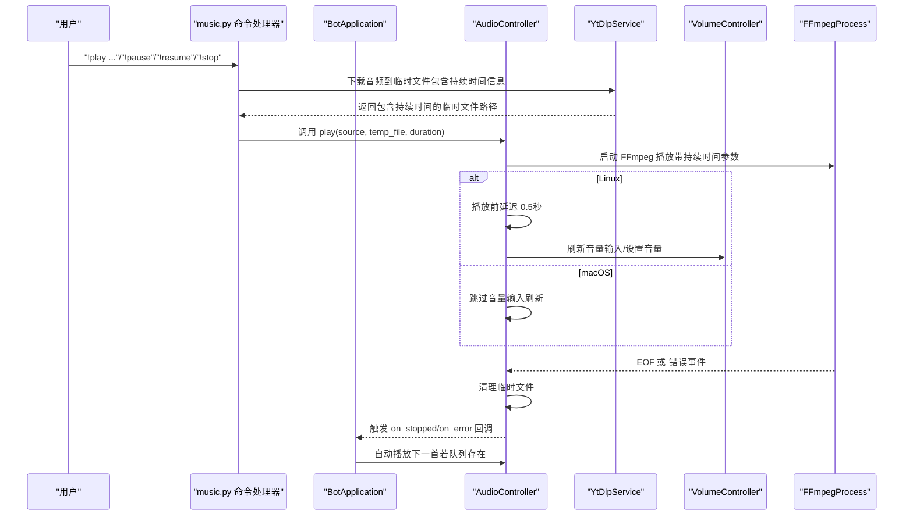
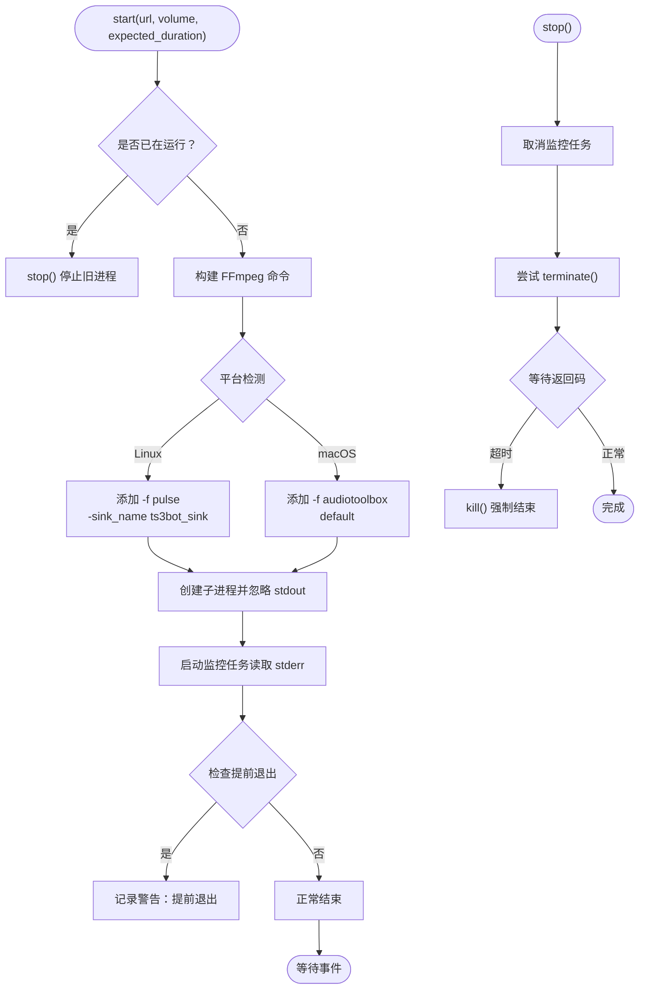
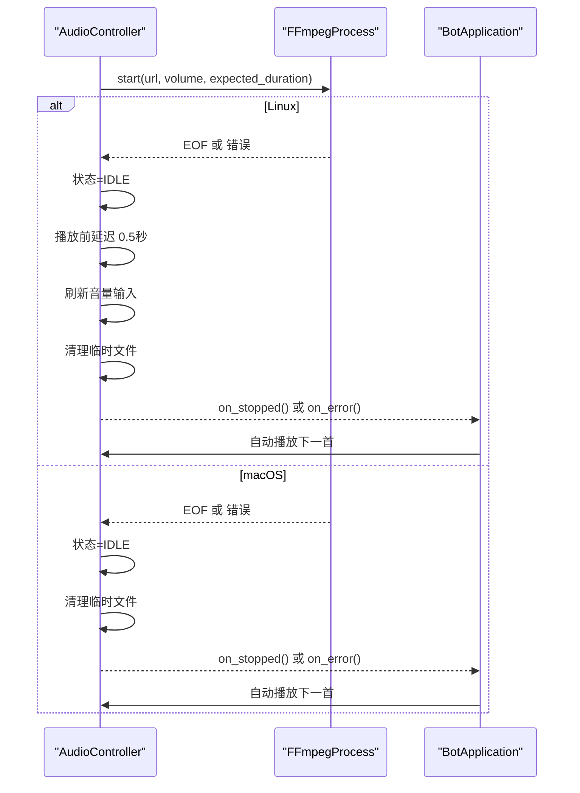
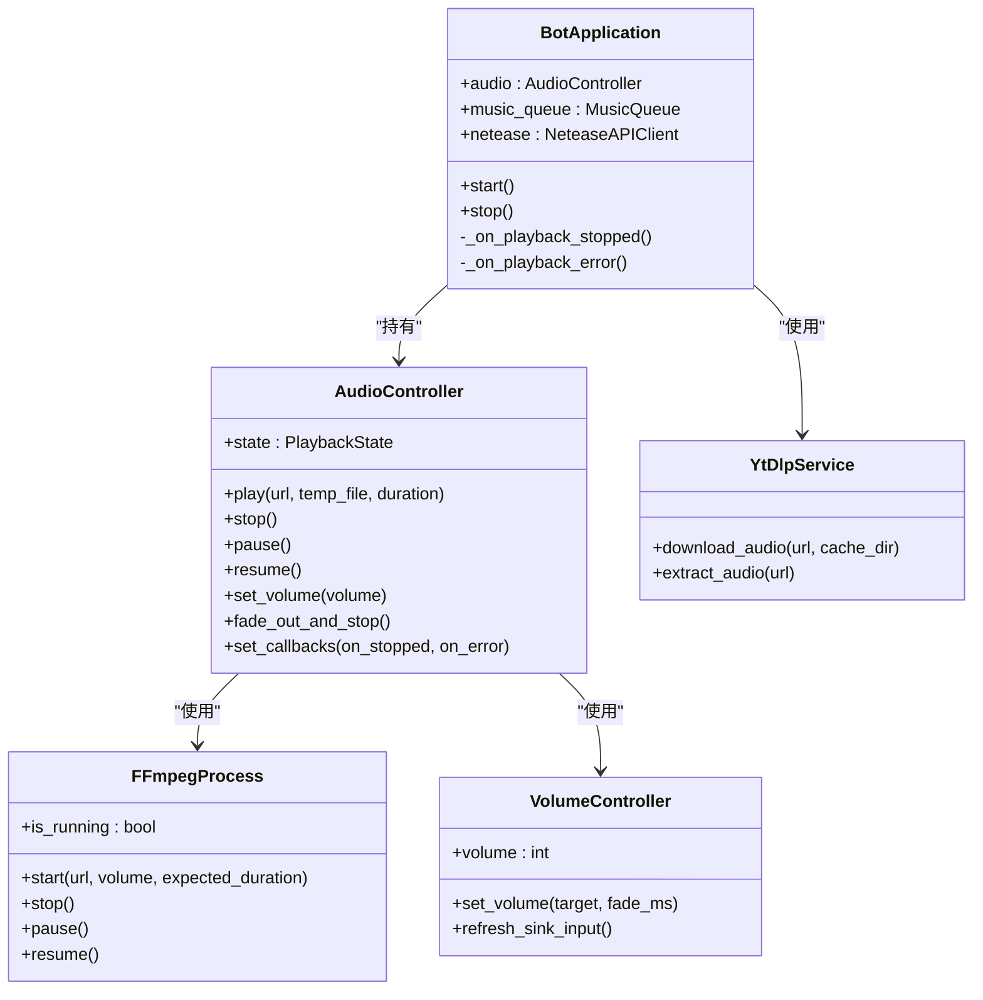
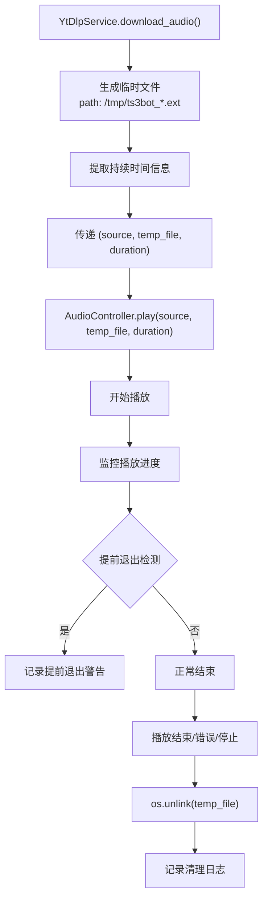
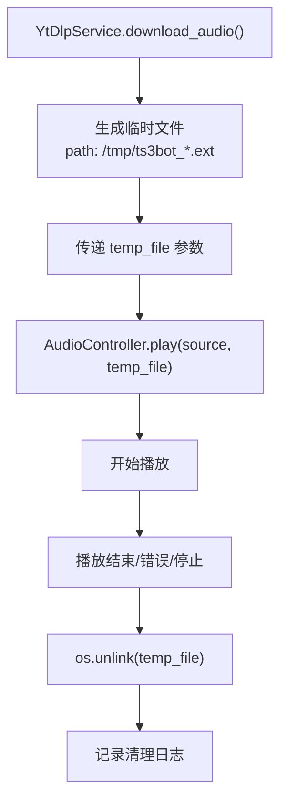
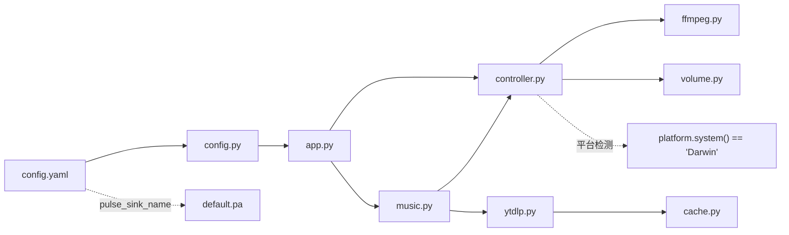

# 音频控制器

<cite>
**本文引用的文件**
- [controller.py](file://bot/core/audio/controller.py)
- [ffmpeg.py](file://bot/core/audio/ffmpeg.py)
- [volume.py](file://bot/core/audio/volume.py)
- [music.py](file://bot/core/commands/handlers/music.py)
- [ytdlp.py](file://bot/services/netease/ytdlp.py)
- [models.py](file://bot/services/netease/models.py)
- [cache.py](file://bot/services/netease/cache.py)
- [app.py](file://bot/app.py)
- [context.py](file://bot/core/commands/context.py)
- [config.py](file://bot/config.py)
- [config.yaml](file://config/config.yaml)
- [default.pa](file://docker/pulseaudio/default.pa)
</cite>

## 更新摘要
**变更内容**
- **新增持续时间参数支持**：AudioController.play() 方法新增 duration 参数，用于预期播放时长检测
- **播放完成后的自动清理机制**：所有播放状态转换（停止、EOF、错误）都会自动清理临时文件
- **改进的提前退出检测**：FFmpegProcess 增强了基于预期时长的提前退出检测逻辑
- **增强的播放生命周期管理**：播放开始、结束、异常处理的完整生命周期管理
- **优化的临时文件管理**：新增临时文件跟踪和自动清理功能，增强对本地文件播放的支持
- **改进的跨平台音频处理**：Linux 和 macOS 平台的差异化处理和优化

## 目录
1. [简介](#简介)
2. [项目结构](#项目结构)
3. [核心组件](#核心组件)
4. [架构总览](#架构总览)
5. [详细组件分析](#详细组件分析)
6. [跨平台音频处理](#跨平台音频处理)
7. [持续时间参数与提前退出检测](#持续时间参数与提前退出检测)
8. [临时文件管理与自动清理](#临时文件管理与自动清理)
9. [依赖关系分析](#依赖关系分析)
10. [性能考虑](#性能考虑)
11. [故障排查指南](#故障排查指南)
12. [结论](#结论)
13. [附录](#附录)

## 简介
本技术文档围绕音频控制器模块展开，重点解析 AudioController 的架构设计与实现原理，涵盖：
- 播放状态机（IDLE、PLAYING、PAUSED）的状态转换逻辑
- 播放控制方法（play、stop、pause、resume）的实现机制与异步处理流程
- 回调函数系统的设计：播放停止与错误处理回调的注册与触发机制
- 音频播放生命周期的完整管理：播放开始、结束与异常处理
- **新增**：持续时间参数支持，实现基于预期时长的播放完成检测
- **新增**：播放完成后的自动清理机制，确保资源及时释放
- **新增**：改进的提前退出检测，提升播放稳定性
- **新增**：增强的临时文件管理，支持自动清理和生命周期管理
- **新增**：优化的跨平台音频处理，包括 Linux 和 macOS 差异化支持

## 项目结构
音频控制器位于 bot/core/audio 目录，配合 FFmpeg 子进程管理和 PulseAudio 实时音量控制，形成完整的播放链路。命令层通过 BotApplication 将控制器与音乐队列、网络服务等模块集成。系统现已支持 Linux 和 macOS 两种平台，并新增了持续时间参数支持和自动清理机制。



**图表来源**
- [controller.py:24-187](file://bot/core/audio/controller.py#L24-L187)
- [ffmpeg.py:18-23](file://bot/core/audio/ffmpeg.py#L18-L23)
- [volume.py:13-20](file://bot/core/audio/volume.py#L13-L20)
- [music.py:17-260](file://bot/core/commands/handlers/music.py#L17-L260)
- [ytdlp.py:44-177](file://bot/services/netease/ytdlp.py#L44-177)
- [models.py:9-46](file://bot/services/netease/models.py#L9-L46)
- [cache.py:9-46](file://bot/services/netease/cache.py#L9-46)
- [app.py:27-348](file://bot/app.py#L27-L348)
- [context.py:13-70](file://bot/core/commands/context.py#L13-L70)
- [config.py:48-55](file://bot/config.py#L48-L55)
- [config.yaml:14-18](file://config/config.yaml#L14-L18)
- [default.pa:1-19](file://docker/pulseaudio/default.pa#L1-L19)

## 核心组件
- **AudioController**：高层播放控制器，负责状态机、播放生命周期、回调事件分发、音量控制与 FFmpeg 进程协调。现已支持持续时间参数、自动清理机制和跨平台检测。
- **FFmpegProcess**：封装 FFmpeg 子进程的启动、停止、暂停/恢复、标准错误监控与退出码处理。Linux 使用 PulseAudio 输出，macOS 使用 Core Audio 输出，支持基于预期时长的提前退出检测。
- **VolumeController**：两层音量控制策略（FFmpeg 滤镜粗调 + pactl 实时微调）。Linux 支持精细控制，macOS 仅支持 FFmpeg 粗调。
- **YtDlpService**：音频下载服务，支持多种平台的音频提取和本地文件下载，生成包含持续时间信息的临时文件用于播放。
- **TTLCache**：内存缓存管理，提供带TTL的键值存储，用于缓存下载结果和元数据。
- **BotApplication**：应用编排器，注入 AudioController 并注册播放完成/错误回调，驱动音乐队列自动播放下一首。
- **命令处理器 music.py**：将用户指令映射到 AudioController 的播放控制方法，并与队列联动，支持包含持续时间信息的临时文件播放。
- **CommandContext**：命令上下文封装，提供回复 TS3 的便捷方法。
- **config.py**：音频相关配置项，如 PulseAudio 源名、默认音量、淡入时长、FFmpeg 路径等。
- **config.yaml**：音频配置文件，定义 pulse_sink_name、default_volume、fade_duration_ms 等参数。
- **default.pa**：PulseAudio 配置文件，创建虚拟音频设备 ts3bot_sink。

**章节来源**
- [controller.py:24-187](file://bot/core/audio/controller.py#L24-L187)
- [ffmpeg.py:18-23](file://bot/core/audio/ffmpeg.py#L18-L23)
- [volume.py:13-20](file://bot/core/audio/volume.py#L13-L20)
- [ytdlp.py:44-177](file://bot/services/netease/ytdlp.py#L44-177)
- [models.py:9-46](file://bot/services/netease/models.py#L9-L46)
- [cache.py:9-46](file://bot/services/netease/cache.py#L9-46)
- [app.py:27-348](file://bot/app.py#L27-L348)
- [music.py:17-260](file://bot/core/commands/handlers/music.py#L17-L260)
- [context.py:13-70](file://bot/core/commands/context.py#L13-L70)
- [config.py:48-55](file://bot/config.py#L48-L55)
- [config.yaml:14-18](file://config/config.yaml#L14-L18)
- [default.pa:1-19](file://docker/pulseaudio/default.pa#L1-L19)

## 架构总览
AudioController 作为门面，向上提供统一的播放接口，向下协调 FFmpeg 子进程与音量控制器。BotApplication 注册播放完成与错误回调，实现"一首歌结束后自动播放下一首"的自动化播放链路。系统现已支持跨平台音频输出、持续时间参数和自动清理机制。



**图表来源**
- [music.py:57-63](file://bot/core/commands/handlers/music.py#L57-L63)
- [ytdlp.py:171-177](file://bot/services/netease/ytdlp.py#L171-L177)
- [controller.py:76-187](file://bot/core/audio/controller.py#L76-L187)
- [ffmpeg.py:98-113](file://bot/core/audio/ffmpeg.py#L98-L113)
- [ffmpeg.py:268-303](file://bot/core/audio/ffmpeg.py#L268-L303)
- [volume.py:77-120](file://bot/core/audio/volume.py#L77-L120)

## 详细组件分析

### AudioController 状态机与播放控制
- **状态枚举 PlaybackState**：IDLE、PLAYING、PAUSED
- **状态转换**：
  - play：若非 IDLE 先 stop；启动 FFmpeg；进入 PLAYING；**Linux 平台**：稍后刷新音量输入
  - pause：仅 PLAYING 可暂停，进入 PAUSED
  - resume：仅 PAUSED 可继续，进入 PLAYING
  - stop：停止 FFmpeg，进入 IDLE，清理临时文件
  - EOF/错误：进入 IDLE 并触发 on_stopped/on_error 回调，清理临时文件
- **异步处理**：所有控制方法均为协程，确保非阻塞；**Linux 平台**：播放开始后短暂延时再刷新音量输入，避免 PulseAudio 未就绪导致的失败
- **持续时间参数**：play() 方法新增 duration 参数，用于预期播放时长检测
- **自动清理机制**：所有状态转换都会自动清理临时文件，确保资源及时释放

**更新**：新增持续时间参数支持和自动清理机制

```mermaid
stateDiagram-v2
[*] --> IDLE
IDLE --> PLAYING : "play(source, temp_file, duration)"
PLAYING --> PAUSED : "pause()"
PAUSED --> PLAYING : "resume()"
PLAYING --> IDLE : "stop()/EOF/错误"
PAUSED --> IDLE : "stop()"
note right of IDLE : "平台检测 : platform.system() == 'Darwin'<br/>自动清理 : _cleanup_temp_file()<br/>持续时间检测 : expected_duration"
note right of PLAYING : "Linux : 播放前延迟 0.5秒<br/>刷新音量输入<br/>macOS : 跳过刷新<br/>持续时间参数 : 记录并用于提前退出检测"
```

**图表来源**
- [controller.py:18-24](file://bot/core/audio/controller.py#L18-L24)
- [controller.py:76-118](file://bot/core/audio/controller.py#L76-L118)
- [controller.py:119-187](file://bot/core/audio/controller.py#L119-L187)

**章节来源**
- [controller.py:18-24](file://bot/core/audio/controller.py#L18-L24)
- [controller.py:76-118](file://bot/core/audio/controller.py#L76-L118)
- [controller.py:119-187](file://bot/core/audio/controller.py#L119-L187)

### FFmpegProcess 子进程管理
- **启动**：构建 FFmpeg 命令（重连参数、音量滤镜、平台特定输出），创建子进程并启动监控任务
- **停止**：取消监控任务；终止进程，超时则强制 kill；清理内部状态
- **暂停/恢复**：向进程发送 SIGSTOP/SIGCONT
- **监控**：读取 stderr 日志，区分 EOF（正常结束）、SIGSTOP（暂停）、其他错误码并触发回调
- **平台差异**：
  - Linux：使用 `-f pulse` 输出到 PulseAudio sink
  - macOS：使用 `-f audiotoolbox` 输出到系统 Core Audio
- **持续时间检测**：新增基于预期时长的提前退出检测逻辑
- **核心变更**：**重要** FFmpeg音频输出从'/dev/null'改进为直接使用PulseAudio sink名称，提升了音频路由的正确性和稳定性



**图表来源**
- [ffmpeg.py:98-113](file://bot/core/audio/ffmpeg.py#L98-L113)
- [ffmpeg.py:223-303](file://bot/core/audio/ffmpeg.py#L223-L303)
- [ffmpeg.py:268-273](file://bot/core/audio/ffmpeg.py#L268-L273)

**章节来源**
- [ffmpeg.py:18-23](file://bot/core/audio/ffmpeg.py#L18-L23)
- [ffmpeg.py:98-113](file://bot/core/audio/ffmpeg.py#L98-L113)
- [ffmpeg.py:223-303](file://bot/core/audio/ffmpeg.py#L223-L303)

### VolumeController 音量控制与淡入淡出
- **两层控制**：
  - FFmpeg 层：启动时设置音量滤镜，提供粗略音量
  - PulseAudio 层：通过 pactl 对 sink input 实时调整，实现平滑过渡（Linux 专用）
- **平台差异**：
  - Linux：支持两层控制，包括实时音量调整
  - macOS：仅支持 FFmpeg 粗调，无实时音量控制
- **刷新 sink 输入**：启动 FFmpeg 后扫描当前 PulseAudio sink 的 sink-input，定位并绑定实时音量控制（Linux 专用）
- **淡入淡出**：按固定步长与时间间隔逐步调整，避免突变噪声

**章节来源**
- [volume.py:13-20](file://bot/core/audio/volume.py#L13-L20)
- [volume.py:32-52](file://bot/core/audio/volume.py#L32-L52)
- [volume.py:84-120](file://bot/core/audio/volume.py#L84-L120)

### 回调系统与播放生命周期
- **回调类型 PlaybackCallback**：无参协程函数
- **注册**：BotApplication 在构造时调用 AudioController.set_callbacks(on_stopped, on_error)
- **触发**：
  - EOF：AudioController._handle_eof 设置状态为 IDLE 并调用 on_stopped，清理临时文件
  - 错误：AudioController._handle_error 设置状态为 IDLE 并调用 on_error，清理临时文件
- **生命周期**：
  - 开始：play() 启动 FFmpeg，随后刷新音量输入（Linux 专用）
  - 结束：EOF 触发 on_stopped，BotApplication 自动播放下一首，清理临时文件
  - 异常：错误码触发 on_error，BotApplication 尝试下一首，清理临时文件



**图表来源**
- [controller.py:161-187](file://bot/core/audio/controller.py#L161-L187)
- [app.py:199-253](file://bot/app.py#L199-L253)

**章节来源**
- [controller.py:61-68](file://bot/core/audio/controller.py#L61-L68)
- [controller.py:161-187](file://bot/core/audio/controller.py#L161-L187)
- [app.py:107-110](file://bot/app.py#L107-L110)

### 命令层与应用编排
- **music.py**：将 "!pause"、"!resume"、"!stop" 等命令映射到 AudioController 的对应方法；当处于 idle 时立即播放队列首曲；支持包含持续时间信息的临时文件播放
- **app.py**：在 BotApplication.__init__ 中注册回调；在 stop() 时执行 fade_out_and_stop() 安全关机
- **context.py**：CommandContext 提供 reply/reply_channel/reply_same 等便捷方法



**图表来源**
- [app.py:27-110](file://bot/app.py#L27-L110)
- [controller.py:24-52](file://bot/core/audio/controller.py#L24-L52)
- [ffmpeg.py:16-44](file://bot/core/audio/ffmpeg.py#L16-L44)
- [volume.py:12-29](file://bot/core/audio/volume.py#L12-L29)
- [ytdlp.py:44-177](file://bot/services/netease/ytdlp.py#L44-177)

**章节来源**
- [music.py:116-136](file://bot/core/commands/handlers/music.py#L116-L136)
- [app.py:107-110](file://bot/app.py#L107-L110)
- [context.py:13-70](file://bot/core/commands/context.py#L13-L70)

## 跨平台音频处理

### 平台检测与兼容性
系统通过 `platform.system() == "Darwin"` 进行平台检测，实现以下跨平台兼容性：

- **AudioController**：检测平台并在 Linux 上执行音量输入刷新，在 macOS 上跳过
- **FFmpegProcess**：根据平台选择不同的输出格式
  - Linux：`-f pulse` 输出到 PulseAudio sink
  - macOS：`-f audiotoolbox` 输出到系统 Core Audio
- **VolumeController**：根据平台决定音量控制策略
  - Linux：支持两层音量控制（FFmpeg + pactl）
  - macOS：仅支持 FFmpeg 粗调音量

### 条件性 sink 输入刷新
在 Linux 平台上，AudioController 在播放开始后会执行以下流程：
1. 启动 FFmpeg 进程
2. 等待 0.5 秒让 FFmpeg 完全启动
3. 调用 VolumeController.refresh_sink_input() 刷新 PulseAudio sink 输入
4. 应用当前音量设置

在 macOS 平台上，由于使用 Core Audio 输出，系统会跳过此流程。

### 核心架构变更：PulseAudio Sink 路由
**重要更新**：FFmpeg音频输出从'/dev/null'改进为直接使用PulseAudio sink名称，这一变更提升了音频路由的正确性和稳定性：

- **PulseAudio 配置**：通过 `docker/pulseaudio/default.pa` 创建虚拟音频设备 `ts3bot_sink`
- **配置参数**：`pulse_sink_name: "ts3bot_sink"` 在配置文件中定义
- **路由改进**：音频直接输出到指定的 PulseAudio sink，而非丢弃到'/dev/null'
- **稳定性提升**：确保音频流正确路由到 Teamspeak3 客户端

**章节来源**
- [controller.py:87-91](file://bot/core/audio/controller.py#L87-L91)
- [ffmpeg.py:88-96](file://bot/core/audio/ffmpeg.py#L88-L96)
- [volume.py:84-120](file://bot/core/audio/volume.py#L84-L120)
- [config.yaml:14-18](file://config/config.yaml#L14-L18)
- [default.pa:1-19](file://docker/pulseaudio/default.pa#L1-L19)

## 持续时间参数与提前退出检测

### 持续时间参数支持
AudioController 和 FFmpegProcess 现在支持持续时间参数，主要用于以下场景：

- **预期时长检测**：play() 方法新增 duration 参数，表示预期播放时长（秒）
- **提前退出检测**：FFmpegProcess 在监控线程中检查播放进度与预期时长的关系
- **参数传递**：music.py 处理器从 YtDlpService 获取的 DownloadedAudio 对象中提取持续时间信息

### 提前退出检测机制
FFmpegProcess 实现了基于预期时长的提前退出检测逻辑：

- **检测条件**：当预期时长大于 10 秒，且实际播放进度小于预期时长的 80%
- **检测时机**：在播放结束后检查，避免误判短音频
- **日志记录**：记录详细的提前退出信息，包括进度、预期时长、实际耗时和最后 stderr 输出
- **阈值设置**：80% 阈值用于区分网络中断和音频播放完成

### 与 YtDlpService 的集成
YtDlpService 生成的临时文件包含持续时间信息，通过以下方式传递给 AudioController：

- **下载过程**：YtDlpService.download_audio() 将音频下载到临时文件
- **持续时间提取**：DownloadedAudio 数据类包含 duration 字段
- **文件路径传递**：music.py 处理器将下载得到的文件路径和持续时间作为参数传递给 AudioController.play()
- **生命周期管理**：AudioController 负责在播放完成后自动清理这些临时文件



**图表来源**
- [ytdlp.py:171-177](file://bot/services/netease/ytdlp.py#L171-L177)
- [music.py:57-63](file://bot/core/commands/handlers/music.py#L57-L63)
- [controller.py:76-118](file://bot/core/audio/controller.py#L76-L118)
- [ffmpeg.py:268-273](file://bot/core/audio/ffmpeg.py#L268-L273)

**章节来源**
- [controller.py:76-82](file://bot/core/audio/controller.py#L76-L82)
- [controller.py:106-110](file://bot/core/audio/controller.py#L106-L110)
- [ffmpeg.py:98-113](file://bot/core/audio/ffmpeg.py#L98-L113)
- [ffmpeg.py:268-273](file://bot/core/audio/ffmpeg.py#L268-L273)
- [ytdlp.py:171-177](file://bot/services/netease/ytdlp.py#L171-L177)
- [music.py:57-63](file://bot/core/commands/handlers/music.py#L57-L63)

## 临时文件管理与自动清理

### 临时文件管理机制
AudioController 现在支持临时文件的自动管理，主要通过以下机制实现：

- **临时文件跟踪**：`_current_temp_file` 字段记录当前正在播放的临时文件路径
- **自动清理策略**：
  - 播放结束（EOF）时自动清理临时文件
  - 播放错误时自动清理临时文件  
  - 手动停止播放时自动清理临时文件
  - 新播放开始前清理上一个临时文件
- **清理实现**：`_cleanup_temp_file()` 方法负责删除临时文件并处理可能的OSError异常

### 与 YtDlpService 的集成
YtDlpService 生成的临时文件通过以下方式传递给 AudioController：

- **下载过程**：YtDlpService.download_audio() 将音频下载到临时文件
- **文件路径传递**：music.py 处理器将下载得到的文件路径作为 `temp_file` 参数传递给 AudioController.play()
- **生命周期管理**：AudioController 负责在播放完成后自动清理这些临时文件

### 临时文件的使用场景
- **CDN URL 过期问题**：许多平台的音频URL会在播放过程中过期，使用临时文件可以避免这个问题
- **网络不稳定**：本地文件播放更加稳定，不受网络波动影响
- **缓存策略**：结合 TTLCache 实现智能缓存，避免重复下载相同内容



**图表来源**
- [ytdlp.py:82-177](file://bot/services/netease/ytdlp.py#L82-L177)
- [controller.py:76-187](file://bot/core/audio/controller.py#L76-L187)

**章节来源**
- [controller.py:52-53](file://bot/core/audio/controller.py#L52-L53)
- [controller.py:76-98](file://bot/core/audio/controller.py#L76-L98)
- [controller.py:119-187](file://bot/core/audio/controller.py#L119-L187)
- [ytdlp.py:82-177](file://bot/services/netease/ytdlp.py#L82-L177)

## 依赖关系分析
- **AudioController** 依赖 FFmpegProcess 与 VolumeController
- **BotApplication** 依赖 AudioController，并通过 set_callbacks 注入播放完成/错误回调
- **命令处理器 music.py** 依赖 BotApplication 的 audio 实例和 YtDlpService
- **YtDlpService** 依赖 yt_dlp 库和临时文件系统，提供持续时间信息
- **TTLCache** 提供内存缓存支持
- **配置 config.py** 和 **config.yaml** 提供音频相关参数，影响 AudioController 初始化
- **default.pa** 提供 PulseAudio 基础配置，支持 ts3bot_sink 设备



**图表来源**
- [config.py:48-55](file://bot/config.py#L48-L55)
- [app.py:54-59](file://bot/app.py#L54-L59)
- [controller.py:10-11](file://bot/core/audio/controller.py#L10-L11)
- [music.py:20-93](file://bot/core/commands/handlers/music.py#L20-L93)
- [ytdlp.py:44-177](file://bot/services/netease/ytdlp.py#L44-177)
- [config.yaml:14-18](file://config/config.yaml#L14-L18)
- [default.pa:1-19](file://docker/pulseaudio/default.pa#L1-L19)

**章节来源**
- [controller.py:10-11](file://bot/core/audio/controller.py#L10-L11)
- [app.py:54-59](file://bot/app.py#L54-L59)
- [music.py:20-93](file://bot/core/commands/handlers/music.py#L20-L93)
- [ytdlp.py:44-177](file://bot/services/netease/ytdlp.py#L44-177)
- [config.yaml:14-18](file://config/config.yaml#L14-L18)
- [default.pa:1-19](file://docker/pulseaudio/default.pa#L1-L19)

## 性能考虑
- **子进程与 I/O 非阻塞**：AudioController 与 FFmpegProcess 均采用 asyncio，避免阻塞事件循环
- **音量控制平滑**：VolumeController 使用固定步长与步进延迟进行淡入淡出，降低突变噪声
- **启动后延时**：play() 后短暂 sleep 再刷新音量输入，确保 PulseAudio sink-input 就绪（Linux 专用）
- **重连参数**：FFmpegProcess 启动时启用流式重连参数，提升网络不稳定场景下的鲁棒性
- **资源回收**：stop() 显式取消监控任务并终止/杀死进程，防止僵尸进程
- **关机安全**：BotApplication.stop() 调用 fade_out_and_stop()，先淡出再停止，避免突停
- **平台优化**：macOS 平台跳过不必要的音量输入刷新，减少系统调用开销
- **路由优化**：**新增** 直接使用 PulseAudio sink 名称替代'/dev/null'，提升音频路由效率
- **延迟优化**：**新增** 播放前0.5秒延迟确保FFmpeg完全启动，避免音量控制失败
- **匹配优化**：**新增** 使用正则表达式精确匹配PulseAudio sink输入，提升音量控制可靠性
- **临时文件优化**：**新增** 自动清理机制避免磁盘空间浪费，结合缓存策略提升I/O性能
- **内存缓存优化**：**新增** TTLCache 提供智能缓存，减少重复下载和网络请求
- **持续时间优化**：**新增** 基于预期时长的提前退出检测，避免无效播放和资源浪费
- **自动清理优化**：**新增** 所有状态转换的自动清理机制，确保资源及时释放

**章节来源**
- [controller.py:86-87](file://bot/core/audio/controller.py#L86-L87)
- [volume.py:46-59](file://bot/core/audio/volume.py#L46-L59)
- [ffmpeg.py:66-80](file://bot/core/audio/ffmpeg.py#L66-L80)
- [ffmpeg.py:94-115](file://bot/core/audio/ffmpeg.py#L94-L115)
- [app.py:314-315](file://bot/app.py#L314-L315)
- [ytdlp.py:82-177](file://bot/services/netease/ytdlp.py#L82-L177)
- [cache.py:9-46](file://bot/services/netease/cache.py#L9-L46)

## 故障排查指南
- **无法播放/黑屏无声**
  - 检查 PulseAudio 源名与 FFmpeg 输出 sink 是否一致（Linux 专用）
  - 确认 FFmpeg 可执行路径与权限
  - 观察 FFmpeg stderr 日志，确认是否出现连接错误或格式不支持
  - **新增**：检查系统平台是否为 macOS，确认使用 Core Audio 输出
  - **新增**：验证 PulseAudio sink `ts3bot_sink` 是否正确创建和配置
  - **新增**：检查播放前延迟是否足够，确保FFmpeg完全启动
- **播放卡住或无法停止**
  - 确认 stop() 是否被调用且监控任务已取消
  - 检查进程是否被 SIGSTOP（pause）冻结
- **音量异常**
  - 确认 pactl 是否可用，sink-input 是否成功刷新（Linux 专用）
  - 检查音量范围与淡入时长配置
  - **新增**：在 macOS 平台上，音量控制仅限于 FFmpeg 粗调
  - **新增**：检查正则表达式匹配是否正确，确保能精确找到PulseAudio sink输入
- **回调未触发**
  - 确认 BotApplication 是否在初始化时注册了 on_stopped/on_error
  - 检查 FFmpeg 退出码是否为 EOF 或错误码
- **跨平台问题**
  - **Linux**：确认 PulseAudio 服务正常运行，ts3bot_sink 设备可用
  - **macOS**：确认系统 Core Audio 可用，检查音频输出设备设置
- **路由问题**
  - **新增**：检查 PulseAudio 配置文件 `default.pa` 是否正确加载
  - **新增**：验证 ts3bot_sink 虚拟音频设备是否创建成功
  - **新增**：确认 FFmpeg 命令中的 `-f pulse` 和 `-sink_name` 参数正确
- **延迟问题**
  - **新增**：如果音量控制立即生效但失败，检查播放前延迟是否足够
  - **新增**：确认0.5秒延迟后是否正确刷新音量输入
- **临时文件问题**
  - **新增**：检查临时文件是否正确生成和传递
  - **新增**：确认临时文件清理机制是否正常工作
  - **新增**：验证磁盘空间是否充足，避免临时文件过多占用空间
  - **新增**：检查文件权限，确保可以读取和删除临时文件
- **持续时间检测问题**
  - **新增**：检查 YtDlpService 是否正确提取音频持续时间
  - **新增**：确认 music.py 处理器是否正确传递持续时间参数
  - **新增**：验证提前退出检测逻辑是否按预期工作
  - **新增**：检查日志中是否正确记录提前退出警告信息

**章节来源**
- [ffmpeg.py:127-177](file://bot/core/audio/ffmpeg.py#L127-L177)
- [volume.py:77-108](file://bot/core/audio/volume.py#L77-L108)
- [app.py:107-110](file://bot/app.py#L107-L110)
- [controller.py:177-187](file://bot/core/audio/controller.py#L177-L187)
- [ytdlp.py:82-177](file://bot/services/netease/ytdlp.py#L82-L177)
- [default.pa:1-19](file://docker/pulseaudio/default.pa#L1-L19)

## 结论
AudioController 通过清晰的状态机与回调机制，将 FFmpeg 子进程与 PulseAudio 音量控制解耦，实现了稳定、可扩展的音频播放能力。**核心架构变更**使得 FFmpeg音频输出从'/dev/null'改进为直接使用PulseAudio sink名称，显著提升了音频路由的正确性和稳定性。**新增的持续时间参数支持**实现了基于预期时长的播放完成检测，有效识别网络中断等提前退出情况。**新增的自动清理机制**确保了播放完成后临时文件的及时释放，避免了磁盘空间浪费。**新增的跨平台支持**使得系统能够在 Linux 和 macOS 上正常工作，其中 Linux 平台提供完整的音量控制功能，而 macOS 平台使用 Core Audio 输出并简化了音量控制流程。**新增的播放前延迟机制**确保了音量控制的可靠性，**改进的sink输入发现机制**使用正则表达式精确匹配PulseAudio sink，进一步提升了系统的稳定性。**新增的临时文件管理功能**增强了对本地文件播放的支持，通过自动清理机制避免磁盘空间浪费，结合缓存策略提升了整体性能。结合 BotApplication 的自动播放与优雅关机策略，整体系统具备良好的用户体验与健壮性。建议在生产环境中关注日志级别、网络稳定性、资源回收以及不同平台的特定配置，特别是 PulseAudio 虚拟设备的正确配置、临时文件管理策略和持续时间检测机制，以获得更佳的运行表现。

## 附录
- **配置项参考**（来自 config.py 和 config.yaml）：
  - 音频设备：pulse_sink_name（默认："ts3bot_sink"）
  - 默认音量：default_volume（默认：70）
  - 淡入时长：fade_duration_ms（默认：500）
  - FFmpeg 路径：ffmpeg_path（默认：自动检测）
  - 缓存目录：cache_dir（默认："/data/cache"）
- **常见命令**（来自 music.py）：
  - !play：点歌/解析链接并播放
  - !pause：暂停
  - !resume：继续
  - !stop：停止（管理员）
- **平台特定信息**：
  - **Linux**：使用 PulseAudio 输出，支持完整的音量控制
  - **macOS**：使用 Core Audio 输出，音量控制受限于系统限制
- **PulseAudio 配置**（来自 default.pa）：
  - 创建虚拟音频设备 ts3bot_sink
  - 设置默认音频输出为 ts3bot_sink
  - 配置本地协议支持
  - 禁用自动挂起以适配容器环境
- **新增特性**：
  - **持续时间参数**：play() 方法支持 duration 参数，用于预期时长检测
  - **提前退出检测**：基于预期时长的播放完成检测，识别网络中断
  - **自动清理机制**：所有状态转换自动清理临时文件
  - **播放前延迟**：Linux平台增加0.5秒延迟，确保FFmpeg完全启动
  - **改进的sink输入发现**：使用正则表达式精确匹配PulseAudio sink输入
  - **增强的音量控制**：结合播放前延迟和精确匹配，提升音量控制可靠性
  - **临时文件管理**：自动清理临时文件，支持本地文件播放
  - **智能缓存**：TTLCache 提供内存缓存，减少重复下载
  - **CDN URL 解决方案**：通过本地文件避免CDN链接过期问题

**章节来源**
- [config.py:48-55](file://bot/config.py#L48-L55)
- [config.yaml:14-18](file://config/config.yaml#L14-L18)
- [music.py:20-93](file://bot/core/commands/handlers/music.py#L20-L93)
- [default.pa:1-19](file://docker/pulseaudio/default.pa#L1-L19)
- [ytdlp.py:82-177](file://bot/services/netease/ytdlp.py#L82-L177)
- [cache.py:9-46](file://bot/services/netease/cache.py#L9-L46)