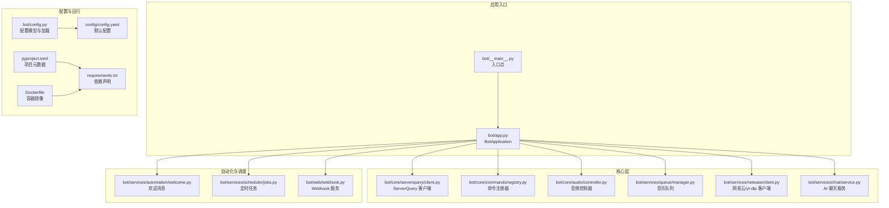
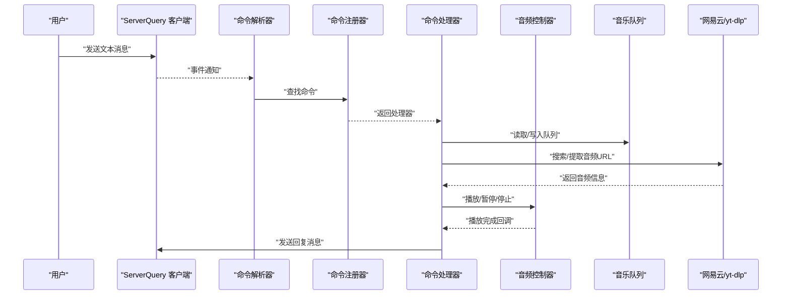
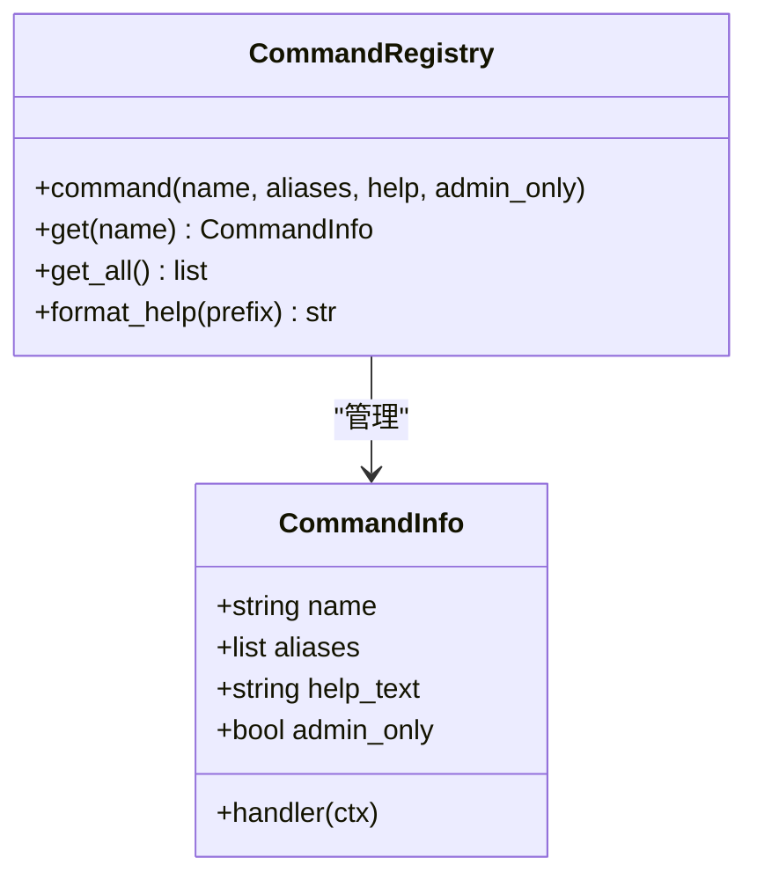
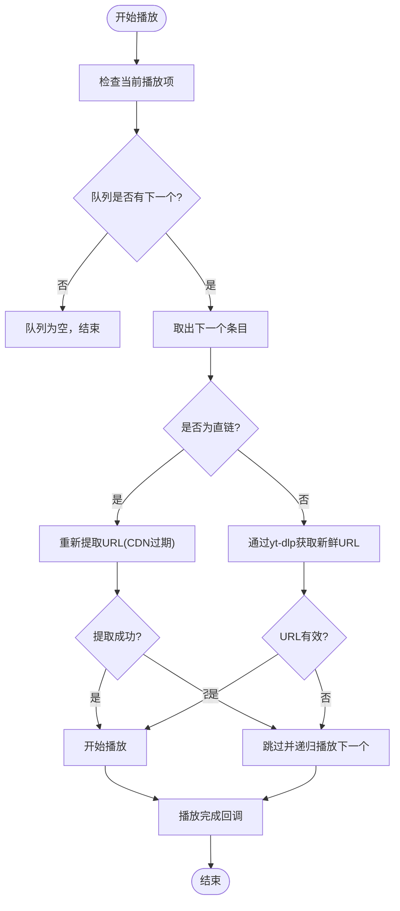
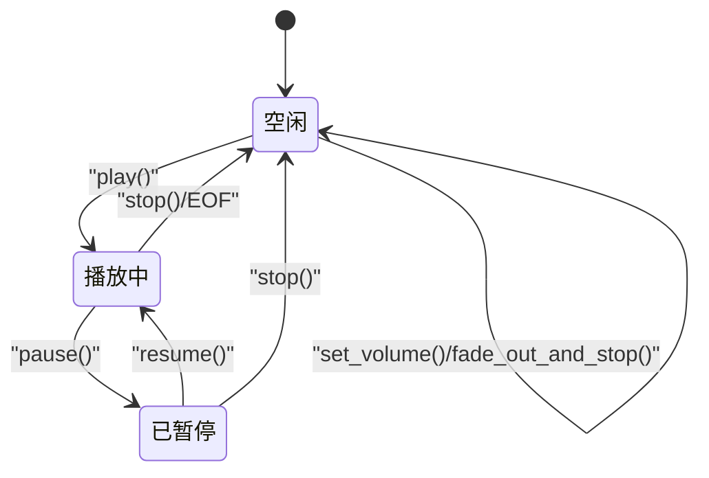
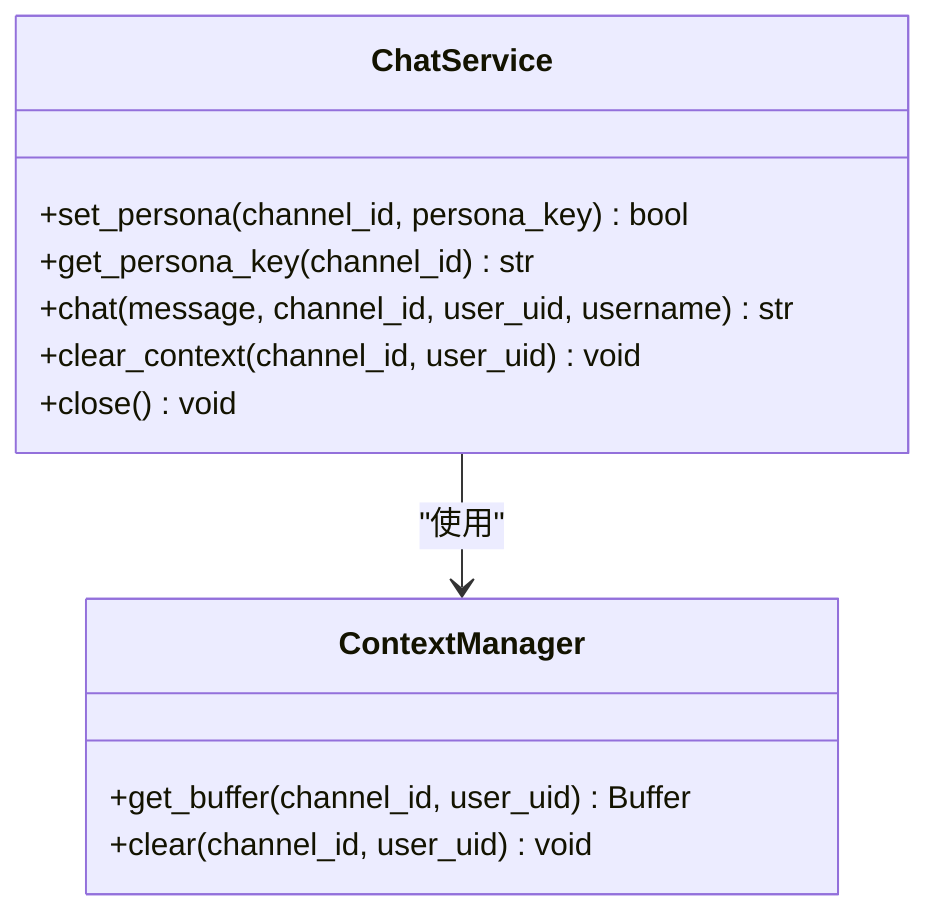
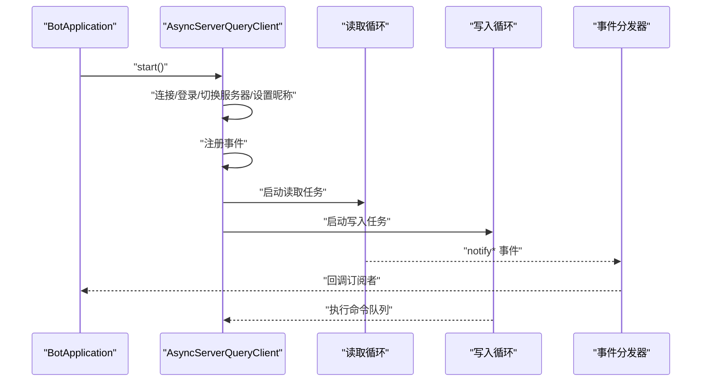
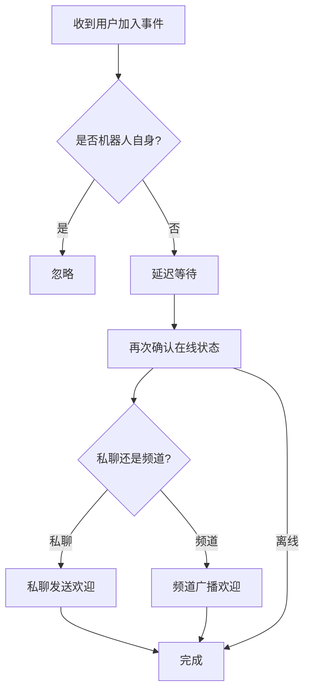
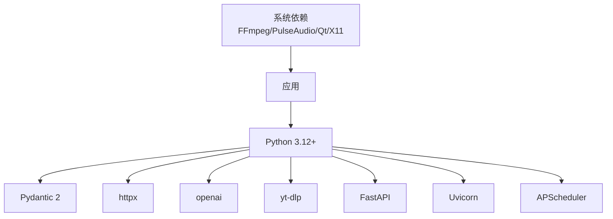

# 项目概述

<cite>
**本文档引用的文件**
- [bot/__main__.py](file://bot/__main__.py)
- [bot/app.py](file://bot/app.py)
- [bot/config.py](file://bot/config.py)
- [config/config.yaml](file://config/config.yaml)
- [pyproject.toml](file://pyproject.toml)
- [bot/core/commands/registry.py](file://bot/core/commands/registry.py)
- [bot/core/commands/handlers/music.py](file://bot/core/commands/handlers/music.py)
- [bot/core/audio/controller.py](file://bot/core/audio/controller.py)
- [bot/services/chat/service.py](file://bot/services/chat/service.py)
- [bot/services/netease/client.py](file://bot/services/netease/client.py)
- [bot/core/serverquery/client.py](file://bot/core/serverquery/client.py)
- [bot/services/queue/manager.py](file://bot/services/queue/manager.py)
- [bot/services/automation/welcome.py](file://bot/services/automation/welcome.py)
- [requirements.txt](file://requirements.txt)
- [Dockerfile](file://Dockerfile)
</cite>

## 目录
1. [引言](#引言)
2. [项目结构](#项目结构)
3. [核心组件](#核心组件)
4. [架构总览](#架构总览)
5. [详细组件分析](#详细组件分析)
6. [依赖分析](#依赖分析)
7. [性能考虑](#性能考虑)
8. [故障排除指南](#故障排除指南)
9. [结论](#结论)
10. [附录](#附录)

## 引言
本项目是一个为 TeamSpeak3 服务器提供自动化与娱乐服务的机器人，核心目标是通过异步架构实现稳定可靠的音乐播放、AI 聊天、用户管理与命令系统，提升语音频道的互动性与用户体验。项目采用模块化设计，围绕事件驱动与命令路由构建，确保高并发场景下的响应能力与可维护性。

## 项目结构
项目采用按功能域划分的模块化组织方式，核心目录与职责如下：
- bot/core：核心基础设施（音频、命令系统、ServerQuery 客户端）
- bot/services：业务服务（音乐、AI 聊天、自动化、调度）
- bot/utils：通用工具（格式化）
- bot/web：Webhook 接口（可选）
- config：配置文件（YAML）
- docker：容器化部署脚本与 PulseAudio 配置
- tests：单元测试

图表来源
- [bot/__main__.py:1-17](file://bot/__main__.py#L1-L17)
- [bot/app.py:1-348](file://bot/app.py#L1-L348)
- [bot/config.py:1-160](file://bot/config.py#L1-L160)
- [config/config.yaml:1-76](file://config/config.yaml#L1-L76)
- [pyproject.toml:1-35](file://pyproject.toml#L1-L35)
- [requirements.txt:1-10](file://requirements.txt#L1-L10)
- [Dockerfile:1-100](file://Dockerfile#L1-L100)

章节来源
- [bot/__main__.py:1-17](file://bot/__main__.py#L1-L17)
- [bot/app.py:27-111](file://bot/app.py#L27-L111)
- [bot/config.py:125-160](file://bot/config.py#L125-L160)
- [config/config.yaml:1-76](file://config/config.yaml#L1-L76)
- [pyproject.toml:1-35](file://pyproject.toml#L1-L35)
- [requirements.txt:1-10](file://requirements.txt#L1-L10)
- [Dockerfile:1-100](file://Dockerfile#L1-L100)

## 核心组件
- 应用编排器（BotApplication）：负责加载配置、实例化各子系统、建立连接、注册事件与命令处理器，并统一生命周期管理。
- 命令系统：基于装饰器的命令注册器，支持别名、帮助文本与管理员权限控制；命令解析器将文本消息路由至对应处理器。
- 音频子系统：封装 FFmpeg 流程与 PulseAudio 混音器，提供播放、暂停、恢复、音量渐变与回调事件。
- 音乐队列：多用户公平队列、投票跳过、重复模式、历史记录与格式化展示。
- 网易云/音视频提取：使用 yt-dlp 抽取音频 URL，支持多种平台（网易云、YouTube、B站、SoundCloud），并缓存搜索与歌词结果。
- AI 聊天服务：OpenAI 兼容 API 集成，支持多角色人设、通道级上下文隔离与令牌感知的上下文裁剪。
- ServerQuery 客户端：异步 Telnet 客户端，提供命令队列、事件分发、心跳保活与指数退避重连。
- 自动化与调度：欢迎消息、自动分组、跟随模式、定时提醒等扩展能力。
- Webhook：可选的 HTTP 服务，用于外部触发机器人行为。

章节来源
- [bot/app.py:27-111](file://bot/app.py#L27-L111)
- [bot/core/commands/registry.py:28-94](file://bot/core/commands/registry.py#L28-L94)
- [bot/core/audio/controller.py:24-143](file://bot/core/audio/controller.py#L24-L143)
- [bot/services/queue/manager.py:35-204](file://bot/services/queue/manager.py#L35-L204)
- [bot/services/netease/client.py:25-161](file://bot/services/netease/client.py#L25-L161)
- [bot/services/chat/service.py:15-115](file://bot/services/chat/service.py#L15-L115)
- [bot/core/serverquery/client.py:27-406](file://bot/core/serverquery/client.py#L27-L406)
- [bot/services/automation/welcome.py:17-71](file://bot/services/automation/welcome.py#L17-L71)

## 架构总览
系统采用“事件驱动 + 命令路由”的异步架构，核心流程如下：
- 启动阶段：加载配置 → 实例化服务 → 连接 ServerQuery → 注册命令与事件 → 启动后台服务（调度、Webhook、自动播放）。
- 运行阶段：接收文本消息 → 解析命令 → 查找处理器 → 执行命令 → 通过 ServerQuery 发送回复 → 音频播放与队列管理。
- 关闭阶段：优雅停机 → 停止 Webhook → 停止调度 → 音量渐变停止 → 关闭 AI 与网络客户端 → 断开 ServerQuery。

图表来源
- [bot/app.py:162-198](file://bot/app.py#L162-L198)
- [bot/core/commands/handlers/music.py:17-243](file://bot/core/commands/handlers/music.py#L17-L243)
- [bot/core/audio/controller.py:70-143](file://bot/core/audio/controller.py#L70-L143)
- [bot/services/queue/manager.py:90-147](file://bot/services/queue/manager.py#L90-L147)
- [bot/services/netease/client.py:68-96](file://bot/services/netease/client.py#L68-L96)

## 详细组件分析

### 命令系统与注册器
- 设计要点：装饰器式注册、别名映射、帮助文本生成、管理员权限控制。
- 处理流程：解析前缀与参数 → 查找命令 → 构造上下文 → 异步执行 → 错误捕获与回复。
- 价值主张：统一命令入口，便于扩展新命令与维护权限策略。

图表来源
- [bot/core/commands/registry.py:28-94](file://bot/core/commands/registry.py#L28-L94)

章节来源
- [bot/core/commands/registry.py:28-94](file://bot/core/commands/registry.py#L28-L94)
- [bot/app.py:140-151](file://bot/app.py#L140-L151)

### 音乐播放与队列
- 功能特性：URL 直播播放、CDN 链接重新提取、投票跳过、重复模式、歌词查询、队列格式化展示。
- 数据结构：双端队列 + 历史记录，支持公平调度与状态持久化（通过上下文）。
- 错误处理：链接失效自动跳过、播放错误回退、异常日志记录与用户提示。

图表来源
- [bot/core/commands/handlers/music.py:203-243](file://bot/core/commands/handlers/music.py#L203-L243)
- [bot/services/queue/manager.py:90-147](file://bot/services/queue/manager.py#L90-L147)
- [bot/services/netease/client.py:77-96](file://bot/services/netease/client.py#L77-L96)

章节来源
- [bot/core/commands/handlers/music.py:17-243](file://bot/core/commands/handlers/music.py#L17-L243)
- [bot/services/queue/manager.py:35-204](file://bot/services/queue/manager.py#L35-L204)
- [bot/services/netease/client.py:25-161](file://bot/services/netease/client.py#L25-L161)

### 音频控制器与播放状态机
- 状态机：空闲/播放中/已暂停，支持回调事件（完成、错误）。
- 音量控制：PulseAudio 输入刷新、渐变淡出、恢复音量。
- FFmpeg 集成：命令队列、错误处理、EOF 回调。

图表来源
- [bot/core/audio/controller.py:18-143](file://bot/core/audio/controller.py#L18-L143)

章节来源
- [bot/core/audio/controller.py:24-143](file://bot/core/audio/controller.py#L24-L143)

### AI 聊天服务与上下文管理
- 多人设：通过预定义系统提示实现不同角色风格。
- 上下文隔离：通道级与用户级上下文缓冲，支持令牌裁剪与消息序列管理。
- API 集成：OpenAI 兼容接口，温度、最大令牌数等参数可配置。

图表来源
- [bot/services/chat/service.py:15-115](file://bot/services/chat/service.py#L15-L115)

章节来源
- [bot/services/chat/service.py:15-115](file://bot/services/chat/service.py#L15-L115)

### ServerQuery 客户端与事件分发
- 连接管理：登录、虚拟服务器切换、昵称更新、事件注册。
- 事件分发：后台读取循环解析 notify 事件并分发给订阅者。
- 命令队列：串行化执行，超时与错误处理，心跳保活与指数退避重连。

图表来源
- [bot/core/serverquery/client.py:81-170](file://bot/core/serverquery/client.py#L81-L170)
- [bot/core/serverquery/client.py:201-290](file://bot/core/serverquery/client.py#L201-L290)

章节来源
- [bot/core/serverquery/client.py:27-406](file://bot/core/serverquery/client.py#L27-L406)

### 自动化与欢迎消息
- 欢迎消息：延迟发送、私聊/群发模式、连接状态校验。
- 可扩展：自动分组、跟随模式等自动化服务通过事件订阅接入。

图表来源
- [bot/services/automation/welcome.py:34-71](file://bot/services/automation/welcome.py#L34-L71)

章节来源
- [bot/services/automation/welcome.py:17-71](file://bot/services/automation/welcome.py#L17-L71)

## 依赖分析
- 语言与运行时：Python 3.12+，异步 I/O。
- 配置：Pydantic 2 + pydantic-settings 提供类型安全的配置模型与环境变量插值。
- 网络与 API：httpx、openai、yt-dlp、FastAPI + Uvicorn。
- 调度：APScheduler。
- 音频：FFmpeg（系统依赖）、PulseAudio（系统依赖）。
- 容器化：Dockerfile 提供完整运行环境与 TS3 客户端依赖。

图表来源
- [pyproject.toml:6-16](file://pyproject.toml#L6-L16)
- [requirements.txt:1-10](file://requirements.txt#L1-L10)
- [Dockerfile:7-59](file://Dockerfile#L7-L59)

章节来源
- [pyproject.toml:1-35](file://pyproject.toml#L1-L35)
- [requirements.txt:1-10](file://requirements.txt#L1-L10)
- [Dockerfile:1-100](file://Dockerfile#L1-L100)

## 性能考虑
- 异步 I/O：ServerQuery、HTTP 请求与音频播放均采用异步，避免阻塞主线程。
- 队列与缓存：音乐队列采用列表与双端队列组合，TTL 缓存减少重复请求。
- 音频链路：CDN 链接即时提取、渐变淡出避免爆音、PulseAudio 输入刷新保证音量控制生效。
- 资源回收：优雅停机时先淡出再停止，释放网络与音频资源，降低重启抖动。
- 可观测性：配置化日志级别与文件轮转，便于生产环境问题排查。

## 故障排除指南
- 无法连接 ServerQuery
  - 检查主机、端口、凭据与虚拟服务器 ID 是否正确。
  - 观察重连日志，确认网络连通性与防火墙策略。
- 音频无声或爆音
  - 确认 PulseAudio 配置与混音器名称一致。
  - 检查 FFmpeg 路径与权限，确认缓存目录可写。
- 播放链接失效
  - 系统会自动重新提取 URL；若持续失败，检查 yt-dlp 支持的站点与网络代理。
- 命令无响应
  - 确认命令前缀与大小写，检查命令注册日志。
  - 检查管理员权限与上下文回复是否被吞没异常。
- Webhook 未启动
  - 确认配置开关与端口未被占用，查看启动日志。

章节来源
- [bot/core/serverquery/client.py:183-198](file://bot/core/serverquery/client.py#L183-L198)
- [bot/core/audio/controller.py:114-129](file://bot/core/audio/controller.py#L114-L129)
- [bot/services/netease/client.py:77-96](file://bot/services/netease/client.py#L77-L96)
- [bot/app.py:255-282](file://bot/app.py#L255-L282)

## 结论
本项目以异步与模块化为核心设计思想，围绕 TeamSpeak3 的 ServerQuery 事件流构建命令与自动化体系，结合音乐播放、AI 聊天与用户管理，形成完整的语音频道自动化解决方案。其清晰的职责边界、完善的错误处理与可观测性设计，使其具备良好的可维护性与扩展性，适合中小型团队与社区语音频道的日常运营需求。

## 附录
- 配置文件位置与优先级：优先加载本地路径，其次尝试系统路径；支持环境变量插值。
- 默认命令前缀：可通过配置修改；默认为“!”。
- 容器化部署：Dockerfile 内置 PulseAudio、FFmpeg 与 TS3 客户端依赖，建议配合 docker-compose 使用。

章节来源
- [bot/config.py:136-160](file://bot/config.py#L136-L160)
- [config/config.yaml:1-76](file://config/config.yaml#L1-76)
- [Dockerfile:1-100](file://Dockerfile#L1-L100)